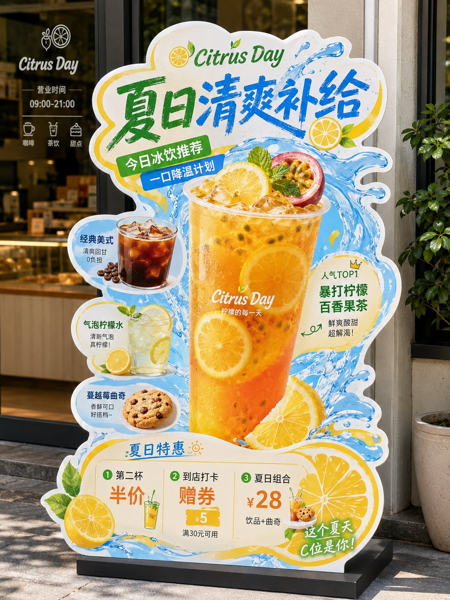

<!-- GENERATED from version JSON, sidecar metadata and personal corrections. Do not edit this reading copy. -->
# 本地生活小店异形展架

[返回画廊总览](../../docs/gallery.md) · [版本与来源记录](case.json)

案例编号：`case-awesome-gpt-image-2-470-cb126e684ac1` · 版本：`v1`

版本说明：首次收录

资料类型：案例 · 复核状态：未补充复核 / 待复核

复核说明：已机械读取完整 prompt 与资产路径、哈希并比对本地上游画廊；未检出需补特定原图的明确证据。未全量逐图审，模型家族仅据来源集合声明，实际版本未知。 审核只涉及资料输入要求/资产角色，不包含重新生图、身份一致性或像素复现验证。

## 案例图片

### 图片 1 · 角色待复核

来源角色：`source_example`

角色依据：原始记录标 source_example；本轮未看此图，不能自动将其升级为已验证 output。



## 完整提示词

```text
《餐饮异形展架/立牌物料》提示词：

请生成一张高完成度的「餐饮异形展架 / 立牌」设计图，用于展示餐饮门店的新品推荐、招牌产品、套餐促销或品牌活动信息。

【基础信息】
品牌名：【品牌名】
主标题：【主标题】
副标题：【副标题】
辅助短句：【短句1】｜【短句2】｜【短句3】
主题方向：【主题方向，例如：爆辣夜市风 / 金黄浓郁风 / 清新轻食风 / 山野自然风 / 甜品下午茶风 / 快餐促销风】
主色调：【主色调】
辅助色：【辅助色】
点缀色：【点缀色】
画幅比例：【建议 3:4 竖版】

【产品内容】
主推产品：【主推产品】
辅助产品1：【辅助产品1】
辅助产品2：【辅助产品2】
辅助产品3：【辅助产品3】
辅助产品4：【辅助产品4】
加料 / 配角产品：【加料或配角产品，例如：饮品 / 小食 / 配菜 / 酱料 / 甜品】

【卖点标签】
【卖点1】
【卖点2】
【卖点3】
【卖点4】
【卖点5】
【卖点6】

【促销信息】
【促销信息1】
【促销信息2】
【促销信息3】

【最重要要求】
避免生成门店场景效果图或墙上海报展示图。请直接生成“一张完整的异形立牌成品展示图”：
- 背景必须为纯白色
- 画面中只保留一个完整的异形餐饮立牌主体
- 不要餐厅环境
- 不要商场背景
- 不要玻璃门、桌椅、墙面、人物、地面透视场景
- 不要任何真实空间背景
- 立牌主体必须完整显示
- 异形轮廓必须完整清晰
- 底座必须完整露出
- 整体像一张已经抠好的门店物料成品图 / 设计提案展示图 / 电商展示图

【画面形式】
这是一张“门店异形展架 / 立牌”的完整设计，避免普通矩形海报处理。
整体应采用明显的“不规则异形裁切轮廓”，有完整外边缘，边缘可带白色或浅色描边，具有真实门店物料感。
立牌应有明确底座，整体像可落地摆放的 KT 板 / 泡沫板 / 亚克力 / 写真喷绘展架成品。

【构图结构】
整体采用竖版、中心聚焦、信息分层清楚的结构：

1. 顶部区域：
放超大主标题，标题必须醒目、有冲击力、有餐饮 POP 招贴感。
字体可以厚重、手写感、招贴感、潮流感，但要清晰易读。
标题是整张图的第一视觉焦点。

2. 中部核心区域：
中间放最大主推产品，作为主视觉主体。
主菜必须最大、最饱满、最诱人，突出食欲感。
围绕主菜搭配 2~5 个辅助产品，形成丰富的产品组合，前后层次明确，主次分明。

3. 周边信息区域：
在主菜和辅助产品四周加入少量标签元素、推荐标、贴纸框、手写箭头、卖点说明、小标题、小气泡标签等，使其具有“餐饮门店促销物料”的视觉特征。
但要控制层级，做到“热闹但不乱”。

4. 底部促销区域：
底部放价格信息、套餐信息、活动信息或新品尝鲜信息。
价格数字要相对突出，易读清晰。
如果没有特别要求，默认不要二维码。

【视觉风格要求】
整体风格应属于“餐饮转化型视觉 + 门店 POP 异形立牌”：
- 强调食欲感
- 强调信息可读性
- 强调商业落地感
- 强调门店物料感
- 强调异形轮廓感

避免极简杂志海报、电商详情页、纯平面插画海报方向。

【食物表现要求】
所有食物必须采用真实商业美食摄影质感：
- 食物清晰真实
- 有食材颗粒感
- 有酱汁、汤汁、油光、热气、层次感
- 有丰富细节，如葱花、辣椒、芝士、香草、蔬菜、水果、虾仁、肉块等
- 主食要饱满，不能扁平
- 看起来必须“能激发食欲”
禁止过度插画化、卡通化、低质拼贴化。

【版式与信息层级】
整张立牌的阅读顺序应为：
主标题 → 主推产品 → 辅助产品 → 卖点标签 → 价格 / 活动信息

信息量可以较丰富，但必须有明确层级：
- 主标题最大
- 主菜次大
- 辅助菜稍小
- 卖点标签较小
- 底部促销清晰醒目

【适配范围】
该模板需要适用于不同主题餐饮内容，例如：
- 面 / 饭 / 粉 / 小吃
- 火锅 / 菌汤 / 地方菜
- 轻食 / 沙拉 / 咖啡简餐
- 早餐 / 套餐 / 快餐
- 茶饮 / 甜品 / 下午茶
- 节日促销 / 新品上市 / 爆品推荐 / 双人套餐

【输出要求】
请输出一张高清、清晰、商业完成度高的异形立牌设计图，满足以下条件：
- 白色背景
- 完整异形轮廓
- 完整底座
- 只展示立牌本体
- 不带真实场景环境
- 不带人物
- 不带门店背景
- 默认不带二维码
- 适合用于系列案例展示、设计提案、社交媒体发布、模板复用
```

[查看原始来源](https://x.com/MrLarus/status/2059248197910827364)
