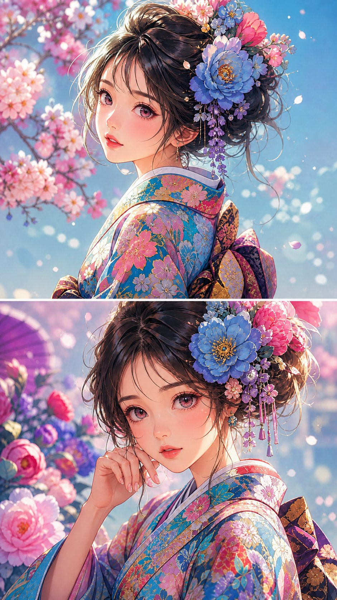

<!-- GENERATED from version JSON, sidecar metadata and personal corrections. Do not edit this reading copy. -->
# 花簪和服动漫肖像

[返回画廊总览](../../docs/gallery.md) · [版本与来源记录](case.json)

案例编号：`case-awesome-gpt-image-2-471-4ed64dcac2cd` · 版本：`v1`

版本说明：首次收录

资料类型：案例 · 复核状态：已复核

复核说明：已实际看图并阅读全文。两幅花簪和服动漫肖像拼接；全文指定风格花饰，两幅均为结果示例。 本次核对资料关系、图片角色和输入条件，不代表身份、事实或逐像素生成正确性验收。

## 案例图片

### 图片 1 · 输出效果图

来源角色：`source_example`

角色依据：两幅花簪和服动漫肖像拼接；全文指定风格花饰，两幅均为结果示例。



## 完整提示词

```text
Ultra-detailed anime-style portrait of a young girl with large expressive eyes, soft blush cheeks, and delicate facial features. She wears a vibrant floral kimono with intricate colorful patterns. Large blooming flowers are placed in her hair like accessories. Smooth gradient warm background in coral and peach tones. Soft cinematic lighting, dreamy atmosphere, high-end digital illustration
```

[查看原始来源](https://x.com/Mind_Boticni/status/2059133066694779343)
