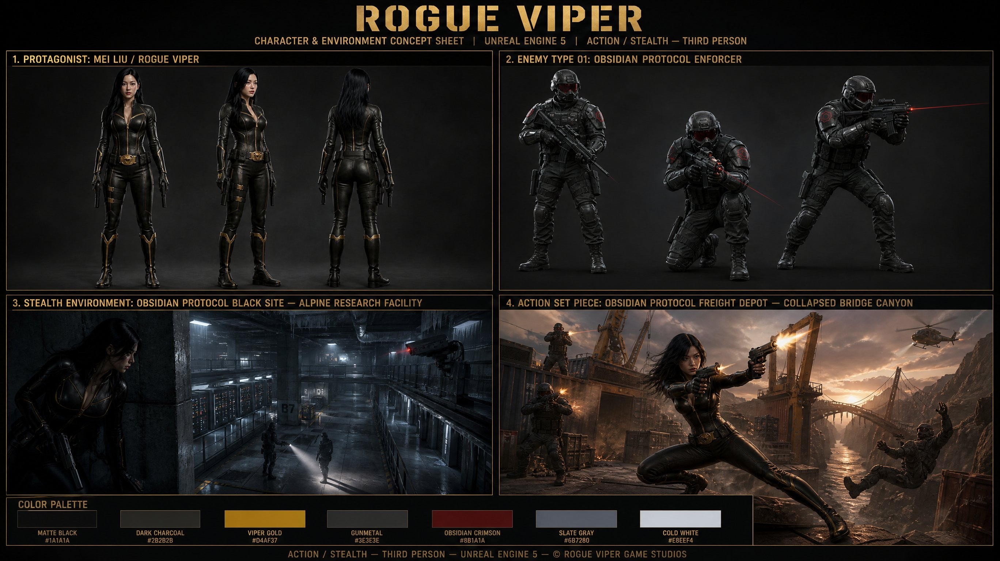

<!-- GENERATED from version JSON. Do not edit this reading copy. -->
# ROGUE VIPER 游戏概念设定板

[返回画廊总览](../../docs/gallery.md) · [版本与来源记录](case.json)

案例编号：`case-awesome-gpt-image-2-473-7b4b6261b32a` · 版本：`v1`

版本说明：首次收录

## 案例图片



## 完整提示词

```text
**ROGUE VIPER — VIDEO GAME CONCEPT ART SHEET PROMPT**

---

Official AAA video game concept art sheet titled **'ROGUE VIPER'** for an Unreal Engine 5 third-person action-stealth game. Professional game development documentation layout on a dark charcoal #1A1A1A background with gold stencil label typography throughout. Four clearly labeled panels arranged in a 2×2 grid with a header and footer.

---

**SHEET HEADER** — Bold gold stencil font title text: **ROGUE VIPER** centered at top. Subtitle beneath in smaller tracking-heavy label font: **CHARACTER & ENVIRONMENT CONCEPT SHEET | UNREAL ENGINE 5 | ACTION / STEALTH — THIRD PERSON**

---

**PANEL 1 — TOP LEFT — Label: "PROTAGONIST: MEI LIU / ROGUE VIPER"**

Full-body character turntable reference of a 30-year-old East Asian Chinese-American female operative. Athletic and toned, 5'8", long straight black hair worn loose, calm neutral expression with sharp eyes. Wearing a form-fitting matte black tactical bodysuit with gold accent seams running along the shoulders, forearms, and thighs, gold cobra snake belt buckle at the waist, calf-high black tactical boots with subtle gold trim. Armed with twin suppressed 9mm pistols holstered on each hip with custom viper-scale grip texture, a serrated combat knife sheathed vertically on the right thigh, and a compact pneumatic grappling hook launcher mounted on the left forearm. Three views arranged side-by-side: front, 3/4, and back. Unreal Engine 5 physically-based rendering, photorealistic skin and fabric materials, neutral 3-point studio lighting for maximum clarity, gold and matte black color scheme throughout.

---

**PANEL 2 — TOP RIGHT — Label: "ENEMY TYPE 01: OBSIDIAN PROTOCOL ENFORCER"**

Three enemy soldiers shown as character references against a dark background. These are elite private military contractors working for a shadow arms cartel called Obsidian Protocol. Their uniform: slate-gray and black modular plate carriers with deep crimson geometric hex-patch insignia on the shoulder, full-face ballistic visors with a dark red tinted lens, black tactical gloves, reinforced combat boots. Armed with compact bullpup assault rifles with red laser sights. One figure standing in neutral patrol stance, one crouched in a ready alert position, one depicted mid-aim with rifle raised. All three shown at the same scale for comparison. Same UE5 photorealistic PBR render style. Crimson and slate-gray color language to contrast Viper's gold and black.

---

**PANEL 3 — BOTTOM LEFT — Label: "STEALTH ENVIRONMENT: OBSIDIAN PROTOCOL BLACK SITE — ALPINE RESEARCH FACILITY"**

Wide cinematic establishing shot of a stealth mission environment. A hidden high-altitude research facility buried inside a snow-covered mountain, accessible only via an underground tram. Interior architecture is brutalist concrete and frosted glass, dimly lit with cold white fluorescent overhead strips and amber emergency lighting casting long dramatic shadows across polished concrete floors. Rows of classified server terminals and cryogenic storage units line the walls. Ventilation shafts visible in the ceiling above catwalks. A security camera sweeps a slow arc over a central corridor below. In the foreground, Rogue Viper is pressed flat against a concrete pillar in deep shadow, body low, watching two Obsidian Protocol enforcers on patrol below, one holding a flashlight. The scene communicates tension, patience, and tactical opportunity. Unreal Engine 5 Lumen global illumination, volumetric cold air haze, photorealistic ice and concrete materials, deep crushed blacks with cold white and amber lighting contrast. Cinematic wide 2.39:1 style composition within the panel.

---

**PANEL 4 — BOTTOM RIGHT — Label: "ACTION SET PIECE: OBSIDIAN PROTOCOL FREIGHT DEPOT — COLLAPSED BRIDGE CANYON"**

Wide cinematic action shot of a high-octane firefight environment. A sprawling open-air industrial freight depot at the edge of a sheer cliff canyon at dusk, with a collapsed suspension bridge dangling over the chasm below. Shipping containers and heavy crane equipment provide cover geometry. Rogue Viper is captured mid-movement in a dynamic gunfight pose — body low, both suppressed pistols raised and firing, muzzle flashes illuminating her face with sharp white light. Three Obsidian Protocol enforcers are positioned around her — one diving behind a container, one firing from atop a crane platform, one falling backward off the edge of the depot platform. Background: deep canyon with a river of orange reflected sunset light far below, dust and smoke rising from the firefight, a military helicopter approaching in the far distance. Warm dusk amber and cool canyon shadow blue provide dramatic color contrast. UE5 ray-traced reflections on metal container surfaces, particle systems for dust and muzzle smoke, cinematic depth of field on background elements.

---

**SHEET FOOTER** — Color palette chip row along the bottom of the sheet: matte black #1A1A1A, dark charcoal #2B2B2B, viper gold #D4AF37, gunmetal #3E3E3E, obsidian crimson #8B1A1A, slate gray #6B7280, cold white #E8EEF4. Label above chips: **COLOR PALETTE**. Footer text beneath: **ACTION / STEALTH — THIRD PERSON — UNREAL ENGINE 5 — © ROGUE VIPER GAME STUDIOS**

---

**UNIVERSAL STYLE CONSTRAINTS — APPLY TO ALL PANELS:**
Photorealistic only throughout the entire sheet. No anime, no cartoon, no stylized illustration, no cel shading, no comic book rendering. Unreal Engine 5 cinematic render quality with physically-based materials. Anamorphic lens character on all environment shots. Crushed blacks and desaturated mid-tones across all panels. Professional AAA game studio concept documentation format comparable to Naughty Dog, Ubisoft, or Guerrilla Games internal production art.
```

[查看原始来源](https://x.com/KimAkiyama81/status/2059394334378566063)
