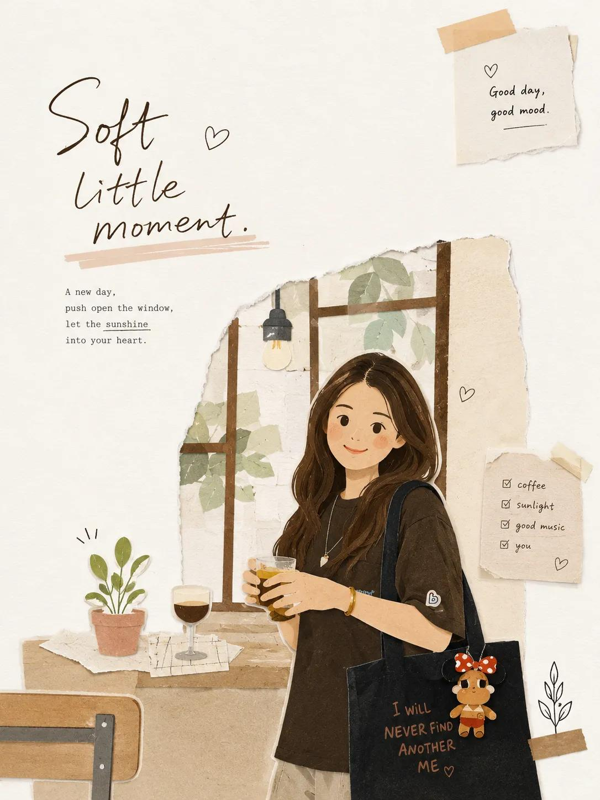

<!-- GENERATED from version JSON, sidecar metadata and personal corrections. Do not edit this reading copy. -->
# 杂志纸艺拼贴重绘

[返回画廊总览](../../docs/gallery.md) · [版本与来源记录](case.json)

案例编号：`case-awesome-gpt-image-2-479-2d467cd5c007` · 版本：`v1`

版本说明：首次收录

资料类型：案例 · 复核状态：已复核

复核说明：已核对原文输入要求与当前示例图；这是通用可替换主体/照片/标志模板，实际执行须由使用者提供相应输入，未发现必须另补某一指定源文件的明确要求。 审核只涉及资料输入要求/资产角色，不包含重新生图、身份一致性或像素复现验证。

## 案例图片

### 图片 1 · 输出效果图

来源角色：`source_example`

角色依据：已看图，主体为提示词描述的完成后视觉示例；不从输出内容推定原始输入存在。



## 完整提示词

```text
Transform the uploaded image into a minimalist illustration in a magazine collage style, using paper cutouts. Retain the main subject, pose, and overall concept of the original image, but reimagine it as a warm, hand-edited collage. Style: Minimalist illustration in a magazine paper collage style, with flat, layered paper shapes, soft pastel paper textures, torn paper edges, paper shadow effects, neat black doodle accents, a handmade scrapbook atmosphere, modern Korean editorial design, a simple and cute composition, and large areas of clean white space. Character: Cute, simplified Korean characters with minimalist facial features, a small, relaxed smile, soft and rounded proportions, simple and casual clothing, and silhouettes constructed from layered paper cutouts. Composition: A 3:4 aspect ratio, with the main subject positioned slightly lower and off-center, leaving a large, open space on the opposite side for a breezy, minimalist composition that avoids clutter. Objects: Add only a few suitable collage elements: paper sticky notes, small hearts, plants, a cup of coffee, a window, tape fragments, and simple doodle icons. Typography: Add an elegant, handwritten English title that fits the scene's atmosphere. Use short phrases such as: ["May you be like the morning sunshine, full of vitality and hope, embracing the beauty of each day.","Take a small break," or "Good day, good mood."] Atmosphere: Calm, comfortable, warm, sweet, and editorial style. Avoid: Photorealistic style, anime style, watercolor style, 3D clay style, overly detailed backgrounds, excessive collage elements, a luxury poster atmosphere, dark tones, harsh shadows, and sloppy text.
```

[查看原始来源](https://x.com/oggii_0/status/2060212097083146644)
