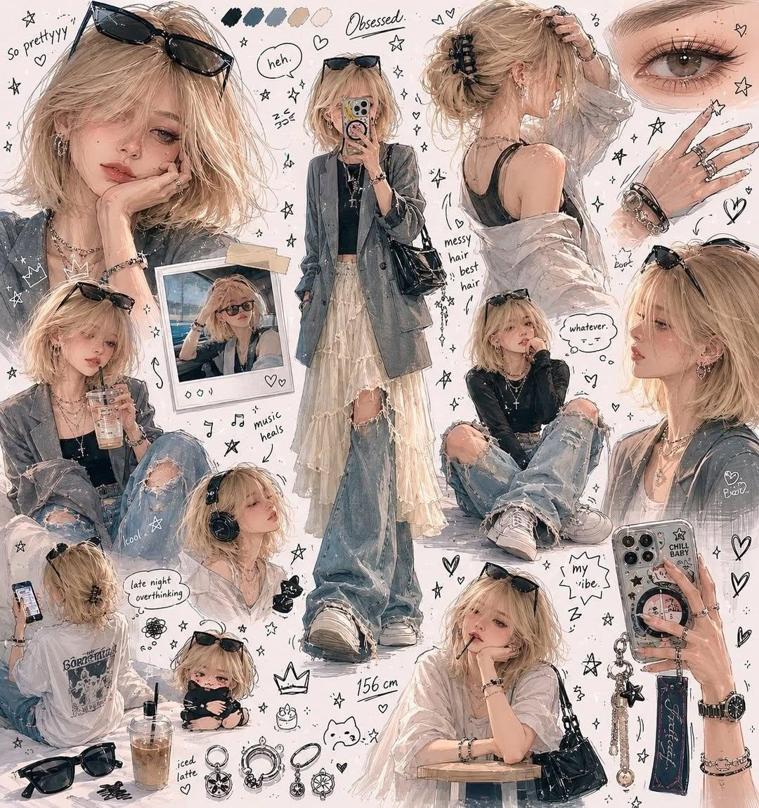

<!-- GENERATED from version JSON. Do not edit this reading copy. -->
# 粉丝速写本角色页

[返回画廊总览](../../docs/gallery.md) · [版本与来源记录](case.json)

案例编号：`case-awesome-gpt-image-2-480-efebb4b75683` · 版本：`v1`

版本说明：首次收录

## 案例图片



## 完整提示词

```text
Draw me as if an obsessed fan artist filled an entire sketchbook page - messy, overlapping, full-body poses, tiny chibi doodles, exaggerated expressions, and random close-ups of their hands or eyes.
White background. No grid, no order. Pure chaos energy. With (any color) aesthetic clothes
```

[查看原始来源](https://x.com/Ciri_ai/status/2060211436232786357)
