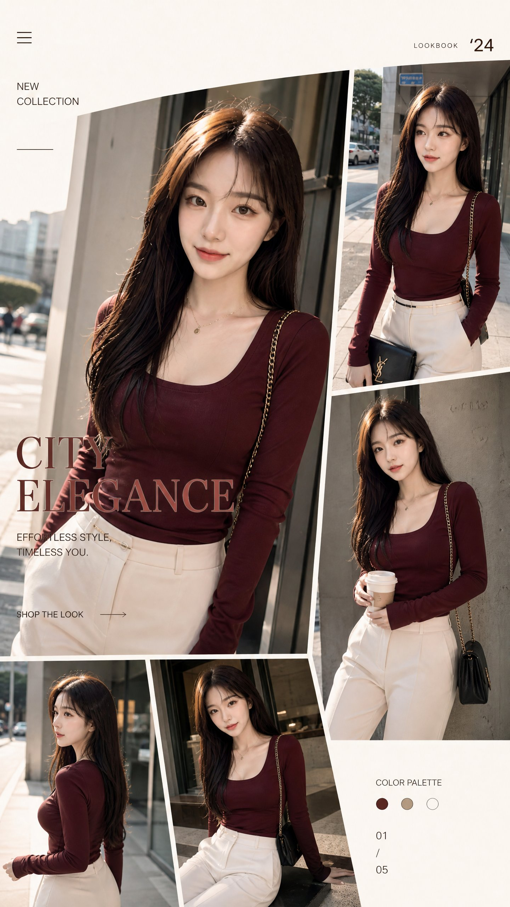

<!-- GENERATED from version JSON. Do not edit this reading copy. -->
# 时尚目录电商拼贴

[返回画廊总览](../../docs/gallery.md) · [版本与来源记录](case.json)

案例编号：`case-awesome-gpt-image-2-485-8d2218c84a86` · 版本：`v1`

版本说明：首次收录

## 案例图片



## 完整提示词

```text
Stylish fashion catalog shoot blending streetwear and luxury branding. Female model wearing burgundy slim-fit top and ivory tailored pants, posed in confident relaxed positions across multiple duplicated frames. Slight perspective tilt, dynamic layout collage, soft daylight studio lighting with warm tone grading. Modern shopping website aesthetic, minimal UI-inspired composition, high resolution fashion photography.
```

[查看原始来源](https://x.com/Mind_Boticni/status/2061310969192870028)
