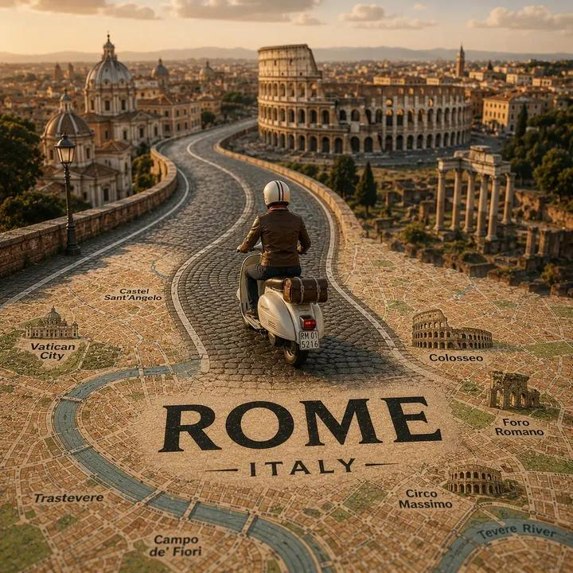

<!-- GENERATED from version JSON, sidecar metadata and personal corrections. Do not edit this reading copy. -->
# 城市地图微缩旅行海报

[返回画廊总览](../../docs/gallery.md) · [版本与来源记录](case.json)

案例编号：`case-awesome-gpt-image-2-489-67f22f154217` · 版本：`v1`

版本说明：首次收录

资料类型：案例 · 复核状态：已复核

复核说明：ROME 地图上弯曲道路与踏板车微缩旅行海报，城市车辆可替换。已实际看样图并阅读完整 prompt；复核资料关系与输入条件，不代表生成复现或逐项事实准确性验收。

## 案例图片

### 图片 1 · 输出效果图

来源角色：`source_example`

角色依据：ROME 地图上弯曲道路与踏板车微缩旅行海报，城市车辆可替换



## 完整提示词

```text
Create a highly detailed cinematic miniature tilt-shift travel scene of [CITY NAME] featuring a realistic [VEHICLE NAME] driving along a winding elevated road that emerges naturally from a printed vintage-style city map. The road should curve dramatically toward the background skyline and landmarks of [CITY NAME], while the vehicle remains the clear focal point in the foreground.

Blend the real city seamlessly with the illustrated map surface so the road appears integrated into the map itself. Include recognizable local landmarks, waterways, architecture, vegetation, and atmosphere associated with [CITY NAME], but keep the composition clean and uncluttered.

Show large bold typography of "[CITY NAME]" printed directly on the map in the foreground. Use warm golden-hour lighting, shallow depth of field, realistic textures, cinematic shadows, aerial perspective, and photorealistic detail. The overall aesthetic should feel like a premium Instagram travel poster mixed with a miniature diorama.

Aspect ratio 1:1.
```

[查看原始来源](https://x.com/SimplyAnnisa/status/2062358269172101240)
