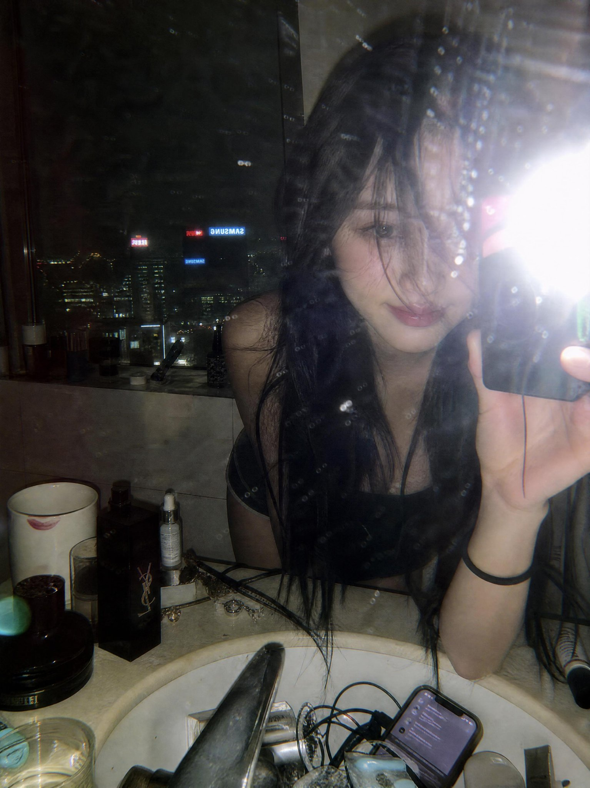

<!-- GENERATED from version JSON. Do not edit this reading copy. -->
# Y2K 高楼浴室镜面自拍

[返回画廊总览](../../docs/gallery.md) · [版本与来源记录](case.json)

案例编号：`case-awesome-gpt-image-2-491-90d8a82e2c9f` · 版本：`v1`

版本说明：首次收录

## 案例图片



## 完整提示词

```text
A moody late-night mirror selfie captured in a luxury high-rise bathroom overlooking a glowing city skyline. A young woman with long, slightly messy black hair leans forward over a marble sink, partially obscuring one eye with loose strands. The photo is taken through a smudged mirror with visible dust particles, water spots, and imperfections, creating an authentic raw aesthetic. A powerful direct camera flash explodes in the frame, producing harsh highlights, lens flare, and a nostalgic early-2000s digital camera look.

The bathroom counter is cluttered with luxury cosmetics, skincare products, jewelry, a smartphone, and everyday personal items, adding a lived-in editorial feel. Reflections of neon-lit skyscrapers and hotel windows shimmer in the background, emphasizing an urban nightlife atmosphere. Soft pale skin tones contrast against dark clothing and black hair. The composition feels intimate, candid, and effortlessly cool.

Style: Y2K flash photography, candid mirror selfie, Korean editorial aesthetic, indie sleaze, hotel bathroom scene, luxury lifestyle, cinematic nightlife, disposable camera look, grainy texture, flash burn, realistic skin texture, shallow depth of field, authentic imperfections, viral Pinterest mood, high-fashion casual energy, raw unfiltered photography.

Camera: direct flash, compact digital camera, 35mm equivalent, harsh lighting, slight motion blur, visible noise, natural color grading, vertical composition, ultra-realistic, high detail.
```

[查看原始来源](https://x.com/jzaib4269/status/2062184740849930384)
