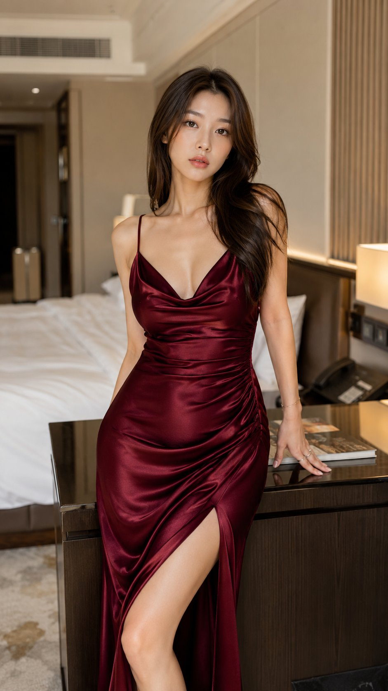

<!-- GENERATED from version JSON, sidecar metadata and personal corrections. Do not edit this reading copy. -->
# 黑色高定酒店套房写真

[返回画廊总览](../../docs/gallery.md) · [版本与来源记录](case.json)

案例编号：`case-awesome-gpt-image-2-492-5ae676828ad8` · 版本：`v1`

版本说明：首次收录

资料类型：案例 · 复核状态：未补充复核 / 待复核

复核说明：已机械读取完整 prompt 与资产路径、哈希并比对本地上游画廊；未检出需补特定原图的明确证据。未全量逐图审，模型家族仅据来源集合声明，实际版本未知。 审核只涉及资料输入要求/资产角色，不包含重新生图、身份一致性或像素复现验证。

## 案例图片

### 图片 1 · 角色待复核

来源角色：`source_example`

角色依据：原始记录标 source_example；本轮未看此图，不能自动将其升级为已验证 output。



## 完整提示词

```text
Create a hyper-realistic luxury fashion portrait inspired by premium fashion-week editorials.

IMPORTANT:
Generate ONLY ONE SINGLE VERTICAL IMAGE.

STYLE:
Luxury fashion realism.
Professional couture photography.
Premium editorial atmosphere.

MAIN CONCEPT:
A beautiful adult Asian fashion model photographed inside a luxury hotel suite.

OUTFIT:
Elegant black couture mini dress.
Luxury embroidered details.
Premium designer fashion aesthetic.

BACKGROUND:
Luxury hotel interior.
Soft neutral decor.
Elegant cinematic depth blur.

LIGHTING:
Soft luxury window lighting.
Professional fashion-editorial reflections.
Natural skin texture.

MOOD:
Bold.
Elegant.
High-fashion energy.

QUALITY:
Ultra realistic native 4K HDR realism.
Professional magazine quality.
Vertical 9:16.
```

[查看原始来源](https://x.com/xRahultripathi/status/2062100757923733617)
