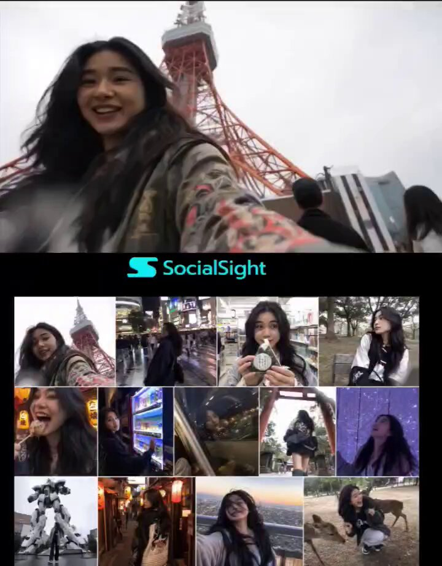

<!-- GENERATED from version JSON, sidecar metadata and personal corrections. Do not edit this reading copy. -->
# 东京旅行 13 格视频封面

[返回画廊总览](../../docs/gallery.md) · [版本与来源记录](case.json)

案例编号：`case-awesome-gpt-image-2-493-b9de32d3fb52` · 版本：`v1`

版本说明：首次收录

资料类型：案例 · 复核状态：未补充复核 / 待复核

复核说明：已机械读取完整 prompt 与资产路径、哈希并比对本地上游画廊；未检出需补特定原图的明确证据。未全量逐图审，模型家族仅据来源集合声明，实际版本未知。 审核只涉及资料输入要求/资产角色，不包含重新生图、身份一致性或像素复现验证。

## 案例图片

### 图片 1 · 角色待复核

来源角色：`source_example`

角色依据：原始记录标 source_example；本轮未看此图，不能自动将其升级为已验证 output。



## 完整提示词

```text
Generate image of young female travel vlogger exploring Tokyo across multiple candid moments, extremely beautiful with long dark wavy hair, wearing stylish Japanese-inspired oversized streetwear, expressive and spontaneous personality, captured across a 13-frame grid collage (Row 1: 4 frames | Row 2: 5 frames | Row 3: 4 frames), each frame feels like a real casual phone capture with imperfect framing and natural inconsistencies.

Frame Breakdown

Row 1 - Frame 1 (Tokyo Tower): low angle selfie with Tokyo Tower behind her, slightly tilted horizon, sky overexposed to near white, she's mid-natural smile adjusting into frame, small lens smudge in corner, candid arrival energy.
Row 1 - Frame 2 (Shibuya street level): walking through Shibuya crossing at night, handheld motion blur, she glances back at camera mid-step, neon reflections on wet pavement, slightly shaky framing, imperfect crop.
Row 1 - Frame 3 (Convenience store): inside a brightly lit convenience store, she is holding onigiri close to camera, playful raised eyebrows, harsh fluorescent lighting flattening the scene, slight overexposure on whites, shelves softly blurred behind.
Row 1 - Frame 4 (Yoyogi park): sitting on a bench under trees, looking away from camera, quiet candid moment, soft dappled daylight, slight focus miss on eyes, subtle lens smudge bottom corner.
Row 2 - Frame 5 (Takoyaki reaction): close-up while eating single takoyaki, reacting mid-bite with laughter, slight motion blur, warm lantern light behind, face slightly out of focus due to movement.
Row 2 - Frame 6 (Vending machine night): standing in front of glowing vending machine, blue and pink light casting uneven tones on her face, pressing button casually, high ISO grain visible.
Row 2 - Frame 7 (Train reflection): her face reflected in train window at night, city lights streaking behind, layered reflection effect, slight ghosting on glass, she looks away from camera.
Row 2 - Frame 8 (Torii gate): low angle shot of her walking through a torii gate, captured from slightly behind, motion blur in her movement, bright sky causing mild lens flare.
Row 2 - Frame 9 (Digital art exhibit): inside immersive light exhibit, colored lights (blue, violet, gold) washing across her face, she looks upward in awe, slight motion blur, low-light noise visible.
Row 3 - Frame 10 (Gundam statue): low angle wide shot, she stands small in frame while large statue towers above, slight barrel distortion from phone lens, sky slightly blown out.
Row 3 - Frame 11 (Lantern alley): walking through narrow alley lit by warm lanterns, shot from behind, she glances back briefly, underexposed shadows, grainy night detail.
Row 3 - Frame 12 (Rooftop skyline): selfie with Tokyo skyline behind, arm extended, wind blowing hair partially across lens, horizon slightly tilted, warm city glow overexposed in distance.
Row 3 - Frame 13 (Nara park): crouching down in a park in Nara, she holds out a deer cracker toward a deer, the deer bows its head toward her, she bursts into genuine laughter mid-reaction, surprised and slightly leaning back, another deer nudges her from behind causing her to lose balance slightly, camera captures the moment imperfectly with slight shake and off-center framing, soft natural daylight, open park background with trees and space, unscripted chaotic energy, candid expression.

Young female travel vlogger exploring Tokyo across 13 candid moments in a grid collage, extremely beautiful with long dark wavy hair, wearing stylish Japanese streetwear, expressive and spontaneous, scenes include Tokyo Tower selfie, Shibuya crossing at night, convenience store snack moment, park bench quiet scene, takoyaki reaction, vending machine glow, train window reflection, torii gate walk, immersive light exhibit, Gundam statue low angle, lantern alley walk, rooftop skyline selfie, Harajuku street ending, each frame slightly imperfect with motion blur.
```

[查看原始来源](https://x.com/AIwithSynthia/status/2062383568253505904)
