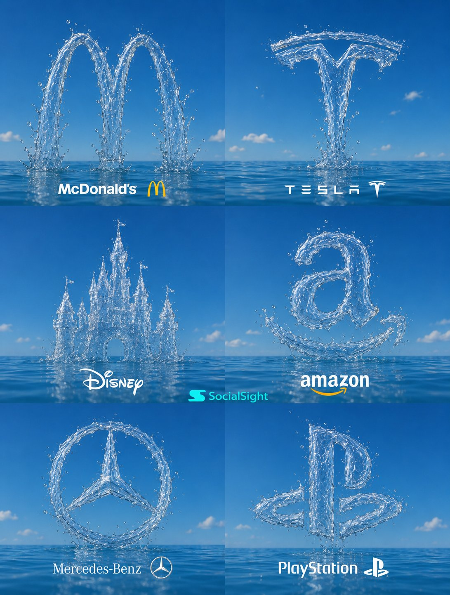

<!-- GENERATED from version JSON, sidecar metadata and personal corrections. Do not edit this reading copy. -->
# 水雕品牌 Logo 六宫格

[返回画廊总览](../../docs/gallery.md) · [版本与来源记录](case.json)

案例编号：`case-awesome-gpt-image-2-496-9ba0679cee7a` · 版本：`v1`

版本说明：首次收录

资料类型：案例 · 复核状态：已复核

复核说明：已实际看图并阅读全文。海面水形成六品牌Logo合集；文本要求六宫格水雕，无特定Logo文件依赖。 本次核对资料关系、图片角色和输入条件，不代表身份、事实或逐像素生成正确性验收。

## 案例图片

### 图片 1 · 输出效果图

来源角色：`source_example`

角色依据：海面水形成六品牌Logo合集；文本要求六宫格水雕，无特定Logo文件依赖。



## 完整提示词

```text
Create a premium 3x2 grid collage of iconic global brand logos recreated entirely from dynamic water formations, floating above a crystal-clear ocean under a vibrant blue sky. Each panel features a different logo sculpted from realistic transparent water, with detailed splashes, droplets, reflections, refractions, and flowing liquid textures. The water forms should look physically accurate, elegant, and instantly recognizable while remaining made completely of water.
```

[查看原始来源](https://x.com/AIwithSynthia/status/2062521441141088599)
