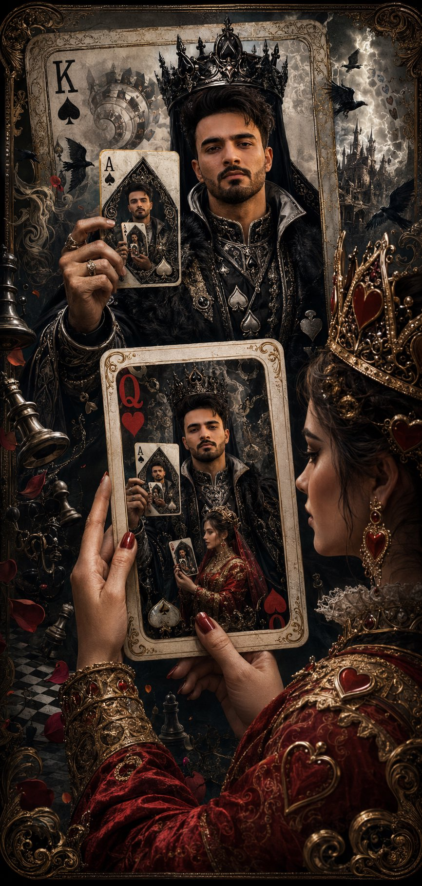

<!-- GENERATED from version JSON, sidecar metadata and personal corrections. Do not edit this reading copy. -->
# 黑桃国王递归扑克牌

[返回画廊总览](../../docs/gallery.md) · [版本与来源记录](case.json)

案例编号：`case-awesome-gpt-image-2-502-12acf3fa2aa8` · 版本：`v1`

版本说明：首次收录

资料类型：案例 · 复核状态：已复核

复核说明：已核对原文输入要求与当前示例图；这是通用可替换主体/照片/标志模板，实际执行须由使用者提供相应输入，未发现必须另补某一指定源文件的明确要求。 审核只涉及资料输入要求/资产角色，不包含重新生图、身份一致性或像素复现验证。

## 案例图片

### 图片 1 · 输出效果图

来源角色：`source_example`

角色依据：已看图，主体为提示词描述的完成后视觉示例；不从输出内容推定原始输入存在。



## 完整提示词

```text
Use my uploaded face image as the primary identity reference. Preserve my exact facial identity with extremely high fidelity: identical facial structure, jawline, cheekbones, eye shape, eyebrows, nose, lips, beard pattern, hairstyle, hair texture, skin tone, skin texture, and overall recognizable appearance. Do not beautify, alter, or reinterpret my face. Maintain realistic anatomy and authentic likeness.

Create an ultra-detailed, cinematic, surreal luxury playing-card artwork.

The main subject is me as the King of Spades, occupying the full design of a magnificent, royal Ace-quality playing card. I wear elaborate black-and-silver spade-themed regalia, a crown forged from obsidian and polished steel, intricate embroidered armor, and flowing royal garments decorated with subtle spade symbols. My expression is calm, intelligent, and powerful.

In my right hand, I am holding a pristine Ace of Spades card.

The creative twist: the Ace of Spades I am holding is not a normal card. It contains another complete playing-card illustration. Inside that card, I again appear as the King of Spades, and that entire card is being elegantly held between the fingers of a majestic Queen of Hearts. The Queen is graceful, regal, and visually striking, dressed in rich crimson and gold royal attire adorned with heart motifs.

The illusion continues with subtle recursive storytelling: the Queen of Hearts appears to be examining the card with fascination, creating a “card within a card” visual paradox. The composition should feel like a legendary tale of power, strategy, love, and destiny intertwined.

Add impossible Escher-inspired visual design elements:
•Infinite recursion effect
•Card-world folding into itself
•Floating spade and heart symbols transforming into ravens and rose petals
•Ornate golden borders extending beyond physical card edges
•Royal chess pieces suspended in midair
•Fractal patterns hidden within the card engravings
•Elegant smoke forming suit symbols
•Dimensional portals emerging from card corners

Style: ultra-realistic fantasy realism mixed with luxury casino art, Renaissance royal portraiture, and modern cinematic concept art.

Lighting: dramatic chiaroscuro, volumetric god rays, rich contrast, glowing metallic highlights, subtle magical energy around the Ace of Spades.

Color palette:
•Deep blacks
•Silver chrome
•Ivory white
•Crimson red
•Antique gold accents

Composition:
•Vertical masterpiece
•Museum-quality detail
•Hyper-realistic textures
•Intricate card engravings
•Perfectly symmetrical playing-card aesthetics blended with cinematic depth
•Sharp focus on my face
•Extremely high identity fidelity
•Epic storytelling through visual symbolism

The final image should feel like the cover of a legendary fantasy card game where the King of Spades has become self-aware, existing across multiple layers of reality while being held in the hands of fate itself, represented by the Queen of Hearts.
```

[查看原始来源](https://x.com/Professor_134/status/2063244295977800057)
