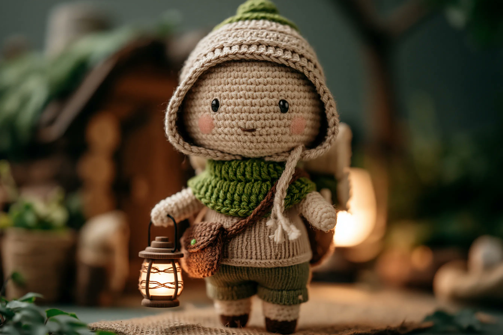

<!-- GENERATED from version JSON. Do not edit this reading copy. -->
# 暖调钩织角色玩偶

[返回画廊总览](../../docs/gallery.md) · [版本与来源记录](case.json)

案例编号：`case-awesome-gpt-image-2-507-e8f386597159` · 版本：`v1`

版本说明：首次收录

## 案例图片



## 完整提示词

```text
A handcrafted crochet doll of a [subject], made with soft yarn textures and intricate knitted details. Dressed in a vivid [color1] accent and a delicate [color2] garment, holding a small [prop]. Set in a cozy [setting], warm muted atmosphere, charming handmade aesthetic, nostalgic amigurumi style.
```

[查看原始来源](https://x.com/azed_ai/status/2067925399947067728)
