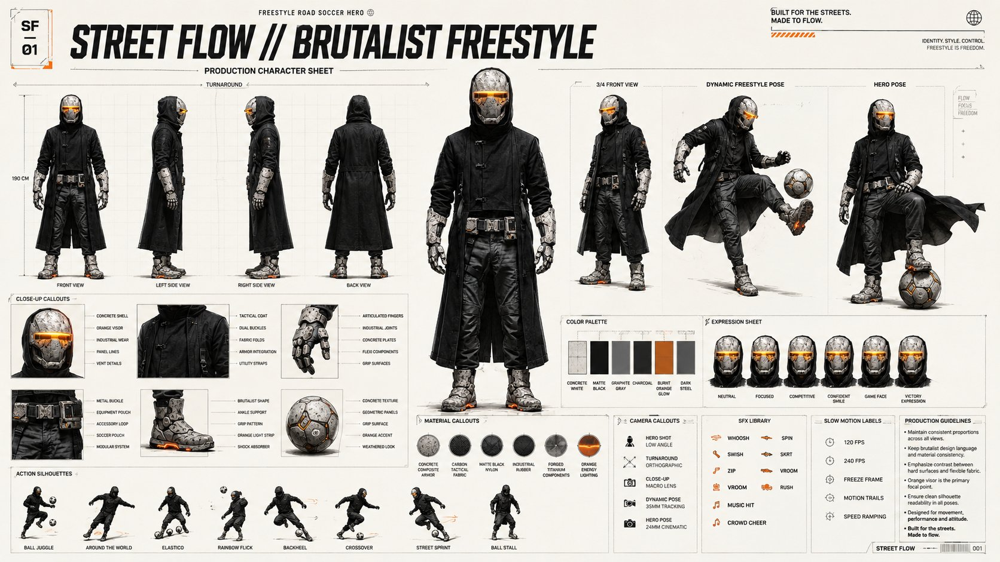

<!-- GENERATED from version JSON, sidecar metadata and personal corrections. Do not edit this reading copy. -->
# Brutalist Freestyle 角色设定表

[返回画廊总览](../../docs/gallery.md) · [版本与来源记录](case.json)

案例编号：`case-awesome-gpt-image-2-512-a85add6ba440` · 版本：`v1`

版本说明：首次收录

资料类型：案例 · 复核状态：未补充复核 / 待复核

复核说明：原文对上传角色的轮廓/护甲/帽衫有具体保持要求，现存仅角色设定输出。可换自己的设计参考复用，但原角色输入尚不能确认。 审核只涉及资料输入要求/资产角色，不包含重新生图、身份一致性或像素复现验证。

## 案例图片

### 图片 1 · 输出效果图

来源角色：`source_example`

角色依据：已看图，主体为提示词描述的完成后视觉示例；不从输出内容推定原始输入存在。



## 完整提示词

```text
Use the uploaded reference image as the primary character design reference, preserving the overall silhouette, proportions, futuristic apparel layering, helmet geometry, visor shape, stone-like brutalist armor surfaces, black hooded coat, tactical streetwear construction, gloves, boots, utility belt, and monochrome industrial aesthetic.

Create a premium production character sheet for a 2D stylized futuristic freestyle road soccer protagonist inspired by Brutalist architecture, industrial concrete textures, geometric forms, and minimalist sci-fi design language.  The presentation should resemble a AAA game character turnaround sheet mixed with a Nike commercial concept presentation.

The character should feel agile, stylish, confident, athletic, and built for urban freestyle football.  Maintain the concrete-textured helmet with glowing orange visor, oversized hood, tactical long coat, mechanical gauntlets, armored boots, and industrial detailing exactly as the design language.  The football should be integrated naturally into the presentation.  Minimal off-white background (#F7F5F0).

Professional production sheet layout.  Extremely clean linework.  Cinematic concept art.  Premium graphic design.  No photorealism.  High-end stylized illustration.  CHARACTER ANGLES Front View  Neutral hero pose.  Left Side View Right Side View Back View 3/4 Front View Dynamic Freestyle Pose  Standing on one foot while balancing the football.  Hero Pose  Football under foot.  Long coat flowing.  Confident posture.  CLOSE-UP CALLOUTS  Helmet Design  Orange illuminated visor  Concrete brutalist surface  Industrial wear  Panel breakdown  Upper Body  Coat construction  Buckles  Fabric folds  Armor integration  Mechanical Gloves  Finger articulation  Industrial joints  Material breakdown  Utility Belt  Equipment  Fasteners  Soccer accessory pouch  Boot Design  Heavy brutalist geometry  Street football grip  Orange illuminated sole accents  Football Design  Minimal futuristic street football  Concrete-inspired panel graphics  Orange accent details  MATERIAL CALLOUTS  Concrete Composite Armor  Carbon Tactical Fabric  Matte Black Nylon  Industrial Rubber  Forged Titanium Components  Orange Energy Lighting  COLOR PALETTE  Concrete White  Matte Black  Graphite Gray  Charcoal  Burnt Orange Glow  Dark Steel  EXPRESSION SHEET  Neutral  Focused  Competitive  Confident Smile  Game Face  Victory Expression  ACTION SILHOUETTES  Ball Juggle  Around The World  Elastico  Rainbow Flick  Backheel  Crossover  Street Sprint  Ball Stall  CAMERA CALLOUTS  Hero Shot Low Angle  Turnaround Orthographic  Close-up Macro Lens  Dynamic Pose 35mm Tracking Camera  Hero Pose 24mm Cinematic Lens  SFX LABELS  WHOOSH  SWISH  TAP  BOUNCE  THUD  ZIP  SPIN  SKRT  VROOM  RUSH  MUSIC HIT  CROWD CHEER  SLOW MOTION LABELS  120 FPS  240 FPS  Freeze Frame  Motion Trails  Speed Ramping  GUIDELINES  Maintain consistent proportions across all views.  Keep the brutalist design language consistent.  Emphasize concrete-inspired hard surfaces contrasted with flexible tactical fabrics.  Preserve the glowing orange visor as the primary focal point.  Use clean production callouts with arrows and labels.  Include measurement guides, material notes, and design annotations.  Keep presentation minimal and premium.  Avoid clutter.  Professional concept art quality suitable for AAA game development, cinematic production, and advertising pitch decks.  LAYOUT  16:9 Landscape  Top Center: MAIN TITLE STREET FLOW // BRUTALIST FREESTYLE  Below: Production Character Sheet  Center: Large Hero Character  Left: Front • Side • Back Views  Right: 3/4 View • Action Pose • Hero Pose  Bottom: Close-ups • Materials • Color Palette • Equipment • Football Design • Expressions • Camera Notes • SFX • Slow Motion • Production Annotations  Minimal off-white background with subtle grid guides, technical drawing arrows, clean typography, and premium commercial presentation quality.
```

[查看原始来源](https://x.com/ShamsAmin56/status/2071590431725670517)
