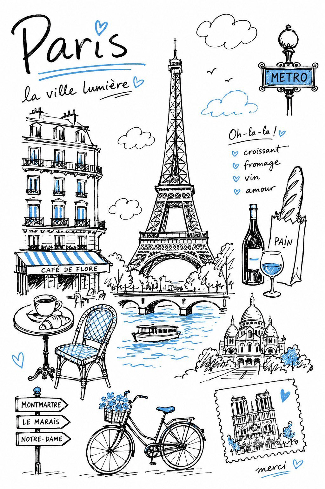

<!-- GENERATED from version JSON. Do not edit this reading copy. -->
# 单色点缀旅行手账插画

[返回画廊总览](../../docs/gallery.md) · [版本与来源记录](case.json)

案例编号：`case-awesome-gpt-image-2-513-ccc9493733fa` · 版本：`v1`

版本说明：首次收录

## 案例图片



## 完整提示词

```text
Create a charming editorial travel illustration of {DESTINATION} in a simple hand-drawn doodled style, as if sketched by hand with a black felt-tip marker in a travel notebook. The illustration should feel personal, spontaneous, and imperfect rather than digitally designed. Think of the kind of drawing someone might casually create while sitting at a café after exploring the destination.** ## COLOR PALETTE Keep the illustration almost entirely black and white. Use **only one accent color: {ONE POINT COLOR}** ## STYLE Draw entirely with black felt-tip pen lines. Use slightly wobbly hand-drawn contours, natural line variation, loose marker strokes, sketch-like confidence, subtle imperfections, slightly open line endings, uneven hand pressure, and occasional overlapping strokes. Every line should clearly look handmade. Avoid perfectly smooth curves, mechanically precise outlines, polished vector graphics, or overly crisp digital rendering. ## SUBJECT Illustrate the unique atmosphere and instantly recognizable identity of **{DESTINATION}** rather than producing a realistic cityscape. Select the destination's most iconic landmarks, characteristic architecture, local transportation, famous scenery, native plants, local animals, regional food, and cultural objects. Focus on the spirit of the destination instead of literal accuracy. ## COMPOSITION Arrange the selected elements into a balanced editorial composition with generous white space. The layout should feel open, light, and effortless, similar to a designer's travel sketchbook. Allow objects to overlap naturally without becoming crowded. Every element should have room to breathe. Keep the composition visually relaxed and uncluttered. Apply the blue sparingly to selected details such as water, sky, windows, signs, clothing accents, decorative highlights, or small architectural features. Never introduce any additional colors. ## DRAWING STYLE Keep every object simple and intentionally simplified. Use flat shapes with minimal interior detail. Avoid realistic textures, gradients, shadows, painterly brushwork, glossy surfaces, or complex rendering. The illustration should remain clean, airy, understated, and highly graphic. ## LINE QUALITY The black marker lines are the main visual feature. Lines should feel confident, casual, lively, expressive, and naturally imperfect. Slightly uneven contours, open edges, variable line thickness, and small drawing inaccuracies are encouraged because they enhance the authentic hand-drawn feeling. ## MOOD Warm. Friendly. Relaxed. Playful. Minimal. Editorial. Contemporary. Elegant through simplicity. The finished artwork should resemble a beautifully designed travel notebook, boutique travel guide, editorial magazine illustration, or lifestyle sketchbook rather than a polished digital illustration. ## IMPORTANT No photorealism. No 3D rendering. No painterly effects. No gradients. No heavy shadows. No glossy lighting. No vector-clean artwork. No excessive detail. No busy composition. Preserve generous white space. Maintain a flat editorial doodle aesthetic with a distinctly handmade character. The final image should instantly evoke **{DESTINATION}** through simple, expressive black felt-tip sketches with subtle sky-blue accents.
```

[查看原始来源](https://x.com/Sairah_0/status/2071779087396606433)
