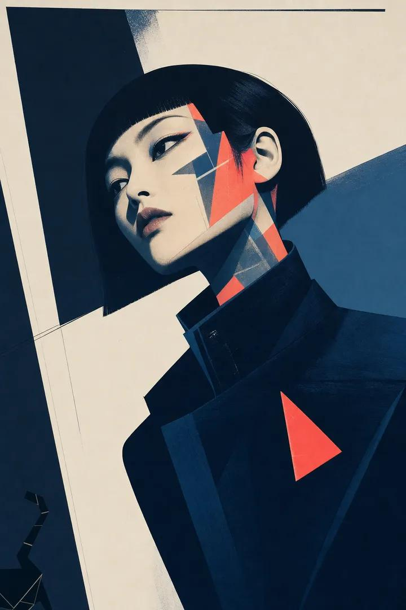

<!-- GENERATED from version JSON, sidecar metadata and personal corrections. Do not edit this reading copy. -->
# 硬边现代艺术人像

[返回画廊总览](../../docs/gallery.md) · [版本与来源记录](case.json)

案例编号：`case-awesome-gpt-image-2-514-b82b53c5864d` · 版本：`v1`

版本说明：首次收录

资料类型：案例 · 复核状态：未补充复核 / 待复核

复核说明：已机械读取完整 prompt 与资产路径、哈希并比对本地上游画廊；未检出需补特定原图的明确证据。未全量逐图审，模型家族仅据来源集合声明，实际版本未知。 审核只涉及资料输入要求/资产角色，不包含重新生图、身份一致性或像素复现验证。

## 案例图片

### 图片 1 · 角色待复核

来源角色：`source_example`

角色依据：原始记录标 source_example；本轮未看此图，不能自动将其升级为已验证 output。



## 完整提示词

```text
A striking piece of hard-edge modern art on matte archival paper, with visible screen-printing layers and slight ink misalignment. A young East Asian woman is captured in a sharp, three-quarter profile. Her facial features are rendered with precise, crisp contours, contrasting with abstract, luminous geometric shapes that seem to emanate from within her skin. She wears a sleek, high-collared jacket in deep midnight blue, adorned with a single, bold neon coral brooch in the shape of a sharp triangle. Her dark hair is styled in a severe, architectural bob with blunt edges. Her expression is calm and detached, eyes gazing off-frame. The background is a clean, architectural space with sharp diagonal planes in crisp white and deep slate. High-contrast chiaroscuro lighting highlights the edges of her silhouette. Sophisticated palette: deep midnight blue, crisp white, electric neon coral. A stray cat tail is rendered as a sharp, geometric vector in the bottom left corner. Ultra-modern artistic style. No digital CGI feel.
dutch angle, stray cat tail --ar 9:16
```

[查看原始来源](https://x.com/SimplyAnnisa/status/2071783914595897555)
