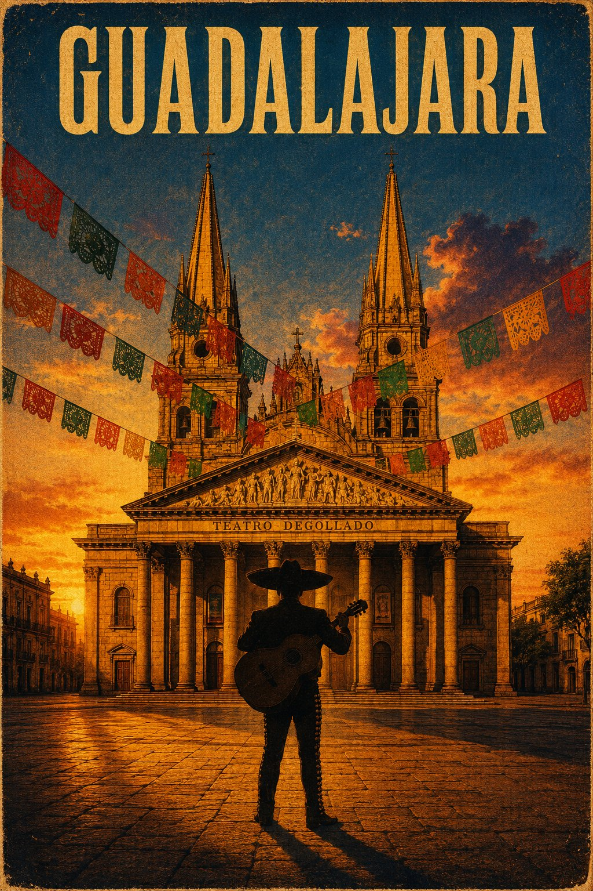

<!-- GENERATED from version JSON, sidecar metadata and personal corrections. Do not edit this reading copy. -->
# Guadalajara 复古电影旅行海报

[返回画廊总览](../../docs/gallery.md) · [版本与来源记录](case.json)

案例编号：`case-awesome-gpt-image-2-515-d0b2a41614fd` · 版本：`v1`

版本说明：首次收录

资料类型：案例 · 复核状态：未补充复核 / 待复核

复核说明：prompt 的 target_tool 与 target 明示 DALL-E 3 (ChatGPT)，属于目标工具声明，不等于实际生成证明；family 保持 unknown，版本不强行填写。 审核只涉及资料输入要求/资产角色，不包含重新生图、身份一致性或像素复现验证。

## 案例图片

### 图片 1 · 输出效果图

来源角色：`source_example`

角色依据：已看图，主体为提示词描述的完成后视觉示例；不从输出内容推定原始输入存在。



## 完整提示词

```text
@Crea una imagen {
  "style": "Cinematic Vintage Movie Poster — Guadalajara, Mexico",
  "target_tool": "DALL-E 3 (ChatGPT)",
  "prompt": "Generate a vertical portrait-format movie poster image, taller than wide in a 2:3 aspect ratio. The image is a cinematic vintage travel movie poster for Guadalajara, Mexico, rendered with the visual texture of an aged large-format film poster: heavy 35mm film grain throughout especially in the shadow areas, slightly faded and warm-shifted color tones as if printed on aged matte paper stock, a subtle halftone dot pattern visible in the midtones, and a very slight ink bleed at high-contrast edges giving it an authentic vintage printed poster feel. Foreground: a single dark silhouette of a lone mariachi musician standing still at the center-bottom of the frame, rendered as a pure clean dark silhouette with no facial features visible — traditional wide-brim charro sombrero, fitted traje de charro suit outline, holding a guitarrón — casting a long warm shadow across the honey-colored cantera stone paving of Plaza de la Liberación below, with colorful papel picado banners in red, orange, green and yellow cut tissue paper strung in loose diagonal lines overhead from building to building, swaying slightly, framing the upper composition, no people other than the single silhouetted figure, no vehicles, no modern objects. Midground: the grand honey-amber cantera stone neoclassical facade of the Teatro Degollado rising directly behind the silhouette, its ornate columned portico and triangular pediment warmly lit by the low golden-hour sun hitting from the left, long dramatic shadows stretching across the stone paving, the warm amber volcanic stone glowing intensely in the golden light. Background: the twin neo-Gothic spires of the Catedral Metropolitana de Guadalajara rising tall into the upper frame against a vast deep cerulean blue sky transitioning to burnt amber and deep orange near the horizon, a single scattered cloud catching violet and gold light from below, the cathedral facade in warm honey stone matching the Teatro Degollado's palette. Color grade: saturated warm amber and golden honey tones dominating the stone architecture, deep cobalt blue in the upper sky, rich burnt orange near the horizon, faded warm sepia in the shadow areas consistent with a vintage printed poster. At the very top of the image, centered above the spires, render the single word GUADALAJARA in bold condensed uppercase display serif letters in warm cream-gold with a faint dark drop shadow, leaving clear sky negative space for the title. No modern buildings, no cars, no utility wires, no people other than the single dark silhouette visible anywhere in the scene.",
  "target": "🎯 Target: DALL-E 3 (ChatGPT) — 💡 Foreground/midground/background separation places Teatro Degollado and the Cathedral in distinct spatial layers, the mariachi silhouette is specified as a featureless outline to eliminate aberration risk, and vintage print texture is described visually rather than as a style label."
}
```

[查看原始来源](https://x.com/MiMundoConIA/status/2077046470335938826)
