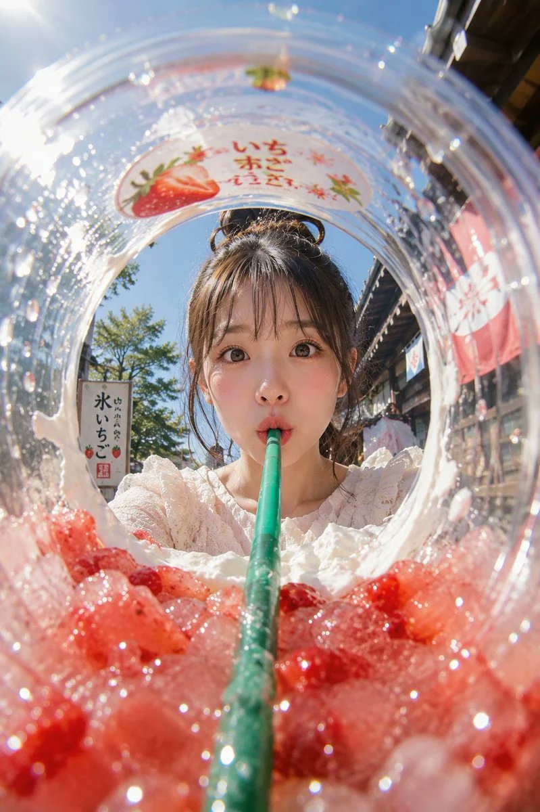

<!-- GENERATED from version JSON, sidecar metadata and personal corrections. Do not edit this reading copy. -->
# 杯内鱼眼夏日冰饮广告

[返回画廊总览](../../docs/gallery.md) · [版本与来源记录](case.json)

案例编号：`case-awesome-gpt-image-2-517-ba8a5827db7d` · 版本：`v1`

版本说明：首次收录

资料类型：案例 · 复核状态：已复核

复核说明：实际查看：杯内鱼眼视角的草莓碎冰、吸管及饮用女性。已通读完整归档指令；图像为该创作方向的结果样例，文本未要求某张特定外部原图。

## 案例图片

### 图片 1 · 输出效果图

来源角色：`source_example`

角色依据：杯内鱼眼视角的草莓碎冰、吸管及饮用女性；完整指令对应的成品样例展示



## 完整提示词

```text
主題：
氷越しの夏

主体：
縦長2:3のリアル写真。透明な大型プラスチックカップの内側から見上げるような超広角フィッシュアイ構図。画面下半分いっぱいに赤いいちご果肉とクラッシュアイスが迫り、中央から太いグリーンのストローが奥へ一直線に伸びる。丸く歪んだカップの開口部の向こうに、女性の顔が中央に大きく収まる。

人物・表情：
自然で現実感のある若い女性。黒髪に近いダークブラウンの髪を高めのお団子にまとめ、薄い前髪と顔まわりの後れ毛が日差しで細く光っている。透明感のあるナチュラルメイク、淡いピンクの頬、つやのあるリップ。目を大きく開いてカメラをまっすぐ見つめ、唇を小さく丸めてストローをくわえている。少し驚いたような、可愛らしく無邪気な表情。

服装・ポーズ：
白いレース素材のブラウス。首元と肩まわりに細かなフリルがあり、夏らしく軽い質感。人物はカップの向こう側に顔を近づけ、両肩は下部に少しだけ見える。ストローは人物の口元に自然に接触し、奥から手前の赤い氷へ向かって強い奥行きを作る。

背景・光：
背景は晴れた夏の日の古い商店街。木造風の店先、かき氷屋の暖簾、苺柄の看板、白い小さな旗、街路樹が見える。文字はすべてぼかされた読めない装飾として扱う。左上から強い太陽光が入り、透明カップの水滴、カップ縁、氷、赤い果肉に細かな反射とハイライトが出る。影は右下へ落ち、白いクリームの残りがカップ内側にリング状についている。

構図・カメラ：
カメラはカップの底付近、赤い氷のすぐ上に置いたような極端なローアングル。フィッシュアイレンズでカップの円形リムが大きく湾曲し、周囲の商店街も軽く歪む。画面下45％は赤い氷と果肉の前ボケ、中央はストローと女性の顔、上部は青空とカップの透明な縁。ピントは女性の目と口元、手前の氷はきらめく浅いボケ。

質感・スタイル：
プロ用カメラで撮影した夏の広告写真風。透明プラスチックの屈折、水滴の粒、氷の冷たさ、いちご果肉の瑞々しさを高精細に表現。青空、赤い氷、グリーンのストロー、白いブラウスの色の対比を鮮やかにする。肌は自然な質感を残し、過度な美肌補正はしない。明るくポップで、少しユーモラスな日本の夏スイーツ写真。

ネガティブ：
実在ブランドロゴ、読める文字、商標の再現、不自然な顔、不自然な視線、歯や唇の崩れ、ストローとの接触不良、余分な指、欠けた指、手足の融合、氷の浮遊、不自然な重力、誤った遠近法、光源と矛盾する影、文字化け、透かし、過度な美肌補正、プラスチックのような肌。
```

[查看原始来源](https://x.com/lovimg_com/status/2077036659028484375)
