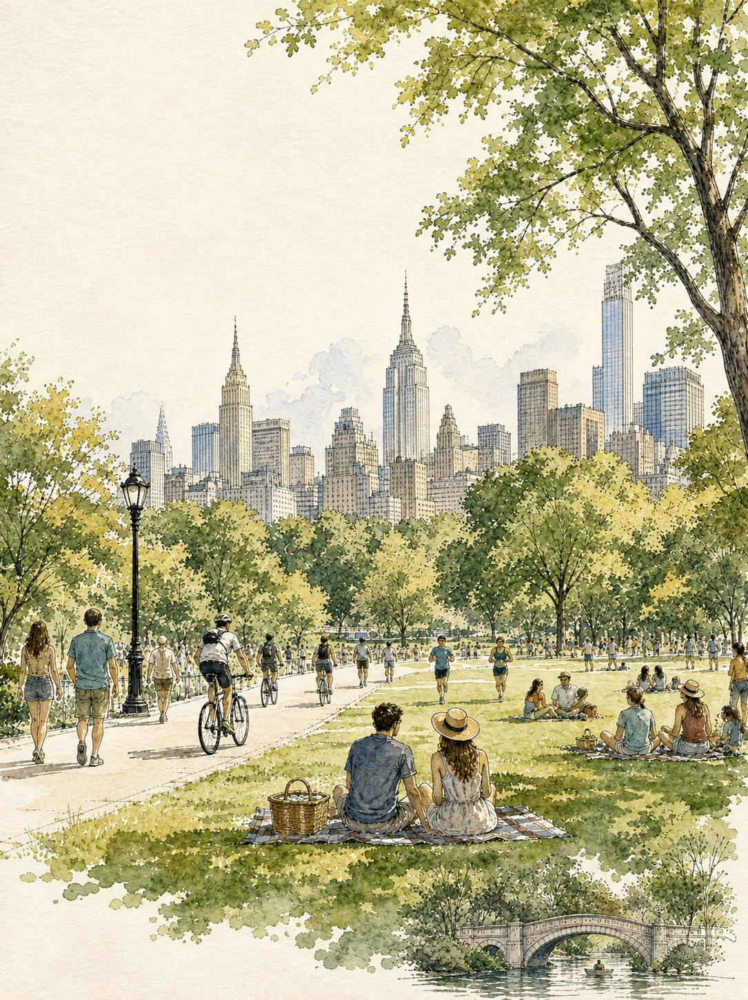

<!-- GENERATED from version JSON, sidecar metadata and personal corrections. Do not edit this reading copy. -->
# 曼哈顿公园水彩旅行插画

[返回画廊总览](../../docs/gallery.md) · [版本与来源记录](case.json)

案例编号：`case-awesome-gpt-image-2-523-293e282b3d57` · 版本：`v1`

版本说明：首次收录

资料类型：案例 · 复核状态：已复核

复核说明：已实际看图并阅读全文。曼哈顿公园草地人群与天际线的水彩插画；全文定义画面，无输入图。 本次核对资料关系、图片角色和输入条件，不代表身份、事实或逐像素生成正确性验收。

## 案例图片

### 图片 1 · 输出效果图

来源角色：`source_example`

角色依据：曼哈顿公园草地人群与天际线的水彩插画；全文定义画面，无输入图。



## 完整提示词

```text
Create a vertical editorial travel illustration inspired by vintage European travel posters, featuring a peaceful summer afternoon in a grand city park with a recognizable Manhattan-style skyline in the background. Use delicate hand-drawn ink outlines combined with soft, slightly imperfect watercolor washes on warm textured cream paper. Show a wide green lawn filled with people relaxing, reading, walking, jogging, cycling, and having picnics. In the foreground, a casually dressed young couple sits together on a picnic blanket beside a woven basket. Include elegant black vintage park lamps, winding pathways, dense leafy trees framing the composition, and detailed historic and modern skyscrapers rising behind the park. Add a small picturesque stone arch bridge over a calm pond near the bottom of the artwork. Use muted sage green, olive, warm beige, soft blue, pale gray, and subtle golden sunlight, with natural watercolor bleeding, paper grain, fine pen hatching, and an airy sophisticated travel-journal aesthetic. No text, no letters, no logos, no typography, no captions, no signs. Vertical 4:5 composition, highly detailed, elegant, nostalgic, handcrafted watercolor-and-ink illustration.
```

[查看原始来源](https://x.com/Taaruk_/status/2090307485374578755)
