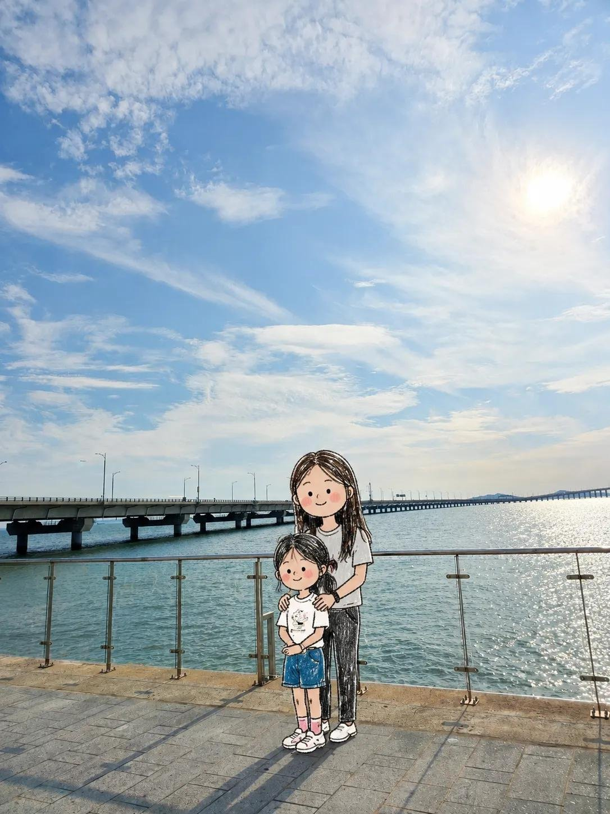

<!-- GENERATED from version JSON. Do not edit this reading copy. -->
# 实拍背景涂鸦人物替换

[返回画廊总览](../../docs/gallery.md) · [版本与来源记录](case.json)

案例编号：`case-awesome-gpt-image-2-530-8f24a2d37563` · 版本：`v1`

版本说明：首次收录

## 案例图片



## 完整提示词

```text
Transform ONLY the people in the uploaded photo into adorable hand-drawn doodle characters while keeping the original photographic background unchanged.

CORE RULE:
Background = original realistic photo.
People = cute hand-drawn doodle characters.

PRESERVE THE BACKGROUND:
Keep the original sky, landscape, buildings, water, furniture, ground, plants, railings, objects, lighting, colors, perspective, camera angle, framing, and textures as close to the original photo as possible.

Do NOT redraw, simplify, illustrate, or apply doodle/crayon/pencil effects to the background or environmental objects.

TRANSFORM ONLY PEOPLE:
Replace each person with a charming, naive doodle version while preserving:
- exact number of people
- original position and relative scale
- front/back/side/three-quarter orientation
- head and body direction
- pose and gesture
- arm and leg positions
- interactions with people or objects
- hairstyle, clothing colors, and major accessories

IMPORTANT:
If someone faces away, keep them back-facing.
If sideways, keep them sideways.
If facing forward, keep them forward.
Never rotate a person toward the viewer or invent a face that is not visible.

CUTE DOODLE STYLE:
Freely reinterpret realistic anatomy into an adorable, imperfect character:
- oversized round head
- tiny compact body
- short simplified arms and legs
- tiny hands and feet
- cute awkward proportions
- loose scribbled hair
- tiny dot eyes and simple facial features when visible
- rosy scribbled cheeks when appropriate

Keep the original pose recognizable, but simplify and slightly exaggerate it for cuteness.

DRAWING STYLE:
Loose naive hand-drawn doodle, like a quick children's sketch.
Use thin shaky black outlines, imperfect shapes, overlapping sketch lines, scribbled colored-pencil or crayon fills, uneven coloring, white gaps, and slightly messy edges.

The character should look intentionally roughly drawn but extremely cute.

OBJECTS:
Objects, furniture, scenery, and items around the people should remain photographic whenever possible. A doodle character may naturally touch or hold a real photographic object.

INTEGRATION:
Keep correct scale, ground contact, depth, and occlusion so the doodle characters naturally occupy the same locations as the original people.

FINAL LOOK:
It should feel like the real people were removed from the original photograph and replaced with adorable little hand-drawn doodle versions of themselves, while the real-world background remained untouched.

Prioritize:
1. Original photographic background
2. Person position and scale
3. Exact body orientation
4. Pose and gesture
5. Cute exaggerated doodle character design

Avoid full-image illustration, background doodling, realistic anatomy, anime, manga, 3D cartoon, polished digital art, vector lines, changed poses, changed orientation, added people, or invented faces.
```

[查看原始来源](https://x.com/Emmma__0/status/2091391958128251286)
