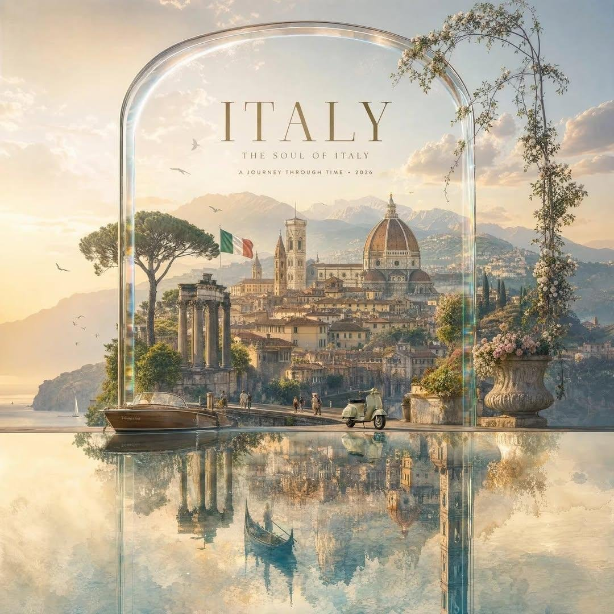

<!-- GENERATED from version JSON, sidecar metadata and personal corrections. Do not edit this reading copy. -->
# 水晶框国家旅行广告海报

[返回画廊总览](../../docs/gallery.md) · [版本与来源记录](case.json)

案例编号：`case-awesome-gpt-image-2-531-53b1d7706dfd` · 版本：`v1`

版本说明：首次收录

资料类型：案例 · 复核状态：未补充复核 / 待复核

复核说明：已机械读取完整 prompt 与资产路径、哈希并比对本地上游画廊；未检出需补特定原图的明确证据。未全量逐图审，模型家族仅据来源集合声明，实际版本未知。 审核只涉及资料输入要求/资产角色，不包含重新生图、身份一致性或像素复现验证。

## 案例图片

### 图片 1 · 角色待复核

来源角色：`source_example`

角色依据：原始记录标 source_example；本轮未看此图，不能自动将其升级为已验证 output。



## 完整提示词

```text
Create a luxurious, dreamy country travel-art collection in the exact visual language of an elegant premium tourism campaign: a large transparent crystal/glass architectural frame or arched glass display standing on a glossy reflective surface, containing a highly detailed cinematic illustration of the destination. For [COUNTRY], feature its most iconic landmarks, historic architecture, distinctive landscapes, local transportation, cultural elements, national flag, flowers and recognizable scenery arranged as one seamless poetic panorama. Use warm golden-hour sunlight, soft atmospheric haze, pastel cream, champagne, muted blue and sage tones, delicate clouds, subtle birds, realistic glass refraction and rainbow prism highlights along the edges. Create a perfect mirror reflection beneath the glass structure, extending the entire composition downward with beautifully softened reflections. Add elegant editorial typography at the top reading “[COUNTRY]”, with smaller refined text “THE SOUL OF [COUNTRY]” and “A JOURNEY THROUGH TIME • 2026” beneath it. Sophisticated luxury travel magazine aesthetic, photorealistic yet painterly, cinematic depth, fine-art composition, extremely detailed architecture, serene atmosphere, premium advertising photography, symmetrical balanced framing, soft film grain, 8K, vertical 4:5, no clutter, no modern UI elements, no extra text.
```

[查看原始来源](https://x.com/Taaruk_/status/2091391283063361558)
