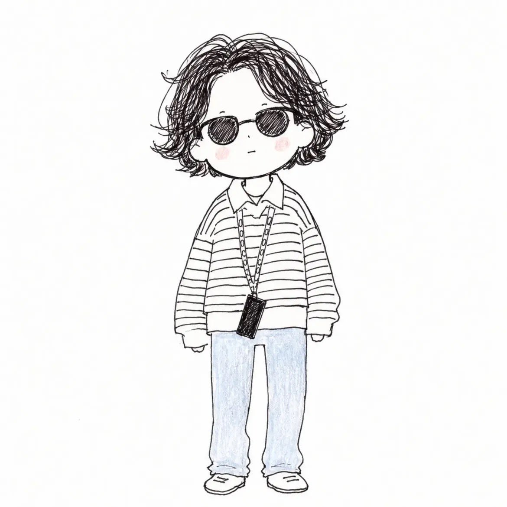

<!-- GENERATED from version JSON, sidecar metadata and personal corrections. Do not edit this reading copy. -->
# 手绘涂鸦时尚人物插画

[返回画廊总览](../../docs/gallery.md) · [版本与来源记录](case.json)

案例编号：`case-awesome-gpt-image-2-533-09c3cb90d3d5` · 版本：`v1`

版本说明：首次收录

资料类型：案例 · 复核状态：已复核

复核说明：已核对原文输入要求与当前示例图；这是通用可替换主体/照片/标志模板，实际执行须由使用者提供相应输入，未发现必须另补某一指定源文件的明确要求。 审核只涉及资料输入要求/资产角色，不包含重新生图、身份一致性或像素复现验证。

## 案例图片

### 图片 1 · 输出效果图

来源角色：`source_example`

角色依据：已看图，主体为提示词描述的完成后视觉示例；不从输出内容推定原始输入存在。



## 完整提示词

```text
Transform the subject from the reference image into a cute, quirky hand-drawn doodle illustration.

Use a minimalist children’s storybook / fashion sketch aesthetic with loose, imperfect black ink lines, visible scribbly pencil strokes, subtle cross-hatching, and a charming handmade feel. Keep the character’s recognizable facial features, hairstyle, face shape, clothing, accessories, and overall identity from the reference while simplifying them into a cute illustrated character.

Character design:
- Oversized head and small simplified body
- Simple dot-like eyes and tiny minimal mouth
- Soft rounded facial features
- Slight rosy pink blush on the cheeks
- Messy, expressive hand-drawn hair with many loose sketch lines
- Slightly exaggerated, playful proportions
- Natural, relaxed pose with a whimsical fashion-illustration feel

Art style:
- Black-and-white pencil/ink doodle drawing
- Rough, imperfect sketch lines rather than clean digital outlines
- Dense scribbled hair and clothing details
- Light hand-colored accents
- Subtle watercolor/crayon-like coloring
- Minimal shading
- White or off-white clean background
- Lots of negative space
- Cute, innocent, playful, cozy aesthetic
- Looks like an original handmade notebook/fashion doodle illustration

Preserve the important details of the reference image while converting everything into this consistent doodle-art style. The final image should feel hand-sketched, slightly imperfect, adorable, expressive, and effortlessly stylish, not like polished vector art or 3D cartoon art.
```

[查看原始来源](https://x.com/Sairah_0/status/2092473965927334071)
