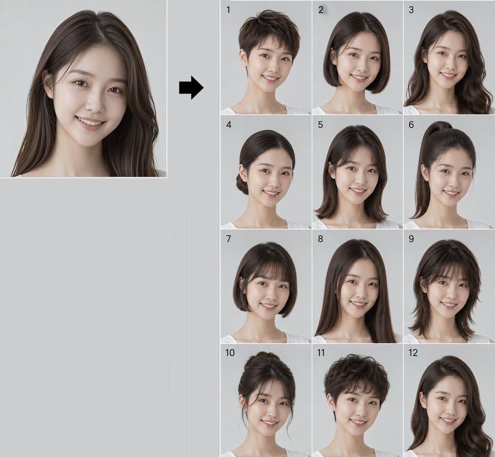

<!-- GENERATED from version JSON, sidecar metadata and personal corrections. Do not edit this reading copy. -->
# 同一人脸十二款发型 Lookbook

[返回画廊总览](../../docs/gallery.md) · [版本与来源记录](case.json)

案例编号：`case-awesome-gpt-image-2-535-a001325b4cde` · 版本：`v1`

版本说明：首次收录

资料类型：案例 · 复核状态：已复核

复核说明：已看图为左侧人像+右侧12种发型对照；左侧疑似输入展示但不是独立原文件，role=mixed。可换新自拍执行模板，未做身份一致性验证。 审核只涉及资料输入要求/资产角色，不包含重新生图、身份一致性或像素复现验证。

## 案例图片

### 图片 1 · mixed

来源角色：`source_example`

角色依据：截图或前后对照包含多种视觉角色；没有拆成独立源输入文件。



## 完整提示词

```text
Create a 12-panel grid (3 columns × 4 rows, numbered 1 to 12) showing the SAME person from the reference photo with 12 different hairstyles. This is a hairstyle lookbook. Final image aspect ratio: 4:5 (vertical/portrait).
THE ONLY THING THAT CHANGES BETWEEN PANELS IS THE HAIR ON THE HEAD (shape, style and length only). Everything else stays exactly as in the reference photo.
Identity Anchor (Critical)
The face must be IDENTICAL to the reference photo in every single panel. Preserve exactly: facial bone structure, jawline, cheekbones, nose shape, lips, eye shape and spacing, eyebrows, skin tone, skin texture (pores, natural imperfections), and overall facial proportions. This is the same real person in all 12 frames. Do NOT beautify, slim, or alter the face. Same age, same expression as in the reference.
Mandatory Rules (Do Not Violate)
- NO SUNGLASSES. Eyes must be fully visible in all 12 panels.
- NO ENVIRONMENTAL BACKGROUNDS. Every panel must have a plain, uniform, solid light grey studio backdrop with zero objects, zero textures, zero gradients. Just flat neutral grey.
- Hair COLOR stays exactly as it appears in the reference photo in all 12 panels. Only the shape, length and style changes, never the color.
Keep Identical in Every Panel (Do Not Change)
- MAKEUP AND SKIN: If the person in the reference photo wears makeup, replicate it identically in every panel. Same lip color, same eye makeup, same brow grooming. If they wear no makeup, keep all panels makeup-free. Do NOT add, remove, or alter makeup between panels.
- Clothing: the same clothing visible in the reference photo, replicated exactly.
- Accessories: preserve ALL visible accessories from the reference photo (earrings, necklaces, rings, bracelets, piercings, watch, glasses, etc.). Do not omit, resize, recolor, or restyle any accessory. If the person wears prescription glasses (not sunglasses), keep them in every panel.
- Background: plain solid light grey studio backdrop in every panel. No room, no furniture, no environment.
The 12 Hairstyles
1. Pixie cut: very short, textured, slightly tousled on top with tapered sides and nape
2. Classic bob: chin-length, straight, blunt ends, clean middle part
3. Long layered waves: past the shoulders, soft voluminous waves with face-framing layers
4. Sleek low bun: hair pulled back smoothly into a tight low bun at the nape, no flyaways
5. Curtain bangs with medium-length hair: soft parted fringe framing the face, hair falling just past the shoulders
6. High ponytail: hair pulled up into a sleek high ponytail, smooth crown, length falling behind
7. French bob: short bob ending at the jawline with a soft blunt micro-fringe across the forehead
8. Long straight hair with middle part: very long, sleek, pin-straight, falling well past the shoulders
9. Shaggy wolf cut: medium length, heavy layers, choppy fringe, textured and voluminous with a slightly wild look
10. Elegant updo: hair swept up into a polished chignon with soft face-framing tendrils
11. Short curly crop: short voluminous curls all over, natural texture, tapered at the sides
12. Side-swept Hollywood waves: long glamorous deep side part, sculpted vintage waves cascading over one shoulder
Photographic Specs
Shot on a Canon EOS R5 with an 85mm f/1.4 lens, studio portrait lighting (soft key light, subtle fill), shallow depth of field with sharp focus on the face. PLAIN SOLID LIGHT GREY STUDIO BACKGROUND in every panel. Natural skin rendering with visible pores and realistic hair strands (no plastic or CGI look). Consistent lighting, color grading and exposure across all 12 panels. Photorealistic, high detail, hyperrealistic, 8K. No illustration, no painterly effect, no over-smoothing. NO SUNGLASSES.
Each panel clearly numbered 1 to 12 in the top-left corner. Overall output aspect ratio 4:5.
```

[查看原始来源](https://x.com/Ciri_ai/status/2092452220768002400)
