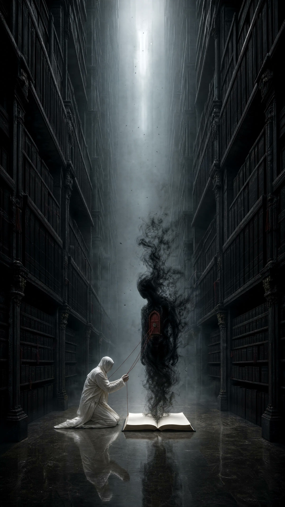

<!-- GENERATED from version JSON, sidecar metadata and personal corrections. Do not edit this reading copy. -->
# 地下档案馆暗黑概念海报

[返回画廊总览](../../docs/gallery.md) · [版本与来源记录](case.json)

案例编号：`case-awesome-gpt-image-2-537-bf46ae0637e9` · 版本：`v1`

版本说明：首次收录

资料类型：案例 · 复核状态：未补充复核 / 待复核

复核说明：已机械读取完整 prompt 与资产路径、哈希并比对本地上游画廊；未检出需补特定原图的明确证据。未全量逐图审，模型家族仅据来源集合声明，实际版本未知。 审核只涉及资料输入要求/资产角色，不包含重新生图、身份一致性或像素复现验证。

## 案例图片

### 图片 1 · 角色待复核

来源角色：`source_example`

角色依据：原始记录标 source_example；本轮未看此图，不能自动将其升级为已验证 output。



## 完整提示词

```text
Use case: stylized-concept
Asset type: vertical social-media artwork for the “Your Dark Side” theme

Create an original psychological dark-surrealist scene in a colossal underground archive. Endless shelves of sealed black books rise like skyscrapers and vanish into fog. In the central aisle, a solitary human figure in bone-white clothing kneels before one open book on the floor. No words are visible. From the blank pages rises a delicate life-size figure made entirely of dense black smoke, standing face-to-face with the kneeling person. The smoke figure has no eyes or mouth; instead, its chest contains a small locked crimson door. Thin threads connect that door to the kneeling person’s hands, suggesting a secret self finally acknowledged.

Vertical 9:16 framing, towering shelves create a narrow symmetrical canyon, high-angle shaft of cold silver light, the two figures positioned small in the lower center, immense oppressive scale above them. Black paper, aged stone, floating ash, volumetric fog, subtle polished-floor reflections, premium photorealistic dark concept art, refined editorial composition, quiet dread and introspection rather than horror spectacle.

Color palette: obsidian black, graphite, bone white, cold silver, a single muted crimson accent at the tiny door.

Constraints: entirely original metaphor; blank book pages with absolutely no writing; no recognizable person; no text, symbols, logos, signatures, borders, or watermark.

Avoid: visible letters or runes, portrait close-up, split face, black substance on skin, glowing eyes, gore, skulls, conventional ghosts, fantasy wizard styling, imitation of any named artist.
```

[查看原始来源](https://x.com/PromptSin/status/2092390329890849163)
