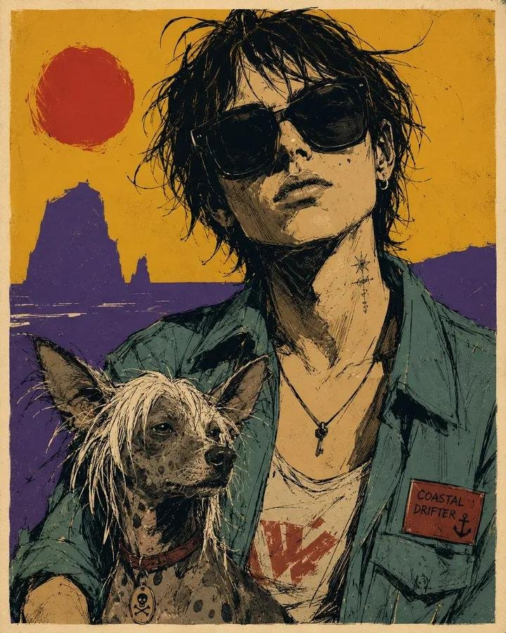

<!-- GENERATED from version JSON. Do not edit this reading copy. -->
# 粗粝手绘搭档肖像海报

[返回画廊总览](../../docs/gallery.md) · [版本与来源记录](case.json)

案例编号：`case-awesome-gpt-image-2-539-c5c77f1cba30` · 版本：`v1`

版本说明：首次收录

## 案例图片



## 完整提示词

```text
Raw sketchy graphic portrait poster of [HUMAN] wearing [CLOTHING], half-body and large in frame, accompanied closely by [ANIMAL], with a minimal [SCENERY] background. Render in a rough expressive illustrated style with broken black ink contours, loose sketch lines, scratchy hatching, irregular stroke weight, imperfect line edges, fast gestural mark-making, simplified anatomy, flat cel-like shadow blocks, and reduced detail. Use a restrained [COLORS] palette with one dominant warm field, one cool counter-field, dark inked shadows, and a few pale highlight accents. Keep the face oversized and central, crop around mid-torso, and place the animal in the lower foreground or tucked beside the subject, drawn with the same simplified raw linework. Reduce the scenery into only 2 or 3 bold silhouette shapes behind the subject, with no detailed environment rendering. Add a narrow warm off-white poster border and very light print texture. Strong attitude, graphic poster energy, intentionally imperfect strokes, raw and sketchy finish, ar 4:5
```

[查看原始来源](https://x.com/kingofdairyque/status/2093279729717780736)
