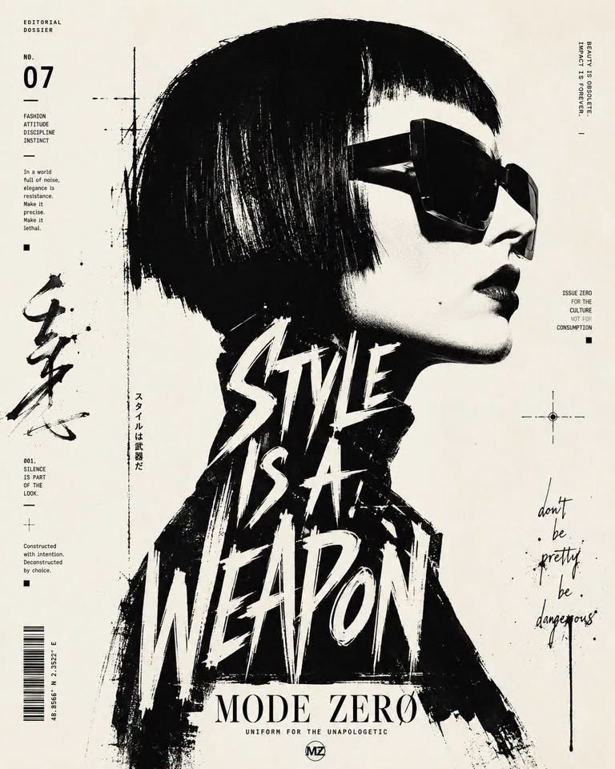

<!-- GENERATED from version JSON, sidecar metadata and personal corrections. Do not edit this reading copy. -->
# 黑白排版侧脸肖像海报

[返回画廊总览](../../docs/gallery.md) · [版本与来源记录](case.json)

案例编号：`case-awesome-gpt-image-2-542-f0f1211f8e48` · 版本：`v1`

版本说明：首次收录

资料类型：案例 · 复核状态：未补充复核 / 待复核

复核说明：已机械读取完整 prompt 与资产路径、哈希并比对本地上游画廊；未检出需补特定原图的明确证据。未全量逐图审，模型家族仅据来源集合声明，实际版本未知。 审核只涉及资料输入要求/资产角色，不包含重新生图、身份一致性或像素复现验证。

## 案例图片

### 图片 1 · 角色待复核

来源角色：`source_example`

角色依据：原始记录标 source_example；本轮未看此图，不能自动将其升级为已验证 output。



## 完整提示词

```text
High-contrast black and white typographic portrait poster of [HUMAN], shown in side profile with [FEATURE]. Build the portrait with bold black silhouette blocks, sharp negative space, rough ink edges, fragmented stencil shapes, tiny editorial microtext, vertical typographic accents and expressive hand-drawn calligraphic marks. Integrate one large readable text block saying “[TEXT]” in 2 to 4 stacked lines, placed only inside the neck and body area, using oversized scribbled lettering that feels fused into the silhouette. Include a graphic design logo reading “[LOGO]” near the footer. Minimal off-white paper background, asymmetrical layout, cropped vertical composition, experimental editorial poster design, raw ink print texture, aspect ratio 4:5.
```

[查看原始来源](https://x.com/HustleXR/status/2093206386012230000)
