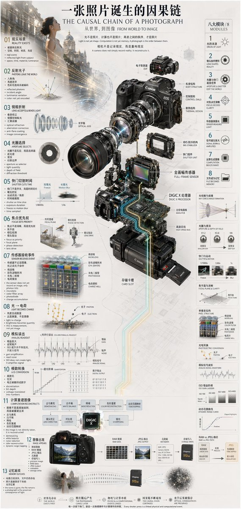

<!-- GENERATED from version JSON, sidecar metadata and personal corrections. Do not edit this reading copy. -->
# 信息图可视化设计

[返回画廊总览](../../docs/gallery.md) · [版本与来源记录](case.json)

案例编号：`case-awesome-gpt-image-2-70-8b3486a49f72` · 版本：`v1`

版本说明：首次收录

资料类型：案例 · 复核状态：未补充复核 / 待复核

复核说明：已机械读取完整 prompt 与资产路径、哈希并比对本地上游画廊；未检出需补特定原图的明确证据。未全量逐图审，模型家族仅据来源集合声明，实际版本未知。 审核只涉及资料输入要求/资产角色，不包含重新生图、身份一致性或像素复现验证。

## 案例图片

### 图片 1 · 角色待复核

来源角色：`source_example`

角色依据：原始记录标 source_example；本轮未看此图，不能自动将其升级为已验证 output。



## 完整提示词

```text
{
  "type": "technical infographic",
  "subject": "{argument name=\"subject matter\" default=\"digital photography process\"}",
  "header": {
    "title": "{argument name=\"main title\" default=\"一张照片诞生的因果链 THE CAUSAL CHAIN OF A PHOTOGRAPH\"}",
    "subtitle": "从世界，到图像 FROM WORLD TO IMAGE"
  },
  "centerpiece": {
    "description": "Exploded isometric view of a modern mirrorless camera",
    "model": "{argument name=\"camera model\" default=\"Canon EOS R5\"}",
    "labeled_parts_count": 12,
    "labeled_parts": [
      "EVF",
      "Body Structure",
      "Control Dials",
      "Thermal Design",
      "Optical Axis",
      "IBIS Stabilizer",
      "Shutter Unit",
      "Full-Frame Sensor",
      "{argument name=\"processor name\" default=\"DIGIC X Processor\"}",
      "Main PCB",
      "High-Speed Bus",
      "Card Slot"
    ]
  },
  "layout": {
    "left_column": {
      "description": "Chronological causal chain",
      "count": 13,
      "steps": [
        "01 REALITY EXISTS",
        "02 PHOTONS LEAVE THE WORLD",
        "03 LENS ACCEPTS & BENDS LIGHT",
        "04 APERTURE SELECTS",
        "05 SHUTTER CUTS TIME",
        "06 FOCUS SETS PRIORITY",
        "07 SENSOR RECEIVES EVENT",
        "08 LIGHT BECOMES CHARGE",
        "09 ANALOG READOUT",
        "10 A/D CONVERSION",
        "11 COMPUTATION RECONSTRUCTS",
        "12 IMAGE APPEARS",
        "13 MEMORY OUTLIVES"
      ]
    },
    "right_column": {
      "title": "八大模块 / 8 MODULES",
      "count": 8,
      "modules": [
        "1 ORIGIN OF LIGHT",
        "2 LENS SHAPES REALITY",
        "3 APERTURE & SHUTTER EDIT THE WORLD",
        "4 FOCUS DECIDES CLARITY",
        "5 SENSOR MEASURES LIGHT",
        "6 SIGNAL BORN & AMPLIFIED",
        "7 COMPUTATION BUILDS IMAGE",
        "8 FILE BECOMES MEMORY"
      ]
    },
    "side_diagrams": {
      "count": 7,
      "descriptions": [
        "Ray cone & image formation",
        "Aperture & depth of field",
        "Shutter & motion",
        "Focal plane & clarity",
        "Pixel structure",
        "Photoelectric conversion",
        "Analog signal waveform"
      ]
    },
    "footer": {
      "count": 5,
      "description": "Philosophical summary points"
    }
  },
  "style": "technical, precise, wireframe elements, glowing data lines, photorealistic camera components, clean typography, dual-language"
}
```

[查看原始来源](https://x.com/hx831126)
