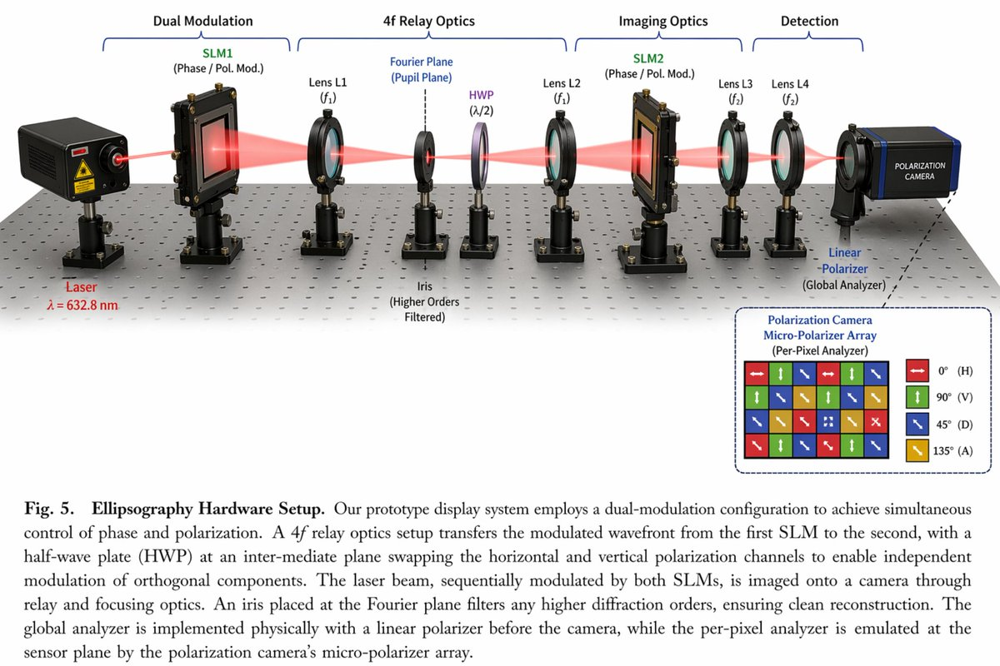

<!-- GENERATED from version JSON, sidecar metadata and personal corrections. Do not edit this reading copy. -->
# 信息图可视化设计

[返回画廊总览](../../docs/gallery.md) · [版本与来源记录](case.json)

案例编号：`case-awesome-gpt-image-2-82-71b7916f8811` · 版本：`v1`

版本说明：首次收录

资料类型：案例 · 复核状态：已复核

复核说明：已实际看图并阅读全文。光学平台、红色光路、透镜及偏振阵列；JSON完整定义装置，是输出科学示意图。 本次核对资料关系、图片角色和输入条件，不代表身份、事实或逐像素生成正确性验收。

## 案例图片

### 图片 1 · 输出效果图

来源角色：`source_example`

角色依据：光学平台、红色光路、透镜及偏振阵列；JSON完整定义装置，是输出科学示意图。



## 完整提示词

```text
{
  "type": "scientific optical setup diagram",
  "main_setup": {
    "base": "optical breadboard table with grid of mounting holes",
    "beam": "red laser beam passing horizontally through all components",
    "top_grouping_brackets": [
      "{argument name=\"first component group\" default=\"Dual Modulation\"}",
      "4f Relay Optics",
      "Imaging Optics",
      "Detection"
    ],
    "components_left_to_right": [
      { "name": "Laser", "label": "{argument name=\"laser wavelength\" default=\"λ = 632.8 nm\"}", "appearance": "black rectangular box" },
      { "name": "SLM1", "label": "(Phase / Pol. Mod.)", "appearance": "black square device on post" },
      { "name": "Lens L1", "label": "(f1)", "appearance": "lens in black ring mount" },
      { "name": "Iris", "label": "Fourier Plane (Pupil Plane) / (Higher Orders Filtered)", "appearance": "black ring mount with dashed line above" },
      { "name": "HWP", "label": "(λ/2)", "appearance": "purple-tinted optic in black ring mount" },
      { "name": "Lens L2", "label": "(f1)", "appearance": "lens in black ring mount" },
      { "name": "SLM2", "label": "(Phase / Pol. Mod.)", "appearance": "black square device on post" },
      { "name": "Lens L3", "label": "(f2)", "appearance": "lens in black ring mount" },
      { "name": "Lens L4", "label": "(f2)", "appearance": "lens in black ring mount" },
      { "name": "Linear Polarizer", "label": "(Global Analyzer)", "appearance": "lens in black ring mount" },
      { "name": "Polarization Camera", "label": "POLARIZATION CAMERA", "appearance": "blue and black box camera" }
    ]
  },
  "inset_diagram": {
    "position": "bottom right, dashed border",
    "title": "{argument name=\"inset title\" default=\"Polarization Camera Micro-Polarizer Array\"} (Per-Pixel Analyzer)",
    "visuals": "4x4 grid of colored squares with white directional arrows",
    "legend_count": 4,
    "legend_labels": [
      "red right-arrow 0° (H)",
      "green up-arrow 90° (V)",
      "blue diagonal-arrow 45° (D)",
      "yellow diagonal-arrow 135° (A)"
    ]
  },
  "bottom_caption": {
    "figure_number": "Fig. 5.",
    "title": "{argument name=\"setup title\" default=\"Ellipsography Hardware Setup.\"}",
    "description": "{argument name=\"figure caption\" default=\"Our prototype display system employs a dual-modulation configuration to achieve simultaneous control of phase and polarization. A 4f relay optics setup transfers the modulated wavefront...\"}"
  }
}
```

[查看原始来源](https://x.com/HumanOS_v2)
