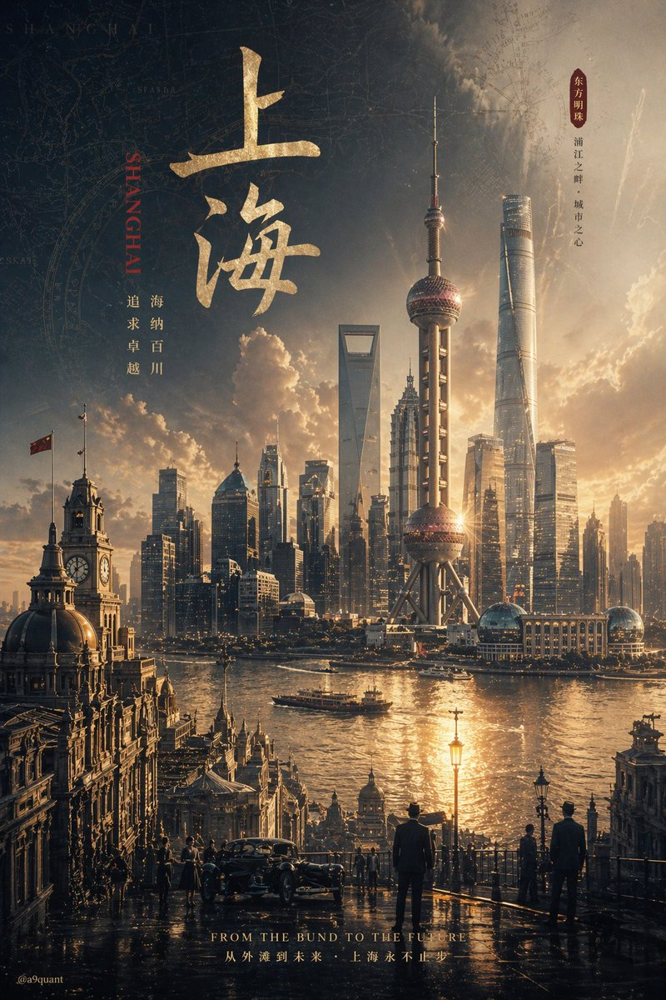

<!-- GENERATED from version JSON. Do not edit this reading copy. -->
# 信息图可视化设计

[返回画廊总览](../../docs/gallery.md) · [版本与来源记录](case.json)

案例编号：`case-awesome-gpt-image-2-88-038e43335ba9` · 版本：`v1`

版本说明：首次收录

## 案例图片



## 完整提示词

```text
GPT-Image-2 prompt: please automatically generate a top-tier concept poster / infographic-style movie poster centered around {argument name="theme" default="ranking of emperors in Chinese history"}.

Require the AI to automatically derive and uniformly design the entire following visual system based on this theme, without my extra specification:
- Core subject (automatically judge suitability for people, products, architecture, artifacts, symbols, scenes, or abstract imagery)
- Bottom supporting structure
- Hovering symbols or spiritual symbols above
- Scene wrapping elements
- Metaphor system
- Color hierarchy
- Material contrast
- Lighting logic
- Title, subtitle, and auxiliary copy
- Brand sense and high-end expression

The final frame must be: a shocking, precise, unified, cinematic, ultra-high detail conceptual key visual poster suitable for high-end printing.

[Overall Style]
Ultra-realistic 3D commercial CGI rendering, merging cinematic lighting, luxury visual language, futuristic concept design, and epic composition. The image must have a "single main visual core," not messy, not like a collage, and not like a regular e-commerce poster.

[Automatic Derivation Rules]
AI must automatically decide based on the [theme]:
1. Core visual metaphor
2. Subject type and posture
3. Form of supporting structure
4. Form of suspended elements
5. Scene shell and spatial atmosphere
6. Main, auxiliary, and emphasis colors
7. Material combinations
8. Text temperament and layout style

[Composition Rules]
- Absolute sense of premium quality
- Strong central order, overall unity
- Allows for axial symmetry or epic composition near the central axis
- Clear visual gravity, forming clear levels from top to bottom
- Edge negative space is clean, restrained, and has room to breathe

[Visual Quality]
- Ultra-high detail
- Clear volumetric light
- Authentic materials
- Natural reflection, refraction, shadows, fog, and depth of field
- Overall standard of high-end brand campaign key visual / luxury invitation poster / conceptual editorial poster

[Typography System]
- Overall 90% visual, 10% text
- AI automatically generates the most matching main title and subtitle based on the [theme]
- Title must be concise, sharp, and powerful
- Text should be as minimal and accurate as possible; do not stack words

[Signature Requirement]
Naturally add the author signature in the bottom corner: @a9quant
```

[查看原始来源](https://x.com/A9Quant)
