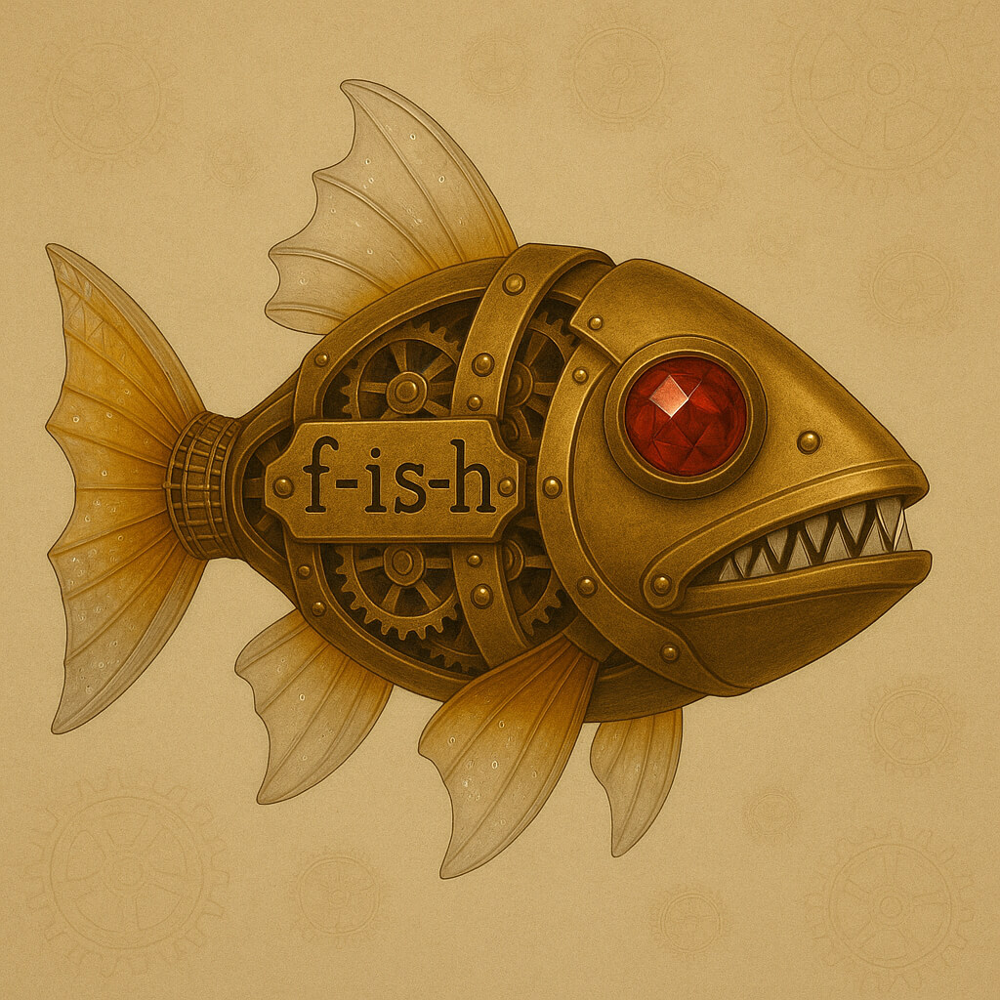

<!-- GENERATED from version JSON, sidecar metadata and personal corrections. Do not edit this reading copy. -->
# 蒸汽朋克机械鱼

[返回画廊总览](../../docs/gallery.md) · [版本与来源记录](case.json)

案例编号：`case-jamez-awesome-gpt4o-images-64-60796c67e3e7` · 版本：`v1`

版本说明：首次收录

资料类型：案例 · 复核状态：已复核

复核说明：实际看图：右向全身机械鱼、黄铜齿轮、红色多面眼睛、琥珀色半透明鳍、f-is-h小写文字符合主旨；尾鳍不像金属丝网、牙齿的金刚石感不明显，不能宣称每项细节都实现。

## 案例图片

### 图片 1 · 输出效果图

来源角色：`output`

角色依据：Case YAML image field; viewed actual output; no required external reference in prompt or reference_note.



## 完整提示词

```text
一个蒸汽朋克风格的机械鱼，身体为黄铜风格，可以清楚的看到其动作时的机械齿轮结构。
能略微看到它的机械牙齿，整齐并且紧闭，上下牙齿都可以看到。每颗牙齿均呈三角状，材质为金刚石。
尾鳍为金属丝编织结构，其它部分的鱼鳍是半透明的琥珀色玻璃，其中有一些不太明显的气泡。
眼睛是多面红宝石，能清晰的看到它反射出来的光泽。
鱼有身上能清晰的看到"f-is-h"字样，其中字母全部为小写，并且注意横线位置。
图片是正方形的，整个画面中可以看到鱼的全身，在画面正中，鱼头向右，并且有一定的留白画面并不局促，画面的左右留出更多的空间。背景中有淡淡的蒸汽朋克风的齿轮纹理。
整个鱼看起非常炫酷。这是一张高清图片，整张照片的细节非常丰富，并且有独特的质感与美感。画面不要太暗。

```

## Original prompt (prompt_en)

```text
A steampunk-style mechanical fish with a brass body and clearly visible gear mechanisms when in motion.
Its mechanical teeth can be slightly seen, neatly arranged and closed, with both upper and lower teeth visible. Each tooth is triangular in shape and made of diamond material.
The tail fin has a metal wire mesh structure, while other fins are made of semi-transparent amber-colored glass with some subtle bubbles inside.
The eyes are multi-faceted rubies, with clearly visible reflective shine.
The fish has "f-is-h" text clearly visible on its body, with all lowercase letters and careful attention to the hyphen placement.
The image is square, showing the entire fish in the center of the frame, with its head pointing to the right. There is adequate white space around the fish, with more space on the left and right sides. The background has subtle steampunk-style gear patterns.
The entire fish looks very cool. This is a high-definition image with extremely rich details and unique texture and aesthetics. The image should not be too dark.

```

## 模型与参数

```json
{
  "model": "GPT-4o",
  "parameters": null
}
```

[查看原始来源](https://github.com/jamez-bondos/awesome-gpt4o-images/blob/3ed4dbb0f1ae6f7385c81e1fcea48d9eefd2e596/cases/64/case.yml)
