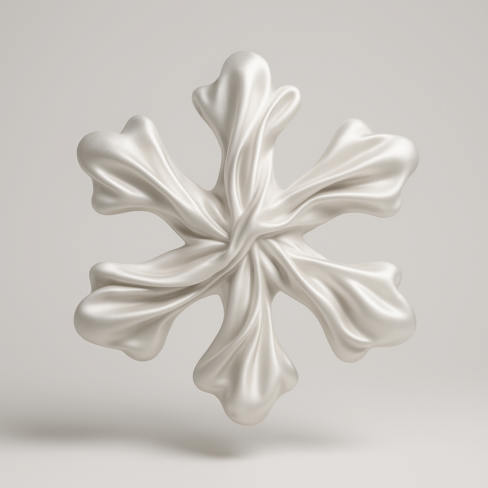

<!-- GENERATED from version JSON, sidecar metadata and personal corrections. Do not edit this reading copy. -->
# 创意丝绸宇宙

[返回画廊总览](../../docs/gallery.md) · [版本与来源记录](case.json)

案例编号：`case-jamez-awesome-gpt4o-images-66-19f0b84ac3ff` · 版本：`v1`

版本说明：首次收录

资料类型：案例 · 复核状态：已复核

复核说明：实际看图：六瓣雪花形白色丝绸物体悬浮在浅灰背景，褶皱、柔和高光、底部投影可见。没有外部输入要求；emoji在prompt中完整保留。

## 案例图片

### 图片 1 · 输出效果图

来源角色：`output`

角色依据：Case YAML image field; viewed actual output; no required external reference in prompt or reference_note.



## 完整提示词

```text
将 {❄️} 变成一个柔软的 3D 丝绸质感物体。整个物体表面包裹着顺滑流动的丝绸面料，带有超现实的褶皱细节、柔和的高光与阴影。该物体轻轻漂浮在干净的浅灰色背景中央，营造出轻盈优雅的氛围。整体风格超现实、触感十足且现代，传递出舒适与精致趣味的感觉。工作室灯光，高分辨率渲染。

```

## Original prompt (prompt_en)

```text
Transform the {❄️} into a soft 3D object with a silk texture. The entire surface of the object is wrapped in smooth and flowing silk fabric, featuring surreal wrinkle details, soft highlights, and shadows. The object gently floats in the center of a clean light gray background, creating a light and elegant atmosphere. The overall style is surreal, tactile, and modern, conveying a sense of comfort and refined playfulness. Studio lighting, high-resolution rendering.

```

[查看原始来源](https://github.com/jamez-bondos/awesome-gpt4o-images/blob/3ed4dbb0f1ae6f7385c81e1fcea48d9eefd2e596/cases/66/case.yml)
