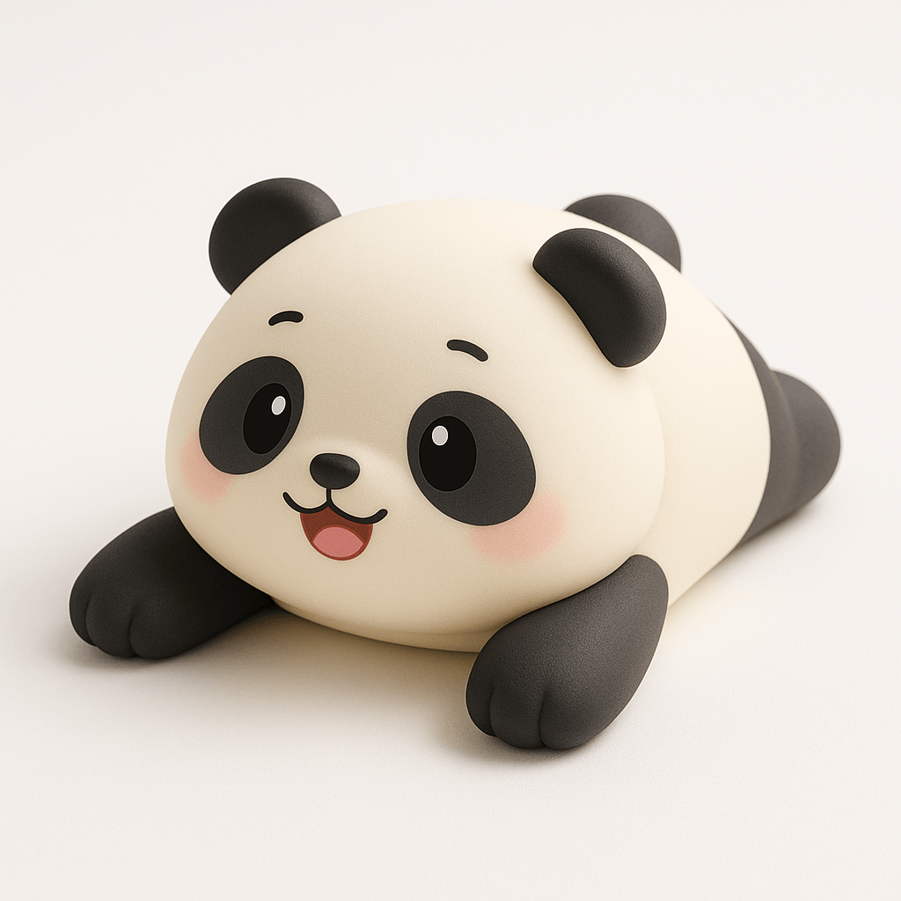

<!-- GENERATED from version JSON, sidecar metadata and personal corrections. Do not edit this reading copy. -->
# 动物硅胶腕托

[返回画廊总览](../../docs/gallery.md) · [版本与来源记录](case.json)

案例编号：`case-jamez-awesome-gpt4o-images-84-2d7bc8b0cfb0` · 版本：`v1`

版本说明：首次收录

资料类型：案例 · 复核状态：已复核

复核说明：实际看图：黑白熊猫腕托、趴卧张臂、哑光柔软外观及白底柔光符合主旨。食品级、内部慢回弹棉和舒适性仅为prompt设定，不能由效果图验证。

## 案例图片

### 图片 1 · 输出效果图

来源角色：`output`

角色依据：Case YAML image field; viewed actual output; no required external reference in prompt or reference_note.



## 完整提示词

```text
创建图片 一个可爱Q版的硅胶护腕托，外形基于【🐼】表情，采用柔软的食品级硅胶材质，表面为亲肤哑光质感，内部填充慢回弹棉，拟人化卡通风格，表情生动，双手张开趴在桌面上，呈现出拥抱手腕的姿势，整体造型圆润软萌，颜色为【🐼】配色，风格治愈可爱，适合办公使用，背景为白色纯色，柔和布光，产品摄影风格，前视角或45度俯视，高清细节，突出硅胶质感与舒适功能

```

## Original prompt (prompt_en)

```text
Create an image of a cute chibi-style silicone wrist rest based on the {🐼} emoji. The wrist rest is made of soft, food-grade silicone with a skin-friendly matte surface. The interior is filled with slow-rebound foam. Designed in a personified cartoon style, the expression is lively, with both arms stretched out as if hugging the user’s wrist while lying on a desk. The overall shape is round, soft, and adorable, featuring the classic {🐼} color scheme. The design is comforting and cute, suitable for office use. The background is a solid white color with soft lighting. Rendered in a product photography style, the angle is either front-facing or at a 45-degree top-down view, showcasing high-definition details and emphasizing the silicone texture and comfort functionality.

```

[查看原始来源](https://github.com/jamez-bondos/awesome-gpt4o-images/blob/3ed4dbb0f1ae6f7385c81e1fcea48d9eefd2e596/cases/84/case.yml)
