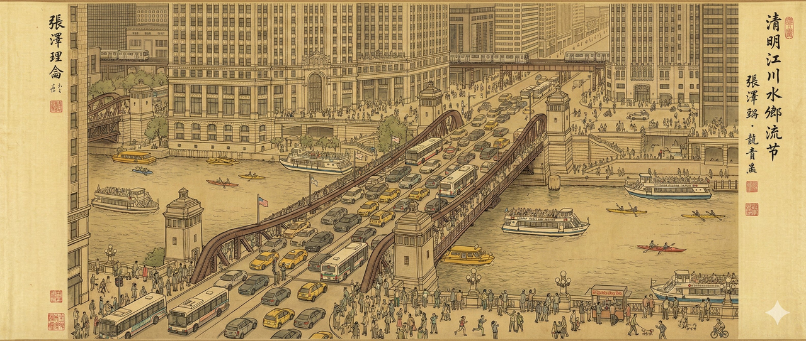

<!-- GENERATED from version JSON, sidecar metadata and personal corrections. Do not edit this reading copy. -->
# 清明上河图风格图像

[返回画廊总览](../../docs/gallery.md) · [版本与来源记录](case.json)

案例编号：`case-picotrex-nano-banana-selected-pro-case26-93d3d492fe3d` · 版本：`v1`

版本说明：首次收录

资料类型：案例 · 复核状态：已复核

复核说明：实看为黄褐绢本长卷、桥梁现代车辆、建筑细线和河岸小人物，符合张择端风格及现代芝加哥重绘意图。未独立核验地理细节与题字；不声称是张择端真作。

## 案例图片

### 图片 1 · 输出效果图

来源角色：`output`

角色依据：README明确标注并逐图实看



## 完整提示词

```text
一幅气势恢宏、细节丰富的传统中国水墨彩绘手卷，绘于古旧绢本之上，完美地模仿了张择端名作《清明上河图》的艺术风格、笔法和散点透视。
中心场景：俯瞰熙熙攘攘的现代芝加哥河滨。画面焦点是巨大的钢制开启桥（杜萨布尔桥/密歇根大道桥），桥上车水马龙，无数汽车、黄色出租车和芝加哥交通管理局（CTA）公交车穿梭其间，所有景象均以精准的传统笔触描绘。
环境细节：下方的芝加哥河上，现代建筑风格的游船、水上出租车和皮划艇穿梭其间。河岸两侧林立着风格各异的芝加哥摩天大楼（形似箭牌大厦和论坛报大厦），以传统的“界画”建筑绘画技法绘制而成。背景中可见高架铁路和正在行驶的“L”型列车。
人类活动：河滨步道和桥边的人行道上挤满了数百个身着现代休闲服饰的小人。他们有的在慢跑，有的在用智能手机拍照，有的在街头小吃摊（热狗摊）前排队，有的在遛狗。整个场景细节丰富，略显杂乱，并以柔和的复古大地色调呈现。
```

## 模型与参数

```json
{
  "model": "Nano Banana Pro",
  "parameters": null
}
```

[查看原始来源](https://github.com/PicoTrex/Awesome-Nano-Banana-images/blob/2558bf0bb825be150c5d1aeab918cd90004882d3/README.md)
