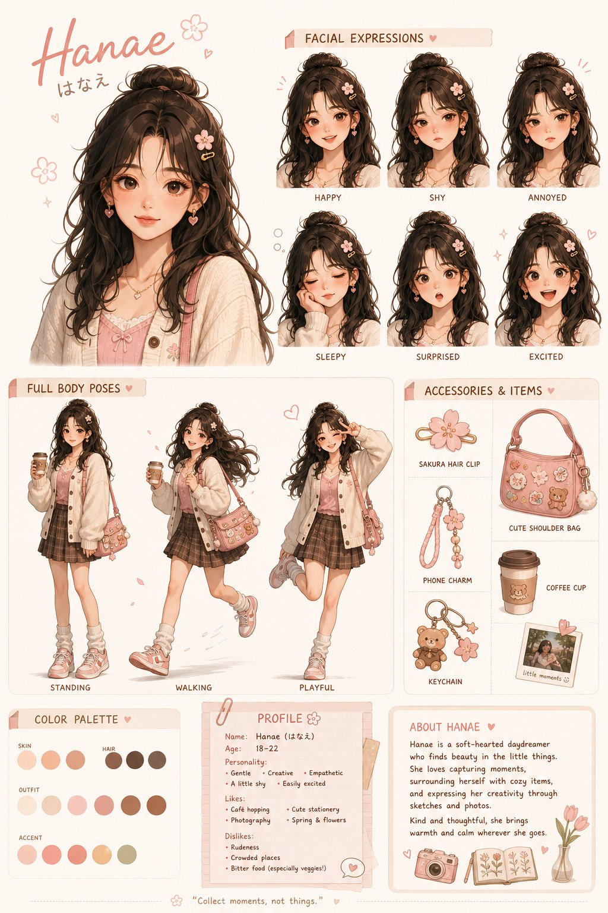
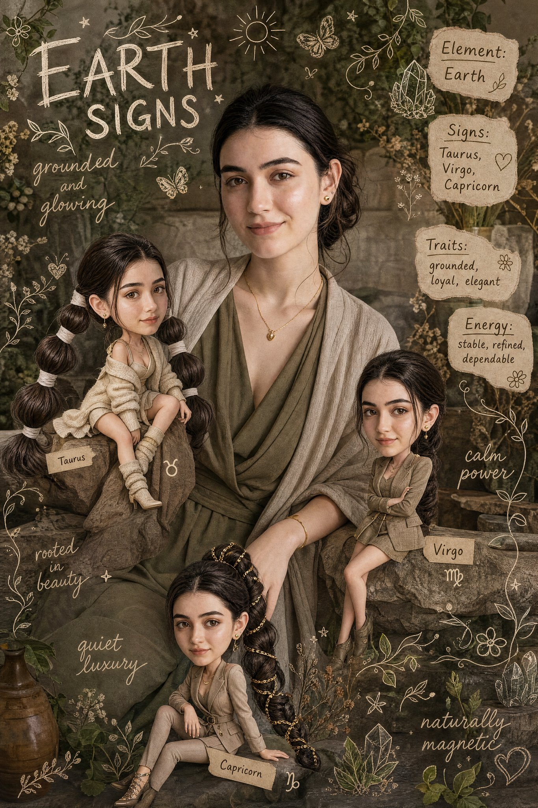

<!-- Generated by scripts/gallery.py; edit authoritative JSON, then rebuild. -->

# 人物与角色

[返回画廊总览](../gallery.md)

共 31 条资料。点击标题查看本库图片与原始内容。

<table>
<tr>
<td width="33%" align="center" valign="top"> <a href="../../cases/case-awesome-gpt-image-2-25-6a36cee8c2fa/v1.md"><strong>综合应用场景图 · v1</strong></a> awesome-gpt-image-2 #25 原图文案例 · gpt-image 已记录补充核查结果；以详情中的输入要求为准</td>
<td width="33%" align="center" valign="top"> <a href="../../cases/case-awesome-gpt-image-2-27-6560ab3a32c6/v1.md"><strong>人物角色设定图 · v1</strong></a> awesome-gpt-image-2 #27 原图文案例 · gpt-image 待复核：尚无补充核查，不代表必要输入已齐全</td>
<td width="33%" align="center" valign="top"> <a href="../../cases/case-awesome-gpt-image-2-41-d2bd5fb5a883/v1.md"><strong>插画艺术风格创作 · v1</strong></a> awesome-gpt-image-2 #41 原图文案例 · gpt-image 待复核：尚无补充核查，不代表必要输入已齐全</td>
</tr>
<tr>
<td width="33%" align="center" valign="top"> <a href="../../cases/case-awesome-gpt-image-2-123-5edf0f16a1d5/v1.md"><strong>插画艺术创作图 · v1</strong></a> awesome-gpt-image-2 #123 原图文案例 · gpt-image 待复核：尚无补充核查，不代表必要输入已齐全</td>
<td width="33%" align="center" valign="top"> <a href="../../cases/case-awesome-gpt-image-2-162-f326a545368c/v1.md"><strong>人物角色设定图 · v1</strong></a> awesome-gpt-image-2 #162 原图文案例 · gpt-image 待复核：尚无补充核查，不代表必要输入已齐全</td>
<td width="33%" align="center" valign="top"> <a href="../../cases/case-awesome-gpt-image-2-212-dd2cd40cdc54/v1.md"><strong>专业设计师打造角色写真集 · v1</strong></a> awesome-gpt-image-2 #212 原图文案例 · gpt-image 已记录补充核查结果；以详情中的输入要求为准</td>
</tr>
<tr>
<td width="33%" align="center" valign="top"> <a href="../../cases/case-awesome-gpt-image-2-263-a90ff68570ef/v1.md"><strong>唯美二次元角色介绍网页 · v1</strong></a> awesome-gpt-image-2 #263 原图文案例 · gpt-image 待复核：尚无补充核查，不代表必要输入已齐全</td>
<td width="33%" align="center" valign="top"> <a href="../../cases/case-awesome-gpt-image-2-270-e42cc21d275a/v1.md"><strong>信息图可视化设计 · v1</strong></a> awesome-gpt-image-2 #270 原图文案例 · gpt-image 已记录补充核查结果；以详情中的输入要求为准</td>
<td width="33%" align="center" valign="top"> <a href="../../cases/case-awesome-gpt-image-2-271-08a899f115c7/v1.md"><strong>人物角色设定图 · v1</strong></a> awesome-gpt-image-2 #271 风格参考 · gpt-image 待复核：尚无补充核查，不代表必要输入已齐全</td>
</tr>
<tr>
<td width="33%" align="center" valign="top"> <a href="../../cases/case-awesome-gpt-image-2-306-487bc87ec95f/v1.md"><strong>官方角色设定资料卡 · v1</strong></a> awesome-gpt-image-2 #306 原图文案例 · gpt-image 已记录补充核查结果；以详情中的输入要求为准</td>
<td width="33%" align="center" valign="top"> <a href="../../cases/case-awesome-gpt-image-2-325-2d19ec404885/v1.md"><strong>皮克斯风阳光少年 · v1</strong></a> awesome-gpt-image-2 #325 原图文案例 · gpt-image 待复核：尚无补充核查，不代表必要输入已齐全</td>
<td width="33%" align="center" valign="top"> <a href="../../cases/case-awesome-gpt-image-2-326-4b5a2090f4e0/v1.md"><strong>红蓝撞色高跟诱惑 · v1</strong></a> awesome-gpt-image-2 #326 原图文案例 · gpt-image 待复核：尚无补充核查，不代表必要输入已齐全</td>
</tr>
<tr>
<td width="33%" align="center" valign="top"> <a href="../../cases/case-awesome-gpt-image-2-347-46f4b9df4c9f/v1.md"><strong>4×4 动作分解参考表 · v1</strong></a> awesome-gpt-image-2 #347 原图文案例 · gpt-image 待复核：尚无补充核查，不代表必要输入已齐全</td>
<td width="33%" align="center" valign="top"> <a href="../../cases/case-awesome-gpt-image-2-371-63d04f44a60f/v1.md"><strong>Scrapbook 真人图与迷你分身 · v1</strong></a> awesome-gpt-image-2 #371 原图文案例 · gpt-image 已记录补充核查结果；以详情中的输入要求为准</td>
<td width="33%" align="center" valign="top"> <a href="../../cases/case-awesome-gpt-image-2-372-a2019220dc21/v1.md"><strong>可爱角色设定表 · v1</strong></a> awesome-gpt-image-2 #372 原图文案例 · gpt-image 已记录补充核查结果；以详情中的输入要求为准</td>
</tr>
<tr>
<td width="33%" align="center" valign="top"> <a href="../../cases/case-awesome-gpt-image-2-378-7af4982cfca2/v1.md"><strong>高端 3D 收藏玩具头像 · v1</strong></a> awesome-gpt-image-2 #378 原图文案例 · gpt-image 待复核：尚无补充核查，不代表必要输入已齐全</td>
<td width="33%" align="center" valign="top"> <a href="../../cases/case-awesome-gpt-image-2-384-df34912f8bdd/v1.md"><strong>十国传统服饰时尚拼贴 · v1</strong></a> awesome-gpt-image-2 #384 原图文案例 · gpt-image 已记录补充核查结果；以详情中的输入要求为准</td>
<td width="33%" align="center" valign="top"> <a href="../../cases/case-awesome-gpt-image-2-397-bf10a0d7fef3/v1.md"><strong>街舞角色设定参考图 · v1</strong></a> awesome-gpt-image-2 #397 原图文案例 · gpt-image 待复核：尚无补充核查，不代表必要输入已齐全</td>
</tr>
<tr>
<td width="33%" align="center" valign="top"> <a href="../../cases/case-awesome-gpt-image-2-398-a6ef2d6c07e1/v1.md"><strong>8 套日常穿搭编辑拼贴 · v1</strong></a> awesome-gpt-image-2 #398 原图文案例 · gpt-image 待复核：尚无补充核查，不代表必要输入已齐全</td>
<td width="33%" align="center" valign="top"> <a href="../../cases/case-awesome-gpt-image-2-416-c89ef9d7b30f/v1.md"><strong>Earth Signs 角色 Scrapbook · v1</strong></a> awesome-gpt-image-2 #416 原图文案例 · gpt-image 待复核：尚无补充核查，不代表必要输入已齐全</td>
<td width="33%" align="center" valign="top"> <a href="../../cases/case-awesome-gpt-image-2-439-085cb12f9f61/v1.md"><strong>赛博黑客角色设定表 · v1</strong></a> awesome-gpt-image-2 #439 原图文案例 · gpt-image 待复核：尚无补充核查，不代表必要输入已齐全</td>
</tr>
<tr>
<td width="33%" align="center" valign="top"> <a href="../../cases/case-awesome-gpt-image-2-473-7b4b6261b32a/v1.md"><strong>ROGUE VIPER 游戏概念设定板 · v1</strong></a> awesome-gpt-image-2 #473 原图文案例 · gpt-image 待复核：尚无补充核查，不代表必要输入已齐全</td>
<td width="33%" align="center" valign="top"> <a href="../../cases/case-awesome-gpt-image-2-480-efebb4b75683/v1.md"><strong>粉丝速写本角色页 · v1</strong></a> awesome-gpt-image-2 #480 原图文案例 · gpt-image 已记录补充核查结果；以详情中的输入要求为准</td>
<td width="33%" align="center" valign="top"> <a href="../../cases/case-awesome-gpt-image-2-502-12acf3fa2aa8/v1.md"><strong>黑桃国王递归扑克牌 · v1</strong></a> awesome-gpt-image-2 #502 原图文案例 · gpt-image 已记录补充核查结果；以详情中的输入要求为准</td>
</tr>
<tr>
<td width="33%" align="center" valign="top"> <a href="../../cases/case-awesome-gpt-image-2-507-e8f386597159/v1.md"><strong>暖调钩织角色玩偶 · v1</strong></a> awesome-gpt-image-2 #507 原图文案例 · gpt-image 待复核：尚无补充核查，不代表必要输入已齐全</td>
<td width="33%" align="center" valign="top"> <a href="../../cases/case-awesome-gpt-image-2-512-a85add6ba440/v1.md"><strong>Brutalist Freestyle 角色设定表 · v1</strong></a> awesome-gpt-image-2 #512 原图文案例 · gpt-image 待复核：尚无补充核查，不代表必要输入已齐全</td>
<td width="33%" align="center" valign="top"> <a href="../../cases/case-awesome-gpt-image-2-522-567a152e8aad/v1.md"><strong>儿童故事书手绘头像 · v1</strong></a> awesome-gpt-image-2 #522 原图文案例 · gpt-image 已记录补充核查结果；以详情中的输入要求为准</td>
</tr>
<tr>
<td width="33%" align="center" valign="top"> <a href="../../cases/case-awesome-gpt-image-2-528-4de125c422f7/v1.md"><strong>圣诞街景 Chibi 真实背景人像 · v1</strong></a> awesome-gpt-image-2 #528 原图文案例 · gpt-image 已记录补充核查结果；以详情中的输入要求为准</td>
<td width="33%" align="center" valign="top"> <a href="../../cases/case-awesome-gpt-image-2-530-8f24a2d37563/v1.md"><strong>实拍背景涂鸦人物替换 · v1</strong></a> awesome-gpt-image-2 #530 原图文案例 · gpt-image 已记录补充核查结果；以详情中的输入要求为准</td>
<td width="33%" align="center" valign="top"> <a href="../../cases/case-awesome-gpt-image-2-533-09c3cb90d3d5/v1.md"><strong>手绘涂鸦时尚人物插画 · v1</strong></a> awesome-gpt-image-2 #533 原图文案例 · gpt-image 已记录补充核查结果；以详情中的输入要求为准</td>
</tr>
<tr>
<td width="33%" align="center" valign="top"> <a href="../../cases/case-awesome-gpt-image-2-535-a001325b4cde/v1.md"><strong>同一人脸十二款发型 Lookbook · v1</strong></a> awesome-gpt-image-2 #535 原图文案例 · gpt-image 已记录补充核查结果；以详情中的输入要求为准</td>
<td width="33%" align="center" valign="top"></td>
<td width="33%" align="center" valign="top"></td>
</tr>
</table>

