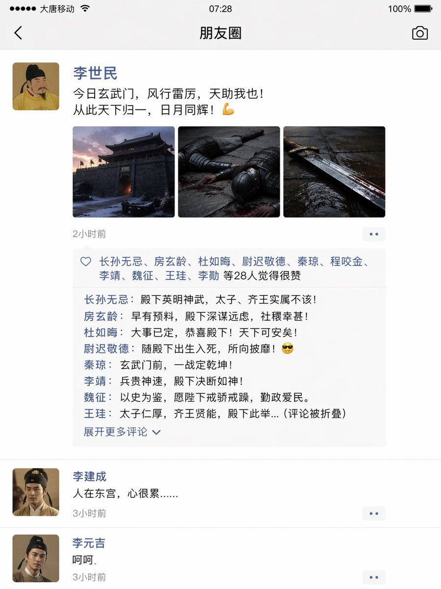
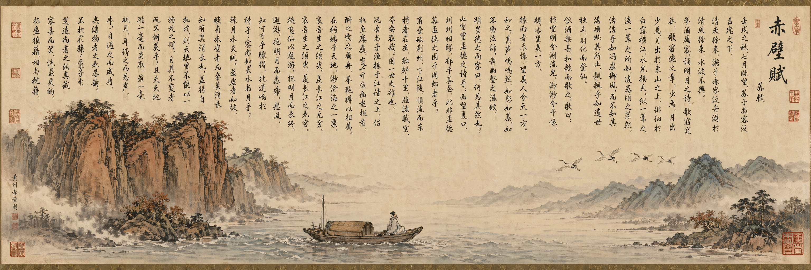
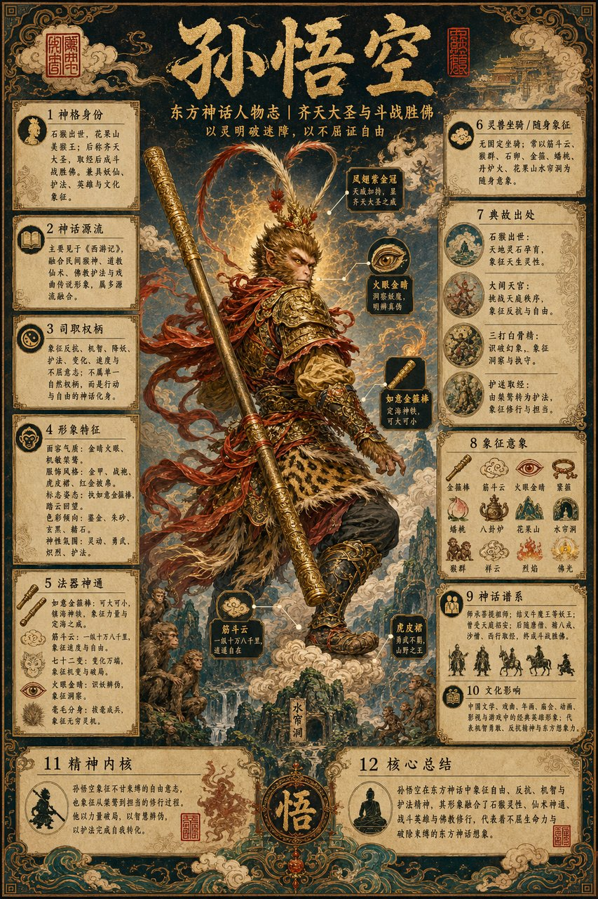

<!-- Generated by scripts/gallery.py; edit authoritative JSON, then rebuild. -->

# 历史与古风题材

[返回画廊总览](../gallery.md)

共 16 条资料。点击标题查看本库图片与原始内容。

<table>
<tr>
<td width="33%" align="center" valign="top"> <a href="../../cases/case-awesome-gpt-image-2-44-f3240f649ee6/v1.md"><strong>古风历史题材图 · v1</strong></a> awesome-gpt-image-2 #44 原图文案例 · gpt-image 缺少必要输入图：请先查看详情并补齐参考图</td>
<td width="33%" align="center" valign="top"> <a href="../../cases/case-awesome-gpt-image-2-167-10cbd42c2358/v1.md"><strong>大唐玄武门之变的朋友圈 · v1</strong></a> awesome-gpt-image-2 #167 原图文案例 · gpt-image 待复核：尚无补充核查，不代表必要输入已齐全</td>
<td width="33%" align="center" valign="top"> <a href="../../cases/case-awesome-gpt-image-2-174-5d36299d06ec/v1.md"><strong>唐朝贵妇遛粉色马甲异形工笔画 · v1</strong></a> awesome-gpt-image-2 #174 原图文案例 · gpt-image 待复核：尚无补充核查，不代表必要输入已齐全</td>
</tr>
<tr>
<td width="33%" align="center" valign="top"> <a href="../../cases/case-awesome-gpt-image-2-176-5197d6ada54f/v1.md"><strong>苏轼被贬首日朋友圈曝光 · v1</strong></a> awesome-gpt-image-2 #176 原图文案例 · gpt-image 待复核：尚无补充核查，不代表必要输入已齐全</td>
<td width="33%" align="center" valign="top"> <a href="../../cases/case-awesome-gpt-image-2-184-2f1b526c9b60/v1.md"><strong>杜甫朋友圈吐槽茅屋被掀翻 · v1</strong></a> awesome-gpt-image-2 #184 原图文案例 · gpt-image 待复核：尚无补充核查，不代表必要输入已齐全</td>
<td width="33%" align="center" valign="top"> <a href="../../cases/case-awesome-gpt-image-2-185-133c5d095646/v1.md"><strong>武则天发微博自拍太魔性了 · v1</strong></a> awesome-gpt-image-2 #185 原图文案例 · gpt-image 待复核：尚无补充核查，不代表必要输入已齐全</td>
</tr>
<tr>
<td width="33%" align="center" valign="top"> <a href="../../cases/case-awesome-gpt-image-2-205-8d841746ec8f/v1.md"><strong>皇宫深处的御用快递驿站 · v1</strong></a> awesome-gpt-image-2 #205 原图文案例 · gpt-image 待复核：尚无补充核查，不代表必要输入已齐全</td>
<td width="33%" align="center" valign="top"> <a href="../../cases/case-awesome-gpt-image-2-206-6bbf877baed7/v1.md"><strong>国风工笔八仙长卷插画 · v1</strong></a> awesome-gpt-image-2 #206 原图文案例 · gpt-image 待复核：尚无补充核查，不代表必要输入已齐全</td>
<td width="33%" align="center" valign="top"> <a href="../../cases/case-awesome-gpt-image-2-226-abc4e167702b/v1.md"><strong>古风明朝帝王群像长卷 · v1</strong></a> awesome-gpt-image-2 #226 原图文案例 · gpt-image 缺少必要输入图：请先查看详情并补齐参考图</td>
</tr>
<tr>
<td width="33%" align="center" valign="top"> <a href="../../cases/case-awesome-gpt-image-2-234-c404b2562130/v1.md"><strong>朱元璋登基后的推特主页 · v1</strong></a> awesome-gpt-image-2 #234 原图文案例 · gpt-image 待复核：尚无补充核查，不代表必要输入已齐全</td>
<td width="33%" align="center" valign="top"> <a href="../../cases/case-awesome-gpt-image-2-267-71d049b67c92/v1.md"><strong>宋朝文人的赛博朋友圈 · v1</strong></a> awesome-gpt-image-2 #267 原图文案例 · gpt-image 待复核：尚无补充核查，不代表必要输入已齐全</td>
<td width="33%" align="center" valign="top"> <a href="../../cases/case-awesome-gpt-image-2-268-bfe9929e944b/v1.md"><strong>威化岛回军前夕李成桂动态 · v1</strong></a> awesome-gpt-image-2 #268 原图文案例 · gpt-image 待复核：尚无补充核查，不代表必要输入已齐全</td>
</tr>
<tr>
<td width="33%" align="center" valign="top"> <a href="../../cases/case-awesome-gpt-image-2-292-9dd2e6e58fc4/v1.md"><strong>明朝登基宝玉的推文页面 · v1</strong></a> awesome-gpt-image-2 #292 原图文案例 · gpt-image 待复核：尚无补充核查，不代表必要输入已齐全</td>
<td width="33%" align="center" valign="top"> <a href="../../cases/case-awesome-gpt-image-2-337-4781279291a5/v1.md"><strong>《短歌行》诗词意境图 · v1</strong></a> awesome-gpt-image-2 #337 原图文案例 · gpt-image 待复核：尚无补充核查，不代表必要输入已齐全</td>
<td width="33%" align="center" valign="top"> <a href="../../cases/case-awesome-gpt-image-2-338-0b9e03028247/v1.md"><strong>《赤壁怀古》长卷图 · v1</strong></a> awesome-gpt-image-2 #338 原图文案例 · gpt-image 待复核：尚无补充核查，不代表必要输入已齐全</td>
</tr>
<tr>
<td width="33%" align="center" valign="top"> <a href="../../cases/case-awesome-gpt-image-2-415-e0b06762f04d/v1.md"><strong>东方神话人物志百科海报 · v1</strong></a> awesome-gpt-image-2 #415 原图文案例 · gpt-image 待复核：尚无补充核查，不代表必要输入已齐全</td>
<td width="33%" align="center" valign="top"></td>
<td width="33%" align="center" valign="top"></td>
</tr>
</table>

