<!-- Generated by scripts/gallery.py; edit authoritative JSON, then rebuild. -->

# 插画与艺术

[返回画廊总览](../gallery.md)

共 80 条资料。点击标题查看本库图片与原始内容。

<table>
<tr>
<td width="33%" align="center" valign="top"> <a href="../../cases/case-awesome-gpt-image-2-6-2ea137633699/v1.md"><strong>插画艺术创作图 · v1</strong></a> awesome-gpt-image-2 #6 原图文案例 · gpt-image 已记录补充核查结果；以详情中的输入要求为准</td>
<td width="33%" align="center" valign="top"> <a href="../../cases/case-awesome-gpt-image-2-22-3feea9504096/v1.md"><strong>插画艺术风格创作 · v1</strong></a> awesome-gpt-image-2 #22 原图文案例 · gpt-image 已记录补充核查结果；以详情中的输入要求为准</td>
<td width="33%" align="center" valign="top"> <a href="../../cases/case-awesome-gpt-image-2-30-0e57a476216a/v1.md"><strong>写实摄影风格图 · v1</strong></a> awesome-gpt-image-2 #30 原图文案例 · gpt-image 已记录补充核查结果；以详情中的输入要求为准</td>
</tr>
<tr>
<td width="33%" align="center" valign="top"> <a href="../../cases/case-awesome-gpt-image-2-32-25aa2988d516/v1.md"><strong>插画艺术创作图 · v1</strong></a> awesome-gpt-image-2 #32 原图文案例 · gpt-image 已记录补充核查结果；以详情中的输入要求为准</td>
<td width="33%" align="center" valign="top"> <a href="../../cases/case-awesome-gpt-image-2-34-3fb1924963d3/v1.md"><strong>插画艺术创作图 · v1</strong></a> awesome-gpt-image-2 #34 原图文案例 · gpt-image 已记录补充核查结果；以详情中的输入要求为准</td>
<td width="33%" align="center" valign="top"> <a href="../../cases/case-awesome-gpt-image-2-37-ac0a3a41e89b/v1.md"><strong>综合应用场景图 · v1</strong></a> awesome-gpt-image-2 #37 原图文案例 · gpt-image 已记录补充核查结果；以详情中的输入要求为准</td>
</tr>
<tr>
<td width="33%" align="center" valign="top"> <a href="../../cases/case-awesome-gpt-image-2-38-47f34e325382/v1.md"><strong>综合应用场景图 · v1</strong></a> awesome-gpt-image-2 #38 原图文案例 · gpt-image 已记录补充核查结果；以详情中的输入要求为准</td>
<td width="33%" align="center" valign="top"> <a href="../../cases/case-awesome-gpt-image-2-39-d32b7749886e/v1.md"><strong>综合应用场景图 · v1</strong></a> awesome-gpt-image-2 #39 原图文案例 · gpt-image 已记录补充核查结果；以详情中的输入要求为准</td>
<td width="33%" align="center" valign="top"> <a href="../../cases/case-awesome-gpt-image-2-40-2502f87b984b/v1.md"><strong>综合应用场景图 · v1</strong></a> awesome-gpt-image-2 #40 原图文案例 · gpt-image 已记录补充核查结果；以详情中的输入要求为准</td>
</tr>
<tr>
<td width="33%" align="center" valign="top"><a href="../../cases/case-awesome-gpt-image-2-43-df5abf7f8325/v1.md">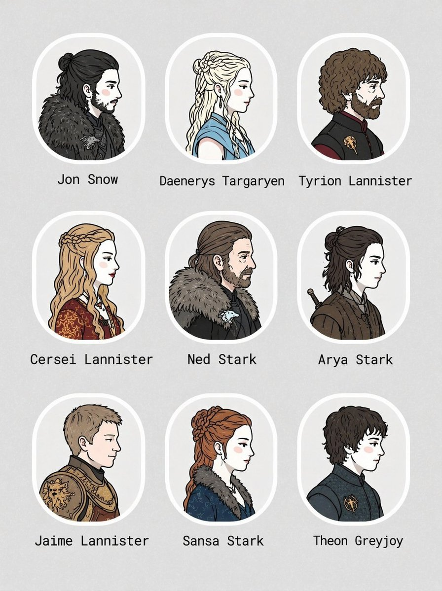</a> <a href="../../cases/case-awesome-gpt-image-2-43-df5abf7f8325/v1.md"><strong>插画艺术创作图 · v1</strong></a> awesome-gpt-image-2 #43 原图文案例 · gpt-image 已记录补充核查结果；以详情中的输入要求为准</td>
<td width="33%" align="center" valign="top"> <a href="../../cases/case-awesome-gpt-image-2-52-826ddb2ffb6e/v1.md"><strong>写实摄影风格图 · v1</strong></a> awesome-gpt-image-2 #52 原图文案例 · gpt-image 已记录补充核查结果；以详情中的输入要求为准</td>
<td width="33%" align="center" valign="top"> <a href="../../cases/case-awesome-gpt-image-2-60-9e822e1d9d72/v1.md"><strong>漫画分镜叙事设计 · v1</strong></a> awesome-gpt-image-2 #60 原图文案例 · gpt-image 已记录补充核查结果；以详情中的输入要求为准</td>
</tr>
<tr>
<td width="33%" align="center" valign="top"> <a href="../../cases/case-awesome-gpt-image-2-112-f1e2fd4c65e9/v1.md"><strong>信息图可视化设计 · v1</strong></a> awesome-gpt-image-2 #112 原图文案例 · gpt-image 已记录补充核查结果；以详情中的输入要求为准</td>
<td width="33%" align="center" valign="top"> <a href="../../cases/case-awesome-gpt-image-2-113-6f9229fcecfe/v1.md"><strong>动漫插画创作图 · v1</strong></a> awesome-gpt-image-2 #113 原图文案例 · gpt-image 已记录补充核查结果；以详情中的输入要求为准</td>
<td width="33%" align="center" valign="top"> <a href="../../cases/case-awesome-gpt-image-2-114-fc7182d3f46d/v1.md"><strong>插画艺术创作图 · v1</strong></a> awesome-gpt-image-2 #114 原图文案例 · gpt-image 已记录补充核查结果；以详情中的输入要求为准</td>
</tr>
<tr>
<td width="33%" align="center" valign="top"> <a href="../../cases/case-awesome-gpt-image-2-115-44e8eff1d8d4/v1.md"><strong>品牌视觉识别图 · v1</strong></a> awesome-gpt-image-2 #115 原图文案例 · gpt-image 已记录补充核查结果；以详情中的输入要求为准</td>
<td width="33%" align="center" valign="top"> <a href="../../cases/case-awesome-gpt-image-2-116-f749fd6523da/v1.md"><strong>主题海报版式设计 · v1</strong></a> awesome-gpt-image-2 #116 原图文案例 · gpt-image 已记录补充核查结果；以详情中的输入要求为准</td>
<td width="33%" align="center" valign="top"> <a href="../../cases/case-awesome-gpt-image-2-117-85e19583cec6/v1.md"><strong>主题海报版式设计 · v1</strong></a> awesome-gpt-image-2 #117 原图文案例 · gpt-image 已记录补充核查结果；以详情中的输入要求为准</td>
</tr>
<tr>
<td width="33%" align="center" valign="top"> <a href="../../cases/case-awesome-gpt-image-2-118-1def799583cc/v1.md"><strong>漫画分镜叙事设计 · v1</strong></a> awesome-gpt-image-2 #118 原图文案例 · gpt-image 已记录补充核查结果；以详情中的输入要求为准</td>
<td width="33%" align="center" valign="top"> <a href="../../cases/case-awesome-gpt-image-2-120-0264a2c1a925/v1.md"><strong>建筑空间场景图 · v1</strong></a> awesome-gpt-image-2 #120 原图文案例 · gpt-image 已记录补充核查结果；以详情中的输入要求为准</td>
<td width="33%" align="center" valign="top"> <a href="../../cases/case-awesome-gpt-image-2-121-193212d75b64/v1.md"><strong>建筑空间场景图 · v1</strong></a> awesome-gpt-image-2 #121 原图文案例 · gpt-image 已记录补充核查结果；以详情中的输入要求为准</td>
</tr>
<tr>
<td width="33%" align="center" valign="top"> <a href="../../cases/case-awesome-gpt-image-2-125-6e41c0a34420/v1.md"><strong>电商商品展示设计 · v1</strong></a> awesome-gpt-image-2 #125 原图文案例 · gpt-image 已记录补充核查结果；以详情中的输入要求为准</td>
<td width="33%" align="center" valign="top"> <a href="../../cases/case-awesome-gpt-image-2-127-9b57e85a51c2/v1.md"><strong>建筑空间场景图 · v1</strong></a> awesome-gpt-image-2 #127 原图文案例 · gpt-image 已记录补充核查结果；以详情中的输入要求为准</td>
<td width="33%" align="center" valign="top"> <a href="../../cases/case-awesome-gpt-image-2-129-6a781bef5ac3/v1.md"><strong>绘画艺术风格图 · v1</strong></a> awesome-gpt-image-2 #129 原图文案例 · gpt-image 已记录补充核查结果；以详情中的输入要求为准</td>
</tr>
<tr>
<td width="33%" align="center" valign="top"> <a href="../../cases/case-awesome-gpt-image-2-193-5570f9743359/v1.md"><strong>千手观音化身打工人 · v1</strong></a> awesome-gpt-image-2 #193 原图文案例 · gpt-image 已记录补充核查结果；以详情中的输入要求为准</td>
<td width="33%" align="center" valign="top"> <a href="../../cases/case-awesome-gpt-image-2-231-4765dd3df624/v1.md"><strong>疾风起狂草艺术字体设计 · v1</strong></a> awesome-gpt-image-2 #231 原图文案例 · gpt-image 已记录补充核查结果；以详情中的输入要求为准</td>
<td width="33%" align="center" valign="top"> <a href="../../cases/case-awesome-gpt-image-2-233-b2bbd87dc2ea/v1.md"><strong>蒙娜丽莎畅饮可乐的趣味油画 · v1</strong></a> awesome-gpt-image-2 #233 原图文案例 · gpt-image 已记录补充核查结果；以详情中的输入要求为准</td>
</tr>
<tr>
<td width="33%" align="center" valign="top"> <a href="../../cases/case-awesome-gpt-image-2-246-259086cd2ade/v1.md"><strong>黑白线稿勾勒的上海风情 · v1</strong></a> awesome-gpt-image-2 #246 原图文案例 · gpt-image 已记录补充核查结果；以详情中的输入要求为准</td>
<td width="33%" align="center" valign="top"> <a href="../../cases/case-awesome-gpt-image-2-281-6299893a5988/v1.md"><strong>赛博朋克科幻曼荼罗 · v1</strong></a> awesome-gpt-image-2 #281 原图文案例 · gpt-image 已记录补充核查结果；以详情中的输入要求为准</td>
<td width="33%" align="center" valign="top"> <a href="../../cases/case-awesome-gpt-image-2-299-8416e1d1dc5c/v1.md"><strong>极简留白涂鸦手绘草图 · v1</strong></a> awesome-gpt-image-2 #299 原图文案例 · gpt-image 已记录补充核查结果；以详情中的输入要求为准</td>
</tr>
<tr>
<td width="33%" align="center" valign="top"> <a href="../../cases/case-awesome-gpt-image-2-316-d82a42567af9/v1.md"><strong>冲破次元壁的写实漫画跑者 · v1</strong></a> awesome-gpt-image-2 #316 原图文案例 · gpt-image 已记录补充核查结果；以详情中的输入要求为准</td>
<td width="33%" align="center" valign="top"> <a href="../../cases/case-awesome-gpt-image-2-346-40ad00863d36/v1.md"><strong>立体刺绣小鸟花枝 · v1</strong></a> awesome-gpt-image-2 #346 原图文案例 · gpt-image 已记录补充核查结果；以详情中的输入要求为准</td>
<td width="33%" align="center" valign="top"> <a href="../../cases/case-awesome-gpt-image-2-356-ceefa59f3f53/v1.md"><strong>过度思考超现实街头 Campaign · v1</strong></a> awesome-gpt-image-2 #356 原图文案例 · gpt-image 已记录补充核查结果；以详情中的输入要求为准</td>
</tr>
<tr>
<td width="33%" align="center" valign="top"> <a href="../../cases/case-awesome-gpt-image-2-374-cfc10bacefaa/v1.md"><strong>彩色潦草小狗线条风格重绘 · v1</strong></a> awesome-gpt-image-2 #374 原图文案例 · gpt-image 已记录补充核查结果；以详情中的输入要求为准</td>
<td width="33%" align="center" valign="top"> <a href="../../cases/case-awesome-gpt-image-2-405-3c0ce979501b/v1.md"><strong>可爱纸艺风照片重绘 · v1</strong></a> awesome-gpt-image-2 #405 原图文案例 · gpt-image 已记录补充核查结果；以详情中的输入要求为准</td>
<td width="33%" align="center" valign="top"> <a href="../../cases/case-awesome-gpt-image-2-409-8069a10bd1c0/v1.md"><strong>拙劣 MS Paint 风重绘 · v1</strong></a> awesome-gpt-image-2 #409 原图文案例 · gpt-image 已记录补充核查结果；以详情中的输入要求为准</td>
</tr>
<tr>
<td width="33%" align="center" valign="top"><a href="../../cases/case-awesome-gpt-image-2-410-06591a0f7ea4/v1.md">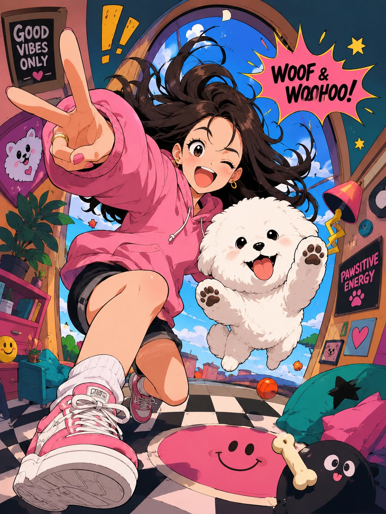</a> <a href="../../cases/case-awesome-gpt-image-2-410-06591a0f7ea4/v1.md"><strong>夸张动漫风主体重绘 · v1</strong></a> awesome-gpt-image-2 #410 原图文案例 · gpt-image 已记录补充核查结果；以详情中的输入要求为准</td>
<td width="33%" align="center" valign="top"> <a href="../../cases/case-awesome-gpt-image-2-423-c70b77cf23c8/v1.md"><strong>日系手绘涂鸦半身插画 · v1</strong></a> awesome-gpt-image-2 #423 原图文案例 · gpt-image 已记录补充核查结果；以详情中的输入要求为准</td>
<td width="33%" align="center" valign="top"><a href="../../cases/case-awesome-gpt-image-2-430-cd07726e148a/v1.md">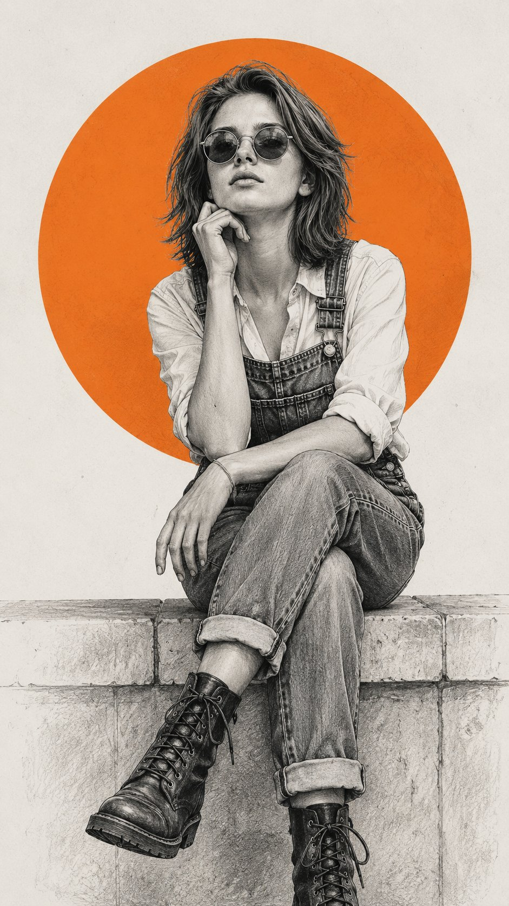</a> <a href="../../cases/case-awesome-gpt-image-2-430-cd07726e148a/v1.md"><strong>铅笔素描时尚编辑插画 · v1</strong></a> awesome-gpt-image-2 #430 原图文案例 · gpt-image 已记录补充核查结果；以详情中的输入要求为准</td>
</tr>
<tr>
<td width="33%" align="center" valign="top"> <a href="../../cases/case-awesome-gpt-image-2-433-f0d68a2a63f9/v1.md"><strong>韩国城市水彩旅行插画 · v1</strong></a> awesome-gpt-image-2 #433 原图文案例 · gpt-image 已记录补充核查结果；以详情中的输入要求为准</td>
<td width="33%" align="center" valign="top"><a href="../../cases/case-awesome-gpt-image-2-435-924421df0be8/v1.md">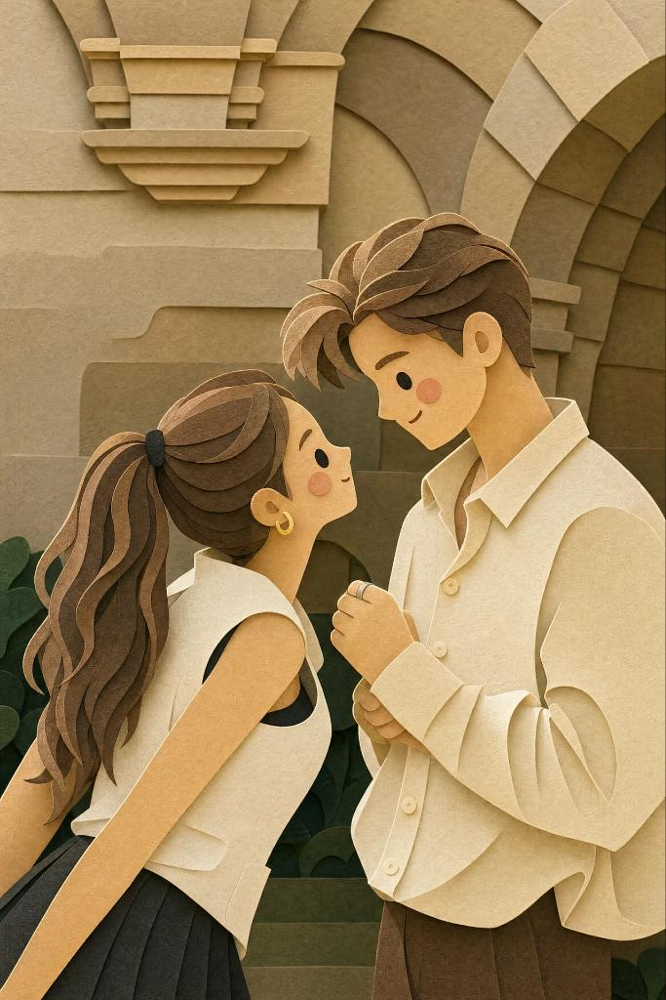</a> <a href="../../cases/case-awesome-gpt-image-2-435-924421df0be8/v1.md"><strong>层叠纸雕情侣插画 · v1</strong></a> awesome-gpt-image-2 #435 原图文案例 · gpt-image 已记录补充核查结果；以详情中的输入要求为准</td>
<td width="33%" align="center" valign="top"> <a href="../../cases/case-awesome-gpt-image-2-442-29ddceb782e7/v1.md"><strong>舒适发廊插画 · v1</strong></a> awesome-gpt-image-2 #442 原图文案例 · gpt-image 已记录补充核查结果；以详情中的输入要求为准</td>
</tr>
<tr>
<td width="33%" align="center" valign="top"><a href="../../cases/case-awesome-gpt-image-2-445-d122dbf14890/v1.md">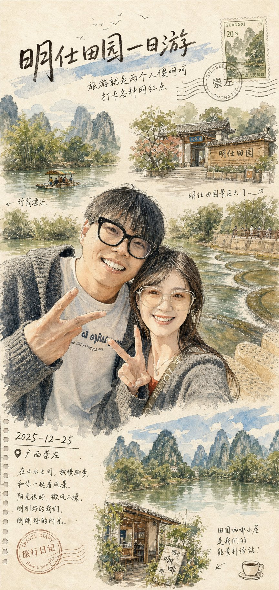</a> <a href="../../cases/case-awesome-gpt-image-2-445-d122dbf14890/v1.md"><strong>旅游照水墨明信片 · v1</strong></a> awesome-gpt-image-2 #445 原图文案例 · gpt-image 已记录补充核查结果；以详情中的输入要求为准</td>
<td width="33%" align="center" valign="top"> <a href="../../cases/case-awesome-gpt-image-2-446-5932f2218650/v1.md"><strong>低多边形纸艺男士肖像 · v1</strong></a> awesome-gpt-image-2 #446 原图文案例 · gpt-image 已记录补充核查结果；以详情中的输入要求为准</td>
<td width="33%" align="center" valign="top"> <a href="../../cases/case-awesome-gpt-image-2-452-755f950ef943/v1.md"><strong>极简童话手绘儿童插画 · v1</strong></a> awesome-gpt-image-2 #452 原图文案例 · gpt-image 已记录补充核查结果；以详情中的输入要求为准</td>
</tr>
<tr>
<td width="33%" align="center" valign="top"> <a href="../../cases/case-awesome-gpt-image-2-458-c464c6274fcf/v1.md"><strong>巴黎秋季时装插画 · v1</strong></a> awesome-gpt-image-2 #458 原图文案例 · gpt-image 已记录补充核查结果；以详情中的输入要求为准</td>
<td width="33%" align="center" valign="top"><a href="../../cases/case-awesome-gpt-image-2-461-ea3a0aeb877a/v1.md">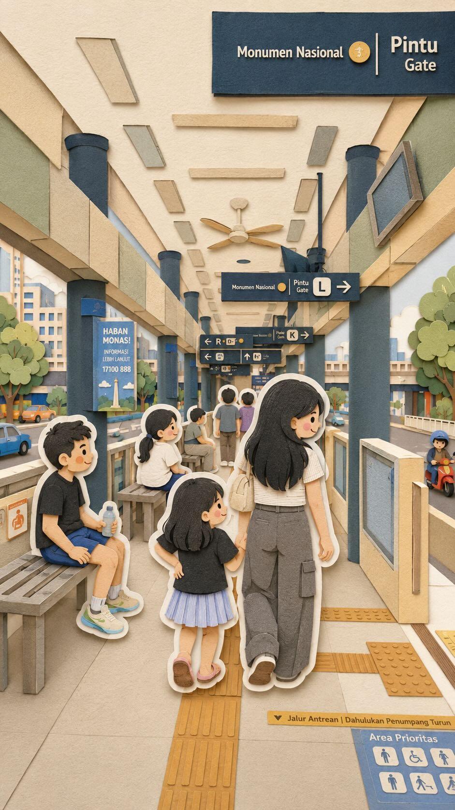</a> <a href="../../cases/case-awesome-gpt-image-2-461-ea3a0aeb877a/v1.md"><strong>家庭旅行纸雕拼贴 · v1</strong></a> awesome-gpt-image-2 #461 原图文案例 · gpt-image 已记录补充核查结果；以详情中的输入要求为准</td>
<td width="33%" align="center" valign="top"> <a href="../../cases/case-awesome-gpt-image-2-471-4ed64dcac2cd/v1.md"><strong>花簪和服动漫肖像 · v1</strong></a> awesome-gpt-image-2 #471 原图文案例 · gpt-image 已记录补充核查结果；以详情中的输入要求为准</td>
</tr>
<tr>
<td width="33%" align="center" valign="top"> <a href="../../cases/case-awesome-gpt-image-2-476-044c4968c92a/v1.md"><strong>早安拿铁微缩女孩 · v1</strong></a> awesome-gpt-image-2 #476 原图文案例 · gpt-image 已记录补充核查结果；以详情中的输入要求为准</td>
<td width="33%" align="center" valign="top"> <a href="../../cases/case-awesome-gpt-image-2-479-2d467cd5c007/v1.md"><strong>杂志纸艺拼贴重绘 · v1</strong></a> awesome-gpt-image-2 #479 原图文案例 · gpt-image 已记录补充核查结果；以详情中的输入要求为准</td>
<td width="33%" align="center" valign="top"> <a href="../../cases/case-awesome-gpt-image-2-495-ac5db87cde13/v1.md"><strong>巴黎街头故事书插画 · v1</strong></a> awesome-gpt-image-2 #495 原图文案例 · gpt-image 已记录补充核查结果；以详情中的输入要求为准</td>
</tr>
<tr>
<td width="33%" align="center" valign="top"><a href="../../cases/case-awesome-gpt-image-2-498-b3e691f4dc48/v1.md">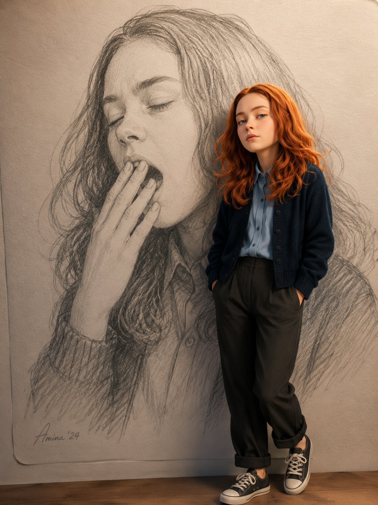</a> <a href="../../cases/case-awesome-gpt-image-2-498-b3e691f4dc48/v1.md"><strong>铅笔画背景 3D 分身 · v1</strong></a> awesome-gpt-image-2 #498 原图文案例 · gpt-image 已记录补充核查结果；以详情中的输入要求为准</td>
<td width="33%" align="center" valign="top"> <a href="../../cases/case-awesome-gpt-image-2-504-639918d9deb8/v1.md"><strong>粗糙涂鸦人像改图 · v1</strong></a> awesome-gpt-image-2 #504 原图文案例 · gpt-image 已记录补充核查结果；以详情中的输入要求为准</td>
<td width="33%" align="center" valign="top"> <a href="../../cases/case-awesome-gpt-image-2-513-ccc9493733fa/v1.md"><strong>单色点缀旅行手账插画 · v1</strong></a> awesome-gpt-image-2 #513 原图文案例 · gpt-image 已记录补充核查结果；以详情中的输入要求为准</td>
</tr>
<tr>
<td width="33%" align="center" valign="top"> <a href="../../cases/case-awesome-gpt-image-2-514-b82b53c5864d/v1.md"><strong>硬边现代艺术人像 · v1</strong></a> awesome-gpt-image-2 #514 原图文案例 · gpt-image 已记录补充核查结果；以详情中的输入要求为准</td>
<td width="33%" align="center" valign="top"> <a href="../../cases/case-awesome-gpt-image-2-520-32ccede956b4/v1.md"><strong>月面宇航员 T 恤图形 · v1</strong></a> awesome-gpt-image-2 #520 原图文案例 · gpt-image 已记录补充核查结果；以详情中的输入要求为准</td>
<td width="33%" align="center" valign="top"> <a href="../../cases/case-awesome-gpt-image-2-523-293e282b3d57/v1.md"><strong>曼哈顿公园水彩旅行插画 · v1</strong></a> awesome-gpt-image-2 #523 原图文案例 · gpt-image 已记录补充核查结果；以详情中的输入要求为准</td>
</tr>
<tr>
<td width="33%" align="center" valign="top"> <a href="../../cases/case-awesome-gpt-image-2-524-4f89606a400f/v1.md"><strong>纸雕拼贴乡野人像 · v1</strong></a> awesome-gpt-image-2 #524 原图文案例 · gpt-image 已记录补充核查结果；以详情中的输入要求为准</td>
<td width="33%" align="center" valign="top"> <a href="../../cases/case-awesome-gpt-image-2-540-0060e6408103/v1.md"><strong>梦幻未来城市编辑艺术海报 · v1</strong></a> awesome-gpt-image-2 #540 原图文案例 · gpt-image 已记录补充核查结果；以详情中的输入要求为准</td>
<td width="33%" align="center" valign="top"><a href="../../cases/case-jamez-awesome-gpt4o-images-25-4d9345f3a65a/v1.md">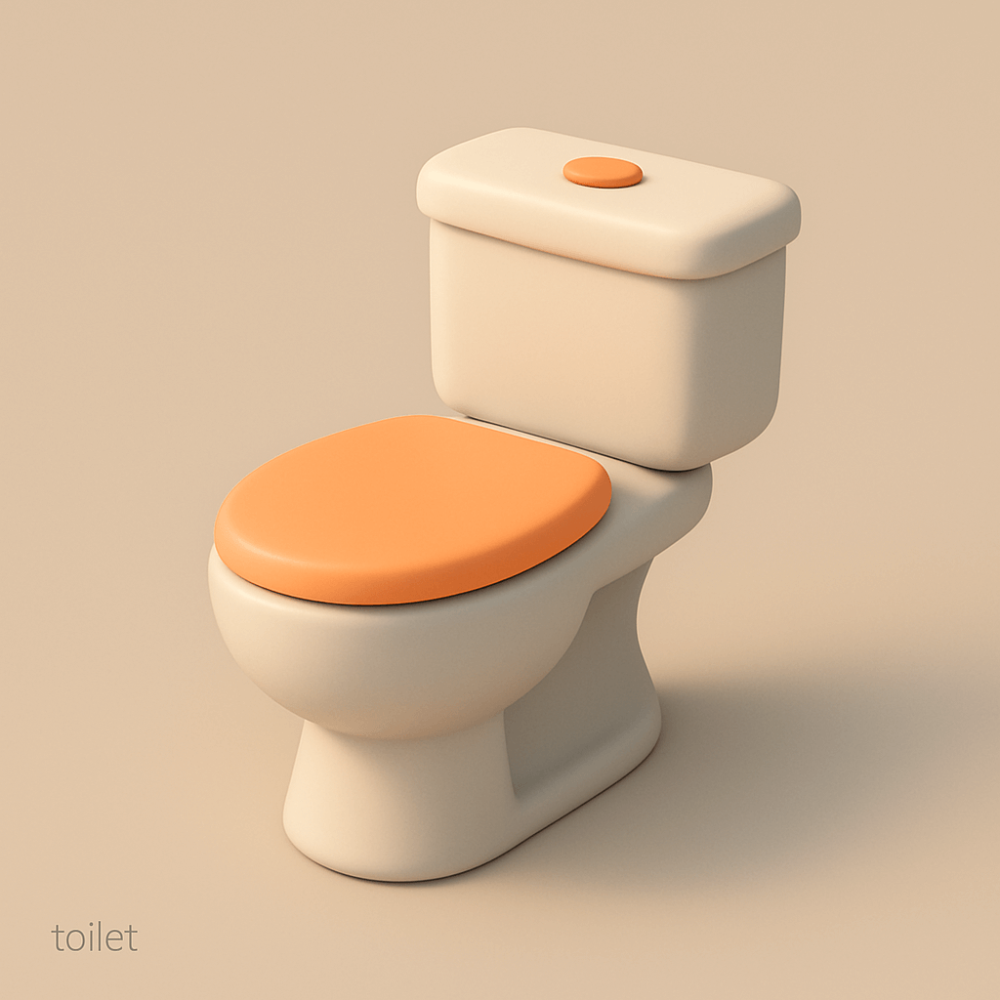</a> <a href="../../cases/case-jamez-awesome-gpt4o-images-25-4d9345f3a65a/v1.md"><strong>极简主义 3D 插画 · v1</strong></a> jamez-awesome-gpt4o-images #25 原图文案例 · gpt-image 已记录补充核查结果；以详情中的输入要求为准</td>
</tr>
<tr>
<td width="33%" align="center" valign="top"> <a href="../../cases/case-jamez-awesome-gpt4o-images-52-38c70ceb2352/v1.md"><strong>纸艺风格 Emoji 图标 · v1</strong></a> jamez-awesome-gpt4o-images #52 原图文案例 · gpt-image 已记录补充核查结果；以详情中的输入要求为准</td>
<td width="33%" align="center" valign="top"> <a href="../../cases/case-jamez-awesome-gpt4o-images-64-60796c67e3e7/v1.md"><strong>蒸汽朋克机械鱼 · v1</strong></a> jamez-awesome-gpt4o-images #64 原图文案例 · gpt-image 已记录补充核查结果；以详情中的输入要求为准</td>
<td width="33%" align="center" valign="top"> <a href="../../cases/case-jamez-awesome-gpt4o-images-66-19f0b84ac3ff/v1.md"><strong>创意丝绸宇宙 · v1</strong></a> jamez-awesome-gpt4o-images #66 原图文案例 · gpt-image 已记录补充核查结果；以详情中的输入要求为准</td>
</tr>
<tr>
<td width="33%" align="center" valign="top"> <a href="../../cases/case-jamez-awesome-gpt4o-images-71-f6ef3df1aef7/v1.md"><strong>迷你 Cyberpunk 傾斜移軸景觀 · v1</strong></a> jamez-awesome-gpt4o-images #71 原图文案例 · gpt-image 已记录补充核查结果；以详情中的输入要求为准</td>
<td width="33%" align="center" valign="top"><a href="../../cases/case-jamez-awesome-gpt4o-images-86-ce808b021985/v1.md">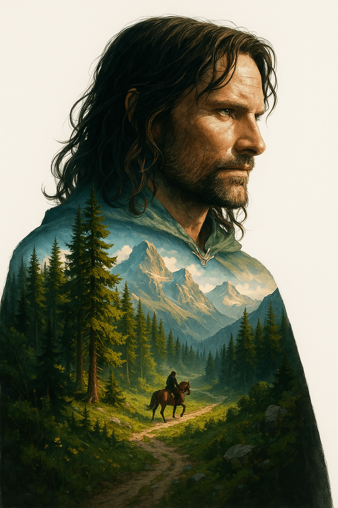</a> <a href="../../cases/case-jamez-awesome-gpt4o-images-86-ce808b021985/v1.md"><strong>双重曝光 · v1</strong></a> jamez-awesome-gpt4o-images #86 原图文案例 · gpt-image 已记录补充核查结果；以详情中的输入要求为准</td>
<td width="33%" align="center" valign="top"><a href="../../cases/case-jamez-awesome-gpt4o-images-88-0c3dc8b9a1ba/v1.md">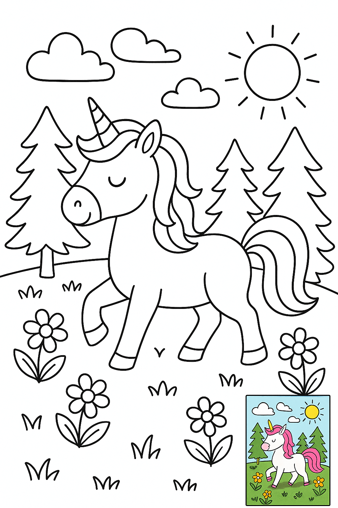</a> <a href="../../cases/case-jamez-awesome-gpt4o-images-88-0c3dc8b9a1ba/v1.md"><strong>儿童涂色页插画（含彩色参考图） · v1</strong></a> jamez-awesome-gpt4o-images #88 原图文案例 · gpt-image 已记录补充核查结果；以详情中的输入要求为准</td>
</tr>
<tr>
<td width="33%" align="center" valign="top"><a href="../../cases/case-ezagor-awesome-midjourney-prompts-8-bit-ascii-art-a60b66ba83b3/v1.md">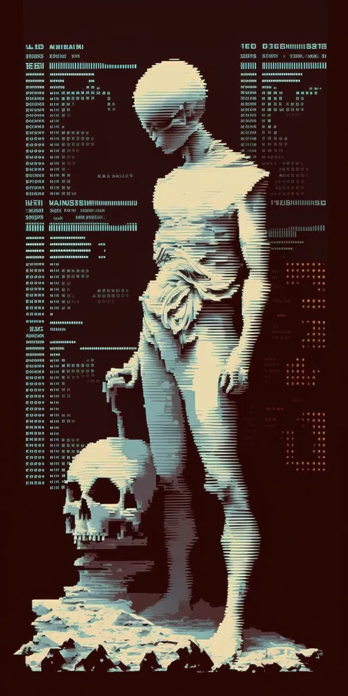</a> <a href="../../cases/case-ezagor-awesome-midjourney-prompts-8-bit-ascii-art-a60b66ba83b3/v1.md"><strong>8-bit ASCII风格参考 · v1</strong></a> case-ezagor-awesome-midjourney-prompts-8-bit-ascii-art-a60b66ba83b3 风格参考 · midjourney 已记录补充核查结果；以详情中的输入要求为准</td>
<td width="33%" align="center" valign="top"><a href="../../cases/case-ezagor-awesome-midjourney-prompts-botanical-lungs-collage-4c32529d0762/v1.md">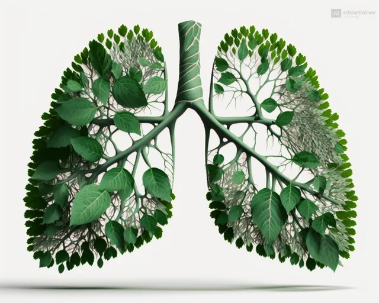</a> <a href="../../cases/case-ezagor-awesome-midjourney-prompts-botanical-lungs-collage-4c32529d0762/v1.md"><strong>绿叶构成肺部：数字拼贴 · v1</strong></a> case-ezagor-awesome-midjourney-prompts-botanical-lungs-collage-4c32529d0762 原图文案例 · midjourney 已记录补充核查结果；以详情中的输入要求为准</td>
<td width="33%" align="center" valign="top"><a href="../../cases/case-ezagor-awesome-midjourney-prompts-electronic-components-face-a893836b6644/v1.md">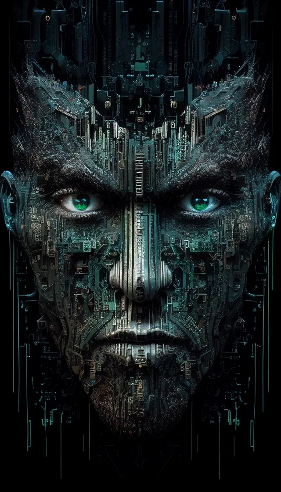</a> <a href="../../cases/case-ezagor-awesome-midjourney-prompts-electronic-components-face-a893836b6644/v1.md"><strong>电子元件与PCB人脸 · v1</strong></a> case-ezagor-awesome-midjourney-prompts-electronic-components-face-a893836b6644 原图文案例 · midjourney 已记录补充核查结果；以详情中的输入要求为准</td>
</tr>
<tr>
<td width="33%" align="center" valign="top"><a href="../../cases/case-ezagor-awesome-midjourney-prompts-fire-elf-skottie-young-666331e7023c/v1.md">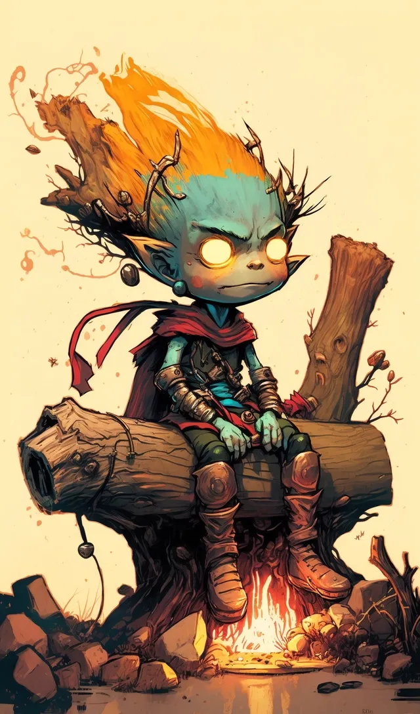</a> <a href="../../cases/case-ezagor-awesome-midjourney-prompts-fire-elf-skottie-young-666331e7023c/v1.md"><strong>火焰精灵：Skottie Young漫画线索 · v1</strong></a> case-ezagor-awesome-midjourney-prompts-fire-elf-skottie-young-666331e7023c 原图文案例 · midjourney 已记录补充核查结果；以详情中的输入要求为准</td>
<td width="33%" align="center" valign="top"> <a href="../../cases/case-ezagor-awesome-midjourney-prompts-indigenogoth-malachite-38bbfda619f7/v1.md"><strong>indigenogoth 孔雀石风格参考 · v1</strong></a> case-ezagor-awesome-midjourney-prompts-indigenogoth-malachite-38bbfda619f7 风格参考 · midjourney 已记录补充核查结果；以详情中的输入要求为准</td>
<td width="33%" align="center" valign="top"> <a href="../../cases/case-ezagor-awesome-midjourney-prompts-macro-particles-a9b91b65e451/v1.md"><strong>粒子微距与浅景深 · v1</strong></a> case-ezagor-awesome-midjourney-prompts-macro-particles-a9b91b65e451 原图文案例 · midjourney 已记录补充核查结果；以详情中的输入要求为准</td>
</tr>
<tr>
<td width="33%" align="center" valign="top"><a href="../../cases/case-ezagor-awesome-midjourney-prompts-victor-mosquera-style-363d2afe8b06/v1.md">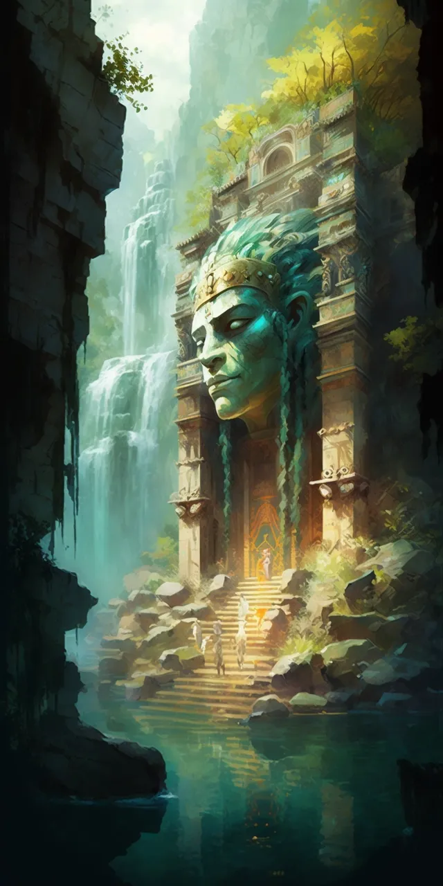</a> <a href="../../cases/case-ezagor-awesome-midjourney-prompts-victor-mosquera-style-363d2afe8b06/v1.md"><strong>Victor Mosquera插画风格线索 · v1</strong></a> case-ezagor-awesome-midjourney-prompts-victor-mosquera-style-363d2afe8b06 风格参考 · midjourney 已记录补充核查结果；以详情中的输入要求为准</td>
<td width="33%" align="center" valign="top"><a href="../../cases/case-ezagor-awesome-midjourney-prompts-wolf-cubs-coloring-book-273825875da9/v1.md">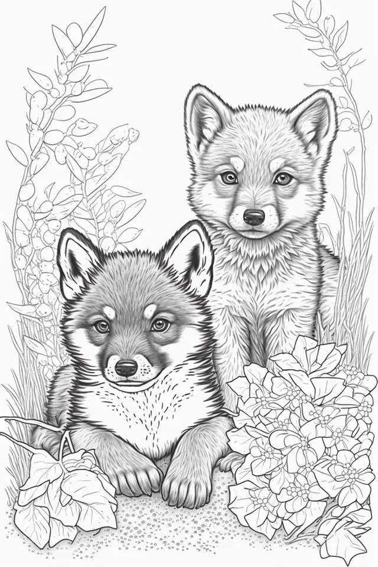</a> <a href="../../cases/case-ezagor-awesome-midjourney-prompts-wolf-cubs-coloring-book-273825875da9/v1.md"><strong>幼狼：黑白涂色书插画 · v1</strong></a> case-ezagor-awesome-midjourney-prompts-wolf-cubs-coloring-book-273825875da9 原图文案例 · midjourney 已记录补充核查结果；以详情中的输入要求为准</td>
<td width="33%" align="center" valign="top"><a href="../../cases/case-picotrex-nano-banana-selected-pro-case13-d75720310f38/v1.md">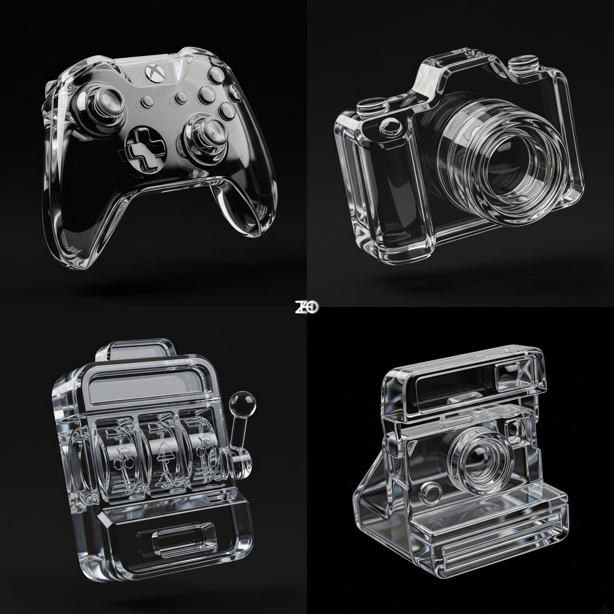</a> <a href="../../cases/case-picotrex-nano-banana-selected-pro-case13-d75720310f38/v1.md"><strong>水晶质感emoji · v1</strong></a> case-picotrex-nano-banana-selected-pro-case13-d75720310f38 风格参考 · nano-banana 已记录补充核查结果；以详情中的输入要求为准</td>
</tr>
<tr>
<td width="33%" align="center" valign="top"><a href="../../cases/case-picotrex-nano-banana-selected-pro-case15-cab2a4c397d4/v1.md">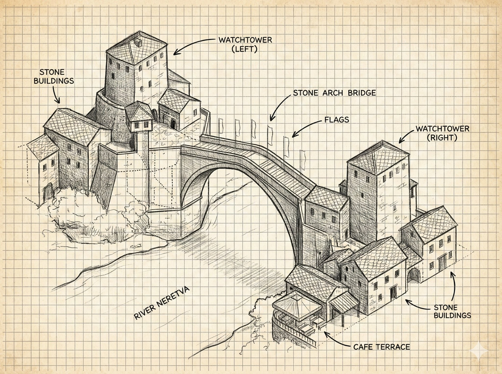</a> <a href="../../cases/case-picotrex-nano-banana-selected-pro-case15-cab2a4c397d4/v1.md"><strong>手绘等距图 · v1</strong></a> case-picotrex-nano-banana-selected-pro-case15-cab2a4c397d4 原图文案例 · nano-banana 已记录补充核查结果；以详情中的输入要求为准</td>
<td width="33%" align="center" valign="top"> <a href="../../cases/case-picotrex-nano-banana-selected-pro-case26-93d3d492fe3d/v1.md"><strong>清明上河图风格图像 · v1</strong></a> case-picotrex-nano-banana-selected-pro-case26-93d3d492fe3d 原图文案例 · nano-banana 已记录补充核查结果；以详情中的输入要求为准</td>
<td width="33%" align="center" valign="top"><a href="../../cases/case-picotrex-nano-banana-selected-pro-case28-b00e453b047a/v1.md">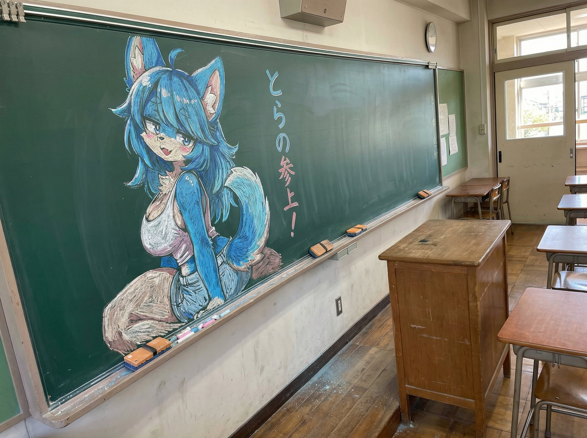</a> <a href="../../cases/case-picotrex-nano-banana-selected-pro-case28-b00e453b047a/v1.md"><strong>黑板粉笔画 · v1</strong></a> case-picotrex-nano-banana-selected-pro-case28-b00e453b047a 原图文案例 · nano-banana 已记录补充核查结果；以详情中的输入要求为准</td>
</tr>
<tr>
<td width="33%" align="center" valign="top"><a href="../../cases/case-picotrex-nano-banana-selected-pro-case35-794ac658a42b/v1.md">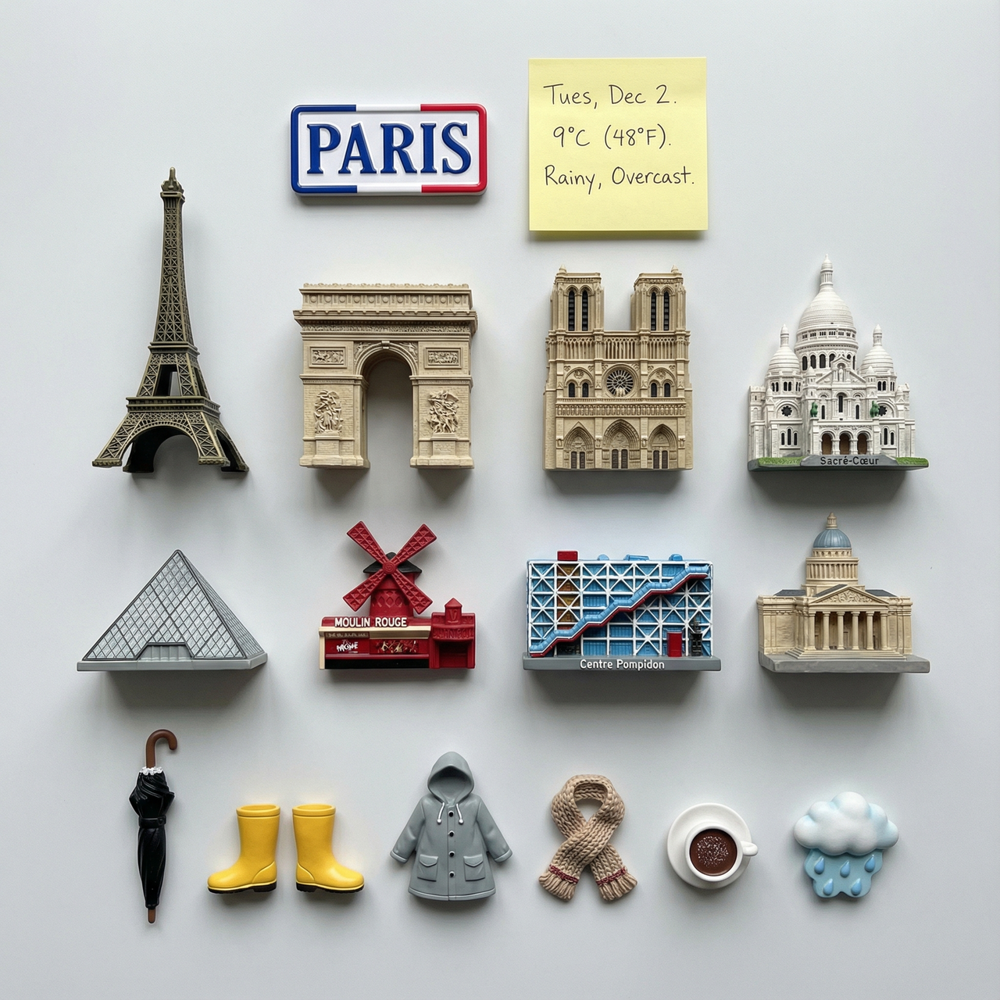</a> <a href="../../cases/case-picotrex-nano-banana-selected-pro-case35-794ac658a42b/v1.md"><strong>城市冰箱贴 · v1</strong></a> case-picotrex-nano-banana-selected-pro-case35-794ac658a42b 原图文案例 · nano-banana 已记录补充核查结果；以详情中的输入要求为准</td>
<td width="33%" align="center" valign="top"><a href="../../cases/case-picotrex-nano-banana-selected-pro-case51-a2cb6bcef393/v1.md">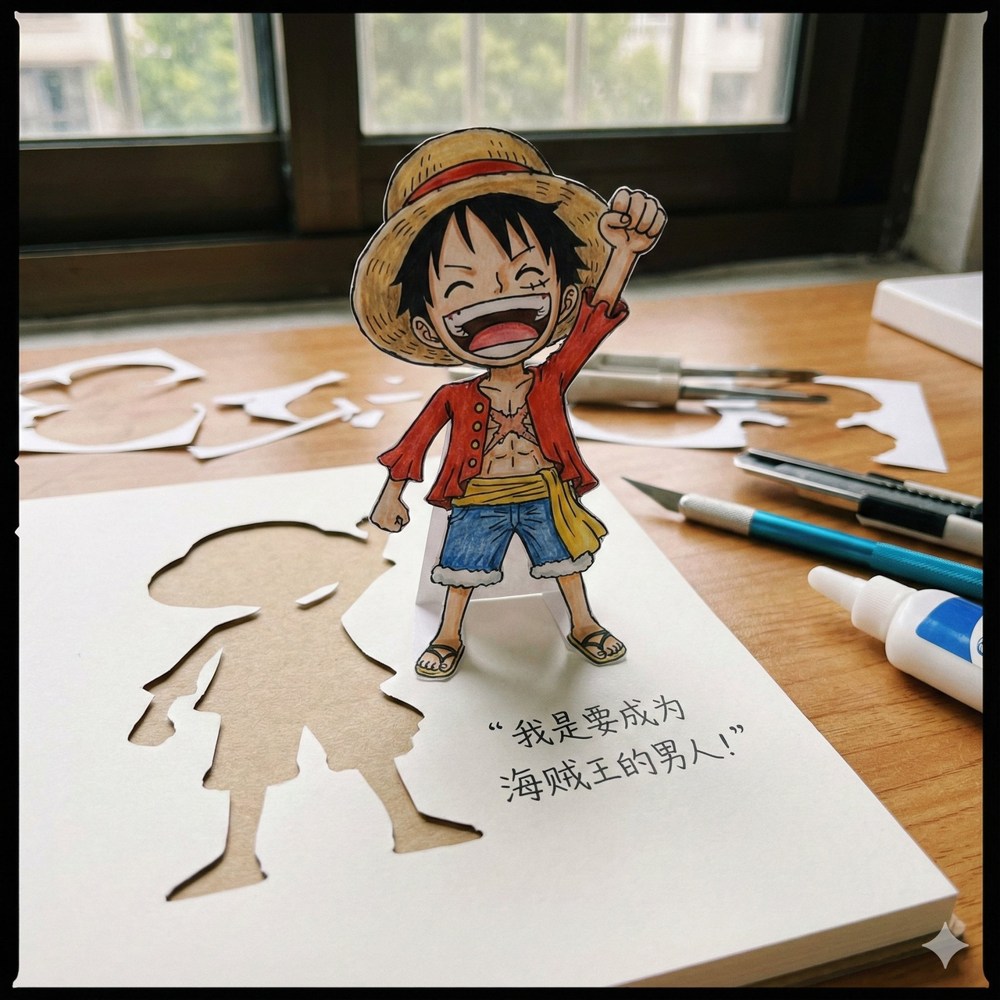</a> <a href="../../cases/case-picotrex-nano-banana-selected-pro-case51-a2cb6bcef393/v1.md"><strong>人物纸艺剪纸 · v1</strong></a> case-picotrex-nano-banana-selected-pro-case51-a2cb6bcef393 原图文案例 · nano-banana 已记录补充核查结果；以详情中的输入要求为准</td>
<td width="33%" align="center" valign="top"></td>
</tr>
</table>

