<!-- Generated by scripts/gallery.py; edit authoritative JSON, then rebuild. -->

# 图表与信息可视化

[返回画廊总览](../gallery.md)

共 53 条资料。点击标题查看本库图片与原始内容。

<table>
<tr>
<td width="33%" align="center" valign="top"> <a href="../../cases/case-awesome-gpt-image-2-8-0b55aa3880f9/v1.md"><strong>科普百科图 · v1</strong></a> awesome-gpt-image-2 #8 原图文案例 · gpt-image 待复核：尚无补充核查，不代表必要输入已齐全</td>
<td width="33%" align="center" valign="top"> <a href="../../cases/case-awesome-gpt-image-2-14-ebb8a362c89d/v1.md"><strong>信息图可视化设计 · v1</strong></a> awesome-gpt-image-2 #14 原图文案例 · gpt-image 待复核：尚无补充核查，不代表必要输入已齐全</td>
<td width="33%" align="center" valign="top"> <a href="../../cases/case-awesome-gpt-image-2-19-387d600b3b30/v1.md"><strong>信息图可视化设计 · v1</strong></a> awesome-gpt-image-2 #19 原图文案例 · gpt-image 待复核：尚无补充核查，不代表必要输入已齐全</td>
</tr>
<tr>
<td width="33%" align="center" valign="top"> <a href="../../cases/case-awesome-gpt-image-2-23-8ed19f97107c/v1.md"><strong>信息图可视化设计 · v1</strong></a> awesome-gpt-image-2 #23 原图文案例 · gpt-image 缺少必要输入图：请先查看详情并补齐参考图</td>
<td width="33%" align="center" valign="top"> <a href="../../cases/case-awesome-gpt-image-2-51-29458e54b435/v1.md"><strong>信息图可视化设计 · v1</strong></a> awesome-gpt-image-2 #51 原图文案例 · gpt-image 待复核：尚无补充核查，不代表必要输入已齐全</td>
<td width="33%" align="center" valign="top"> <a href="../../cases/case-awesome-gpt-image-2-55-a75485bc777e/v1.md"><strong>信息图可视化设计 · v1</strong></a> awesome-gpt-image-2 #55 原图文案例 · gpt-image 待复核：尚无补充核查，不代表必要输入已齐全</td>
</tr>
<tr>
<td width="33%" align="center" valign="top"> <a href="../../cases/case-awesome-gpt-image-2-64-0baa3dbe05d3/v1.md"><strong>信息图可视化设计 · v1</strong></a> awesome-gpt-image-2 #64 原图文案例 · gpt-image 待复核：尚无补充核查，不代表必要输入已齐全</td>
<td width="33%" align="center" valign="top"><a href="../../cases/case-awesome-gpt-image-2-65-0e4408c2a9a1/v1.md">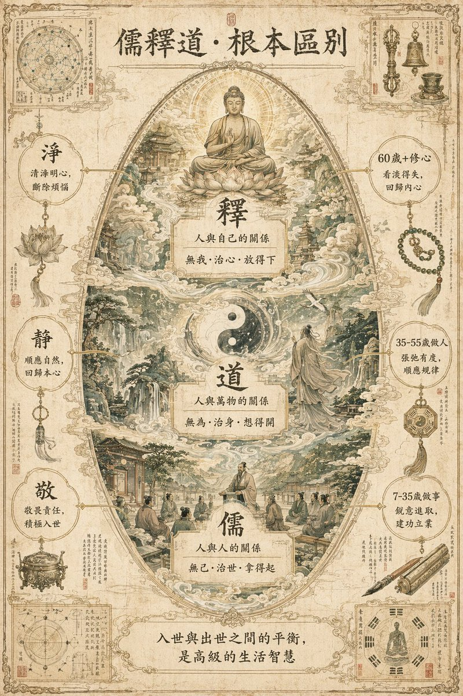</a> <a href="../../cases/case-awesome-gpt-image-2-65-0e4408c2a9a1/v1.md"><strong>信息图可视化设计 · v1</strong></a> awesome-gpt-image-2 #65 原图文案例 · gpt-image 待复核：尚无补充核查，不代表必要输入已齐全</td>
<td width="33%" align="center" valign="top"> <a href="../../cases/case-awesome-gpt-image-2-66-9699a72c928a/v1.md"><strong>信息图可视化设计 · v1</strong></a> awesome-gpt-image-2 #66 原图文案例 · gpt-image 待复核：尚无补充核查，不代表必要输入已齐全</td>
</tr>
<tr>
<td width="33%" align="center" valign="top"><a href="../../cases/case-awesome-gpt-image-2-67-52636da486ac/v1.md">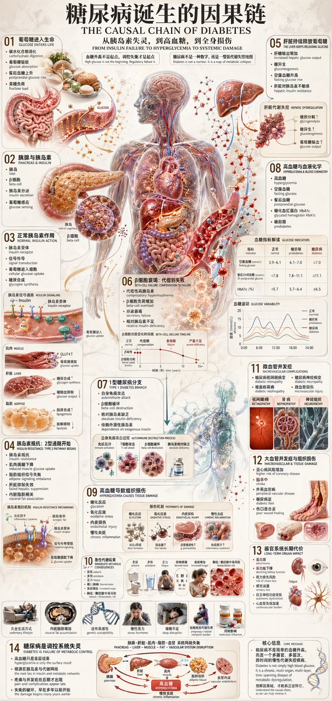</a> <a href="../../cases/case-awesome-gpt-image-2-67-52636da486ac/v1.md"><strong>信息图可视化设计 · v1</strong></a> awesome-gpt-image-2 #67 原图文案例 · gpt-image 待复核：尚无补充核查，不代表必要输入已齐全</td>
<td width="33%" align="center" valign="top"><a href="../../cases/case-awesome-gpt-image-2-68-b1aa1855f678/v1.md">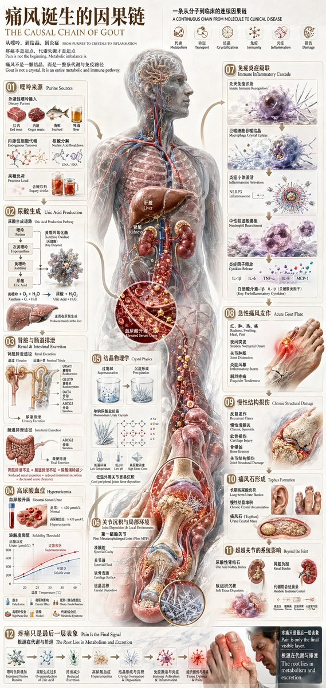</a> <a href="../../cases/case-awesome-gpt-image-2-68-b1aa1855f678/v1.md"><strong>信息图可视化设计 · v1</strong></a> awesome-gpt-image-2 #68 原图文案例 · gpt-image 待复核：尚无补充核查，不代表必要输入已齐全</td>
<td width="33%" align="center" valign="top"> <a href="../../cases/case-awesome-gpt-image-2-69-6a441531daae/v1.md"><strong>信息图可视化设计 · v1</strong></a> awesome-gpt-image-2 #69 原图文案例 · gpt-image 待复核：尚无补充核查，不代表必要输入已齐全</td>
</tr>
<tr>
<td width="33%" align="center" valign="top"> <a href="../../cases/case-awesome-gpt-image-2-70-8b3486a49f72/v1.md"><strong>信息图可视化设计 · v1</strong></a> awesome-gpt-image-2 #70 原图文案例 · gpt-image 待复核：尚无补充核查，不代表必要输入已齐全</td>
<td width="33%" align="center" valign="top"> <a href="../../cases/case-awesome-gpt-image-2-71-86d8bd1d30b3/v1.md"><strong>关系图谱信息图 · v1</strong></a> awesome-gpt-image-2 #71 原图文案例 · gpt-image 待复核：尚无补充核查，不代表必要输入已齐全</td>
<td width="33%" align="center" valign="top"> <a href="../../cases/case-awesome-gpt-image-2-72-334f00970b70/v1.md"><strong>信息图可视化设计 · v1</strong></a> awesome-gpt-image-2 #72 原图文案例 · gpt-image 待复核：尚无补充核查，不代表必要输入已齐全</td>
</tr>
<tr>
<td width="33%" align="center" valign="top"> <a href="../../cases/case-awesome-gpt-image-2-73-ef99500f1bba/v1.md"><strong>信息图可视化设计 · v1</strong></a> awesome-gpt-image-2 #73 原图文案例 · gpt-image 待复核：尚无补充核查，不代表必要输入已齐全</td>
<td width="33%" align="center" valign="top"><a href="../../cases/case-awesome-gpt-image-2-74-20d84381367d/v1.md">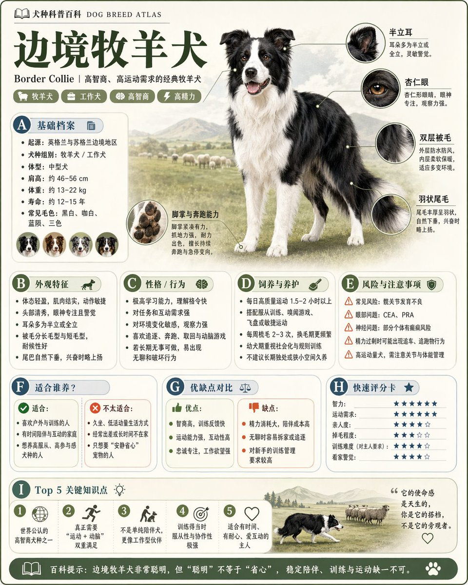</a> <a href="../../cases/case-awesome-gpt-image-2-74-20d84381367d/v1.md"><strong>关系图谱信息图 · v1</strong></a> awesome-gpt-image-2 #74 原图文案例 · gpt-image 待复核：尚无补充核查，不代表必要输入已齐全</td>
<td width="33%" align="center" valign="top"> <a href="../../cases/case-awesome-gpt-image-2-75-b2d74046b70b/v1.md"><strong>关系图谱信息图 · v1</strong></a> awesome-gpt-image-2 #75 原图文案例 · gpt-image 待复核：尚无补充核查，不代表必要输入已齐全</td>
</tr>
<tr>
<td width="33%" align="center" valign="top"> <a href="../../cases/case-awesome-gpt-image-2-76-04b24585840e/v1.md"><strong>关系图谱信息图 · v1</strong></a> awesome-gpt-image-2 #76 原图文案例 · gpt-image 待复核：尚无补充核查，不代表必要输入已齐全</td>
<td width="33%" align="center" valign="top"> <a href="../../cases/case-awesome-gpt-image-2-77-bfbf696d915e/v1.md"><strong>关系图谱信息图 · v1</strong></a> awesome-gpt-image-2 #77 原图文案例 · gpt-image 待复核：尚无补充核查，不代表必要输入已齐全</td>
<td width="33%" align="center" valign="top"><a href="../../cases/case-awesome-gpt-image-2-84-f3ec2f4dec45/v1.md">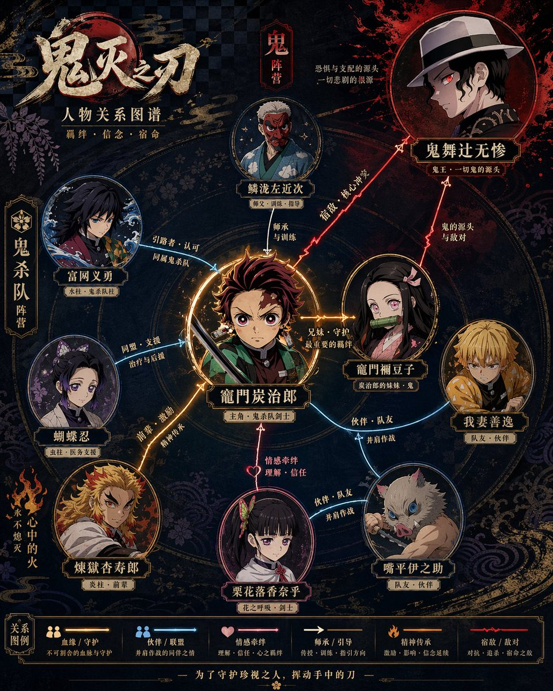</a> <a href="../../cases/case-awesome-gpt-image-2-84-f3ec2f4dec45/v1.md"><strong>关系图谱信息图 · v1</strong></a> awesome-gpt-image-2 #84 原图文案例 · gpt-image 待复核：尚无补充核查，不代表必要输入已齐全</td>
</tr>
<tr>
<td width="33%" align="center" valign="top"> <a href="../../cases/case-awesome-gpt-image-2-85-0bc44e4d47ad/v1.md"><strong>关系图谱信息图 · v1</strong></a> awesome-gpt-image-2 #85 原图文案例 · gpt-image 待复核：尚无补充核查，不代表必要输入已齐全</td>
<td width="33%" align="center" valign="top"> <a href="../../cases/case-awesome-gpt-image-2-86-a1ea9255c18c/v1.md"><strong>关系图谱信息图 · v1</strong></a> awesome-gpt-image-2 #86 原图文案例 · gpt-image 待复核：尚无补充核查，不代表必要输入已齐全</td>
<td width="33%" align="center" valign="top"> <a href="../../cases/case-awesome-gpt-image-2-87-29f05e84359c/v1.md"><strong>关系图谱信息图 · v1</strong></a> awesome-gpt-image-2 #87 原图文案例 · gpt-image 待复核：尚无补充核查，不代表必要输入已齐全</td>
</tr>
<tr>
<td width="33%" align="center" valign="top"> <a href="../../cases/case-awesome-gpt-image-2-89-8152bdb80d3c/v1.md"><strong>信息图可视化设计 · v1</strong></a> awesome-gpt-image-2 #89 原图文案例 · gpt-image 待复核：尚无补充核查，不代表必要输入已齐全</td>
<td width="33%" align="center" valign="top"> <a href="../../cases/case-awesome-gpt-image-2-102-449f1cbdc43a/v1.md"><strong>信息图可视化设计 · v1</strong></a> awesome-gpt-image-2 #102 原图文案例 · gpt-image 待复核：尚无补充核查，不代表必要输入已齐全</td>
<td width="33%" align="center" valign="top"> <a href="../../cases/case-awesome-gpt-image-2-171-364397d8222a/v1.md"><strong>信息图可视化设计 · v1</strong></a> awesome-gpt-image-2 #171 原图文案例 · gpt-image 待复核：尚无补充核查，不代表必要输入已齐全</td>
</tr>
<tr>
<td width="33%" align="center" valign="top"> <a href="../../cases/case-awesome-gpt-image-2-179-4ac17d3788ba/v1.md"><strong>蒸汽朋克射手座解剖图谱 · v1</strong></a> awesome-gpt-image-2 #179 原图文案例 · gpt-image 待复核：尚无补充核查，不代表必要输入已齐全</td>
<td width="33%" align="center" valign="top"> <a href="../../cases/case-awesome-gpt-image-2-183-3f11cfcd77c6/v1.md"><strong>一张中文健身信息图 · v1</strong></a> awesome-gpt-image-2 #183 原图文案例 · gpt-image 待复核：尚无补充核查，不代表必要输入已齐全</td>
<td width="33%" align="center" valign="top"> <a href="../../cases/case-awesome-gpt-image-2-210-51beb47a95f4/v1.md"><strong>萌系大模型训练图解 · v1</strong></a> awesome-gpt-image-2 #210 原图文案例 · gpt-image 待复核：尚无补充核查，不代表必要输入已齐全</td>
</tr>
<tr>
<td width="33%" align="center" valign="top"> <a href="../../cases/case-awesome-gpt-image-2-214-9ec6da41bda7/v1.md"><strong>绘制金瓶梅知识图谱 · v1</strong></a> awesome-gpt-image-2 #214 原图文案例 · gpt-image 待复核：尚无补充核查，不代表必要输入已齐全</td>
<td width="33%" align="center" valign="top"> <a href="../../cases/case-awesome-gpt-image-2-218-afe394d9eea6/v1.md"><strong>绘制科学百科知识图谱 · v1</strong></a> awesome-gpt-image-2 #218 原图文案例 · gpt-image 待复核：尚无补充核查，不代表必要输入已齐全</td>
<td width="33%" align="center" valign="top"> <a href="../../cases/case-awesome-gpt-image-2-222-89f8104f5b3b/v1.md"><strong>精致模块化科普百科图鉴 · v1</strong></a> awesome-gpt-image-2 #222 原图文案例 · gpt-image 待复核：尚无补充核查，不代表必要输入已齐全</td>
</tr>
<tr>
<td width="33%" align="center" valign="top"> <a href="../../cases/case-awesome-gpt-image-2-248-b4a586279cce/v1.md"><strong>景德镇青花瓷全景解说图谱 · v1</strong></a> awesome-gpt-image-2 #248 原图文案例 · gpt-image 待复核：尚无补充核查，不代表必要输入已齐全</td>
<td width="33%" align="center" valign="top"> <a href="../../cases/case-awesome-gpt-image-2-296-83745943c266/v1.md"><strong>博物馆级中文拆解信息图鉴 · v1</strong></a> awesome-gpt-image-2 #296 原图文案例 · gpt-image 待复核：尚无补充核查，不代表必要输入已齐全</td>
<td width="33%" align="center" valign="top"><a href="../../cases/case-awesome-gpt-image-2-333-b0b7bba964c9/v1.md">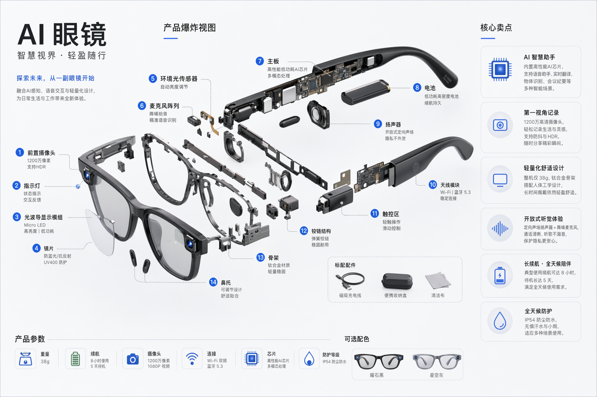</a> <a href="../../cases/case-awesome-gpt-image-2-333-b0b7bba964c9/v1.md"><strong>AI 眼镜爆炸拆解图 · v1</strong></a> awesome-gpt-image-2 #333 原图文案例 · gpt-image 待复核：尚无补充核查，不代表必要输入已齐全</td>
</tr>
<tr>
<td width="33%" align="center" valign="top"> <a href="../../cases/case-awesome-gpt-image-2-334-80fee1aa2b68/v1.md"><strong>RAG 技术详解图 · v1</strong></a> awesome-gpt-image-2 #334 原图文案例 · gpt-image 待复核：尚无补充核查，不代表必要输入已齐全</td>
<td width="33%" align="center" valign="top"> <a href="../../cases/case-awesome-gpt-image-2-341-8e466c6a5a6d/v1.md"><strong>AP Calculus 学习表信息图 · v1</strong></a> awesome-gpt-image-2 #341 原图文案例 · gpt-image 待复核：尚无补充核查，不代表必要输入已齐全</td>
<td width="33%" align="center" valign="top"><a href="../../cases/case-awesome-gpt-image-2-353-09a2cb79346c/v1.md">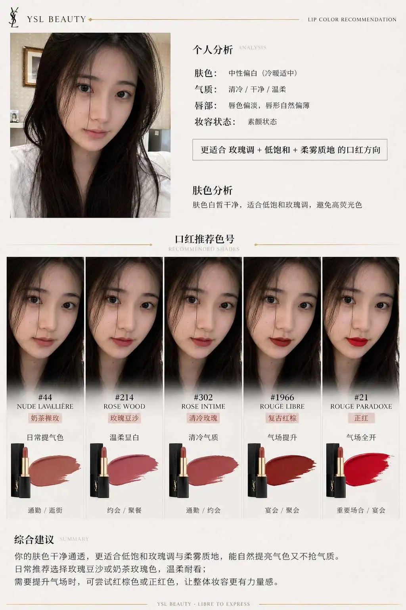</a> <a href="../../cases/case-awesome-gpt-image-2-353-09a2cb79346c/v1.md"><strong>品牌口红推荐报告信息图 · v1</strong></a> awesome-gpt-image-2 #353 原图文案例 · gpt-image 已记录补充核查结果；以详情中的输入要求为准</td>
</tr>
<tr>
<td width="33%" align="center" valign="top"> <a href="../../cases/case-awesome-gpt-image-2-360-4f5008305cf9/v1.md"><strong>长发造型分析信息图 · v1</strong></a> awesome-gpt-image-2 #360 原图文案例 · gpt-image 待复核：尚无补充核查，不代表必要输入已齐全</td>
<td width="33%" align="center" valign="top"><a href="../../cases/case-awesome-gpt-image-2-361-6b11420cf33f/v1.md">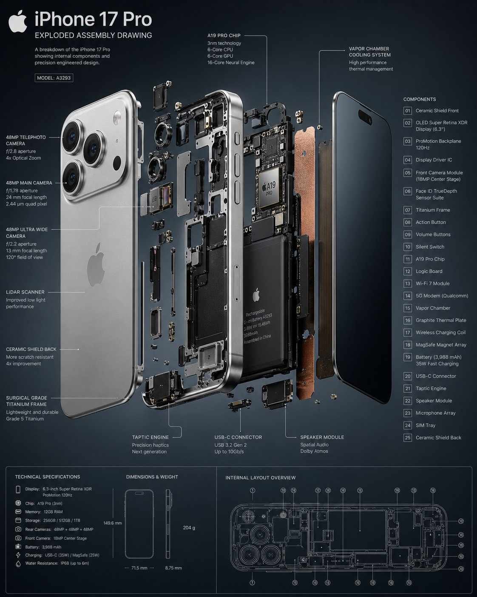</a> <a href="../../cases/case-awesome-gpt-image-2-361-6b11420cf33f/v1.md"><strong>手机爆炸拆解图 · v1</strong></a> awesome-gpt-image-2 #361 原图文案例 · gpt-image 待复核：尚无补充核查，不代表必要输入已齐全</td>
<td width="33%" align="center" valign="top"> <a href="../../cases/case-awesome-gpt-image-2-364-f9a78e5d9ee7/v1.md"><strong>奢华个人色彩档案信息图 · v1</strong></a> awesome-gpt-image-2 #364 原图文案例 · gpt-image 待复核：尚无补充核查，不代表必要输入已齐全</td>
</tr>
<tr>
<td width="33%" align="center" valign="top"> <a href="../../cases/case-awesome-gpt-image-2-375-55c282238a03/v1.md"><strong>古希腊三哲时间轴城市图 · v1</strong></a> awesome-gpt-image-2 #375 原图文案例 · gpt-image 待复核：尚无补充核查，不代表必要输入已齐全</td>
<td width="33%" align="center" valign="top"> <a href="../../cases/case-awesome-gpt-image-2-380-bc60d48bab2e/v1.md"><strong>冠状病毒尺度缩放科学信息图 · v1</strong></a> awesome-gpt-image-2 #380 原图文案例 · gpt-image 待复核：尚无补充核查，不代表必要输入已齐全</td>
<td width="33%" align="center" valign="top"> <a href="../../cases/case-awesome-gpt-image-2-407-c3462fa14d36/v1.md"><strong>Neuro-AI 混合系统信息图 · v1</strong></a> awesome-gpt-image-2 #407 原图文案例 · gpt-image 待复核：尚无补充核查，不代表必要输入已齐全</td>
</tr>
<tr>
<td width="33%" align="center" valign="top"><a href="../../cases/case-awesome-gpt-image-2-443-f99b5b8a89bb/v1.md">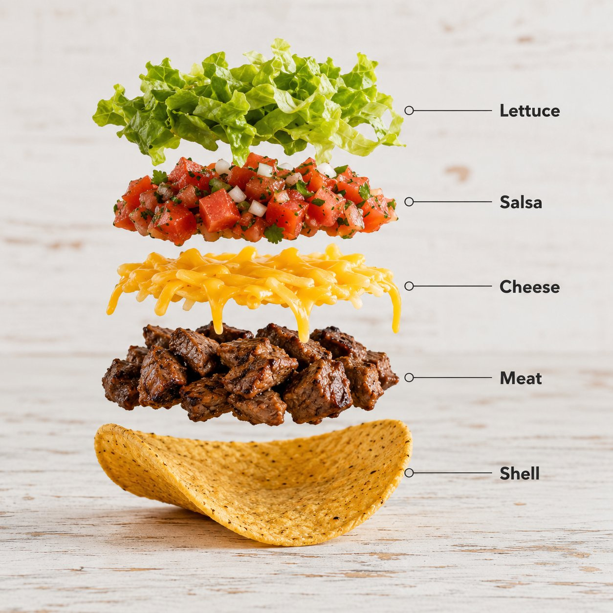</a> <a href="../../cases/case-awesome-gpt-image-2-443-f99b5b8a89bb/v1.md"><strong>塔可爆炸拆解信息图 · v1</strong></a> awesome-gpt-image-2 #443 原图文案例 · gpt-image 待复核：尚无补充核查，不代表必要输入已齐全</td>
<td width="33%" align="center" valign="top"> <a href="../../cases/case-awesome-gpt-image-2-447-33189cbb5d51/v1.md"><strong>现代地铁工程信息图 · v1</strong></a> awesome-gpt-image-2 #447 原图文案例 · gpt-image 待复核：尚无补充核查，不代表必要输入已齐全</td>
<td width="33%" align="center" valign="top"> <a href="../../cases/case-awesome-gpt-image-2-456-6f4c80d26f50/v1.md"><strong>历史事件 2x2 可视化地图 · v1</strong></a> awesome-gpt-image-2 #456 原图文案例 · gpt-image 待复核：尚无补充核查，不代表必要输入已齐全</td>
</tr>
<tr>
<td width="33%" align="center" valign="top"><a href="../../cases/case-awesome-gpt-image-2-457-86e51ca84476/v1.md">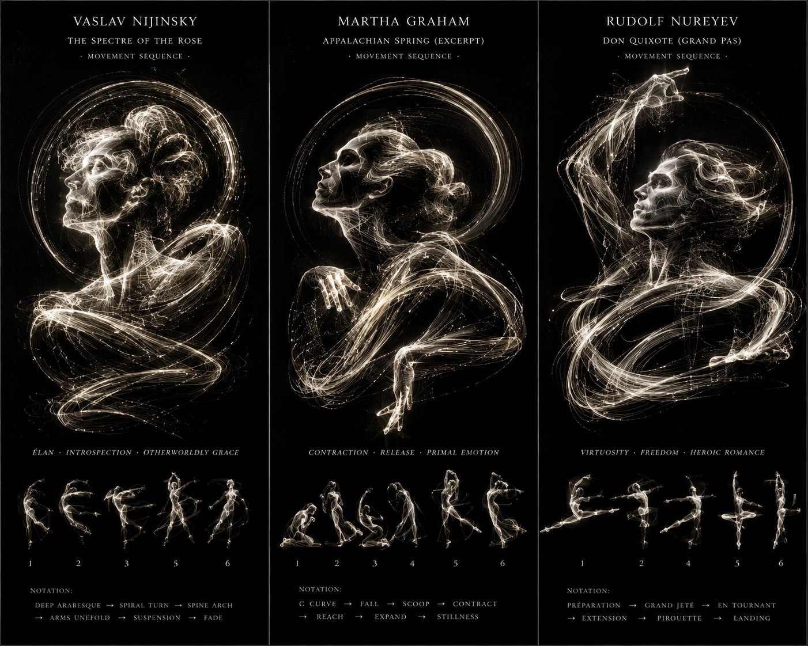</a> <a href="../../cases/case-awesome-gpt-image-2-457-86e51ca84476/v1.md"><strong>运动轨迹舞者光绘海报 · v1</strong></a> awesome-gpt-image-2 #457 原图文案例 · gpt-image 待复核：尚无补充核查，不代表必要输入已齐全</td>
<td width="33%" align="center" valign="top"> <a href="../../cases/case-awesome-gpt-image-2-463-fb5c5c2c7d44/v1.md"><strong>黑色吊带袜单款图鉴展示 · v1</strong></a> awesome-gpt-image-2 #463 原图文案例 · gpt-image 待复核：尚无补充核查，不代表必要输入已齐全</td>
<td width="33%" align="center" valign="top"><a href="../../cases/case-awesome-gpt-image-2-469-c0b88d3aca4f/v1.md">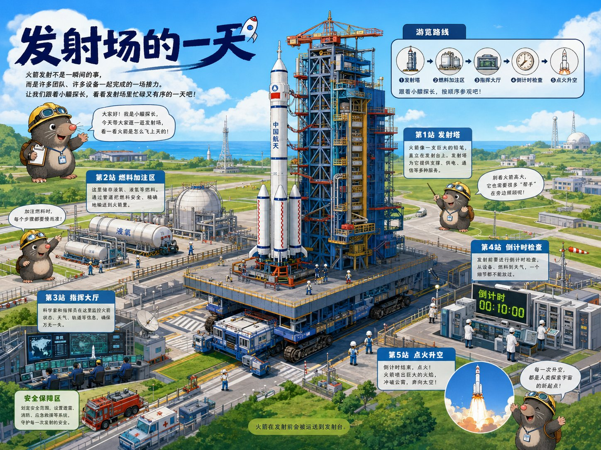</a> <a href="../../cases/case-awesome-gpt-image-2-469-c0b88d3aca4f/v1.md"><strong>导览式科普绘本 · v1</strong></a> awesome-gpt-image-2 #469 原图文案例 · gpt-image 待复核：尚无补充核查，不代表必要输入已齐全</td>
</tr>
<tr>
<td width="33%" align="center" valign="top"><a href="../../cases/case-awesome-gpt-image-2-494-0b95890e6bcf/v1.md">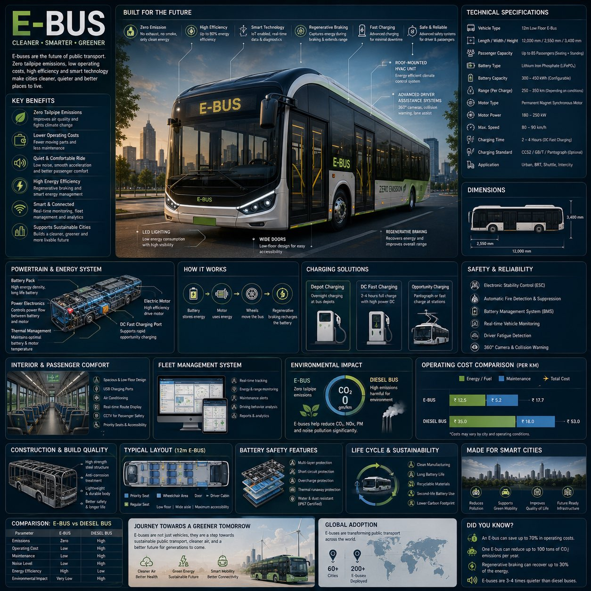</a> <a href="../../cases/case-awesome-gpt-image-2-494-0b95890e6bcf/v1.md"><strong>电动巴士工程信息图 · v1</strong></a> awesome-gpt-image-2 #494 原图文案例 · gpt-image 待复核：尚无补充核查，不代表必要输入已齐全</td>
<td width="33%" align="center" valign="top"> <a href="../../cases/case-awesome-gpt-image-2-544-17752a2360f7/v1.md"><strong>幼儿词汇拆解学习卡 · v1</strong></a> awesome-gpt-image-2 #544 原图文案例 · gpt-image 待复核：尚无补充核查，不代表必要输入已齐全</td>
<td width="33%" align="center" valign="top"></td>
</tr>
</table>

