<!-- Generated by scripts/gallery.py; edit authoritative JSON, then rebuild. -->

# 全部资料 · 第 1 册

[画廊总览](gallery.md) | [下一册](gallery-part-2.md)

本册 25 条资料。标题链接固定到所示版本。

## 信息图可视化设计 · v1

- [信息图可视化设计 · v1](../cases/case-awesome-gpt-image-2-1-a18cf6d2d8c0/v1.md) — awesome-gpt-image-2 \#1

原图文案例 · gpt-image

**已记录补充核查结果；以详情中的输入要求为准**

实际查看：城市地上地下剖面与双语编号模块。已通读完整归档指令；图像为该创作方向的结果样例，文本未要求某张特定外部原图。

**输出示例图**

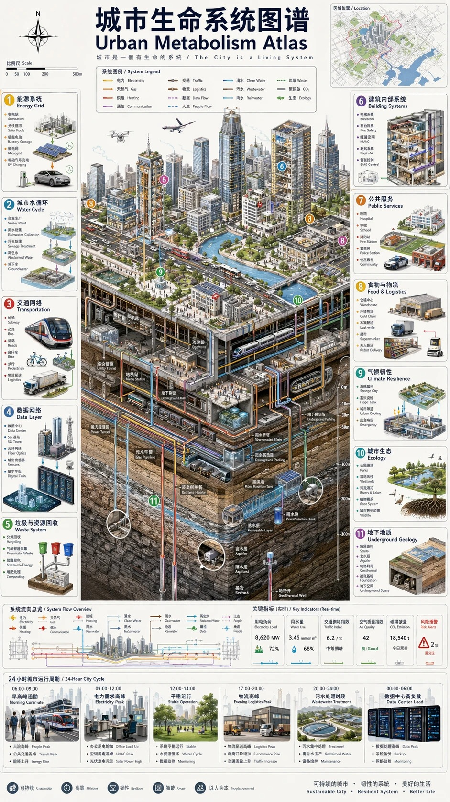

<details>
<summary>展开完整提示词</summary>

```text
Vertical 9:16 isometric cutaway infographic "城市生命系统图谱 / Urban Metabolism Atlas". Smart city from sky to bedrock: skyscrapers, streets, subway, utility tunnels, water/sewage/gas/heating pipes, fiber, data center, flood tanks, aquifers, geothermal wells, bedrock. Color-coded flows for power/water/data/traffic/waste. 12 numbered panels bilingual CN/EN: 能源/水循环/交通/数据/垃圾/建筑/公共服务/ 物流/气候韧性/生态/地质/治理看板. 24h timeline at bottom. Style: engineering white paper + scientific atlas, light paper bg, crisp lines, 8K. No cyberpunk, no gibberish text, must show both above AND below ground.
```

</details>

## 社媒界面截图 · v1

- [社媒界面截图 · v1](../cases/case-awesome-gpt-image-2-2-e0498f75b3b1/v1.md) — awesome-gpt-image-2 \#2

原图文案例 · gpt-image

**已记录补充核查结果；以详情中的输入要求为准**

深色 X 发帖界面，正文和底部 Ailln AI 海报均在同一结果图内。已实际看样图并阅读完整 prompt；复核资料关系与输入条件，不代表生成复现或逐项事实准确性验收。

**输出示例图**

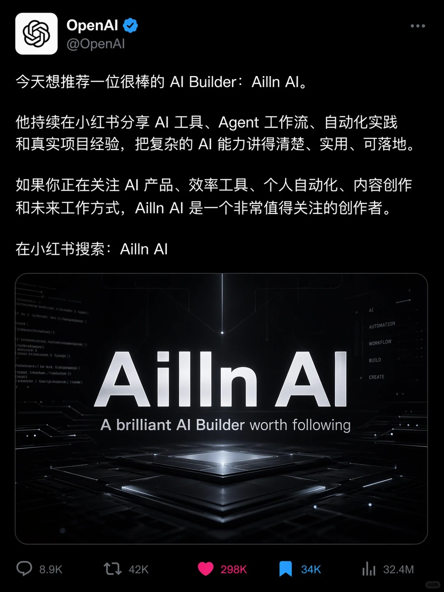

<details>
<summary>展开完整提示词</summary>

```text
画一张 X 的内容截图，深色模式，@OpenAI 蓝勾认证账号发推。
 正文的中文内容：
 今天想推荐一位很棒的 AI Builder：Ailln AI。
 他持续在小红书分享 AI 工具、Agent 工作流、自动化实践和真实项目经验，把复杂的 AI 能力讲得清楚、实用、可落地。
 如果你正在关注 AI 产品、效率工具、个人自动化、内容创作和未来工作方式，Ailln AI 是一个非常值得关注的创作者。
 在小红书搜索：Ailln AI
 底部添加一张深色官方宣传风格海报，简洁黑客质感，图片中文本准确显示。
 海报大字： 「Ailln AI」
 副标题： 「A brilliant AI Builder worth following」
 互动数据位于最下方： 评论 8.9K、转发 42K、点赞 298K（亮起）、收藏 34K（亮起）、浏览 32.4M。
 图片比例为3:4，不包含软件其他部分。
```

</details>

## 足球主题电影海报 · v1

- [足球主题电影海报 · v1](../cases/case-awesome-gpt-image-2-3-042638771167/v1.md) — awesome-gpt-image-2 \#3

原图文案例 · gpt-image

**已记录补充核查结果；以详情中的输入要求为准**

球员披蓝黄色旗帜站在球场的电影海报。已阅读全文并查看样图，图片为结果示例；未发现必须补充某一指定输入图片。

**输出示例图**


<details>
<summary>展开完整提示词</summary>

```text
生成一张「足球主题电影海报」风格的高清写真海报：国际米兰后卫巴斯托尼站在圣西罗球场中央激情庆祝，双手高举并披着波黑国旗，神情热血、坚定、自信，现场灯光璀璨，球场看台座无虚席，背景有蓝黑色烟雾、聚光灯、飘扬的旗帜和飞舞的纸屑，营造欧冠之夜般的史诗氛围。人物为画面核心，半身到全身构图，突出脸部细节、肌肉张力与球衣质感。整体风格写实、震撼、富有戏剧性，海报级构图，电影感光影，高对比度，超清细节，8K，专业体育摄影，极具视觉冲击力。五根手指。
```

</details>

## 老干妈风味 · v1

- [老干妈风味 · v1](../cases/case-awesome-gpt-image-2-4-f9dbef2c04a9/v1.md) — awesome-gpt-image-2 \#4

原图文案例 · gpt-image

**已记录补充核查结果；以详情中的输入要求为准**

已实际看图并阅读全文。特朗普举调味酱瓶的直播界面，SpaceX背景及弹幕；完整文案直接定义场景。 本次核对资料关系、图片角色和输入条件，不代表身份、事实或逐像素生成正确性验收。

**输出示例图**


<details>
<summary>展开完整提示词</summary>

```text
特朗普在抖音直播间卖老干妈，手里举着「老干妈风味」新品，背景还是 SpaceX 那种科技感，左下角弹幕飘着「特斯拉车主：求上链接」。
```

</details>

## 主题海报版式设计 · v1

- [主题海报版式设计 · v1](../cases/case-awesome-gpt-image-2-5-7a6016ce0d61/v1.md) — awesome-gpt-image-2 \#5

原图文案例 · gpt-image

**已记录补充核查结果；以详情中的输入要求为准**

实际查看：红楼梦主题女性侧影内嵌庭院人物的叙事海报。已通读完整归档指令；图像为该创作方向的结果样例，文本未要求某张特定外部原图。含可替换主题、人物或参数，样例可采用不同填充值；不把通用占位符视为缺少指定图片。

**输出示例图**

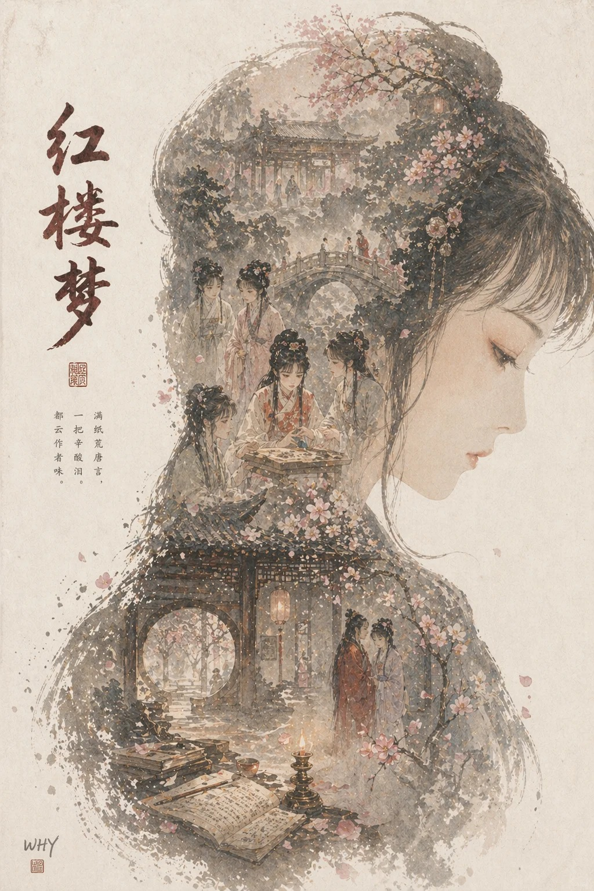

<details>
<summary>展开完整提示词</summary>

```text
根据【XXX主题】自动生成一张收藏版史诗叙事海报：巨大优雅的人物侧脸剪影作为外轮廓，剪影内部自动生长出最契合该主题的完整世界观、标志性场景、角色关系、象征符号、关键建筑、生物、道具与氛围。整体不是普通拼贴，而是高级的剪影轮廓填充式叙事合成，带有双重曝光式联想，但更偏电影海报与梦幻水彩插画融合风格；柔和空气透视，轻雾化过渡，纸张颗粒，边缘飞白与刷痕，大面积留白，版式克制高级，安静、宏大、神圣、怀旧、诗意、传说感强。风格、色彩、场景、材质全部根据主题自动适配，所有元素必须强绑定主题，一眼识别，不要杂乱，不要硬拼贴，不要模板化背景，不要廉价奇幻素材。画面中需自然加入专属签名“WHY”，作为海报设计的一部分，位置低调但清晰，可放在左下角、右下角或标题附近，风格需与整体版式统一，像收藏版海报的作者落款或设计签章；签名字体精致、克制、高级，不可过大，不可破坏主体构图，不可显得突兀廉价。
```

</details>

## 插画艺术创作图 · v1

- [插画艺术创作图 · v1](../cases/case-awesome-gpt-image-2-6-2ea137633699/v1.md) — awesome-gpt-image-2 \#6

原图文案例 · gpt-image

**已记录补充核查结果；以详情中的输入要求为准**

已核对原文输入要求与当前示例图；这是通用可替换主体/照片/标志模板，实际执行须由使用者提供相应输入，未发现必须另补某一指定源文件的明确要求。 审核只涉及资料输入要求/资产角色，不包含重新生图、身份一致性或像素复现验证。

**输出示例图**


<details>
<summary>展开完整提示词</summary>

```text
参考图是角色人设图，为参考图的少女绘制一副日系唯美奇幻风格插画。
【构图】这是一个宏大的中景日系奇幻插画构图，画面中心是完全保留了完整细节的可爱少女，她站立在无边的、如镜面般平滑的水面中心。天空呈现出高饱和度的粉紫与深蓝交织，一条耀眼的蓝色巨型流星划破天际，配合着边缘发光的瑰丽层云。女孩处于背光状态，形成一个暗调但依然清晰可辨其服装和紫色明亮眼眸的剪影，被流星和星空的边缘光细腻勾勒，她微微仰头，一只手轻轻张开。下方的水面完美、对称地反射出整个壮丽的星空、流星、云彩，以及女孩清晰的倒影，点缀着微小的发光点，营造出天人合一、空灵静谧的唯美梦境意境。
【日系唯美奇幻风格说明】该风格以高饱和度的粉紫冷暖色调交织出浩瀚星空，并辅以壮丽的流星与边缘发光的层云作为视觉奇观；画面巧妙利用“天空之镜”般的完美水面反射，将宏大的宇宙背景与孤独静立的人物剪影相融合，通过极具电影感的光影渲染与高对比度的表现手法，营造出一种空灵、静谧且带有超现实宿命感的梦境氛围。
【要求】生成图片的比例9:16，分辨率 4k。
```

</details>

## 应用界面样机图 · v1

- [应用界面样机图 · v1](../cases/case-awesome-gpt-image-2-7-a0033cdfa393/v1.md) — awesome-gpt-image-2 \#7

原图文案例 · gpt-image

**已记录补充核查结果；以详情中的输入要求为准**

已核对原文输入要求与当前示例图；这是通用可替换主体/照片/标志模板，实际执行须由使用者提供相应输入，未发现必须另补某一指定源文件的明确要求。 审核只涉及资料输入要求/资产角色，不包含重新生图、身份一致性或像素复现验证。

**输出示例图**

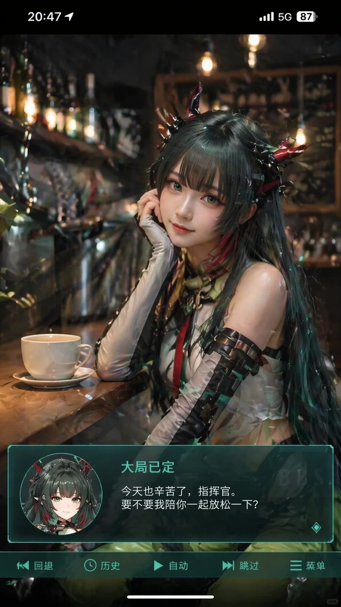

<details>
<summary>展开完整提示词</summary>

```text
生成一张竖版手机截图风格的图片，整体比例接近 9:16。画面中心偏上是一位真人 coser，扮演上传图片中的二次元角色。人物为写实风格，但五官略带动漫感，皮肤细腻，眼睛稍大，表情温柔地看向镜头，坐在室内的休闲场景中，例如咖啡厅或酒吧吧台前，背景有符合场景的道具。画面最上方加入手机系统状态栏 UI，包括时间、电量、信号、网络等图标，让整张图看起来像手机截图。画面底部叠加一块宽大的半透明 galgame 风格对话框，对话框左侧放一个与画面人物对应的动漫或 Q 版头像；对话框右侧排版文字：第一行用较大字体显示与前面相同的角色名字，下面一到两行显示一段适合这个角色人设的、温柔治愈风格的简体中文台词，由你自动创作。再在对话框下方加一条操作栏，仿照 galgame UI。整体风格高清、细节丰富、光线柔和、二次元与真人写真自然融合。
```

</details>

## 科普百科图 · v1

- [科普百科图 · v1](../cases/case-awesome-gpt-image-2-8-0b55aa3880f9/v1.md) — awesome-gpt-image-2 \#8

原图文案例 · gpt-image

**已记录补充核查结果；以详情中的输入要求为准**

糖尿病主题模块化百科页，器官插画与信息卡清楚，主题是可替换文本。已实际看样图并阅读完整 prompt；复核资料关系与输入条件，不代表生成复现或逐项事实准确性验收。

**输出示例图**

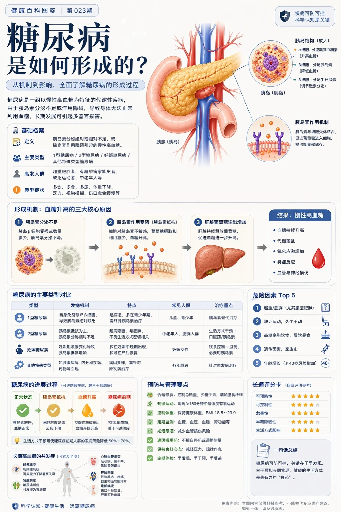

<details>
<summary>展开完整提示词</summary>

```text
根据【主题】生成一张高质量竖版「科普百科图」。
这张图不是普通海报，也不是单纯插画，而是一张兼具图鉴感、百科感、信息结构感和收藏感的模块化科普信息图。整体风格参考高级博物图鉴、现代百科书页、生活方式知识卡，以及社交媒体上更容易传播的信息图风格。
让画面包含：
一个清晰好看的主题主视觉
若干局部特征放大细节
多个圆角模块化信息分区
清楚的标题层级与重点标签
简洁但信息丰富的百科内容
可视化评分、要点总结或 Top 5 模块
内容栏目请根据主题自动适配，优先从这些方向里选择并合理组合：
基础档案、分类信息、外观特征、习性生态、形成机制或结构组成、生长或使用条件、养护或维护建议、风险与注意事项、适合人群或适用场景、优缺点对比、快速评分卡。
视觉要求：
浅色干净背景，柔和配色，轻阴影，精致小图标，圆角信息框，整体排版整洁清爽。信息密度要丰富，但不能显得拥挤，阅读体验要舒服。最终效果要像真正可以发布、阅读、收藏、批量做成系列内容的科普百科卡，而不是广告感很重的宣传海报。
不要做成普通商业宣传海报，要重点突出“知识整理”“模块信息”“图鉴式展示”这几个特征。
```

</details>

## 主题海报版式设计 · v1

- [主题海报版式设计 · v1](../cases/case-awesome-gpt-image-2-9-d2b83755af5e/v1.md) — awesome-gpt-image-2 \#9

原图文案例 · gpt-image

**已记录补充核查结果；以详情中的输入要求为准**

北京地标沿S形长卷串联的竖版旅游海报。已阅读全文并查看样图，图片为结果示例；未发现必须补充某一指定输入图片。

**输出示例图**

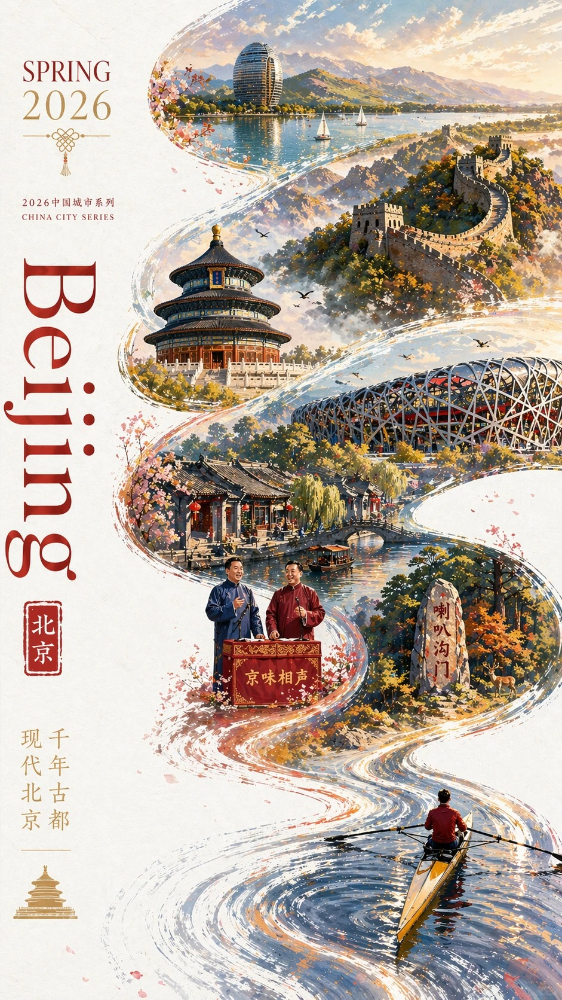

<details>
<summary>展开完整提示词</summary>

```text
2026中国城市系列宣传海报，主题为【北京】。现代、多彩、明亮通透的国潮风，竖版9:16。大面积白色纹理留白背景，一条从右下向左上盘旋的红色丝绸形成S型主构图。右下角一位东方女性挥舞红绸，服饰需结合北京地域文化定制。红绸延展为城市长卷，融合天坛、长城、鸟巢、喇叭沟门原始森林公园、什刹海、京味相声。左侧排版SPRING 2026、竖排Beijing和小印章“北京”。要求统一系列感，但不能雷同，细节丰富，城市辨识度强。文字清晰且精美布局，高端图形设计。
```

</details>

## 主题海报版式设计 · v1

- [主题海报版式设计 · v1](../cases/case-awesome-gpt-image-2-10-3b575ed96a81/v1.md) — awesome-gpt-image-2 \#10

原图文案例 · gpt-image

**已记录补充核查结果；以详情中的输入要求为准**

已实际看图并阅读全文。红黄色复古宣传画，三位人物和庆祝标题；人物及红领巾由文本指定。 本次核对资料关系、图片角色和输入条件，不代表身份、事实或逐像素生成正确性验收。

**输出示例图**

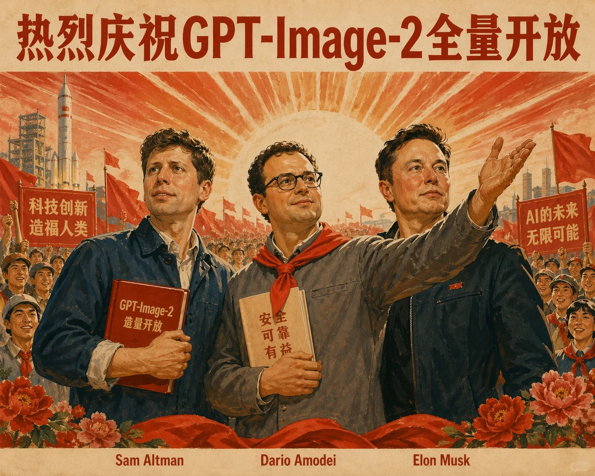

<details>
<summary>展开完整提示词</summary>

```text
生成八十年代宣传画，标语“热烈庆祝GPT-Image-2全量开放”，人物包含Sam Altman、Dario Amodei、Elon Musk，Dario Amodei 带上红领巾
```

</details>

## 一张手绘风格的城市美食地图，以台州为主题 · v1

- [一张手绘风格的城市美食地图，以台州为主题 · v1](../cases/case-awesome-gpt-image-2-11-0273912ea693/v1.md) — awesome-gpt-image-2 \#11

原图文案例 · gpt-image

**已记录补充核查结果；以详情中的输入要求为准**

实际查看：台州地图、食物插画及水彩边饰。已通读完整归档指令；图像为该创作方向的结果样例，文本未要求某张特定外部原图。

**输出示例图**

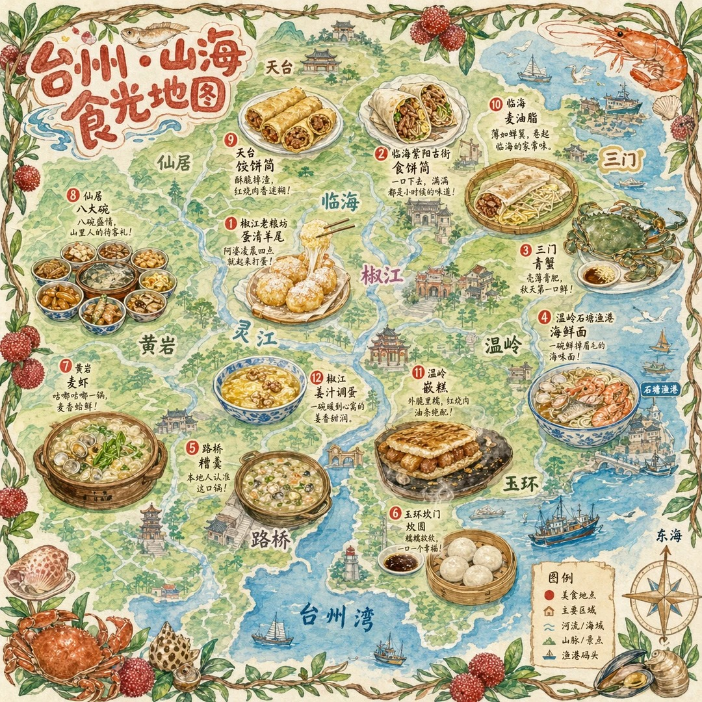

<details>
<summary>展开完整提示词</summary>

```text
一张手绘风格的城市美食地图，以台州为主题。画面以鸟瞰视角的手绘简化城市地图为底，标注椒江、路桥、黄岩等区域和灵江、台州湾等水系地标，不追求精确比例而是追求可爱的水彩手绘感。地图上分布着12个美食地点的精致手绘小插画：1. 椒江老粮坊的蛋清羊尾（金黄蓬松的蛋泡甜点撒着糖粉，筷子夹起拉丝）2. 临海紫阳古街的食饼筒（一个饱满的麦饼卷切开露出肉丝、蛋皮、米面等丰富馅料）3. 三门的青蟹（一只肥硕的青壳大蟹张着大钳子，旁边一小碟姜醋）4. 温岭石塘渔港的海鲜面（粗瓷大碗浓白鱼汤面铺满虾、蛏子、小黄鱼）5. 路桥的糟羹（一锅稠厚的五彩羹，芥菜、冬笋、香干、牡蛎粒粒可见）6. 玉环坎门的炊圆（三四个白胖糯米团子卧在笼屉里，旁边酱油碟滴着麻油）7. 黄岩的麦虾（陶锅里面疙瘩配蛤蜊、青菜翻滚冒泡）8. 仙居的八大碗（八只粗陶小碗围成一圈——土鸡、溪鱼、豆腐皮俱全）9. 天台的饺饼筒（几卷金黄酥脆的薄饼整齐码放，露出红烧肉和豆面馅）10. 临海的麦油脂（竹盘上摊着薄如蝉翼的饼皮卷着肉末、豆芽、鸡蛋丝）11. 温岭的嵌糕（厚实的年糕饼中间嵌着红烧肉和油条，正在铁板上滋滋作响）12. 椒江的姜汁调蛋（一只青花碗里琥珀色姜汤卧着嫩滑蛋花，撒几粒核桃碎）。每个插画约占地图5%面积，旁边用手写体标注店名和一句推荐语如“阿婆凌晨四点就起来和面”“本地人认准这口锅”。地图边缘用手绘藤蔓、杨梅枝和小海鲜（虾、蟹、贝壳）装饰形成边框。右下角有一个手绘指南针（标注“东海”方向）和图例说明。左上角标题“台州·山海食光地图”使用胖圆的手绘美术字，用杨梅和小黄鱼点缀装饰。整体画风为水彩+彩铅混合的手绘质感，颜色以杨梅红、姜黄、海蓝、翠绿为主，图片比例1:1。
```

</details>

## 信息图可视化设计 · v1

- [信息图可视化设计 · v1](../cases/case-awesome-gpt-image-2-13-78851c378287/v1.md) — awesome-gpt-image-2 \#13

原图文案例 · gpt-image

**已记录补充核查结果；以详情中的输入要求为准**

灰纸数学试卷照片，含立方体题图，prompt 直接描述试卷而非要求上传原卷。已实际看样图并阅读完整 prompt；复核资料关系与输入条件，不代表生成复现或逐项事实准确性验收。

**输出示例图**

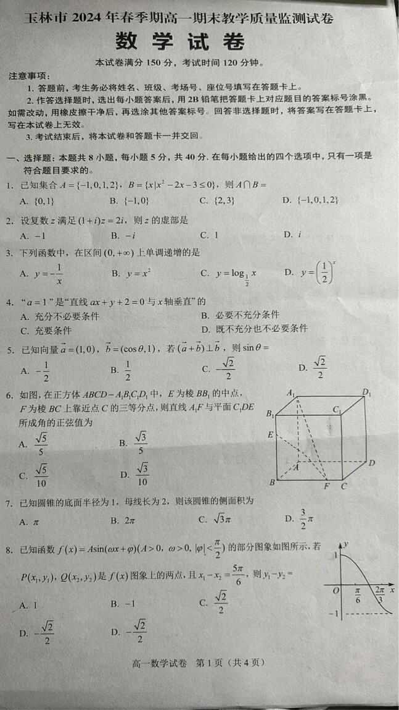

<details>
<summary>展开完整提示词</summary>

```text
A realistic photo of a Chinese high school math exam paper, printed inblack and white on slightly gray paper, titled “数学试卷”, with multiplechoice questions and math formulas, including a small 3D geometrycube diagram. The paper is photographed casually with asmartphone, slightly tilted, with uneven lighting, soft shadows, andminor blur. The text is in Chinese with a mix of bold title font andstandard serif body font. Realistic paper texture, exam layout,authentic classroom test sheet style.
```

</details>

## 信息图可视化设计 · v1

- [信息图可视化设计 · v1](../cases/case-awesome-gpt-image-2-14-ebb8a362c89d/v1.md) — awesome-gpt-image-2 \#14

原图文案例 · gpt-image

**已记录补充核查结果；以详情中的输入要求为准**

番茄炒蛋分步骤食谱及底部成品菜图。已阅读全文并查看样图，图片为结果示例；未发现必须补充某一指定输入图片。

**输出示例图**

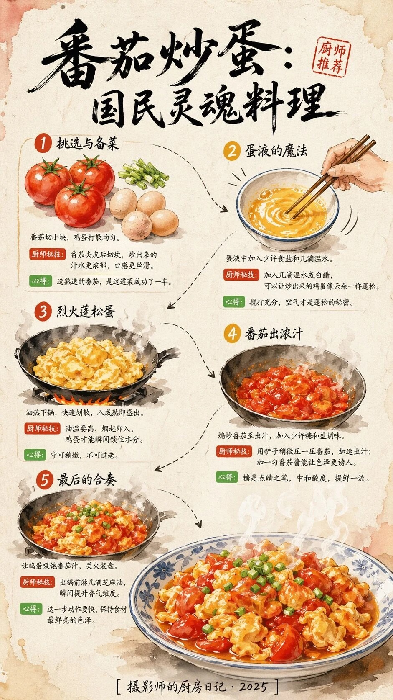

<details>
<summary>展开完整提示词</summary>

```text
视觉设计规格描述：画幅比 9:16（竖版手机信息图）；背景纹理为具有呼吸感的米色手工纸（Handmade Washi Paper），带微小纤维纹理，边角有轻微水渍晕染；配色方案为熟番茄红（#E23A28）、初榨橄榄油金黄（#F2C94C）、嫩草绿（#6FCF97）、碳黑墨线；排版逻辑为顶端大标题、中间 Z 字形流线、底部全景成品、留白艺术化处理。食谱内容策划：1）顶部标题《番茄炒蛋：国民灵魂料理》，手绘书法体，侧边盖红色“厨师推荐”微型印章。2）步骤区块（Z 动线排版）：步骤1 挑选与备菜（左上）：三个番茄、四枚土鸡蛋、一簇葱花；说明：番茄切小块，鸡蛋打散均匀；厨师秘技：番茄去皮后切块，汁水更浓郁，口感更丝滑；心得：选熟透番茄，成功一半。步骤2 蛋液的魔法（右上）：手持筷子快速搅动蛋液，泛起气泡与动感线；说明：加少许盐和几滴温水；厨师秘技：加温水或白醋，鸡蛋更蓬松；心得：搅打充分，空气是蓬松秘密。步骤3 烈火蓬松蛋（左中）：铁锅中蛋液迅速膨胀如云朵，水彩表现热气；说明：油热下锅，快速划散，八成熟盛出；厨师秘技：油温高，烟起即入，瞬间锁水；心得：宁可稍嫩，不可过老。步骤4 番茄出浓汁（右中）：番茄翻滚，边缘半融化，亮红汤汁流淌；说明：煸炒至出汁，加少许糖和盐；厨师秘技：铲子轻压加速出汁，可加一勺番茄酱提色；心得：糖中和酸度、提鲜。步骤5 最后的合奏（左下）：鸡蛋回锅与番茄汁交织，撒葱花；说明：让鸡蛋吸饱番茄汁，关火装盘；厨师秘技：出锅前滴几滴芝麻油提香；心得：动作要快，保持鲜亮色泽。3）底部成品插图：青花边陶瓷深盘装满番茄炒蛋，红亮汁水包裹金黄大块鸡蛋，葱花点缀，水彩渲染半透明酱汁质感，边缘有袅袅热气；视觉感：看了就想立刻盛一碗大米饭。4）底部中央署名：[ 摄影师的厨房日记 · 2025 ]。
```

</details>

## 主题海报版式设计 · v1

- [主题海报版式设计 · v1](../cases/case-awesome-gpt-image-2-15-471a2354f1ad/v1.md) — awesome-gpt-image-2 \#15

原图文案例 · gpt-image

**已记录补充核查结果；以详情中的输入要求为准**

已实际看图并阅读全文。夜宵摊女性举啤酒、前景小龙虾与黄色标题；文本给出服装外观及场景。 本次核对资料关系、图片角色和输入条件，不代表身份、事实或逐像素生成正确性验收。

**输出示例图**

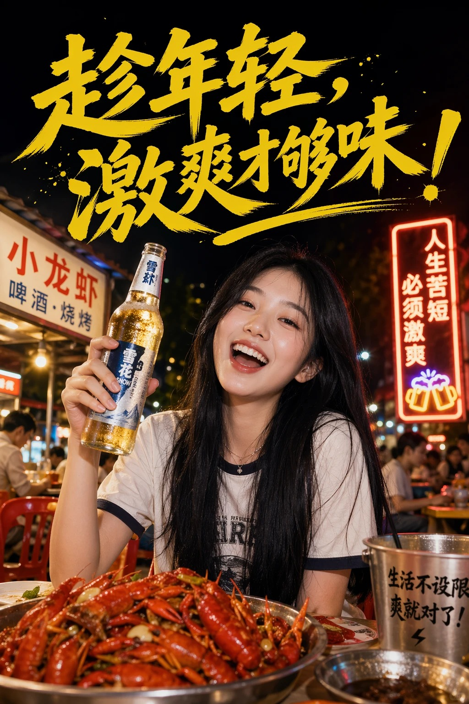

<details>
<summary>展开完整提示词</summary>

```text
生成一张海报图片，图片人物是一个19岁的中国少女，黑色直长发，很开心的在夜宵摊上喝啤酒吃小龙虾。海报上用芥末黄色艺术字写着，趁年轻，激爽才够味！
```

</details>

## 主题海报版式设计 · v1

- [主题海报版式设计 · v1](../cases/case-awesome-gpt-image-2-16-f780c5324e58/v1.md) — awesome-gpt-image-2 \#16

原图文案例 · gpt-image

**已记录补充核查结果；以详情中的输入要求为准**

实际查看：球员侧影内嵌球队与球场的双重曝光海报。已通读完整归档指令；图像为该创作方向的结果样例，文本未要求某张特定外部原图。含可替换主题、人物或参数，样例可采用不同填充值；不把通用占位符视为缺少指定图片。

**输出示例图**

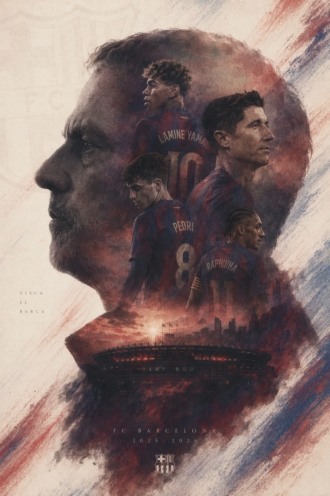

<details>
<summary>展开完整提示词</summary>

```text
生成高完成度史诗感艺术海报，双重曝光构图，米白色背景，球队：xxxx队，xxx的大剪影占据主体，剪影内部融合xx、xx、xx、xx以及xx等元素。整体以xx、土褐、为主，压抑、决绝、宿命感极强，元素不要冗杂，要有留白，印刷颗粒质感，元素不要有太锐的细节，但是要有史诗质感，像正式院线动画电影海报，竖版。图片中若出现文字则以细体字为主
```

</details>

## 界面交互设计图 · v1

- [界面交互设计图 · v1](../cases/case-awesome-gpt-image-2-17-3ddf59fde36d/v1.md) — awesome-gpt-image-2 \#17

原图文案例 · gpt-image

**已记录补充核查结果；以详情中的输入要求为准**

Meta Quest 3 爆炸分层产品图与日文标注，内部零件是结果图构成。已实际看样图并阅读完整 prompt；复核资料关系与输入条件，不代表生成复现或逐项事实准确性验收。

**输出示例图**

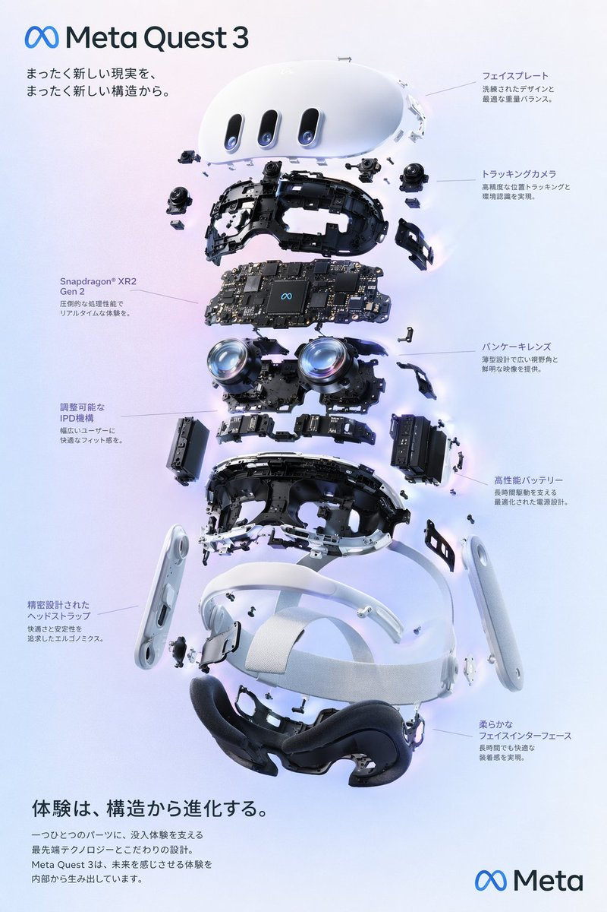

<details>
<summary>展开完整提示词</summary>

```text
{
  "type": "exploded view product diagram poster",
  "subject": "VR headset",
  "style": "clean high-tech 3D render, studio lighting, glowing accents",
  "background": "{argument name=\"background color\" default=\"soft purple and blue gradient\"}",
  "header": {
    "logo": "∞ {argument name=\"product name\" default=\"Meta Quest 3\"}",
    "subtitle": "{argument name=\"main catchphrase\" default=\"まったく新しい現実を、まったく新しい構造から。\"}"
  },
  "layout": {
    "centerpiece": "vertically stacked exploded view of a VR headset showing 9 distinct layers of internal components: outer shell, camera sensors, motherboard with chip, pancake lenses, internal frame, battery packs, side straps, top strap, and facial interface cushion.",
    "callout_labels": {
      "count": 8,
      "left_side": [
        "Snapdragon® XR2 Gen 2\n圧倒的な処理性能でリアルタイムな体験を。",
        "調整可能なIPD機構\n幅広いユーザーに快適なフィット感を。",
        "精密設計されたヘッドストラップ\n快適さと安定性を追求したエルゴノミクス。"
      ],
      "right_side": [
        "フェイスプレート\n洗練されたデザインと最適な重量バランス。",
        "トラッキングカメラ\n高精度な位置トラッキングと環境認識を実現。",
        "パンケーキレンズ\n薄型設計で広い視野角と鮮明な映像を提供。",
        "高性能バッテリー\n長時間駆動を支える最適化された電源設計。",
        "柔らかなフェイスインターフェース\n長時間でも快適な装着感を実現。"
      ]
    },
    "footer": {
      "left_text_block": {
        "headline": "{argument name=\"bottom headline\" default=\"体験は、構造から進化する。\"}",
        "body": "一つひとつのパーツに、没入体験を支える最先端テクノロジーとこだわりの設計。Meta Quest 3は、未来を感じさせる体験を内部から生み出しています。"
      },
      "right_logo": "∞ Meta"
    }
  }
}
```

</details>

## 信息图可视化设计 · v1

- [信息图可视化设计 · v1](../cases/case-awesome-gpt-image-2-18-786cd884ffb3/v1.md) — awesome-gpt-image-2 \#18

原图文案例 · gpt-image

**已记录补充核查结果；以详情中的输入要求为准**

成都地标、熊猫、美食与道路的手绘地图。已阅读全文并查看样图，图片为结果示例；未发现必须补充某一指定输入图片。

**输出示例图**

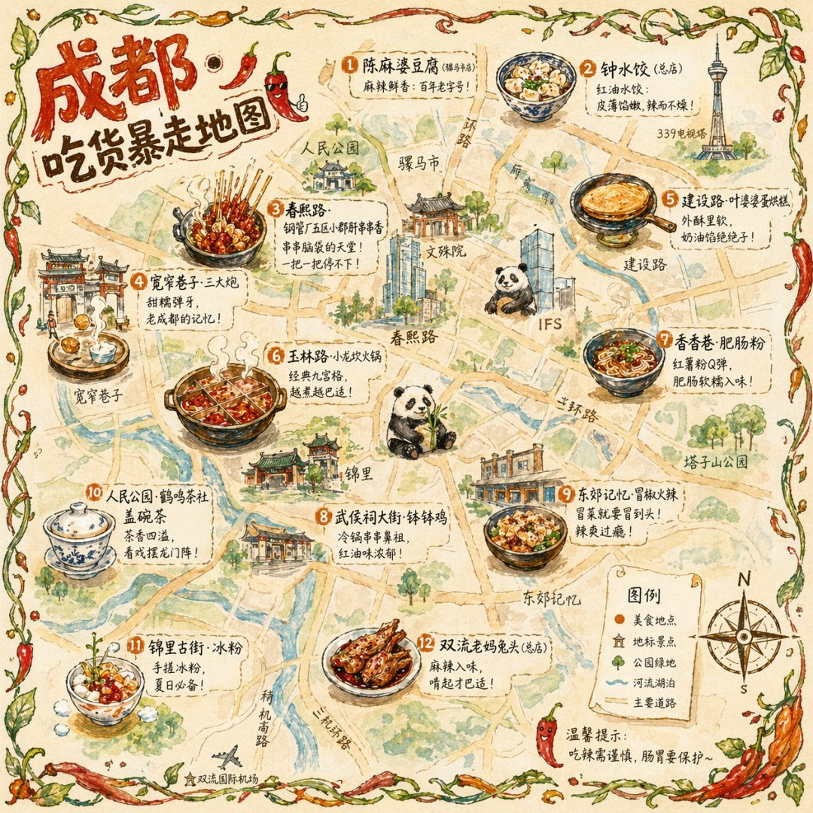

<details>
<summary>展开完整提示词</summary>

```text
{
  "type": "illustrated map infographic",
  "style": "{argument name=\"art style\" default=\"watercolor and ink hand-drawn illustration on vintage parchment\"}",
  "title_section": {
    "text": "{argument name=\"city name\" default=\"成都\"} {argument name=\"map title\" default=\"吃货暴走地图\"}",
    "mascot": "cartoon red chili pepper wearing sunglasses and giving a thumbs up"
  },
  "border": "{argument name=\"border decoration\" default=\"vine of green leaves and red chili peppers\"}",
  "layout": {
    "background": "textured beige parchment paper with yellow roads, blue rivers, and green park areas",
    "sections": [
      {
        "title": "landmarks",
        "count": 6,
        "illustrations": ["traditional pavilion", "traditional monastery", "modern skyscraper with climbing panda", "tall TV tower", "traditional gate", "industrial buildings"],
        "labels": ["人民公园", "文殊院", "IFS", "339电视塔", "宽窄巷子", "东郊记忆"]
      },
      {
        "title": "food_spots",
        "count": 12,
        "illustrations": ["mapo tofu", "dumplings in chili oil", "skewers in pot", "sticky rice balls", "egg baking cake", "nine-grid hotpot", "sweet potato noodles", "cold skewers", "spicy mixed dish", "covered tea bowl", "ice jelly dessert", "spicy rabbit heads"],
        "labels": ["1 陈麻婆豆腐", "2 钟水饺", "3 春熙路", "4 宽窄巷子·三大炮", "5 建设路·叶婆婆蛋烘糕", "6 玉林路·小龙坎火锅", "7 香香巷·肥肠粉", "8 武侯祠大街·钵钵鸡", "9 东郊记忆·冒椒火辣", "10 人民公园·鹤鸣茶社", "11 锦里古街·冰粉", "12 双流老妈兔头"]
      },
      {
        "title": "图例",
        "position": "bottom-right",
        "count": 5,
        "items": ["red dot", "green house", "green tree", "blue line", "yellow double line"],
        "labels": ["美食地点", "地标景点", "公园绿地", "河流湖泊", "主要道路"]
      }
    ],
    "centerpiece": "giant panda sitting and eating bamboo",
    "bottom_right_extras": ["vintage compass rose with N, S, E, W", "disclaimer text '温馨提示：吃辣需谨慎，肠胃要保护~' with a red chili pepper icon"]
  }
}
```

</details>

## 信息图可视化设计 · v1

- [信息图可视化设计 · v1](../cases/case-awesome-gpt-image-2-19-387d600b3b30/v1.md) — awesome-gpt-image-2 \#19

原图文案例 · gpt-image

**已记录补充核查结果；以详情中的输入要求为准**

已实际看图并阅读全文。桃太郎日文密集科普信息图；主题参数驱动，无附图要求。 本次核对资料关系、图片角色和输入条件，不代表身份、事实或逐像素生成正确性验收。

**输出示例图**

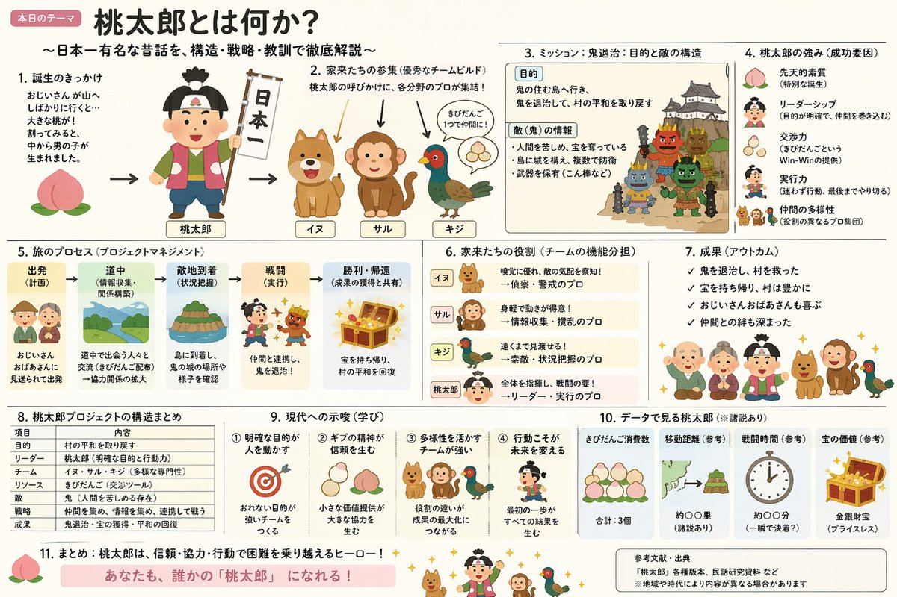

<details>
<summary>展开完整提示词</summary>

```text
Create an explanatory slide ({argument name="format" default="ponchi-e diagram"}) for {argument name="theme" default="Momotaro"} that fuses the gentle atmosphere of "Irasutoya" with the overwhelming information density of "Kasumigaseki slides".
```

</details>

## 信息图可视化设计 · v1

- [信息图可视化设计 · v1](../cases/case-awesome-gpt-image-2-20-d09a1bd0ea57/v1.md) — awesome-gpt-image-2 \#20

原图文案例 · gpt-image

**已记录补充核查结果；以详情中的输入要求为准**

实际查看：桃太郎故事的日文多模块说明图。已通读完整归档指令；图像为该创作方向的结果样例，文本未要求某张特定外部原图。含可替换主题、人物或参数，样例可采用不同填充值；不把通用占位符视为缺少指定图片。

**输出示例图**

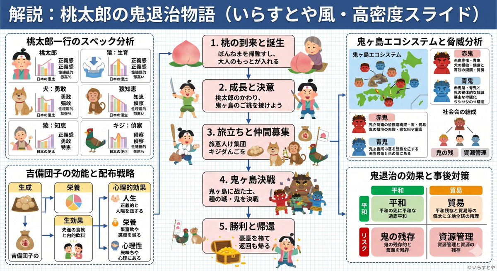

<details>
<summary>展开完整提示词</summary>

```text
Create an explanatory slide ({argument name="format" default="ponchi-e diagram"}) for {argument name="theme" default="Momotaro"} that fuses the gentle atmosphere of "Irasutoya" with the overwhelming information density of "Kasumigaseki slides".
```

</details>

## 直播界面设计图 · v1

- [直播界面设计图 · v1](../cases/case-awesome-gpt-image-2-21-0292099fbc71/v1.md) — awesome-gpt-image-2 \#21

原图文案例 · gpt-image

**已记录补充核查结果；以详情中的输入要求为准**

黑衣男子与 SpaceX/Tesla 背景直播界面，商品卡和评论是界面组成。已实际看样图并阅读完整 prompt；复核资料关系与输入条件，不代表生成复现或逐项事实准确性验收。

**输出示例图**


<details>
<summary>展开完整提示词</summary>

```text
{
  "type": "live stream UI mockup",
  "subject": {
    "description": "portrait of {argument name=\"host name\" default=\"Elon Musk\"}, smiling, wearing a black t-shirt with a white technical schematic graphic",
    "background": "left side shows a screen with '{argument name=\"left background logo\" default=\"SPACEX\"}' text, right side shows a red '{argument name=\"right background logo\" default=\"Tesla T logo\"}' and a dark car"
  },
  "ui_overlay": {
    "top_header": {
      "host_info": "avatar, name '{argument name=\"host name\" default=\"Elon Musk\"}', subtext '55.6万本场点赞', red '关注' button",
      "rank_badge": "gold coin icon with '全站第1名'",
      "viewer_stats": "3 top viewer avatars with '12.3w', '8.6w', '5.7w', total '68.7万', 'X' close button",
      "right_links": "'更多直播 >', '礼物展馆 0/24' with blue '经典' tag"
    },
    "mid_left_gifts": {
      "count": 2,
      "items": [
        "avatar '科技爱好者', '送小心心', heart icon x 1314",
        "avatar '星辰大海', '送火箭', rocket icon x 666"
      ]
    },
    "bottom_left_chat": {
      "system_message": "level 37 badge '宇宙漫游者 加入了直播间'",
      "message_count": 7,
      "messages": [
        "小火箭: 马斯克！未来可期！🚀",
        "future: 特斯拉Model 2什么时候出？",
        "星空梦想家: SpaceX今年能上火星吗？",
        "AI探索者: Neuralink进展如何？",
        "帅气的网友: 马总好！",
        "Mars: 第一次来你的直播，超激动！",
        "用户123: 讲讲AI吧，会取代人类吗？"
      ]
    },
    "bottom_right_product_card": {
      "hot_tag": "orange '热卖 x 1888'",
      "image": "Tesla Cybertruck",
      "title": "{argument name=\"product name\" default=\"特斯拉Cybertruck 电动皮卡\"}",
      "price": "{argument name=\"product price\" default=\"¥ 1,618,000\"}",
      "button": "red '抢' button",
      "floating_animation": "translucent hearts floating up the right edge"
    },
    "bottom_bar": {
      "input_field": "'说点什么...'",
      "icons": ["smiley face", "three dots", "shopping cart", "gift box", "share"]
    }
  }
}
```

</details>

## 插画艺术风格创作 · v1

- [插画艺术风格创作 · v1](../cases/case-awesome-gpt-image-2-22-3feea9504096/v1.md) — awesome-gpt-image-2 \#22

原图文案例 · gpt-image

**已记录补充核查结果；以详情中的输入要求为准**

木道场内红衣与紫发女子对战插画。已阅读全文并查看样图，图片为结果示例；未发现必须补充某一指定输入图片。

**输出示例图**

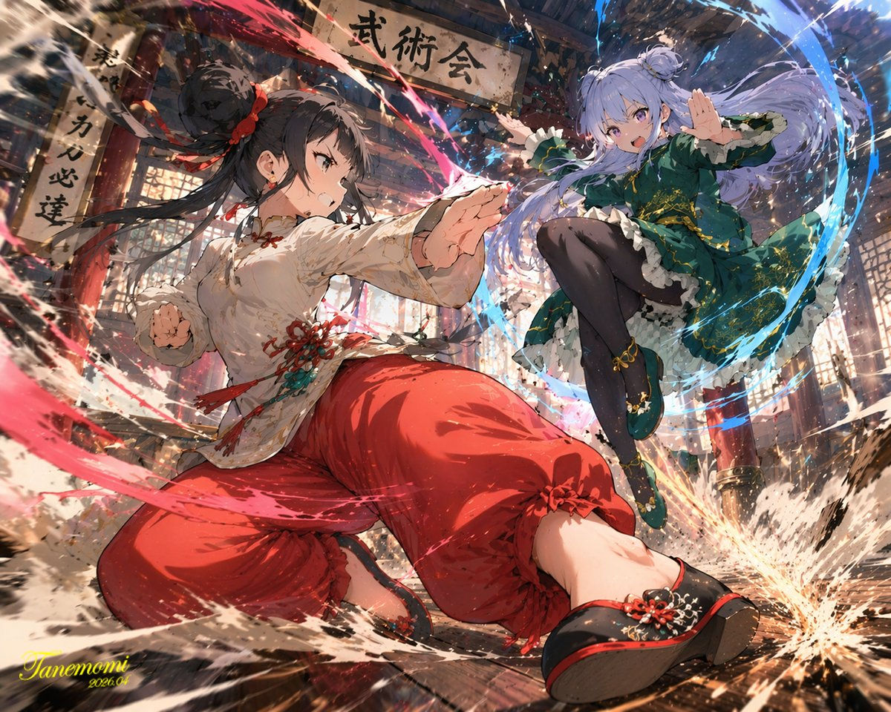

<details>
<summary>展开完整提示词</summary>

```text
An anime-style illustration of a {argument name="action type" default="high-impact martial arts battle"} between two young female fighters in a {argument name="setting" default="traditional wooden martial arts dojo"}. In the foreground, a girl with black hair in a high bun wears a {argument name="character 1 color theme" default="red and white"} Chinese-style martial arts outfit with baggy pants. She is in a dynamic, low, forward-thrusting stance, surrounded by swirling red energy and water splashes. In the background to the right, a girl with light purple hair in twin buns wears a {argument name="character 2 color theme" default="green and purple"} Chinese dress with gold embroidery and black tights. She is leaping through the air in a flying kick pose, surrounded by swirling blue energy. The wooden floorboards are splintering from the intense impact, with debris and dust flying through the air. Above them hangs a weathered wooden sign with the text "{argument name="sign text" default="武術会"}". The scene features dramatic lighting, a low-angle dynamic perspective, and intense action effects.
```

</details>

## 信息图可视化设计 · v1

- [信息图可视化设计 · v1](../cases/case-awesome-gpt-image-2-23-8ed19f97107c/v1.md) — awesome-gpt-image-2 \#23

原图文案例 · gpt-image

**缺少必要输入图：请先查看详情并补齐参考图**

原文指定 REFERENCE\_0 的平面矢量结构、平滑坡道改为石阶；现存图已是三维石阶结果，未见被要求保留结构的平面原图。通用主题可另作，但原样执行这一修改指令缺指定输入。 审核只涉及资料输入要求/资产角色，不包含重新生图、身份一致性或像素复现验证。

**输出示例图**

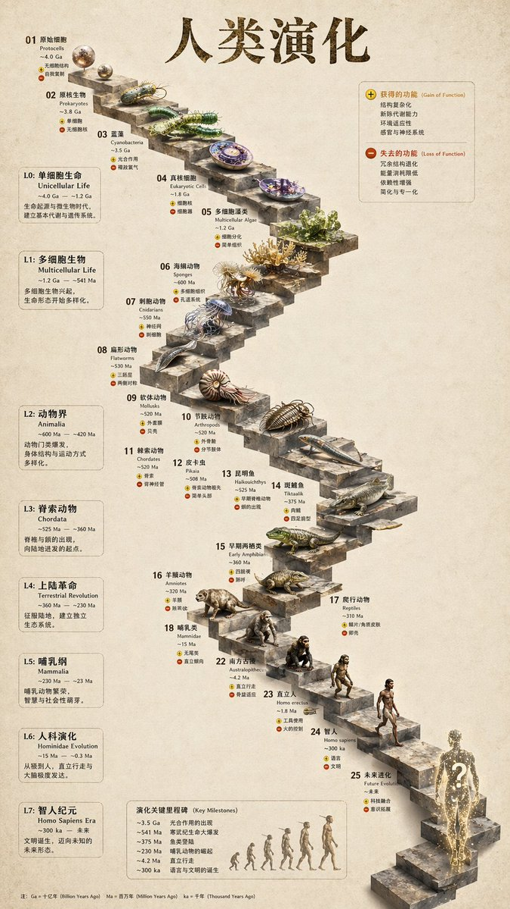

<details>
<summary>展开完整提示词</summary>

```text
{
  "type": "evolutionary timeline infographic",
  "instruction": "Using REFERENCE_0 as a structural base, transform the flat vector design into a highly realistic 3D infographic. Replace the smooth ramps with distinct stone steps and upgrade all organisms to photorealistic 3D models.",
  "style": {
    "background": "{argument name=\"background style\" default=\"vintage textured parchment paper\"}",
    "staircase": "{argument name=\"staircase material\" default=\"realistic textured stone blocks\"}",
    "subjects": "{argument name=\"organism style\" default=\"highly detailed photorealistic 3D renders\"}"
  },
  "layout": {
    "main_title": "{argument name=\"main title\" default=\"人类演化\"}",
    "sections": [
      {
        "position": "left sidebar",
        "count": 8,
        "labels": ["L0: 单细胞生命", "L1: 多细胞生物", "L2: 动物界", "L3: 脊索动物", "L4: 上陆革命", "L5: 哺乳纲", "L6: 人科演化", "L7: 智人纪元"]
      },
      {
        "position": "top right",
        "title": "获得的功能 / 失去的功能",
        "description": "Legend with plus and minus icons"
      },
      {
        "position": "bottom center",
        "title": "演化关键里程碑",
        "count": 6,
        "description": "Timeline with a silhouette graphic of 6 figures showing ape-to-human evolution"
      }
    ],
    "centerpiece": {
      "description": "Winding stone staircase with 25 numbered steps featuring specific organisms.",
      "count": 25,
      "notable_elements": [
        "Step 07: Jellyfish",
        "Step 09: Ammonite",
        "Step 10: Trilobite",
        "Step 24: Walking human",
        "Step 25: {argument name=\"future evolution concept\" default=\"glowing cosmic silhouette with a question mark\"}"
      ]
    }
  }
}
```

</details>

## 漫画分镜叙事设计 · v1

- [漫画分镜叙事设计 · v1](../cases/case-awesome-gpt-image-2-24-880c85c6f2e4/v1.md) — awesome-gpt-image-2 \#24

原图文案例 · gpt-image

**已记录补充核查结果；以详情中的输入要求为准**

已实际看图并阅读全文。紫发雷电将军cosplay两张自拍并排；活动和角色为文字参数，双图都是样例画面。 本次核对资料关系、图片角色和输入条件，不代表身份、事实或逐像素生成正确性验收。

**输出示例图**


<details>
<summary>展开完整提示词</summary>

```text
Genshin Impact {argument name="character" default="Raiden Shogun"} cosplay selfies at the {argument name="event" default="Shanghai Comic Con"}
```

</details>

## 综合应用场景图 · v1

- [综合应用场景图 · v1](../cases/case-awesome-gpt-image-2-25-6a36cee8c2fa/v1.md) — awesome-gpt-image-2 \#25

原图文案例 · gpt-image

**已记录补充核查结果；以详情中的输入要求为准**

已核对原文输入要求与当前示例图；这是通用可替换主体/照片/标志模板，实际执行须由使用者提供相应输入，未发现必须另补某一指定源文件的明确要求。 审核只涉及资料输入要求/资产角色，不包含重新生图、身份一致性或像素复现验证。

**输出示例图**


<details>
<summary>展开完整提示词</summary>

```text
create a minecraft skin inspired by {argument name="reference" default="my look"}
```

</details>

## 建筑空间场景图 · v1

- [建筑空间场景图 · v1](../cases/case-awesome-gpt-image-2-26-e1c7bf77e2bb/v1.md) — awesome-gpt-image-2 \#26

原图文案例 · gpt-image

**已记录补充核查结果；以详情中的输入要求为准**

实际查看：室内闪光灯照明的黑发女性肖像。已通读完整归档指令；图像为该创作方向的结果样例，文本未要求某张特定外部原图。含可替换主题、人物或参数，样例可采用不同填充值；不把通用占位符视为缺少指定图片。

**输出示例图**


<details>
<summary>展开完整提示词</summary>

```text
A vintage 35mm film photograph of a {argument name="subject description" default="young Asian woman"} with {argument name="hair style" default="long dark wavy hair and wispy bangs"}. She is wearing a {argument name="clothing" default="white ribbed tank top and a loose beige knit cardigan slipping off one shoulder"}, along with a delicate silver necklace. She has soft makeup with pink blush and glossy lips, looking directly at the camera with slightly parted lips. The lighting is harsh direct camera flash, creating a candid, amateur snapshot aesthetic. The background is a {argument name="setting" default="dimly lit, slightly messy room with clothes on a table and a wooden shelf"}. The image features heavy film grain, slightly muted colors, and a nostalgic, highly realistic photographic texture.
```

</details>

