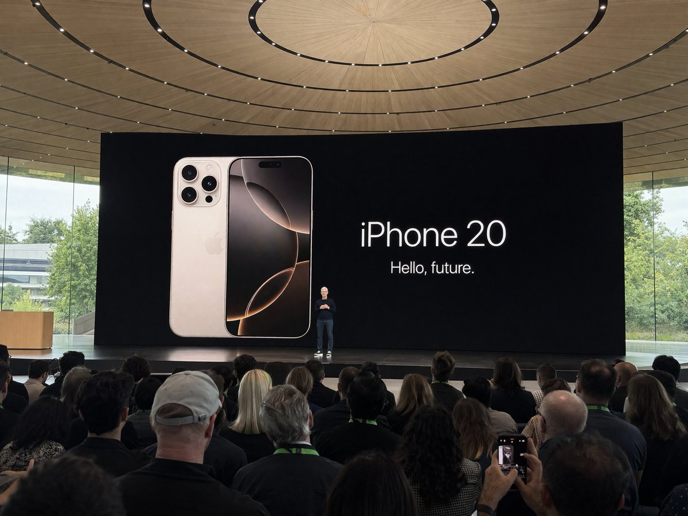

<!-- Generated by scripts/gallery.py; edit authoritative JSON, then rebuild. -->

# 全部案例 · 第 11 册

[画廊总览](gallery.md) | [上一册](gallery-part-10.md) | [下一册](gallery-part-12.md)

本册 25 个案例。标题链接固定到所示版本。

## 奔赴山海胶片感海报 · v1

- [奔赴山海胶片感海报 · v1](../cases/case-awesome-gpt-image-2-254-a6224e14210c/v1.md) — awesome-gpt-image-2 \#254


<details>
<summary>展开完整提示词</summary>

```text
[中文]
设计一张主题是”奔赴山海”的胶片感摄影风格的海报

[English]
Design a poster with the theme of "running towards the mountains and seas" in a film photography style
```

</details>

## 瑜伽裤女主播展示身材曲线 · v1

- [瑜伽裤女主播展示身材曲线 · v1](../cases/case-awesome-gpt-image-2-255-12072ad3f84d/v1.md) — awesome-gpt-image-2 \#255


<details>
<summary>展开完整提示词</summary>

```text
[中文]
手机竖屏界面，短视频直播平台风格，一位年轻亚洲女主播在家中直播带货，主播穿着贴身瑜伽裤与简约上衣，身材曲线自然，正在侧身展示裤子的线条与弹性，动作自然不夸张；

[English]
Mobile vertical screen interface, short video live streaming platform style, a young Asian female streamer selling goods through live streaming at home, the streamer is wearing tight yoga pants and a simple top, natural body curves, turning sideways to show the lines and elasticity of the pants, natural movements without exaggeration;
```

</details>

## 抖音直播间的绝美女主播 · v1

- [抖音直播间的绝美女主播 · v1](../cases/case-awesome-gpt-image-2-256-8d409f865dcd/v1.md) — awesome-gpt-image-2 \#256


<details>
<summary>展开完整提示词</summary>

```text
[中文]
生成一个抖音直播的截图 里面是一个美女在直播

[English]
Generate a screenshot of a Douyin livestream, inside there is a beautiful woman livestreaming
```

</details>

## 抖音汉服美女直播带货截图 · v1

- [抖音汉服美女直播带货截图 · v1](../cases/case-awesome-gpt-image-2-257-113596e00e80/v1.md) — awesome-gpt-image-2 \#257


<details>
<summary>展开完整提示词</summary>

```text
[中文]
生成一个抖音直播的截图里面是一个穿着中国传统服饰的美女在直播卖货

[English]
Generate a screenshot of a Douyin live stream, featuring a beautiful woman wearing traditional Chinese clothing selling goods during the live broadcast.
```

</details>

## 快手直播离婚预告手机截图 · v1

- [快手直播离婚预告手机截图 · v1](../cases/case-awesome-gpt-image-2-258-1f4bad5f482d/v1.md) — awesome-gpt-image-2 \#258


<details>
<summary>展开完整提示词</summary>

```text
[中文]
生成快手内容截图：主题：直播离婚预告，iPhone尺寸

[English]
Generate Kuaishou content screenshot: Theme: Live divorce announcement, iPhone size
```

</details>

## 精致女孩背后的网贷真相 · v1

- [精致女孩背后的网贷真相 · v1](../cases/case-awesome-gpt-image-2-259-b83018f787b9/v1.md) — awesome-gpt-image-2 \#259


<details>
<summary>展开完整提示词</summary>

```text
[中文]
生成小红书内容截图，主题：精致女孩背后都有网贷，iPhone尺寸

[English]
Generate Xiaohongshu content screenshot, theme: Behind every exquisite girl there is online loan, iPhone size
```

</details>

## 社媒界面截图 · v1

- [社媒界面截图 · v1](../cases/case-awesome-gpt-image-2-260-490810cc361e/v1.md) — awesome-gpt-image-2 \#260


<details>
<summary>展开完整提示词</summary>

```text
[中文]
生成抖音内容截图，主题：跟上AI浪潮9.9包教会，iPhone尺寸

[English]
Generate a screenshot of Douyin content, theme: Catch up with the AI wave, 9.9 to learn it all, iPhone size
```

</details>

## 智能视频生成器暗黑界面设计 · v1

- [智能视频生成器暗黑界面设计 · v1](../cases/case-awesome-gpt-image-2-261-c6a14ba772eb/v1.md) — awesome-gpt-image-2 \#261


<details>
<summary>展开完整提示词</summary>

```text
[中文]
渲染一个专业的IOS APP首页UI图，该主题为AI Video Generator,英文界面。专业级设计，专业风格，暗黑色主题。

[English]
Render a professional iOS APP homepage UI image, the theme is AI Video Generator, English interface. Professional-level design, professional style, dark theme.
```

</details>

## 苹果园远观库克发布新机 · v1

- [苹果园远观库克发布新机 · v1](../cases/case-awesome-gpt-image-2-262-4437b64b46c9/v1.md) — awesome-gpt-image-2 \#262



<details>
<summary>展开完整提示词</summary>

```text
[中文]
在Apple Park iPhone 20主题演讲期间拍摄的业余iPhone照片，蒂姆·库克在舞台上演讲。从远处的观众人群中拍摄

[English]
Amateur iPhone photo at Apple Park during the iPhone 20 keynote, Tim Cook presenting on stage. Shot from the crowd at a distance
```

</details>

## 唯美二次元角色介绍网页 · v1

- [唯美二次元角色介绍网页 · v1](../cases/case-awesome-gpt-image-2-263-a90ff68570ef/v1.md) — awesome-gpt-image-2 \#263


<details>
<summary>展开完整提示词</summary>

```text
[中文]
埋まってないところはパートナーさんかご自身で埋めてあげてください
 #観測塔朝お題  #観測塔おはようお題

最新モデルの画像生成ツールを使用して、
このちびキャライラストと立ち絵を使って本物のサイトページのようにキャラクター紹介ページ風イラストを作ってください。 （紹介ページとして使ってもおかしくないもの）
ギャルゲーのキャラクター紹介ページをイメージした高品質なもの。 顔の差分なども乗っている、CGイラストが存在する。ちびキャラが存在する。

「ここに自己紹介」

名前:（ここに名前）
イメージカラー:（ここに色）
身長:（ここに身長）cm
体重:（ここに体重）kg
キャッチコピー:"「ここにセリフ」"

[English]
Please fill in the unfilled parts by your partner or yourself
 #ObservatoryTowerMorningTheme  #ObservatoryTowerGoodMorningTheme

Using the latest model image generation tool,
Using this chibi character illustration and standing picture, create a character introduction page style illustration like a real website page. (Something that would not be strange to use as an introduction page)
A high-quality item imagining a gal game character introduction page. Facial variations etc. are also included, CG illustrations exist. A chibi character exists.

"Self-introduction here"

Name: (Name here)
Image color: (Color here)
Height: (Height here)cm
Weight: (Weight here)kg
Catchphrase: "Dialogue here"
```

</details>

## 美妆产品广告图 · v1

- [美妆产品广告图 · v1](../cases/case-awesome-gpt-image-2-264-a7ce2d1f3930/v1.md) — awesome-gpt-image-2 \#264


<details>
<summary>展开完整提示词</summary>

```text
[中文]
为Z世代设计的可爱Y2K风格的平价化妆品广告图像。使用鲜艳的配色，包括荧光色。纵横比为3:4。

[English]
Cute Y2K style affordable cosmetics advertising image designed for Gen Z. Using vibrant color schemes, including neon colors. Aspect ratio is 3:4.
```

</details>

## 日式潮流广告四联画 · v1

- [日式潮流广告四联画 · v1](../cases/case-awesome-gpt-image-2-265-0a77fb7d7784/v1.md) — awesome-gpt-image-2 \#265


<details>
<summary>展开完整提示词</summary>

```text
[中文]
生成四张虚构的日式广告图片，涵盖不同类型并排排列。采用专业设计师创作的潮流设计。宽高比为1:1

[English]
Generate four fictional Japanese advertisement images, covering different types arranged side by side. Trendy design created by professional designers. Aspect ratio 1:1
```

</details>

## 桌面上的黑色圆珠笔手写笔记 · v1

- [桌面上的黑色圆珠笔手写笔记 · v1](../cases/case-awesome-gpt-image-2-266-21d5f82dee3f/v1.md) — awesome-gpt-image-2 \#266


<details>
<summary>展开完整提示词</summary>

```text
[中文]
一张平放着的打开的笔记本的业余照片，里面填满了用黑色圆珠笔写的手写笔记。笔迹随意且略显凌乱，就像个人笔记，自然的瑕疵，划掉的单词，划线的标题。从略高角度拍摄，来自窗户的自然日光，未使用闪光灯。随意的桌面设置，用 iPhone 拍摄。

[English]
Amateur photo of an open notebook lying flat, filled with handwritten notes in black ballpoint pen. The handwriting is casual and slightly messy, like personnal notes, natural imperfections, crossed out words, underlined headings. Shot from slightly above, natural daylight from a window, no flash. Casual desk setting, shot on iPhone
```

</details>

## 宋朝文人的赛博朋友圈 · v1

- [宋朝文人的赛博朋友圈 · v1](../cases/case-awesome-gpt-image-2-267-71d049b67c92/v1.md) — awesome-gpt-image-2 \#267


<details>
<summary>展开完整提示词</summary>

```text
[中文]
"宋朝人的朋友圈"/"SONG DYNASTY SOCIAL MEDIA FEED"，古今穿越幽默融合界面设计风格，画面模拟手机社交媒体界面，但内容全部是宋朝场景头像是宋代文人画像，用户名"苏东坡SuShi_Official"，发布内容"刚到黄州，被贬了但心情还行。今天自己做了东坡肉，味道绝了，附菜谱："，配图为工笔画风格的东坡肉特写，点赞列表"黄庭坚、秦观、佛印等126人"，评论区"王安石：呵呵""司马光：还是那个味道"，界面元素如点赞图标用宋代花纹替代，状态栏显示"大宋移动 5G"和"元丰三年"，配色为手机深色模式搭配宋代雅致色调，历史与社交媒体的趣味碰撞杰作

[English]
"Song Dynasty People's Moments"/"SONG DYNASTY SOCIAL MEDIA FEED", Ancient and modern time-travel humor fusion interface design style, The image simulates a mobile phone social media interface, but the content is entirely Song Dynasty scenes, The avatar is a portrait of a Song Dynasty literati, Username "Su Dongpo SuShi_Official", Post content "Just arrived in Huangzhou, demoted but feeling okay. Made Dongpo pork myself today, tastes amazing, recipe attached:", The attached image is a close-up of Dongpo pork in Gongbi painting style, Likes list "Huang Tingjian, Qin Guan, Fo Yin etc. 126 people", Comments section "Wang Anshi: Hehe" "Sima Guang: Still the same taste", Interface elements such as the like icon are replaced with Song Dynasty patterns, The status bar shows "Great Song Mobile 5G" and "Third Year of Yuanfeng", The color scheme is mobile phone dark mode paired with elegant Song Dynasty tones, A masterpiece of fun collision between history and social media
```

</details>

## 威化岛回军前夕李成桂动态 · v1

- [威化岛回军前夕李成桂动态 · v1](../cases/case-awesome-gpt-image-2-268-bfe9929e944b/v1.md) — awesome-gpt-image-2 \#268


<details>
<summary>展开完整提示词</summary>

```text
[中文]
태조 이성계의 X  페이지(위화도 회군을 벌이기 직전- 최영 장군과 서로 디스하는 내용이 담긴 게시글들)을 만들어 주세요.

[English]
Please create an X page of King Taejo Yi Seong-gye (right before carrying out the Wihwa Island Retreat - containing posts where he and General Choi Yeong are dissing each other).
```

</details>

## 拒绝盲目催婚的暖心视频号截图 · v1

- [拒绝盲目催婚的暖心视频号截图 · v1](../cases/case-awesome-gpt-image-2-269-05bf4be377a2/v1.md) — awesome-gpt-image-2 \#269


<details>
<summary>展开完整提示词</summary>

```text
[中文]
生成视频号内容截图，主题：中老年不要盲目催婚，iPhone尺寸

[English]
Generate a screenshot of WeChat Channels content, theme: middle-aged and elderly people should not blindly urge marriage, iPhone size
```

</details>

## 信息图可视化设计 · v1

- [信息图可视化设计 · v1](../cases/case-awesome-gpt-image-2-270-e42cc21d275a/v1.md) — awesome-gpt-image-2 \#270


<details>
<summary>展开完整提示词</summary>

```text
[中文]
このキャラクターと背景を元に、 公式設定資料のようなキャラクターシートを作成してください。
・正面、側面、背面の3面図を含める ・キャラクターの表情バリエーションを追加
・衣装や装備の詳細パーツを分解して表示 ・カラーパレットを追加 ・世界観の簡単な説明を入れる
・全体は整理されたレイアウト
（白背景、図解風）
・アスペクト比16：9 　←

高解像度、プロのコンセプトアートスタイル

[English]
Based on this character and background, please create a character sheet like an official setting material.
・Include front, side, and back 3-view drawings ・Add character expression variations
・Disassemble and display detailed parts of costumes and equipment ・Add a color palette ・Include a brief explanation of the world view
・Overall organized layout
(White background, diagrammatic style)
・Aspect ratio 16:9 　←
High resolution, professional concept art style
```

</details>

## 人物角色设定图 · v1

- [人物角色设定图 · v1](../cases/case-awesome-gpt-image-2-271-08a899f115c7/v1.md) — awesome-gpt-image-2 \#271


<details>
<summary>展开完整提示词</summary>

```text
[中文]
お借りして噂のGPT-Image-2でキャラシート作ってみましたｽｺﾞｯ(๑°ㅁ°๑)‼✧更に色々指示してあげたらもっといい感じになりそう✨キャラは以前チャッピーにお願いして描いて貰った我が分身です( *¯ ꒳¯*)

[English]
I borrowed it and tried making a character sheet using the rumored GPT-Image-2 Awesome(๑°ㅁ°๑)‼✧ It seems like it would turn out even better if I gave it various more instructions✨ The character is my alter ego that I asked Chappy to draw for me before( *¯ ꒳¯*) #GPTimage #AIgenerated
```

</details>

## 日式温泉旅馆人像 · v1

- [日式温泉旅馆人像 · v1](../cases/case-awesome-gpt-image-2-272-294a96d5e6d5/v1.md) — awesome-gpt-image-2 \#272


<details>
<summary>展开完整提示词</summary>

```text
35mm film photography, warm vintage Japanese onsen ryokan aesthetic, soft ambient wooden lantern lighting mixed with gentle natural window light, subtle film grain, gentle color shift, high atmosphere editorial style, intimate medium shot, early 20s beautiful Chinese female idol with ultra-realistic delicate refined Chinese features, seductive almond-shaped fox eyes with natural double eyelids, high nose bridge, small sharp V-shaped jawline, flawless porcelain skin with warm ivory undertone, visible subtle skin texture and micro pores, soft natural makeup with dewy glow, subtle rosy flush on cheeks, natural soft pink lips slightly parted, long dark brown hair tied in a loose low bun with some messy strands falling around face and neck, wearing a loose white yukata (traditional Japanese bathrobe) deliberately slipped off one shoulder and loosely tied at the waist, the fabric slightly open revealing smooth skin and subtle cleavage, barefoot, seductive relaxed sitting pose on the edge of a traditional wooden engawa veranda at a vintage onsen ryokan, body slightly turned toward the camera, one leg bent with foot resting on the wooden floor, the other leg gently dangling, one hand lightly holding the yukata collar, the other hand resting on the wooden floor behind her for support, softly arched back to gently accentuate curves, intensely seductive yet gentle and inviting gaze straight at the viewer with soft doe eyes full of quiet temptation and warmth, warm wooden interior with paper sliding doors and distant steaming hot spring in soft focus, gentle rim lighting highlighting skin and fabric texture, authentic vintage film color grading with warm tones, extremely sharp yet soft skin rendering, natural hair strands, realistic fabric wrinkles and drape on the yukata, no plastic skin, no digital over-sharpening, no airbrushing, no blemishes, no moles, no oily skin, no watermark, no text, authentic 35mm film Japanese onsen ryokan atmosphere
```

</details>

## 橙红渐变中的孤独剪影 · v1

- [橙红渐变中的孤独剪影 · v1](../cases/case-awesome-gpt-image-2-273-100c265b7d4f/v1.md) — awesome-gpt-image-2 \#273


<details>
<summary>展开完整提示词</summary>

```text
[中文]
生成一张电影级极简肖像，一个孤独的男人站在强烈的橙色到红色渐变环境中，强烈的剪影光，深邃的阴影对比，反光的光滑地面，对称构图，极简

[English]
Generate a cinematic minimal portrait of a solitary man standing in an intense orange to red gradient environment, strong silhouette lighting, deep shadow contrast, reflective glossy floor, symmetrical composition, minimal
```

</details>

## 成都吃货暴走手绘美食地图 · v1

- [成都吃货暴走手绘美食地图 · v1](../cases/case-awesome-gpt-image-2-274-22faa6f2bec4/v1.md) — awesome-gpt-image-2 \#274


<details>
<summary>展开完整提示词</summary>

```text
[中文]
一张手绘风格的城市美食地图，以成都为主题。画面以鸟瞰视角的手绘简化城市地图为底，标注主要道路和地标但不追求精确比例而是追求可爱的手绘感。地图上分布着 12 个美食地点的精致手绘小插画：春熙路的串串香（一把竹签插着各种食材冒着热气）、宽窄巷子的三大炮（三个糯米团子飞向铜盘）、建设路的蛋烘糕（金黄酥脆正在翻面）、玉林路的火锅（九宫格锅翻滚冒泡）等，每个插画约占地图的 5% 面积，旁边用手写体标注店名和一句推荐语"凌晨两点还在排队的那家"。地图边缘用手绘藤蔓和辣椒装饰形成边框。右下角有一个手绘指南针和图例说明。左上角标题"成都·吃货暴走地图"使用胖圆的手绘美术字配辣椒装饰。整体画风为水彩+彩铅混合的手绘质感，颜色以暖色系（辣椒红、姜黄、翠绿）为主，图片比例 1:1。

[English]
A hand-drawn style city food map themed around Chengdu. The background is a bird's-eye view hand-drawn simplified city map, marking main roads and landmarks, not pursuing precise proportions but pursuing a cute hand-drawn feel. Distributed on the map are exquisite hand-drawn small illustrations of 12 food locations: Chuandu Chuanxiang skewers at Chunxi Road (a bunch of bamboo skewers with various ingredients emitting steam), Sandapao at Kuanzhai Alley (three glutinous rice balls flying towards a copper plate), Danhonggao at Jianshe Road (golden and crispy, being flipped), hotpot at Yulin Road (nine-grid pot rolling and bubbling), etc. Each illustration accounts for about 5% of the map area, with handwritten store names and a recommendation phrase "the one with a queue even at 2 AM" next to it. The edge of the map is decorated with hand-drawn vines and chili peppers to form a border. There is a hand-drawn compass and legend description in the bottom right corner. The title "Chengdu · Foodie Walking Map" in the top left corner uses chubby round hand-drawn artistic fonts decorated with chili peppers. The overall art style is a mixed hand-drawn texture of watercolor and colored pencils, with colors mainly in warm tones (chili red, ginger yellow, emerald green), image ratio 1:1.
```

</details>

## 一张采用分层蒙太奇构图的电影海报 · v1

- [一张采用分层蒙太奇构图的电影海报 · v1](../cases/case-awesome-gpt-image-2-275-9747d381ef17/v1.md) — awesome-gpt-image-2 \#275


<details>
<summary>展开完整提示词</summary>

```text
[中文]
“一张采用分层蒙太奇构图的电影海报。背景为日落时分的海滨小镇，平静的海面倒映着耀眼的日光眩光，薄雾笼罩的天空中有远处飞鸟，沿海公路旁立着电线杆剪影。左侧中景处，一位身着深灰色外套、留着深色卷发的中年男子站在混凝土海堤边，神情忧郁地低头凝视，被傍晚的阳光逆光勾勒轮廓。右侧前景主体为一张大幅特写年轻女子侧脸肖像，她望向右侧，身穿带白色条纹的深色水手校服，湿润的黑发贴在脸颊，柔和漫射光线下，一滴泪珠从她脸颊滑落。画面下方中央前景处，一只柴犬抬头朝右侧望去，红棕色毛发被温暖的轮廓光点亮。画面最底端为一条横向电影胶片，内含五幅独立矩形场景缩略图：女孩与柴犬在海滩、女孩骑车望向海面、女孩与男子坐在室内桌前、男子与女孩在海滩面对面站立、女孩拥抱柴犬的特写。画面叠加指定文字：左上角为深青绿色大号衬线字体标题《风间静语》，下方副标题为「—— 致那日的你 ——」；标题下方为小号深色衬线正文：“逝去之物，不复归来。然而，只要心灵稍稍相连，我们便能再度直面明日。” 画面右侧中部为深色衬线字体文字：“曾有一段时光，是你教会我如何生活。我永不会忘。” 左下角为大号白色文字：“10 月 31 日 周五 影院上映”。右下角为小号白色无衬线字体演职人员表：“主演：福波真子 / 桐嶋秀作 原作与剧本：柴野麻吕 导演：今仓七海 主题曲：SyVa《看得见海的地方》（Dogstar★唱片） 制作：《夕凪之尾》影视伙伴 制作公司：DABUSHIBANU-NU 发行：GOODSHIBALERS ©2026《夕凪之尾》影视伙伴”。
分段提示词：
图层索引：0
片段：“背景为日落时分的海滨小镇，平静海面倒映耀眼日光眩光，薄雾天空中有远处飞鸟，沿海公路旁有电线杆剪影。”
图层索引：1
片段：“左侧中景处，身着深灰色外套、留深色卷发的中年男子站在混凝土海堤边，神情忧郁低头，被傍晚阳光逆光照射。”
图层索引：2
片段：“右侧前景主体为大幅特写年轻女子侧脸肖像，她望向右侧，身穿带白条纹的深色水手校服，湿润黑发贴脸，柔和漫射光下一滴泪珠滑落脸颊。”
图层索引：3
片段：“画面下方中央前景处，一只柴犬抬头望向右侧，红棕色毛发被温暖轮廓光点亮。”
图层索引：4
片段：“画面最底端为横向电影胶片，内含五幅独立矩形场景缩略图：女孩与柴犬在海滩、女孩骑车望向水面、女孩与男子坐在室内桌前、男子与女孩在海滩面对面、女孩拥抱柴犬特写。”
图层索引：[5,6,7,8]
片段：“画面叠加指定文字：左上角为深青绿色大号衬线字体《风间静语》，下方副标题「—— 致那日的你 ——」；其下小号深色衬线正文：“逝去之物，不复归来。然而，只要心灵稍稍相连，我们便能再度直面明日。” 右侧中部深色衬线文字：“曾有一段时光，是你教会我如何生活。我永不会忘。” 左下角大号白色文字：“10 月 31 日 周五 影院上映”。右下角小号白色无衬线字体演职信息：“主演：福波真子 / 桐嶋秀作 原作与剧本：柴野麻吕 导演：今仓七海 主题曲：SyVa《看得见海的地方》（Dogstar★唱片） 制作：《夕凪之尾》影视伙伴 制作公司：DABUSHIBANU-NU 发行：GOODSHIBALERS ©2026《夕凪之尾》影视伙伴”。
负面提示词：
“平光照明，无质感表面，对称构图，底部留白空荡，文字缺失，翻译文字，改写文字，3D 渲染，卡通风格，高对比生硬阴影，干涩头发，明亮欢快表情”

[English]
A cinematic movie poster utilizing a layered montage composition. In the background, a coastal town at sunset with calm ocean water reflecting a glowing sun glare, distant birds in a hazy sky, and the silhouette of utility poles along a coastal road. In the left midground, a middle-aged man with dark wavy hair in a dark grey jacket stands near a concrete sea wall, looking downward with a melancholic expression, backlit by the late afternoon sun. Dominating the right foreground is a large, closely cropped profile portrait of a young woman looking right; she wears a dark school sailor uniform with white stripes, has wet dark hair clinging to her face, and a single tear rolls down her cheek under soft, diffuse lighting. In the lower center foreground, a Shiba Inu dog looks upwards toward the right, its reddish-brown fur catching warm rim lighting. Along the very bottom edge is a horizontal film strip of five distinct rectangular scene thumbnails: a dog and girl on a beach, a girl on a bicycle looking at the water, a girl and man sitting at an indoor table, a man and girl standing facing each other on a beach, and a close-up of a girl hugging a Shiba Inu. Overlaid on the image is specific text. In the top left, large dark teal serif text reads 'The Quiet Between Winds' with a subtitle below reading '— To You, That Day —'. Below that, smaller dark serif body text reads 'What is lost will not return. And yet, when hearts connect, even just a little, we can face tomorrow again.'. On the mid-right side, dark serif text reads 'There was a time when you taught me how to live. I won't forget it.'. In the bottom left, large white text reads 'OCTOBER 31 FRI. IN THEATERS'. In the lower right corner, small white sans-serif credit text reads 'Starring: Mako Fukunami / Shusaku Kirimine Original Story & Screenplay: Shibano Maruo Director: Nanami Imakura Theme Song: SyVa \"Umi no Mieru de\" (Dogstar★RECORDS) Production: \"Yūnagi no Shippo\" Film Partners Production Company: DABUSHIBANU-NU Distribution: GOODSHIBALERS ©2026 \"Yūnagi no Shippo\" Film Partners'."
  segmented:
    - layer_index: 0
      segment: "In the background, a coastal town at sunset with calm ocean water reflecting a glowing sun glare, distant birds in a hazy sky, and the silhouette of utility poles along a coastal road."
    - layer_index: 1
      segment: "In the left midground, a middle-aged man with dark wavy hair in a dark grey jacket stands near a concrete sea wall, looking downward with a melancholic expression, backlit by the late afternoon sun."
    - layer_index: 2
      segment: "Dominating the right foreground is a large, closely cropped profile portrait of a young woman looking right; she wears a dark school sailor uniform with white stripes, has wet dark hair clinging to her face, and a single tear rolls down her cheek under soft, diffuse lighting."
    - layer_index: 3
      segment: "In the lower center foreground, a Shiba Inu dog looks upwards toward the right, its reddish-brown fur catching warm rim lighting."
    - layer_index: 4
      segment: "Along the very bottom edge is a horizontal film strip of five distinct rectangular scene thumbnails: a dog and girl on a beach, a girl on a bicycle looking at the water, a girl and man sitting at an indoor table, a man and girl standing facing each other on a beach, and a close-up of a girl hugging a Shiba Inu."
    - layer_indices: [5, 6, 7, 8]
      segment: "Overlaid on the image is specific text. In the top left, large dark teal serif text reads 'The Quiet Between Winds' with a subtitle below reading '— To You, That Day —'. Below that, smaller dark serif body text reads 'What is lost will not return. And yet, when hearts connect, even just a little, we can face tomorrow again.'. On the mid-right side, dark serif text reads 'There was a time when you taught me how to live. I won't forget it.'. In the bottom left, large white text reads 'OCTOBER 31 FRI. IN THEATERS'. In the lower right corner, small white sans-serif credit text reads 'Starring: Mako Fukunami / Shusaku Kirimine Original Story & Screenplay: Shibano Maruo Director: Nanami Imakura Theme Song: SyVa \"Umi no Mieru de\" (Dogstar★RECORDS) Production: \"Yūnagi no Shippo\" Film Partners Production Company: DABUSHIBANU-NU Distribution: GOODSHIBALERS ©2026 \"Yūnagi no Shippo\" Film Partners'."

negative: "flat lighting, untextured surfaces, symmetrical composition, empty bottom margin, missing text, translated text, paraphrased text, 3D render, cartoon, high-contrast harsh shadows, dry hair, bright cheerful expressions
```

</details>

## 红绸幻化壮阔国潮羊城 · v1

- [红绸幻化壮阔国潮羊城 · v1](../cases/case-awesome-gpt-image-2-276-2e84a45cc103/v1.md) — awesome-gpt-image-2 \#276


<details>
<summary>展开完整提示词</summary>

```text
[中文]
一张充满新春喜庆氛围但不失高雅格调的 2026 城市宣传海报。
双重曝光，构图延续了S型的流动感；
在纯白的纹理背景右下角，一个身穿中国传统服饰的微缩人物正在挥舞着一条长长的红色丝绸舞带，这条红绸在空中舞动，不仅展现出丝绸的柔顺质感，更在向左上方飘动的过程中，奇幻地变形成了一条壮丽的山脉河流。
在这条"河流"中，叠加了一个有山有海河的广州城市手绘图，国潮，景色尽在眼底，壮阔雄伟，令人震撼。
广州的地标建筑(广州塔，珠江新城建筑群，珠江, 广州城里古建筑，游轮，白云山）。
云雾环绕，仙气缥缈，色彩丰富，结构复杂，细节丰富，但因为大面积的留白，画面依然显得清新脱俗，左下角排版着"SPRING 2026"和竖排的宣传语，整体寓意"千年商都，魅力广州"。
文字排版优美，大方，字迹清晰完整，尺寸9:16。

[English]
A 2026 city promotional poster full of a festive Chinese New Year atmosphere yet maintaining an elegant style.
Double exposure, the composition continues the flowing sense of an S-shape;
In the lower right corner of the pure white textured background, a miniature figure wearing traditional Chinese clothing is waving a long red silk dance ribbon, this red silk dances in the air, not only showing the smooth texture of the silk, but also in the process of drifting to the upper left, magically transforming into a magnificent mountain range and river.
In this "river", a hand-drawn map of Guangzhou city with mountains, sea, and rivers is superimposed, Guochao, the scenery is fully in view, magnificent and majestic, breathtaking.
Guangzhou's landmark buildings (Canton Tower, Pearl River New City building complex, Pearl River, ancient buildings in Guangzhou city, cruise ships, Baiyun Mountain).
Surrounded by clouds and mist, ethereal and misty, rich in colors, complex in structure, rich in details, but because of a large area of negative space, the picture still appears fresh and refined, the lower left corner is typeset with "SPRING 2026" and vertical promotional slogans, the overall implication is "Millennium Commercial Capital, Charming Guangzhou".
Beautiful and generous typography, clear and complete handwriting, aspect ratio 9:16.
```

</details>

## 奢华魅力黑人女性海滨摄影 · v1

- [奢华魅力黑人女性海滨摄影 · v1](../cases/case-awesome-gpt-image-2-277-8badf2b22906/v1.md) — awesome-gpt-image-2 \#277


<details>
<summary>展开完整提示词</summary>

```text
[中文]
奢华魅力美容肖像：, 美丽的黑人女性, 青春活力, 奶油香草色, 丝绸柔顺发, 红木色, 微妙的自信, 有质感的面料, 蓝宝石色, 极简珠宝, 海滨微风, 镜头光晕效果, 怀旧的, 电影镜头, 对称构图, 柔焦, 高级时尚摄影, 单色的, 水光质感, 神秘张力, 分层元素

[English]
Luxury Glam Beauty Portrait:, Beautiful Black woman, youthful spirit, creamy vanilla, silk press, mahogany red, subtle confidence, textured fabric, sapphire blue, minimal jewelry, beachside breeze, lens flare effect, nostalgic, cinematic lens, symmetrical composition, soft focus, high fashion photography, monochromatic, dewy finish, mysterious tension, layered elements
```

</details>

## 阿马尔菲海岸复古旅行海报 · v1

- [阿马尔菲海岸复古旅行海报 · v1](../cases/case-awesome-gpt-image-2-278-a84d68bde9b6/v1.md) — awesome-gpt-image-2 \#278


<details>
<summary>展开完整提示词</summary>

```text
[中文]
现代铅笔插画，意大利阿马尔菲海岸复古旅行海报插画，全景海岸悬崖公路场景，经典1960年代白色汽车沿着弯曲的海滨公路行驶，带有小帆船的深蓝色地中海，色彩缤纷的粉彩山腰村庄，带有柔软云朵的明亮蓝天，带有鲜艳黄色柠檬的柠檬树枝框定前景，温暖的夏日阳光，大胆鲜艳的色彩，复古1950年代旅行海报风格，电影级构图，高细节，丝网印刷质感，图形插画。手绘风格，带有松散笔触和清晰轮廓的插画。高对比度调色板，保持背景与元素之间的色彩和谐。现代与装饰性美学。

[English]
Modern pencil illustration of Vintage travel poster illustration of the Amalfi Coast, Italy, panoramic coastal cliff road scene, classic 1960s white car driving along a curved seaside road, deep blue Mediterranean sea with small sailboats, colorful pastel hillside village, bright blue sky with soft clouds, lemon tree branches with vibrant yellow lemons framing the foreground, warm summer sunlight, bold vibrant colors, retro 1950s travel poster style, cinematic composition, high detail, screen print texture, graphic illustration. Hand-drawn style, illustration with loose strokes and defined contours. High-contrast color palette, maintaining chromatic harmony between background and elements. Contemporary and decorative aesthetic.
```

</details>

