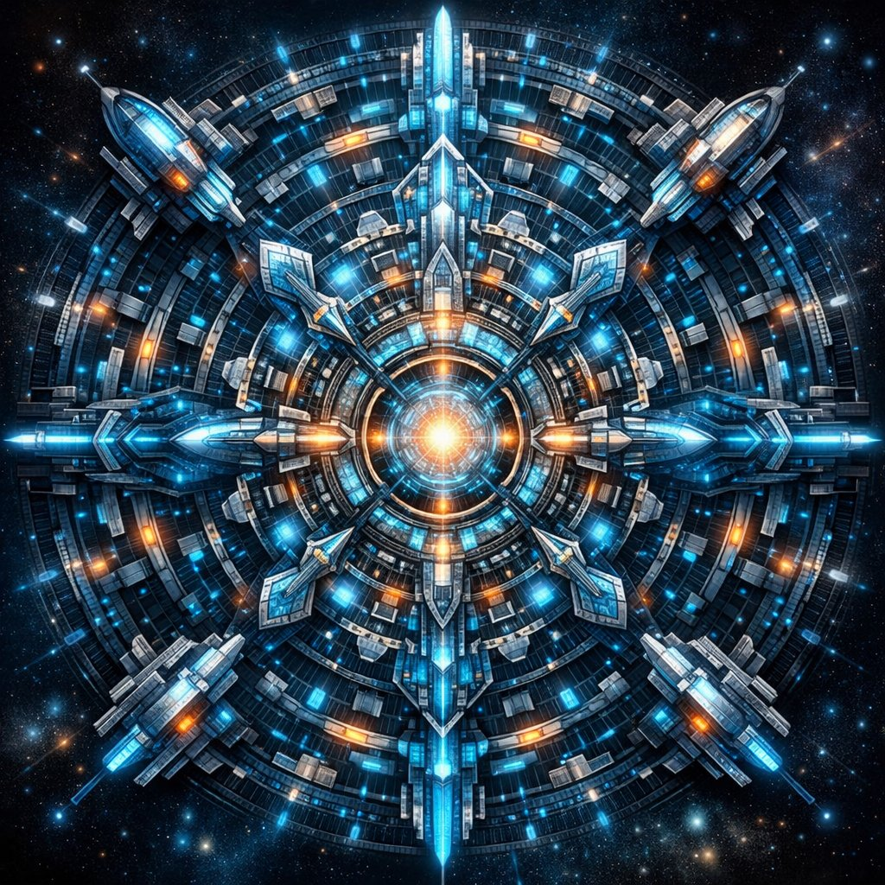
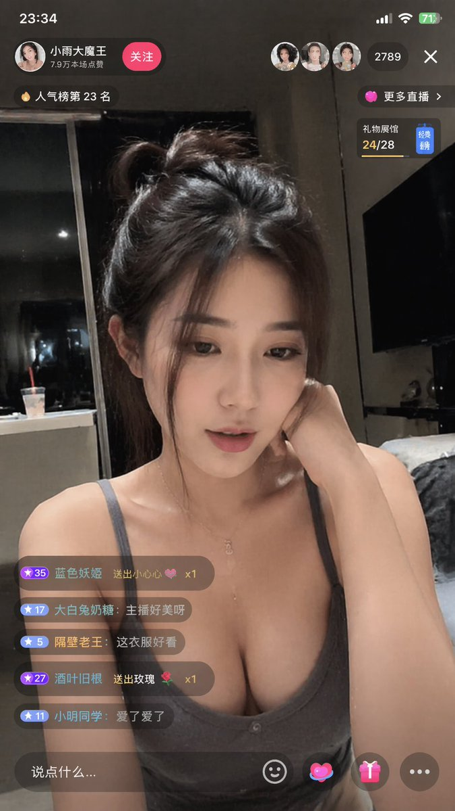
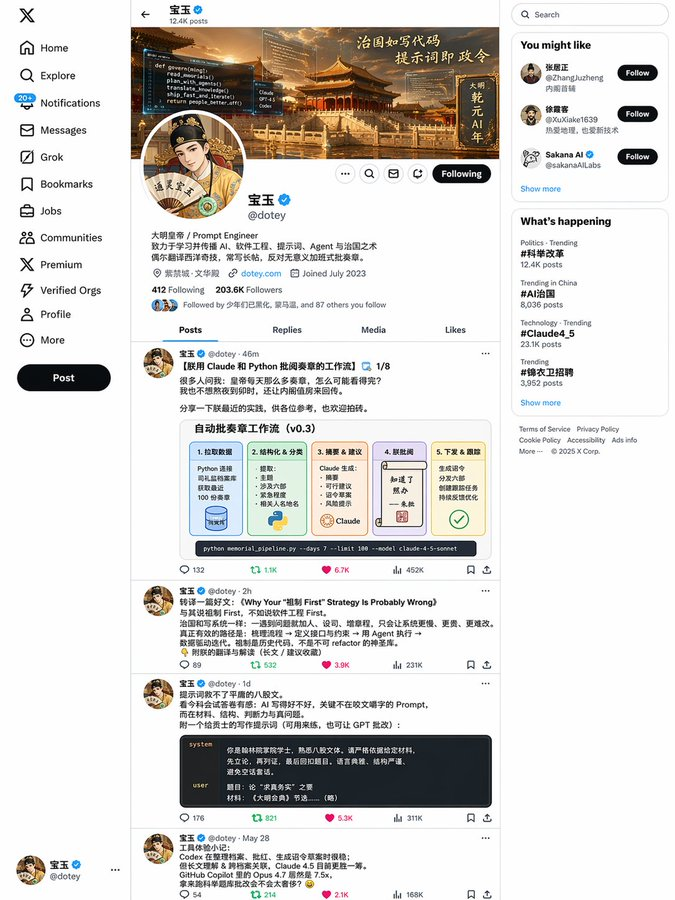
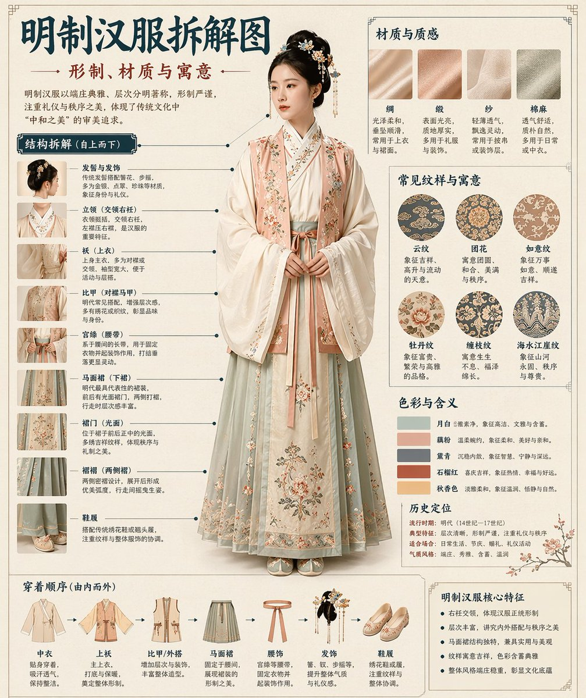

<!-- Generated by scripts/gallery.py; edit authoritative JSON, then rebuild. -->

# 全部资料 · 第 12 册

[画廊总览](gallery.md) | [上一册](gallery-part-11.md) | [下一册](gallery-part-13.md)

本册 25 条资料。标题链接固定到所示版本。

## 裂痕里的水墨东方山水画卷 · v1

- [裂痕里的水墨东方山水画卷 · v1](../cases/case-awesome-gpt-image-2-279-01dc80f65966/v1.md) — awesome-gpt-image-2 \#279

原图文案例 · gpt-image

**已记录补充核查结果；以详情中的输入要求为准**

已实际看图并阅读全文。撕纸S形裂口内河流山水建筑；完整文本给出纸艺和文字，无附图。 本次核对资料关系、图片角色和输入条件，不代表身份、事实或逐像素生成正确性验收。

**输出示例图**


<details>
<summary>展开完整提示词</summary>

```text
[中文]
极简新中式美学风格，画面以淡雅的灰白色为底，呈现出一种纸艺剪影般的立体感。
一条S形蜿蜒的裂痕状边缘将画面分割，仿佛撕开了一层纸面，露出内部色彩斑斓的东方山水景象。
裂口内，一条蜿蜒的河流自上而下贯穿整个构图，河水以深浅不一的蓝色渲染，层次分明，仿佛流动的丝带。
河岸两侧点缀着青翠的山丘与梯田，色彩柔和，绿红交织，展现出田园的宁静之美。
沿河而建的古风建筑错落有致，飞檐翘角，白墙黛瓦，在光影的映衬下更显古朴典雅。
岸边树木葱茏，枝叶轻盈，一艘小船静泊于水中央，增添了几分悠然意境。
整体构图呈S形曲线，富有韵律感，仿佛自然与人文的和谐共生。
画作边缘采用撕纸效果，营造出立体浮雕般的视觉体验。
下方题字"东方美学"以黑色楷体书写，日期"2026/04/18"与红色印章相呼应，底部"CHINA"字样庄重醒目，署名"@LIYUE"低调收尾，整体氛围静谧深远，充满诗意与哲思。

[English]
Minimalist neo-Chinese aesthetic style, the picture uses an elegant grayish-white as the background, presenting a three-dimensional sense like paper art silhouettes. A winding S-shaped crack-like edge divides the picture, as if tearing open a layer of paper, revealing the colorful oriental landscape scene inside. Inside the crack, a winding river runs through the entire composition from top to bottom, the river water is rendered in different shades of blue, with clear layers, like a flowing ribbon. Both sides of the riverbank are dotted with verdant hills and terraced fields, the colors are soft, green and red interwoven, showing the tranquil beauty of the pastoral. Ancient-style buildings built along the river are well-proportioned, with flying eaves and upturned corners, white walls and black tiles, appearing more quaint and elegant against the light and shadow. The trees on the bank are lush, the branches and leaves are light and graceful, a small boat is quietly moored in the middle of the water, adding a bit of leisurely artistic conception. The overall composition presents an S-shaped curve, full of rhythm, as if the harmonious coexistence of nature and humanity. The edges of the painting adopt a torn paper effect, creating a visual experience like a three-dimensional relief. The inscription "东方美学" at the bottom is written in black regular script, the date "2026/04/18" echoes with the red seal, the word "CHINA" at the bottom is solemn and eye-catching, and the signature "@LIYUE" ends in a low-key way. The overall atmosphere is quiet and profound, full of poetry and philosophical thinking.
```

</details>

## 封面排版设计图 · v1

- [封面排版设计图 · v1](../cases/case-awesome-gpt-image-2-280-607207747466/v1.md) — awesome-gpt-image-2 \#280

原图文案例 · gpt-image

**已记录补充核查结果；以详情中的输入要求为准**

实际查看：AI builder人物、机器人、代码及箭头的涂鸦。已通读完整归档指令；图像为该创作方向的结果样例，文本未要求某张特定外部原图。

**输出示例图**


<details>
<summary>展开完整提示词</summary>

```text
[中文]
以涂鸦速写风表现【一个厉害的AI builder】，整体呈现快速勾勒、自由变形、即兴手绘与草稿式的视觉效果。线条随手、夸张、可粗细不一，略显凌乱但具有节奏和表现力，强调概括、夸张、趣味和随性，而不是严谨写实或精细刻画。  颜色采用粗糙、干刷感明显的块面表现，可保留不均匀的涂抹痕迹、刷痕、飞白与覆盖感，色彩根据【主题/主体】自动适配，但整体保持涂鸦式、速写式、概括式的表达。不要透明水彩晕染效果，不要细腻水彩过渡，不要纸纹理，不要柔和雾化，不要梦幻质感。  背景以留白为主，保持简洁、轻松、未完成感和设计感，可加入少量辅助性符号、箭头、记号、圈画、重复线、随手写的文字或其他涂鸦元素，以增强速写本或随笔式视觉语言，但不可过于拥挤，不可破坏主体和留白气质。  画面内容不需要预先写清楚，由【一个厉害的AI builder】自动推演并生成最适合的主体形象、动作、相关元素、符号或简化场景，整体保持统一的涂鸦速写风和夸张概括的表现方式，避免复杂写实背景和过度铺陈。 画面中需自然加入专属签名"BlanPlan"，作为画面的一部分，位置低调但清晰，可放在左下角、右下角或标题附近，风格需与整体版式统一，像作品署名或设计落款；签名字体精致、克制、高级，不可过大，不可破坏主体构图，不可显得突兀或廉价。

[English]
Express [an awesome AI builder] in a graffiti sketch style, overall presenting a visual effect of quick sketching, free deformation, impromptu hand-drawing and draft-like. The lines are casual, exaggerated, and can vary in thickness, slightly messy but with rhythm and expressiveness, emphasizing summarization, exaggeration, fun and casualness, rather than rigorous realism or fine depiction. The colors use rough blocks with obvious dry brush feel, retaining uneven smearing traces, brush strokes, flying white and covering feel, the colors automatically adapt according to [theme/subject], but overall maintain a graffiti-style, sketch-style, and summarized expression. Do not use transparent watercolor smudging effects, do not use delicate watercolor transitions, do not use paper texture, do not use soft atomization, do not use dreamy texture. The background is mainly blank, keeping it simple, relaxed, unfinished and designed, can add a small amount of auxiliary symbols, arrows, marks, circled drawings, repeated lines, casually written text or other graffiti elements, to enhance the sketchbook or essay-style visual language, but it must not be too crowded, and must not destroy the subject and blank temperament. The picture content does not need to be written clearly in advance; [an awesome AI builder] automatically deduces and generates the most suitable subject image, movements, related elements, symbols or simplified scenes, overall maintaining a unified graffiti sketch style and exaggerated summarized expression method, avoiding complex realistic backgrounds and excessive padding. The exclusive signature "BlanPlan" needs to be naturally added into the picture as a part of the picture, the position is low-key but clear, can be placed in the bottom left corner, bottom right corner or near the title, the style needs to be unified with the overall layout, like an artwork signature or design sign-off; the signature font is exquisite, restrained, and high-end, must not be too large, must not destroy the subject composition, must not appear abrupt or cheap.
```

</details>

## 赛博朋克科幻曼荼罗 · v1

- [赛博朋克科幻曼荼罗 · v1](../cases/case-awesome-gpt-image-2-281-6299893a5988/v1.md) — awesome-gpt-image-2 \#281

原图文案例 · gpt-image

**已记录补充核查结果；以详情中的输入要求为准**

原文包含“Draw a near-future sci-fi version of a mandala”独立提示词，同时模型版本表述为 might be；版本仍未知，不把比较说明当确定模型证据。 审核只涉及资料输入要求/资产角色，不包含重新生图、身份一致性或像素复现验证。

**输出示例图**



<details>
<summary>展开完整提示词</summary>

```text
[中文]
でChatGPTで画像を作成してもらって、今日また作成してもらったらGPT image 2かもしれず、出来が変わったように見えるのでメモ

左の水色と黄色のが先週
右の紫のが今日

右のは透明感とか解像度、緻密さが違うような気がする…

プロンプト
曼荼羅の近未来SF版を描いて

[English]
I had ChatGPT create images, and when I had it create them again today, it might be GPT image 2, and it seems like the quality has changed, so I'm making a note of it

The light blue and yellow one on the left is from last week
The purple one on the right is from today

I feel like the transparency, resolution, and fineness are different for the one on the right.

Prompt
Draw a near-future sci-fi version of a mandala
```

</details>

## 温柔治愈系二次元手机截图 · v1

- [温柔治愈系二次元手机截图 · v1](../cases/case-awesome-gpt-image-2-282-2106969ca5c7/v1.md) — awesome-gpt-image-2 \#282

原图文案例 · gpt-image

**已记录补充核查结果；以详情中的输入要求为准**

粉发 coser 咖啡馆画面与 galgame 对话框，角色名是通用替换项。已实际看样图并阅读完整 prompt；复核资料关系与输入条件，不代表生成复现或逐项事实准确性验收。

**输出示例图**


<details>
<summary>展开完整提示词</summary>

```text
[中文]
生成一张竖版手机截图风格的图片，整体比例接近 9:16。画面中心偏上是一位真人 coser，扮演（角色名称）的二次元角色。人物为写实风格，但五官略带动漫感，皮肤细腻，眼睛稍大，表情温柔地看向镜头，坐在室内的休闲场景中，例如咖啡厅或酒吧吧台前，背景有符合场景的道具。画面最上方加入手机系统状态栏 UI，包括时间、电量、信号、网络等图标，让整张图看起来像手机截图。画面底部叠加一块宽大的半透明 galgame 风格对话框，对话框左侧放一个与画面人物对应的动漫或 Q 版头像；对话框右侧排版文字：第一行用较大字体显示与前面相同的角色名字，下面一到两行显示一段适合这个角色人设的、温柔治愈风格的简体中文台词，由你自动创作。再在对话框下方加一条操作栏，仿照 galgame UI。整体风格高清、细节丰富、光线柔和、二次元与真人写真自然融合。

[English]
Generate a portrait mobile phone screenshot style image, with an overall aspect ratio close to 9:16. In the upper center of the frame is a real-life coser, playing a 2D anime character named (Character Name). The character is in a realistic style, but with facial features slightly showing an anime feel, delicate skin, slightly larger eyes, a gentle expression looking at the camera, sitting in an indoor casual scene, such as in front of a cafe or bar counter, with background props fitting the scene. At the very top of the image, add a mobile phone system status bar UI, including icons for time, battery, signal, and network, to make the whole image look like a mobile phone screenshot. At the bottom of the image, overlay a wide semi-transparent galgame style dialog box, place an anime or Q-version avatar corresponding to the character in the image on the left side of the dialog box; on the right side of the dialog box, typeset text: the first line displays the same character name as before in a larger font, the following one to two lines display a piece of Simplified Chinese dialogue suitable for this character's personality, in a gentle and healing style, automatically created by you. Then add an operation bar below the dialog box, imitating the galgame UI. The overall style is high-definition, rich in details, with soft lighting, and a natural fusion of 2D anime and real-life photography.
```

</details>

## 小恶魔莉莉香超任游戏海报 · v1

- [小恶魔莉莉香超任游戏海报 · v1](../cases/case-awesome-gpt-image-2-283-fa9a5e98ff17/v1.md) — awesome-gpt-image-2 \#283

风格参考 · gpt-image

**待复核：尚无补充核查，不代表必要输入已齐全**

小恶魔动漫角色和超任标识的游戏广告；全文是使用数张图片所得效果的转述，未公开完整操作prompt及所用数张图。仅保留风格参考，待补原始提示词及参考图片；不能作为已验证可复用案例。

**输出示例图**


<details>
<summary>展开完整提示词</summary>

```text
[中文]
が「小悪魔リリムリリィちゃんが　スーパーファミコンのゲームだったときのポスターを考えて」に　画像数枚だけで
このクオリティ　細かい説明呪文なし　すごいぜ！

[English]
that "Think of a poster when the little devil Lilim Lily-chan was a Super Famicom game" with just a few images
this quality without any detailed explanation spells is amazing!
```

</details>

## 温馨卧室里的少女自拍 · v1

- [温馨卧室里的少女自拍 · v1](../cases/case-awesome-gpt-image-2-284-7bfe72697e1c/v1.md) — awesome-gpt-image-2 \#284

原图文案例 · gpt-image

**已记录补充核查结果；以详情中的输入要求为准**

已实际看图并阅读全文。床边手机自拍女性；全文定义居家服、光线和构图，无指定人物原照。 本次核对资料关系、图片角色和输入条件，不代表身份、事实或逐像素生成正确性验收。

**输出示例图**


<details>
<summary>展开完整提示词</summary>

```text
[中文]
一个惊艳的18岁中国女孩，拥有年轻纯真的脸庞和逼真的皮肤纹理，坐在她卧室里一张舒适且略显凌乱的床上。她正用智能手机拍镜子自拍，捕捉一个自然且亲密的瞬间。穿着随意的灰色居家服和整洁的白色船袜。柔和的自然光（黄金时刻）从侧面窗户照进来，营造出一种温暖、富有情绪感和电影般的氛围。35毫米镜头，对镜子中的主体保持锐利对焦，带有美丽模糊背景（散景）的景深。照片写实，8K，高分辨率，影棚级质量，杰作。反向提示词：没有多余的肢体，没有变形的手，没有模糊，没有噪点，没有水印，没有文字，没有卡通/动漫风格。长宽比：3:4。

[English]
A stunning 18-year-old Chinese girl with a youthful, pure face and realistic skin texture, sitting on a cozy, slightly messy bed in her bedroom. She is taking a mirror selfie with a smartphone, capturing a natural and intimate moment. Wearing casual gray loungewear and neat white crew socks. Soft natural light (golden hour) streams in from a side window, creating a warm, moody, and cinematic atmosphere. 35mm lens, sharp focus on the subject in the mirror, depth of field with a beautifully blurred background (bokeh). Photorealistic, 8K, high resolution, studio quality, masterpiece.
Negative Prompts: no extra limbs, no deformed hands, no blur, no noise, no watermark, no text, no cartoon/anime style. Aspect Ratio: 3:4.
```

</details>

## 真实动漫画面快照 · v1

- [真实动漫画面快照 · v1](../cases/case-awesome-gpt-image-2-285-dc2fc6682ce7/v1.md) — awesome-gpt-image-2 \#285

原图文案例 · gpt-image

**已记录补充核查结果；以详情中的输入要求为准**

已核对原文输入要求与当前示例图；这是通用可替换主体/照片/标志模板，实际执行须由使用者提供相应输入，未发现必须另补某一指定源文件的明确要求。 审核只涉及资料输入要求/资产角色，不包含重新生图、身份一致性或像素复现验证。

**输出示例图**


<details>
<summary>展开完整提示词</summary>

```text
[中文]
向我展示这张附带的图像作为一部真实动漫的快照

[English]
Show me the attached image as a snapshot from an actual anime
```

</details>

## 珠江新城剪纸璀璨夜景 · v1

- [珠江新城剪纸璀璨夜景 · v1](../cases/case-awesome-gpt-image-2-286-61a59cb2cd36/v1.md) — awesome-gpt-image-2 \#286

原图文案例 · gpt-image

**已记录补充核查结果；以详情中的输入要求为准**

实际查看：金色城市地标镂空纸艺置于模糊夜景前。已通读完整归档指令；图像为该创作方向的结果样例，文本未要求某张特定外部原图。

**输出示例图**


<details>
<summary>展开完整提示词</summary>

```text
[中文]
以珠江新城现代都市景观为灵感的剪纸艺术，通过精巧的镂空手法在一整幅纸上，立体刻画广州塔、东西双塔等地标建筑与繁华城景。
所有建筑与元素均以流畅的线条与结构相连，无孤立部分，构成一幅完整的都市画卷。
画面采用金属箔或光泽纸材质，表面带有细腻的明暗光泽，在光照下呈现柔和的高光与阴影，仿佛被城市灯光轻轻照亮。
背景以虚化的珠江新城天际线为衬，点缀隐约可见的花城广场与树木轮廓，整体透出现代浪漫的氛围。
作品中巧妙融入轻盈的蒲公英绒毛或星光般的动态光点，象征梦想与活力在这座新城中飘散飞扬。整体呈现8K超高清视觉，细节丰富，真实而富有艺术感染力。

[English]
Paper-cut art inspired by the modern urban landscape of Zhujiang New Town, through exquisite hollow-carving techniques on a single sheet of paper, three-dimensionally depicting landmark buildings such as Canton Tower, East and West Twin Towers, and the bustling cityscape. All buildings and elements are connected by smooth lines and structures, with no isolated parts, forming a complete urban scroll. The picture uses metallic foil or glossy paper material, with delicate light and dark gloss on the surface, presenting soft highlights and shadows under illumination, as if gently illuminated by city lights. The background is set against a blurred Zhujiang New Town skyline, dotted with faintly visible outlines of Huacheng Square and trees, overall revealing a modern romantic atmosphere. The work cleverly integrates light dandelion fluff or starlight-like dynamic light points, symbolizing dreams and vitality fluttering and flying in this new city. The overall presents 8K ultra-high-definition vision, rich in details, realistic and full of artistic appeal.
```

</details>

## 不知火舞的小红书主页 · v1

- [不知火舞的小红书主页 · v1](../cases/case-awesome-gpt-image-2-287-6f016f509c11/v1.md) — awesome-gpt-image-2 \#287

原图文案例 · gpt-image

**已记录补充核查结果；以详情中的输入要求为准**

不知火舞小红书主页，头像及三张笔记封面是页面内容。已实际看样图并阅读完整 prompt；复核资料关系与输入条件，不代表生成复现或逐项事实准确性验收。

**输出示例图**


<details>
<summary>展开完整提示词</summary>

```text
[中文]
生成不知火舞的小红书主页截图

[English]
Generate a screenshot of Mai Shiranui's Xiaohongshu homepage
```

</details>

## 抖音美女直播间界面设计 · v1

- [抖音美女直播间界面设计 · v1](../cases/case-awesome-gpt-image-2-288-e13b556b4b9d/v1.md) — awesome-gpt-image-2 \#288

原图文案例 · gpt-image

**已记录补充核查结果；以详情中的输入要求为准**

黑色上衣女性与评论、礼物的直播界面。已阅读全文并查看样图，图片为结果示例；未发现必须补充某一指定输入图片。

**输出示例图**



<details>
<summary>展开完整提示词</summary>

```text
[中文]
生成抖音直播间界面，内容是一个美女在直播

[English]
Generate a TikTok live stream interface, the content is a beautiful woman live streaming
```

</details>

## 直播界面设计图 · v1

- [直播界面设计图 · v1](../cases/case-awesome-gpt-image-2-289-063cc2042ae8/v1.md) — awesome-gpt-image-2 \#289

原图文案例 · gpt-image

**已记录补充核查结果；以详情中的输入要求为准**

已实际看图并阅读全文。特朗普与金正恩直播PK双窗及礼物界面；双窗均为输出设计。 本次核对资料关系、图片角色和输入条件，不代表身份、事实或逐像素生成正确性验收。

**输出示例图**


<details>
<summary>展开完整提示词</summary>

```text
[中文]
生成特朗普和金正恩在抖音直播间打PK的截图

[English]
Generate a screenshot of Trump and Kim Jong-un doing a PK battle in a TikTok live stream room
```

</details>

## 古风诗人镭射典藏卡牌 · v1

- [古风诗人镭射典藏卡牌 · v1](../cases/case-awesome-gpt-image-2-290-a8ac6de59588/v1.md) — awesome-gpt-image-2 \#290

原图文案例 · gpt-image

**已记录补充核查结果；以详情中的输入要求为准**

实际查看：中国诗人套卡、SSR放大卡和技能说明。已通读完整归档指令；图像为该创作方向的结果样例，文本未要求某张特定外部原图。

**输出示例图**


<details>
<summary>展开完整提示词</summary>

```text
[中文]
为中国古代诗人设计一套游戏卡片，并按照SSR SR R 分级，重点卡片有放大展示的效果，包括卡面设计和人物介绍，有很高级的游戏卡片质感，稀有卡片还会有特色的光影例如镭射效果 需要有套卡设计和技能设计，并附带较为详细的说明

[English]
Design a set of game cards for ancient Chinese poets, classified by SSR SR R grades, with key cards having an enlarged display effect, including card face design and character introduction, having a very high-end game card texture, rare cards will also have special light and shadow effects such as holographic laser effects, requiring set card design and skill design, along with relatively detailed descriptions
```

</details>

## 极致奢华的弹珠店梦幻宣传单 · v1

- [极致奢华的弹珠店梦幻宣传单 · v1](../cases/case-awesome-gpt-image-2-291-39436ceca1e3/v1.md) — awesome-gpt-image-2 \#291

原图文案例 · gpt-image

**已记录补充核查结果；以详情中的输入要求为准**

彩虹金色弹珠店传单，女子及机型数字为成品布局。已实际看样图并阅读完整 prompt；复核资料关系与输入条件，不代表生成复现或逐项事实准确性验收。

**输出示例图**


<details>
<summary>展开完整提示词</summary>

```text
[中文]
以 3:4 比例制作一家弹珠店那种闪闪发光的宣传单。放置一个真实、精细的现代可爱日本女性。充分利用闪闪发光、立体感丰富的豪华装饰彩虹字体等，务必做到极致奢华。并列介绍几个不存在的虚构新机型。

[English]
Create a sparkling flyer like those of a pachinko parlor at a 3:4 aspect ratio. Place a realistic, highly detailed modern cute Japanese woman. Make full use of sparkling, three-dimensional richly decorated rainbow typography, etc., and be sure to achieve extreme luxury. Introduce several non-existent fictional new models side by side.
```

</details>

## 明朝登基宝玉的推文页面 · v1

- [明朝登基宝玉的推文页面 · v1](../cases/case-awesome-gpt-image-2-292-9dd2e6e58fc4/v1.md) — awesome-gpt-image-2 \#292

原图文案例 · gpt-image

**待复核：尚无补充核查，不代表必要输入已齐全**

宝玉帝王主题X页面；prompt明确需要查阅dotey主页和推文，现有单张结果图不含独立源页面资料。需要补齐生成所依据的主页/推文资料或明确其获取条件；本轮未联网核实。

**输出示例图**



<details>
<summary>展开完整提示词</summary>

```text
[中文]
创建一个宝玉（查阅 https://x.com/dotey 这个推主的主页及部分推文）穿越到明朝，登基之后依据其业务/个性，绘制的其新的X帖子页面。

[English]
Create a new X post page illustrated for Baoyu (refer to the homepage and some posts of this Twitter user at https://x.com/dotey) after time-traveling to the Ming Dynasty and ascending the throne, based on his business/personality.
```

</details>

## 聚焦人工智能的校园日报 · v1

- [聚焦人工智能的校园日报 · v1](../cases/case-awesome-gpt-image-2-293-42974e547f53/v1.md) — awesome-gpt-image-2 \#293

原图文案例 · gpt-image

**已记录补充核查结果；以详情中的输入要求为准**

已实际看图并阅读全文。校园日报红色报头、校舍及AI教育报道版面；纯文字主题生成。 本次核对资料关系、图片角色和输入条件，不代表身份、事实或逐像素生成正确性验收。

**输出示例图**


<details>
<summary>展开完整提示词</summary>

```text
[中文]
生成一张校园日报，主题AI教育

[English]
Generate a campus daily newspaper, theme AI education
```

</details>

## 精美潮汕菜馆菜单图 · v1

- [精美潮汕菜馆菜单图 · v1](../cases/case-awesome-gpt-image-2-294-33c9849a6af6/v1.md) — awesome-gpt-image-2 \#294

原图文案例 · gpt-image

**已记录补充核查结果；以详情中的输入要求为准**

实际查看：潮菜馆标题、菜价和菜肴照片组成的菜单。已通读完整归档指令；图像为该创作方向的结果样例，文本未要求某张特定外部原图。

**输出示例图**


<details>
<summary>展开完整提示词</summary>

```text
[中文]
生成一张潮菜馆菜单图

[English]
Generate a Teochew restaurant menu image.
```

</details>

## 复古传统老黄历二零二六年四月十八 · v1

- [复古传统老黄历二零二六年四月十八 · v1](../cases/case-awesome-gpt-image-2-295-36209691a7ce/v1.md) — awesome-gpt-image-2 \#295

原图文案例 · gpt-image

**已记录补充核查结果；以详情中的输入要求为准**

2026 年 4 月 18 日老黄历版面，日期由文本给定。已实际看样图并阅读完整 prompt；复核资料关系与输入条件，不代表生成复现或逐项事实准确性验收。

**输出示例图**


<details>
<summary>展开完整提示词</summary>

```text
[中文]
生成一张2026年4月18日的老黄历

[English]
Generate an old almanac for April 18, 2026
```

</details>

## 博物馆级中文拆解信息图鉴 · v1

- [博物馆级中文拆解信息图鉴 · v1](../cases/case-awesome-gpt-image-2-296-83745943c266/v1.md) — awesome-gpt-image-2 \#296

原图文案例 · gpt-image

**已记录补充核查结果；以详情中的输入要求为准**

明制汉服人物、衣服结构、色板与工艺的百科板。已阅读全文并查看样图，图片为结果示例；未发现必须补充某一指定输入图片。

**输出示例图**



<details>
<summary>展开完整提示词</summary>

```text
[中文]
请根据【主题】自动生成一张“博物馆图鉴式中文拆解信息图”。

要求整张图兼具真实写实主视觉、结构拆解、中文标注、材质说明、纹样寓意、色彩含义和核心特征总结。你需要根据【主题】自动判断最合适的主体对象、服饰体系、器物结构、时代风格、关键部件、材质工艺、颜色方案与版式结构，用户无需再提供其他信息。

整体风格应为：国家博物馆展板、历史服饰图鉴、文博专题信息图，而不是普通海报、古风写真、电商详情页或动漫插画。背景采用米白、绢纸白、浅茶色等纸张质感，整体高级、克制、专业、可收藏。

版式固定为：
- 顶部：中文主标题 + 副标题 + 导语
- 左侧：结构拆解区，中文引线标注关键部件，并配局部特写
- 右上：材质 / 工艺 / 质感区，展示真实纹理小样并附说明
- 右中：纹样 / 色彩 / 寓意区，展示主色板、纹样样本和文化解释
- 底部：穿着顺序 / 构成流程图 + 核心特征总结

若主题适合人物展示，则以真实人物全身站姿为中央主体；若更适合器物或单体结构，则改为中心主体拆解图，但整体仍保持完整中文信息图形式。所有文字必须为简体中文，清晰、规整、可读，不要乱码、错字、英文或拼音。重点突出真实结构、材质差异、文化说明与图鉴气质。

避免：海报感、影楼感、电商感、动漫感、cosplay感、乱标注、错结构、糊字、假材质、过度装饰。

[English]
Please automatically generate a "museum catalog-style Chinese disassembly infographic" based on the [Subject].

The entire image is required to combine a realistic main visual, structural disassembly, Chinese annotations, material descriptions, pattern meanings, color meanings, and core feature summaries. You need to automatically determine the most appropriate main subject, clothing system, artifact structure, era style, key components, material craftsmanship, color scheme, and layout structure based on the [Subject], and the user does not need to provide any other information.

The overall style should be: national museum exhibition boards, historical clothing catalogs, and cultural/museum thematic infographics, rather than ordinary posters, ancient-style portraits, e-commerce detail pages, or anime illustrations. The background uses paper textures such as off-white, silk white, and light tea color, making the overall look premium, restrained, professional, and collectible.

The layout is fixed as:
- Top: Chinese main title + subtitle + introduction
- Left: Structural disassembly area, with Chinese lead lines annotating key components, accompanied by close-up details
- Upper right: Material / craftsmanship / texture area, displaying real texture samples with descriptions
- Middle right: Pattern / color / meaning area, displaying the main color palette, pattern samples, and cultural explanations
- Bottom: Dressing order / composition flowchart + core feature summary

If the subject is suitable for character display, use a full-body standing posture of a real person as the central subject; if it is more suitable for artifacts or single structures, change it to a central subject disassembly diagram, but the overall form remains a complete Chinese infographic. All text must be in Simplified Chinese, clear, neat, and readable, without garbled characters, typos, English, or pinyin. The focus is on highlighting real structures, material differences, cultural explanations, and a catalog atmosphere.

Avoid: poster feel, studio portrait feel, e-commerce feel, anime feel, cosplay feel, random annotations, incorrect structures, blurry text, fake materials, excessive decoration.
```

</details>

## 手写食谱变身杂志级跨页 · v1

- [手写食谱变身杂志级跨页 · v1](../cases/case-awesome-gpt-image-2-297-3864bffebfa9/v1.md) — awesome-gpt-image-2 \#297

原图文案例 · gpt-image

**已记录补充核查结果；以详情中的输入要求为准**

手写食谱转排版的可替换输入模板；图中可见手写页和完成页的对照，但无独立原手写文件，实际使用者须提供自己的食谱。 审核只涉及资料输入要求/资产角色，不包含重新生图、身份一致性或像素复现验证。

**图片角色尚未确认**


<details>
<summary>展开完整提示词</summary>

```text
[中文]
手写食谱 → 专业食谱页面 上传一份凌乱的手写家庭食谱；模型会搜索准确的现代计量/营养信息，然后生成一份精致的杂志风格双页跨页，包含分步平铺图、完美的食材标签和卡路里分解。

[INSERT_RECIPE_LINK]

[English]
Handwritten Recipe → Professional Cookbook Page Upload a messy handwritten family recipe; the model searches for accurate modern measurements/nutrition, then generates a polished, magazine-style double-page spread with step-by-step flat lays, perfect ingredient labels, and calorie breakdowns.

[INSERT_RECIPE_LINK]
```

</details>

## 梦幻波士顿春季城市海报 · v1

- [梦幻波士顿春季城市海报 · v1](../cases/case-awesome-gpt-image-2-298-10a6c4ce7f30/v1.md) — awesome-gpt-image-2 \#298

原图文案例 · gpt-image

**已记录补充核查结果；以详情中的输入要求为准**

已实际看图并阅读全文。划船尾波延展波士顿地标的S形海报；全文定义城市、构图和文字。 本次核对资料关系、图片角色和输入条件，不代表身份、事实或逐像素生成正确性验收。

**输出示例图**


<details>
<summary>展开完整提示词</summary>

```text
[中文]
一张引人注目的2026年春季波士顿城市海报，具有优雅的庆典氛围和大胆的当代设计。在干净的米白色纹理背景上，带有大面积的留白，一个微型的单人赛艇手在图像右下角一条狭窄的反光水带上划行。船桨划出的尾波以动态的书法曲线向上扫过，逐渐变成查尔斯河，然后再变成一幅梦幻般的手绘波士顿全景。在这个流动的河流形状的构图中包含着标志性的波士顿元素：后湾天际线、灯塔山红砖联排别墅、橡树街、波士顿公共花园、天鹅船、扎基姆桥、芬威球场启发的细节、历史悠久的砖砌建筑、港口渡轮，以及这座城市的水滨氛围。柔和的晨雾，金色的春季光线，深红和金色的微妙节日点缀，丰富的细节，层次分明的深度，精致的城市海报美学，清新而优雅，视觉上强有力但不拥挤。左下角的优雅排版写着“SPRING 2026”，并附有垂直标语“BOSTON, A CITY OF RIVER, MEMORY, AND INVENTION”，文字清晰且构图优美，高端平面设计，9:16

[English]
A striking Spring 2026 city poster for Boston with an elegant celebratory mood and a bold contemporary design. On a clean off-white textured background with large areas of negative space, a miniature single sculler rows across the lower right corner of the image on a narrow ribbon of reflective water. The wake from the oar sweeps upward in a dynamic calligraphic curve, gradually transforming into the Charles River and then into a dreamlike hand-painted panorama of Boston. Inside this flowing river-shaped composition are iconic Boston elements: the Back Bay skyline, Beacon Hill brownstones, Acorn Street, Boston Public Garden, Swan Boats, Zakim Bridge, Fenway-inspired details, historic brick architecture, harbor ferries, and the city’s waterfront atmosphere. Soft morning fog, golden spring light, subtle festive accents in crimson and gold, rich detail, layered depth, sophisticated city-poster aesthetics, fresh and refined, visually powerful but not overcrowded. Elegant typography in the lower left reads “SPRING 2026” with a vertical slogan “BOSTON, A CITY OF RIVER, MEMORY, AND INVENTION”, text clear and beautifully composed, premium graphic design, 9:16
```

</details>

## 极简留白涂鸦手绘草图 · v1

- [极简留白涂鸦手绘草图 · v1](../cases/case-awesome-gpt-image-2-299-8416e1d1dc5c/v1.md) — awesome-gpt-image-2 \#299

原图文案例 · gpt-image

**已记录补充核查结果；以详情中的输入要求为准**

实际查看：紫黑色人物与符号、手写字的涂鸦速写。已通读完整归档指令；图像为该创作方向的结果样例，文本未要求某张特定外部原图。含可替换主题、人物或参数，样例可采用不同填充值；不把通用占位符视为缺少指定图片。

**输出示例图**


<details>
<summary>展开完整提示词</summary>

```text
[中文]
以涂鸦速写风表现【主题/主体】，整体呈现快速勾勒、自由变形、即兴手绘与草稿式的视觉效果。线条随手、夸张、可粗细不一，略显凌乱但具有节奏和表现力，强调概括、夸张、趣味和随性，而不是严谨写实或精细刻画。

颜色采用粗糙、干刷感明显的块面表现，可保留不均匀的涂抹痕迹、刷痕、飞白与覆盖感，色彩根据【主题/主体】自动适配，但整体保持涂鸦式、速写式、概括式的表达。不要透明水彩晕染效果，不要细腻水彩过渡，不要纸纹理，不要柔和雾化，不要梦幻质感。

背景以留白为主，保持简洁、轻松、未完成感和设计感，可加入少量辅助性符号、箭头、记号、圈画、重复线、随手写的文字或其他涂鸦元素，以增强速写本或随笔式视觉语言，但不可过于拥挤，不可破坏主体和留白气质。

画面内容不需要预先写清楚，由【主题/主体】自动推演并生成最适合的主体形象、动作、相关元素、符号或简化场景，整体保持统一的涂鸦速写风和夸张概括的表现方式，避免复杂写实背景和过度铺陈。
画面中需自然加入专属签名“voxcat”，作为画面的一部分，位置低调但清晰，可放在左下角、右下角或标题附近，风格需与整体版式统一，像作品署名或设计落款；签名字体精致、克制、高级，不可过大，不可破坏主体构图，不可显得突兀或廉价。

[English]
Express [Subject/Theme] in a graffiti sketch style, presenting an overall visual effect of quick outlining, free deformation, impromptu hand-drawing, and draft-like appearance. The lines are casual, exaggerated, and can vary in thickness, slightly messy but rhythmic and expressive, emphasizing generalization, exaggeration, playfulness, and spontaneity, rather than rigorous realism or detailed rendering. Colors are expressed in rough blocks with a distinct dry-brush feel, retaining uneven smearing traces, brush strokes, dry-brush effects, and a sense of coverage. Colors automatically adapt to [Subject/Theme], but the overall expression remains graffiti-style, sketch-style, and generalized. Do not use transparent watercolor blooming effects, do not use delicate watercolor transitions, do not use paper textures, do not use soft atomization, and do not use dreamy textures. The background is mainly left blank, maintaining a sense of simplicity, relaxation, incompleteness, and design. A small number of auxiliary symbols, arrows, marks, circled areas, repeated lines, casually written text, or other graffiti elements can be added to enhance the visual language of a sketchbook or jotting style, but it must not be too crowded, and must not destroy the subject and the blank space temperament. The image content does not need to be written out in advance; the most suitable subject image, actions, related elements, symbols, or simplified scenes are automatically deduced and generated by [Subject/Theme], keeping the overall unified graffiti sketch style and exaggerated generalized expression, avoiding complex realistic backgrounds and over-elaboration. The exclusive signature "voxcat" needs to be naturally added to the image as a part of the picture. The position should be low-key but clear, and can be placed in the bottom left corner, bottom right corner, or near the title. The style must be consistent with the overall layout, like an artwork signature or a design sign-off; the signature font should be exquisite, restrained, and high-end, must not be too large, must not destroy the subject composition, and must not appear abrupt or cheap.
```

</details>

## 黑板上的出师表全文 · v1

- [黑板上的出师表全文 · v1](../cases/case-awesome-gpt-image-2-300-1031fbf0fb19/v1.md) — awesome-gpt-image-2 \#300

原图文案例 · gpt-image

**已记录补充核查结果；以详情中的输入要求为准**

黑板粉笔出师表照片，要求文字生成，不需某张黑板原照；未逐字核全文。已实际看样图并阅读完整 prompt；复核资料关系与输入条件，不代表生成复现或逐项事实准确性验收。

**输出示例图**


<details>
<summary>展开完整提示词</summary>

```text
[中文]
生成图片:
手写在教室黑板上的出师表全文，真实感的粉笔字迹，晴朗白天用iPhone手机实拍

[English]
Generate image: The full text of Chu Shi Biao handwritten on a classroom blackboard, realistic chalk handwriting, taken with an iPhone in real life on a sunny day
```

</details>

## 终结者机器人淘宝详情页 · v1

- [终结者机器人淘宝详情页 · v1](../cases/case-awesome-gpt-image-2-301-41e4d576e3c5/v1.md) — awesome-gpt-image-2 \#301

原图文案例 · gpt-image

**已记录补充核查结果；以详情中的输入要求为准**

T-800机器人正侧背视图、价格及场景的淘宝详情页。已阅读全文并查看样图，图片为结果示例；未发现必须补充某一指定输入图片。

**输出示例图**


<details>
<summary>展开完整提示词</summary>

```text
[中文]
生成图片:
T-800机器人的淘宝商品详情页，展示:
机器人的正面侧面背面三视图，
产品价格，
产品细节，
功能和使用场景等

[English]
Generate image:
Taobao product detail page of a T-800 robot, showing:
front, side, and back three-view drawings of the robot,
product price,
product details,
functions and usage scenarios
```

</details>

## 九位大师的机械键盘设计图鉴 · v1

- [九位大师的机械键盘设计图鉴 · v1](../cases/case-awesome-gpt-image-2-302-42d44a675408/v1.md) — awesome-gpt-image-2 \#302

原图文案例 · gpt-image

**已记录补充核查结果；以详情中的输入要求为准**

已实际看图并阅读全文。九位设计师头像与机械键盘九格概念板；文字定义名家概念设计，头像为输出模块。 本次核对资料关系、图片角色和输入条件，不代表身份、事实或逐像素生成正确性验收。

**输出示例图**


<details>
<summary>展开完整提示词</summary>

```text
[中文]
一个九宫格图片，展现九位当代知名设计师设计的同一组物体：机械键盘，包括设计师头像，设计师对于设计的中文文字解读和作品呈现。排版统一规则

[English]
A nine-grid image showing the same group of objects designed by nine contemporary famous designers: mechanical keyboards, including designer avatars, designers' Chinese text interpretations of the designs, and artwork presentations. Unified layout rules
```

</details>

## 人教版三年级语文课本内页 · v1

- [人教版三年级语文课本内页 · v1](../cases/case-awesome-gpt-image-2-303-6ea933a694a0/v1.md) — awesome-gpt-image-2 \#303

原图文案例 · gpt-image

**已记录补充核查结果；以详情中的输入要求为准**

实际查看：搭船的鸟课文排版和船上鸟类插画。已通读完整归档指令；图像为该创作方向的结果样例，文本未要求某张特定外部原图。

**输出示例图**


<details>
<summary>展开完整提示词</summary>

```text
[中文]
生成人教版小学三年级语文课本的一页

[English]
Generate a page from the PEP (People's Education Press) primary school third-grade Chinese textbook
```

</details>

