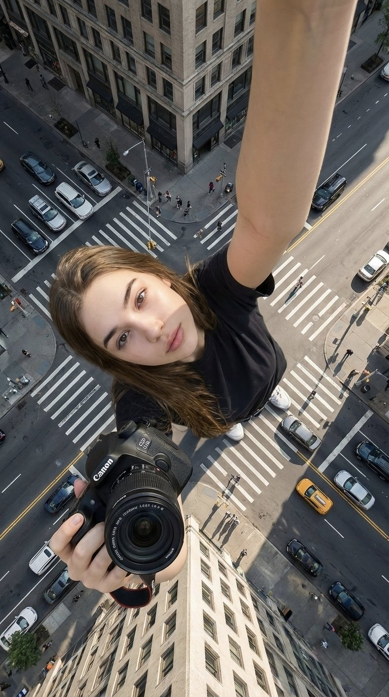

<!-- Generated by scripts/gallery.py; edit authoritative JSON, then rebuild. -->

# 全部资料 · 第 13 册

[画廊总览](gallery.md) | [上一册](gallery-part-12.md) | [下一册](gallery-part-14.md)

本册 25 条资料。标题链接固定到所示版本。

## 荧光蓝穷奇新中式山水画 · v1

- [荧光蓝穷奇新中式山水画 · v1](../cases/case-awesome-gpt-image-2-304-02f1b849e277/v1.md) — awesome-gpt-image-2 \#304

原图文案例 · gpt-image

**已记录补充核查结果；以详情中的输入要求为准**

蓝色神兽与红底山水撕纸海报，文字明确神兽及版面。已实际看样图并阅读完整 prompt；复核资料关系与输入条件，不代表生成复现或逐项事实准确性验收。

**输出示例图**


<details>
<summary>展开完整提示词</summary>

```text
[中文]
极简主义，新中式风格立体图形设计，图像下端有楷体中国文字：“东方美学”，“2026/04/18”，署名 “CHINA”，和“
@LIYUE
"；
平整纯白色的亚光质感厚艺术纸上绘充满东方诗意氛围的山水创意画，不规则的撕纸效果；
中国的神兽：穷奇，身形图案完整，美轮美奂，，线条柔美灵动,眼睛炯炯有神，威严的神态，优雅的姿势，奢华装饰艺术，中国传统纹饰；
荧光蓝色线条，0.5mm极细金色金属质感勾边，泼白墨大笔触，色彩渲染，红底，蓝色的浪漫诗意视觉；
冷暖光交织的梦幻唯美场景，强烈的光影对比氛围，花轻舞的时光叙事，东风禅意，画面有大面积留白，框架构图，底部留白，细节清晰。

[English]
Minimalism, Neo-Chinese style three-dimensional graphic design, at the bottom of the image there are Chinese characters in regular script: "东方美学", "2026/04/18", signature "CHINA", and "
@LIYUE
";
Drawn on flat, pure white matte textured thick art paper, a creative landscape painting full of oriental poetic atmosphere, irregular torn paper effect;
Chinese mythical beast: Qiongqi, complete body pattern, magnificent,, soft and agile lines, bright piercing eyes, majestic demeanor, elegant posture, luxury decorative art, Chinese traditional patterns;
Fluorescent blue lines, 0.5mm ultra-fine gold metallic texture outlining, large strokes of splashed white ink, color rendering, red background, romantic and poetic blue vision;
Dreamy and aesthetic scene where cold and warm lights intertwine, strong light and shadow contrast atmosphere, time narrative of flowers dancing lightly, Oriental Zen, the picture has a large area of blank space, framework composition, blank space at the bottom, clear details.
```

</details>

## 深夜便利店里的性感霓虹少女 · v1

- [深夜便利店里的性感霓虹少女 · v1](../cases/case-awesome-gpt-image-2-305-a12f4ff6702c/v1.md) — awesome-gpt-image-2 \#305

原图文案例 · gpt-image

**已记录补充核查结果；以详情中的输入要求为准**

便利店玻璃门边白衬衫女性持饮料的霓虹照片风画面。已阅读全文并查看样图，图片为结果示例；未发现必须补充某一指定输入图片。

**输出示例图**


<details>
<summary>展开完整提示词</summary>

```text
[中文]
35毫米胶片摄影，带有刺眼的便利店荧光灯照明，混合着外面色彩斑斓的霓虹灯牌，真实的胶片颗粒，高对比度，轻微的偏色，电影感街头编辑风格，亲密的中景镜头，20岁出头性感的华人女性偶像，拥有超逼真精致细腻的东方五官，诱人的杏眼狐眼搭配天然双眼皮，高鼻梁，小巧尖锐的V型下颌线，无瑕的瓷白肌肤带有冷象牙底色以及来自荧光灯的可见高光，细腻的皮肤纹理和微小毛孔，自然清透妆容带有脸颊上的柔和红晕，水润自然的粉唇微张，鼻子和脸颊上散布着微妙的自然雀斑，深棕色的长发扎成凌乱的高马尾，许多松散的发丝垂在脸庞和颈部周围，穿着一件超大号的白衬衫作为唯一的上衣，顶部敞开露出深邃乳沟并在腰部宽松打结，搭配一条极小的黑色百褶迷你裙，赤脚穿着简约的白色拖鞋，在深夜24小时便利店的玻璃门上呈现出诱人随性的倚靠姿势，身体微微拱起，一条腿弯曲，脚搭在门框上，另一条腿伸直，一只手拿着一瓶冰饮，另一只手轻轻拉扯迷你裙的裙摆，极其诱人俏皮却又略显脆弱的目光直视观看者，柔和的鹿眼中充满安静的诱惑与挑逗的微笑，来自店内明亮冷调的荧光灯光混合着来自外面招牌的粉色和蓝色霓虹光芒，玻璃门上真实的反射，模糊的便利店内部，背景中有货架和零食，真实的35毫米胶片调色，带有刺眼的光照和霓虹点缀，极其锐利却又柔和的皮肤渲染，自然的发丝，超大号衬衫和迷你裙上逼真的织物褶皱和垂坠感，无塑料感皮肤，无数字过度锐化，无磨皮，无瑕疵，无痣，无油性皮肤，无水印，无文字，真实的深夜便利店氛围

[English]
35mm film photography with harsh convenience store fluorescent lighting mixed with colorful neon signs from outside, authentic film grain, high contrast, slight color cast, cinematic street editorial style, intimate medium shot, early 20s sexy Chinese female idol with ultra-realistic delicate refined Chinese features, seductive almond-shaped fox eyes with natural double eyelids, high nose bridge, small sharp V-shaped jawline, flawless porcelain skin with cool ivory undertone and visible specular highlights from fluorescent light, subtle skin texture and micro pores, natural dewy makeup with soft flush on cheeks, glossy natural pink lips slightly parted, subtle natural freckles across nose and cheeks, long dark brown hair in a messy high ponytail with many loose strands falling around face and neck, wearing an oversized white button-up shirt as the only top, unbuttoned at the top with deep cleavage and loosely tied at the waist, paired with a tiny black pleated mini skirt, barefoot in simple white slides, seductive casual leaning pose against the glass door of a 24-hour convenience store at late night, body slightly arched, one leg bent with foot resting against the door frame, the other leg straight, one hand holding a bottle of iced drink, the other hand lightly pulling the hem of her mini skirt, intensely seductive playful yet slightly vulnerable gaze straight at the viewer with soft doe eyes full of quiet temptation and teasing smile, bright cold fluorescent store light from inside mixed with pink and blue neon glow from outside signs, realistic reflections on glass door, blurred convenience store interior with shelves and snacks in background, authentic 35mm film color grading with harsh lighting and neon accents, extremely sharp yet soft skin rendering, natural hair strands, realistic fabric wrinkles and drape on the oversized shirt and mini skirt, no plastic skin, no digital over-sharpening, no airbrushing, no blemishes, no moles, no oily skin, no watermark, no text, authentic late-night convenience store atmosphere
```

</details>

## 官方角色设定资料卡 · v1

- [官方角色设定资料卡 · v1](../cases/case-awesome-gpt-image-2-306-487bc87ec95f/v1.md) — awesome-gpt-image-2 \#306

原图文案例 · gpt-image

**已记录补充核查结果；以详情中的输入要求为准**

已核对原文输入要求与当前示例图；这是通用可替换主体/照片/标志模板，实际执行须由使用者提供相应输入，未发现必须另补某一指定源文件的明确要求。 审核只涉及资料输入要求/资产角色，不包含重新生图、身份一致性或像素复现验证。

**输出示例图**


<details>
<summary>展开完整提示词</summary>

```text
[中文]
基于此角色和背景，请制作一份类似官方设定资料的角色资料卡。
・包含三视图：正面、侧面和背面
・添加角色面部表情的变化・分解并展示服装和装备的详细部分
・添加色板・包含世界观设定的简要说明
・总体上，使用有组织的布局（白色背景，插画风格）

[English]
Based on this character and background, please create a character reference sheet similar to official setting materials.
・Includes three-view drawings: front view, side view, and back view
・Add variations of the character's facial expressions
・Break down and display detailed parts of the clothing and equipment
・Add a color palette
・Include a brief explanation of the worldview setting
・Overall, use an organized layout (white background, illustration style)
```

</details>

## 红绸舞动千年商都广州 · v1

- [红绸舞动千年商都广州 · v1](../cases/case-awesome-gpt-image-2-307-5d78e0499769/v1.md) — awesome-gpt-image-2 \#307

原图文案例 · gpt-image

**已记录补充核查结果；以详情中的输入要求为准**

已实际看图并阅读全文。红绸舞带连接广州城市地标；全prompt定义地标和S形构图。 本次核对资料关系、图片角色和输入条件，不代表身份、事实或逐像素生成正确性验收。

**输出示例图**


<details>
<summary>展开完整提示词</summary>

```text
[中文]
一张充满新春喜庆氛围但不失高雅格调的 2026 城市宣传海报。
双重曝光，构图延续了S型的流动感；
在纯白的纹理背景右下角，一个身穿中国传统服饰的微缩人物正在挥舞着一条长长的红色丝绸舞带，这条红绸在空中舞动，不仅展现出丝绸的柔顺质感，更在向左上方飘动的过程中，奇幻地变形成了一条壮丽的山脉河流。
在这条“河流”中，叠加了一个有山有海河的广州城市手绘图，国潮，景色尽在眼底，壮阔雄伟，令人震撼。
广州的地标建筑(广州塔，珠江新城建筑群，珠江, 广州城里古建筑，游轮，白云山）。
云雾环绕，仙气缥缈，色彩丰富，结构复杂，细节丰富，但因为大面积的留白，画面依然显得清新脱俗，左下角排版着“SPRING 2026”和竖排的宣传语，整体寓意“千年商都，魅力广州”。
文字排版优美，大方，字迹清晰完整，尺寸9:16。

[English]
A 2026 city promotional poster filled with a festive Spring Festival atmosphere without losing its elegant style.
Double exposure, the composition continues the flowing sense of an S-shape;
In the lower right corner of the pure white textured background, a miniature figure wearing traditional Chinese clothing is waving a long red silk dance ribbon. This red silk dances in the air, not only showing the smooth texture of the silk, but also magically transforming into a magnificent mountain range and river during the process of floating to the upper left.
In this "river", a hand-drawn map of Guangzhou city with mountains, sea, and rivers is superimposed, Guochao, the scenery is in full view, magnificent and majestic, shocking.
Guangzhou's landmark buildings (Canton Tower, Pearl River New City building complex, Pearl River, ancient buildings in Guangzhou city, cruise ships, Baiyun Mountain).
Surrounded by clouds and mist, ethereal and misty, rich in color, complex in structure, rich in details, but because of a large area of blank space, the picture still looks fresh and refined. In the lower left corner, "SPRING 2026" and vertical promotional slogans are typeset. The overall implication is "Millennium Commercial Capital, Charming Guangzhou".
The typography is beautiful and generous, the handwriting is clear and complete, aspect ratio 9:16.
```

</details>

## 抖音直播截图画面 · v1

- [抖音直播截图画面 · v1](../cases/case-awesome-gpt-image-2-308-f25f90aff41f/v1.md) — awesome-gpt-image-2 \#308

原图文案例 · gpt-image

**已记录补充核查结果；以详情中的输入要求为准**

实际查看：人物手持祝贺文字牌的直播界面。已通读完整归档指令；图像为该创作方向的结果样例，文本未要求某张特定外部原图。含可替换主题、人物或参数，样例可采用不同填充值；不把通用占位符视为缺少指定图片。

**输出示例图**


<details>
<summary>展开完整提示词</summary>

```text
[中文]
9:16 的图片比例，生成一张抖音直播的截图，里面是 xxx 在直播，xxx 手里拿着牌子，牌子里写着 xxxx。

[English]
9:16 aspect ratio, generate a screenshot of a Douyin live stream, inside is xxx live streaming, xxx is holding a sign in their hand, the sign says xxxx.
```

</details>

## 创意树叶拼贴构成的角色画像 · v1

- [创意树叶拼贴构成的角色画像 · v1](../cases/case-awesome-gpt-image-2-309-0d9b638a30fa/v1.md) — awesome-gpt-image-2 \#309

原图文案例 · gpt-image

**已记录补充核查结果；以详情中的输入要求为准**

叶片拼贴猫角色白底图，角色名是可替换文本条件。已实际看样图并阅读完整 prompt；复核资料关系与输入条件，不代表生成复现或逐项事实准确性验收。

**输出示例图**


<details>
<summary>展开完整提示词</summary>

```text
[中文]
{ 角色名称 } 完全由天然树叶制成，创意树叶拼贴艺术，分层绿叶和干叶构成身体、面部和衣服，可见叶脉和纹理，手工植物艺术风格，干净的白色背景，俯视平铺构图，高度细节，柔和自然光，逼真树叶纹理，8k

[English]
{
  CHARACTER NAME
} made entirely from natural leaves,
creative leaf collage art,
layered green and dry leaves forming body,
face and clothes,
visible leaf veins and textures,
handcrafted botanical art style,
clean white background,
top-down flat lay composition,
highly detailed,
soft natural lighting,
realistic leaf textures,
8k
```

</details>

## 零食品牌技术分解图 · v1

- [零食品牌技术分解图 · v1](../cases/case-awesome-gpt-image-2-310-72223e34cb3a/v1.md) — awesome-gpt-image-2 \#310

原图文案例 · gpt-image

**已记录补充核查结果；以详情中的输入要求为准**

薯片、威化及饮料四格包装剖面技术图；prompt允许照片级渲染，无指定产品照片必需。已阅读全文并查看样图，图片为结果示例；未发现必须补充某一指定输入图片。

**输出示例图**


<details>
<summary>展开完整提示词</summary>

```text
[中文]
创建一个 [SNACK] 的品牌技术信息图，结合产品的真实照片或照片级真实渲染，并将技术注释覆盖层直接置于其上。在纯白摄影棚背景上使用带有策略性 [BRAND COLOR] 点缀的黑色墨水风格线条画（建筑草图外观），包括：
• 关键组件标签
• 显示结构、分层或内部设计的内部截面图
• 测量数据、尺寸和规格
• 带有成分和数量的材料标注
• 指示主要功能和结构完整性的箭头
• 显示关键机械或设计元素的简单示意图或剖面图
• 可持续性标注
标题位置：位于手绘技术注释框内，带有强调色边框，粗体字显示产品名称，置于上角。
风格与布局规则：
• 真实产品保持清晰可见
• 注释具有素描感、技术感和建筑感
• 强调色用于高光（占线条工作的 20-30%），黑色用于主要技术线条（70-80%）
• 构图整洁，负空间平衡
• 具有教育意义、食品工程氛围和高端品牌感
• 在角落包含微妙的品牌标志
视觉风格：极简技术插画美学，黑色线条在真实图像上带有点缀，精确但略带手绘感。
调色板：白色背景，黑色注释线/文本，[BRAND COLOR] 仅用于点缀和关键标注。
输出：1080×1080，超清晰，社交媒体动态优化，无水印。

[English]
Create a branded technical infographic of a [SNACK], combining a realistic photograph or photoreal render of the product with technical annotation overlays placed directly on top. Use black ink–style line drawings with strategic [BRAND COLOR] accents (architectural sketch look) on a pure white studio background, including:
• Key component labels
• Internal cross-section showing structure, layering, or internal design
• Measurements, dimensions, and specifications
• Material callouts with composition and quantities
• Arrows indicating function for primary features and structural integrity
• Simple schematic or sectional diagram showing key mechanical or design elements
• Sustainability callouts
Title placement: Inside a hand-drawn technical annotation box with accent border reading the product name in bold font, positioned in upper corner.
Style & layout rules:
• The realistic product remains clearly visible
• Annotations feel sketched, technical, and architectural
• Accents used for highlight (20-30% of linework), black for primary technical lines (70-80%)
• Clean composition with balanced negative space
• Educational, food-engineering vibe with premium branding
• Include subtle brand logo mark in corner
Visual style: Minimal technical illustration aesthetic, black linework with accents over realistic imagery, precise but slightly hand-drawn feel.
Color palette: White background, black annotation lines/text, [BRAND COLOR] for accents and key callouts only.
Output: 1080×1080, ultra-crisp, social-feed optimized, no watermark.​​​​​​​​​​​​​​​​
```

</details>

## 晨曦薰衣草田梦幻少女三联画 · v1

- [晨曦薰衣草田梦幻少女三联画 · v1](../cases/case-awesome-gpt-image-2-311-10819ef86160/v1.md) — awesome-gpt-image-2 \#311

原图文案例 · gpt-image

**已记录补充核查结果；以详情中的输入要求为准**

已实际看图并阅读全文。薰衣草田同一女性三幅横向画面纵排；文本定义上中下三个景别，皆为输出。 本次核对资料关系、图片角色和输入条件，不代表身份、事实或逐像素生成正确性验收。

**输出示例图**


<details>
<summary>展开完整提示词</summary>

```text
[中文]
日出时分薰衣草田中女子的水平三联画。
上部：半身像，闭着眼睛，淡紫色连衣裙，一只手放在头发里，模糊的薰衣草前景。
中部：特写镜头，看着镜头，蓬乱的头发，薄纱围巾，脸上的阳光。
下部：四分之三镜头，手持薰衣草花束，飘逸的裙子，柔和的粉彩天空，温暖的梦幻色调。

[English]
Horizontal triptych of a woman in a lavender field at sunrise.
Top: Waist-up, eyes closed, pale lilac dress, one hand in hair, blurred lavender foreground.
Middle: Close-up, looking at camera, tousled hair, sheer scarf, sunlight on face.
Bottom: Three-quarter shot, holding lavender bouquet, flowing skirt, soft pastel sky, warm dreamy tones.
```

</details>

## 鲜艳霓虹光影下的动感苏打水飞溅商业海报 · v1

- [鲜艳霓虹光影下的动感苏打水飞溅商业海报 · v1](../cases/case-awesome-gpt-image-2-312-fc638f1ed231/v1.md) — awesome-gpt-image-2 \#312

原图文案例 · gpt-image

**已记录补充核查结果；以详情中的输入要求为准**

实际查看：橙红水果飞溅中的TROPICAL RUSH饮料罐。已通读完整归档指令；图像为该创作方向的结果样例，文本未要求某张特定外部原图。

**输出示例图**


<details>
<summary>展开完整提示词</summary>

```text
[中文]
{
  "prompt": "一个充满活力的高端广告构图中的三个超动态苏打水罐 —— 一罐热带冲刺苏打水伴随着戏剧性的水和热带水果飞溅而爆炸，鲜艳的橙色和粉色背景光；一罐柠檬冰爽苏打水在发光的绿色动态光背景下被冷水泼溅；两罐都覆盖着逼真的冷凝水和运动模糊的水滴，充满果味和清爽的能量。深橙色、粉色和霓虹绿灯光在大胆的演播室布置中融合。由使用佳能 50mm 镜头的专业摄影师拍摄，超写实纹理，清晰的细节，超高分辨率，明亮的商业海报美学，丰富的色彩鲜艳度，电影级飞溅效果 --ar 3:4"
}

[English]
{
  "prompt": "Three ultra-dynamic soda cans in one vibrant high-end advertising composition — a can of TROPICAL RUSH exploding with dramatic water and tropical fruit splash, vibrant orange and pink background lighting; a can of LEMON ICED splashed with cold water against a glowing green dynamic light background; both cans covered in realistic condensation and motion-blurred droplets, bursting with fruity, refreshing energy. Deep orange, pink, and neon green lighting blend together in a bold studio setup. Captured by a professional photographer using a Canon 50mm lens, hyper-realistic textures, crisp details, ultra high resolution, bright commercial poster aesthetic, rich color vibrancy, cinematic splash effects --ar 3:4"
}
```

</details>

## 电商商品展示设计 · v1

- [电商商品展示设计 · v1](../cases/case-awesome-gpt-image-2-313-ce464cd9c143/v1.md) — awesome-gpt-image-2 \#313

原图文案例 · gpt-image

**已记录补充核查结果；以详情中的输入要求为准**

NUBELLA 紫色软管、花朵和云雾广告，商品细节由文本直接给定。已实际看样图并阅读完整 prompt；复核资料关系与输入条件，不代表生成复现或逐项事实准确性验收。

**输出示例图**


<details>
<summary>展开完整提示词</summary>

```text
[中文]
{
  "style": "超写实奢华化妆品产品摄影",
  "composition": {
    "color_scheme": "戏剧性的单色蓝紫色",
    "resolution": "8K超高分辨率",
    "depth": "电影级景深",
    "aesthetic": "高端香氛护肤品广告风格"
  },
  "product": {
    "type": "软管包装",
    "finish": "缎面质感",
    "color": "长春花蓝",
    "label": "NUBELLA",
    "typography": "优雅的银色字体",
    "cap": "反光金属铬盖",
    "position": "垂直居中"
  },
  "surroundings": {
    "smoke": {
      "type": "墨水般的旋涡云雾",
      "colors": [
        "薰衣草色",
        "靛蓝色",
        "冰蓝色"
      ],
      "texture": "柔软、翻腾",
      "interaction": "环绕在产品周围"
    },
    "flowers": {
      "primary": [
        {
          "color": "紫色",
          "details": "错综复杂的花瓣细节",
          "center": "鲜艳的黄色"
        },
        {
          "color": "紫丁香色",
          "details": "错综复杂的花瓣细节",
          "center": "鲜艳的黄色"
        }
      ],
      "secondary": {
        "type": "细小的紫罗兰色花朵",
        "purpose": "增加立体感"
      }
    }
  },
  "lighting": {
    "direction": "来自左上方的柔和定向照明",
    "effects": [
      "突显软管的光滑曲度",
      "为金属盖增添微妙的光泽",
      "在烟雾中营造深度"
    ]
  },
  "background": {
    "blend": "无缝的冷色调蓝色和紫色调",
    "enhancement": "空灵的花香美学"
  },
  "details": "花瓣和蒸汽的超精细纹理"
}

[English]
{
  "style": "Ultra-realistic luxury cosmetic product photography",
  "composition": {
    "color_scheme": "Dramatic monochromatic blue-violet",
    "resolution": "8K ultra-high resolution",
    "depth": "Cinematic depth",
    "aesthetic": "High-end perfumed skincare advertising style"
  },
  "product": {
    "type": "Squeeze tube",
    "finish": "Satin-finish",
    "color": "Periwinkle-blue",
    "label": "NUBELLA",
    "typography": "Elegant silver",
    "cap": "Reflective metallic chrome",
    "position": "Vertically centered"
  },
  "surroundings": {
    "smoke": {
      "type": "Ink-like swirling clouds",
      "colors": [
        "Lavender",
        "Indigo",
        "Icy blue"
      ],
      "texture": "Soft, billowing",
      "interaction": "Wrapping around the product"
    },
    "flowers": {
      "primary": [
        {
          "color": "Purple",
          "details": "Intricate petal details",
          "center": "Vibrant yellow"
        },
        {
          "color": "Lilac",
          "details": "Intricate petal details",
          "center": "Vibrant yellow"
        }
      ],
      "secondary": {
        "type": "Tiny violet blossoms",
        "purpose": "Added dimension"
      }
    }
  },
  "lighting": {
    "direction": "Soft directional lighting from upper left",
    "effects": [
      "Highlights smooth curvature of the tube",
      "Adds subtle sheen to metallic cap",
      "Creates depth within smoke plumes"
    ]
  },
  "background": {
    "blend": "Seamless cool blue and purple tones",
    "enhancement": "Ethereal floral fragrance aesthetic"
  },
  "details": "Hyper-detailed textures of petals and vapor"
}
```

</details>

## 红蓝光影下的未来都市双重曝光青年 · v1

- [红蓝光影下的未来都市双重曝光青年 · v1](../cases/case-awesome-gpt-image-2-314-79b969430666/v1.md) — awesome-gpt-image-2 \#314

原图文案例 · gpt-image

**已记录补充核查结果；以详情中的输入要求为准**

红蓝侧光男性轮廓融合楼群的双重曝光肖像。已阅读全文并查看样图，图片为结果示例；未发现必须补充某一指定输入图片。

**输出示例图**


<details>
<summary>展开完整提示词</summary>

```text
[中文]
{
  "prompt": "一位年轻男子的超写实电影级双重曝光侧脸肖像，表情专注强烈，皮肤纹理细节丰富，眼神锐利。他的面部与从剪影中浮现的未来主义城市天际线无缝融合，摩天大楼和城市建筑构成了他的颈部和下颌线。深蓝色和鲜艳红色的强烈对比，象征着冲突与力量。抽象的数字划痕、碎裂的玻璃纹理和漏光效果覆盖在面部，营造出戏剧性的效果。干净的白色背景，超精细的灯光，专业电影海报风格，高对比度，清晰聚焦，8K分辨率，逼真的发丝，社论海报构图，现代平面设计美学，戏剧性的氛围，超高清，照片级真实。",
  "negative_prompt": "模糊，低分辨率，扭曲的面部，多余的肢体，过饱和的颜色，嘈杂的背景，平淡的灯光，卡通化，低细节",
  "resolution": "8K",
  "style": "电影感，双重曝光，照片级真实感，社论海报",
  "background": "干净的白色",
  "lighting": "高对比度，戏剧性的蓝红分割布光"
}

[English]
{
  "prompt": "A hyper-realistic cinematic double exposure portrait of a young man in side profile, intense focused expression, detailed skin texture and sharp eyes. His face seamlessly blended with a futuristic city skyline emerging from his silhouette, skyscrapers and urban buildings forming his neck and jawline. Strong contrast of deep blue and vibrant red tones symbolizing conflict and power. Abstract digital scratches, fractured glass textures, and light leaks overlaying the face for a dramatic effect. Clean white background, ultra-detailed lighting, professional movie poster style, high contrast, sharp focus, 8K resolution, realistic hair strands, editorial poster composition, modern graphic design aesthetics, dramatic mood, ultra-HD, photorealistic.",
  "negative_prompt": "blurry, low resolution, distorted face, extra limbs, oversaturated colors, noisy background, flat lighting, cartoonish, low detail",
  "resolution": "8K",
  "style": "cinematic, double exposure, photorealistic, editorial poster",
  "background": "clean white",
  "lighting": "high contrast, dramatic blue and red split lighting"
}
```

</details>

## 棘龙巨口中的酷飒少女与史前奇观 · v1

- [棘龙巨口中的酷飒少女与史前奇观 · v1](../cases/case-awesome-gpt-image-2-315-5550f305740c/v1.md) — awesome-gpt-image-2 \#315

原图文案例 · gpt-image

**已记录补充核查结果；以详情中的输入要求为准**

已实际看图并阅读全文。棘龙口中坐着抱幼崽女性、后方瀑布；文本完整规定幻想场景。 本次核对资料关系、图片角色和输入条件，不代表身份、事实或逐像素生成正确性验收。

**输出示例图**


<details>
<summary>展开完整提示词</summary>

```text
[中文]
超写实电影级奇幻场景，设定在郁郁葱葱的史前丛林山谷中。一只巨大的棘龙站在浅河边，它那长而类似鳄鱼的巨颚张得很大。一位年轻女子平静地坐在恐龙张开的嘴里，完美居中，双腿微微向前悬挂。她有一头深色直发，表情镇定无畏，皮肤纹理逼真。她身穿合身的黑色长袖短款上衣，蓝色牛仔短裤和黑色及膝战术靴。衣服和腿上可见微小的血迹和轻微划痕，增加了戏剧性的紧张感但并不血腥。她怀里温柔地抱着一只小恐龙幼崽，充满保护欲地抱着它。

在他们身后，一道高耸而充满戏剧性的瀑布顺着覆盖着茂密绿色植被和薄雾的陡峭丛林悬崖倾泻而下。场景中栖息着多只恐龙：几只迅猛龙在河岸边潜行，小型食草动物在背景中奔跑，飞翔的翼龙在头顶盘旋。环境丰富，有长满苔藓的岩石、流动的河水、热带植物和柔和的大气雾。

灯光具有电影感和自然感，漫射的日光照亮场景，阴影细节丰富，焦点清晰地聚在女子和棘龙身上，背景元素采用浅景深。恐龙鳞片、牙齿、水珠、树叶和织物上的超写实纹理。史诗奇幻写实主义，戏剧性构图，垂直构图，超精细，照片级真实感，4K，电影级调色，无文字，无水印。

[English]
Ultra-realistic cinematic fantasy scene set in a lush prehistoric jungle valley. A colossal Spinosaurus stands beside a shallow river, its long crocodile-like jaws stretched wide open. Seated calmly inside the dinosaur’s open mouth is a young woman, perfectly centered, legs hanging slightly forward. She has straight dark hair, a composed fearless expression, and realistic skin texture. She is wearing a fitted black long-sleeve crop top, blue denim shorts, and black knee-high combat boots. Small blood smears and light scratches are visible on her clothes and legs, adding dramatic tension without gore. She gently cradles a small baby dinosaur in her arms, holding it protectively.

Behind them, a tall dramatic waterfall cascades down steep jungle cliffs covered in dense green foliage and mist. Multiple dinosaurs populate the scene: several Velociraptors stalking the riverbank, small herbivores running through the background, and flying pterosaurs circling overhead. The environment is rich with mossy rocks, flowing water, tropical plants, and soft atmospheric fog.

Lighting is cinematic and natural, with diffused daylight illuminating the scene, detailed shadows, sharp focus on the woman and the Spinosaurus, and shallow depth of field for background elements. Hyper-real textures on dinosaur scales, teeth, water droplets, foliage, and fabric. Epic fantasy realism, dramatic composition, vertical framing, ultra-detailed, photorealistic, 4K, cinematic color grading, no text, no watermark.
```

</details>

## 冲破次元壁的写实漫画跑者 · v1

- [冲破次元壁的写实漫画跑者 · v1](../cases/case-awesome-gpt-image-2-316-d82a42567af9/v1.md) — awesome-gpt-image-2 \#316

原图文案例 · gpt-image

**已记录补充核查结果；以详情中的输入要求为准**

实际查看：彩色写实男子突破黑白漫画边框。已通读完整归档指令；图像为该创作方向的结果样例，文本未要求某张特定外部原图。

**输出示例图**


<details>
<summary>展开完整提示词</summary>

```text
[中文]
{
  "prompt": "超写实，一位留着深色短卷发、修剪整齐的胡须和黑色方形眼镜的年轻男子的鲜艳逼真渲染，身穿深色纹理高领毛衣和牛仔裤。他奔跑到一半被捕捉下来，姿态充满动感，向前突破，充满戏剧性地从一个破碎的漫画分镜框中显现——一条腿和一只手臂冲入现实世界，而身体的其余部分仍留在漫画框内。他的表情充满活力和喜悦，拥有锐利的面部细节，自然的皮肤纹理，以及具有高对比度和深度的戏剧性电影灯光。\n\n背景：一个非常详细的黑白漫画布局，充满了幽默、夸张的且与他直接互动的反应场景。周围的漫画人物表现出震惊和喜剧的表情，配有粗体的对话气泡和速度线。漫画分镜采用经典的高对比度水墨风格绘制，线条清晰，网点阴影。撕裂的纸张边缘和碎片增强了他冲破漫画世界的幻觉。全彩色的写实人物与单色的漫画环境形成强烈对比，创造出写实与漫画艺术之间的动态混合体。超精细，8k分辨率，清晰聚焦，戏剧性的阴影，电影级景深。"
}

[English]
{
  "prompt": "Ultra-realistic, vibrant photorealistic rendering of a young man with short curly dark hair, neatly trimmed beard, and black rectangular glasses, wearing a dark textured turtleneck sweater and jeans. He is captured mid-run in a dynamic, forward-breaking pose, dramatically emerging from a torn manga panel — one leg and one arm bursting into the real world while the rest of his body remains inside the comic frame. His expression is energetic and joyful, with sharp facial details, natural skin texture, and dramatic cinematic lighting with high contrast and depth. \n\nBackground: a highly detailed black-and-white manga layout filled with humorous, exaggerated reaction scenes that directly interact with him. The surrounding manga characters display shocked and comedic expressions, with bold speech bubbles and motion lines. The manga panels are illustrated in a classic high-contrast ink style with crisp linework and halftone shading. Torn paper edges and debris enhance the illusion of him breaking through the comic world. The fully colored, photorealistic figure contrasts strongly against the monochrome manga environment, creating a dynamic hybrid between reality and comic art. Ultra-detailed, 8k resolution, sharp focus, dramatic shadows, cinematic depth of field."
}
```

</details>

## 震撼视觉的深红影棚广角美妆大片 · v1

- [震撼视觉的深红影棚广角美妆大片 · v1](../cases/case-awesome-gpt-image-2-317-a613f9e22114/v1.md) — awesome-gpt-image-2 \#317

原图文案例 · gpt-image

**已记录补充核查结果；以详情中的输入要求为准**

可替换人像身份模板。现存图片是两种美妆广告并排展示，不能据此推断原模特输入已存；需要使用者提供人像。 审核只涉及资料输入要求/资产角色，不包含重新生图、身份一致性或像素复现验证。

**输出示例图**


<details>
<summary>展开完整提示词</summary>

```text
[中文]
照片级真实感的大胆美妆宣传活动，使用上传的模特作为精确的身份参考。不做面部改变，不做平滑处理。
场景：深红色饱和的摄影棚环境，具有高对比度的地板图案或光滑表面。
产品：产品被握持或放置在极其靠近镜头的位置，由于透视关系显得巨大。
模特姿势：俏皮或自信的微笑，手臂完全伸向相机，手指因广角镜头而略微变形。透过太阳镜的强烈眼神交流或自然凝视。
相机：超广角 20–28mm 美学，动态前景夸张，浅至中等景深。
灯光：强有力的商业照明，具有清晰的高光和反射，锐利的包装边缘，充满活力的调色。超精细的皮肤纹理和织物真实感。

[English]
Photorealistic bold beauty campaign using uploaded model as exact identity reference. No facial changes, no smoothing.
Scene: deep red saturated studio environment with high-contrast floor pattern or glossy surface.
Product: the product held or positioned extremely close to the lens, appearing large due to perspective.
Model pose: playful or confident smile, arm fully extended toward camera, fingers slightly distorted by wide lens. Strong eye contact through sunglasses or natural gaze.
Camera: ultra-wide 20–28mm aesthetic, dynamic foreground exaggeration, shallow-to-medium depth of field.
Lighting: punchy commercial lighting with defined highlights and reflections, crisp packaging edges, vibrant color grading. Hyper-detailed skin texture and fabric realism.
```

</details>

## 珊瑚色极简影棚时尚商业大片 · v1

- [珊瑚色极简影棚时尚商业大片 · v1](../cases/case-awesome-gpt-image-2-318-522ebb56b796/v1.md) — awesome-gpt-image-2 \#318

原图文案例 · gpt-image

**待复核：尚无补充核查，不代表必要输入已齐全**

可替换人像身份模板。现存图片与 \#317 相同，为广告对照；与此提示词的对应部分及原输入未独立确认。 审核只涉及资料输入要求/资产角色，不包含重新生图、身份一致性或像素复现验证。

**输出示例图**


<details>
<summary>展开完整提示词</summary>

```text
[中文]
超写实高端时尚商业广告大片，使用上传的模特照片作为严格的身份参考。保留精确的面部特征、比例和自然皮肤纹理——无修图，无变形。场景：珊瑚色单色工作室盒，配有光泽反光棋盘格或极简抛光地板。拥有柔和光线渐变的干净几何墙壁。产品：产品放置在前景中心超大位置，因广角透视而占据画面主导地位。包装超清晰，文字完全可读，具有逼真的反射和材质纹理。较小的产品单元可对称放置在背景中。模特姿势：站在产品后方，微蹲或前倾，一只手伸向镜头以创造深度感。强烈自信的表情，时尚态度。相机：低角度 24-35mm 镜头感，戏剧性透视畸变，对产品和模特都进行深焦处理。灯光：明亮的商业影棚灯光，柔和阴影，包装上有光泽高光，高端广告成片质感。4K–8K 写实主义，无水印，无嵌入式文本。纵横比 9:13

[English]
Ultra-realistic high-fashion commercial campaign using the uploaded model photo as strict identity reference. Preserve exact facial features, proportions and natural skin texture — no retouching, no reshaping.
Scene: coral monochrome studio box with glossy reflective checker or minimal polished floor. Clean geometric walls with soft light gradients.
Product: the product placed oversized in the center foreground, dominating the frame due to wide-angle perspective. The packaging is ultra-sharp, fully readable, realistic reflections and material texture. Smaller product units can be placed symmetrically in the background.
Model pose: standing behind the product, slightly crouched or leaning forward, one hand reaching toward the camera to create depth. Strong confident expression, fashion attitude.
Camera: low-angle 24–35mm lens look, dramatic perspective distortion, deep focus on both product and model.
Lighting: bright commercial studio lighting, soft shadows, glossy highlights on packaging, high-end campaign finish. 4K–8K realism, no watermark, no embedded text.i ar 9:13
```

</details>

## 鸟群织就的梦幻高定时装秀 · v1

- [鸟群织就的梦幻高定时装秀 · v1](../cases/case-awesome-gpt-image-2-319-b1198259372e/v1.md) — awesome-gpt-image-2 \#319

原图文案例 · gpt-image

**已记录补充核查结果；以详情中的输入要求为准**

鸟群构成礼服的 T 台女子，鸟与礼服是同场景输出。已实际看样图并阅读完整 prompt；复核资料关系与输入条件，不代表生成复现或逐项事实准确性验收。

**输出示例图**


<details>
<summary>展开完整提示词</summary>

```text
[中文]
一个充满趣味的高级时装T台场景，主角是一位自信的女性，正走在奢华时装秀的T台上，身穿一件完全由鸟类制成的非凡高级定制礼服。数百只优雅、色彩鲜艳的鸟类构成了飘逸的雕塑感礼服形状，像活着的羽毛一样层叠，翅膀微微张开，营造出布料和运动的错觉。一些鸟儿在她周围轻轻升入空中，捕捉于飞行瞬间，增添了神奇、超现实的运动感。鸟儿们展现出丰富多样的色彩——彩虹般的蓝色、光芒四射的红色、金黄色和柔和的白色——拥有错综复杂的羽毛细节和自然纹理。她在迈步间摆出姿势，带着快乐、自信的表情，富有表现力的眼睛，以及精致的T台妆容。戏剧性的舞台灯光配以发光的高光，黑暗模糊的观众背景，电影级的景深，奇幻现实主义，超精细纹理，高对比度，清晰聚焦，奇思妙想的奢华时装秀，超现实主义高级定制，4K分辨率，专业调色。

[English]
A playful high-fashion runway scene featuring a confident woman walking a luxury fashion show catwalk, wearing an extraordinary couture dress made entirely of birds. Hundreds of elegant, vividly colored birds form the shape of a flowing, sculptural gown, layered like living feathers, with wings partially spread to create the illusion of fabric and motion. Some birds lift gently into the air around her, captured mid-flight, adding a magical, surreal sense of movement. The birds display a rich variety of colors — iridescent blues, radiant reds, golden yellows, and soft whites — with intricate feather details and natural textures. She poses mid-stride with a joyful, confident expression, expressive eyes, and refined runway makeup. Dramatic stage lighting with glowing highlights, dark blurred audience background, cinematic depth of field, fantasy realism, ultra-detailed textures, high contrast, sharp focus, whimsical luxury fashion show, surreal couture, 4K resolution, professional color grading.
```

</details>

## 冰火双雄背靠背史诗电影海报 · v1

- [冰火双雄背靠背史诗电影海报 · v1](../cases/case-awesome-gpt-image-2-320-1ad5d6b73d59/v1.md) — awesome-gpt-image-2 \#320

原图文案例 · gpt-image

**已记录补充核查结果；以详情中的输入要求为准**

冰雪男性战士与火焰女性战士背靠背画面。已阅读全文并查看样图，图片为结果示例；未发现必须补充某一指定输入图片。

**输出示例图**


<details>
<summary>展开完整提示词</summary>

```text
[中文]
一幅戏剧性的电影海报风格肖像，描绘了两位史诗奇幻战士在冰冻风暴中背靠背站立。左侧是一位身经百战的男性战士，留着湿漉漉的深色卷发，低头以此表达坚定的决心，紧握着一把插在冰里的中世纪长剑。霜雪附着在他毛皮镶边的斗篷和肩膀上。右侧是一位强有力的女性战士侧影，苍白的皮肤在炽热的橙色光芒下闪耀，她的身体部分被火焰吞没，与冰冷的蓝色氛围形成对比。雪花粒子在空中盘旋，在象征性的冲突中融合了火与冰。超精细的面部细节，情感强度，体积雾，电影级布光，冷蓝色调混合温暖的火焰高光，浅景深，史诗奇幻电影海报，超写实，8K分辨率，戏剧性构图，清晰聚焦，高对比度，逼真纹理。

[English]
A dramatic cinematic poster-style portrait of two epic fantasy warriors standing back-to-back in a frozen storm. On the left, a battle-worn male warrior with wet, curly dark hair, head bowed in quiet resolve, gripping a medieval sword planted into the ice. Frost and snow cling to his fur-lined cloak and shoulders. On the right, a powerful female warrior in profile, pale skin glowing with fiery orange light, her body partially engulfed in flames thatcontrast against the icy blue atmosphere. Snow particles swirl through the air, blending fire and ice in a symbolic clash. Ultra-detailed faces, emotional intensity, volumetric fog, cinematic lighting, cold blue tones mixed with warm fire highlights, shallow depth of field, epic fantasy movie poster, hyper-realistic, 8K resolution, dramatic composition, sharp focus, high contrast, photorealistic textures.
```

</details>

## 都市落日时尚大片 · v1

- [都市落日时尚大片 · v1](../cases/case-awesome-gpt-image-2-321-e49e11a00778/v1.md) — awesome-gpt-image-2 \#321

原图文案例 · gpt-image

**已记录补充核查结果；以详情中的输入要求为准**

已实际看图并阅读全文。城市灯光前穿麂皮夹克的女性；全文提供服装姿态及光线。 本次核对资料关系、图片角色和输入条件，不代表身份、事实或逐像素生成正确性验收。

**输出示例图**


<details>
<summary>展开完整提示词</summary>

```text
[中文]
一张超现实电影感时尚照片，一位二十出头惊艳的年轻女性，全身可见，站在现代城市中心，黄金时段。
她随意地单肩靠在交通信号灯杆上，没有意识到相机的存在，仿佛这一刻是自然捕捉的。
她穿着紧身蓝色牛仔裤、棕色皮靴，以及一件短款棕色麂皮夹克，带有柔软羊皮翻领。夹克下，一件极简深色露脐上衣，隐约露出精致的乳沟和紧致的腹部。

她的体型天生女性化，均衡而优雅，姿态自信。
一只手穿过她丰盈的浅棕色长发，将其向后撩起，头部微微转向那一侧，眼睛自然地看向别处，没有摆拍。

肤色为轻微日晒后的奶油般柔和光泽，真实肌肤纹理，细腻毛孔与高光——毫无塑料感。
妆容醒目却精致：清晰的眼部、浓密睫毛、立体腮红、柔和修容，以及自然光泽唇——具备高端美妆广告质感。
光线为温暖金色时段阳光，包裹她的轮廓与发丝，营造柔和高光与电影感对比。
背景为城市街道，汽车与都市灯光以强烈散景呈现，浅景深——焦点锁定在女性身上。

使用全画幅电影摄影机拍摄，85mm镜头，f/1.8，超现实细节，高动态范围，电影级调色，胶片质感，顶级时尚大片美学，高预算电影剧照氛围。

[English]
A hyper-realistic cinematic fashion photograph of a stunning young woman in her early 20s, full body visible, standing in a modern city center during golden hour.
She leans casually with one shoulder against a traffic light pole, unaware of the camera, as if the moment was captured naturally.
She wears skinny blue jeans, brown leather boots, and a cropped brown suede jacket with a soft shearling collar. Under the jacket, a minimal dark crop top reveals a subtle cleavage and toned midriff.

Her physique is naturally feminine, balanced and elegant, with confident posture.
One hand runs through her long, voluminous curly light-brown hair, lifting it back in motion. Her head is turned slightly toward that side, eyes looking away naturally, not posing.

Skin tone is lightly sun-kissed with a soft creamy glow, realistic skin texture, subtle pores and highlights — no plastic look.
Makeup is striking but refined: defined eyes, bold lashes, sculpted cheeks, soft contour, and natural glossy lips — editorial beauty campaign quality.
Lighting is warm golden hour sunlight, wrapping around her silhouette and hair, creating soft highlights and cinematic contrast.
Background is an urban street with cars and city lights rendered in strong bokeh, shallow depth of field — focus locked on the woman.

Shot on a full-frame cinema camera, 85mm lens, f/1.8, ultra-realistic detail, high dynamic range, cinematic color grading, film-like tones, premium fashion editorial aesthetic, high-budget movie still feeling.
```

</details>

## 街头炫瓶男模 · v1

- [街头炫瓶男模 · v1](../cases/case-awesome-gpt-image-2-322-fe2ecd094f21/v1.md) — awesome-gpt-image-2 \#322

原图文案例 · unknown

**待复核：尚无补充核查，不代表必要输入已齐全**

可替换人像模板需要用户提供模特图；prompt 包含 --v7 --style raw，不能据集合名称确认 GPT-image 生成，实际模型未知。 审核只涉及资料输入要求/资产角色，不包含重新生图、身份一致性或像素复现验证。

**输出示例图**


<details>
<summary>展开完整提示词</summary>

```text
[中文]
专业照片，一位男士，30岁的俄罗斯模特（参考图像），正对着镜头，向相机倾斜，从下往上拍摄，使用广角镜头。男士倾斜着身体，近距离将一瓶饮料展示给镜头，一只手拿着瓶子，紧贴在镜头前。瓶子的标签和方向保持笔直，以便标签清晰可读。他穿着白色运动鞋，一只脚在镜头前方。男士站在街道上，湿漉漉的沥青和飞溅的水花从下方拍出。鲜艳的色彩，电影级灯光，光线从后方打在模特的脸上。--v7 --ar 3:4 --style raw

[English]
Professional photo, a guy, a 30-year-old Russian model (reference image), is facing the lens, tilted towards the camera, angle from below, shot with a wide-angle lens. The guy is tilted and shows a bottle close-up to the camera, a hand with a bottle close-up right in front of the lens. The label and direction of the bottle are straight so the label is readable. He's wearing white sneakers, one foot in front of the camera. The guy is standing on the street, wet asphalt and splashes from below. Bright colors, cinematic lighting, the light is behind and on the model’s face. --v7 --ar 3:4 --style raw
```

</details>

## 应用界面样机图 · v1

- [应用界面样机图 · v1](../cases/case-awesome-gpt-image-2-323-dca977c820d4/v1.md) — awesome-gpt-image-2 \#323

原图文案例 · gpt-image

**待复核：尚无补充核查，不代表必要输入已齐全**

原文要求精确参考姿势并指定 Nike 米白上衣/蓝裤；现图为粉色套装，姿势近似但服装不符，提示词与结果对应性待复核。 审核只涉及资料输入要求/资产角色，不包含重新生图、身份一致性或像素复现验证。

**输出示例图**


<details>
<summary>展开完整提示词</summary>

```text
Create a hyper-realistic, cinematic Instagram post layout where the Instagram UI exists as a physical, tangible 3D object, photographed like a premium commercial product shot. The result should feel indistinguishable from a real studio photograph.
Instagram Frame (UI Accuracy – Critical)
Authentic Instagram interface rendered as a solid white physical 3D card
Smooth matte plastic surface with subtle micro-texture
Slight thickness visible on edges, realistic bevels
Perfectly rounded corners (exact Instagram radius)
Soft studio reflections and realistic edge highlights
Top Bar (Pixel-accurate UI):
Circular profile avatar on the left
Username text: “June” in Instagram’s default bold UI font
Light blue FOLLOW button with correct proportions
Three-dot menu icon aligned to the far right
Exact spacing, typography, and icon sizing matching the real Instagram app
Aspect ratio 1:1, centered, balanced, premium composition.
Main Subject (Pose – Match Reference Image Exactly)
A photorealistic athletic woman partially emerging out of the Instagram frame into real 3D space
Seated pose identical to the reference image:
Both legs bent and angled to the side
One knee slightly raised and closer to the chest
Arms gently wrapped around the raised knee
Hands relaxed, fingers naturally resting
Torso leaning slightly back against the frame edge
Expression: calm, thoughtful, self-assured
Gaze: looking slightly to the side and upward, not engaging the camera
Natural body proportions, relaxed posture, editorial realism
No exaggerated curves, no artificial posing
Clothing (Nike Only – Realistic Fit)
Muted ivory / off-white Nike fitted short-sleeve blouse
Soft neutral tone that contrasts beautifully with the background
Visible white Nike swoosh
Natural fabric stretch and tension
Deep blue Nike athletic pants, length up to the knee
Tailored, performance-fit silhouette
Realistic fabric weight with subtle folds at the knee bend
Clean stitching and breathable sports material
Clean white Nike sneakers
Slight wear realism
Correct sole texture and stitching
Premium sportswear look, real commercial styling
No distortion, no fantasy fashion
Background (Inside the Instagram Post Only)
Dark indoor gym or studio environment
Cool blue and muted purple cinematic lighting
Soft haze in the background
Subtle volumetric light beams barely visible
Shallow depth of field, background softly blurred
Subject and Instagram frame remain sharp and dominant
Lighting & Photorealism
Studio-grade cinematic lighting
Soft key light illuminating the subject naturally
Gentle rim light outlining the body and Instagram frame
Realistic skin texture with visible pores and natural highlights
Accurate contact shadows where the subject touches the frame
Physically correct light falloff and reflections
Footer UI (Engagement Section)
Instagram action icons: like, comment, share, save (accurate icons)
Text visible: “785 likes”
Caption begins with June
Caption text:
Freedom isn’t found in comfort.
It’s built in the quiet moments where discipline meets belief.
Hashtags partially visible and naturally cropped
Overall Style & Quality
Ultra-high resolution
Advertising-grade realism
Clean, modern, editorial Instagram aesthetic
Hyper-realistic blend of 3D object + real photography
No extra elements
No text errors
No distortion
Looks like a real product photoshoot, not AI art
```

</details>

## 复古巴士上的红风衣女郎 · v1

- [复古巴士上的红风衣女郎 · v1](../cases/case-awesome-gpt-image-2-324-e693a8c44189/v1.md) — awesome-gpt-image-2 \#324

原图文案例 · gpt-image

**已记录补充核查结果；以详情中的输入要求为准**

实际查看：红衣女性坐在彩色旧巴士前缘。已通读完整归档指令；图像为该创作方向的结果样例，文本未要求某张特定外部原图。

**输出示例图**


<details>
<summary>展开完整提示词</summary>

```text
[中文]
一位时尚年轻女子坐在老式复古巴士的前缘，身穿红色长风衣、羊毛无檐小便帽、圆形蓝色反光太阳镜、叠层项链和粗犷的棕色皮靴。她有着波浪状金发，带着自信而梦幻的表情，仰望天空。巴士漆面剥落，呈青绿色与铁锈红色调。明亮清澈的蓝天，城市背景建筑极少，柔和日光，电影级色彩分级，浅景深，高端时尚旅行氛围，编辑摄影，超写实，4K分辨率，锐利对焦，自然肌肤质感，戏剧性构图，电影静帧美学。

[English]
A stylish young woman sitting on the front edge of an old vintage bus, wearing a long red trench coat, woolen beanie cap, round blue reflective sunglasses, layered necklaces, and rugged brown leather boots. She has wavy blonde hair and a confident, dreamy expression, looking upward toward the sky. The bus is weathered with peeling paint in turquoise and rust red tones.Bright clear blue sky, urban background with minimal buildings, soft daylight, cinematic color grading, shallow depth of field, high fashion travel vibe, editorial photography, ultra-realistic, 4K resolution, sharp focus, natural skin texture, dramatic composition, film still aesthetic.
```

</details>

## 皮克斯风阳光少年 · v1

- [皮克斯风阳光少年 · v1](../cases/case-awesome-gpt-image-2-325-2d19ec404885/v1.md) — awesome-gpt-image-2 \#325

原图文案例 · gpt-image

**待复核：尚无补充核查，不代表必要输入已齐全**

原图含左上写真人像插图、箭头和右侧卡通人物；prompt 仅描述卡通肖像，不能确定左图是原始输入还是示意，保留角色与流程疑点。已实际看样图并阅读完整 prompt；复核资料关系与输入条件，不代表生成复现或逐项事实准确性验收。

**图片角色尚未确认**


<details>
<summary>展开完整提示词</summary>

```text
[中文]
一个风格化的3D卡通肖像，一位年轻男子，拥有短棕发和富有表现力的绿色眼睛，温暖地微笑。他穿着黑色西装外套内搭白色T恤，现代休闲时尚。类似皮克斯/迪士尼风格角色设计，皮肤光滑，柔和光照，略微夸张的面部特征。高细节、精美的3D渲染，友好且平易近人的表情。渐变背景为柔和的蓝绿色和粉色，工作室灯光，浅景深，高分辨率。

[English]
A stylized 3D cartoon portrait of a young man with short brown hair and expressive green eyes, smiling warmly. He is wearing a black blazer over a white t-shirt, modern casual fashion. Pixar-like / Disney-style character design with smooth skin, soft lighting, and slightly exaggerated facial features. High detail, polished 3D render, friendly and approachable expression. Gradient background with soft teal and pink colors, studio lighting, shallow depth of field, high resolution.
```

</details>

## 红蓝撞色高跟诱惑 · v1

- [红蓝撞色高跟诱惑 · v1](../cases/case-awesome-gpt-image-2-326-4b5a2090f4e0/v1.md) — awesome-gpt-image-2 \#326

原图文案例 · gpt-image

**已记录补充核查结果；以详情中的输入要求为准**

红底蓝裙、红鞋的3D卡通女性全身图。已阅读全文并查看样图，图片为结果示例；未发现必须补充某一指定输入图片。

**输出示例图**


<details>
<summary>展开完整提示词</summary>

```text
[中文]
{
  "global_settings": {
    "resolution": "8K",
    "quality": "超高清晰度",
    "aspect_ratio": "2:3",
    "render_style": "AI编辑、高细节3D渲染",
    "lighting_quality": "柔和影棚光与逼真阴影",
    "sharpness": "极致清晰、锐利边缘",
    "noise": "无",
    "compression": "无"
  },
  "image_style": {
    "subject": {
      "character_type": "风格化3D卡通女性",
      "pose": "微微后仰靠在背景上",
      "expression": "俏皮、嘴唇轻撅、眼睛斜视",
      "hair": {
        "color": "棕色",
        "style": "短发、凌乱",
        "accessories": "红色太阳镜架在头顶"
      }
    },
    "clothing": {
      "dress": "贴身蓝色罗纹吊带裙",
      "footwear": "红色高跟凉鞋配蝴蝶结"
    },
    "color_palette": [
      "大胆红色",
      "深蓝"
    ],
    "background": {
      "color": "纯红色",
      "texture": "光滑哑光表面"
    },
    "lighting": {
      "direction": "一侧柔和定向光",
      "shadow": "在红色背景上投下清晰影子"
    },
    "composition": {
      "framing": "全身",
      "pose_emphasis": "弯曲身姿、交叉双腿"
    }
  }
}

[English]
{
  "global_settings": {
    "resolution": "8K",
    "quality": "ultra-high definition",
    "aspect_ratio": "2:3",
    "render_style": "AI-edited, high-detail 3D render",
    "lighting_quality": "soft studio lighting with realistic shadows",
    "sharpness": "extreme clarity, crisp edges",
    "noise": "none",
    "compression": "none"
  },
  "image_style": {
    "subject": {
      "character_type": "stylized 3D cartoon female",
      "pose": "leaning slightly backward against background",
      "expression": "playful, lips slightly pursed, eyes looking sideways",
      "hair": {
        "color": "brown",
        "style": "short, tousled",
        "accessories": "red sunglasses resting on head"
      }
    },
    "clothing": {
      "dress": "form-fitting blue ribbed dress with thin straps",
      "footwear": "red high-heel sandals with bow detail"
    },
    "color_palette": [
      "bold red",
      "deep blue"
    ],
    "background": {
      "color": "solid red",
      "texture": "smooth matte surface"
    },
    "lighting": {
      "direction": "soft directional light from one side",
      "shadow": "defined shadow cast on red background"
    },
    "composition": {
      "framing": "full body",
      "pose_emphasis": "curved posture, crossed legs"
    }
  }
}
```

</details>

## 沉香玫瑰悬浮幻景 · v1

- [沉香玫瑰悬浮幻景 · v1](../cases/case-awesome-gpt-image-2-327-490af7db71f5/v1.md) — awesome-gpt-image-2 \#327

原图文案例 · gpt-image

**已记录补充核查结果；以详情中的输入要求为准**

已实际看图并阅读全文。香水瓶上悬浮玫瑰树脂等成分的金色广告；中英文完整已读，英文JSON排版有缺分隔但仍能辨文字用途；无需输入图。 本次核对资料关系、图片角色和输入条件，不代表身份、事实或逐像素生成正确性验收。

**输出示例图**


<details>
<summary>展开完整提示词</summary>

```text
[中文]
{
  "master_prompt_type": "超精细8K AI图像生成",
  "global_settings": {
    "resolution": "8K UHD",
    "aspect_ratio": "2:3 竖版",
    "render_quality": "极致锐度、超微细节、电影级光效",
    "style": "超现实商业产品摄影",
    "color_profile": "温暖金调搭配柔和琥珀高光",
    "environment": {
      "location": "古老中东市场走廊",
      "architecture": {
        "walls": "岁月痕迹的粗糙石墙与可见纹理",
        "arches": "背景巨型石拱",
        "floor": "暖棕色石材地面"
      },
      "background_elements": [
        "装满香料的木架",
        "袋装与碗装干货",
        "悬挂草药束",
        "散发暖黄光的传统金属灯笼"
      ],
      "lighting": {
        "primary": "柔和金色环境光",
        "secondary": "两侧暖灯笼辉光",
        "atmosphere": "薄雾增强光线漫射"
      }
    },
    "main_subject": {
      "type": "香水瓶",
      "position": "中心前景",
      "placement": "置于华丽木桌之上",
      "material": {
        "bottle": "透明清玻璃",
        "cap": "黄金金属矩形瓶盖",
        "liquid": "淡金香水液体"
      },
      "design": {
        "shape": "圆角矩形瓶身",
        "finish": "高光反射表面",
        "label": "无可见标签"
      },
      "table": {
        "material": "深色雕花木材",
        "shape": "方形台面",
        "details": [
          "繁复花卉与几何雕刻",
          "金色镶嵌装饰",
          "抛光表面映光"
        ]
      },
      "floating_elements": {
        "composition_style": "竖向成分堆叠",
        "motion": "成分悬浮并伴随旋转金光",
        "effects": [
          "发光粒子",
          "闪耀尘埃",
          "柔光尾迹连接元素"
        ],
        "elements_order_top_to_bottom": [
          {
            "ingredient": "琥珀树脂",
            "appearance": "半透明金棕树脂块",
            "glow": "温暖内发光"
          },
          {
            "ingredient": "大马士革玫瑰",
            "appearance": "盛放粉色玫瑰",
            "details": [
              "柔软层叠花瓣",
              "自然绿叶",
              "轻飘附近花瓣"
            ]
          },
          {
            "ingredient": "白麝香",
            "appearance": "光滑白水晶状石块",
            "additional": "石下细白粉末"
          },
          {
            "ingredient": "陈年沉香",
            "appearance": "深棕木片",
            "texture": "粗糙纤维木纹",
            "effect": "缕缕白烟上升"
          }
        ]
      },
      "text_elements": {
        "title": {
          "text": "精致叙利亚香水",
          "font_style": "优雅衬线体",
          "color": "金色",
          "position": "顶部中央"
        },
        "subtitle": {
          "text": "奢华叙利亚香水",
          "font_style": "较小衬线体",
          "color": "金色",
          "position": "主标题下方"
        },
        "ingredient_labels": [
          {
            "title": "纯琥珀",
            "description": "来自自然深处的珍贵树脂"
          },
          {
            "title": "大马士革玫瑰",
            "description": "美丽与叙利亚传承的象征"
          },
          {
            "title": "白麝香",
            "description": "干净、粉感、永恒优雅的香氛"
          },
          {
            "title": "陈年沉香",
            "description": "深邃温暖、浓郁烟熏木香"
          }
        ],
        "typography_details": {
          "connector_lines": "细弯金线连接文字与成分",
          "icons": "线末端小圆点标记"
        },
        "opacity": "轻微半透明"
      }
    },
    "overall_mood": {
      "tone": "奢华、温暖、优雅",
      "theme": "传承香水工艺",
      "visual_feel": "浓郁、高端、电影级广告"
    }
  }
}

[English]
{
  "master_prompt_type": "Ultra-detailed 8K AI image generation",
  "global_settings": {
    "resolution": "8K UHD",
    "aspect_ratio": "2:3 vertical",
    "render_quality": "extreme sharpness, ultra-fine detail, cinematic lighting",
    "style": "hyper-realistic commercial product photography",
    "color_profile": "warm golden tones with soft amber highlights",
    "environment": {
      "location": "ancient Middle Eastern market corridor",
      "architecture": {
        "walls": "aged stone walls with visible texture and wear",
        "arches": "large stone archway in background",
        "floor": "stone flooring, warm brown tone"
      },
      "background_elements": [
        "wooden shelves filled with spices",
        "sacks and bowls of dried goods",
        "hanging bundles of herbs",
        "traditional metal lanterns emitting warm yellow light"
      ],
      "lighting": {
        "primary": "soft golden ambient light",
        "secondary": "warm lantern glow from both sides",
        "atmosphere": "slight haze enhancing light diffusion" "main_subject": {
          "type": "perfume bottle",
          "position": "center foreground",
          "placement": "on top of an ornate wooden table",
          "material": {
            "bottle": "transparent clear glass",
            "cap": "gold metallic rectangular cap",
            "liquid": "light golden perfume liquid"
          },
          "design": {
            "shape": "rectangular bottle with rounded edges",
            "finish": "glossy reflective surface",
            "label": "no visible label" "table": {
              "material": "dark carved wood",
              "shape": "square top",
              "details": [
                "intricate floral and geometric carvings",
                "golden inlay accents",
                "polished surface reflecting light" "floating_elements": {
                  "composition_style": "vertical ingredient stack",
                  "motion": "ingredients appear suspended with swirling golden light",
                  "effects": [
                    "glowing particles",
                    "sparkling dust",
                    "soft light trails connecting elements"
                  ],
                  "elements_order_top_to_bottom": [
                    {
                      "ingredient": "amber resin",
                      "appearance": "translucent golden-brown resin chunks",
                      "glow": "warm internal glow" "ingredient": "damask rose",
                      "appearance": "fully bloomed pink rose",
                      "details": [
                        "soft layered petals",
                        "natural green leaves",
                        "petals gently floating nearby"
                      ] "ingredient": "white musk",
                      "appearance": "smooth white crystal-like stone",
                      "additional": "fine white powder beneath the stone" "ingredient": "aged agarwood",
                      "appearance": "dark brown wooden pieces",
                      "texture": "rough, fibrous wood grain",
                      "effect": "thin white smoke rising upward" "text_elements": {
                        "title": {
                          "text": "Exquisite Syrian Perfume",
                          "font_style": "elegant serif",
                          "color": "gold",
                          "position": "top center"
                        },
                        "subtitle": {
                          "text": "Luxury Syrian Perfume",
                          "font_style": "smaller serif",
                          "color": "gold",
                          "position": "below main title"
                        },
                        "ingredient_labels": [
                          {
                            "title": "Pure Amber",
                            "description": "Precious resin from the depths of nature"
                          } "title": "Damask Rose",
                          "description": "Symbol of beauty and Syrian heritage"
                        },
                        {
                          "title": "White Musk",
                          "description": "Clean, powdery scent of timeless elegance"
                        },
                        {
                          "title": "Aged Agarwood",
                          "description": "Rich, smoky wood with deep warmth"
                        }
                      ],
                      "typography_details": {
                        "connector_lines": "thin curved golden lines connecting text to ingredients",
                        "icons": "small circular markers at line endpoints"
                      } "opacity": "slightly translucent"
                    } "overall_mood": "tone": "luxurious, warm, elegant",
                    "theme": "heritage perfume craftsmanship",
                    "visual_feel": "rich, premium, cinematic ads
```

</details>

## 俯拍巨女城景自拍 · v1

- [俯拍巨女城景自拍 · v1](../cases/case-awesome-gpt-image-2-328-c7cd8e8ee136/v1.md) — awesome-gpt-image-2 \#328

原图文案例 · gpt-image

**待复核：尚无补充核查，不代表必要输入已齐全**

明确需要人像和佳能产品两种输入，不能仅提供人像即宣称齐全。归档只有成图，原佳能产品版本与独立输入未知；复用时须补人像及产品图。 审核只涉及资料输入要求/资产角色，不包含重新生图、身份一致性或像素复现验证。

**输出示例图**



<details>
<summary>展开完整提示词</summary>

```text
[中文]
{
  "type": "图像生成提示词",
  "language": "zh",
  "style": "超现实电影感自拍摄影",
  "aspect_ratio": "9:16",
  "identity_preservation": {
    "use_reference_image": true,
    "strict_identity_lock": true,
    "alter_face": false,
    "alter_skin": false,
    "alter_hair": false,
    "alter_gender": false,
    "notes": "保留上传参考图像中完全一致的脸部特征、皮肤纹理、头发、眼镜、年龄和性别。禁止合成皮肤或雕塑感。"
  },
  "subject": {
    "gender": "女性",
    "capture_method": "由主体本人拍摄的自拍",
    "pose": {
      "selfie_arm": {
        "description": "一只手臂完全伸直并完全向上伸展，手持拍摄自拍的相机",
        "visibility": "手臂在画面中清晰可见、笔直且占主导地位",
        "camera_visibility": "自拍相机设备本身不得在画面中出现"
      },
      "product_arm": {
        "description": "另一只手臂完全伸向相机，手持附带的佳能相机",
        "importance": "产品最靠近相机并在视觉上占主导地位"
      },
      "head": {
        "tilt": "头部向自拍相机微微倾斜"
      },
      "expression": "自然放松的面部表情"
    },
    "body_visibility": "从头到脚全身可见",
    "feet": "双脚清晰接触路面"
  },
  "composition": {
    "perspective": "胸部高度的自然自拍视角",
    "camera_angle": "极端俯拍角度，相机位于主体正上方并直视下方",
    "layer_depth": [
      "产品（最靠近相机）",
      "脸部",
      "全身",
      "城市环境（背景）"
    ]
  },
  "scale_and_perspective": {
    "effect": "强制透视",
    "subject_scale": "女性呈现极度巨大",
    "buildings_scale": "建筑物显得小得多，最高不超过她的膝盖",
    "dominance": "主体在视觉上完全主导整个场景",
    "realism": "激发规模感同时保持物理可信"
  },
  "environment": {
    "location": "真实城市十字路口",
    "elements": [
      "人行横道",
      "道路标线",
      "交通标志",
      "汽车",
      "自行车",
      "真实人类尺度的行人"
    ],
    "setting": "地面层城市环境"
  },
  "lighting": {
    "type": "自然日光",
    "conditions": "晴朗或轻度多云天空",
    "shadows": "柔和且真实",
    "restrictions": "禁止奇幻或戏剧性照明"
  },
  "product_rules": {
    "usage": "完全按提供的上传佳能产品使用",
    "distortion": "无",
    "logo": "保持不变",
    "appearance": "仅有自然反射和真实高光"
  },
  "camera_quality": {
    "realism": "最大照片真实感",
    "depth": "前景、主体与背景清晰分离",
    "artifacts": "无"
  },
  "constraints": [
    "禁止AI艺术感",
    "禁止塑料或雕塑皮肤",
    "禁止扭曲脸部或身体",
    "禁止多余肢体或错误解剖",
    "禁止文字或水印",
    "禁止可见自拍相机设备"
  ],
  "output_goal": "创作一张超现实电影感自拍图像：女性使用其确切参考身份，从极端俯拍视角在真实城市人行横道拍摄，具备强制透视比例、自然日光，并将佳能相机产品明显持向镜头。"
}

[English]
{
  "type": "image_generation_prompt",
  "language": "en",
  "style": "hyper-realistic cinematic selfie photography",
  "aspect_ratio": "9:16",
  "identity_preservation": {
    "use_reference_image": true,
    "strict_identity_lock": true,
    "alter_face": false,
    "alter_skin": false,
    "alter_hair": false,
    "alter_gender": false,
    "notes": "Preserve identical facial features, skin texture, hair, glasses, age, and gender from the uploaded reference image. No synthetic skin or sculptural look."
  },
  "subject": {
    "gender": "female",
    "capture_method": "selfie taken by the subject herself",
    "pose": {
      "selfie_arm": {
        "description": "one arm fully straight and completely extended upward holding the camera that takes the selfie",
        "visibility": "arm clearly visible, straight and dominant in frame",
        "camera_visibility": "the selfie camera device itself must NOT be visible in the frame"
      },
      "product_arm": {
        "description": "the other arm fully extended toward the camera holding the attached Canon camera",
        "importance": "product is closest to the camera and visually dominant"
      },
      "head": {
        "tilt": "slightly tilted toward the selfie camera"
      },
      "expression": "natural and relaxed facial expression"
    },
    "body_visibility": "full body visible from head to toe",
    "feet": "feet clearly touching the road surface"
  },
  "composition": {
    "perspective": "natural selfie perspective at chest height",
    "camera_angle": "extreme top-down angle, camera above the subject looking directly downward",
    "layer_depth": [
      "product (closest to camera)",
      "face",
      "full body",
      "city environment (background)"
    ]
  },
  "scale_and_perspective": {
    "effect": "forced perspective",
    "subject_scale": "the woman appears extremely giant",
    "buildings_scale": "buildings appear much smaller, reaching no higher than her knees",
    "dominance": "the subject visually dominates the entire scene",
    "realism": "inspiring scale while remaining physically believable"
  },
  "environment": {
    "location": "real urban intersection",
    "elements": [
      "pedestrian crosswalk",
      "road markings",
      "traffic signs",
      "cars",
      "bicycles",
      "pedestrians at realistic human scale"
    ],
    "setting": "ground-level urban environment"
  },
  "lighting": {
    "type": "natural daylight",
    "conditions": "clear or lightly cloudy sky",
    "shadows": "soft and realistic",
    "restrictions": "no fantasy or dramatic lighting"
  },
  "product_rules": {
    "usage": "use the uploaded Canon product exactly as provided",
    "distortion": "none",
    "logo": "unchanged",
    "appearance": "natural reflections and realistic highlights only"
  },
  "camera_quality": {
    "realism": "maximum photorealism",
    "depth": "clear separation of foreground, subject, and background",
    "artifacts": "none"
  },
  "constraints": [
    "No AI-art look",
    "No plastic or sculpted skin",
    "No distortion of face or body",
    "No extra limbs or incorrect anatomy",
    "No text or watermarks",
    "No visible selfie camera device"
  ],
  "output_goal": "Create a hyper-realistic cinematic selfie image of a woman using her exact reference identity, captured from an extreme top-down perspective in a real urban crosswalk, with forced perspective scale, natural daylight, and a Canon camera product prominently held toward the lens."
}
```

</details>

