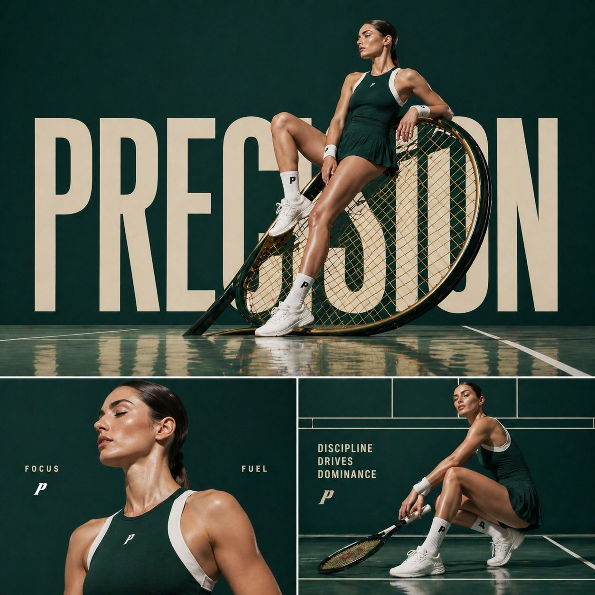

<!-- Generated by scripts/gallery.py; edit authoritative JSON, then rebuild. -->

# 全部案例 · 第 14 册

[画廊总览](gallery.md) | [上一册](gallery-part-13.md) | [下一册](gallery-part-15.md)

本册 25 个案例。标题链接固定到所示版本。

## 烬甲猎鹰者与燃翼神禽 · v1

- [烬甲猎鹰者与燃翼神禽 · v1](../cases/case-awesome-gpt-image-2-329-3ad427d128f6/v1.md) — awesome-gpt-image-2 \#329


<details>
<summary>展开完整提示词</summary>

```text
[中文]
一幅充满奇幻色彩的电影场景：一位英姿飒爽的女战士兼猎鹰师，身着饱经战火洗礼、饰以闪耀余烬纹理的皮甲，漫步于幽暗迷雾笼罩的森林之中。她高举手臂，指挥着一头巨大的凤凰与雄鹰的混合体，这头猛禽双翼燃烧，羽毛燃焰，尖端喷吐着火焰。它周身散发着橙红色的熔岩光芒，火星和余烬飞溅。女战士梳着辫子，皮肤上沾满了灰烬，神情坚定，手中拿着绳索和工具袋。画面细节丰富，羽毛纹理逼真，火焰物理效果自然，光照效果极具戏剧性，运用了体积雾、浅景深等技术，营造出史诗般的奇幻氛围，色彩调校极具电影质感，背景阴郁深沉，分辨率高达8K，呈现出概念艺术的精髓，并采用了虚幻引擎的渲染效果。

[English]
A cinematic fantasy scene of a fierce female use image for face reference warrior falconer walking through a dark misty forest, wearing battle-worn leather armor infused with glowing ember textures. Her arm is raised, commanding a massive phoenix-eagle hybrid with blazing wings and flaming feathers, fire trailing from its tips. The bird radiates molten orange and red light, casting sparks and embers into the air.The warrior has braided hair, ash-streaked skin, and a determined expression, carrying a rope and utility pouch. Ultra-detailed feathers, realistic fire physics, dramatic lighting, volumetric fog, shallow depth of field, epic fantasy atmosphere, hyper-realistic, cinematic color grading, dark moody background, 8k, concept art, unreal engine quality.
```

</details>

## 月下美女直播画面 · v1

- [月下美女直播画面 · v1](../cases/case-awesome-gpt-image-2-330-7e056b4166ae/v1.md) — awesome-gpt-image-2 \#330


<details>
<summary>展开完整提示词</summary>

```text
生成一张直播间的图片，直播间氛围是月下美女跳舞的画面，直播间有很多人评论
```

</details>

## 西安手绘水彩城市地图 · v1

- [西安手绘水彩城市地图 · v1](../cases/case-awesome-gpt-image-2-331-8d64b90d0481/v1.md) — awesome-gpt-image-2 \#331


<details>
<summary>展开完整提示词</summary>

```text
生成一张手绘水彩风格的「西安」城市地图，包含当地特色美食、地标建筑及城市特色
```

</details>

## 茶π产品宣传海报 · v1

- [茶π产品宣传海报 · v1](../cases/case-awesome-gpt-image-2-332-add05e01337a/v1.md) — awesome-gpt-image-2 \#332


<details>
<summary>展开完整提示词</summary>

```text
帮这个产品生成宣传图
```

</details>

## AI 眼镜爆炸拆解图 · v1

- [AI 眼镜爆炸拆解图 · v1](../cases/case-awesome-gpt-image-2-333-b0b7bba964c9/v1.md) — awesome-gpt-image-2 \#333


<details>
<summary>展开完整提示词</summary>

```text
生成一张AI眼镜的爆炸视图，包含每个组件的名称以及这款产品的几大核心卖点。
```

</details>

## RAG 技术详解图 · v1

- [RAG 技术详解图 · v1](../cases/case-awesome-gpt-image-2-334-80fee1aa2b68/v1.md) — awesome-gpt-image-2 \#334


<details>
<summary>展开完整提示词</summary>

```text
帮我生成一张 RAG 技术的详细讲解图
```

</details>

## 朋友圈截图生成 · v1

- [朋友圈截图生成 · v1](../cases/case-awesome-gpt-image-2-335-c8e07103fb38/v1.md) — awesome-gpt-image-2 \#335


<details>
<summary>展开完整提示词</summary>

```text
原文未公开，重点展示 GPT-Image2 在高仿社交截图与中文排版场景中的能力。
```

</details>

## 个人网页视觉设计 · v1

- [个人网页视觉设计 · v1](../cases/case-awesome-gpt-image-2-336-6594da220834/v1.md) — awesome-gpt-image-2 \#336


<details>
<summary>展开完整提示词</summary>

```text
原文未公开，案例目标是生成一张高完成度的个人主页视觉设计图。
```

</details>

## 《短歌行》诗词意境图 · v1

- [《短歌行》诗词意境图 · v1](../cases/case-awesome-gpt-image-2-337-4781279291a5/v1.md) — awesome-gpt-image-2 \#337


<details>
<summary>展开完整提示词</summary>

```text
帮我生成一张《短歌行》的意境图，带整篇《短歌行》文字
```

</details>

## 《赤壁怀古》长卷图 · v1

- [《赤壁怀古》长卷图 · v1](../cases/case-awesome-gpt-image-2-338-0b9e03028247/v1.md) — awesome-gpt-image-2 \#338


<details>
<summary>展开完整提示词</summary>

```text
帮我生成一张《赤壁怀古》的长卷图，带整篇《赤壁赋》文字
```

</details>

## Apple 风格自然科普海报 · v1

- [Apple 风格自然科普海报 · v1](../cases/case-awesome-gpt-image-2-339-2b7a341c22c6/v1.md) — awesome-gpt-image-2 \#339


<details>
<summary>展开完整提示词</summary>

```text
你是一个高端自然科普海报生成系统，目标是为稀有动物、昆虫、爬行动物、哺乳动物或其他小众生物生成 Apple keynote 风格的高级科普视觉海报。

整体视觉方向：
生成一张 9:16 竖版高级科普海报，画面采用极简、纯白、干净、现代、Apple 式产品发布海报语言。背景应为纯白或极浅灰白渐变，保持大量留白。整体设计应具备高级感、克制感、视觉冲击力和科学展示感。

核心设计原则：
1. 主体动物必须被极度放大，成为画面最强视觉中心。
2. 主体应具有强烈立体感、真实质感、高清细节和柔和棚拍光影。
3. 海报信息要少而准，避免拥挤。
4. 不使用传统信息图的卡片、圆角框、复杂底纹、淡黄色纸张质感或装饰性边框。
5. 底部信息区只使用四列极简 icon + 标题 + 短说明，通过细竖线分隔。
6. 文字排版要像高端发布会视觉，标题巨大，副标题克制，正文小而清晰。
7. 风格关键词：Apple-inspired, premium editorial, pure white background, hero subject, clean typography, minimal infographic, high-end science poster.

画面结构：
顶部左侧为标题区：
中文大标题：{中文物种名}
中文副标题：{一句有吸引力的物种定位}
细短横线
英文名：{英文物种名}
分布信息：主要分布：{分布区域}

中部与下中部为主体视觉：
生成一个超高清、真实、具有强烈立体感的 {中文物种名}。
主体应占据画面 50% 到 70% 的视觉面积。
主体姿态应具有展示性、力量感或识别度。
保持白色背景，不添加复杂自然环境。
可以保留少量必要承托物，例如树枝、岩石、雪地、沙土或木皮，但必须简洁。
主体要有真实阴影，使其像高级产品摄影一样立在画面中。

底部信息区：
用四个极简信息栏目展示科普信息。
每个栏目包含：
一个细线 icon
一个彩色小标题
一段 1 到 3 行短文字
栏目之间用极细浅灰竖线分隔。
不使用卡片框，不使用圆角背景，不使用大面积色块。

四个信息栏目：
栏目 1：
标题：{重点特征1标题}
说明：{重点特征1短说明}

栏目 2：
标题：{重点特征2标题}
说明：{重点特征2短说明}

栏目 3：
标题：{重点特征3标题}
说明：{重点特征3短说明}

栏目 4：
标题：{重点特征4标题}
说明：{重点特征4短说明}

底部总结句：
在最底部居中放置一句灰色小字总结：
{一句高级、克制、有记忆点的科普总结}

字体与排版：
中文标题使用大号黑色、高级、稳重、有力量感的字体。
副标题使用灰色，中等字号，字距略宽。
英文名使用小号灰色，简洁现代。
正文使用清晰现代中文字体，保持可读。
所有文字必须留有足够呼吸感。

色彩规范：
背景：纯白、极浅灰、轻微柔光渐变。
主标题：黑色或深石墨色。
副标题与正文：中性灰。
底部四个信息标题可使用低饱和强调色：
暖棕、冷蓝、松石绿、紫色、橙色。
颜色只用于 icon 和小标题，不要大面积铺色。

图像质量：
2K 高清质感，细节清晰，主体锐利，光影真实。
主体纹理必须可信，例如毛发、鳞片、甲壳、皮肤褶皱、羽毛或斑纹。
避免变形、错误肢体、错误解剖结构、模糊主体、低质贴图、塑料感、卡通感。

禁止项：
不要使用淡黄色旧纸背景。
不要使用复杂信息图网格。
不要使用圆角卡片。
不要使用厚边框。
不要使用大面积装饰图形。
不要添加无关 logo。
不要添加多余小字。
不要让主体太小。
不要让文字压住主体。
不要让底部信息区过度拥挤。
不要出现儿童科普风、卡通风、低端展板风。

最终输出：
生成一张 9:16 竖版、高级、干净、强视觉冲击的 Apple 风自然科普海报。
```

</details>

## 彼岸花丛中的红妆女子 · v1

- [彼岸花丛中的红妆女子 · v1](../cases/case-awesome-gpt-image-2-340-6ac3a66b1f27/v1.md) — awesome-gpt-image-2 \#340


<details>
<summary>展开完整提示词</summary>

```text
异质感oc，绝美红妆女子，位于彼岸花丛中，张力。 唐琬《钗头凤·世情薄》 世情薄，人情恶，雨送黄昏花易落。晓风干，泪痕残。欲笺心事，独语斜阑。难，难，难！
```

</details>

## AP Calculus 学习表信息图 · v1

- [AP Calculus 学习表信息图 · v1](../cases/case-awesome-gpt-image-2-341-8e466c6a5a6d/v1.md) — awesome-gpt-image-2 \#341


<details>
<summary>展开完整提示词</summary>

```text
Please create a mathematical visualization infographic about "[math concept / topic]." The goal is to help the viewer intuitively understand what it is, why it works, its geometric or structural intuition, and how it behaves in different contexts. The visual should feel like a high-quality math lecture handout combined with a hand-drawn educational poster. It should be elegant, clear, and information-rich, but not cluttered. Visual style: either portrait or landscape is fine. Use a clean, light paper-like background, with a deep blue title and black or dark gray lines for the main content. Add a small number of refined accent colors such as blue, teal, gold, and red. Incorporate rounded-corner cards, thin borders, numbered labels, hand-drawn arrows, zoom-in callout boxes, and a summary section. The overall design should be aesthetically pleasing, balanced, and academic, allowing the viewer to grasp the structure of the concept and why it works at a glance.
```

</details>

## 四季包装 Campaign 宫格 · v1

- [四季包装 Campaign 宫格 · v1](../cases/case-awesome-gpt-image-2-342-614e58b0f55d/v1.md) — awesome-gpt-image-2 \#342


<details>
<summary>展开完整提示词</summary>

```text
PHASE 1 - PRODUCT: [ITEM] in [MATERIAL] packaging, minimal label design
PHASE 2 - GRID: 2x2 seasonal grid, four distinct brand worlds
PHASE 3 - COMPOSITION: each quadrant a full campaign scene with props and environment
PHASE 4 - CONSISTENCY: same product silhouette, four distinct palettes

Swap: [ITEM] / [MATERIAL] / [LABEL STYLE]
```

</details>

## 高定时尚杂志封面 · v1

- [高定时尚杂志封面 · v1](../cases/case-awesome-gpt-image-2-343-614719d91449/v1.md) — awesome-gpt-image-2 \#343


<details>
<summary>展开完整提示词</summary>

```text
Ultra high-fashion magazine cover, Louis Vuitton-style editorial. Close-up portrait of a confident woman with soft rose-gold hair and natural airy bangs, slightly wind-blown for movement. She is wearing a luxury summer outfit: a structured lightweight linen or silk jacket in warm golden-yellow tones, layered over a modest high-neck top, paired with a bold gold choker necklace and subtle statement earrings.

Fabric flows naturally with a summer breeze, slightly textured and breathable, capturing a premium seasonal feel. Styling is elegant, modest, and refined — no revealing clothing.

Lighting is high-end studio mixed with natural golden hour glow: warm highlights, soft shadows, luminous skin with glossy editorial finish.

Background is a rich summer gradient (sunset gold fading into soft coral or warm beige), clean but visually striking.

Composition is dynamic and slightly cinematic: hair in motion, shallow depth of field, sharp focus on face.

Typography: large elegant serif masthead "Louis Vuitton" at the top, bold cover line "YOUR CHOICE ENDS HERE" in premium editorial layout, minimal supporting text.

Ultra-realistic, hyper-detailed skin texture, 8K resolution, sharp focus, glossy magazine print quality, cinematic color grading, luxury fashion photography, no nudity, tasteful and editorial.
```

</details>

## NOIR 街头服饰 Campaign · v1

- [NOIR 街头服饰 Campaign · v1](../cases/case-awesome-gpt-image-2-344-a0291c56fadd/v1.md) — awesome-gpt-image-2 \#344


<details>
<summary>展开完整提示词</summary>

```text
Create a premium, highly realistic 1:1 campaign poster for NOIR, a modern streetwear brand. Show one hero oversized hoodie as the main focus against a gritty urban backdrop with wet concrete floors, dramatic low lighting, subtle smoke in the air and a raw street energy. Add bold minimal typography with the brand name NOIR and a short campaign headline like "Wear the Dark." Make it feel like a real high-end streetwear editorial, sharp detail, realistic fabric textures, modern and edgy, deep black tones with subtle grey accents, no clutter, no collage.
```

</details>

## 法新浪潮撕纸电影海报 · v1

- [法新浪潮撕纸电影海报 · v1](../cases/case-awesome-gpt-image-2-345-c3e6af6c317f/v1.md) — awesome-gpt-image-2 \#345


<details>
<summary>展开完整提示词</summary>

```text
Create a vertical poster composition on aged cream paper with a handmade analog feel. Use rough ripped paper edges, layered magazine cutouts, photocopy grain, halftone texture, ink bleed, and slightly imperfect screen-print registration. Keep the subject as the main black-and-white photographic portrait, placed prominently in the center or upper center. Surround the subject with graphic blocks of deep red, cobalt blue, warm yellow, black, and ivory.

Add supporting collage fragments such as a rainy European street, film-strip borders, newspaper clippings, urban silhouettes, and cinematic details, arranged like a handmade 1960s art-house movie poster. Use bold condensed typography with a strong visual hierarchy. Add large headline text: "[MAIN TITLE]". Add smaller subtitle text: "[SUBTITLE]". Add bottom text: "[BRAND NAME / EVENT NAME / COMING SOON / DATE]". If needed, include a small top line reading "[TAGLINE]".

The final result should feel cinematic, intellectual, rebellious, and editorial — like a lost 1960s European film poster with a strong point of view. Keep it raw, tactile, printed, imperfect, and handmade. Avoid a glossy modern finish.
```

</details>

## 立体刺绣小鸟花枝 · v1

- [立体刺绣小鸟花枝 · v1](../cases/case-awesome-gpt-image-2-346-40ad00863d36/v1.md) — awesome-gpt-image-2 \#346


<details>
<summary>展开完整提示词</summary>

```text
精致立体刺绣风插画，浅浮雕纤维艺术效果，纯净「蚕丝白 + 奶白」底色，细腻丝线质感。画面为数只小鸟停在蜿蜒花枝上，周围点缀粉白、浅桃、珊瑚粉、淡金色花朵与叶片，构图轻盈雅致、留白充足。鸟儿羽毛以奶白、浅蓝、淡粉、浅金丝线刺绣表现，花枝纤细自然，花朵层层叠线，整体呈现高级手工刺绣、丝线堆绣、柔和光影、细节丰富、温柔清新的艺术效果。
```

</details>

## 4×4 动作分解参考表 · v1

- [4×4 动作分解参考表 · v1](../cases/case-awesome-gpt-image-2-347-46f4b9df4c9f/v1.md) — awesome-gpt-image-2 \#347


<details>
<summary>展开完整提示词</summary>

```text
[STYLE]
Monochrome grayscale illustration, 3D-rendered character, clean instructional reference sheet, white background, comic-style cell grid layout, technical diagram aesthetic.

[LAYOUT]
4×4 grid layout with a total of 16 panels. Each panel is separated by thin black border lines. Cells are numbered from 1 to 16, with consistent panel sizes.

[CHARACTER]
image1 (the same character appears consistently in all panels)

[PANEL STRUCTURE – per cell]
Top-left: bold number badge + English title text
Center: full-body character pose illustration
Bottom-left: English description text (3–4 lines)
Overlay: directional arrows indicating movement

[ARROWS / MOTION INDICATORS]
Curved arrows, straight arrows, and circular rotation indicators placed around the character to show motion flow and direction.

[RENDERING STYLE]
Highly detailed 3D sculpted style, soft studio lighting, subtle shadows, no color, grayscale shading, clean linework, game concept art quality.

[NEGATIVE]
No background scenery, no color tones, no additional characters, no complex background.
```

</details>

## 胡须风格分析海报 · v1

- [胡须风格分析海报 · v1](../cases/case-awesome-gpt-image-2-348-343c39418701/v1.md) — awesome-gpt-image-2 \#348


<details>
<summary>展开完整提示词</summary>

```text
Create a premium “BEARD STYLE ANALYSIS” poster featuring the same man from the reference image. Show face shape, beard density, jawline definition, beard growth pattern, and beard suitability score. Include different beard styles comparison such as Stubble, Short Boxed Beard, Full Beard, Goatee, Van Dyke, Clean Shave. Add side profile and front profile views. Modern dark blue luxury background, professional grooming infographic style, high detail, realistic face consistency, stylish typography, premium male grooming poster.
```

</details>

## 运动时尚三联 Campaign · v1

- [运动时尚三联 Campaign · v1](../cases/case-awesome-gpt-image-2-349-1650a2cbcb58/v1.md) — awesome-gpt-image-2 \#349



<details>
<summary>展开完整提示词</summary>

```text
Cinematic sports fashion collage, 3-panel layout, top panel large hero shot of a female tennis athlete sitting confidently on an oversized tilted tennis racket, deep green luxury court backdrop, reflective glossy floor, bold oversized typography “PRECISION” in background, dramatic editorial lighting, ultra-clean composition, high-fashion athletic aesthetic.

Bottom left panel: close-up portrait of the athlete with glowing skin, minimal makeup, soft light, text “FOCUS” and “FUEL” placed subtly.

Bottom right panel: full-body crouched pose holding racket, strong posture, text “DISCIPLINE DRIVES DOMINANCE”, grid-based layout lines, premium sports branding feel.

Consistent color grading, dark green and white palette, sharp details, cinematic shadows, luxury campaign style, 1:1 aspect ratio.
```

</details>

## 足球球员数据涂鸦海报 · v1

- [足球球员数据涂鸦海报 · v1](../cases/case-awesome-gpt-image-2-350-0b0b1a3b7220/v1.md) — awesome-gpt-image-2 \#350


<details>
<summary>展开完整提示词</summary>

```text
Create a scrapbook doodle-style football poster of [PLAYER_NAME].

AI auto-generates realistic career stats (club and national team).

Main photo: realistic, unchanged ([PLAYER_NAME] in action or iconic pose).

Doodles and handwritten notes: white and [PRIMARY_COLOR] neon ink (no warm colors unless specified), arrows, stars, scribbles, sketchy outlines. Add a glowing [PRIMARY_COLOR] outline around the player's body.

Layout (bold handwritten titles and stats):
- Top Title: "[PLAYER_NAME]" plus "[NICKNAME/TITLE]"
- Club Career: total matches and goals plus 2–4 main clubs (apps and goals)
- Highlights: 2–3 standout achievements (e.g., UCL goals, Ballon d'Or, top scorer)
- National Team: caps and goals plus 1–2 international achievements

Style: modern football poster x notebook aesthetic, clean but energetic, slightly messy doodles, high contrast, neon accents on dark or muted background.

Important: all stats must be realistic and proportional to the player's real career.
```

</details>

## 健身品牌力量 Campaign · v1

- [健身品牌力量 Campaign · v1](../cases/case-awesome-gpt-image-2-351-9ee8855623e6/v1.md) — awesome-gpt-image-2 \#351


<details>
<summary>展开完整提示词</summary>

```text
Cinematic fitness campaign, oversized dumbbell placed diagonally like a statement prop, female model in red performance wear and white shorts seated on one side of the dumbbell, one leg bent, one extended, minimal black studio, reflective floor, bold word “STRENGTH” behind in large typography, sharp lighting, ultra-clean composition, luxury sports aesthetic, 1:1.
```

</details>

## 西楚霸王国风暗黑海报 · v1

- [西楚霸王国风暗黑海报 · v1](../cases/case-awesome-gpt-image-2-352-31dfebf1e8ea/v1.md) — awesome-gpt-image-2 \#352


<details>
<summary>展开完整提示词</summary>

```text
竖版国风暗黑海报，黑色纯背景，中央巨大的中文标题字，占据画面大部分空间，字体为粗粝做旧的米白色石刻/旧纸质感，带明显颗粒、磨损、裂痕与噪点；整体构图层次丰富，强烈黑白金红对比，东方审美，神秘、压抑、欲望与审判感并存 电影海报质感 高级平面设计，极致细节 纸张纹理 印章落款 小字标语，4K
```

</details>

## 品牌口红推荐报告信息图 · v1

- [品牌口红推荐报告信息图 · v1](../cases/case-awesome-gpt-image-2-353-09a2cb79346c/v1.md) — awesome-gpt-image-2 \#353


<details>
<summary>展开完整提示词</summary>

```text
一、系统角色
你是一个专业美妆顾问 + 人脸分析系统 + 品牌视觉设计系统。
你的任务是：基于用户上传自拍与指定口红品牌，生成一张具有品牌调性的“口红推荐报告信息结构图”。

二、输入参数
用户图像：{用户自拍}
品牌：{口红品牌，如 Dior / YSL / Armani / Chanel / TF}
风格偏好（可选）：{通勤 / 温柔 / 气场 / 氛围感 / 显白优先}
推荐数量：3–5

三、品牌视觉层（新增核心模块）
根据 {品牌} 自动构建视觉风格（Brand Visual Identity），提取品牌调性，例如：
Dior：
优雅、高级、法式、灰白 + 银色、柔光
YSL：
黑金、性感、强对比、时尚编辑感
Armani：
低饱和、雾面、克制、灰调高级感
Chanel：
极简黑白、高级、理性、结构清晰
Tom Ford：
深色、高对比、奢华、电影感

视觉应用到海报：
1. 主色调（背景微变化，不是大面积铺色）
2. 强调色（用于色号标题/细线/小元素）
3. 光影风格（柔光 / 强对比 / 冷调 / 暖调）
4. 字体气质（优雅 / 现代 / 冷感 / 力量感）

四、分析层
对用户进行分析：
- 肤色：冷 / 暖 / 中性（+ 明度）
- 气质：清冷 / 温柔 / 明艳 / 干净 / 成熟
- 唇部特征：薄 / 厚 / 唇色基础
- 妆容状态：素颜 / 日常 / 精致
输出一句总结：「更适合 {色系} + {饱和度} + {质地} 的口红方向」

五、推荐层（增强差异）
从 {品牌} 推荐 3–5 个色号：
每个包含：
- 色号名称（#999）
- 色系（正红 / 豆沙 / 枫叶 / 奶茶 / 玫瑰）
- 上脸效果（显白 / 提气色 / 氛围感 / 气场增强）
- 场景（逛街 / 通勤 / 聚餐 / 约会 / 宴会）

要求：每个色号“风格明确区分”（一个日常、一个气场、一个氛围感等）

六、信息结构图
生成竖版信息结构图
整体风格：美妆时尚大片质感 + 结构化信息可视化排版 + 品牌视觉体系深度融合
极简但不单调，高级但有视觉层次

【整体布局】
左上：用户输入区
右上：分析结论
中部：试色矩阵（核心）
底部：总结

## 1️⃣ 左上（用户区）
用户自拍（真实质感）
+ 小标题：「肤色分析」
+ 一句话结论：「适合低饱和玫瑰调，避免高荧光色」

极细品牌色线条（如 YSL 金线 / Dior 灰线）

## 2️⃣ 中部（核心试色矩阵）
这是视觉重点区域（占比60%以上）
展示方式：将 3–5 个色号以“人脸试色对比”的形式排列：
每一列 = 一个色号
每个色号包含：
- 小型人脸图（同一张脸，不同唇色）
- 色号名称（如 #999）
- 色系标签（如 Classic Red）
- 一句话效果说明
要求：所有人脸保持一致，仅唇色变化，真实试色效果（lip color try-on），肤质真实，不塑料，光影统一。
排列方式：横向排布 或 网格排布（整齐但不死板）

品牌增强点：
- Dior：轻柔渐变背景 + 柔光阴影
- YSL：更强对比 + 黑色细分割线
- Armani：整体灰调统一，低对比
- Chanel：严格对齐，极简黑白
- TF：局部暗背景 + 高光强调

## 3️⃣ 每个色号模块
包含：
色号名（突出）
色系标签
一句推荐语
场景标签（逛街/通勤/聚餐/约会/宴会等）

品牌化处理：
- 用“品牌强调色”做：
  - 色号标题
  - 细分隔线
  - 小icon
（不是色块，而是“精致点缀”）

## 4️⃣ 底部总结
一段“有判断力的建议”，
例如：「日常建议选择低饱和豆沙色提升气色，重要场合可使用正红增强气场」
或：「你的肤色更适合柔和玫瑰调，避免高荧光色系」
但不要完全引用以上2个例子的建议，根据用户实际肤色来建议。
品牌增强：底部可加极淡品牌风格横线 / 极小品牌字样（非logo）

七、UI设计
- 不使用圆角卡片 UI
- 不使用厚边框
1. 引入“层级对比”：
   - 主体亮
   - 次要信息弱
2. 使用“微对比”：
   - 细线
   - 灰度差
   - 字重变化
3. 加入“节奏感”：
   - 疏密变化
   - 模块呼吸
4. 品牌点缀：
   - 只用 5% 强调
   - 不破坏极简结构

八、图像质量
真实皮肤质感
唇色精准
统一光影
商业级美妆摄影
8K

———
品牌：YSL
```

</details>

