<!-- Generated by scripts/gallery.py; edit authoritative JSON, then rebuild. -->

# 全部资料 · 第 16 册

[画廊总览](gallery.md) | [上一册](gallery-part-15.md) | [下一册](gallery-part-17.md)

本册 25 条资料。标题链接固定到所示版本。

## 品牌人格漫画信息图 · v1

- [品牌人格漫画信息图 · v1](../cases/case-awesome-gpt-image-2-379-a6632be6ae99/v1.md) — awesome-gpt-image-2 \#379

原图文案例 · gpt-image

**已记录补充核查结果；以详情中的输入要求为准**

已核对原文输入要求与当前示例图；这是通用可替换主体/照片/标志模板，实际执行须由使用者提供相应输入，未发现必须另补某一指定源文件的明确要求。 审核只涉及资料输入要求/资产角色，不包含重新生图、身份一致性或像素复现验证。

**输出示例图**


<details>
<summary>展开完整提示词</summary>

```text
Using the uploaded logo, create a highly detailed, comic-style infographic poster:

“What This Brand Feels Like”

GOAL:
Turn the brand into a living personality and visually explain how it behaves, speaks, and interacts with the world.
This must feel like a mix of: brand strategy + character design + comic storytelling.

---

CORE RULE:
Everything must come from the logo:
- colors
- style
- tone
- personality

No generic personality traits.

---

MAIN STRUCTURE:
Vertical 4:5 poster
Dense layout with multiple panels
Comic + infographic hybrid

---

TOP SECTION:
- Brand name
- Short personality statement (max 6 words)
Example: “Quiet confidence with sharp edges”

---

MAIN CHARACTER (VERY IMPORTANT):
Create a central character representing the brand:
- humanized version of the brand
- outfit reflects brand style
- posture + expression reflect personality

---

AROUND THE CHARACTER:
Create 6–8 comic panels showing how the brand behaves in different situations.

---

SCENARIO IDEAS:
- Talking to customers
- Handling competition
- Selling a product
- Social media presence
- Reacting to criticism
- Daily “brand life” moment

---

FOR EACH PANEL:
Include:
- short caption (max 6 words)
- speech bubble or internal thought
- clear visual action

---

TONE EXAMPLES:
Luxury brand: calm, confident, minimal speech
Playful brand: loud, chaotic, expressive
Tech brand: precise, logical, clean

---

PERSONALITY TRAITS SECTION:
Add small labeled blocks:
- Voice tone (e.g. calm, bold, playful)
- Energy level (low / medium / high)
- Social behavior (introvert / extrovert)
- Communication style

Use:
- icons
- short labels

---

DO / DON’T SECTION:
Add a split block:
DO:
- how the brand should act
DON’T:
- what breaks the identity

Keep:
- very short phrases

---

VISUAL ELEMENTS:
- speech bubbles
- icons
- arrows
- small reactions
- exaggerated comic expressions

---

STYLE:
- comic + editorial hybrid
- slightly exaggerated but still premium
- expressive but not childish

---

COLOR:
- strictly based on logo palette
- use color to reinforce personality

---

DEPTH:
- 20–40 visual elements
- multiple small panels
- layered composition

---

IMPORTANT RULES:
- must feel alive
- must feel specific
- no generic marketing words
- no empty areas
- keep text short but impactful

---

FINAL FEEL:
Like:
- a brand strategy turned into a character
- a visual storytelling board
- something people save and study

NOT:
- flat
- generic
- minimal
```

</details>

## 冠状病毒尺度缩放科学信息图 · v1

- [冠状病毒尺度缩放科学信息图 · v1](../cases/case-awesome-gpt-image-2-380-bc60d48bab2e/v1.md) — awesome-gpt-image-2 \#380

原图文案例 · gpt-image

**已记录补充核查结果；以详情中的输入要求为准**

已实际看图并阅读全文。冠状病毒多尺度放大信息图；single input明确是文字SUBJECT，并非附图；本次不验证科学准确性。 本次核对资料关系、图片角色和输入条件，不代表身份、事实或逐像素生成正确性验收。

**输出示例图**

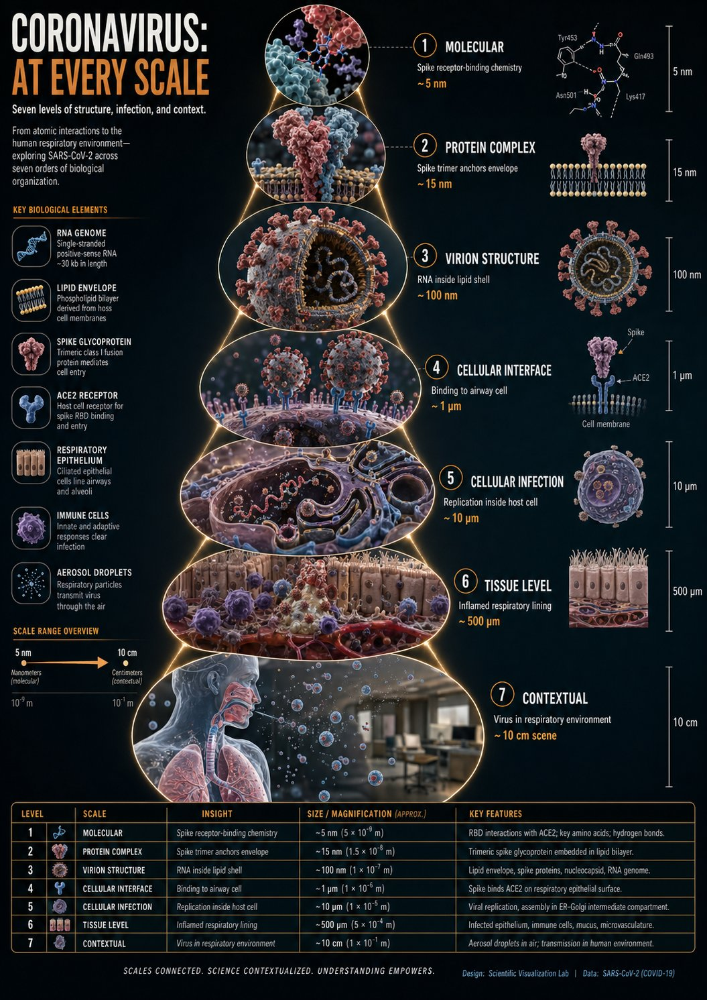

<details>
<summary>展开完整提示词</summary>

```text
instructions> [SUBJECT]=Coronavirus. A hyper-realistic 3D zoom-sequence infographic generated from a single input: [SUBJECT]. The system auto-detects scale layers from atomic/subcomponent to full contextual view. Layout Structure (CRITICAL) 6–8 circular or hexagonal frames arranged in expanding sequence Innermost frame = smallest detectable detail; outermost = full subject in environment Frames connected by subtle zoom-path lines No repeated scales — each frame shows new level of detail Frame Design Each zoom level includes: Hyper-detailed 3D render at that scale Micro label: scale name (e.g., "molecular," "cellular," "structural") + 3–5 word insight Optional: measurement tag or magnification factor Contextual Halo Around the sequence, include only scale-specific references: Measurement units, scientific notation, cultural scale metaphors (No generic magnifying glass icons) Scale Panel (Alternative Layout) Zoom level Key insight (3–5 words) Scale factor tag Detail icon (grid, wave, particle, etc.) Title "[SUBJECT]: AT EVERY SCALE" (or) "ZOOM: THE WORLD OF [SUBJECT]" Style: ultra-realistic 3D render, scientific editorial infographic, precise macro lighting, global illumination, shallow depth of field, clean sequential layout. </instructions>
```

</details>

## 90 年代公寓场景参考板 · v1

- [90 年代公寓场景参考板 · v1](../cases/case-awesome-gpt-image-2-381-9efc20798ac2/v1.md) — awesome-gpt-image-2 \#381

原图文案例 · gpt-image

**待复核：尚无补充核查，不代表必要输入已齐全**

已放大查看公寓正反机位及道具参考板，右上明确标SOURCE REF/REF INPUT并含缩略图。完整prompt将original photo列为输出板内缩略区，现有资产已含该缩略展示，但无法仅据此确认其真实输入来源及独立原文件关系；保留混合展示角色和待核对状态，不武断称缺图。

**图片角色尚未确认**


<details>
<summary>展开完整提示词</summary>

```text
{
  "type": "scene reference board — 90s apartment living room, cinematic night",
  "style": "cinematic film photography, 35mm grain, warm amber shadow fill, deep chiaroscuro lighting, hyper-detailed interior, production design reference quality",
  "layout": {
    "main_panel_center_left": {
      "label": "CAMERA A — FRONT VIEW",
      "scene": "Wide shot, L-shaped tan sectional sofa, grey knit throw blanket, wooden coffee table (remote, mug, ashtray, Rolling Stone stack), lava lamp left, table lamp right, rain-streaked city window behind, Nirvana poster left wall. 35mm grain."
    },
    "main_panel_center_right": {
      "label": "CAMERA B — REVERSE VIEW",
      "scene": "Wide reverse from behind sofa. CRT TV prominent right, grey static screen. Tall bookshelf, VHS tapes. Cool blue backlight from window behind camera. Deep shadow."
    },
    "prop_strip_bottom": "6 close-up tiles: 1. LAVA LAMP — chrome base, blue-green wax blobs; 2. COFFEE TABLE — remote, mug, ashtray, magazines; 3. NIRVANA POSTER — black smiley face, wall texture; 4. CRT TELEVISION — static screen, VHS stack; 5. WINDOW/RAIN — city bokeh, water streaks; 6. THROW BLANKET — sofa corner, worn upholstery",
    "top_right_inset": "SOURCE REF thumbnail — original photo",
    "footer": "2700K PRACTICAL · 4100K CITY NIGHT · 24mm · 35MM"
  },
  "background": "deep charcoal #1a1a1a, thin white separators",
  "dimensions": "wide landscape 3:1, high resolution"
}
```

</details>

## 春日花田三联竖版写真拼贴 · v1

- [春日花田三联竖版写真拼贴 · v1](../cases/case-awesome-gpt-image-2-382-d45e5dfc6063/v1.md) — awesome-gpt-image-2 \#382

原图文案例 · gpt-image

**已记录补充核查结果；以详情中的输入要求为准**

已核对原文输入要求与当前示例图；这是通用可替换主体/照片/标志模板，实际执行须由使用者提供相应输入，未发现必须另补某一指定源文件的明确要求。 审核只涉及资料输入要求/资产角色，不包含重新生图、身份一致性或像素复现验证。

**输出示例图**

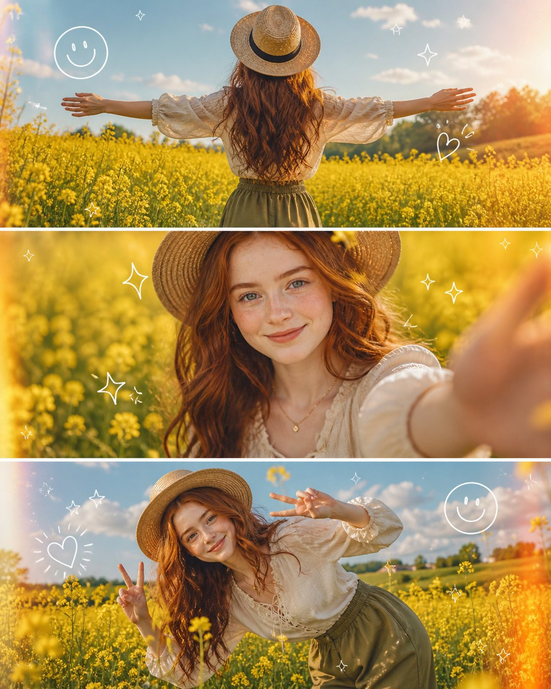

<details>
<summary>展开完整提示词</summary>

```text
A high-quality 3-panel vertical photo collage of a stunning uploaded woman with soft, voluminous wavy hair glowing in golden sunlight. She is styled in a cream-colored lace-up vintage blouse with delicate textures, olive green high-waisted flowy trousers, and a wide-brimmed straw hat slightly tilted for a fashionable editorial look. Light golden jewelry (thin chains, rings) adds a subtle luxury touch.

The setting is a dreamy, vibrant yellow mustard flower field under a bright blue sky with soft clouds, enhanced by golden hour lighting for a magical glow.

Top panel: Back view of the woman standing in the field with arms wide open, sunlight creating a glowing halo around her hair, slight motion blur in flowers for a cinematic feel.

Middle panel: Close-up portrait, she smiles naturally at the camera, wind softly moving her hair, her hand reaching toward the lens creating depth and a slightly blurred foreground for a DSLR effect.

Bottom panel: Playful pose, she leans sideways in the flowers, making a double peace sign, laughing candidly, capturing an authentic joyful moment.

Add cute, trendy white doodle overlays (smiley faces, sparkles, stars, tiny hearts) with a subtle animated/sketchy feel. Include light leaks, sun flares, and soft film grain for a premium Instagram aesthetic.

Ultra-realistic, 4K, cinematic lighting, shallow depth of field, high dynamic range, natural skin tones, editorial fashion photography, soft pastel color grading.

Aspect ratio: 4:5
Style tags: viral Instagram aesthetic, Pinterest style, dreamy spring vibe, candid luxury
```

</details>

## AI 日常生活 iPhone 抓拍 · v1

- [AI 日常生活 iPhone 抓拍 · v1](../cases/case-awesome-gpt-image-2-383-31fa721b28ca/v1.md) — awesome-gpt-image-2 \#383

原图文案例 · gpt-image

**已记录补充核查结果；以详情中的输入要求为准**

傍晚街头手持手机女子模糊抓拍，与普通生活快照要求相符。已实际看样图并阅读完整 prompt；复核资料关系与输入条件，不代表生成复现或逐项事实准确性验收。

**输出示例图**

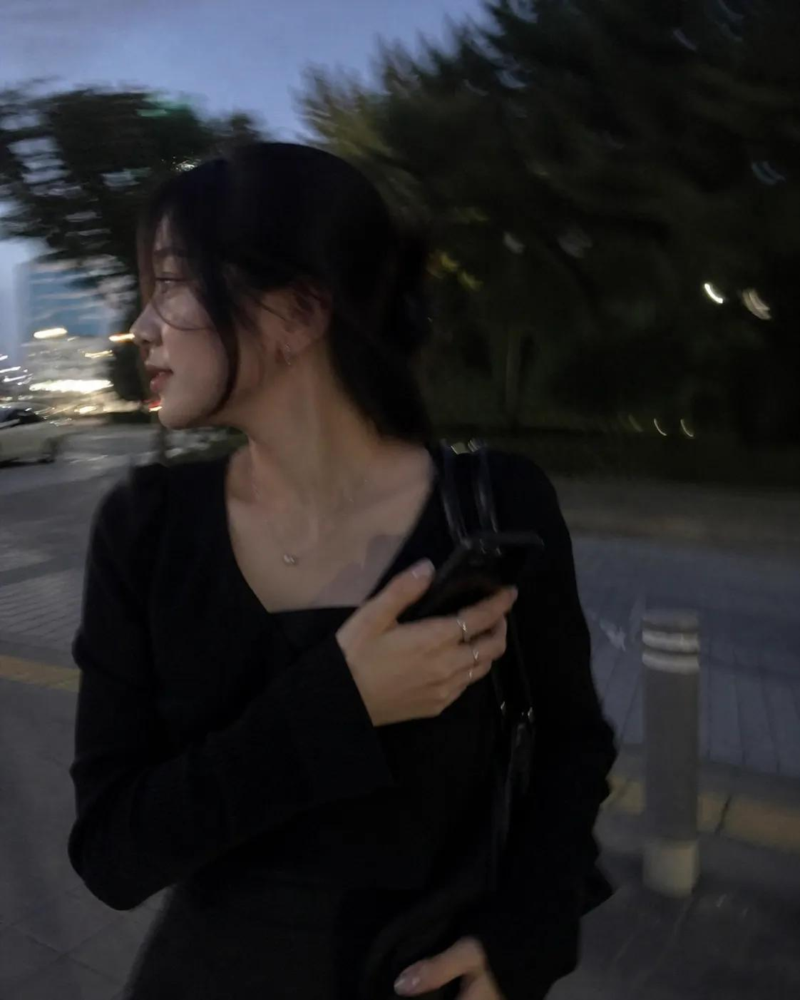

<details>
<summary>展开完整提示词</summary>

```text
I want to see what you really look like.
Draw a snapshot of your everyday life as if it were accidentally taken on an iPhone.
Make it feel like a very ordinary, imperfect candid shot.
The photo should have slight motion blur, with uneven, natural lighting.
```

</details>

## 十国传统服饰时尚拼贴 · v1

- [十国传统服饰时尚拼贴 · v1](../cases/case-awesome-gpt-image-2-384-df34912f8bdd/v1.md) — awesome-gpt-image-2 \#384

原图文案例 · gpt-image

**已记录补充核查结果；以详情中的输入要求为准**

已核对原文输入要求与当前示例图；这是通用可替换主体/照片/标志模板，实际执行须由使用者提供相应输入，未发现必须另补某一指定源文件的明确要求。 审核只涉及资料输入要求/资产角色，不包含重新生图、身份一致性或像素复现验证。

**输出示例图**


<details>
<summary>展开完整提示词</summary>

```text
A 10-Nation Cinematic Fashion Transformation of One Timeless BeautyChatGPT Prompt:

A highly aesthetic, ultra-realistic cinematic collage featuring the exact same beautiful young woman from the reference image, shown in 10 different poses within one single image layout (5x2 grid style). Each frame represents a different country’s traditional cultural dress, styled in a modern, elegant, fashion-forward way. The woman is the SAME person in every frame: she has shoulder-length wavy dark brown hair, captivating dark brown eyes, full plump lips with a subtle confident smile, flawless warm olive-toned skin, high cheekbones, and a voluptuous yet athletic figure with a prominent bust, slim waist, and toned physique — exactly matching the woman in the provided reference photo.

Design details:

Each of the 10 frames shows this same woman in different traditional outfits inspired by the following countries: Suriname, Guyana, Puerto Rico, Spain, Italy, India, Pakistan, Venezuela, Brazil, and the USA.

Every outfit is a modern, elegant, fashion-forward interpretation of that country’s cultural heritage.

Each mini-frame includes a small national flag icon in the top-right corner.

The woman’s expressions vary: smiling, confident, graceful, playful, elegant, royal, modern fusion fashion poses.

High-fashion editorial photography style.

Soft cinematic lighting, ultra-detailed textures, realistic skin tones.

Backgrounds subtly match each country’s cultural aesthetic (landmarks, streets, patterns, colors, architecture).

Luxury fashion magazine layout style.

Clean grid composition, visually balanced, highly shareable social media design.

Style: Ultra-realistic, 8K resolution, Vogue editorial shoot, cinematic lighting, soft depth of field, trending Instagram aesthetic, fashion photography masterpiece.
```

</details>

## 青岛啤酒灵感女装系列 · v1

- [青岛啤酒灵感女装系列 · v1](../cases/case-awesome-gpt-image-2-385-8b1effd149df/v1.md) — awesome-gpt-image-2 \#385

原图文案例 · gpt-image

**待复核：尚无补充核查，不代表必要输入已齐全**

已看图：唯一资产是手持青岛啤酒罐实拍，属于 input，而非提示词要求的女装设计结果。输入参考存在，输出缺失或未归档，不能误报 missing\_inputs。 审核只涉及资料输入要求/资产角色，不包含重新生图、身份一致性或像素复现验证。

**输入参考图**

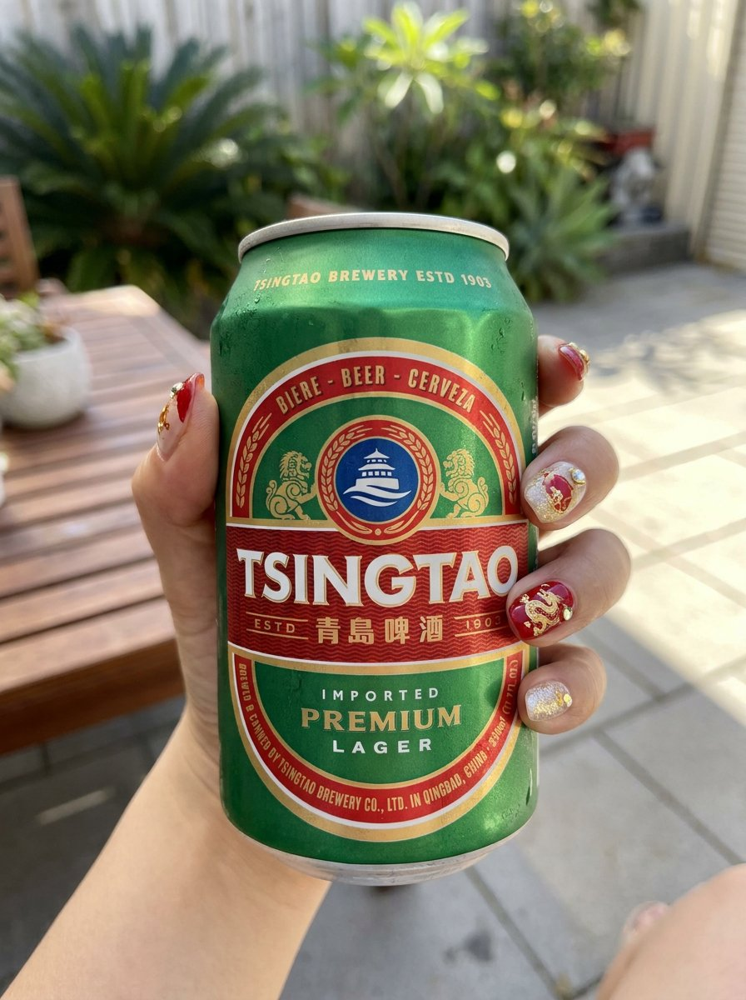

<details>
<summary>展开完整提示词</summary>

```text
Inspired by Tsingtao (China beer)🍺

“Inspired by this product, design a set of cool-style women's clothing”
```

</details>

## 品牌包络产品广告 · v1

- [品牌包络产品广告 · v1](../cases/case-awesome-gpt-image-2-386-a4cdfea5a647/v1.md) — awesome-gpt-image-2 \#386

原图文案例 · gpt-image

**已记录补充核查结果；以详情中的输入要求为准**

原文明确 any product photo、Different product each time；是可替换产品模板，当前图为四种品牌包装输出，使用者需提供新产品素材。 审核只涉及资料输入要求/资产角色，不包含重新生图、身份一致性或像素复现验证。

**输出示例图**

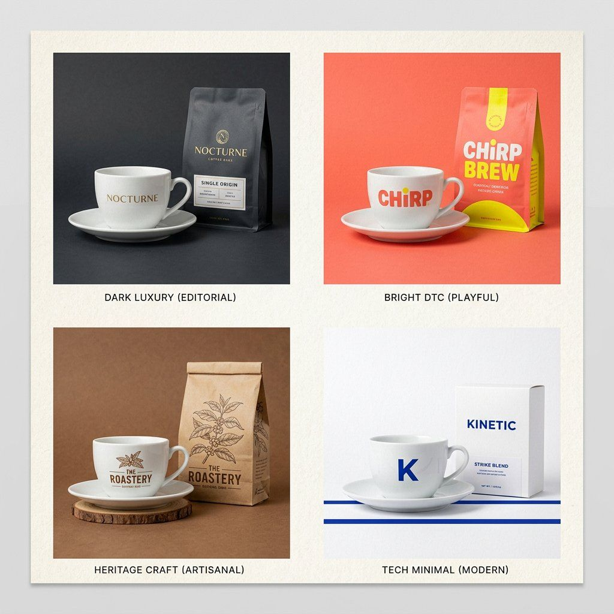

<details>
<summary>展开完整提示词</summary>

```text
The Brand Envelope | GPT Image-2 Prompt #89

This takes any product photo and wraps it in your specific brand world. Different product each time. Same brand, every time.

PHASE 1 / ANCHOR: Describe [BRAND IDENTITY] in 2 lines. Palette, texture, mood.
PHASE 2 / INJECT: Place [PRODUCT] inside that brand world, not the reverse.
PHASE 3 / FORMAT: Set [OUTPUT FORMAT]. Hero, square ad, or story.
PHASE 4 / SIGNATURE: Apply [BRAND ELEMENT]. Grain, shadow, or overlay.

Swap: [BRAND IDENTITY] / [PRODUCT] / [FORMAT]
```

</details>

## Netflix 首页主视觉 UI · v1

- [Netflix 首页主视觉 UI · v1](../cases/case-awesome-gpt-image-2-387-3852df04a629/v1.md) — awesome-gpt-image-2 \#387

原图文案例 · gpt-image

**已记录补充核查结果；以详情中的输入要求为准**

已核对原文输入要求与当前示例图；这是通用可替换主体/照片/标志模板，实际执行须由使用者提供相应输入，未发现必须另补某一指定源文件的明确要求。 审核只涉及资料输入要求/资产角色，不包含重新生图、身份一致性或像素复现验证。

**输出示例图**


<details>
<summary>展开完整提示词</summary>

```text
Create a Netflix homepage UI featuring a main hero film with its title and still generated from the uploaded reference.
```

</details>

## 1980s Claude 复古杂志广告 · v1

- [1980s Claude 复古杂志广告 · v1](../cases/case-awesome-gpt-image-2-388-a62074957359/v1.md) — awesome-gpt-image-2 \#388

原图文案例 · gpt-image

**已记录补充核查结果；以详情中的输入要求为准**

一家三口围绕CRT电脑与Claude标题的复古广告。已阅读全文并查看样图，图片为结果示例；未发现必须补充某一指定输入图片。

**输出示例图**


<details>
<summary>展开完整提示词</summary>

```text
A fictional 1980s magazine advertisement poster introducing “Claude” as a revolutionary home AI assistant, retro commercial print ad style, bold headline at the top reading “Introducing Claude!”, large chrome metallic 3D typography with pink and blue reflections, yellow italic tagline underneath: “The AI assistant that talks back.”

Center composition: a beige 1980s CRT home computer with chunky keyboard on a wooden desk, green monochrome terminal screen glowing, readable text on screen: “Claude”, subtitle: “The helpful AI assistant.” On the screen, a retro terminal-style conversation reads:
“YOU: How can you help me today?”
“CLAUDE: I can answer questions, help you write, summarize information, brainstorm ideas, and explain topics clearly.”
“YOU:”

A cheerful 1980s family of three gathers around the computer: father in a blue sweater, mother with curly hair in a pink sweater, young boy in a striped sweater, all looking amazed, delighted, and fascinated, warm nostalgic expressions, classic family technology advertising mood.

Background: dark starry night sky, purple and blue neon perspective grid, retro sci-fi glow, subtle palm silhouettes, sparkling highlights, lens flares, dramatic yet friendly atmosphere.

Poster layout: left side contains stacked retro feature boxes with glowing neon icons, including a question mark, pencil, light bulb, and clock. Each feature box includes short retro advertising copy:
“ANSWERS QUESTIONS” — Get helpful, clear answers in everyday language.
“HELPS YOU WRITE” — Draft ideas, notes, letters, and more with ease.
“GENERATES IDEAS” — Brainstorm, create, and think bigger.
“AVAILABLE WHENEVER YOU NEED IT” — Day or night, Claude is ready to help.

Add a small retro text block describing Claude:
“For the first time, an AI assistant you can have a conversation with. Ask questions. Get answers. Share ideas. Write drafts, notes, and reports. Explore topics, organize thoughts, and solve problems. Claude understands natural language and responds in a clear, helpful way.”

Add a short highlighted copy block:
“It’s helpful. It’s thoughtful.
It’s always by your side.”

Bottom area includes a large “Claude” brand wordmark with colorful diagonal retro stripes, and the slogan:
“A smarter way to think, write, and explore.”

Bottom right has a white promotional price sticker area with bold pink text:
“Free!!”
Smaller text underneath:
“Available now for curious minds everywhere.”

Top right has a bright yellow starburst badge saying:
“A REVOLUTION IN AI ASSISTANCE!”

Include a retro product box on the desk labeled “Claude” with small text:
“SMARTER SOFTWARE FOR MODERN THINKERS.”

Include a mug or accessory on the desk branded “Claude”.

Visual style: 1985 consumer computer advertisement, airbrushed illustration, glossy print texture, halftone details, nostalgic retro futurism, high saturation, cinematic product lighting, authentic 1980s typography and layout, readable ad composition, detailed vintage commercial poster, highly polished, warm family-friendly mood, retro tech fantasy, vertical poster.

Negative prompts:
modern laptop, smartphone, flat design, minimalism, futuristic 2020s interface, cyberpunk overload, messy layout, unreadable typography, distorted text, misspelled words, deformed hands, extra fingers, bad anatomy, duplicate people, plastic skin, overexposed lighting, low resolution, blurry image, warped computer, broken keyboard, cluttered composition, inconsistent vintage style, random symbols, ugly poster design, poor hierarchy, incorrect perspective
```

</details>

## Transparent Labs Hydrate 健身补剂 Campaign · v1

- [Transparent Labs Hydrate 健身补剂 Campaign · v1](../cases/case-awesome-gpt-image-2-389-1bb40da06ab7/v1.md) — awesome-gpt-image-2 \#389

原图文案例 · gpt-image

**已记录补充核查结果；以详情中的输入要求为准**

已核对原文输入要求与当前示例图；这是通用可替换主体/照片/标志模板，实际执行须由使用者提供相应输入，未发现必须另补某一指定源文件的明确要求。 审核只涉及资料输入要求/资产角色，不包含重新生图、身份一致性或像素复现验证。

**输出示例图**

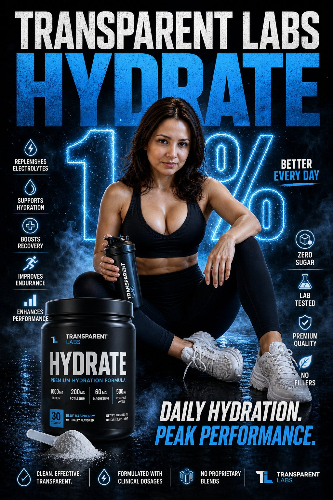

<details>
<summary>展开完整提示词</summary>

```text
Create a striking campaign poster that stops people mid-scroll for Transparent Labs Hydrate.

Bold high-impact supplement advertisement with dramatic black and deep electric blue color palette, gritty premium fitness aesthetic, sharp cinematic lighting, glossy reflections, light smoke atmosphere, intense contrast.

Giant headline typography at top reading “TRANSPARENT LABS HYDRATE” in oversized distressed white and electric blue text.

Center composition features the exact woman from the attached reference image as a fit athletic female model seated confidently on a studio floor, holding a shaker bottle, with a focused and powerful expression.

Change her clothes into sleek black fitness gym outfit: a black sports bra / tank top and high-waisted black leggings with chunky white sneakers. Large glowing “1%” graphic behind the subject symbolizing daily progress.

Front left foreground shows a matte black Transparent Labs Hydrate tub with modern luxury label reading “HYDRATE”, scoop of electrolyte powder spilled beside the container.

Surround the poster with clean icon-based benefit callouts: replenishes electrolytes, supports hydration, boosts recovery, improves endurance, enhances performance, zero sugar, lab tested, premium quality, no fillers. Strong motivational copy such as “Daily Hydration. Peak Performance.”

Hyper realistic textures, polished commercial retouching, premium sports nutrition branding, modern typography layout, social media ad format, ultra detailed, high resolution.
```

</details>

## 羊毛毡国家微缩世界 · v1

- [羊毛毡国家微缩世界 · v1](../cases/case-awesome-gpt-image-2-390-1ef8db420030/v1.md) — awesome-gpt-image-2 \#390

原图文案例 · gpt-image

**已记录补充核查结果；以详情中的输入要求为准**

已实际看图并阅读全文。土耳其地标、渡轮电车及市井毛毡微缩世界；国家名为替换参数。 本次核对资料关系、图片角色和输入条件，不代表身份、事实或逐像素生成正确性验收。

**输出示例图**


<details>
<summary>展开完整提示词</summary>

```text
Country: [INSERT COUNTRY NAME]

A miniature felt diorama made of fluffy yarn, wool, and needlework, designed as a single cohesive small world (not a collage), reflecting the real landscape, culture, and daily life of the country.

Structure:
- Select 4–7 naturally integrated elements (landscape, architecture, transport, street life, culture)
- Everything must flow together as one environment

Foreground:
Everyday life — small shops, cafes, markets, people interacting, local clothing, street details, subtle movement, warm human presence

Midground:
Connecting flow — streets, bridges, rivers, paths, transport, cultural spaces that guide the eye naturally from front to back

Background:
One strong identity anchor — landmark, skyline, mountain, or symbolic landscape clearly representing the country (keep it clean, not overcrowded)

Style:
Handmade wool felt, yarn, needle-felt textures, visible fibers, soft edges, miniature craftsmanship, premium diorama realism

Lighting:
Warm golden hour or bright noon, soft shadows, clear visibility, gentle glow enhancing depth

Color:
Soft but saturated palette reflecting the country’s natural tones (greens, sky blues, architectural hues, cultural accents), warm and balanced

Composition:
Vertical frame, balanced or centered perspective, slight top-down or immersive angle, clear foreground–midground–background depth

Mood:
Warm, emotional, calm, refined — like a handcrafted fairy-tale version of real life (not childish)

Rules:
- No logos or text overlays
- No collage-style composition
- No random symbolic clutter
- Keep it realistic but stylized as a handmade miniature world

Quality:
16K, ultra-detailed, hyper-realistic miniature textures, cinematic depth, sharp focus

output_goal:
A single, cohesive felt diorama world that instantly conveys the identity and atmosphere of the chosen country through integrated landscape, culture, and daily life
```

</details>

## 四国文化锚点服装设计宫格 · v1

- [四国文化锚点服装设计宫格 · v1](../cases/case-awesome-gpt-image-2-391-73ab02a863ab/v1.md) — awesome-gpt-image-2 \#391

原图文案例 · gpt-image

**已记录补充核查结果；以详情中的输入要求为准**

实际查看：Bhutan、Uzbekistan、Laos、Mongolia四格服装设计。已通读完整归档指令；图像为该创作方向的结果样例，文本未要求某张特定外部原图。含可替换主题、人物或参数，样例可采用不同填充值；不把通用占位符视为缺少指定图片。

**输出示例图**


<details>
<summary>展开完整提示词</summary>

```text
<instructions> input: continent pick 4 lesser known countries in that continent function drawx($lesser known country){ > Anchor 1: "$lesser known's famous architecture" (it's texture, material and color) > Anchor 2: "$lesser known's famous fashion " (it's texture, material and color) > Anchor 3: "$lesser known's famous food " (it's texture, material and color) > > **Instruction:** Render a dress design that exists at the exact center of this triangle. } output: 2x2 grid, drawx( for each lesser known country)
```

</details>

## 头发里的微型城市 · v1

- [头发里的微型城市 · v1](../cases/case-awesome-gpt-image-2-392-224206b0b055/v1.md) — awesome-gpt-image-2 \#392

原图文案例 · gpt-image

**已记录补充核查结果；以详情中的输入要求为准**

头发中微缩楼群、发际线和额头可见，完整超现实输出。已实际看样图并阅读完整 prompt；复核资料关系与输入条件，不代表生成复现或逐项事实准确性验收。

**输出示例图**


<details>
<summary>展开完整提示词</summary>

```text
Macro photograph of a miniature city hidden in human hair, clearly on a real human head, with part of the forehead and hairline visible, realistic skin texture with pores, tiny people walking through the streets between the hair strands, extremely small but realistic proportions, macro photography, 85mm lens, shallow depth of field, natural lighting, neutral colors, no warm tones, ultra realistic hair with visible roots, natural imperfections, slightly messy strands, realistic materials, slightly dirty buildings, no perfect surfaces, photorealistic, looks like a real photo, no illustration, no CGI, no glow
```

</details>

## Y2K 金色时刻人像 · v1

- [Y2K 金色时刻人像 · v1](../cases/case-awesome-gpt-image-2-393-b5550ae3d493/v1.md) — awesome-gpt-image-2 \#393

原图文案例 · gpt-image

**已记录补充核查结果；以详情中的输入要求为准**

棕榈树背景下粉衣金发女性的暖光人像。已阅读全文并查看样图，图片为结果示例；未发现必须补充某一指定输入图片。

**输出示例图**


<details>
<summary>展开完整提示词</summary>

```text
candid portrait of a beautiful young blonde woman, 21 years old, glowing sun-kissed skin, wearing a baby pink velour tracksuit and butterfly clips in her hair, smiling brightly at the camera, golden hour warm light, palm trees, y2k aesthetic, glossy lips
```

</details>

## 中世纪村庄双精灵冒险者 · v1

- [中世纪村庄双精灵冒险者 · v1](../cases/case-awesome-gpt-image-2-394-8721e6233cda/v1.md) — awesome-gpt-image-2 \#394

原图文案例 · gpt-image

**已记录补充核查结果；以详情中的输入要求为准**

已实际看图并阅读全文。中世纪街道双精灵女性；文案给出场景与服装，脸部遮挡指令未体现在样图，本次只确认图文关联与无输入依赖。 本次核对资料关系、图片角色和输入条件，不代表身份、事实或逐像素生成正确性验收。

**输出示例图**

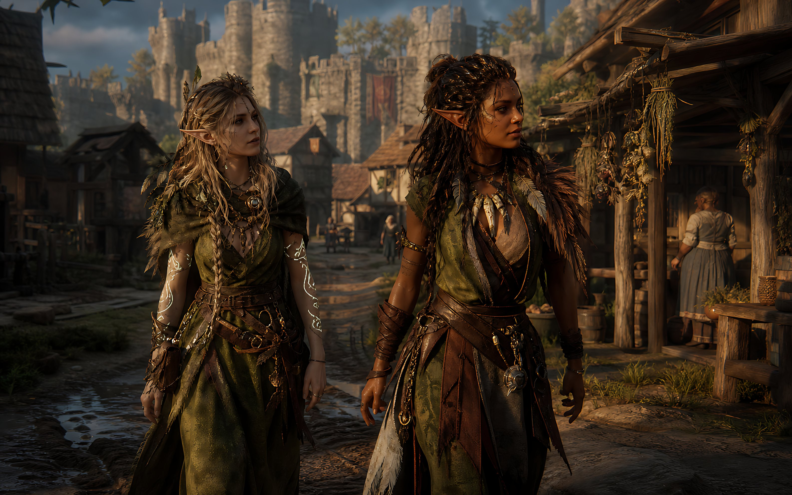

<details>
<summary>展开完整提示词</summary>

```text
Create a cinematic dark-fantasy medieval street scene in ultra-realistic 3D game concept art style, widescreen 16:9. In the foreground, show two adult elven adventurers walking side by side toward the viewer through a muddy cobblestone village road. The left character is a pale-skinned elf woman with long messy {argument name="left character hair color" default="ash blonde"} braided hair, pointed ears, layered olive-green druid robes, leather belts, pouches, dangling metal charms, necklaces, torn fabric strips, leaf-and-feather details, and glowing white vine-like magical tattoos spiraling down both forearms. The right character is a darker-skinned elf woman with long thick {argument name="right character hair color" default="dark brown"} dreadlocked hair, pointed ears, a green-and-brown leather ranger outfit, fur shoulder mantle, feather ornaments, arm wraps, belts, chains, talismans, and a confident warrior posture. Both faces are intentionally hidden by plain opaque {argument name="face covering color" default="dark brown"} square censor blocks, centered over their faces. Set the background in a richly detailed medieval market village with timber-and-thatch houses, hanging bundles of dried herbs on the right-side shopfront, barrels, baskets, wooden stalls, distant townspeople, and a large stone castle with towers and battlements rising in the background. Use {argument name="lighting mood" default="warm late-afternoon golden sunlight"}, dramatic shadows, volumetric haze, shallow depth of field, realistic fabric and leather textures, high detail, moody fantasy atmosphere, cinematic composition, Unreal Engine quality, no text, no logos.
```

</details>

## 骑士法师大战石像魔像 · v1

- [骑士法师大战石像魔像 · v1](../cases/case-awesome-gpt-image-2-395-50fb412453c6/v1.md) — awesome-gpt-image-2 \#395

原图文案例 · gpt-image

**已记录补充核查结果；以详情中的输入要求为准**

实际查看：教堂废墟中持盾战士对抗石像魔像。已通读完整归档指令；图像为该创作方向的结果样例，文本未要求某张特定外部原图。

**输出示例图**

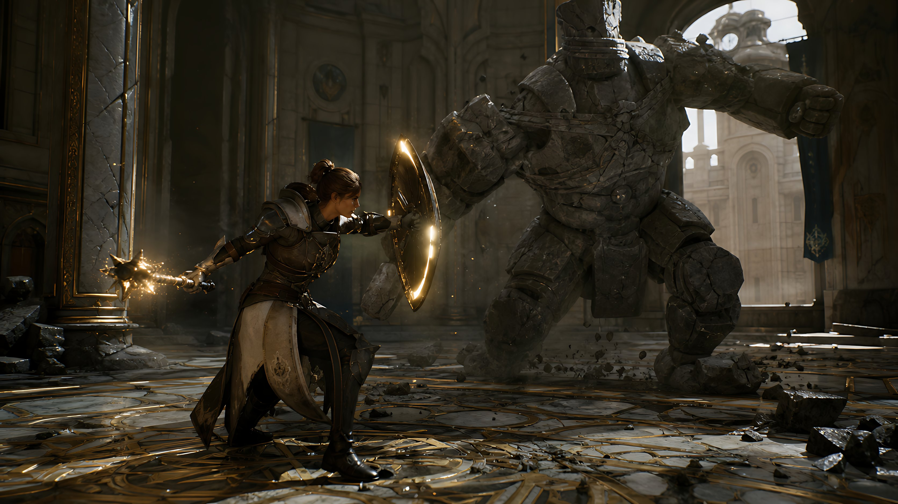

<details>
<summary>展开完整提示词</summary>

```text
Create a cinematic dark fantasy action scene in a ruined cathedral hall: a {argument name="hero type" default="female armored knight-mage"} crouches in a defensive lunge on the left foreground, wearing ornate dark steel and leather plate armor with a long cream-and-black tabard, one arm extended behind her gripping a spiked mace or morning star crackling with golden magic sparks, the other arm braced forward behind a round glowing shield rimmed with warm light. Opposite her in the right midground is a massive {argument name="enemy type" default="headless stone golem"}, built from cracked gray masonry plates and bound with broken chains, charging with one huge fist raised and rubble falling from its body. Set the battle inside a grand, damaged palace-cathedral interior with towering arches, carved stone columns, tall broken windows, gold-trimmed marble floor in circular geometric patterns, scattered chunks of stone, dust, and debris. Use dramatic backlighting from a bright arched window behind the golem, warm golden magical highlights on the shield and weapon, deep shadows, volumetric dust beams, realistic textures, high-detail armor and stone, dynamic low-angle wide composition, shallow cinematic depth, epic game-cinematic realism, 16:9 widescreen, no text, no UI.
```

</details>

## 龙类物种复古百科海报 · v1

- [龙类物种复古百科海报 · v1](../cases/case-awesome-gpt-image-2-396-a06719b97c6f/v1.md) — awesome-gpt-image-2 \#396

原图文案例 · gpt-image

**已记录补充核查结果；以详情中的输入要求为准**

羊皮纸龙类百科页，龙主图和骨骼小图为成品模块。已实际看样图并阅读完整 prompt；复核资料关系与输入条件，不代表生成复现或逐项事实准确性验收。

**输出示例图**

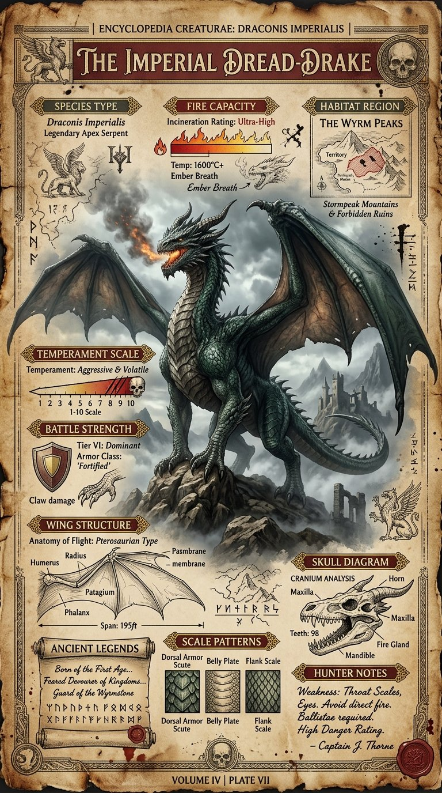

<details>
<summary>展开完整提示词</summary>

```text
Create a highly detailed A4 vertical vintage fantasy encyclopedia style dragon species poster.

Style: medieval creature atlas, ancient mythology manuscript, museum fantasy archive, old explorer journal.

Main subject:
a massive hyper realistic dragon standing proudly in center with detailed scales, smoke from nostrils, giant wings partially open.

Background:
stormy mountains, ancient ruins, fog layers, burnt parchment texture.

Color palette:
dark emerald, ash gray, faded gold, ancient brown, deep crimson.

Include infographic sections:
Species Type,
Fire Capacity,
Wing Structure,
Temperament Scale,
Habitat Region,
Battle Strength,
Ancient Legends,
Scale Patterns,
Skull Diagram,
Hunter Notes.

Add:
engraved fantasy sketches,
ancient symbols,
old map textures,
ink grain,
collectible poster layout.

NO modern UI.
NO futuristic elements.
NO flat minimalism.

Ultra detailed.
8K printable masterpiece.
```

</details>

## 街舞角色设定参考图 · v1

- [街舞角色设定参考图 · v1](../cases/case-awesome-gpt-image-2-397-bf10a0d7fef3/v1.md) — awesome-gpt-image-2 \#397

原图文案例 · gpt-image

**已记录补充核查结果；以详情中的输入要求为准**

四个街舞动态全身及三个头部视角的角色表。已阅读全文并查看样图，图片为结果示例；未发现必须补充某一指定输入图片。

**输出示例图**


<details>
<summary>展开完整提示词</summary>

```text
角色设定图布局，聚焦于一位18岁的亚裔女性街舞舞者。包含4个大型、高细节度的全身动态舞姿（突出舞蹈动作，面部清晰）。侧边附一条清晰的多角度参考条，仅含3个精细头部特写（正面、侧面、3/4侧面）。最大限度减少文字元素，将像素空间优先用于面部细节刻画。背景为粗砺工业风，搭配写实光影效果
```

</details>

## 8 套日常穿搭编辑拼贴 · v1

- [8 套日常穿搭编辑拼贴 · v1](../cases/case-awesome-gpt-image-2-398-a6ef2d6c07e1/v1.md) — awesome-gpt-image-2 \#398

原图文案例 · gpt-image

**已记录补充核查结果；以详情中的输入要求为准**

已实际看图并阅读全文。八套女性穿搭自由拼贴；me和height为复用主体条件，保持本人脸需另供自己的照片，未指名特定归档源图。 本次核对资料关系、图片角色和输入条件，不代表身份、事实或逐像素生成正确性验收。

**输出示例图**


<details>
<summary>展开完整提示词</summary>

```text
Create a freeform fashion-editorial collage of me in 8 distinct full-body casual wear, arranged organically on a clean cream studio backdrop. Keep my face identical across all looks, w/ consistent proportions that visually read as around (height) w/o stating height. Include subtle handwritten-style arrows & labels highlighting key pieces. Avoid any grids, borders, or boxed layouts.
```

</details>

## 唱片公司楼梯间写真人像 · v1

- [唱片公司楼梯间写真人像 · v1](../cases/case-awesome-gpt-image-2-399-60ef4a857e9d/v1.md) — awesome-gpt-image-2 \#399

原图文案例 · gpt-image

**已记录补充核查结果；以详情中的输入要求为准**

实际查看：混凝土楼梯坐姿女性、纸箱及胶带。已通读完整归档指令；图像为该创作方向的结果样例，文本未要求某张特定外部原图。

**输出示例图**

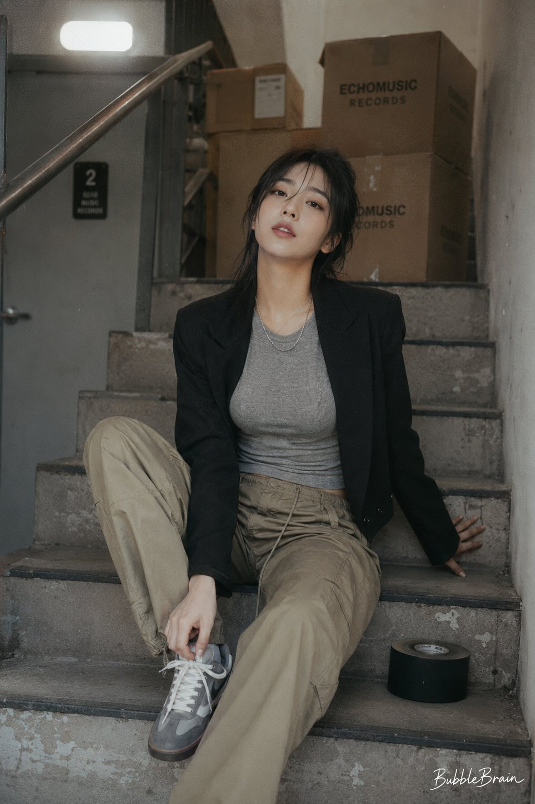

<details>
<summary>展开完整提示词</summary>

```text
Use case: photorealistic-natural
Asset type: cinematic portrait image, final target size 1216x1536 portrait

Create a photorealistic image of a fictional adult Korean female idol in her mid-20s, not resembling any real celebrity. Maintain a Japanese negative film look: soft overexposure, faded neutrals, low contrast, subtle grain, and imperfect snapshot framing.

Scene/backdrop: the back stairwell of a small record label building, with moving boxes, scuffed concrete steps, a gray metal handrail, and a pale security light. The atmosphere should feel quiet, slightly intimate, and workaday, as if caught in a private in-between moment after practice and during moving day.

Subject: a Korean female idol with a naturally attractive, understated sensuality rather than overt glamour. She should feel quietly magnetic, relaxed, and a little teasing without being provocative.

Wardrobe/props: a slightly cropped black blazer worn casually and slightly open, over a fitted heather-gray ribbed tee that softly outlines the figure without revealing cleavage, loose khaki cargo pants sitting naturally on the waist, a thin silver chain necklace, a roll of black gaffer tape placed beside her, and one sneaker lace still half-tied. The styling should feel subtly sexier and more feminine than purely casual, but still fully modest and non-revealing.

Composition/framing: tall portrait. The subject is seated on the stairs with one knee slightly raised and one leg relaxed lower on the step, leaning back lightly with one hand braced behind her on the stair for support. The other hand is near her half-tied sneaker, as if she has just paused while tying it. Her blazer falls naturally along the body, her posture creating a soft, elegant silhouette. Her head is tilted up toward the camera with a calm, slightly sultry, self-possessed expression. The pose should feel candid yet subtly alluring, natural rather than staged.

Lighting/mood: flat stairwell light, understated backstage realism, soft grain, muted tones, gentle highlight bloom, and a quiet intimate mood. Keep the image photorealistic, restrained, and cinematic, with no excessive glamour and no nudity.

Add small white handwriting signature text "BubbleBrain" on the bottom right corner.

--2:3
```

</details>

## 多风格签名选择海报 · v1

- [多风格签名选择海报 · v1](../cases/case-awesome-gpt-image-2-400-3488b5ce02ba/v1.md) — awesome-gpt-image-2 \#400

原图文案例 · gpt-image

**已记录补充核查结果；以详情中的输入要求为准**

六张姓名签名风格卡，输入只需姓名文本。已实际看样图并阅读完整 prompt；复核资料关系与输入条件，不代表生成复现或逐项事实准确性验收。

**输出示例图**

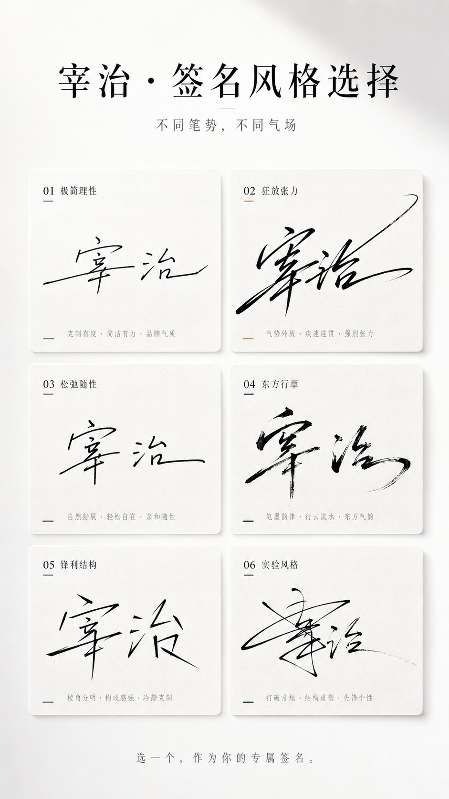

<details>
<summary>展开完整提示词</summary>

```text
你是一个高端签名设计系统 + 风格人格视觉系统。

任务：
仅基于用户输入的「姓名」，生成一张「多风格签名选择海报（卡片式结构）」。
目标是把名字转译为具有笔势、气质与力量感的签名设计系统，让用户产生选择欲、认同感和分享欲。

输入信息：
姓名：[输入你的昵称]
禁止要求额外信息，必须自动完成气质与风格推断。

隐藏执行逻辑：
1. 字形与笔势分析：
- 结构：疏密、横竖比例、重心位置
- 节奏：连贯、停顿、爆发、收束
- 适配：连笔程度、草写程度、变形空间

2. 气质推断：
清冷、张扬、克制、商业、文艺、松弛、锋利、高级。

3. 生成 6 个签名分支：
- 全部适配该姓名
- 每一个都有明确书写风格
- 差异来自笔势、节奏、结构和收笔方式

整体画面：
9:16 竖版海报，极简、高级、干净、有设计感、适合传播。
背景使用纯白或极浅灰渐变，留白不少于 40%。

顶部标题区：
主标题可用：
「你的名字，适合哪种签名？」
或：
「[姓名] · 签名风格选择」
副标题：
「不同笔势，不同气场」
排版为黑色与灰色，高级字距，留白充足。

签名卡片区域：
使用整齐网格卡片布局，推荐 2 列 × 3 行，共 6 个卡片。
每个卡片统一尺寸、统一间距、整体对齐干净。

卡片样式：
- 轻微圆角 8-16px
- 无明显边框，或极细描边
- 极轻阴影
- 背景为纯白微差、极浅灰，或轻微宣纸 / 磨砂质感
视觉目标接近高级杂志排版，避免强 UI 感、厚卡片和 App 组件感。

签名生成规则：
签名必须基于书写动作生成，避免只做字体变形。
每一个签名风格在生成前，先确定一套明确书写行为规则：
1. 起笔方式：轻触起笔、重压起笔、直接横扫、从左下进入或从中段切入。
2. 连笔结构：前两个字强连笔后面断开、全连笔一气呵成、只连接偏旁。
3. 节奏变化：快到慢再收、慢到爆发再拉伸、或均匀节奏。
4. 结构变形：横向拉长、垂直压缩、整体右倾或左倾、字间重叠或错位。
5. 收笔设计：尾笔长甩、突然收断、回钩、渐隐收尾。

6 种签名方向：
1. 极简理性：接近品牌签名
2. 狂放张力：强烈连笔和拉伸
3. 松弛随性：手写感强
4. 东方行草：飞白和墨感
5. 锋利结构：几何感和断裂
6. 实验风格：允许部分不可读，但需要强设计感

色彩策略：
整体以黑、灰、白为主。每个卡片允许一个极轻微点缀色，例如冷灰蓝、香槟金、墨黑、暖棕、深绿。
避免大面积色块和花哨配色。

底部互动区：
底部居中加入小号灰字：
「选一个，作为你的专属签名。」
或：
「你是第几种？」

光影与质感：
高级棚拍光、柔光环境、细腻阴影、干净空气感。
质感参考 Apple 发布会视觉和高端品牌视觉。

禁止项：
不要字体拼贴，不要普通书法字，不要 UI 卡片风，不要颜色杂乱，不要签名太小，不要排版松散，不要缺乏笔势，不要模板拼接感。

最终目标：
生成一张高级、干净、有秩序、有笔势张力的 6 风格签名选择海报。
用户一眼能选出最像自己的一款签名。
```

</details>

## Lost in 国家旅行海报拼贴 · v1

- [Lost in 国家旅行海报拼贴 · v1](../cases/case-awesome-gpt-image-2-401-f8523f197913/v1.md) — awesome-gpt-image-2 \#401

原图文案例 · gpt-image

**已记录补充核查结果；以详情中的输入要求为准**

巴西地标与旅行者拼贴，LOST IN BRAZIL标题。已阅读全文并查看样图，图片为结果示例；未发现必须补充某一指定输入图片。

**输出示例图**

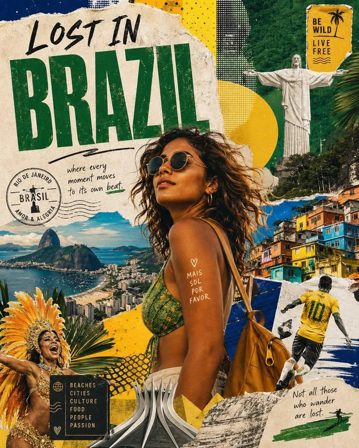

<details>
<summary>展开完整提示词</summary>

```text
Create a stylized travel poster / graphic collage for [country]. The main subject should be a stylish international tourist visiting [country], clearly presented as a traveler and not a local resident. Show the tourist wearing modern travel fashion, with details such as a camera, backpack, sunglasses, map, or suitcase, exploring the culture and atmosphere of [country]. Place the tourist in a dynamic composition surrounded by iconic architecture, streets, landscapes, landmarks, transportation, food, signage, and cultural elements associated with [country]. Blend realistic character detail with a graphic collage background made of layered paper textures, torn poster edges, sticker elements, halftone dots, editorial typography, and bold geometric shapes. Include authentic visual motifs from [country], but keep the tourist's appearance and styling globally fashionable and clearly foreign to the setting. Add a large readable headline: "LOST IN [country]". Modern, artistic, premium editorial travel poster aesthetic, balanced layout, print-worthy composition.
```

</details>

## 3D 小红书个人资料卡 · v1

- [3D 小红书个人资料卡 · v1](../cases/case-awesome-gpt-image-2-402-44454ab4c140/v1.md) — awesome-gpt-image-2 \#402

原图文案例 · gpt-image

**已记录补充核查结果；以详情中的输入要求为准**

已实际看图并阅读全文。手持小红书资料卡、镂空处坐小人；文字定义3D构图，UI缩略图属于输出。 本次核对资料关系、图片角色和输入条件，不代表身份、事实或逐像素生成正确性验收。

**输出示例图**

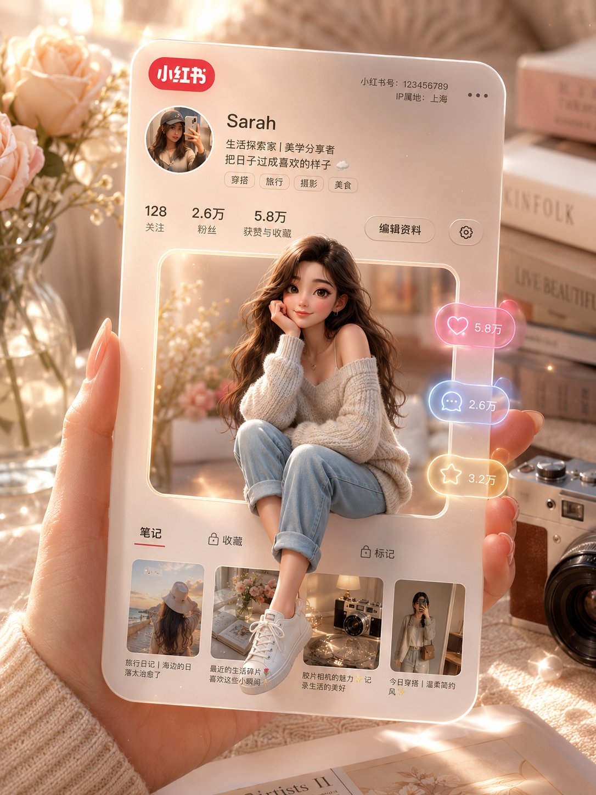

<details>
<summary>展开完整提示词</summary>

```text
一只手中握着一张3D小红书个人资料卡，卡片中间方形镂空，一个女孩随意地坐在卡片镂空的边缘，温暖的米色和柔和的粉彩美学背景，逼真的深度和阴影，电影般的柔和光线，闪亮光滑的纹理，小红书风格的UI，漂浮的互动图标（点赞、评论、分享）带有发光的霓虹效果，闪光和光晕，背景中温馨的美学布置包括书籍、花瓶里的花和一台复古相机，梦幻氛围，Pixar风格+半现实主义融合，超高品质，4K，居中构图，高端影响者美学
```

</details>

## 小红书数字破屏 3D 女孩 · v1

- [小红书数字破屏 3D 女孩 · v1](../cases/case-awesome-gpt-image-2-403-933800363691/v1.md) — awesome-gpt-image-2 \#403

原图文案例 · gpt-image

**已记录补充核查结果；以详情中的输入要求为准**

实际查看：女性从透明小红书手机画面中伸脚跨出。已通读完整归档指令；图像为该创作方向的结果样例，文本未要求某张特定外部原图。

**输出示例图**

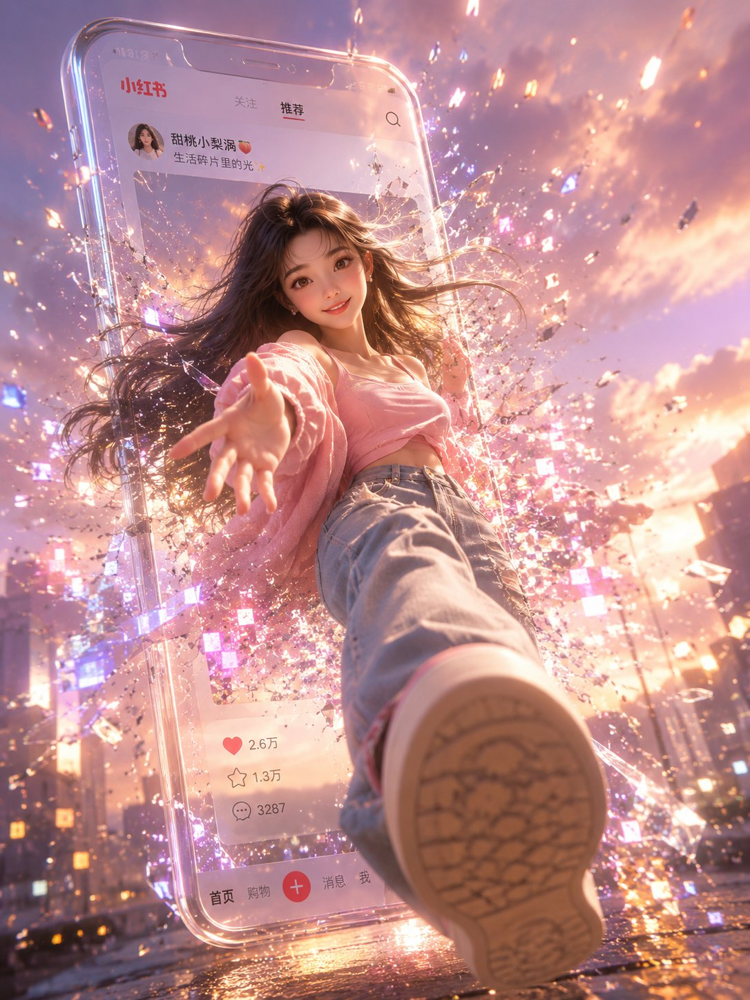

<details>
<summary>展开完整提示词</summary>

```text
将一位气质绝佳的女孩放置在一个显示小红书帖文的3D透明玻璃手机画面中，并重新调整她的身体姿势，使她看起来像是正从屏幕中突破、进入现实世界。其中一只脚必须强烈地朝向观者延伸，采用戏剧化的 3D 透视效果，创造出强烈的深度感与沉浸感。整体姿势需要具有动态感、自然且符合人体结构，就像是在从屏幕中跨步而出的瞬间。

手机屏幕边缘出现真实细腻的玻璃裂纹与数字粒子效果，大量发光的像素碎片与光粒向外扩散，形成富有未来感的“数字破屏”视觉特效。所有碎片与光效自然围绕人物运动方向展开，具有电影级空间层次感。

整体画面采用温暖米色、柔粉色与梦幻紫色渐变背景，结合金粉色夕阳光斑与电影级柔光渲染。Pixar风格与半现实主义融合，超精细材质，柔和景深，电影感光影，8K超高清品质。

将画面优化为竖版【9:16】比例（1080×1440），适用于社交媒体展示。
```

</details>

