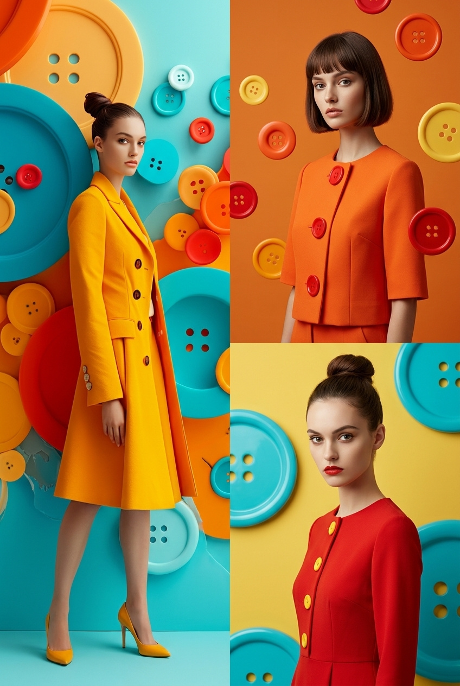
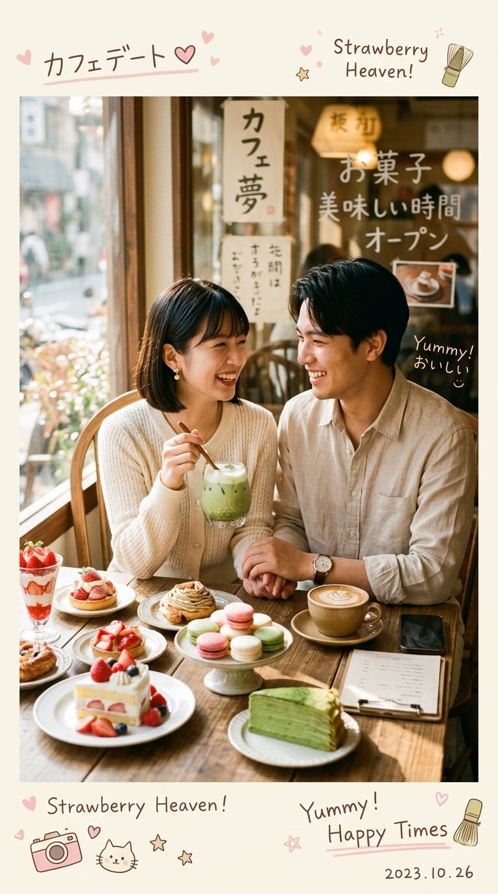
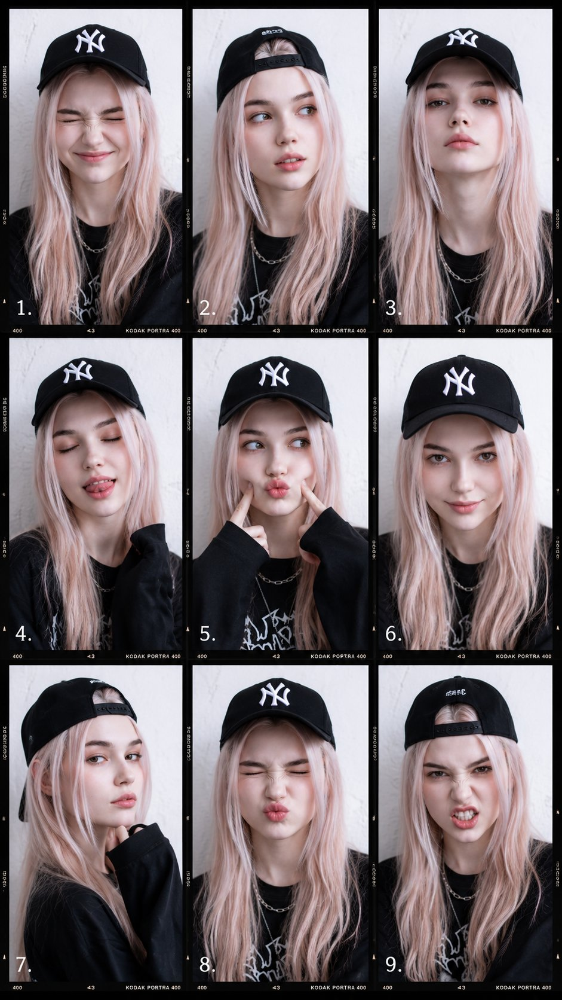

<!-- Generated by scripts/gallery.py; edit authoritative JSON, then rebuild. -->

# 全部案例 · 第 17 册

[画廊总览](gallery.md) | [上一册](gallery-part-16.md) | [下一册](gallery-part-18.md)

本册 25 个案例。标题链接固定到所示版本。

## 豪华社媒破屏商业广告 · v1

- [豪华社媒破屏商业广告 · v1](../cases/case-awesome-gpt-image-2-404-e928a882fa32/v1.md) — awesome-gpt-image-2 \#404


<details>
<summary>展开完整提示词</summary>

```text
动态的豪华商业广告海报，特色是超现实3D渲染的充满活力的年轻女性，以上传的女性面部作为参考，穿着高级亮橙色设计师服装、豪华配饰以及时尚的金色墨镜，自信地从一个巨大的金色智能手机屏幕中爆发出色。她的姿势有力且时尚，一只运动鞋通过强烈的强制透视戏剧性地穿过数字显示屏，踏入现实。

构图在前台强调她白色豪华运动鞋，带有纹理口香糖鞋底，通过电影般的广角镜头失真和浅景深增强。漂浮的闪亮3D社交媒体图标、金色几何元素和豪华品牌图形环绕着她，营造出高端影响者营销美学。

明亮的摄影棚灯光营造出充满活力的优质促销氛围，金属金色手机边缘的丰富反射与哑光织物质地形成对比。主导的橙色、白色和金色调色板传递出超现代豪华X / Twitter 广告氛围。干净的白色背景上带有大胆的编辑排版、优质软件品牌元素、优雅的UI图形、漂浮的互动图标以及时尚的二维码区域。

超现实8K品质、电影般的阴影、精致的商业艺术指导、豪华女性能量、时尚营销美学、现代社交媒体品牌、闪亮反射以及高端数字广告风格。

宽高比：3:4。
```

</details>

## 可爱纸艺风照片重绘 · v1

- [可爱纸艺风照片重绘 · v1](../cases/case-awesome-gpt-image-2-405-3c0ce979501b/v1.md) — awesome-gpt-image-2 \#405


<details>
<summary>展开完整提示词</summary>

```text
Recreate this image in a paper craft style, simplifying the details to make them suitable for paper craft artwork. Arrange the overall composition to feel visually pleasing, soft, and cute. You may add charming decorative elements such as birds, butterflies, flowers, etc., to enhance the adorable atmosphere while still matching the original image.
```

</details>

## 巨型游戏手柄街头 Campaign · v1

- [巨型游戏手柄街头 Campaign · v1](../cases/case-awesome-gpt-image-2-406-d598103996e9/v1.md) — awesome-gpt-image-2 \#406


<details>
<summary>展开完整提示词</summary>

```text
Luxury futuristic streetwear campaign poster featuring a confident athletic girl sitting on a gigantic oversized retro gaming controller instead of sunglasses, clean editorial advertising aesthetic, massive bold typography in the background saying “ENERGY”, glossy reflective floor, cinematic studio lighting, pastel neon color palette with lavender, silver, and soft cyan tones.

The girl has curly shoulder-length hair, relaxed confident attitude, wearing an oversized white graphic T-shirt, loose black athletic shorts, high white socks, and modern sneakers. Casual sporty fashion styling, natural makeup, youthful Gen-Z streetwear vibe. She is casually seated on top of the giant gaming controller with one leg hanging down and one knee raised, looking away from the camera with cool effortless confidence.

The oversized gaming controller is ultra detailed with futuristic buttons, glowing accents, premium matte materials, and soft LED reflections. Minimal luxury branding on the controller side. Giant cream-colored typography fills the background vertically in a bold condensed font.

Environment: seamless studio backdrop with glossy floor reflections, high-end commercial fashion photography, ultra realistic textures, dramatic shadows, premium editorial layout, modern tech-fashion advertisement aesthetic, symmetrical composition, luxury product campaign style, 4:3 aspect ratio, hyper detailed, photorealistic.
```

</details>

## Neuro-AI 混合系统信息图 · v1

- [Neuro-AI 混合系统信息图 · v1](../cases/case-awesome-gpt-image-2-407-c3462fa14d36/v1.md) — awesome-gpt-image-2 \#407


<details>
<summary>展开完整提示词</summary>

```text
Create a premium square “neuro-AI hybrid system infographic” designed as a scientific cognitive engineering handbook page.

Visual Direction:
• 1:1 composition
• dark neutral background with glowing neural network overlays
• palette: electric blue, violet, soft white, silver
• elegant scientific typography and modular panels
• central ultra-detailed human brain + AI circuit fusion render

Main Subject:
A realistic human brain merging with AI neural networks and digital circuitry.

Include callouts:
• memory encoding system
• AI augmentation layer
• cognitive signal pathways
• emotional response mapping
• sensory integration nodes
• neural data transfer system
• learning adaptation loops

Modules:
• Brain Function Overview
• AI Enhancement Layers
• Signal Flow Diagram
• Cognitive Performance Metrics
• Human vs AI Comparison Chart
• Neural Safety Protocols
• Future Evolution Path

Style:
“neuroscience + AI engineering manual”, “high-end cognitive systems diagram”
```

</details>

## Cozy Academia 学习手记 · v1

- [Cozy Academia 学习手记 · v1](../cases/case-awesome-gpt-image-2-408-34f348815b45/v1.md) — awesome-gpt-image-2 \#408


<details>
<summary>展开完整提示词</summary>

```text
Dreamy cinematic study aesthetic, young Asian girl with long dark hair studying outdoors at a wooden table during golden hour, cozy oversized green sweater and scarf, writing in notebook beside open laptop, historic university campus in background, warm sunset lighting, soft glow, autumn atmosphere, aesthetic doodles and handwritten notes floating around image, kawaii scrapbook style overlays, pastel hearts and stars, motivational text, shallow depth of field, nostalgic film grain, soft beige and warm green tones, peaceful productive vibe, ultra detailed, Pinterest aesthetic, photorealistic, cozy academia style, 35mm film look
```

</details>

## 拙劣 MS Paint 风重绘 · v1

- [拙劣 MS Paint 风重绘 · v1](../cases/case-awesome-gpt-image-2-409-8069a10bd1c0/v1.md) — awesome-gpt-image-2 \#409


<details>
<summary>展开完整提示词</summary>

```text
Please redraw the attached image in the most clumsy, messy, and hopelessly pathetic way possible. Use a white background and make it look like it was drawn in MS Paint with a mouse. It should vaguely resemble the original, but not really — like it’s kind of correct in some places yet strangely off and awkward overall. Emphasize a low-quality, pixelated look, and make it appear ridiculously badly drawn. …Actually, never mind — just draw it however you want in a sloppy way.
```

</details>

## 夸张动漫风主体重绘 · v1

- [夸张动漫风主体重绘 · v1](../cases/case-awesome-gpt-image-2-410-06591a0f7ea4/v1.md) — awesome-gpt-image-2 \#410


<details>
<summary>展开完整提示词</summary>

```text
Create a trending anime art style image from the uploaded subject. Use confident line-work with slight variation and minimal cel shading using flat shadow shapes. Use bright, saturated colors and clean graphic lighting. The style is defined by exaggerated, cartoonish character proportions featuring highly expressive, simplistic facial features that allow for immense emotional range, with highly varied stretched anatomy.Transform the environment into a slightly warped space with playful perspective distortion and simplified objects. Composition and tone should be energetic, lively, and comedic in a fully stylized, non-realistic world
```

</details>

## 极简建筑地标海报 · v1

- [极简建筑地标海报 · v1](../cases/case-awesome-gpt-image-2-411-dbfbaacc0750/v1.md) — awesome-gpt-image-2 \#411


<details>
<summary>展开完整提示词</summary>

```text
Design a luxury minimalist poster centered on a famous architectural landmark of your choice ([building name]). The focal element is an illustrated rendering of the building. Behind it, place one giant bold English word in a design-forward typeface whose character matches the building's identity, with smaller body copy nearby describing its design philosophy. The composition should read as an ultra high-end art poster. Use a restrained, low-key color palette where graphic elements interlock with the architecture, appearing as if they form part of its structural components or extend outward from its silhouette.
```

</details>

## 彩色按钮时尚 Campaign · v1

- [彩色按钮时尚 Campaign · v1](../cases/case-awesome-gpt-image-2-412-153ba2a0cd43/v1.md) — awesome-gpt-image-2 \#412



<details>
<summary>展开完整提示词</summary>

```text
Use reference image as style guide.
Surreal minimalist fashion editorial photography with vibrant oversized colorful buttons as main visual theme (cyan, orange, yellow, red palette), glossy 3D surface design, clean studio lighting, ultra-smooth gradients, and high-end commercial fashion look.
Split-frame composition:

Left side: full-body female model standing from top to bottom, wearing bold minimalist fashion outfit inspired by reference style, confident pose, clean studio background filled with oversized colorful buttons, cinematic lighting, soft shadows, ultra-clean composition.

Right side (vertically split into two parts):
Top-right: half-body female model, different face, different pose, different outfit variation inspired by same button aesthetic, different background color mood.
Bottom-right: another half-body female model, completely different expression and pose, different styling, different background tone, maintaining same surreal button universe aesthetic.

Each section visually distinct but unified by the colorful button-inspired design language, glossy surfaces, soft studio reflections, and fashion magazine editorial feel.
Hyper-realistic, cinematic lighting, ultra-clean composition, high-end luxury campaign style, depth, contrast, 8k, 1:1 aspect ratio --style raw --v 6 --ar 1:1
```

</details>

## 当代舞现场 Storyboard · v1

- [当代舞现场 Storyboard · v1](../cases/case-awesome-gpt-image-2-413-800fbed5664f/v1.md) — awesome-gpt-image-2 \#413


<details>
<summary>展开完整提示词</summary>

```text
Create a raw contemporary dance performance storyboard focused on intense physical movement and live singing. Use reference image for the character. 16:9 storyboard sheet, 12 cinematic panels.

The actual storyboard drawings must be black and white only: rough pencil lines, minimal detail, fast gesture drawing energy, simple anatomy construction and strong silhouette readability. Keep the artwork lightweight, dynamic and unfinished like early choreography previs.

A solitary female performer sings continuously while executing an emotionally charged contemporary dance routine inside a massive empty brutalist hall.

The choreography is aggressive, fluid and constantly evolving: rapid turns, floor slides, crawling transitions, sharp body isolations, trembling hands, extreme balance shifts, hair whips, lunges, jumps, collapsing movements and distorted sculptural poses.

Every panel must contain visible motion and strong body momentum. Avoid static standing poses. The performer should feel trapped between ritual, exhaustion and emotional release.

Use cinematic arthouse camerawork with handheld energy, whip pans, orbit movement, overhead shots, side silhouettes, aggressive close-ups, long lens compression and extreme negative space.

the environment minimal: empty space, smoke, fabric motion, harsh light beams and wet floor reflections only.

Annotation color system: red arrows = body movement blue arrows = camera movement green marks = framing / composition notes orange marks = lighting direction purple marks = vocal / emotional emphasis black text = short lens notes and panel labels No timestamps.

End with one overwhelming final movement pose beneath a harsh isolated spotlight.
```

</details>

## 室内晨间写实摄影 · v1

- [室内晨间写实摄影 · v1](../cases/case-awesome-gpt-image-2-414-aedd2c37c04b/v1.md) — awesome-gpt-image-2 \#414


<details>
<summary>展开完整提示词</summary>

```text
A close-medium shot of a young Japanese woman in her bedroom on an ordinary morning, captured in authentic daily life photography as a natural candid moment. She is seated sideways on the edge of the bed, not fully awake yet, photographed from a slightly elevated three-quarter angle with cool-to-warm morning window light entering from the left.
East Asian young woman in her early 20s. Almond-shaped eyes with soft natural single eyelids, slightly elongated eye corners, still carrying the heaviness of just waking. Straight refined nose with a delicate bridge. Skin tone fair to light beige — skin subsurface scattering visible under the soft directional morning window light, specular micro-highlights catching gently on her cheekbone and nose ridge, fine skin texture perceptible, no makeup. Naturally straight fine black hair loosely gathered, slightly disheveled from sleep.
She wears a loose oversized cotton sleep shirt and soft shorts, nothing styled. Her gaze drifts toward the window, posture relaxed and unhurried, one hand resting on her knee, the other barely holding a phone face-down. The bedroom background suggests real life — slightly unmade linen, a potted plant near the window partially in shadow, small cluttered bedside items. Two or three stray hairs fall across her cheek in natural asymmetric displacement, not geometrically placed.
Soft directional morning light from a side window, cool-to-warm transition across her face and shoulder, long gentle shadows on the bedding behind her. The mood is quietly adrift — not sad, not performing, just suspended in the unhurried first minutes of the day. Subtle ISO 400 film grain in shadow areas, photographic noise texture not CG render smoothness. Aspect ratio 2:3. No watermark, no text overlay, not cartoon, not digitally painted, not illustration, not anime.
```

</details>

## 东方神话人物志百科海报 · v1

- [东方神话人物志百科海报 · v1](../cases/case-awesome-gpt-image-2-415-e0b06762f04d/v1.md) — awesome-gpt-image-2 \#415


<details>
<summary>展开完整提示词</summary>

```text
请基于【孙悟空】生成一张竖版 A4「东方神话人物志」百科海报。

你是一名东方神话视觉设定师、古籍图谱设计师和中文信息图设计师。请根据【人物名称】在东方神话、民间传说、古籍、戏曲、文学或传统文化中的已知形象，生成一张内容完整、视觉统一、具有东方神话气质的人物档案海报。

最重要原则：
全部内容必须围绕【人物名称】展开，不要套用通用神仙模板。
人物形象、法器、坐骑、神通、典故、象征物、背景场景都必须符合【人物名称】的神话设定。
如果该人物存在多个传说版本，请采用最广为人知的版本；存在异文时，可以在相关板块简短标注“传说版本不一”。
不确定的信息不要强行编造，可写“民间传说中多有异文”或“相关记载较少”。
不要使用北欧符文、维京图腾、哥特边框、西方盔甲、欧式城堡、西幻恶魔角、赛博朋克元素。
整体必须是东方神话审美，而不是“西幻人物换中式衣服”。
整体视觉风格：
东方神话史诗感，融合《山海经》异兽图谱、敦煌壁画、青绿山水、唐代人物画、宋元古画、青铜器纹样、古籍注疏和符箓篆刻风格。画面庄重、神秘、古雅、华丽但克制。
画面构图：

竖版 A4 海报，中轴对称布局。中央为【人物名称】的全身或半身主视觉，姿态庄严，有神性和叙事感。人物服饰、发冠、法器、神态、灵兽、背景都要符合该人物传说。左右两侧为信息卡片，底部为核心总结。四周使用云雷纹、回纹、青铜纹、祥云纹、卷草纹、山海纹、篆刻印章式边框。
主标题：“【人物名称】”
副标题：“东方神话人物志｜根据该人物神话传说生成”
顶部精神题记：请根据【人物名称】的核心精神，自动生成一句古雅、凝练、有哲学意味的题记。题记要体现该人物背后的价值观、生命姿态或精神内核，而不是说明性文字。不要写“非史实考证”“仅供参考”“传说版本”等免责声明。字数控制在 12-28 字，适合放在标题下方。题记应与人物高度绑定，不要套用“守护苍生”“大道无边”等空泛句式。

请生成以下内容板块：
【1. 神格身份】说明【人物名称】在东方神话体系中的身份定位。
【2. 神话源流】说明该人物主要出自哪些神话、古籍、民间传说、小说、戏曲或宗教信仰。
【3. 司职权柄】总结该人物掌管或象征的领域。
【4. 形象特征】描述该人物的典型外貌、服饰、神态、姿态和视觉气质。
【5. 法器神通】展示该人物最具代表性的法器、兵器、符咒、神通或能力。
【6. 灵兽坐骑 / 随身象征】如果【人物名称】有坐骑、灵兽、伴生生灵，请展示其名称、形态和寓意。如果没有明确坐骑，请改为“随身象征物”或“相关意象”。不要强行给每个人物安排龙、凤、仙鹤或麒麟。
【7. 典故出处】列出 2-4 个与【人物名称】相关的经典故事、传说片段或文化典故。不要虚构不存在的典故。若版本不一，请标注“异文较多”。
【8. 象征意象】提炼该人物最核心的视觉符号。符号必须与【人物名称】相关。
【9. 神话谱系】说明该人物与其他神话人物、阵营、族属或体系的关系。如果谱系不明确，请写“谱系传说不一”。
【10. 文化影响】说明该人物在民俗、节日、祭祀、文学、戏曲、绘画、庙宇、影视或现代文化中的影响。
【11. 精神内核】从神话叙事角度总结该人物象征的精神。这里只分析神话形象，不推断真实人物性格。
【12. 核心总结】用一段古雅但易懂的中文总结【人物名称】：“【人物名称】在东方神话中象征……，其形象融合了……，代表着……。”

视觉版式要求：
顶部：大标题 + 副标题 + 精神题记。
中央：人物主视觉，气势庄重，细节丰富。
左侧栏目：神格身份、神话源流、司职权柄、形象特征、法器神通。
右侧栏目：灵兽坐骑/随身象征、典故出处、象征意象、神话谱系、文化影响。
底部：精神内核 + 核心总结。
可加入小型图标、注释线、古籍标签、卷轴卡片、青铜铭牌、朱砂印章、符箓纹样。
信息卡片像古书页、玉简、青铜牌、卷轴或碑铭，不要像现代科技 UI。

材质与纹样：
宣纸肌理、矿物颜料、鎏金线条、朱砂印章、墨色晕染、青铜器铭文、云雷纹、回纹、祥云纹、山水纹、敦煌藻井纹样。

配色规则：
根据【人物名称】的属性自动选择东方配色。火焰 / 战斗 / 护法：朱砂、玄黑、鎏金、赤红。月亮 / 水系 / 清冷神祇：黛青、银白、月白、石蓝。山川 / 木系 / 自然神灵：石绿、青黛、玉白、赭石。帝王 / 天庭 / 尊神：鎏金、玄黑、朱砂、玉白。妖灵 / 山海异兽：墨黑、铜绿、暗金、赭红。不要所有人物都使用同一套配色。

文字要求：
中文必须清晰可读，标题大气，正文简短准确。不要乱码、伪文字、错别字、文字重叠或裁切。如果空间不足，优先压缩正文，但保留所有板块标题。

避免：
北欧符文、维京风、哥特边框、西方盔甲、欧式城堡、魔幻游戏 UI、赛博朋克、现代科技感、过度暗黑、随机龙凤、无关法器、模板化神仙形象、与【人物名称】无关的典故、空泛精神题记。
```

</details>

## Earth Signs 角色 Scrapbook · v1

- [Earth Signs 角色 Scrapbook · v1](../cases/case-awesome-gpt-image-2-416-c89ef9d7b30f/v1.md) — awesome-gpt-image-2 \#416


<details>
<summary>展开完整提示词</summary>

```text
CREATE A NEW IMAGE USING THE PROVIDED FEMALE SUBJECT AS THE ONLY REFERENCE. Preserve her exact facial features, identity, and characteristics with zero alteration.

MAIN SUBJECT — EARTH ELEMENT
She represents the Earth element as a whole: grounded, elegant, sensual, calm, stable, patient, quietly powerful, and naturally luxurious. Relaxed grounded posture, standing or seated, soft natural hand placement, composed feminine body language, rooted presence.

OUTFIT
Single cohesive Earth-inspired editorial look in olive, sage, taupe, mocha, beige, clay, cream, moss, and warm neutrals. Soft-structured elegant silhouette with subtle tailoring, draping, texture contrast, or layered structure. Fabrics: linen, cotton, matte satin, knit, suede-like textures, soft tailoring. Minimal refined gold or natural-toned accessories.

HAIR
Soft ash brown with natural dimension. Healthy, polished, softly voluminous waves or smooth blowout with subtle shine, controlled texture, face-framing strands, grounded and luxurious feel.

MAKEUP
Korean soft-glow base with earthy tones. Warm beige-rose, terracotta, tawny, or nude peach blush. Eyes in taupe, mocha, caramel, muted bronze, olive-brown. Soft liner, champagne-beige highlight, satin or velvet nude/mocha lips. Overall polished, sensual quiet-luxury aesthetic.

ENVIRONMENT
Grounded editorial Earth-inspired setting with stone, wood, linen, botanicals, dried plants, natural fabrics, rustic-luxury styling, warm daylight or diffused editorial lighting, soft shadows, serene cinematic stillness. Palette: cream, olive, moss, clay, taupe, beige, muted green, warm brown.

CHIBI MINI-ME SYSTEM
Surround her with multiple medium-sized realistic 3D chibi mini-me versions with identical face, hair, and identity. High-end doll-like styling with oversized heads, petite bodies, glossy eyes, realistic hair, detailed makeup, miniature fashion outfits, soft cinematic 3D lighting.

EARTH SIGN CHIBIS
Taurus — sensual soft-luxury romantic styling, knit or elegant feminine neutral outfit, rich textures, gold accents. Ultra-long segmented twin low ponytails tied with white fabric bands flowing dramatically around the frame.
Virgo — refined perfectionist aesthetic with polished minimalist tailoring, clean lines, structured mini dress or sophisticated co-ord styling.
Capricorn — sleek power-dressing with blazer dress or tailored set, sharp silhouette, understated luxury. Hair pulled into ultra-long sculptural braid wrapped with gold chains and metallic ornaments.

DOODLES + SCRAPBOOK OVERLAY
Hand-drawn earthy scrapbook doodles: leaves, vines, flowers, branches, mushrooms, butterflies, stars, sparkles, stones, hearts, sun doodles, botanical icons. Cozy ink-pen texture.

Handwritten text:
“EARTH SIGNS”
“grounded and glowing”
“soft strength”
“rooted in beauty”
“quiet luxury”
“stable energy”
“calm power”
“naturally magnetic”

Fact bubbles:
“Element: Earth”
“Signs: Taurus, Virgo, Capricorn”
“Traits: grounded, loyal, elegant”
“Energy: stable, refined, dependable”

COMPOSITION
Main subject centered and dominant. Chibis placed dynamically around shoulders, hands, sides, and lower frame. Doodles layered naturally throughout like a scrapbook. Balanced, expressive, premium composition.

STYLE
Cinematic editorial lifestyle image, fashion-meets-illustration hybrid, high detail, sharp focus, warm neutral tones, subtle realism grain, realistic human rendering with stylized 3D chibis and hand-drawn overlays. Social-media-ready premium aesthetic.

CAMERA
Eye-level or slightly above, medium full-body or 3/4 framing, 35mm or 50mm lifestyle portrait look, crisp details with soft atmospheric depth.
```

</details>

## 复古印尼猫薄荷广告 · v1

- [复古印尼猫薄荷广告 · v1](../cases/case-awesome-gpt-image-2-417-850aaba9ae1a/v1.md) — awesome-gpt-image-2 \#417


<details>
<summary>展开完整提示词</summary>

```text
Ultra realistic vintage Indonesian catnip advertisement poster, retro 1970s paper texture, distressed print, faded colors. A black-and-white tuxedo cat wearing cute vintage housewife clothes floating happily in the air after smelling catnip, euphoric expression, swirling catnip leaves, absurd Indonesian meme energy. Bold retro typography: “BIKIN KUCING SENENG FLY!” fake catnip jar product, old-school badges, price tag, nostalgic warung advertisement aesthetic, cinematic lighting, grain, scratches, authentic aged poster look.
```

</details>

## 中世纪城市旅行海报 · v1

- [中世纪城市旅行海报 · v1](../cases/case-awesome-gpt-image-2-418-9cebfb303131/v1.md) — awesome-gpt-image-2 \#418


<details>
<summary>展开完整提示词</summary>

```text
Create a vertical mid-century travel poster for [CITY NAME] featuring [LANDMARK]. Use a strict 3-color palette: cream paper, black technical linework, and [COLOR].
Style: Minimalist isometric bird's-eye view with ultra-fine hatching and screen-print texture.
Color usage: Solid flat [COLOR] for the entire sky and small accents on roofs or streets. No gradients.
Text: Bold sans-serif "[CITY NAME]" at top in cream, with the local language name in smaller cream text below.
```

</details>

## 可颂烘焙流程 Storyboard · v1

- [可颂烘焙流程 Storyboard · v1](../cases/case-awesome-gpt-image-2-419-413b548f6bb4/v1.md) — awesome-gpt-image-2 \#419


<details>
<summary>展开完整提示词</summary>

```text
Create a crisp, clean infographic storyboard poster for THE CROISSANT BAKER. Wide 16:9 layout, white background, black borders, bold black typography, premium Pixar 3D stylized rendering, bright vivid colors — warm golden yellows, rich buttery creams, flaky browns, soft pastry whites, warm French bakery morning light.
Top header:

THE CROISSANT BAKER
TOTAL VIDEO TIME: 12 SECONDS
8 SHOTS · WARM · FLAKY · IRRESISTIBLE
Legend icons: ACTION, HEAT, TIME HINT, INGREDIENT
Thin warm golden accent line running full width beneath header

Same Pixar-style young French male baker throughout: white baker's jacket, flour-dusted hands, warm authentic French boulangerie setting, marble countertop, warm morning light streaming through windows, bread racks in background. Bright, warm, delicious. Every panel a completely different composition and color.
8 panels:

THE OPENER — Wide shot of baker arriving at the boulangerie before dawn, tying apron, switching on the warm kitchen lights, marble counter visible, bread racks behind, flour dusting the air, full world established, bright and cinematic
THE BUTTER BLOCK — Baker slams a massive cold block of European butter onto the marble counter with both hands, dramatic impact, flour cloud puffing up, close-up on hands, this is the bones moment — the start of everything
THE LAMINATION — Baker folding the dough over the butter block precisely, rolling pin pressing down hard, layers building, side angle shot showing the beautiful layering beginning, confident and skilled
THE ROLL — Dough rolled out into a large thin sheet, baker leaning into the rolling pin with full body weight, marble counter, flour dusting everywhere, wide shot showing the scale of the dough
THE SHAPE — Triangles cut from the dough, baker rolling each one from the wide end into a tight crescent, hands moving fast and confident, close-up on the shaping, beautiful and precise
THE EGG WASH — Baker brushing golden egg wash over each shaped croissant with a pastry brush, each one glistening beautifully, close-up overhead angle, warm golden color, stunning composition
THE OVEN — Croissants slid into the blazing hot oven on a tray, oven door closed, through the oven glass croissants visibly puffing and turning deep golden, layers separating dramatically, warm orange glow
THE TEAR — Baker pulls a perfect golden croissant from the rack, holds it up, tears it open slowly revealing hundreds of impossibly flaky buttery layers inside, steam escaping, butter glistening — this is the cheese pull moment, the hero shot of the entire video

Footer:

VIDEO FLOW: 8 shots × 1.5s = 12 seconds. Butter block to the tear.
CAMERA TIPS: wide on opener, close-up on butter slam and shaping, side angle on lamination, overhead on egg wash, oven glass for panel 7, extreme close-up on the tear reveal
LIGHT & STYLE: warm golden French bakery morning light, buttery cream tones, flour dust in the air, bright vivid Pixar colors, shallow depth of field on close-ups
BAKER NOTES: one baker, one perfect croissant, one irresistible tear. The lamination layers and the final tear are everything — make them stunning.
```

</details>

## 红跑道低角度夏日人像 · v1

- [红跑道低角度夏日人像 · v1](../cases/case-awesome-gpt-image-2-420-b887d4d6e268/v1.md) — awesome-gpt-image-2 \#420


<details>
<summary>展开完整提示词</summary>

```text
Use the uploaded portrait photo as the appearance reference for the person. Create a bright photorealistic outdoor portrait of a young woman lying on a red running track on a modern white arch pedestrian bridge. Ultra-wide low-angle selfie perspective, her arm reaching toward the camera in the foreground, relaxed pose, wired headphones around her neck, white sleeveless top, loose gray pants, black hair spread on the ground. Clean blue sky with soft white clouds, strong midday sunlight, crisp shadows, high clarity, fresh youthful mood, architectural symmetry, realistic skin texture, cinematic composition, 3:4 vertical image

Negative Prompt:

watermark, logo, text, caption, signature, AI label, extra fingers, deformed hands, distorted face, wrong identity, duplicate person, blurry face, low resolution, over-smoothed skin, plastic skin, unnatural anatomy, bad perspective, messy background, harsh artifacts, overexposure, underexposure
```

</details>

## iPhone 屏幕遮脸创意人像 · v1

- [iPhone 屏幕遮脸创意人像 · v1](../cases/case-awesome-gpt-image-2-421-272b30481d55/v1.md) — awesome-gpt-image-2 \#421


<details>
<summary>展开完整提示词</summary>

```text
Ultra-realistic creative portrait taken with an iPhone, identity accurately preserved from the reference image. A woman stands inside a store, facing a glass display window or a reflective wall, photographed from a slightly elevated frontal angle. She holds a smartphone horizontally in front of her face, covering her eyes and the upper part of her face. The phone's screen points at the camera and clearly displays a real-time image of her face.
```

</details>

## 冬季生存惊悚 Storyboard · v1

- [冬季生存惊悚 Storyboard · v1](../cases/case-awesome-gpt-image-2-422-7ee0ffbaff3e/v1.md) — awesome-gpt-image-2 \#422


<details>
<summary>展开完整提示词</summary>

```text
Cinematic Survival Thriller Storyboard Prompt

Create a premium cinematic storyboard presentation sheet for a prestige winter survival thriller.
Ultra-detailed professional film pre-production layout, clean editorial design, grayscale blueprint background with labeled sections and technical annotations.
Aspect ratio 16:9 horizontal master board.

SHARED CHOICES HEADER

* Cut Count: 10
* Color Palette: icy blue + steel gray + pine green + ember amber
* Environment Fingerprint: snow-covered pine clearing, overturned horse carcass, torn campsite debris, looming conifer forest, drifting winter fog

---

1. CHARACTER REFERENCE

A realistic South Asian man in his early 30s wearing a dark charcoal business suit, white dress shirt, black tie, polished black shoes.
Snow dusted across shoulders and hair.
Calm but haunted expression.
Show:

* front view
* side profile
* back view
* facial close-up
* side close-up
* costume fabric detail
* damaged sleeve detail
* shoes in snow

Character notes:
“An intelligent city professional trapped in a brutal wilderness.
Outer composure slowly cracks under primal fear.
Suit = identity, burden, and last thread of control.”

Palette swatches:

* icy blue
* steel gray
* pine green
* ember amber

---

2. ENVIRONMENT / SET DESIGN

Top-down aerial map of a snowy forest clearing at dusk.
Dead horses partially buried in snow.
Destroyed campsite tents.
Blood trails across frozen ground.
Dense dark pine trees forming a claustrophobic wall around the clearing.
Heavy winter fog drifting through the forest.

Add cinematic camera movement markers:

1. Crane-down
2. Track
3. Push-in
4. Handheld
5. Steadicam
6. Pan-right
7. Dolly-in
8. Rack-focus
9. Arc shot
10. Pull-out

Include arrows and overhead cinematic blocking diagram.

Side elevation panel:

* descending crane shot
* fog layers
* silhouette scale reference
* conifer enclosure composition

Location elements legend:

* tree line
* torn campsite
* horse carcass debris
* blood-stained snow
* main character
* wolf approach zones

---

3. STORYBOARD (10 CUTS)

CUT 1

Wide aerial crane-down shot over frozen clearing.
Tiny suited man surrounded by devastation.
Moody blue dusk lighting.

CUT 2

Tracking medium shot beside the man walking cautiously through snow and ripped tents.
Wind moving fabric debris.

CUT 3

75mm close-up push-in on face.
Cold breath visible.
Fear slowly emerging in his eyes.

CUT 4

Extreme close-up handheld shot of trembling hand gripping torn frozen fabric near blood-covered snow.

CUT 5

Steadicam medium shot revealing wolves emerging between trees behind him.

CUT 6

Pan-right wide shot sweeping across forest edge.
Multiple wolf silhouettes visible in fog.

CUT 7

Over-the-shoulder dolly-in toward alpha wolf approaching slowly through snow.

CUT 8

Rack-focus insert shot shifting focus from frozen hand to wolf tracks in snow.

CUT 9

Arc shot circling around the man as wolves tighten formation.
Snow and pine branches moving in icy wind.

CUT 10

Close-up pull-out shot from his exhausted face revealing the full massacre behind him in fading ember dusk light.

---

4. LIGHTING / MOOD / STYLE NOTES

* icy dusk ambience
* cold blue backlight
* ember sunset glow fading through fog
* wet fabric specular highlights
* cinematic volumetric fog
* snow particles drifting through frame
* high-contrast prestige thriller realism

Mood keywords:

* isolation
* winter dread
* survival instinct
* prestige thriller realism
* primal tension
* psychological fear

Cinematography notes:

* anamorphic lenses (40mm / 50mm / 75mm / 100mm)
* shallow depth of field
* compressed forest layers
* natural handheld movement
* realistic snow atmosphere
* cinematic Hollywood survival thriller aesthetic
* ultra detailed
* photorealistic
* film grain
* 8k production design board
* premium movie pitch deck style
```

</details>

## 日系手绘涂鸦半身插画 · v1

- [日系手绘涂鸦半身插画 · v1](../cases/case-awesome-gpt-image-2-423-c70b77cf23c8/v1.md) — awesome-gpt-image-2 \#423


<details>
<summary>展开完整提示词</summary>

```text
Generate an illustration of "me" as you imagine it. Features include a Japanese illustration style, distinct character features, natural emotional expressions, a half-body composition, dynamic poses, exquisite clothing details, a hand-drawn graffiti style, ink splatter strokes, free-flowing lines, a blend of pastels and ink, a comic sketch texture, a minimalist white background, surrounding symbolic elements, a strong atmosphere, high detail, and high quality.
```

</details>

## FMCG 棒棒糖霓虹广告 · v1

- [FMCG 棒棒糖霓虹广告 · v1](../cases/case-awesome-gpt-image-2-424-4a123a5a5c99/v1.md) — awesome-gpt-image-2 \#424


<details>
<summary>展开完整提示词</summary>

```text
Hyper-realistic cinematic FMCG billboard advertising poster for Chupa Chups India, focusing on playful energy, bold flavor explosion, and Gen-Z candy culture.

Scene: a giant glossy Chupa Chups lollipop floating above a vibrant Indian street at night, candy shards and liquid flavor bursts exploding outward mid-air.

Environment: neon-lit urban backdrop inspired by Mumbai nightlife, glowing signage, reflective wet streets, colorful haze.

Subject: oversized strawberry swirl lollipop as the hero object, ultra-detailed glossy texture, cinematic flavor splash motion.

Visual storytelling: iconic Chupa Chups flower logo glowing subtly on wrapper, reflections visible on wet surfaces and candy syrup splashes.

Composition: dramatic low-angle shot, giant centered product dominating frame, dynamic explosion spreading diagonally across billboard composition.

Typography:
top left — Chupa Chups logo.
center massive — “UNWRAP THE FUN” ultra bold playful typography.
behind product (oversized layered text) — “LICK / SPIN / REPEAT”.
mid-left — “FLAVOR THAT POPS.” bold condensed font.
bottom left — “STRAWBERRY BURST · GLOBAL ICON · 2026 EDITION”.
bottom right — “http://chupachups.com”.
left vertical edge — “FUN · FLAVOR · CANDY CULTURE”.

Typography style: playful bold sans-serif, glossy layered opacity, oversized billboard scale.

Color palette: vibrant reds, yellows, pinks, neon orange accents, glossy candy textures.

Lighting: dramatic neon backlight with glowing highlights and candy reflections.

Atmosphere: sugar particles, mist, syrup splashes, floating candy dust.

Mood: energetic, youthful, addictive, vibrant.

Shot on ARRI Alexa Mini LF, 35mm anamorphic, HDR, ultra cinematic, premium FMCG billboard style, 4:5 portrait.
```

</details>

## 黑白时尚人像拼贴海报 · v1

- [黑白时尚人像拼贴海报 · v1](../cases/case-awesome-gpt-image-2-425-d18c82ccb2dd/v1.md) — awesome-gpt-image-2 \#425


<details>
<summary>展开完整提示词</summary>

```text
{
  "prompt": "Vertical poster collage design, beige background, four stacked horizontal rounded rectangles containing black and white cinematic portraits of the same young woman wearing sunglasses in different stylish poses. Foreground features a full-color high-quality cutout of the woman on the left side, wearing a pink mauve fitted shirt, black pants, sunglasses, confident cool pose, modern fashion editorial style, soft studio lighting, ultra realistic, premium magazine aesthetic, depth and shadow effects, clean minimal layout, 2:3 aspect ratio.",
  "aspect_ratio": "2:3"
}
```

</details>

## 日韩咖啡馆情侣写真 · v1

- [日韩咖啡馆情侣写真 · v1](../cases/case-awesome-gpt-image-2-426-05841b7ff8c1/v1.md) — awesome-gpt-image-2 \#426



<details>
<summary>展开完整提示词</summary>

```text
Ultra-realistic cozy Japanese-Korean café photography featuring a cute young [Japanese/Korean] couple sitting together naturally in a trendy aesthetic café. The young couple should look stylish and youthful, wearing [fashion style/outfit colors], smiling softly and enjoying desserts together.

The table is beautifully filled with [desserts/foods] such as pancakes, strawberry cakes, macarons, croissants, pastries, iced coffees, matcha lattes, fruit desserts, and aesthetic drinks arranged in a visually satisfying composition. Add small aesthetic café props like [flowers/ribbons/books/candles/pearls/notebooks] on the table for a premium Pinterest moodboard feel.

Soft [lighting style] lighting enters through the café windows creating dreamy highlights, creamy shadows, glossy reflections on drinks, and realistic dessert textures. Background should contain softly blurred [Japanese/Korean] signs, glowing café boards, handwritten Japanese text, neon typography, and aesthetic city café elements for an authentic Tokyo/Seoul vibe.

Add cute scrapbook-style doodles and handwritten notes around the image in [doodle color] ink — tiny hearts, stars, sparkles, ribbons, arrows, smiley sketches, bows, diary stickers, and handwritten café notes.

Color palette should focus on [color theme] tones. Style inspired by viral Pinterest café photography, Korean lifestyle aesthetics, Japanese cozy café culture, dreamy Gen-Z romance mood, shallow depth of field, cinematic composition, ultra realistic food textures, soft blurry background, ultra detailed realistic photography, clean aesthetic layout, 8k.
```

</details>

## 9-frame 时尚人像拼贴 · v1

- [9-frame 时尚人像拼贴 · v1](../cases/case-awesome-gpt-image-2-427-3e2b62b101fc/v1.md) — awesome-gpt-image-2 \#427



<details>
<summary>展开完整提示词</summary>

```text
Edit this photo and don't change the face, portrait 9:16. A 9-frame fashion portrait collage featuring a stylish young woman with playful expressions and sporty streetwear aesthetics. The concept combines modern model test photography, casual Gen-Z energy, and clean editorial studio vibes. Each frame captures different candid facial expressions and subtle attitude poses, creating a cool, confident, and slightly mischievous mood. Minimalist composition with strong focus on facial expressions, cap styling, and soft fashion portrait lighting.

Frame Descriptions (9 poses)

Frame 1 – Eyes closed with playful scrunched expression, slight smile, relaxed shoulders.
Frame 2 – Looking slightly sideways with lips parted, confident casual attitude.
Frame 3 – Head tilted slightly upward, calm expression, direct cool-girl energy.
Frame 4 – Eyes closed while sticking tongue slightly out, playful candid vibe.
Frame 5 – Both index fingers pressing cheeks while making duck lips, cute playful expression.
Frame 6 – Direct eye contact with subtle smile, relaxed natural pose.
Frame 7 – Body turned sideways, hand near chin, confident editorial profile look.
Frame 8 – Eyes squeezed shut while making pout lips, exaggerated playful expression.
Frame 9 – Wrinkled nose with gritted teeth, rebellious fashion attitude.

She wears oversized black long sleeves. Soft matte fabric with sporty streetwear silhouette. Relaxed fit with slightly oversized sleeves. Black New York Yankees baseball cap worn forward and backward in different frames. Minimal jewelry. Long soft wavy blonde hair. Soft loose waves with natural texture. Middle-part hairstyle. Hair flowing naturally around shoulders. Soft glam douyin girl makeup. Dewy glass skin finish. Brushed up natural brows, winged eyeliner, wispy natural lashes, soft pink blush (igari blush style), ombre gradient rosy pink lips with glossy finish.

Background minimal white studio backdrop. Photobooth-style collage layout with black frame borders. Shot with Canon EOS R6 / Sony A7 III / Fujifilm X-T5. High-fashion portrait photography style. 50mm or 85mm portrait lens. Eye-level framing. Tight portrait crop. Centered composition. Photobooth-inspired close-up angles. Soft diffused studio lighting. Balanced frontal light. Minimal harsh shadows. Clean editorial illumination. Cool neutral tones. Slightly desaturated blacks. Soft contrast with crisp details. Subtle film grain. Modern fashion editorial color grading.
```

</details>

## F1 直播转播围场截图 · v1

- [F1 直播转播围场截图 · v1](../cases/case-awesome-gpt-image-2-428-1df0c5c4d071/v1.md) — awesome-gpt-image-2 \#428


<details>
<summary>展开完整提示词</summary>

```text
Ultra-realistic F1 live TV broadcast screenshot. A strikingly beautiful, 25-year-old young woman with bright light blue hair and captivating bright cerulean blue eyes is sitting in the VIP paddock / team garage during a Formula 1 race. Shown on the official live race broadcast as the girlfriend of an F1 driver, she is listening to the team radio through a professional racing headset. It is the final lap, and she is watching the garage monitors with a proud, enchanting smile.
She wears a fitted white tank top, an oversized racing team jacket (with generic, unbranded or blank team logos) draped over her shoulders, large black team-radio headset with boom mic, gold jewelry, and soft glam makeup. A slim, unbranded paddock pass hangs naturally from her neck.
Add realistic F1 broadcast graphics: "FINAL LAP" banner, lap counter showing final lap, driver timing tower on the left, small F1-style logo bug, "LIVE" indicator, and a lower-third identifying her as a driver partner / paddock guest (e.g., "MIA ANDERSEN - Paddock Guest / Partner"). No fake oversized badges, no selfie angle.
Team staff (in generic kit), headsets, garage screens, and generic race equipment are blurred around her. Telephoto broadcast camera shot from across the garage, professional depth of field, compression artifacts, digital noise, bright paddock lighting, natural skin texture, no smoothing, 8k quality, cinematic lighting.
```

</details>

