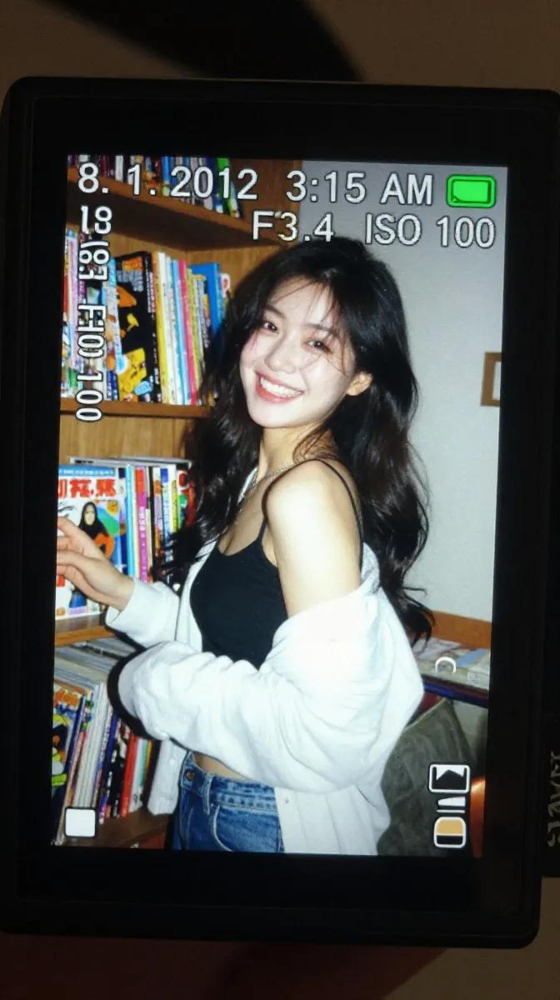
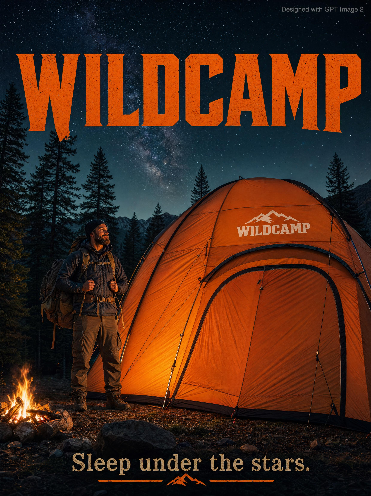
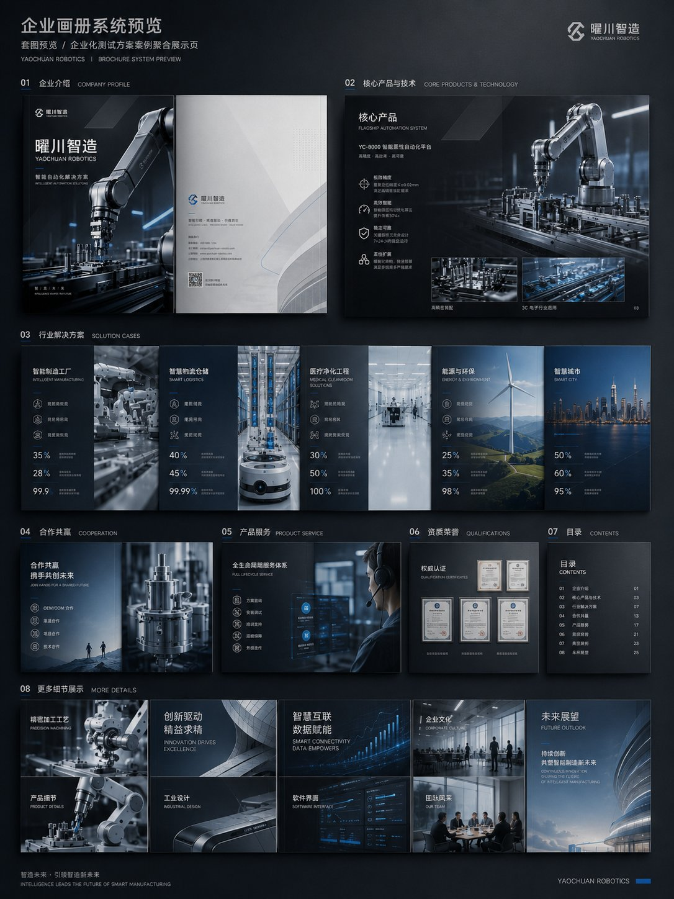

<!-- Generated by scripts/gallery.py; edit authoritative JSON, then rebuild. -->

# 全部资料 · 第 18 册

[画廊总览](gallery.md) | [上一册](gallery-part-17.md) | [下一册](gallery-part-19.md)

本册 25 条资料。标题链接固定到所示版本。

## 韩国便利店粉色 Hoodie 人像 · v1

- [韩国便利店粉色 Hoodie 人像 · v1](../cases/case-awesome-gpt-image-2-429-535f42f84ca9/v1.md) — awesome-gpt-image-2 \#429

原图文案例 · gpt-image

**待复核：尚无补充核查，不代表必要输入已齐全**

已机械读取完整 prompt 与资产路径、哈希并比对本地上游画廊；未检出需补特定原图的明确证据。未全量逐图审，模型家族仅据来源集合声明，实际版本未知。 审核只涉及资料输入要求/资产角色，不包含重新生图、身份一致性或像素复现验证。

**图片角色尚未确认**


<details>
<summary>展开完整提示词</summary>

```text
Ultra-realistic cozy Korean convenience store portrait of a beautiful Korean woman standing in front of glowing refrigerator aisles at night, wearing an oversized fluffy pastel pink hoodie with the hood up. She holds a bottle of strawberry milk in one hand and a tiny strawberry cake in the other while shyly looking toward the camera. Long soft black hair, glossy eyes, natural skin texture, subtle blushy makeup, gentle expression, youthful Korean beauty aesthetic. Warm fluorescent convenience store lighting mixed with realistic iPhone flash photography. Tiny reflections on drink bottles and glass refrigerator doors, dreamy romantic atmosphere, soft pink and cream color palette, slice-of-life anime realism blended with cinematic photography, highly detailed, cozy late-night Seoul convenience store vibe, shallow depth of field, realistic Korean snack packaging, candid aesthetic, soft glow, ultra photorealistic.
```

</details>

## 铅笔素描时尚编辑插画 · v1

- [铅笔素描时尚编辑插画 · v1](../cases/case-awesome-gpt-image-2-430-cd07726e148a/v1.md) — awesome-gpt-image-2 \#430

原图文案例 · gpt-image

**待复核：尚无补充核查，不代表必要输入已齐全**

已机械读取完整 prompt 与资产路径、哈希并比对本地上游画廊；未检出需补特定原图的明确证据。未全量逐图审，模型家族仅据来源集合声明，实际版本未知。 审核只涉及资料输入要求/资产角色，不包含重新生图、身份一致性或像素复现验证。

**图片角色尚未确认**


<details>
<summary>展开完整提示词</summary>

```text
A high-detail digital illustration of a stylish woman sitting gracefully on a stone ledge, posing with one hand near her chin and legs crossed. She is wearing vintage-inspired round sunglasses, a white blouse with rolled-up sleeves, denim overalls, and rugged lace-up combat boots. The subject is rendered in a desaturated, monochromatic pencil-sketch style with soft cross-hatching and charcoal textures. In the background, a large, vibrant solid orange circle creates a bold geometric contrast against a clean, light grey backdrop. The overall composition is minimalist, editorial, and features a clean "indie-magazine" aesthetic with sharp linework and soft shading.

Aspect ratio is 9:16
```

</details>

## 城市文字旅行海报 · v1

- [城市文字旅行海报 · v1](../cases/case-awesome-gpt-image-2-431-45de4a76e986/v1.md) — awesome-gpt-image-2 \#431

原图文案例 · gpt-image

**待复核：尚无补充核查，不代表必要输入已齐全**

已机械读取完整 prompt 与资产路径、哈希并比对本地上游画廊；未检出需补特定原图的明确证据。未全量逐图审，模型家族仅据来源集合声明，实际版本未知。 审核只涉及资料输入要求/资产角色，不包含重新生图、身份一致性或像素复现验证。

**图片角色尚未确认**


<details>
<summary>展开完整提示词</summary>

```text
Ultra-high-resolution typography travel poster themed around [CITY NAME]. 16:9 poster ratio.

IMPORTANT: every visible word on the poster must be in English, perfectly spelled, professionally typeset. No distorted letters, no random symbols, no broken text, no AI gibberish.

CORE COMPOSITION:
Place the giant English word "[CITY_NAME]" front and center. Each letter is a tall, bold, elongated sans-serif form, and each one frames a different illustrated scene from the city, like a row of gallery windows. Spread landmarks, streets, transport, nature, culture, and architecture across the letters so the scenes flow from one letter into the next as a single connected urban panorama.

TOP HORIZONTAL STRIP:
Across the top of the poster, a thin panoramic band: city skyline silhouettes, cars, trams or trains, boats where it fits, birds, clouds, sun. Keep it minimalist, elegant, rhythmically balanced.

STYLE: mid-century modern editorial poster, Swiss graphic design, minimal vector illustration, architectural infographic feel, travel typography poster, flat geometric illustration, ultra-clean composition, premium magazine design, screen-print poster vibe, retro-futuristic travel branding.

ILLUSTRATION:
Flat vector shapes only. No realism, no gradients, no noise. Clean geometric shadows, simplified architectural forms, a mix of map-like top-down with side-view cityscape. Subtle line-art details, crisp vector edges, strong negative space, harmonious rhythm between the letters.

TYPOGRAPHY:
Giant bold sans-serif, letters fill most of the canvas height. Pixel-perfect alignment. Each letter acts as its own framed illustration panel. Soft rounded corners where it suits. Editorial spacing. Print-ready and geometrically clean.

COLOR PALETTE:
Pull a cohesive palette inspired by [CITY_NAME]:
coastal city -> aqua, sand, coral, muted teal
desert city -> terracotta, beige, warm cream
cyber city -> mint, navy, steel blue
historic European city -> dusty rose, olive green, parchment
Muted pastels, soft vintage travel-poster colors, low saturation. Max 4 to 6 colors.

CONTENT:
Include iconic landmarks, famous streets and transport, local urban patterns, nearby nature, skyline silhouettes, bridges/rivers/coastline if relevant, culturally symbolic architecture, recognizable local atmosphere.

COMPOSITION:
Centered typography on a white or soft ivory background. Lots of breathing room. The top panoramic strip balances the heavy typography below. Asymmetrical but visually balanced. Each letter shows its own scene depth and perspective. Museum-quality poster hierarchy.

MOOD: premium, intellectual, calm, design-forward, travel-editorial, stylish enough for a museum gift-shop wall.

QUALITY: 8K ultra-detailed, print-ready, razor-sharp vector edges, flawless typography, zero distorted text, zero random characters, zero spelling errors, zero AI artifacts.
```

</details>

## 大堡礁复古旅行海报 · v1

- [大堡礁复古旅行海报 · v1](../cases/case-awesome-gpt-image-2-432-194e0e323e6c/v1.md) — awesome-gpt-image-2 \#432

原图文案例 · gpt-image

**待复核：尚无补充核查，不代表必要输入已齐全**

已机械读取完整 prompt 与资产路径、哈希并比对本地上游画廊；未检出需补特定原图的明确证据。未全量逐图审，模型家族仅据来源集合声明，实际版本未知。 审核只涉及资料输入要求/资产角色，不包含重新生图、身份一致性或像素复现验证。

**图片角色尚未确认**


<details>
<summary>展开完整提示词</summary>

```text
Create a premium editorial travel poster illustration of the Great Barrier Reef, Australia.
Style: Flat vector illustration, ultra-clean minimalism, mid-century modern travel poster aesthetic, inspired by vintage tourism prints and Scandinavian graphic design. No photorealism, no textures, no noise, no gradients. Use crisp shapes, smooth color blocks, and harmonious vibrant tones.
Composition (vertical 3:4 layout):
Foreground (underwater): A rich coral reef ecosystem filled with colorful corals in pink, orange, yellow, and red tones. Include tropical fish of various species (striped, bright yellow, blue, and orange), and a large sea turtle swimming gracefully toward the right. Clear turquoise water with high visibility.
Midground: A female snorkeler swimming horizontally just beneath the water surface, wearing fins and a snorkel mask, observing the reef below. Light rays subtly pass through the water surface.
Background (above water): A calm tropical ocean with shallow reef patches visible through crystal-clear water. A white leisure boat floats peacefully on the left, and a small sailboat appears far in the distance. On the horizon, soft green islands or hills stretch across.
Sky: Bright blue sky with fluffy white clouds and a few birds flying, enhancing the serene vacation mood.
Typography:
At the bottom of the poster, include bold uppercase text:
“GREAT BARRIER REEF”
Below it, smaller spaced-out text:
“AUSTRALIA”
Add a small decorative coral icon between divider lines.
Mood & Lighting: Bright daylight, calm, inviting, tropical paradise atmosphere. Colors should feel fresh, vibrant, and relaxing with strong contrast between coral reef and ocean blues.
```

</details>

## 韩国城市水彩旅行插画 · v1

- [韩国城市水彩旅行插画 · v1](../cases/case-awesome-gpt-image-2-433-f0d68a2a63f9/v1.md) — awesome-gpt-image-2 \#433

原图文案例 · gpt-image

**待复核：尚无补充核查，不代表必要输入已齐全**

已机械读取完整 prompt 与资产路径、哈希并比对本地上游画廊；未检出需补特定原图的明确证据。未全量逐图审，模型家族仅据来源集合声明，实际版本未知。 审核只涉及资料输入要求/资产角色，不包含重新生图、身份一致性或像素复现验证。

**图片角色尚未确认**


<details>
<summary>展开完整提示词</summary>

```text
Dreamy watercolor travel illustration of a peaceful Korean city street, hand-painted urban sketchbook style, delicate ink linework mixed with soft watercolor washes, cozy café storefronts, warm bakery lights glowing through windows, quiet morning atmosphere after light rain, reflective wet pavement, pedestrians with umbrellas and tote bags, bicycles parked along narrow streets, traditional Korean signs and typography, subtle Korean text labels, soft beige paper texture background, architectural sketch aesthetic, calm everyday city life, muted earthy palette with warm browns, faded greens, cream whites and soft blue accents, highly detailed pen-and-ink drawing, loose expressive brush strokes, travel journal composition, editorial postcard layout, elegant serif title text at top (“SEOUL”, “JEONJU”, “DAEJEON”), handwritten notes and date stamps, vintage travel diary aesthetic, cozy East Asian urban scenery, cinematic slice-of-life mood, watercolor bleeding edges, natural perspective, atmospheric depth, peaceful storytelling illustration, minimalist negative space, ultra detailed watercolor texture, sketchbook traveler aesthetic, nostalgic café culture vibes, Studio Ghibli-inspired realism, European urban sketching style mixed with Korean street scenery, soft daylight, calm and poetic composition, vertical poster design, premium art print quality.
```

</details>

## 东京街头胶片人像 · v1

- [东京街头胶片人像 · v1](../cases/case-awesome-gpt-image-2-434-ae231cce883b/v1.md) — awesome-gpt-image-2 \#434

原图文案例 · gpt-image

**待复核：尚无补充核查，不代表必要输入已齐全**

已机械读取完整 prompt 与资产路径、哈希并比对本地上游画廊；未检出需补特定原图的明确证据。未全量逐图审，模型家族仅据来源集合声明，实际版本未知。 审核只涉及资料输入要求/资产角色，不包含重新生图、身份一致性或像素复现验证。

**图片角色尚未确认**


<details>
<summary>展开完整提示词</summary>

```text
film photography, candid street snapshot aesthetic, razor-sharp focus on subject, shallow depth of field with soft blurred urban background, bright daylight, slightly overexposed highlights, vivid contrast, subtle analog film texture, heavy film grain, nostalgic cinematic atmosphere, Tokyo backstreet neighborhood scene near a quiet train station, narrow pedestrian street lined with Japanese convenience stores, vintage vending machines, small ramen shops, hanging signs with faded typography, bicycles parked along tiled sidewalks, utility poles and overhead wires stretching across the sky, scattered fallen leaves on the ground, distant pedestrians and passing taxis softly blurred in the background, warm afternoon sunlight with deep blue sky, realistic street fashion photography style, effortless cool street vibe, vibrant colors with slightly muted faded film tones, beautiful 19-year-old Chinese female influencer, fair porcelain skin with cold pale undertones, exquisite natural makeup, glossy soft lips, defined brows, delicate lashes, soft messy long black hair with natural flowing curves, wearing an off-shoulder white fluffy faux fur jacket, playful yet subtly seductive expression, lazy dreamy vintage filter, ultra high-quality details, intentionally mundane phone-camera snapshot feeling, casual accidental composition, imperfect framing, realistic iPhone photography texture, spontaneous candid energy, highly attractive girl casually posing in the middle of the sidewalk, body facing away from the camera while turning her head back toward the lens with direct eye contact, relaxed posture, soft wind moving her hair, emotional youthful atmosphere, modern Asian street fashion editorial, soft haze, layered composition, masterpiece, best quality, ultra detailed, slight motion blur from slow shutter, authentic everyday realism, “BubbleBrain” small handwritten signature text on bottom corner --ar 9:16
```

</details>

## 层叠纸雕情侣插画 · v1

- [层叠纸雕情侣插画 · v1](../cases/case-awesome-gpt-image-2-435-924421df0be8/v1.md) — awesome-gpt-image-2 \#435

原图文案例 · gpt-image

**待复核：尚无补充核查，不代表必要输入已齐全**

已机械读取完整 prompt 与资产路径、哈希并比对本地上游画廊；未检出需补特定原图的明确证据。未全量逐图审，模型家族仅据来源集合声明，实际版本未知。 审核只涉及资料输入要求/资产角色，不包含重新生图、身份一致性或像素复现验证。

**图片角色尚未确认**


<details>
<summary>展开完整提示词</summary>

```text
{
  "style": "layered paper-cut illustration, papercraft diorama, handcrafted aesthetic",
  "technique": {
    "layering": "multiple stacked paper layers with soft drop shadows between each layer",
    "depth": "5–7 visible depth planes from foreground to background",
    "edges": "smooth, rounded, slightly beveled paper-cut edges",
    "texture": "subtle paper grain and fibrous texture on all surfaces",
    "shadows": "soft, diffused inner shadows beneath each layer suggesting physical depth"
  },
  "character_design": {
    "proportions": "chibi / cute simplified — large round head, small body (1:1.5 ratio)",
    "face": {
      "eyes": "small dot eyes, glossy highlight",
      "cheeks": "soft circular rosy blush patches",
      "nose": "absent or minimal dot",
      "mouth": "simple small curve smile"
    },
    "limbs": "short, rounded, stubby limbs",
    "outline": "clean smooth silhouette, no sharp corners"
  },
  "color_palette": {
    "mood": "warm, cozy, pastel",
    "tones": ["soft cream", "dusty rose", "sage green", "warm peach", "sky blue", "honey yellow"],
    "saturation": "low-to-medium, muted and gentle",
    "background": "warm off-white or soft gradient"
  },
  "lighting": {
    "type": "soft ambient light from top-front",
    "highlights": "gentle white edge highlights on top layers",
    "shadows": "warm light tan/beige shadow tones beneath cut layers"
  },
  "environment": {
    "foliage": "simplified rounded leaf and floral shapes as separate paper layers",
    "ground": "curved horizon layers suggesting rolling hills",
    "details": "tiny decorative elements — stars, small hearts, dots — cut from paper"
  },
  "overall_mood": "warm, whimsical, cozy, handmade, storybook",
  "render_quality": "ultra-detailed papercraft art, studio photography lighting, sharp focus on layer edges"
}
```

</details>

## 数码相机屏幕怀旧人像 · v1

- [数码相机屏幕怀旧人像 · v1](../cases/case-awesome-gpt-image-2-436-4b2572587f51/v1.md) — awesome-gpt-image-2 \#436

原图文案例 · gpt-image

**待复核：尚无补充核查，不代表必要输入已齐全**

已复核检索命中上下文：其措辞指向输出布局、一般风格描述或可选资料，不构成指定输入文件要求。此例未逐图审，保留 needs\_review；源图与源文已归档。 审核只涉及资料输入要求/资产角色，不包含重新生图、身份一致性或像素复现验证。

**图片角色尚未确认**



<details>
<summary>展开完整提示词</summary>

```text
A realistic close-up shot of a small digital camera screen glowing brightly in a dark indoor environment. Displayed on the LCD is a candid early-2010s style photograph of a young East Asian woman with long dark wavy hair standing beside a wooden shelf packed tightly with colorful comic books and magazines.

She wears a black spaghetti-strap top with a loose white cardigan hanging casually from both shoulders and faded blue jeans. Captured mid-laugh while turning her face slightly sideways, her expression feels spontaneous and natural, with hair falling softly across part of her cheek.

The harsh direct flash from the compact camera creates strong highlights on her face and cardigan while flattening shadows in the background, producing an authentic nostalgic digicam aesthetic. Slight motion blur and digital grain enhance the candid realism.

Camera UI overlays are visible across the LCD screen, including the timestamp “8. 1. 2012 3:15 AM,” exposure data “1/30 F3.4 ISO 100,” focus indicators, and a small green battery symbol in the corner.

The image preserves visible screen pixel structure, slight glare reflections, chromatic softness, and compressed digital texture. Outside the LCD, the surrounding darkness fades smoothly into blur, emphasizing the glowing nostalgic screen.

Shot to resemble an authentic Sony Cyber-shot point-and-shoot camera from the early 2010s using a CCD sensor with vintage digital rendering and imperfect flash exposure.
```

</details>

## 面部美学分析报告 · v1

- [面部美学分析报告 · v1](../cases/case-awesome-gpt-image-2-437-c30ca42e2440/v1.md) — awesome-gpt-image-2 \#437

原图文案例 · gpt-image

**已记录补充核查结果；以详情中的输入要求为准**

已核对原文输入要求与当前示例图；这是通用可替换主体/照片/标志模板，实际执行须由使用者提供相应输入，未发现必须另补某一指定源文件的明确要求。 审核只涉及资料输入要求/资产角色，不包含重新生图、身份一致性或像素复现验证。

**输出示例图**


<details>
<summary>展开完整提示词</summary>

```text
Create a clean, minimal, luxury-style facial aesthetics analysis report based on the uploaded portrait photo.
Design style:
Ultra-modern black and white interface, premium editorial aesthetic, thin elegant divider lines, soft rounded cards, subtle shadows, spacious layout, luxury skincare / fashion magazine vibe, monochrome palette, Apple-style UI refinement.
Include:
– A simple contour line-art drawing of the face based on the subject
– Facial symmetry analysis
– Face shape identification
– Proportional analysis (eyes, nose, jawline, lips, forehead)
– Skin texture observations
– Hairstyle compatibility suggestions
– Grooming and fashion recommendations
– Honest attractiveness evaluation with balanced critique
– Strengths and weaker facial areas explained objectively
– Actionable glow-up recommendations
– Confidence score and facial harmony score shown with elegant charts or meters
Style notes:
Keep the report data-driven, visually refined, realistic, and not overly flattering.
Avoid exaggerated praise.
Use clean typography, premium spacing, modern infographics, subtle geometric accents, and professional cosmetic consultation aesthetics.
Visual composition:
Magazine-quality presentation, luxury beauty report dashboard, highly organized layout, cinematic monochrome feel, minimalist infographic design, realistic facial structure interpretation, modern masculine beauty analytics.
Rendering:
Ultra-detailed, sharp UI design, realistic portrait adaptation, sophisticated editorial presentation, high-end branding aesthetic, 4K quality.
```

</details>

## 珠宝微缩城市广告海报 · v1

- [珠宝微缩城市广告海报 · v1](../cases/case-awesome-gpt-image-2-438-9e1303df00ab/v1.md) — awesome-gpt-image-2 \#438

原图文案例 · gpt-image

**待复核：尚无补充核查，不代表必要输入已齐全**

已机械读取完整 prompt 与资产路径、哈希并比对本地上游画廊；未检出需补特定原图的明确证据。未全量逐图审，模型家族仅据来源集合声明，实际版本未知。 审核只涉及资料输入要求/资产角色，不包含重新生图、身份一致性或像素复现验证。

**图片角色尚未确认**


<details>
<summary>展开完整提示词</summary>

```text
Create a hyper-detailed luxury advertising poster in a cinematic miniature-world style. A gigantic royal diamond necklace with intricate gold filigree and massive ruby gemstones stands in the center like an architectural monument. Surround the necklace with a futuristic miniature city built around and inside the jewelry piece, including skyscrapers, elevated highways, bridges, spiral staircases, tiny human figures, luxury billboards, drones, helicopters, and cinematic urban activity. Use a deep crimson red monochrome background with gold and ruby accents. Add premium fashion-ad aesthetics, ultra-realistic textures, glossy reflections, dramatic studio lighting, depth of field, tilt-shift miniature effect, and high-end commercial composition. Include bold elegant typography at the top saying: “EMBRACE THE EXTRAORDINARY”. Style inspired by luxury jewelry campaigns, surreal city-building concepts, and premium 3D advertising renders. Ultra realistic, 8K, octane render, sharp focus, highly detailed, cinematic shadows, symmetrical composition.
```

</details>

## 赛博黑客角色设定表 · v1

- [赛博黑客角色设定表 · v1](../cases/case-awesome-gpt-image-2-439-085cb12f9f61/v1.md) — awesome-gpt-image-2 \#439

原图文案例 · gpt-image

**待复核：尚无补充核查，不代表必要输入已齐全**

已机械读取完整 prompt 与资产路径、哈希并比对本地上游画廊；未检出需补特定原图的明确证据。未全量逐图审，模型家族仅据来源集合声明，实际版本未知。 审核只涉及资料输入要求/资产角色，不包含重新生图、身份一致性或像素复现验证。

**图片角色尚未确认**


<details>
<summary>展开完整提示词</summary>

```text
Ultra-detailed cyberpunk anime character design sheet of a teenage genius hacker girl named “NEO // RIN”, full body turnaround (front, side, back) plus close-up portrait and accessory callouts. Short silver-white bob haircut with neon cyan and magenta gradient streaks, glowing translucent cyber visor over one eye, pale skin, sharp violet eyes, calm confident expression. Oversized techwear jacket with black tactical cargo pants, belts, straps, dangling utility tags, cropped top, futuristic sneakers, holographic accessories, barcode decals, warning symbols, “BYTE//NULL” typography, hacker aesthetic.
Color palette: matte black, dark gray, white, neon cyan, neon pink.
Style inspired by high-end Japanese concept art, futuristic streetwear, cyberpunk fashion, Akira + Ghost in the Shell + modern anime key visual aesthetics.
Include clean character reference sheet layout with labeled details, logo designs, UI graphics, gadget closeups, and color palette on white background.
Highly polished cel shading, crisp lineart, soft glow effects, intricate clothing folds, layered accessories, dynamic fashion silhouette, professional game concept art quality, 4k, ultra detailed.
```

</details>

## 手机拍摄 FaceTime 工作屏幕 · v1

- [手机拍摄 FaceTime 工作屏幕 · v1](../cases/case-awesome-gpt-image-2-440-07e3aa6c4313/v1.md) — awesome-gpt-image-2 \#440

原图文案例 · gpt-image

**待复核：尚无补充核查，不代表必要输入已齐全**

已机械读取完整 prompt 与资产路径、哈希并比对本地上游画廊；未检出需补特定原图的明确证据。未全量逐图审，模型家族仅据来源集合声明，实际版本未知。 审核只涉及资料输入要求/资产角色，不包含重新生图、身份一致性或像素复现验证。

**图片角色尚未确认**


<details>
<summary>展开完整提示词</summary>

```text
Create a raw smartphone photo of a laptop screen, not a screenshot. Aspect ratio 3:4, high-angle downward POV from someone standing over a desk at night. The laptop display fills most of the frame, with a narrow strip of black keyboard and trackpad visible at the bottom. Strong realism: visible RGB subpixel grid, subtle moire bands, small dust specks, faint fingerprints, uneven glass reflections, handheld phone noise, slight perspective skew, no studio polish. macOS dark mode. Background app: Apple Notes with a late-night study note titled "Design Critique" and short visible bullets: "layout", "lighting", "source links", "ship tomorrow". Foreground app: FaceTime live preview window floating lower-right, showing a fictional adult man in his 20s sitting at a cluttered desk, hoodie, tired but amused expression, warm desk lamp behind him, books and sticky notes in the room. A second small Finder window with image thumbnails is partly visible behind it. Make it feel like an accidental real phone photo of a working laptop screen. No real-person likeness, no beauty filter, no perfect UI, no screenshot, no watermark, no cartoon, no 3D render.
```

</details>

## WILDCAMP 巨型帐篷广告海报 · v1

- [WILDCAMP 巨型帐篷广告海报 · v1](../cases/case-awesome-gpt-image-2-441-45bd5964b9fb/v1.md) — awesome-gpt-image-2 \#441

原图文案例 · gpt-image

**待复核：尚无补充核查，不代表必要输入已齐全**

已机械读取完整 prompt 与资产路径、哈希并比对本地上游画廊；未检出需补特定原图的明确证据。未全量逐图审，模型家族仅据来源集合声明，实际版本未知。 审核只涉及资料输入要求/资产角色，不包含重新生图、身份一致性或像素复现验证。

**图片角色尚未确认**



<details>
<summary>展开完整提示词</summary>

```text
An outdoor adventure advertisement poster featuring a rugged bearded man in full hiking gear standing confidently beside a massive orange camping tent three times taller than him, fully pitched in a dramatic forest clearing surrounded by towering pine trees beneath a deep starry night sky. The tent features a bold white “WILDCAMP” logo stitched onto the rainfly. Warm cinematic campfire lighting illuminates the scene with realistic shadows and rich outdoor textures, creating a premium adventure-commercial aesthetic. Large rugged serif typography reading “WILDCAMP” dominates the dark sky area in bold orange lettering, while the tagline “Sleep under the stars.” appears elegantly at the bottom. Small grey text in the top-right corner reads “Designed with GPT Image 2.” Photorealistic, ultra-detailed, cinematic outdoor advertising style with dramatic atmosphere and high-end commercial composition.
```

</details>

## 舒适发廊插画 · v1

- [舒适发廊插画 · v1](../cases/case-awesome-gpt-image-2-442-29ddceb782e7/v1.md) — awesome-gpt-image-2 \#442

原图文案例 · gpt-image

**待复核：尚无补充核查，不代表必要输入已齐全**

已机械读取完整 prompt 与资产路径、哈希并比对本地上游画廊；未检出需补特定原图的明确证据。未全量逐图审，模型家族仅据来源集合声明，实际版本未知。 审核只涉及资料输入要求/资产角色，不包含重新生图、身份一致性或像素复现验证。

**图片角色尚未确认**


<details>
<summary>展开完整提示词</summary>

```text
A vibrant whimsical digital illustration of a cozy indie hair salon, featuring a young girl with long brown hair getting her hair styled by a fashionable hairstylist. Bright pink, purple, orange, and peach color palette with playful retro decor, indoor plants, patterned walls, confetti shapes, beauty tools, flowers, and soft ambient lighting. Cute feminine aesthetic, dreamy cartoon style, expressive characters with rosy cheeks, highly detailed textures, modern flat illustration mixed with painterly shading, colorful composition, trendy Pinterest aesthetic, cozy creative atmosphere, ultra-detailed, 2D editorial art style.
```

</details>

## 塔可爆炸拆解信息图 · v1

- [塔可爆炸拆解信息图 · v1](../cases/case-awesome-gpt-image-2-443-f99b5b8a89bb/v1.md) — awesome-gpt-image-2 \#443

原图文案例 · gpt-image

**待复核：尚无补充核查，不代表必要输入已齐全**

已机械读取完整 prompt 与资产路径、哈希并比对本地上游画廊；未检出需补特定原图的明确证据。未全量逐图审，模型家族仅据来源集合声明，实际版本未知。 审核只涉及资料输入要求/资产角色，不包含重新生图、身份一致性或像素复现验证。

**图片角色尚未确认**


<details>
<summary>展开完整提示词</summary>

```text
Create a hyper-realistic exploded vertical infographic composition of tacos.

Top → Bottom structure:
Fresh Lettuce (crisp green texture with natural folds)
→ Tomato & Salsa Layer (juicy diced tomatoes and salsa mix)
→ Melted Cheese (smooth cheddar texture)
→ Grilled Meat Filling (juicy seasoned meat detail)
→ Taco Shell Base (crispy golden shell texture)
Perfect vertical alignment, rustic background, soft studio lighting, realistic shadows beneath each floating element.

Add clean infographic text labels with thin pointer lines using these exact labels:
“Lettuce”
“Salsa”
“Cheese”
“Meat”
“Shell”
Ultra-detailed food textures, premium commercial aesthetic, 8K.
```

</details>

## 迪斯科镜面 3D App 图标 · v1

- [迪斯科镜面 3D App 图标 · v1](../cases/case-awesome-gpt-image-2-444-fcc2d1e9de42/v1.md) — awesome-gpt-image-2 \#444

原图文案例 · gpt-image

**待复核：尚无补充核查，不代表必要输入已齐全**

已机械读取完整 prompt 与资产路径、哈希并比对本地上游画廊；未检出需补特定原图的明确证据。未全量逐图审，模型家族仅据来源集合声明，实际版本未知。 审核只涉及资料输入要求/资产角色，不包含重新生图、身份一致性或像素复现验证。

**图片角色尚未确认**


<details>
<summary>展开完整提示词</summary>

```text
为【品牌名】生成一个高级 3D App 图标，圆角方形底板，玻璃与金属铬材质，迪斯科球镜面马赛克小方块质感，闪亮高光，柔和工作室灯光，干净极简背景，高端产品图标风格，Blender 3D 渲染，超精细

英文版：

A premium 3D app icon for 【Product Name】, rounded square tile, glossy glass and chrome material, disco-ball mosaic mirror tiles, sparkling highlights, soft studio lighting, clean minimal background, high-end icon, Blender 3D render, ultra detailed
```

</details>

## 旅游照水墨明信片 · v1

- [旅游照水墨明信片 · v1](../cases/case-awesome-gpt-image-2-445-d122dbf14890/v1.md) — awesome-gpt-image-2 \#445

原图文案例 · gpt-image

**已记录补充核查结果；以详情中的输入要求为准**

已核对原文输入要求与当前示例图；这是通用可替换主体/照片/标志模板，实际执行须由使用者提供相应输入，未发现必须另补某一指定源文件的明确要求。 审核只涉及资料输入要求/资产角色，不包含重新生图、身份一致性或像素复现验证。

**输出示例图**


<details>
<summary>展开完整提示词</summary>

```text
Create a dreamy watercolor travel illustration style from the attached photo. Use hand-painted urban sketchbook aesthetic, delicate ink linework mixed with soft watercolor washes, highly detailed pen-and-ink drawing, loose expressive brush strokes, watercolor bleeding edges, ultra detailed watercolor texture, soft beige paper texture background, architectural sketch style, vintage travel diary and sketchbook traveler aesthetic, travel journal composition, editorial postcard layout, handwritten medium title:[自定义标题]  at top, handwritten notes:[自定义文案] , date: [自定义日期] and location: [自定义地点]  stamps, natural perspective, atmospheric depth, minimalist negative space, muted earthy palette (warm browns, faded greens, cream whites, soft blue accents), quiet, calm, soft, cozy, nostalgic vibes, cinematic slice-of-life mood, poetic composition, mixed urban sketching with Ghibli-inspired realism, vertical poster design, premium art print quality.
```

</details>

## 低多边形纸艺男士肖像 · v1

- [低多边形纸艺男士肖像 · v1](../cases/case-awesome-gpt-image-2-446-5932f2218650/v1.md) — awesome-gpt-image-2 \#446

原图文案例 · gpt-image

**待复核：尚无补充核查，不代表必要输入已齐全**

已机械读取完整 prompt 与资产路径、哈希并比对本地上游画廊；未检出需补特定原图的明确证据。未全量逐图审，模型家族仅据来源集合声明，实际版本未知。 审核只涉及资料输入要求/资产角色，不包含重新生图、身份一致性或像素复现验证。

**图片角色尚未确认**


<details>
<summary>展开完整提示词</summary>

```text
Create a highly detailed low-poly papercraft portrait of a stylish young man, designed like an origami paper sculpture. The character has curly dark brown hair, a trimmed beard, and wears slightly black-tinted geometric sunglasses with thin black frames. His shirt is medium grey with sharp polygonal folds and realistic paper texture. Use faceted angular shapes across the face, hair, and clothing, with realistic shadows and layered paper depth. Minimal clean white studio background, soft lighting, ultra-realistic paper craft aesthetic, modern geometric art style, high detail, centered composition, 8k quality.
```

</details>

## 现代地铁工程信息图 · v1

- [现代地铁工程信息图 · v1](../cases/case-awesome-gpt-image-2-447-33189cbb5d51/v1.md) — awesome-gpt-image-2 \#447

原图文案例 · gpt-image

**待复核：尚无补充核查，不代表必要输入已齐全**

已机械读取完整 prompt 与资产路径、哈希并比对本地上游画廊；未检出需补特定原图的明确证据。未全量逐图审，模型家族仅据来源集合声明，实际版本未知。 审核只涉及资料输入要求/资产角色，不包含重新生图、身份一致性或像素复现验证。

**图片角色尚未确认**


<details>
<summary>展开完整提示词</summary>

```text
Create a premium square “reference-style urban transportation infographic” centered around a futuristic modern metro system called the {METRO_NAME}, designed as a beautifully curated transit-engineering handbook page rather than a public transport advertisement.

The composition should feel like a modern visual encyclopedia mixed with an elite railway infrastructure field guide and high-end editorial infographic system.

Visual Direction:

• 1:1 square composition
• Dark premium urban-tech background with subtle railway schematics, metro maps, and futuristic blueprint overlays
• Elegant palette using deep navy, matte black, steel gray, electric blue accents, and soft white lighting
• Refined editorial typography hierarchy with modern transportation aesthetics
• Rounded modular information cards with clean spacing
• Gentle realistic reflections and premium HUD-style dividers
• Minimal transit-system iconography
• Extremely detailed central metro train render viewed in dramatic three-quarter perspective inside a futuristic underground station
• Thin precision annotation lines pointing toward transportation systems and smart engineering features
• Clean, organized “knowledge-first” layout with high information density but breathable spacing

Main Subject Presentation:

A stunning ultra-detailed realistic render of the {METRO_NAME} modern metro train placed at the center, featuring sleek aerodynamic train design, glowing destination displays, realistic stainless-steel textures, illuminated station lighting, smart glass windows, premium urban-environment realism, and futuristic rail infrastructure.

Surround the metro with scientific and engineering callouts explaining:

• regenerative braking system
• smart signalling & CBTC control
• electric propulsion system
• passenger information systems
• safety and surveillance technology
• platform screen doors
• energy-efficient design
• smart ventilation systems
• accessibility features
• track and infrastructure engineering

Include modular infographic sections such as:

• Metro System Overview
• Technical Specifications
• Train Dimensions & Layout
• Passenger Capacity & Flow
• Smart Control Systems
• Sustainability Features
• Track & Infrastructure Engineering
• Signalling & Automation
• Station Design & Facilities
• Safety & Emergency Systems
• Passenger Experience Features
• Urban Connectivity & Network Map
• Energy Efficiency Comparison
• Construction & Expansion Timeline
• “Top 5 Smart Innovations” section
• Built for Future Smart Cities

Add small premium visualization modules like:

• metro network maps
• train blueprint diagrams
• station layout graphics
• passenger flow visualizations
• signalling workflow diagrams
• energy-efficiency comparison charts
• train configuration illustrations
• smart-city connectivity graphics
• platform safety diagrams
• infrastructure cross-section visuals

Style Keywords:

“premium urban mobility encyclopedia”
“editorial metro engineering handbook”
“high-end transportation infographic”
“scientific railway infrastructure poster”
“museum-quality transit reference page”
“modular smart-city knowledge system”
“clean transportation editorial design”
“ultra-detailed metro visualization”

Avoid:

• cluttered public advertisement aesthetics
• cartoon transportation styling
• unrealistic sci-fi levitating trains
• excessive cyberpunk neon overload
• chaotic city scenes
• generic subway poster layouts

The final result should resemble a professionally published railway infrastructure reference-book page created for transit enthusiasts, architects, engineers, urban planners, transportation designers, and educational infrastructure archives.
```

</details>

## 1942 空战街机电影城 · v1

- [1942 空战街机电影城 · v1](../cases/case-awesome-gpt-image-2-448-fe19d7c7fa99/v1.md) — awesome-gpt-image-2 \#448

原图文案例 · gpt-image

**待复核：尚无补充核查，不代表必要输入已齐全**

已机械读取完整 prompt 与资产路径、哈希并比对本地上游画廊；未检出需补特定原图的明确证据。未全量逐图审，模型家族仅据来源集合声明，实际版本未知。 审核只涉及资料输入要求/资产角色，不包含重新生图、身份一致性或像素复现验证。

**图片角色尚未确认**


<details>
<summary>展开完整提示词</summary>

```text
Ultra-realistic cinematic “1942 City” scene, retro WWII arcade-shooter-inspired metropolis in real life, intense aerial-war atmosphere, vertical 4:5 editorial composition

Male, exact face, vintage military-pilot-inspired streetwear from head to toe, bomber jacket with retro aviation patches, fitted cargo trousers, rugged combat boots, fingerless gloves, pilot goggles hanging around neck, walking through the city with fearless ace-pilot expression while fighter planes soar overhead

✈️ 1942 CITY WORLDBUILDING

entire city functions like a living 1942 arcade shooter universe
• massive WWII fighter planes dogfighting above skyscrapers
• giant anti-aircraft cannons mounted across rooftops
• endless bullet patterns streaking through cloudy skies
• retro military airfields integrated into urban districts
• giant “MISSION START” alerts projected into the clouds
• dramatic explosion trails lighting the skyline at night
• aircraft carriers docked beside futuristic city ports
• glowing power-up icons floating through aerial battle zones
• giant radar systems rotating above downtown towers
• endless enemy squadrons emerging from storm clouds
• cinematic ocean-and-warzone environments surrounding the metropolis

😂 COMEDIC DETAILS

• random civilians casually dodging fighter planes on the way to work 😭
• one pilot barrel-rolling dramatically for absolutely no reason
• giant billboard flashing: “PLAYER 1 READY.”
• pedestrians treating near-miss explosions like normal traffic
• somebody still trying to collect every floating power-up midair
• random mechanic repairing planes using pure confidence
• one legendary pilot surviving impossible situations through arcade logic alone

💡 LIGHTING & STYLE

retro war-film cinematic lighting, fiery aerial-battle atmosphere, dramatic clouds and explosion reflections, hyper-detailed realistic textures mixed with nostalgic arcade-shooter aesthetics, intense blockbuster-war energy, masterpiece quality

🎥 CAMERA

cinematic aerial tracking shot, immersive dogfight atmosphere, dynamic motion blur from fighter planes and explosions, documentary-meets-retro-arcade realism, futuristic Manila-inspired 1942 metropolis, “classic arcade air combat became civilization” atmosphere
```

</details>

## 奢华机械腕表技术图鉴 · v1

- [奢华机械腕表技术图鉴 · v1](../cases/case-awesome-gpt-image-2-449-0f4e3dec59c3/v1.md) — awesome-gpt-image-2 \#449

原图文案例 · gpt-image

**待复核：尚无补充核查，不代表必要输入已齐全**

已机械读取完整 prompt 与资产路径、哈希并比对本地上游画廊；未检出需补特定原图的明确证据。未全量逐图审，模型家族仅据来源集合声明，实际版本未知。 审核只涉及资料输入要求/资产角色，不包含重新生图、身份一致性或像素复现验证。

**图片角色尚未确认**


<details>
<summary>展开完整提示词</summary>

```text
2x2 grid 16:9, do this for 4 most expensive strangest watches ever made:

class Haute_Horlogerie_DNA:
    def __init__(self):
        self.subject = "[TIMEPIECE]"
        self.parents = {
            "composition_parent": "Exploded movement diagram with transparent case",
            "material_parent": "Brushed titanium, sapphire crystal, rose gold gears, alligator leather",
            "graphic_parent": "Swiss manufacture technical brochure with elegant data panels",
            "atmosphere_parent": "Crisp daylight studio, pure white background, subtle reflection on polished surfaces"
        }
        self.mutations = {
            "semantic_mutation": "The balance wheel reveals a miniature cosmos ticking inside",
            "information_mutation": "Power reserve indicator, frequency, complication callouts, hand-finishing grades, assembly timeline",
            "medium_mutation": "Smooth matte premium paper with embossed logo",
            "scale_mutation": "Grain-level view of Côtes de Genève finishing and jewel bearings"
        }
        self.style_mix = [0.30, 0.30, 0.25, 0.10, 0.05]

    def generate_subject(self):
        subject = """
        [TIMEPIECE] shown in its full mechanical glory. The dial, hands, movement,
        and strap float in perfect alignment against a bright, clean background.
        Every gear and spring is highlighted with exacting clarity.
        """
        return render(
            subject,
            format="luxury watch advertisement with technical insert",
            title="[MODEL REFERENCE]",
            subtitle="[MANUFACTURE / COLLECTION]",
            constraints="bright white space, metallic brilliance, hyper-detailed, modern elegance"
        )
```

</details>

## 烛光侧室写实摄影 · v1

- [烛光侧室写实摄影 · v1](../cases/case-awesome-gpt-image-2-450-0d62948797bf/v1.md) — awesome-gpt-image-2 \#450

原图文案例 · gpt-image

**待复核：尚无补充核查，不代表必要输入已齐全**

已机械读取完整 prompt 与资产路径、哈希并比对本地上游画廊；未检出需补特定原图的明确证据。未全量逐图审，模型家族仅据来源集合声明，实际版本未知。 审核只涉及资料输入要求/资产角色，不包含重新生图、身份一致性或像素复现验证。

**图片角色尚未确认**


<details>
<summary>展开完整提示词</summary>

```text
A medium-shot authentic daily life photograph, natural candid moment, of an East Asian young woman standing in a small side room lit only by a single candle on a low stone shelf. 85mm lens, waist-up framing, shallow depth of field. The candle is off-frame to the left; the room behind her exists only as dark warm suggestion.

East Asian young woman in her early 20s. Almond-shaped eyes receiving the candle's warm flicker — the irises briefly caught in light before returning to shadow. Straight refined nose, the bridge illuminated in a narrow warm stripe. Skin tone fair beige, warmed entirely by candlelight into something amber. Skin subsurface scattering visible under directional candlelight, specular micro-highlights on cheekbones and nose ridge, fine foundation powder grain perceptible.

She wears an aged amber silk qipao with chrysanthemum embroidery in tones of old bronze and dusty ochre — the amber pigment identical in temperature to the candle's own light, the embroidery appearing and disappearing depending on angle. Mandarin collar, short sleeves. She stands facing the candle without looking at it, arms at her sides, very still. The room is otherwise empty. Two or three stray hairs displaced by faint air movement, natural unplanned imperfection, not geometrically symmetrical.

Single candle — warm amber-orange, directional and fragile. It carves the left side of her face from darkness, leaves the right in near-black shadow. The amber qipao and the candlelight share a single temperature register: the room folds her into the light. Deep chiaroscuro with no artificial fill. Subtle ISO 400 film grain in shadow areas, photographic noise texture not CG render smoothness. Aspect ratio 9:16. No watermark, no text overlay, not cartoon, not digitally painted, not illustration, not anime.
```

</details>

## 韩国海滩日落时尚人像 · v1

- [韩国海滩日落时尚人像 · v1](../cases/case-awesome-gpt-image-2-451-eea9096643f5/v1.md) — awesome-gpt-image-2 \#451

原图文案例 · gpt-image

**待复核：尚无补充核查，不代表必要输入已齐全**

已机械读取完整 prompt 与资产路径、哈希并比对本地上游画廊；未检出需补特定原图的明确证据。未全量逐图审，模型家族仅据来源集合声明，实际版本未知。 审核只涉及资料输入要求/资产角色，不包含重新生图、身份一致性或像素复现验证。

**图片角色尚未确认**


<details>
<summary>展开完整提示词</summary>

```text
一位成年韩国女孩，人物位于画面中央，半身到大腿视角，身体微微前倾。身形比例协调，肩颈线条舒展，可以看到胸部轮廓，轮廓自然优美，腰部线条柔和，整体凸显丰腴健康的女性美，丝滑黑发随风飘扬，人物气质成熟、温柔、安静，面带自然微笑。身穿白色一字肩连衣裙，背景是热带海滩日落，电影感DSLR摄影，温暖辉光照明，梦幻虚化，超详细，鲜艳色彩，丰富对比，韩国时尚美学氛围，自然欢乐情感，高端生活方式摄影。9:16 竖版构图。
```

</details>

## 极简童话手绘儿童插画 · v1

- [极简童话手绘儿童插画 · v1](../cases/case-awesome-gpt-image-2-452-755f950ef943/v1.md) — awesome-gpt-image-2 \#452

原图文案例 · gpt-image

**已记录补充核查结果；以详情中的输入要求为准**

已核对原文输入要求与当前示例图；这是通用可替换主体/照片/标志模板，实际执行须由使用者提供相应输入，未发现必须另补某一指定源文件的明确要求。 审核只涉及资料输入要求/资产角色，不包含重新生图、身份一致性或像素复现验证。

**输出示例图**


<details>
<summary>展开完整提示词</summary>

```text
Transform the photo into a delicate minimalist hand-drawn children’s illustration with a soft whimsical fairy-tale aesthetic. Use simple elongated shapes, thin imperfect hand-drawn lines, flat pastel colors, minimal details, and a cute doll-like character style with rosy cheeks, tiny facial features, and simplified anatomy. Add subtle paper texture, soft pencil and pastel shading, watercolor softness, and a clean white background with small stars or sparkles.

Stylize the clothing in a playful storybook way with simplified shapes and gentle decorative details. The overall mood should feel airy, cozy, naive, and charming, like a modern Scandinavian nursery postcard or children’s book illustration. Avoid photorealism, 3D, cinematic lighting, glossy surfaces, complex shadows, realistic anatomy, and hyper-detail.
```

</details>

## 企业级商用画册视觉系统 · v1

- [企业级商用画册视觉系统 · v1](../cases/case-awesome-gpt-image-2-453-2c653f777c55/v1.md) — awesome-gpt-image-2 \#453

原图文案例 · gpt-image

**待复核：尚无补充核查，不代表必要输入已齐全**

已复核检索命中上下文：其措辞指向输出布局、一般风格描述或可选资料，不构成指定输入文件要求。此例未逐图审，保留 needs\_review；源图与源文已归档。 审核只涉及资料输入要求/资产角色，不包含重新生图、身份一致性或像素复现验证。

**图片角色尚未确认**



<details>
<summary>展开完整提示词</summary>

```text
请生成一套企业级商用画册视觉方案，主题为【品牌名称】的【行业 / 产品 / 解决方案】宣传画册。

整体风格：高端、专业、具有强视觉冲击力；避免传统 Word 排版感和普通 PPT 感。采用【深色科技美学 / 白色极简商务 / 高端工业风 / 艺术化品牌画册】风格。

画册内容包括：
1、封面与封底
2、企业介绍与品牌理念
3、核心产品与技术优势
4、应用场景与解决方案
5、客户案例与合作方式
6、全册系统预览图

要求：
版式要有设计感，图片、标题、数据、图标、留白和层级关系清晰；保持整套画册统一的品牌视觉系统；重点体现真实商业物料的完成度，避免简单文字排版。

结构规划：
1、封面 / 封底：建立品牌门面、行业气质和整体视觉调性。
2、企业介绍页：说明公司定位、能力边界和服务对象。
3、产品技术页：展示核心产品、技术优势和解决方案。
4、应用场景页：让用户看到产品能用在哪些行业。
5、案例 / 合作页：补充可信度和商业转化信息。
6、全册系统预览：验证风格统一性和整本画册的系统感。

如果已有企业资料，可以上传旧版企业画册、公司介绍文档、产品说明书、官网内容、PPT 提案、产品图片或案例图片，让 ChatGPT 完成三件事：
1、重新梳理内容结构，判断哪些内容适合做封面、企业介绍、产品页、案例页和合作页。
2、提炼画册主线，避免只堆资料，需要形成清晰的商业叙事。
3、统一视觉方向，让整本画册看起来像同一个品牌系统，避免不同页面拼贴感。

避坑：
1、避免一上来只说“生成一本画册”，否则容易变成模板图。
2、避免只堆文字，画册一定要有产品视觉、场景图、数据模块和设计层级。
3、避免只生成单页，最好补一张全册预览图，才能体现完整系统感。
```

</details>

