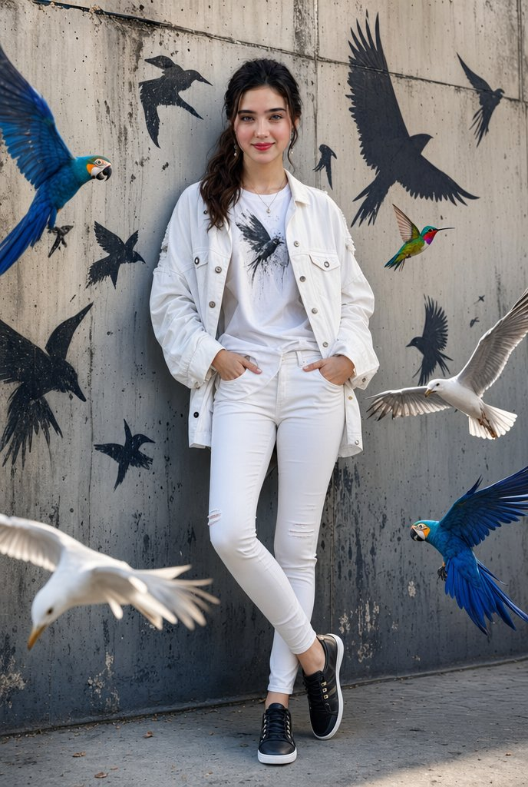
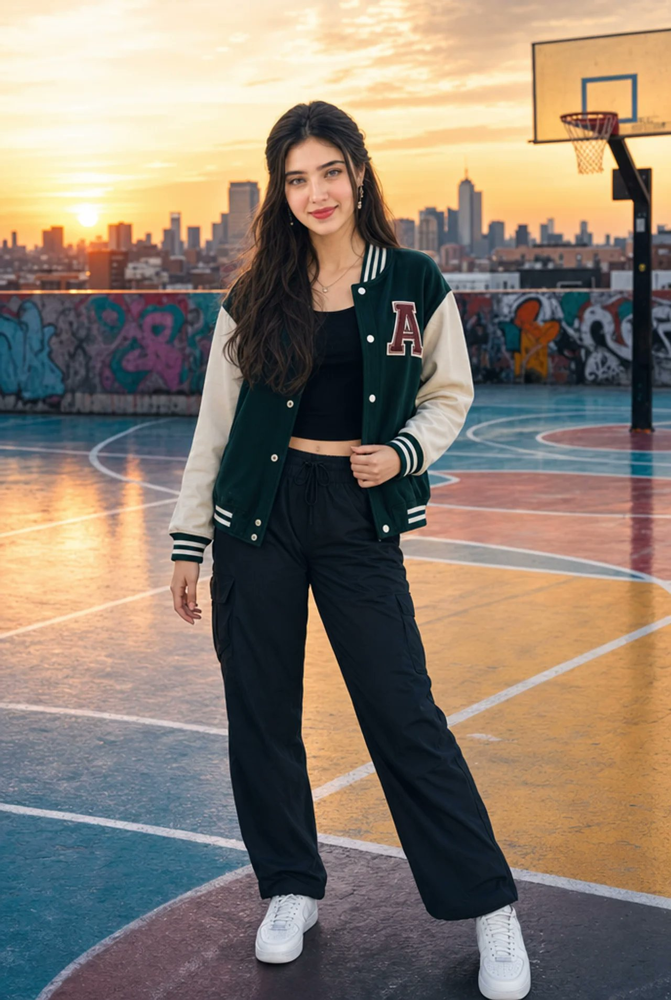
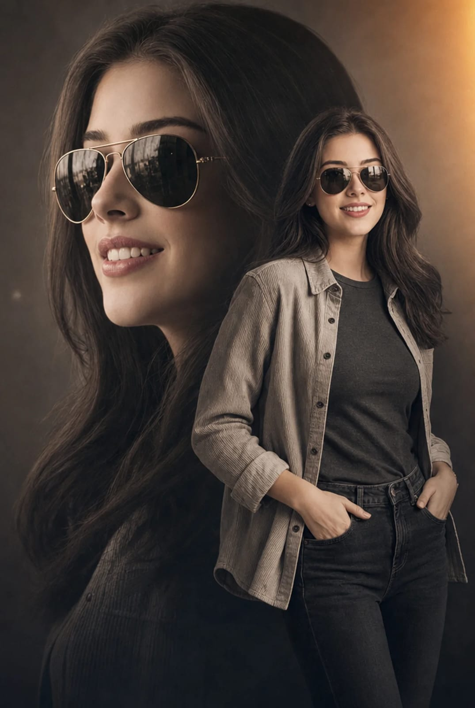
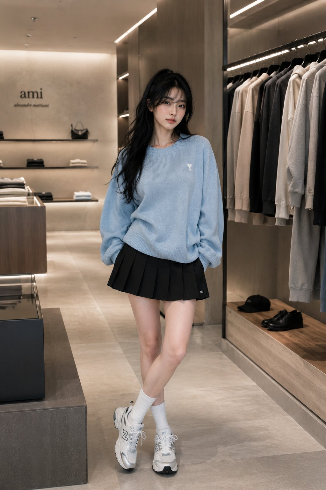
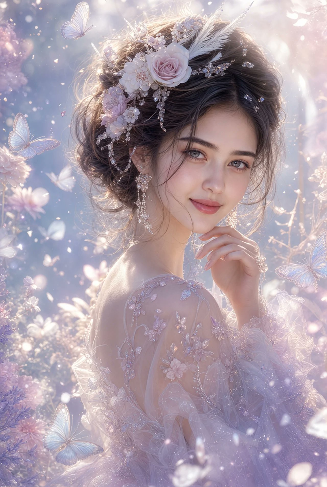
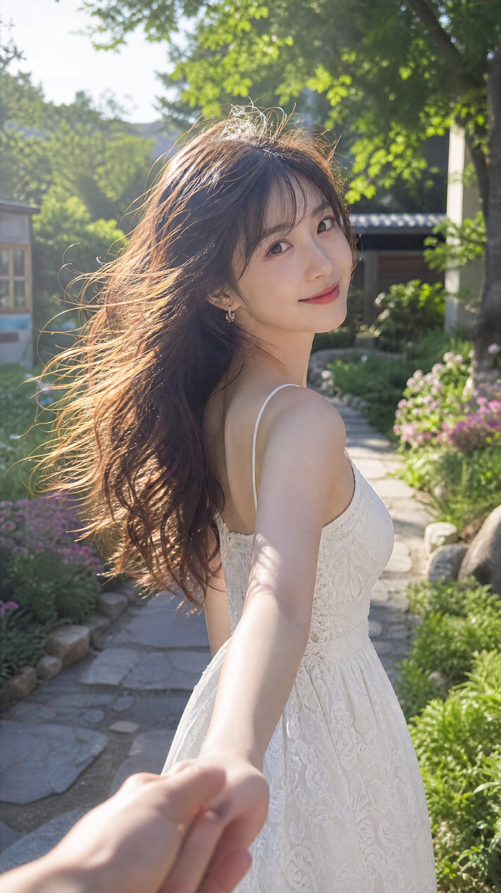

<!-- Generated by scripts/gallery.py; edit authoritative JSON, then rebuild. -->

# 全部资料 · 第 20 册

[画廊总览](gallery.md) | [上一册](gallery-part-19.md) | [下一册](gallery-part-21.md)

本册 25 条资料。标题链接固定到所示版本。

## 杂志纸艺拼贴重绘 · v1

- [杂志纸艺拼贴重绘 · v1](../cases/case-awesome-gpt-image-2-479-2d467cd5c007/v1.md) — awesome-gpt-image-2 \#479

原图文案例 · gpt-image

**已记录补充核查结果；以详情中的输入要求为准**

已核对原文输入要求与当前示例图；这是通用可替换主体/照片/标志模板，实际执行须由使用者提供相应输入，未发现必须另补某一指定源文件的明确要求。 审核只涉及资料输入要求/资产角色，不包含重新生图、身份一致性或像素复现验证。

**输出示例图**


<details>
<summary>展开完整提示词</summary>

```text
Transform the uploaded image into a minimalist illustration in a magazine collage style, using paper cutouts. Retain the main subject, pose, and overall concept of the original image, but reimagine it as a warm, hand-edited collage. Style: Minimalist illustration in a magazine paper collage style, with flat, layered paper shapes, soft pastel paper textures, torn paper edges, paper shadow effects, neat black doodle accents, a handmade scrapbook atmosphere, modern Korean editorial design, a simple and cute composition, and large areas of clean white space. Character: Cute, simplified Korean characters with minimalist facial features, a small, relaxed smile, soft and rounded proportions, simple and casual clothing, and silhouettes constructed from layered paper cutouts. Composition: A 3:4 aspect ratio, with the main subject positioned slightly lower and off-center, leaving a large, open space on the opposite side for a breezy, minimalist composition that avoids clutter. Objects: Add only a few suitable collage elements: paper sticky notes, small hearts, plants, a cup of coffee, a window, tape fragments, and simple doodle icons. Typography: Add an elegant, handwritten English title that fits the scene's atmosphere. Use short phrases such as: ["May you be like the morning sunshine, full of vitality and hope, embracing the beauty of each day.","Take a small break," or "Good day, good mood."] Atmosphere: Calm, comfortable, warm, sweet, and editorial style. Avoid: Photorealistic style, anime style, watercolor style, 3D clay style, overly detailed backgrounds, excessive collage elements, a luxury poster atmosphere, dark tones, harsh shadows, and sloppy text.
```

</details>

## 粉丝速写本角色页 · v1

- [粉丝速写本角色页 · v1](../cases/case-awesome-gpt-image-2-480-efebb4b75683/v1.md) — awesome-gpt-image-2 \#480

原图文案例 · gpt-image

**已记录补充核查结果；以详情中的输入要求为准**

“Draw me”需要人物身份上下文，但未声明必须是独立照片；允许使用者自供人物参考或说明，不能把本例机械判为确定缺图。 审核只涉及资料输入要求/资产角色，不包含重新生图、身份一致性或像素复现验证。

**输出示例图**


<details>
<summary>展开完整提示词</summary>

```text
Draw me as if an obsessed fan artist filled an entire sketchbook page - messy, overlapping, full-body poses, tiny chibi doodles, exaggerated expressions, and random close-ups of their hands or eyes.
White background. No grid, no order. Pure chaos energy. With (any color) aesthetic clothes
```

</details>

## 韩系春日 scrapbook 海报 · v1

- [韩系春日 scrapbook 海报 · v1](../cases/case-awesome-gpt-image-2-481-7cff58dd928f/v1.md) — awesome-gpt-image-2 \#481

原图文案例 · gpt-image

**已记录补充核查结果；以详情中的输入要求为准**

花园金发女性、宝丽来拼贴和Spring Dreams文案。已阅读全文并查看样图，图片为结果示例；未发现必须补充某一指定输入图片。

**输出示例图**


<details>
<summary>展开完整提示词</summary>

```text
Cute Korean spring aesthetic scrapbook poster, dreamy K-fashion portrait, soft blonde girl standing in a blooming flower garden, pastel blue sky background, cream floral blouse layered under a knitted ivory sweater vest, light blue high-waisted jeans, natural smile, glowing fair skin, soft makeup, cherry blossom trees, colorful spring flowers, cozy countryside garden, bright natural sunlight, kawaii doodle overlays, hand-drawn white hearts, smiley faces, stars, sparkles, rainbows, playful handwritten typography, polaroid photo frames, masking tape stickers, scrapbook collage layout, Pinterest aesthetic, Korean magazine editorial, cottagecore fashion, dreamy spring vibes, wholesome mood, soft pastel color palette, clean composition, aesthetic social media poster, ultra detailed, photorealistic, high quality, cute and charming atmosphere, subtle bokeh, lifestyle photography, Instagram reel cover, fashion moodboard, Y2K scrapbook design, white outline around subject, flower-themed decorations, 8k masterpiece
```

</details>

## 自我凝视超现实 Campaign · v1

- [自我凝视超现实 Campaign · v1](../cases/case-awesome-gpt-image-2-482-ba2caefac38f/v1.md) — awesome-gpt-image-2 \#482

原图文案例 · gpt-image

**已记录补充核查结果；以详情中的输入要求为准**

已实际看图并阅读全文。男性坐于放大自我头部的超现实海报；完整文本定义自我重复形象，无输入照要求。 本次核对资料关系、图片角色和输入条件，不代表身份、事实或逐像素生成正确性验收。

**输出示例图**


<details>
<summary>展开完整提示词</summary>

```text
Ultra-realistic conceptual portrait of a young man with curly hair and light stubble, wearing yellow-tinted rectangular sunglasses, a beige minimal t-shirt, blue jeans, and off-white sneakers. He is sitting casually with a relaxed posture.

The twist: he is seated on a large, hyper-realistic version of his own detached head placed on the ground. The head is scaled up, lying sideways, with the same facial features and sunglasses, creating a surreal self-reflection concept.

Composition: centered, full-body shot, neutral studio background with soft beige tones, minimal aesthetic. Clean negative space.

Typography integrated into the background:

* Handwritten-style text at the top: “HEAVY”
* Below it, smaller text: “ON MY OWN MIND” with “MIND” crossed out
* Large, rough, scribbled text in black: “HEAD”

Lighting: soft diffused studio lighting, subtle shadows, high detail, fashion editorial quality.

Style: blend of surrealism and modern streetwear campaign, minimal yet expressive, high-resolution, 8k, sharp focus, natural skin texture.

Mood: introspective, mental weight, identity, self-awareness.
```

</details>

## 都市飞鸟街头肖像 · v1

- [都市飞鸟街头肖像 · v1](../cases/case-awesome-gpt-image-2-483-caa69c7e0757/v1.md) — awesome-gpt-image-2 \#483

原图文案例 · gpt-image

**已记录补充核查结果；以详情中的输入要求为准**

实际查看：白衣女性倚墙，鸟群与黑色鸟形涂鸦。已通读完整归档指令；图像为该创作方向的结果样例，文本未要求某张特定外部原图。

**输出示例图**



<details>
<summary>展开完整提示词</summary>

```text
A stylish cinematic portrait of a confident young woman leaning casually against a textured urban concrete wall, surrounded by vibrant flying birds including blue macaws, white seagulls, and a colorful hummingbird. Black graffiti-style bird silhouettes painted on the wall create an artistic street-art vibe. She is wearing a trendy all-white outfit — oversized denim jacket, fitted graphic tee, skinny jeans, and black sneakers. Soft natural daylight, realistic shadows, ultra-detailed fashion photography, urban luxury aesthetic, sharp facial features, glossy hair, high-end editorial style, dynamic composition, photorealistic, depth of field, 8K quality.
```

</details>

## 霓虹涂鸦黑白人像 · v1

- [霓虹涂鸦黑白人像 · v1](../cases/case-awesome-gpt-image-2-484-6bd5a6f6b37f/v1.md) — awesome-gpt-image-2 \#484

原图文案例 · gpt-image

**已记录补充核查结果；以详情中的输入要求为准**

黑白男子人像配荧光绿眼睛与涂鸦，文本直接描述成品。已实际看样图并阅读完整 prompt；复核资料关系与输入条件，不代表生成复现或逐项事实准确性验收。

**输出示例图**


<details>
<summary>展开完整提示词</summary>

```text
High-contrast black-and-white urban portrait of a curly-haired bearded man in a black leather jacket, holding two fingers near glowing neon green eyes, with bold graffiti doodles, colorful paint splashes, abstract arrows, crown sketches, and grunge street-art textures on a concrete background, cinematic lighting, edgy graphic poster style.
```

</details>

## 时尚目录电商拼贴 · v1

- [时尚目录电商拼贴 · v1](../cases/case-awesome-gpt-image-2-485-8d2218c84a86/v1.md) — awesome-gpt-image-2 \#485

原图文案例 · gpt-image

**已记录补充核查结果；以详情中的输入要求为准**

酒红上衣与白裤女性的多格电商时尚目录。已阅读全文并查看样图，图片为结果示例；未发现必须补充某一指定输入图片。

**输出示例图**


<details>
<summary>展开完整提示词</summary>

```text
Stylish fashion catalog shoot blending streetwear and luxury branding. Female model wearing burgundy slim-fit top and ivory tailored pants, posed in confident relaxed positions across multiple duplicated frames. Slight perspective tilt, dynamic layout collage, soft daylight studio lighting with warm tone grading. Modern shopping website aesthetic, minimal UI-inspired composition, high resolution fashion photography.
```

</details>

## RCB 冠军混合媒介海报 · v1

- [RCB 冠军混合媒介海报 · v1](../cases/case-awesome-gpt-image-2-486-e2dbeb787076/v1.md) — awesome-gpt-image-2 \#486

原图文案例 · gpt-image

**已记录补充核查结果；以详情中的输入要求为准**

已核对原文输入要求与当前示例图；这是通用可替换主体/照片/标志模板，实际执行须由使用者提供相应输入，未发现必须另补某一指定源文件的明确要求。 审核只涉及资料输入要求/资产角色，不包含重新生图、身份一致性或像素复现验证。

**输出示例图**


<details>
<summary>展开完整提示词</summary>

```text
Ultra-detailed mixed-media sports poster featuring the SAME woman from the reference image, wearing a Royal Challengers Bengaluru (RCB) jersey, holding the IPL trophy beside her. Dynamic fusion of realistic portrait photography, sketch art, watercolor splashes, paint strokes, ink scribbles, and digital painting effects. Explosive red, black, gold, and white color palette. Dramatic championship atmosphere with confetti, fireworks, cheering stadium crowd, RCB flags waving in the background, paint splatter textures, hand-drawn line art accents, and energetic brushwork.

The woman has a confident expression, bold red lipstick, flawless skin, short black bob haircut, cinematic lighting, ultra-sharp blue eyes, premium sports-fashion styling. RCB face paint on cheek, luxury gold jewelry accents, highly detailed jersey fabric.

Large typography on the right side reading:

RCB
IPL CHAMPIONS
2026

Handwritten slogan at bottom left:

Ee Sala Cup Namde!

Premium championship poster design, trending Behance artwork, sports magazine cover aesthetic, layered paint textures, realistic trophy reflections, high contrast, ultra-detailed, 8K, masterpiece, award-winning digital art, vibrant colors, cinematic composition, splash art, sketch effect, watercolor effect, paint explosion effect, mixed-media illustration, poster-worthy design.
```

</details>

## 法式药妆商业分镜封面 · v1

- [法式药妆商业分镜封面 · v1](../cases/case-awesome-gpt-image-2-487-3b7465114e33/v1.md) — awesome-gpt-image-2 \#487

原图文案例 · gpt-image

**缺少必要输入图：请先查看详情并补齐参考图**

已实际看图并阅读全文。原图上半晨间闹钟画面、下半药妆分镜板；全文要求approved character sheet与exact product reference，资产里仅有完成板，板内产品近景不能当独立原始产品参考，所指输入未齐。 本次核对资料关系、图片角色和输入条件，不代表身份、事实或逐像素生成正确性验收。

**输出示例图**


<details>
<summary>展开完整提示词</summary>

```text
35mm anamorphic, 2.39:1, no flares. Ultra-realistic international French pharmacy skincare commercial for La Roche-Posay Anthelios UVMune 400 Hydrating Cream SPF50+. Soft premium music plus tactile realistic sound effects throughout. Rich warm natural grain, premium but not over-polished. Palette: warm ivory whites, soft stone neutrals, signature La Roche-Posay orange, subtle clinical cyan-blue, sunlit beige, realistic warm skin tones. The tube is iconic. The skin is the proof. Every shot builds toward the moment the product disappears into real skin and protection becomes confidence. Fast cuts, macro intimacy, tactile realism, one quiet transformation that feels earned: sunscreen that looks invisible, breathable, and real.

MODEL / WARDROBE

Use the same female model consistently across all shots, matching the approved character sheet: slim natural model proportions, warm medium skin tone, dark brown hair in a clean low bun, refined oval face, natural brows, realistic under-eye detail, subtle lips, minimal makeup. Same face, same hairstyle, same body structure, same skin tone, same wardrobe continuity throughout.

Wardrobe must be modest, elegant, and fully covered. No exposed body, no tank top, no fitted clothing, no cleavage, no bare shoulders, no body-hugging silhouette. Wardrobe: loose cream linen button-up shirt, full sleeves, fully buttoned or layered over a high-neck white inner top, soft beige trousers only if visible, minimal jewelry, refined French pharmacy skincare styling. Clothing should feel premium, breathable, clean, and international, never sensual, revealing, or fashion-body-focused.

The camera may show hands, face, neck-up portrait, shoulders, waist-up, mirror shots, bathroom ritual shots, and outdoor walking lifestyle shots, but the body must not be emphasized. Keep attention on skin texture, hands applying sunscreen, product packaging, morning ritual, and confident protected face.

SKIN REALISM

Skin must look human and unfiltered: visible pores, peach fuzz, tiny fine lines, slight under-eye texture, natural skin tone variation, realistic facial micro texture, matte-hydrated finish. No glossy skin, no oily shine, no wet-look face, no waxy AI skin, no porcelain smoothing, no glam beauty filter, no fake glow.

PRODUCT REFERENCE

Use the exact La Roche-Posay Anthelios UVMune 400 Hydrating Cream SPF50+ product reference: white tube, orange square logo, black La Roche-Posay typography, orange SPF50+ panel, light blue hydrating cream band, orange lower panel, white pump-cap base. Product shape and color blocking must remain consistent.

MUSIC DIRECTION

Soft elegant premium skincare music throughout: gentle piano, airy ambient pads, subtle low-end warmth, very light modern electronic pulse, calm emotional lift. Music should feel expensive, dermatological, trustworthy, and international. Never loud, never dramatic, never trailer-like, never distracting. The music should support the tactile sound design without overpowering it.
```

</details>

## 屋顶球场日落人像 · v1

- [屋顶球场日落人像 · v1](../cases/case-awesome-gpt-image-2-488-f727bbf22a9b/v1.md) — awesome-gpt-image-2 \#488

原图文案例 · gpt-image

**已记录补充核查结果；以详情中的输入要求为准**

实际查看：日落屋顶球场上的夹克女性人像。已通读完整归档指令；图像为该创作方向的结果样例，文本未要求某张特定外部原图。

**输出示例图**



<details>
<summary>展开完整提示词</summary>

```text
Ultra-realistic, high-quality portrait of a stylish young South Asian woman standing gracefully on a colorful urban rooftop basketball court at sunset. She is standing in a relaxed and elegant posture with her weight naturally shifted to one leg, shoulders relaxed, and one hand gently resting by her side while the other lightly touches the edge of her varsity jacket. Her body is slightly angled toward the camera, creating a confident yet sophisticated appearance. She is looking directly into the camera with a warm, natural smile, projecting confidence, charm, and effortless style.
```

</details>

## 城市地图微缩旅行海报 · v1

- [城市地图微缩旅行海报 · v1](../cases/case-awesome-gpt-image-2-489-67f22f154217/v1.md) — awesome-gpt-image-2 \#489

原图文案例 · gpt-image

**已记录补充核查结果；以详情中的输入要求为准**

ROME 地图上弯曲道路与踏板车微缩旅行海报，城市车辆可替换。已实际看样图并阅读完整 prompt；复核资料关系与输入条件，不代表生成复现或逐项事实准确性验收。

**输出示例图**


<details>
<summary>展开完整提示词</summary>

```text
Create a highly detailed cinematic miniature tilt-shift travel scene of [CITY NAME] featuring a realistic [VEHICLE NAME] driving along a winding elevated road that emerges naturally from a printed vintage-style city map. The road should curve dramatically toward the background skyline and landmarks of [CITY NAME], while the vehicle remains the clear focal point in the foreground.

Blend the real city seamlessly with the illustrated map surface so the road appears integrated into the map itself. Include recognizable local landmarks, waterways, architecture, vegetation, and atmosphere associated with [CITY NAME], but keep the composition clean and uncluttered.

Show large bold typography of "[CITY NAME]" printed directly on the map in the foreground. Use warm golden-hour lighting, shallow depth of field, realistic textures, cinematic shadows, aerial perspective, and photorealistic detail. The overall aesthetic should feel like a premium Instagram travel poster mixed with a miniature diorama.

Aspect ratio 1:1.
```

</details>

## 双重曝光时尚肖像 · v1

- [双重曝光时尚肖像 · v1](../cases/case-awesome-gpt-image-2-490-9bb292e87f8e/v1.md) — awesome-gpt-image-2 \#490

原图文案例 · gpt-image

**已记录补充核查结果；以详情中的输入要求为准**

已核对原文输入要求与当前示例图；这是通用可替换主体/照片/标志模板，实际执行须由使用者提供相应输入，未发现必须另补某一指定源文件的明确要求。 审核只涉及资料输入要求/资产角色，不包含重新生图、身份一致性或像素复现验证。

**输出示例图**



<details>
<summary>展开完整提示词</summary>

```text
A cinematic double-exposure fashion portrait featuring a woman with the uploaded face used 100% as reference, wearing stylish metallic aviator sunglasses. The composition artfully blends a large, semi-transparent close-up profile of her face on the left with her full-body figure standing confidently on the right. She wears an open, light-grey textured corduroy shirt layered over a dark grey fitted t-shirt and dark denim jeans, posing naturally with her hands in her pockets. She has long, flowing dark hair, flawless skin, elegant feminine features, and a confident, sophisticated expression.

The background is a minimalist neutral studio setting, allowing the double-exposure composition to remain the visual focus. The color grading features a sophisticated warm desaturated sepia and charcoal palette, enhanced by a soft golden-orange light-leak flare in the upper-right corner. Professional 85mm lens photography with high-contrast yet soft cinematic lighting accentuates the fabric textures, facial details, and layered portrait effect.

Ultra-realistic skin texture, luxury fashion-editorial aesthetic, premium magazine-cover quality, subtle film grain, cinematic depth, elegant shadows, refined color grading, modern retro-inspired styling, masterpiece composition, ultra-sharp focus, visually striking storytelling, high-end commercial fashion campaign look.
```

</details>

## Y2K 高楼浴室镜面自拍 · v1

- [Y2K 高楼浴室镜面自拍 · v1](../cases/case-awesome-gpt-image-2-491-90d8a82e2c9f/v1.md) — awesome-gpt-image-2 \#491

原图文案例 · gpt-image

**已记录补充核查结果；以详情中的输入要求为准**

浴室镜面、强闪光与桌面杂物的女性自拍。已阅读全文并查看样图，图片为结果示例；未发现必须补充某一指定输入图片。

**输出示例图**


<details>
<summary>展开完整提示词</summary>

```text
A moody late-night mirror selfie captured in a luxury high-rise bathroom overlooking a glowing city skyline. A young woman with long, slightly messy black hair leans forward over a marble sink, partially obscuring one eye with loose strands. The photo is taken through a smudged mirror with visible dust particles, water spots, and imperfections, creating an authentic raw aesthetic. A powerful direct camera flash explodes in the frame, producing harsh highlights, lens flare, and a nostalgic early-2000s digital camera look.

The bathroom counter is cluttered with luxury cosmetics, skincare products, jewelry, a smartphone, and everyday personal items, adding a lived-in editorial feel. Reflections of neon-lit skyscrapers and hotel windows shimmer in the background, emphasizing an urban nightlife atmosphere. Soft pale skin tones contrast against dark clothing and black hair. The composition feels intimate, candid, and effortlessly cool.

Style: Y2K flash photography, candid mirror selfie, Korean editorial aesthetic, indie sleaze, hotel bathroom scene, luxury lifestyle, cinematic nightlife, disposable camera look, grainy texture, flash burn, realistic skin texture, shallow depth of field, authentic imperfections, viral Pinterest mood, high-fashion casual energy, raw unfiltered photography.

Camera: direct flash, compact digital camera, 35mm equivalent, harsh lighting, slight motion blur, visible noise, natural color grading, vertical composition, ultra-realistic, high detail.
```

</details>

## 黑色高定酒店套房写真 · v1

- [黑色高定酒店套房写真 · v1](../cases/case-awesome-gpt-image-2-492-5ae676828ad8/v1.md) — awesome-gpt-image-2 \#492

原图文案例 · gpt-image

**已记录补充核查结果；以详情中的输入要求为准**

已实际看图并阅读全文。酒店套房酒红长裙女性；与黑色短裙文字条件有差异，但仍是同类时装肖像输出、没有指定原图依赖，未声明生成服装准确。 本次核对资料关系、图片角色和输入条件，不代表身份、事实或逐像素生成正确性验收。

**输出示例图**


<details>
<summary>展开完整提示词</summary>

```text
Create a hyper-realistic luxury fashion portrait inspired by premium fashion-week editorials.

IMPORTANT:
Generate ONLY ONE SINGLE VERTICAL IMAGE.

STYLE:
Luxury fashion realism.
Professional couture photography.
Premium editorial atmosphere.

MAIN CONCEPT:
A beautiful adult Asian fashion model photographed inside a luxury hotel suite.

OUTFIT:
Elegant black couture mini dress.
Luxury embroidered details.
Premium designer fashion aesthetic.

BACKGROUND:
Luxury hotel interior.
Soft neutral decor.
Elegant cinematic depth blur.

LIGHTING:
Soft luxury window lighting.
Professional fashion-editorial reflections.
Natural skin texture.

MOOD:
Bold.
Elegant.
High-fashion energy.

QUALITY:
Ultra realistic native 4K HDR realism.
Professional magazine quality.
Vertical 9:16.
```

</details>

## 东京旅行 13 格视频封面 · v1

- [东京旅行 13 格视频封面 · v1](../cases/case-awesome-gpt-image-2-493-b9de32d3fb52/v1.md) — awesome-gpt-image-2 \#493

原图文案例 · gpt-image

**已记录补充核查结果；以详情中的输入要求为准**

已查看整图和放大原图：上方旅行画面，下方13格旅行场景及SocialSight分隔标志。完整指令已列旅行角色、逐格情景和风格，未要求输入照片；结果以封面拼版展示，不把额外顶部画面当作外部参考输入。

**输出示例图**


<details>
<summary>展开完整提示词</summary>

```text
Generate image of young female travel vlogger exploring Tokyo across multiple candid moments, extremely beautiful with long dark wavy hair, wearing stylish Japanese-inspired oversized streetwear, expressive and spontaneous personality, captured across a 13-frame grid collage (Row 1: 4 frames | Row 2: 5 frames | Row 3: 4 frames), each frame feels like a real casual phone capture with imperfect framing and natural inconsistencies.

Frame Breakdown

Row 1 - Frame 1 (Tokyo Tower): low angle selfie with Tokyo Tower behind her, slightly tilted horizon, sky overexposed to near white, she's mid-natural smile adjusting into frame, small lens smudge in corner, candid arrival energy.
Row 1 - Frame 2 (Shibuya street level): walking through Shibuya crossing at night, handheld motion blur, she glances back at camera mid-step, neon reflections on wet pavement, slightly shaky framing, imperfect crop.
Row 1 - Frame 3 (Convenience store): inside a brightly lit convenience store, she is holding onigiri close to camera, playful raised eyebrows, harsh fluorescent lighting flattening the scene, slight overexposure on whites, shelves softly blurred behind.
Row 1 - Frame 4 (Yoyogi park): sitting on a bench under trees, looking away from camera, quiet candid moment, soft dappled daylight, slight focus miss on eyes, subtle lens smudge bottom corner.
Row 2 - Frame 5 (Takoyaki reaction): close-up while eating single takoyaki, reacting mid-bite with laughter, slight motion blur, warm lantern light behind, face slightly out of focus due to movement.
Row 2 - Frame 6 (Vending machine night): standing in front of glowing vending machine, blue and pink light casting uneven tones on her face, pressing button casually, high ISO grain visible.
Row 2 - Frame 7 (Train reflection): her face reflected in train window at night, city lights streaking behind, layered reflection effect, slight ghosting on glass, she looks away from camera.
Row 2 - Frame 8 (Torii gate): low angle shot of her walking through a torii gate, captured from slightly behind, motion blur in her movement, bright sky causing mild lens flare.
Row 2 - Frame 9 (Digital art exhibit): inside immersive light exhibit, colored lights (blue, violet, gold) washing across her face, she looks upward in awe, slight motion blur, low-light noise visible.
Row 3 - Frame 10 (Gundam statue): low angle wide shot, she stands small in frame while large statue towers above, slight barrel distortion from phone lens, sky slightly blown out.
Row 3 - Frame 11 (Lantern alley): walking through narrow alley lit by warm lanterns, shot from behind, she glances back briefly, underexposed shadows, grainy night detail.
Row 3 - Frame 12 (Rooftop skyline): selfie with Tokyo skyline behind, arm extended, wind blowing hair partially across lens, horizon slightly tilted, warm city glow overexposed in distance.
Row 3 - Frame 13 (Nara park): crouching down in a park in Nara, she holds out a deer cracker toward a deer, the deer bows its head toward her, she bursts into genuine laughter mid-reaction, surprised and slightly leaning back, another deer nudges her from behind causing her to lose balance slightly, camera captures the moment imperfectly with slight shake and off-center framing, soft natural daylight, open park background with trees and space, unscripted chaotic energy, candid expression.

Young female travel vlogger exploring Tokyo across 13 candid moments in a grid collage, extremely beautiful with long dark wavy hair, wearing stylish Japanese streetwear, expressive and spontaneous, scenes include Tokyo Tower selfie, Shibuya crossing at night, convenience store snack moment, park bench quiet scene, takoyaki reaction, vending machine glow, train window reflection, torii gate walk, immersive light exhibit, Gundam statue low angle, lantern alley walk, rooftop skyline selfie, Harajuku street ending, each frame slightly imperfect with motion blur.
```

</details>

## 电动巴士工程信息图 · v1

- [电动巴士工程信息图 · v1](../cases/case-awesome-gpt-image-2-494-0b95890e6bcf/v1.md) — awesome-gpt-image-2 \#494

原图文案例 · gpt-image

**已记录补充核查结果；以详情中的输入要求为准**

E-BUS 工程信息图，巴士主图及技术小图是成品模块。已实际看样图并阅读完整 prompt；复核资料关系与输入条件，不代表生成复现或逐项事实准确性验收。

**输出示例图**


<details>
<summary>展开完整提示词</summary>

```text
Create a premium square “reference-style sustainable transportation infographic” centered around a futuristic electric city bus called the {E_BUS_NAME}, designed as a beautifully curated urban-mobility handbook page rather than a commercial vehicle advertisement.

The composition should feel like a modern visual encyclopedia mixed with an elite public-transit engineering guide and high-end editorial infographic system.

Visual Direction

• 1:1 square composition
• Premium smart-city background with subtle transportation blueprints, circuit-inspired overlays, and urban infrastructure schematics
• Elegant palette using deep navy, graphite black, electric green, steel gray, and soft cyan accents
• Refined editorial typography hierarchy
• Rounded modular information cards with clean spacing
• Gentle realistic reflections and premium transit-system dividers
• Minimal transportation engineering iconography
• Extremely detailed central electric bus render viewed in dramatic three-quarter perspective driving through a futuristic smart-city boulevard
• Thin precision annotation lines pointing toward key systems and technologies
• Clean, organized “knowledge-first” layout with high information density but breathable spacing

Main Subject Presentation

A stunning ultra-detailed realistic render of the {E_BUS_NAME} placed at the center, featuring:

• sleek aerodynamic body design
• panoramic windshield
• illuminated destination display
• low-floor accessibility layout
• futuristic LED lighting systems
• premium electric drivetrain details
• realistic urban reflections
• smart-city transportation realism

Surround the bus with engineering callouts explaining:

• battery pack technology
• electric motor system
• regenerative braking system
• charging infrastructure compatibility
• smart fleet management systems
• passenger accessibility features
• thermal battery management
• energy-efficiency technologies
• safety monitoring systems
• intelligent driver assistance features

Include Modular Sections

• E-Bus Overview
• Technical Specifications
• Vehicle Dimensions & Capacity
• Powertrain & Energy System
• Battery Technology Breakdown
• Charging Solutions
• Passenger Comfort Features
• Safety & Reliability Systems
• Fleet Management Technology
• Environmental Impact Analysis
• Operating Cost Comparison
• Construction & Material Engineering
• Sustainability Lifecycle Assessment
• Smart-City Integration
• Global Adoption Trends
• “Did You Know?” Facts Section
• Future of Electric Public Transport

Add Premium Visualization Modules

• battery architecture diagrams
• charging workflow graphics
• energy-consumption charts
• passenger-capacity visualizations
• smart-city integration maps
• drivetrain cutaway illustrations
• environmental impact comparisons
• fleet-management dashboards
• vehicle blueprint dimensions
• lifecycle sustainability graphics

Style Keywords

“premium transportation encyclopedia”
“editorial electric mobility handbook”
“high-end public transit infographic”
“scientific transportation poster”
“museum-quality electric bus reference page”
“modular smart-city knowledge system”
“clean engineering editorial design”
“ultra-detailed mobility visualization”
“future transportation showcase”
“sustainable urban mobility design”

Avoid

• generic vehicle advertisements
• cluttered commercial brochure layouts
• cartoon transportation styling
• unrealistic flying-bus concepts
• excessive cyberpunk neon overload
• low-detail stock-vehicle renders

Final Goal

The final result should resemble a professionally published transportation-engineering reference-book page created for urban planners, transportation engineers, sustainability researchers, architects, public-transit authorities, and smart-city enthusiasts, combining technical accuracy, sustainability insights, and premium editorial design.
```

</details>

## 巴黎街头故事书插画 · v1

- [巴黎街头故事书插画 · v1](../cases/case-awesome-gpt-image-2-495-ac5db87cde13/v1.md) — awesome-gpt-image-2 \#495

原图文案例 · gpt-image

**已记录补充核查结果；以详情中的输入要求为准**

巴黎咖啡馆前持杯微笑的女性故事书风画面。已阅读全文并查看样图，图片为结果示例；未发现必须补充某一指定输入图片。

**输出示例图**


<details>
<summary>展开完整提示词</summary>

```text
Portrait illustration in a storybook style featuring a young adult woman exploring the streets of Paris. She is laughing happily with her eyes closed, holding a coffee cup in her hand. She has long, wavy hair and wears a beret hat. The scene is set near a Parisian café in a peaceful morning atmosphere. The woman has a sweet, charming smile. Soft, dreamy mood, romantic Paris street vibe, gentle lighting, and highly detailed artwork.
```

</details>

## 水雕品牌 Logo 六宫格 · v1

- [水雕品牌 Logo 六宫格 · v1](../cases/case-awesome-gpt-image-2-496-9ba0679cee7a/v1.md) — awesome-gpt-image-2 \#496

原图文案例 · gpt-image

**已记录补充核查结果；以详情中的输入要求为准**

已实际看图并阅读全文。海面水形成六品牌Logo合集；文本要求六宫格水雕，无特定Logo文件依赖。 本次核对资料关系、图片角色和输入条件，不代表身份、事实或逐像素生成正确性验收。

**输出示例图**


<details>
<summary>展开完整提示词</summary>

```text
Create a premium 3x2 grid collage of iconic global brand logos recreated entirely from dynamic water formations, floating above a crystal-clear ocean under a vibrant blue sky. Each panel features a different logo sculpted from realistic transparent water, with detailed splashes, droplets, reflections, refractions, and flowing liquid textures. The water forms should look physically accurate, elegant, and instantly recognizable while remaining made completely of water.
```

</details>

## 单色水彩城市旅行海报 · v1

- [单色水彩城市旅行海报 · v1](../cases/case-awesome-gpt-image-2-497-03eba575ec25/v1.md) — awesome-gpt-image-2 \#497

原图文案例 · gpt-image

**已记录补充核查结果；以详情中的输入要求为准**

实际查看：东京地标与蓝色单色水彩街景旅行海报。已通读完整归档指令；图像为该创作方向的结果样例，文本未要求某张特定外部原图。含可替换主题、人物或参数，样例可采用不同填充值；不把通用占位符视为缺少指定图片。

**输出示例图**


<details>
<summary>展开完整提示词</summary>

```text
Minimalist vintage watercolor travel poster illustration of [CITY NAME], [COUNTRY], rendered entirely in elegant monochromatic [COLOR] watercolor and fine ink linework.

Aspect ratio: 4:5 vertical composition optimized for poster and social media presentation.

A peaceful early-morning streetscape featuring the iconic [PRIMARY LANDMARK] and [SECONDARY LANDMARK/LOCATION] in the foreground, viewed from a slightly low pedestrian-level perspective. Historic local architecture, elegant facades, ornate details, arched windows, decorative cornices, and traditional street elements line the spacious surroundings, creating a timeless urban atmosphere. A classic [LOCAL STREET ELEMENT OR LAMP STYLE] stands prominently on the left side, while mature leafy trees frame portions of the scene, their foliage painted with soft watercolor washes and delicate splatter textures. In the distance, [DISTANT LANDMARK OR SKYLINE FEATURE] rises gracefully against the skyline, serving as a recognizable cultural landmark. A vintage [LOCAL VEHICLE] or a few small pedestrians add subtle life and scale without disturbing the tranquil mood.

The composition includes large areas of clean white negative space, soft cloudy watercolor textures in the sky, delicate paper grain, and subtle watercolor blooms. The paving, street, or plaza stretches dramatically across the foreground, leading the viewer’s eye toward the landmark ensemble. Typography in the upper-left corner reads “[CITY NAME], [COUNTRY]” in a refined serif font, styled like a sophisticated travel journal or collectible city poster.

Handcrafted watercolor illustration, architectural sketch aesthetic, serene urban atmosphere, soft natural morning lighting, muted monochromatic palette, highly detailed line art, elegant travel-poster design, minimalist luxury wall-art style, timeless local charm, premium stationery illustration, ultra-detailed, high-resolution, clean composition, Pinterest-worthy, Instagram-worthy, gallery-quality artwork.
```

</details>

## 铅笔画背景 3D 分身 · v1

- [铅笔画背景 3D 分身 · v1](../cases/case-awesome-gpt-image-2-498-b3e691f4dc48/v1.md) — awesome-gpt-image-2 \#498

原图文案例 · gpt-image

**已记录补充核查结果；以详情中的输入要求为准**

巨幅打哈欠铅笔肖像前站人物，image/foto 是可替换输入槽；复用需提供照片，未指定某张必需原图。已实际看样图并阅读完整 prompt；复核资料关系与输入条件，不代表生成复现或逐项事实准确性验收。

**输出示例图**


<details>
<summary>展开完整提示词</summary>

```text
Create a handrawn pencil illustration of [image] yawning on paper, as background.

Add a 3D Pixar style render of [foto] standing casually infront of the giant handrawn pencil illustration. Soft cinematic lighting. 8K resolution. 3:4 ratio
```

</details>

## 极简精品店全身时尚写真 · v1

- [极简精品店全身时尚写真 · v1](../cases/case-awesome-gpt-image-2-499-509609095838/v1.md) — awesome-gpt-image-2 \#499

原图文案例 · gpt-image

**已记录补充核查结果；以详情中的输入要求为准**

已复核为可替换输入模板。复用时需自备：用户选择的人像照片；本库未保存原示例的独立输入，不能承诺原样复现示例身份。主会话已复读完整原文，图文要求中没有必须另取某个独有风格/前序作品才能理解的缺口。初审观察：精品店内蓝毛衣黑裙女性全身结果；prompt明确要求与reference相同外貌，单图内未见独立参考源。特定外貌参考未包含在本条唯一资产中，需要补参考图；不能由结果裁切构造输入。

**输出示例图**



<details>
<summary>展开完整提示词</summary>

```text
A full-body editorial fashion photograph of a beautiful young woman with the same appearance as the reference, long glossy dark hair, soft bangs, fair skin, and refined feminine features. She stands casually in an upscale minimalist fashion boutique, wearing an oversized pastel-blue knit sweater paired with a black pleated tennis-style skirt, white crew socks, and chunky designer sneakers. Relaxed confident pose, gentle smile, luxury retail interior with modern clothing racks, neutral-toned garments, warm ambient lighting, wood and stone textures, clean architectural lines, cinematic depth of field, realistic lighting, premium fashion advertising, Vogue-style editorial, ultra-detailed, sharp focus, photorealistic, 4K.
```

</details>

## 梦幻花冠仙境肖像 · v1

- [梦幻花冠仙境肖像 · v1](../cases/case-awesome-gpt-image-2-500-4e563719cbbc/v1.md) — awesome-gpt-image-2 \#500

原图文案例 · gpt-image

**已记录补充核查结果；以详情中的输入要求为准**

已实际看图并阅读全文。花冠女性、蝴蝶和淡紫幻想光影肖像；文字完整描述外貌与材质。 本次核对资料关系、图片角色和输入条件，不代表身份、事实或逐像素生成正确性验收。

**输出示例图**



<details>
<summary>展开完整提示词</summary>

```text
Ultra-realistic ethereal fantasy portrait of a breathtaking young woman with delicate porcelain skin, soft grey-blue eyes, and natural rosy lips. She gazes gently toward the viewer with a serene, dreamy expression, her fingertips lightly touching her chin. Wispy ash-brown hair flows softly in the breeze, styled in a loose romantic updo adorned with pastel blush roses, shimmering crystal ornaments, delicate feathers, and intricate floral accessories. She wears elegant dangling crystal earrings and a translucent, flowing gown made of sheer iridescent fabric embroidered with tiny sparkling flowers.

The scene is bathed in soft diffused morning light, creating a luminous glow around her face and shoulders. Surrounded by floating butterflies, sparkling dust particles, translucent petals, and dreamy floral textures, the background blends pastel lavender, pearl white, blush pink, and silver tones. Cinematic fine-art photography, fairycore aesthetic, enchanted garden atmosphere, magical realism, ultra-detailed skin texture, soft focus highlights, volumetric lighting, bokeh, masterpiece quality, highly detailed, 8K resolution, delicate feminine beauty, romantic fantasy artwork, elegant composition, dreamy color grading, soft glow, celestial ambiance.
```

</details>

## 夏日牵手回眸电影肖像 · v1

- [夏日牵手回眸电影肖像 · v1](../cases/case-awesome-gpt-image-2-501-cbc0e9b8b4ee/v1.md) — awesome-gpt-image-2 \#501

原图文案例 · gpt-image

**已记录补充核查结果；以详情中的输入要求为准**

实际查看：庭院小路上牵手回眸女性与发丝逆光。已通读完整归档指令；图像为该创作方向的结果样例，文本未要求某张特定外部原图。含可替换主题、人物或参数，样例可采用不同填充值；不把通用占位符视为缺少指定图片。

**输出示例图**



<details>
<summary>展开完整提示词</summary>

```text
Cinematic portrait photography, ultra-photorealistic, 2160x3840 vertical composition, 50mm or 85mm portrait lens rendering, shallow depth of field, clean translucent summer natural-light color grading — not overly yellow, not over-filtered.

Subject: a young beautiful adult East Asian woman, [describe face shape and features, e.g. soft heart-shaped face, refined classical features, bright almond/fox eyes, petite nose bridge, naturally full lips], overall vibe sweet, sunny, energetic, cute with a touch of allure. Gaze highly engaging — bright, clear, natural catchlights, as if it speaks; corners of mouth slightly lifted, expression gentle, vivid, natural.

She walks along a [scene, e.g. garden stone path / tree-lined lane / European street / courtyard], right hand reaching back to hold the hand of someone behind her; only their hand appears in the lower-left corner — like a first-person couple's POV snapshot. She glances back at the camera while her body stays in a forward walking motion, posture elegant and natural, clearly a candid captured moment with a faint in-love feeling.

Long [hair color] hair, [style, e.g. naturally wavy / relaxed big waves / airy bangs / half-up], many strands tousled and flying in the wind, richly layered and dynamic. Strong natural side-backlight rims the hair edges — clean, crisp rim light and semi-translucent glow, hair edges lit as if by sunlight, light and luminous. This is the core highlight of the image.

She wears [outfit, e.g. white lace slip dress / beige slip dress / light-blue short-sleeve top with white skirt / light-pink fitted dress], fabric texture natural, material light and soft. Bright natural summer sunlight realistically warms her skin, shoulders, collarbone, and clothing with soft, clean highlight transitions.

Skin texture: extremely realistic — visible fine pores, natural skin texture, faint imperfections, subtle tone variation, soft sheen. Cheeks, nose tip, shoulders show natural delicate gradations in sunlight. Translucent, healthy, real and refined — no plastic look, no waxwork, no over-smoothing.

Background: soft atmospheric blur, never distracting.

Avoid: over-smoothing, plastic skin, CG look, anime look, wig look, stiff expression, dead eyes, stiff poses, overall yellow cast, overexposed face, distorted features, wrong fingers, deformed hands, cluttered background, heavy influencer retouching.
```

</details>

## 黑桃国王递归扑克牌 · v1

- [黑桃国王递归扑克牌 · v1](../cases/case-awesome-gpt-image-2-502-12acf3fa2aa8/v1.md) — awesome-gpt-image-2 \#502

原图文案例 · gpt-image

**已记录补充核查结果；以详情中的输入要求为准**

已核对原文输入要求与当前示例图；这是通用可替换主体/照片/标志模板，实际执行须由使用者提供相应输入，未发现必须另补某一指定源文件的明确要求。 审核只涉及资料输入要求/资产角色，不包含重新生图、身份一致性或像素复现验证。

**输出示例图**


<details>
<summary>展开完整提示词</summary>

```text
Use my uploaded face image as the primary identity reference. Preserve my exact facial identity with extremely high fidelity: identical facial structure, jawline, cheekbones, eye shape, eyebrows, nose, lips, beard pattern, hairstyle, hair texture, skin tone, skin texture, and overall recognizable appearance. Do not beautify, alter, or reinterpret my face. Maintain realistic anatomy and authentic likeness.

Create an ultra-detailed, cinematic, surreal luxury playing-card artwork.

The main subject is me as the King of Spades, occupying the full design of a magnificent, royal Ace-quality playing card. I wear elaborate black-and-silver spade-themed regalia, a crown forged from obsidian and polished steel, intricate embroidered armor, and flowing royal garments decorated with subtle spade symbols. My expression is calm, intelligent, and powerful.

In my right hand, I am holding a pristine Ace of Spades card.

The creative twist: the Ace of Spades I am holding is not a normal card. It contains another complete playing-card illustration. Inside that card, I again appear as the King of Spades, and that entire card is being elegantly held between the fingers of a majestic Queen of Hearts. The Queen is graceful, regal, and visually striking, dressed in rich crimson and gold royal attire adorned with heart motifs.

The illusion continues with subtle recursive storytelling: the Queen of Hearts appears to be examining the card with fascination, creating a “card within a card” visual paradox. The composition should feel like a legendary tale of power, strategy, love, and destiny intertwined.

Add impossible Escher-inspired visual design elements:
•Infinite recursion effect
•Card-world folding into itself
•Floating spade and heart symbols transforming into ravens and rose petals
•Ornate golden borders extending beyond physical card edges
•Royal chess pieces suspended in midair
•Fractal patterns hidden within the card engravings
•Elegant smoke forming suit symbols
•Dimensional portals emerging from card corners

Style: ultra-realistic fantasy realism mixed with luxury casino art, Renaissance royal portraiture, and modern cinematic concept art.

Lighting: dramatic chiaroscuro, volumetric god rays, rich contrast, glowing metallic highlights, subtle magical energy around the Ace of Spades.

Color palette:
•Deep blacks
•Silver chrome
•Ivory white
•Crimson red
•Antique gold accents

Composition:
•Vertical masterpiece
•Museum-quality detail
•Hyper-realistic textures
•Intricate card engravings
•Perfectly symmetrical playing-card aesthetics blended with cinematic depth
•Sharp focus on my face
•Extremely high identity fidelity
•Epic storytelling through visual symbolism

The final image should feel like the cover of a legendary fantasy card game where the King of Spades has become self-aware, existing across multiple layers of reality while being held in the hands of fate itself, represented by the Queen of Hearts.
```

</details>

## 霓虹设计师 3D 海报 · v1

- [霓虹设计师 3D 海报 · v1](../cases/case-awesome-gpt-image-2-503-486f64d763ce/v1.md) — awesome-gpt-image-2 \#503

原图文案例 · gpt-image

**已记录补充核查结果；以详情中的输入要求为准**

蓝色 DESIGN MODE 设计师海报含肩上小狗和迷你公仔，公仔不是输入。已实际看样图并阅读完整 prompt；复核资料关系与输入条件，不代表生成复现或逐项事实准确性验收。

**输出示例图**


<details>
<summary>展开完整提示词</summary>

```text
Create an ultra-detailed 3D stylized creative designer poster featuring a cool young digital artist standing confidently in the center of a futuristic blue neon studio. The character wears oversized black streetwear with electric-blue graphic accents, black cargo pants, layered silver chains, black sunglasses, and clean white sneakers. A cute fluffy puppy sits on the artist's shoulder. The camera angle is dramatic low-angle perspective, making the sneakers appear larger for a premium poster effect.

Surround the character with floating creative elements including a glowing laptop, professional camera, design books, notebooks, 3D icons, social media symbols, holographic UI panels, graphic design tools, and futuristic blue geometric shapes. Add motivational typography such as "DESIGN MODE", "CREATE • BUILD • INSPIRE", and "CREATIVE NEVER SLEEPS" integrated into the scene.

Include a collectible chibi mini-figure version of the character standing beside the main subject on a display base. Use cinematic blue lighting, glossy reflections, volumetric glow, depth of field, floating particles, luxury toy-photography aesthetics, high-end 3D rendering, Octane Render quality, ultra-sharp details, vibrant neon blue color palette, futuristic creator workspace atmosphere, premium commercial poster design, trending ArtStation style, masterpiece quality, 8K resolution, vertical 9:16 composition.
```

</details>

