<!-- Generated by scripts/gallery.py; edit authoritative JSON, then rebuild. -->

# 全部案例 · 第 21 册

[画廊总览](gallery.md) | [上一册](gallery-part-20.md) | [下一册](gallery-part-22.md)

本册 25 个案例。标题链接固定到所示版本。

## 粗糙涂鸦人像改图 · v1

- [粗糙涂鸦人像改图 · v1](../cases/case-awesome-gpt-image-2-504-639918d9deb8/v1.md) — awesome-gpt-image-2 \#504

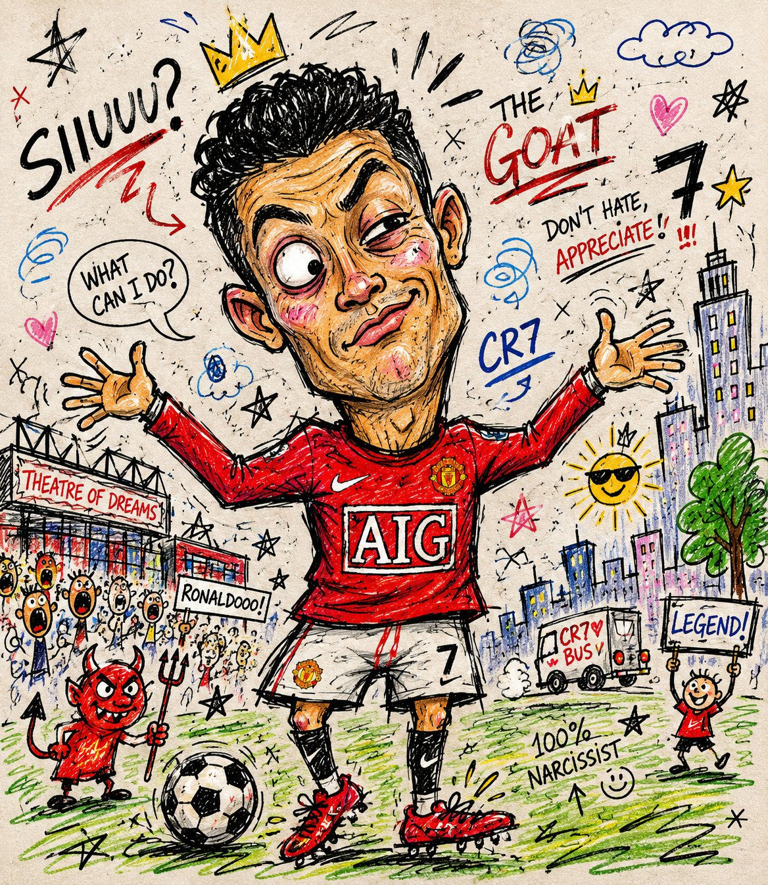

<details>
<summary>展开完整提示词</summary>

```text
Turn this photo into a chaotic funny doodle illustration, intentionally messy and low-skill, as if drawn quickly with a cheap marker, crayon, or worn-out felt pen on paper.

Create exaggerated facial features with awkward proportions, uneven eyes, oversized head, tiny body, crooked smile, and clumsy anatomy while still keeping the person recognizable. Use rough childish sketch lines, shaky hand-drawn strokes, visible scribbles, overlapping outlines, accidental marks, and random doodles around the scene. Add a simple cartoon-style background with badly drawn buildings, trees, clouds, street elements, and uneven perspective. Coloring should look careless and imperfect, with visible stroke texture, inconsistent fill areas, wax crayon texture, marker bleed, and irregular shading. Include playful imperfections like crossed-out lines, unfinished details, random arrows, tiny notes, stars, swirls, and abstract scribbles. Overall aesthetic should feel humorous, spontaneous, handmade, energetic, goofy, and intentionally unpolished, resembling a child's sketchbook mixed with absurd internet meme art. High texture detail, paper grain visible, asymmetrical composition, awkward framing, expressive doodle chaos, raw sketch energy.
```

</details>

## 夜间手机光沙发肖像 · v1

- [夜间手机光沙发肖像 · v1](../cases/case-awesome-gpt-image-2-505-374d2e8afad3/v1.md) — awesome-gpt-image-2 \#505

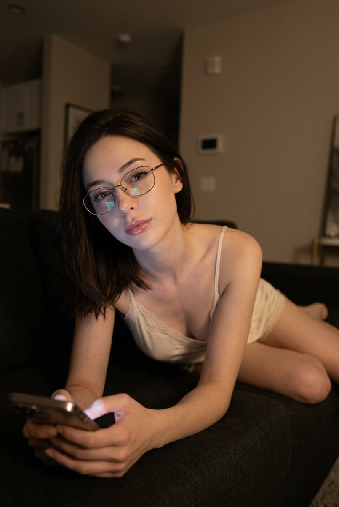

<details>
<summary>展开完整提示词</summary>

```text
A young adult woman with soft refined features, thin metal glasses, and shoulder-length dark tousled hair, leaning forward across a dark upholstered couch at night. She wears a pale cream lace-trim camisole with thin straps and matching soft shorts. One hand holds a smartphone close to the foreground, the screen glow casting cool reflections on her fingers and glasses lenses. Her expression is dreamy and softly tired, eyes lifted toward the camera as if she just looked up from scrolling, lips gently closed in a relaxed pout.

Shot in a vertical 3:4 frame at slightly above eye level, medium close-up to three-quarter portrait. Warm dim tungsten room light mixed with cool phone-screen reflections, no flash, soft falloff across the couch and wall. Shallow depth of field, soft low-light grain, slight motion blur, natural imperfect sharpness. Background: plain beige-gray wall, minimal decor, late-night atmosphere. Soft glam makeup: subtle eyeliner, long lashes, smooth skin, glossy pink-nude lips. Realistic social-media night portrait aesthetic.
```

</details>

## 可爱发卡图文人像海报 · v1

- [可爱发卡图文人像海报 · v1](../cases/case-awesome-gpt-image-2-506-19b25623e06c/v1.md) — awesome-gpt-image-2 \#506


<details>
<summary>展开完整提示词</summary>

```text
围绕具体主题内容生成一张明亮清爽的图文合成视觉：画面以大面积高明度纯净色场承托主体，背景平整、通风、没有复杂景深，视觉重心由下方被大胆裁切的人像或真实主体建立，只露出最有记忆点的局部，使主体像从画面边缘进入。主体上方叠放一个极简图形符号或拟物角色，它要像轻轻坐在主体头顶或贴合轮廓生长出来，形体圆润、边缘干净、表情或结构由少量粗线完成，兼具标识感和亲近感。文字是画面的主动角色：顶部使用大号手写感标题，字距松、笔画柔软，像一句轻声招呼；中心用更强的竖向或轴向标题建立层级；边缘安放少量小字号信息，保持安静但精确，让空白继续占主导。色彩从主题自身的材质、情绪、地域或品牌语义中提取，映射为明亮底色、洁净主体亮面、清晰深色结构线与少量强调信息色，保留大面积轻快底场、小面积高对比文字线条、自然主体暗部的关系；整体保持高明度、清透、干净、饱和度清晰而不过度刺激，暗色只用于结构和阅读，不制造脏灰、烟雾或陈旧质感。摄影局部与扁平图形之间要形成真实与童趣的反差，边缘叠压准确，阴影极少，完成感像城市公共宣传与角色插画结合的轻松视觉系统。

主题：柳岩

比例9:16
```

</details>

## 暖调钩织角色玩偶 · v1

- [暖调钩织角色玩偶 · v1](../cases/case-awesome-gpt-image-2-507-e8f386597159/v1.md) — awesome-gpt-image-2 \#507


<details>
<summary>展开完整提示词</summary>

```text
A handcrafted crochet doll of a [subject], made with soft yarn textures and intricate knitted details. Dressed in a vivid [color1] accent and a delicate [color2] garment, holding a small [prop]. Set in a cozy [setting], warm muted atmosphere, charming handmade aesthetic, nostalgic amigurumi style.
```

</details>

## 木漏日庭院俯拍猫咪人像 · v1

- [木漏日庭院俯拍猫咪人像 · v1](../cases/case-awesome-gpt-image-2-508-647240c2aba6/v1.md) — awesome-gpt-image-2 \#508

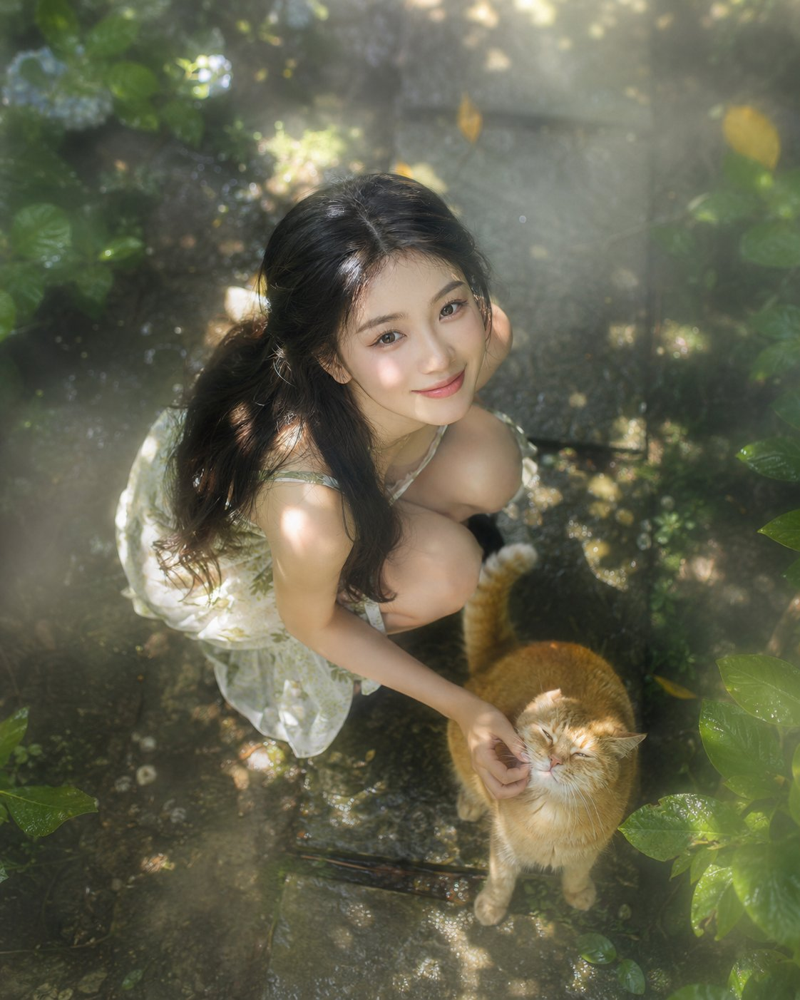

<details>
<summary>展开完整提示词</summary>

```text
俯拍镜头，高角度顶机位，自上而下俯瞰一位年轻的东亚裔女性，她有着精致的东亚五官和柔顺的黑发。她蹲在花园小径上，轻轻逗弄一只毛茸茸的橘猫。头顶密密的枝叶滤过阳光，形成灵动的“木漏日”效果——跃动、圆形的光斑在她的肌肤和猫毛上流转舞动。空气中悬浮着淡淡的潮湿薄雾，捕捉住光束，营造出柔和可见的立体光柱（丁达尔效应）。当她仰头朝向镜头时，一层轻雾柔化了画面边缘，增添梦幻氛围。她的表情从略带俏皮的轻噘嘴，渐渐转为眼角堆起细纹的真挚笑容，斑驳的光线恰好勾勒出她肌肤的细腻纹理和眼中盈盈的水光。
```

</details>

## 涂鸦拉衣奔跑棚拍 · v1

- [涂鸦拉衣奔跑棚拍 · v1](../cases/case-awesome-gpt-image-2-509-09743b0e0907/v1.md) — awesome-gpt-image-2 \#509

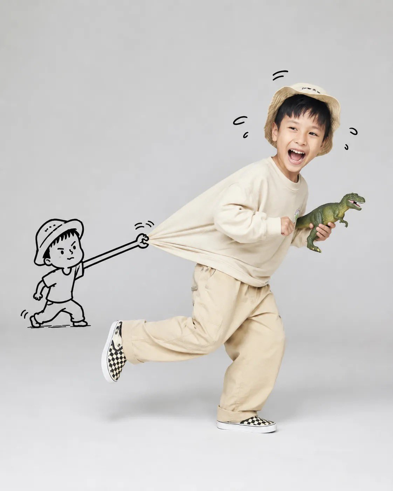

<details>
<summary>展开完整提示词</summary>

```text
A playful, high-key studio portrait of [subject] running joyfully across a seamless light gray background, captured mid-stride with one leg lifted and a wide genuine smile. The subject wears a casual oversized outfit with soft neutral tones (or vibrant colors), creating a dynamic sense of motion. Behind them, a simple black hand-drawn cartoon stick figure grabs and stretches the back of their shirt, making the fabric appear elastically pulled as if trying to stop them. The doodle character is integrated naturally into the scene with expressive motion lines and a humorous facial expression. The subject holds a fun prop (such as a dinosaur toy, oversized lollipop, teddy bear, or balloon), enhancing the playful storytelling. Minimalist composition, clean studio lighting, soft shadows, ultra-sharp focus, realistic skin texture, vibrant yet natural colors, whimsical editorial photography, premium children’s fashion campaign aesthetic, highly detailed, photorealistic, 8K.
```

</details>

## Bichon Shop 拟物 App 图标 · v1

- [Bichon Shop 拟物 App 图标 · v1](../cases/case-awesome-gpt-image-2-510-a25091f03cb2/v1.md) — awesome-gpt-image-2 \#510

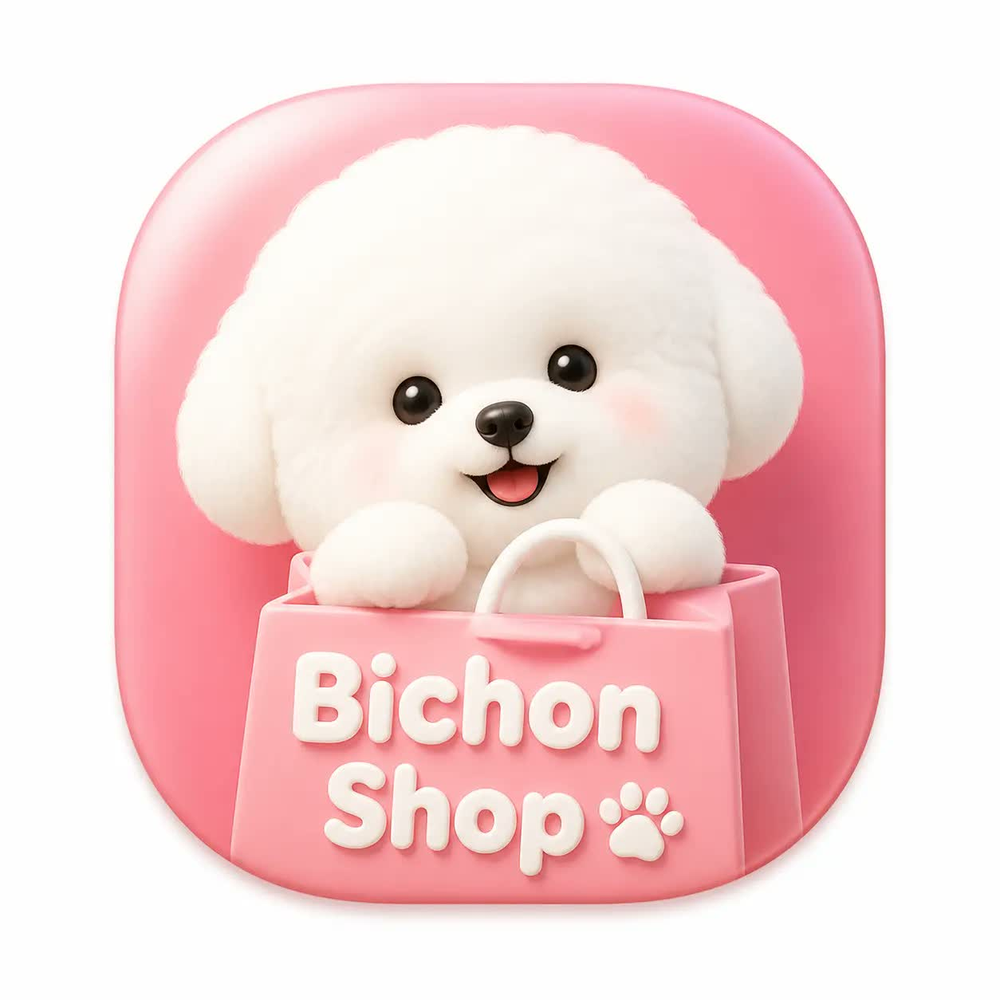

<details>
<summary>展开完整提示词</summary>

```text
A macOS app icon for an app named 'Bichon Shop'. A single squircle icon with smooth continuous rounded corners, centered on a white canvas with padding, occupying about 80% of the canvas. Modern light skeuomorphic macOS App Store style. Only one icon.
```

</details>

## 城市名地标排版旅行海报 · v1

- [城市名地标排版旅行海报 · v1](../cases/case-awesome-gpt-image-2-511-a5fad2b418e4/v1.md) — awesome-gpt-image-2 \#511


<details>
<summary>展开完整提示词</summary>

```text
Create a clean, modern typographic travel poster where the city name itself becomes the composition. Render the city name in large, bold, uppercase sans-serif letters spanning the width of the artwork. Seamlessly integrate the city's most iconic landmarks, architecture, monuments, streets, transportation, cultural symbols, cafés, bridges, parks, skylines, sculptures, waterfronts, historic buildings, and local details into, around, and inside the letters. Let landmarks naturally interact with the typography while preserving legibility.
Use an elegant flat vector illustration style with crisp geometric shapes, minimal detail, clean outlines, subtle shadows, and a premium editorial aesthetic. Maintain a limited color palette of deep navy, warm cream, muted red, and soft gray-blue for a timeless travel-poster look.
Add small decorative elements such as street lamps, trees, clouds, birds, benches, bicycles, fountains, trams, ferries, or other city-specific objects where appropriate. Keep generous negative space with a clean background and perfectly balanced composition.
Ensure every landmark, architectural style, vehicle, sign, and cultural element is accurate to the chosen city—avoid generic or incorrect landmarks. If desired, include a small elegant tagline beneath the city name (such as a famous nickname or slogan) in minimal typography.
Style: premium flat vector, minimalist travel poster, geometric illustration, editorial design, tourism branding, clean typography, high contrast, ultra-sharp lines, museum-quality print, modern graphic design, centered composition, scalable SVG aesthetic, 8K resolution.
```

</details>

## Brutalist Freestyle 角色设定表 · v1

- [Brutalist Freestyle 角色设定表 · v1](../cases/case-awesome-gpt-image-2-512-a85add6ba440/v1.md) — awesome-gpt-image-2 \#512


<details>
<summary>展开完整提示词</summary>

```text
Use the uploaded reference image as the primary character design reference, preserving the overall silhouette, proportions, futuristic apparel layering, helmet geometry, visor shape, stone-like brutalist armor surfaces, black hooded coat, tactical streetwear construction, gloves, boots, utility belt, and monochrome industrial aesthetic.

Create a premium production character sheet for a 2D stylized futuristic freestyle road soccer protagonist inspired by Brutalist architecture, industrial concrete textures, geometric forms, and minimalist sci-fi design language.  The presentation should resemble a AAA game character turnaround sheet mixed with a Nike commercial concept presentation.

The character should feel agile, stylish, confident, athletic, and built for urban freestyle football.  Maintain the concrete-textured helmet with glowing orange visor, oversized hood, tactical long coat, mechanical gauntlets, armored boots, and industrial detailing exactly as the design language.  The football should be integrated naturally into the presentation.  Minimal off-white background (#F7F5F0).

Professional production sheet layout.  Extremely clean linework.  Cinematic concept art.  Premium graphic design.  No photorealism.  High-end stylized illustration.  CHARACTER ANGLES Front View  Neutral hero pose.  Left Side View Right Side View Back View 3/4 Front View Dynamic Freestyle Pose  Standing on one foot while balancing the football.  Hero Pose  Football under foot.  Long coat flowing.  Confident posture.  CLOSE-UP CALLOUTS  Helmet Design  Orange illuminated visor  Concrete brutalist surface  Industrial wear  Panel breakdown  Upper Body  Coat construction  Buckles  Fabric folds  Armor integration  Mechanical Gloves  Finger articulation  Industrial joints  Material breakdown  Utility Belt  Equipment  Fasteners  Soccer accessory pouch  Boot Design  Heavy brutalist geometry  Street football grip  Orange illuminated sole accents  Football Design  Minimal futuristic street football  Concrete-inspired panel graphics  Orange accent details  MATERIAL CALLOUTS  Concrete Composite Armor  Carbon Tactical Fabric  Matte Black Nylon  Industrial Rubber  Forged Titanium Components  Orange Energy Lighting  COLOR PALETTE  Concrete White  Matte Black  Graphite Gray  Charcoal  Burnt Orange Glow  Dark Steel  EXPRESSION SHEET  Neutral  Focused  Competitive  Confident Smile  Game Face  Victory Expression  ACTION SILHOUETTES  Ball Juggle  Around The World  Elastico  Rainbow Flick  Backheel  Crossover  Street Sprint  Ball Stall  CAMERA CALLOUTS  Hero Shot Low Angle  Turnaround Orthographic  Close-up Macro Lens  Dynamic Pose 35mm Tracking Camera  Hero Pose 24mm Cinematic Lens  SFX LABELS  WHOOSH  SWISH  TAP  BOUNCE  THUD  ZIP  SPIN  SKRT  VROOM  RUSH  MUSIC HIT  CROWD CHEER  SLOW MOTION LABELS  120 FPS  240 FPS  Freeze Frame  Motion Trails  Speed Ramping  GUIDELINES  Maintain consistent proportions across all views.  Keep the brutalist design language consistent.  Emphasize concrete-inspired hard surfaces contrasted with flexible tactical fabrics.  Preserve the glowing orange visor as the primary focal point.  Use clean production callouts with arrows and labels.  Include measurement guides, material notes, and design annotations.  Keep presentation minimal and premium.  Avoid clutter.  Professional concept art quality suitable for AAA game development, cinematic production, and advertising pitch decks.  LAYOUT  16:9 Landscape  Top Center: MAIN TITLE STREET FLOW // BRUTALIST FREESTYLE  Below: Production Character Sheet  Center: Large Hero Character  Left: Front • Side • Back Views  Right: 3/4 View • Action Pose • Hero Pose  Bottom: Close-ups • Materials • Color Palette • Equipment • Football Design • Expressions • Camera Notes • SFX • Slow Motion • Production Annotations  Minimal off-white background with subtle grid guides, technical drawing arrows, clean typography, and premium commercial presentation quality.
```

</details>

## 单色点缀旅行手账插画 · v1

- [单色点缀旅行手账插画 · v1](../cases/case-awesome-gpt-image-2-513-ccc9493733fa/v1.md) — awesome-gpt-image-2 \#513


<details>
<summary>展开完整提示词</summary>

```text
Create a charming editorial travel illustration of {DESTINATION} in a simple hand-drawn doodled style, as if sketched by hand with a black felt-tip marker in a travel notebook. The illustration should feel personal, spontaneous, and imperfect rather than digitally designed. Think of the kind of drawing someone might casually create while sitting at a café after exploring the destination.** ## COLOR PALETTE Keep the illustration almost entirely black and white. Use **only one accent color: {ONE POINT COLOR}** ## STYLE Draw entirely with black felt-tip pen lines. Use slightly wobbly hand-drawn contours, natural line variation, loose marker strokes, sketch-like confidence, subtle imperfections, slightly open line endings, uneven hand pressure, and occasional overlapping strokes. Every line should clearly look handmade. Avoid perfectly smooth curves, mechanically precise outlines, polished vector graphics, or overly crisp digital rendering. ## SUBJECT Illustrate the unique atmosphere and instantly recognizable identity of **{DESTINATION}** rather than producing a realistic cityscape. Select the destination's most iconic landmarks, characteristic architecture, local transportation, famous scenery, native plants, local animals, regional food, and cultural objects. Focus on the spirit of the destination instead of literal accuracy. ## COMPOSITION Arrange the selected elements into a balanced editorial composition with generous white space. The layout should feel open, light, and effortless, similar to a designer's travel sketchbook. Allow objects to overlap naturally without becoming crowded. Every element should have room to breathe. Keep the composition visually relaxed and uncluttered. Apply the blue sparingly to selected details such as water, sky, windows, signs, clothing accents, decorative highlights, or small architectural features. Never introduce any additional colors. ## DRAWING STYLE Keep every object simple and intentionally simplified. Use flat shapes with minimal interior detail. Avoid realistic textures, gradients, shadows, painterly brushwork, glossy surfaces, or complex rendering. The illustration should remain clean, airy, understated, and highly graphic. ## LINE QUALITY The black marker lines are the main visual feature. Lines should feel confident, casual, lively, expressive, and naturally imperfect. Slightly uneven contours, open edges, variable line thickness, and small drawing inaccuracies are encouraged because they enhance the authentic hand-drawn feeling. ## MOOD Warm. Friendly. Relaxed. Playful. Minimal. Editorial. Contemporary. Elegant through simplicity. The finished artwork should resemble a beautifully designed travel notebook, boutique travel guide, editorial magazine illustration, or lifestyle sketchbook rather than a polished digital illustration. ## IMPORTANT No photorealism. No 3D rendering. No painterly effects. No gradients. No heavy shadows. No glossy lighting. No vector-clean artwork. No excessive detail. No busy composition. Preserve generous white space. Maintain a flat editorial doodle aesthetic with a distinctly handmade character. The final image should instantly evoke **{DESTINATION}** through simple, expressive black felt-tip sketches with subtle sky-blue accents.
```

</details>

## 硬边现代艺术人像 · v1

- [硬边现代艺术人像 · v1](../cases/case-awesome-gpt-image-2-514-b82b53c5864d/v1.md) — awesome-gpt-image-2 \#514


<details>
<summary>展开完整提示词</summary>

```text
A striking piece of hard-edge modern art on matte archival paper, with visible screen-printing layers and slight ink misalignment. A young East Asian woman is captured in a sharp, three-quarter profile. Her facial features are rendered with precise, crisp contours, contrasting with abstract, luminous geometric shapes that seem to emanate from within her skin. She wears a sleek, high-collared jacket in deep midnight blue, adorned with a single, bold neon coral brooch in the shape of a sharp triangle. Her dark hair is styled in a severe, architectural bob with blunt edges. Her expression is calm and detached, eyes gazing off-frame. The background is a clean, architectural space with sharp diagonal planes in crisp white and deep slate. High-contrast chiaroscuro lighting highlights the edges of her silhouette. Sophisticated palette: deep midnight blue, crisp white, electric neon coral. A stray cat tail is rendered as a sharp, geometric vector in the bottom left corner. Ultra-modern artistic style. No digital CGI feel.
dutch angle, stray cat tail --ar 9:16
```

</details>

## Guadalajara 复古电影旅行海报 · v1

- [Guadalajara 复古电影旅行海报 · v1](../cases/case-awesome-gpt-image-2-515-d0b2a41614fd/v1.md) — awesome-gpt-image-2 \#515


<details>
<summary>展开完整提示词</summary>

```text
@Crea una imagen {
  "style": "Cinematic Vintage Movie Poster — Guadalajara, Mexico",
  "target_tool": "DALL-E 3 (ChatGPT)",
  "prompt": "Generate a vertical portrait-format movie poster image, taller than wide in a 2:3 aspect ratio. The image is a cinematic vintage travel movie poster for Guadalajara, Mexico, rendered with the visual texture of an aged large-format film poster: heavy 35mm film grain throughout especially in the shadow areas, slightly faded and warm-shifted color tones as if printed on aged matte paper stock, a subtle halftone dot pattern visible in the midtones, and a very slight ink bleed at high-contrast edges giving it an authentic vintage printed poster feel. Foreground: a single dark silhouette of a lone mariachi musician standing still at the center-bottom of the frame, rendered as a pure clean dark silhouette with no facial features visible — traditional wide-brim charro sombrero, fitted traje de charro suit outline, holding a guitarrón — casting a long warm shadow across the honey-colored cantera stone paving of Plaza de la Liberación below, with colorful papel picado banners in red, orange, green and yellow cut tissue paper strung in loose diagonal lines overhead from building to building, swaying slightly, framing the upper composition, no people other than the single silhouetted figure, no vehicles, no modern objects. Midground: the grand honey-amber cantera stone neoclassical facade of the Teatro Degollado rising directly behind the silhouette, its ornate columned portico and triangular pediment warmly lit by the low golden-hour sun hitting from the left, long dramatic shadows stretching across the stone paving, the warm amber volcanic stone glowing intensely in the golden light. Background: the twin neo-Gothic spires of the Catedral Metropolitana de Guadalajara rising tall into the upper frame against a vast deep cerulean blue sky transitioning to burnt amber and deep orange near the horizon, a single scattered cloud catching violet and gold light from below, the cathedral facade in warm honey stone matching the Teatro Degollado's palette. Color grade: saturated warm amber and golden honey tones dominating the stone architecture, deep cobalt blue in the upper sky, rich burnt orange near the horizon, faded warm sepia in the shadow areas consistent with a vintage printed poster. At the very top of the image, centered above the spires, render the single word GUADALAJARA in bold condensed uppercase display serif letters in warm cream-gold with a faint dark drop shadow, leaving clear sky negative space for the title. No modern buildings, no cars, no utility wires, no people other than the single dark silhouette visible anywhere in the scene.",
  "target": "🎯 Target: DALL-E 3 (ChatGPT) — 💡 Foreground/midground/background separation places Teatro Degollado and the Cathedral in distinct spatial layers, the mariachi silhouette is specified as a featureless outline to eliminate aberration risk, and vintage print texture is described visually rather than as a style label."
}
```

</details>

## 工业橡胶管品牌造型渲染 · v1

- [工业橡胶管品牌造型渲染 · v1](../cases/case-awesome-gpt-image-2-516-851557abfd8a/v1.md) — awesome-gpt-image-2 \#516

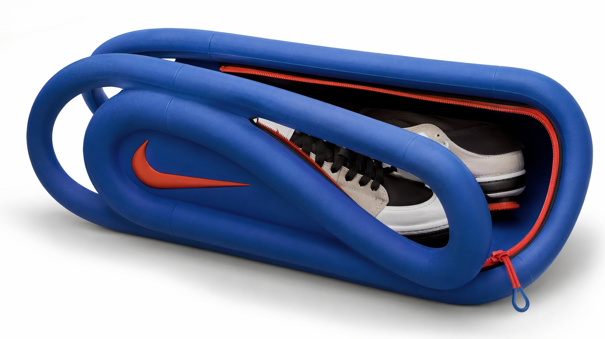

<details>
<summary>展开完整提示词</summary>

```text
Create an ultra-detailed hyper-realistic 3D render of {Object} , formed from thick industrial rubber tubing bent into the exact shape of the design, flexible yet dense structure, smooth rounded contours, subtle matte finish, realistic elastomer texture, faint molded seam lines, soft tension at each curve, authentic material compression and stretch behavior, slightly grippy surface quality, engineered object realism, colored using the authentic official brand color palette of [brand], faithful brand-matching hues applied across the tubing, accurate color blocking that follows the original logo design, premium studio product photography aesthetic, isolated on a pure white seamless background, soft diffused studio lighting, realistic contact shadow, macro detail, razor-sharp focus, photorealistic, 8k, 16:9, no watermark, no extra text.
```

</details>

## 杯内鱼眼夏日冰饮广告 · v1

- [杯内鱼眼夏日冰饮广告 · v1](../cases/case-awesome-gpt-image-2-517-ba8a5827db7d/v1.md) — awesome-gpt-image-2 \#517


<details>
<summary>展开完整提示词</summary>

```text
主題：
氷越しの夏

主体：
縦長2:3のリアル写真。透明な大型プラスチックカップの内側から見上げるような超広角フィッシュアイ構図。画面下半分いっぱいに赤いいちご果肉とクラッシュアイスが迫り、中央から太いグリーンのストローが奥へ一直線に伸びる。丸く歪んだカップの開口部の向こうに、女性の顔が中央に大きく収まる。

人物・表情：
自然で現実感のある若い女性。黒髪に近いダークブラウンの髪を高めのお団子にまとめ、薄い前髪と顔まわりの後れ毛が日差しで細く光っている。透明感のあるナチュラルメイク、淡いピンクの頬、つやのあるリップ。目を大きく開いてカメラをまっすぐ見つめ、唇を小さく丸めてストローをくわえている。少し驚いたような、可愛らしく無邪気な表情。

服装・ポーズ：
白いレース素材のブラウス。首元と肩まわりに細かなフリルがあり、夏らしく軽い質感。人物はカップの向こう側に顔を近づけ、両肩は下部に少しだけ見える。ストローは人物の口元に自然に接触し、奥から手前の赤い氷へ向かって強い奥行きを作る。

背景・光：
背景は晴れた夏の日の古い商店街。木造風の店先、かき氷屋の暖簾、苺柄の看板、白い小さな旗、街路樹が見える。文字はすべてぼかされた読めない装飾として扱う。左上から強い太陽光が入り、透明カップの水滴、カップ縁、氷、赤い果肉に細かな反射とハイライトが出る。影は右下へ落ち、白いクリームの残りがカップ内側にリング状についている。

構図・カメラ：
カメラはカップの底付近、赤い氷のすぐ上に置いたような極端なローアングル。フィッシュアイレンズでカップの円形リムが大きく湾曲し、周囲の商店街も軽く歪む。画面下45％は赤い氷と果肉の前ボケ、中央はストローと女性の顔、上部は青空とカップの透明な縁。ピントは女性の目と口元、手前の氷はきらめく浅いボケ。

質感・スタイル：
プロ用カメラで撮影した夏の広告写真風。透明プラスチックの屈折、水滴の粒、氷の冷たさ、いちご果肉の瑞々しさを高精細に表現。青空、赤い氷、グリーンのストロー、白いブラウスの色の対比を鮮やかにする。肌は自然な質感を残し、過度な美肌補正はしない。明るくポップで、少しユーモラスな日本の夏スイーツ写真。

ネガティブ：
実在ブランドロゴ、読める文字、商標の再現、不自然な顔、不自然な視線、歯や唇の崩れ、ストローとの接触不良、余分な指、欠けた指、手足の融合、氷の浮遊、不自然な重力、誤った遠近法、光源と矛盾する影、文字化け、透かし、過度な美肌補正、プラスチックのような肌。
```

</details>

## 花田风动夏日人像 · v1

- [花田风动夏日人像 · v1](../cases/case-awesome-gpt-image-2-518-67397dbac7a7/v1.md) — awesome-gpt-image-2 \#518

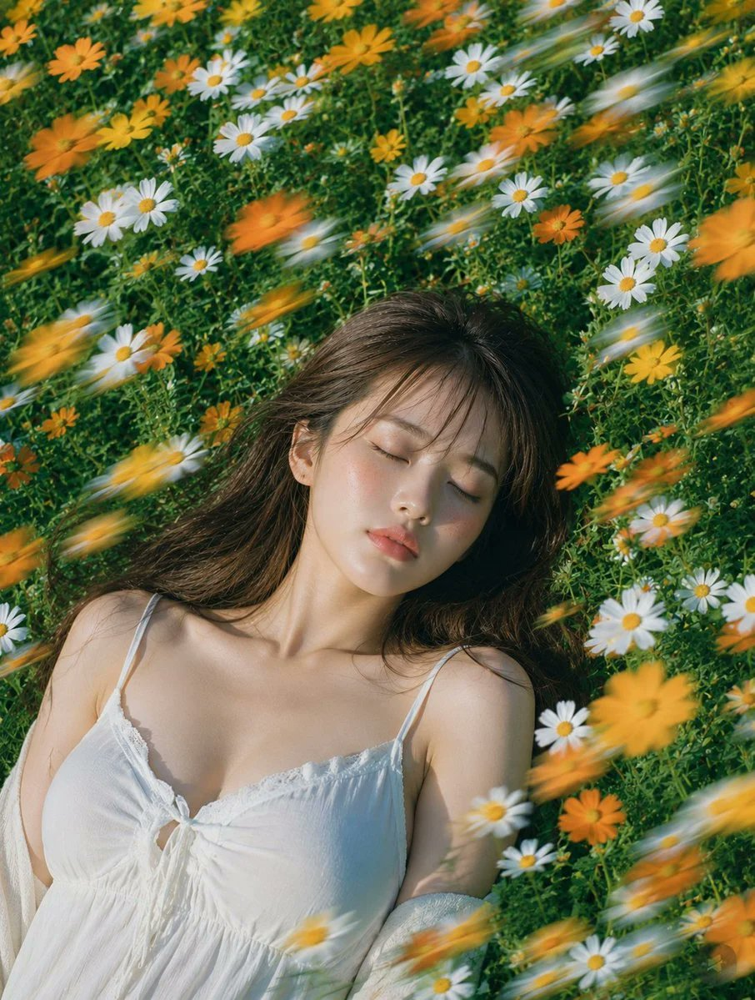

<details>
<summary>展开完整提示词</summary>

```text
主題：
花風のまどろみ

主体：
縦長4:5の写真風ポートレート。白と黄色のマーガレット、オレンジ色の小花が密に咲く夏の草花畑に、成熟した大人の女性が仰向けで静かに横たわっている。人物は画面下部から中央にかけて大きく入り、顔は中央やや右、胸元から肩までは画面下側に収まる。周囲の花が画面全体を埋め、対角線方向に流れる花のモーションブラーが前景を横切る。

人物・表情：
自然で現実感のある日系ポートレート。暗めのブラウンロングヘアに、薄い前髪と顔まわりのやわらかな毛束。目を閉じ、眉は力が抜け、唇は軽く閉じた穏やかな表情。頬と鼻先に自然な血色、肌には過度な補正をせず細かな質感を残す。首筋、鎖骨、頬に夏の日差しが当たり、静かに眠っているような落ち着いた雰囲気。

服装・ポーズ：
白い夏用キャミソールワンピース。細い肩紐、胸元の控えめなレース、中央の小さなリボン、薄手のコットン素材。人物の両肩は草花に自然に沈み、片腕は画面下側で花に隠れて見切れる。体は画面左下から右上へ少し斜めに置かれ、髪は草の上に広がり、風で数本だけ額にかかる。

背景・光：
郊外にある小さな花畑のような、生活感のある自然な草花の密度。背景はすべて緑の葉と白・黄色・オレンジの花で構成し、人工物や読める文字は入れない。高めの位置から差す夏の太陽光。光はやや硬めで暖かく、顔の左側と首筋、肩に明るいハイライトが入り、花と髪の影が肌に細く落ちる。草の反射で下側に淡い緑の返り光。

構図・カメラ：
やや俯瞰の近距離撮影。85mm相当の自然な圧縮感、人物の顔にピントを合わせ、周辺の花は浅い被写界深度で少しぼける。前景の花だけが風に流され、白・黄色・オレンジの細長い光跡として左上から右下へ走る。顔まわりはブラーを弱め、表情と肌の質感をはっきり見せる。

質感・スタイル：
リアルな写真表現。夏の日差し、透明感のある肌、柔らかな髪の束感、薄手コットンのしわ、草花の細密な質感。ナチュラルな色調で、緑を深く、白い花を明るく、オレンジの花をアクセントにする。フィルム写真のようなわずかな粒子感と、雑誌ポートレートの落ち着いた仕上がり。

ネガティブ：
不自然な顔、不自然な視線、余分な指、欠けた指、手足の融合、関節の破綻、服と体の接触不良、浮遊、不自然な重力、誤った遠近法、光源と矛盾する影、過度な美肌補正、プラスチックのような肌、文字化け、ロゴ、透かし。
```

</details>

## 薄荷玫瑰香水电商图 · v1

- [薄荷玫瑰香水电商图 · v1](../cases/case-awesome-gpt-image-2-519-ffd5a3366493/v1.md) — awesome-gpt-image-2 \#519

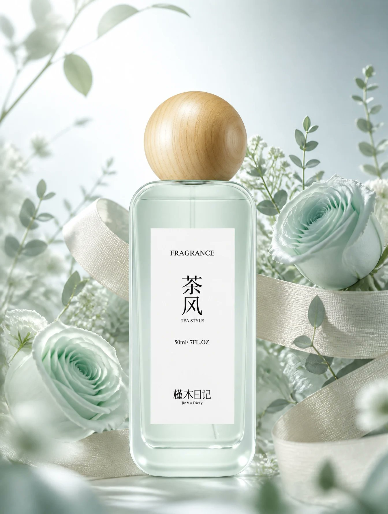

<details>
<summary>展开完整提示词</summary>

```text
100%完整保留上传的原图香水瓶的全部原始外观细节，瓶身造型、薄荷绿玻璃质感、木纹球形瓶盖、原有标签文字完全不做任何修改；瓶身环绕米色织带，周围簇拥薄荷绿玫瑰和浅绿色植物，冷调渐变浅留白背景，冷调逆光柔焦光影，低饱和度冷清高级色调，景深虚化突出香水主体，超写实C4D质感，轻奢高级ins风，适配竖版电商详情页，2K高清
```

</details>

## 月面宇航员 T 恤图形 · v1

- [月面宇航员 T 恤图形 · v1](../cases/case-awesome-gpt-image-2-520-32ccede956b4/v1.md) — awesome-gpt-image-2 \#520

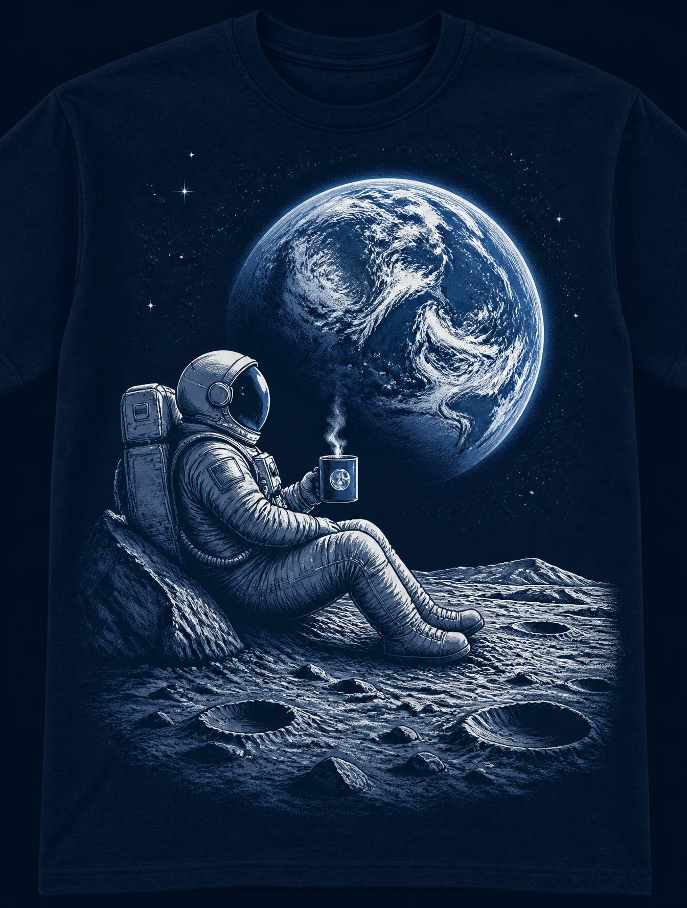

<details>
<summary>展开完整提示词</summary>

```text
A graphic illustration centered on a dark navy blue t-shirt, depicting an astronaut sitting on the surface of the moon, viewed from a side profile. The astronaut is wearing a detailed, bulky space suit and helmet, leaning back against a small lunar rock formation, and is holding a small steaming mug, suggesting they are enjoying a peaceful drink. Positioned directly in front of the astronaut in the background is a large, majestic view of the Earth, rendered in shades of white, light blue, and navy, featuring prominent swirling cloud formations. The entire artwork is monochromatic, utilizing a cool blue-and-white color palette that creates a serene, solitary, and contemplative atmosphere. The lunar ground is textured with craters and dust, providing a grounded contrast to the vast, dark sky and the bright, swirling planet above. The style is clean, artistic, and iconic, reminiscent of screen-printed apparel designs.
```

</details>

## 青花敦煌刺绣四拼风格海报 · v1

- [青花敦煌刺绣四拼风格海报 · v1](../cases/case-awesome-gpt-image-2-521-777c1a72359c/v1.md) — awesome-gpt-image-2 \#521


<details>
<summary>展开完整提示词</summary>

```text
请将我上传的照片制作成一张竖版拼图海报，整体采用 3:4 竖版构图。画面从上到下严格四等分为四个横向区域，每个区域的高度必须精确控制为整体画面高度的25%（四层比例严格为1:1:1:1，不允许出现比例偏差），区域之间无缝衔接，不设分隔线、不留间隙，顺序为：原图→风格1→风格2→风格3。由于每层为约3:1的极扁宽幅比例，各层主体建议横向居中排布，强调左右开阔留白与呼吸感，避免元素纵向拉伸变形或贴边拥挤。四层在人物站位、场景结构、视线方向上保持连贯呼应，呈现同一画面、四种转译的整体感。风格层（第二至四层）须遵循极简原则：每层视觉元素数量压缩至最低限度，只保留1个最核心的主体符号，其余次要装饰、背景细节与陪衬元素一律省略，画面留白占比不低于60%。

第一层保留原始照片的主体结构、人物真实互动关系与姿态、真实质感、自然光影与原有色彩氛围，仅进行轻微高级摄影调色，呈现杂志摄影质感，不改变人物关系与构图逻辑，并可在不改变人物关系与构图逻辑的前提下自然扩展天空、地面或环境背景，使整体更具空间感与叙事感。

第二层为青花瓷绘风格：借鉴青花瓷绘画技法，以钴蓝色线条与晕染在米白底上表现人物与场景，呈现瓷器纹样的疏朗雅致感。色彩以钴蓝与米白为主的单色系。避免蓝色浓淡层次过多显杂，避免图案化装饰堆砌。

第三层为敦煌壁画风格：借鉴敦煌壁画矿物重彩质感，表现古朴斑驳的美感，需简化线条与色块。背景为土黄或赭石底色，带斑驳壁画肌理感。色彩以赭石、石青、朱砂、土黄为主。避免裂纹肌理过多堆砌，避免复杂纹样装饰。

第四层为刺绣锦缎风格：以刺绣针脚肌理表现人物与场景轮廓，呈现丝缎光泽与针线纹理感，图案需极简概括。背景为米白或浅灰缎面底色。色彩以2至3种柔和色搭配金线点缀。避免针脚过密显繁琐，避免金线过多显浮夸。

每一层需将主体与场景统一转换为对应风格，整体表达极度克制与简化，只保留最核心的一个主体符号及其基本轮廓关系，删除一切非必要的背景元素、装饰细节与陪衬物；人物之间的关键位置关系、互动方向与姿态特征需保留，但应抽象为可识别的轮廓关系，做到“元素越少、关系越清晰”。色彩均从原图中提取归纳，每层严格控制在2-4种主色以内。四个区域的高度比例须严格保持1:1:1:1（各占25%），不可出现拼接错位或比例偏差。整体避免朋克/赛博朋克风格、写实照片质感强行叠加、卡通风格、3D渲染感、商业海报感、复杂背景堆砌、元素过多或画面拥挤、相邻两层风格雷同，以及任何文字、Logo、水印或标题。
```

</details>

## 儿童故事书手绘头像 · v1

- [儿童故事书手绘头像 · v1](../cases/case-awesome-gpt-image-2-522-567a152e8aad/v1.md) — awesome-gpt-image-2 \#522

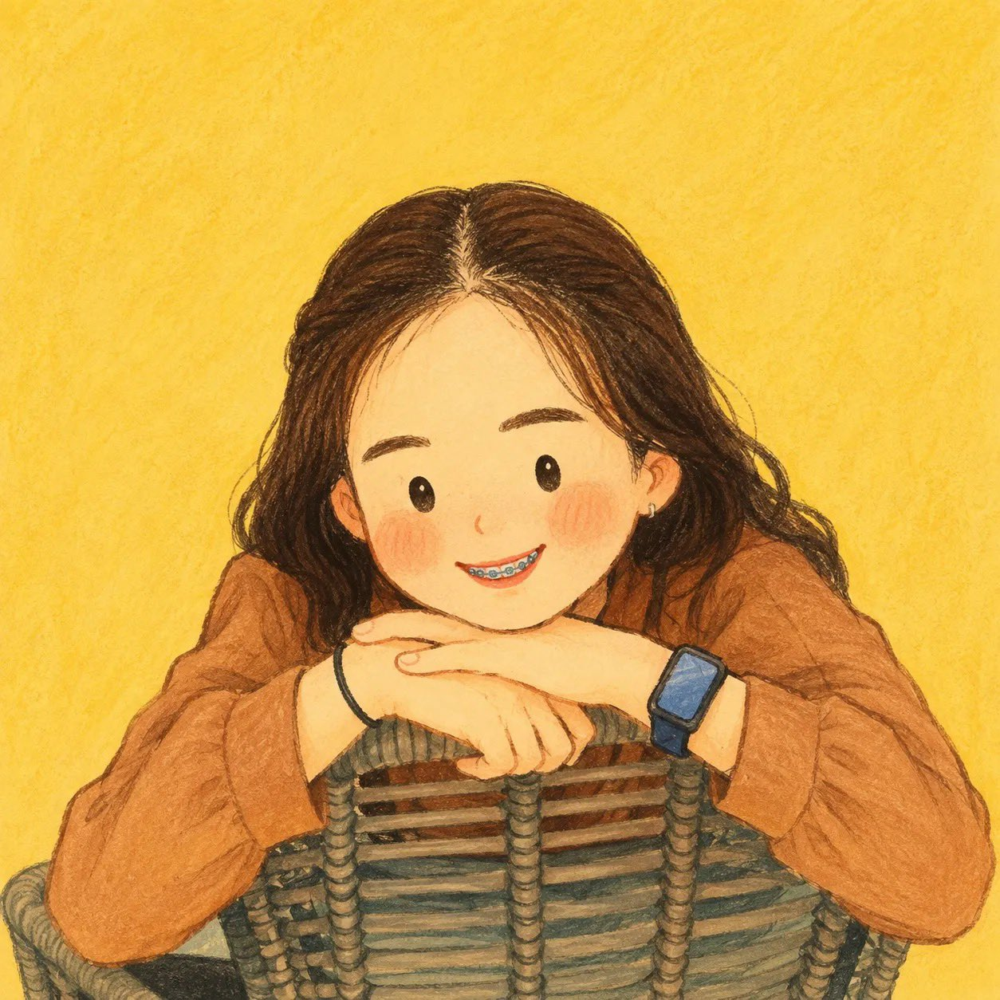

<details>
<summary>展开完整提示词</summary>

```text
Use the single uploaded photo as the only visual reference. Transform the person into an adorable hand-drawn 2D children’s storybook character, while keeping their identity immediately recognizable.

Preserve exactly from the photo:
- Facial features and skin tone
- Real hairstyle, length, texture, and color
- Exact clothing, colors, patterns, and layering
- Glasses, jewelry, headwear, bags, and all visible accessories

Do not invent or copy hairstyles, outfits, accessories, braids, pigtails, bows, bonnets, or headscarves from any reference artwork.

### Character
Use an oversized rounded head, tiny compact body, short arms, narrow shoulders, soft rounded silhouette, and cute childlike proportions. Keep the head visually dominant. Avoid realistic anatomy.

### Face
Simplify into tiny dot/oval eyes, minimal nose, tiny smiling mouth, rounded cheeks, and soft peach/pink blush. Keep recognizable facial characteristics. No realistic eyes, detailed lips, anime features, glossy 3D rendering, or heavy shading.

### Hair & Clothing
Recreate the exact hairstyle and outfit from the uploaded photo, simplified into chunky hand-drawn shapes. Preserve important colors, patterns, jewelry, glasses, and other recognizable details.

### Style
Handmade 2D picture-book aesthetic using soft gouache, wax crayon, colored pencil, and dry pastel. Use slightly irregular dark-brown linework, subtle paper grain, uneven pigment, soft brush marks, and imperfect painted edges. Avoid clean vector art, CGI, anime, or photorealism.

### Composition
Square 1:1 portrait, chest/waist-up, centered and facing mostly forward, with balanced negative space. Use a relaxed, charming pose.

### Background
Simple warm mustard, butter yellow, ochre, or cream background with subtle paper texture. No scenery, objects, text, borders, or distractions.

Final feeling: the same person lovingly redrawn as an extremely cute, warm, wholesome, nostalgic, handcrafted children’s-book character—same identity, same hair, same clothes, same accessories, completely simplified and adorable.
```

</details>

## 曼哈顿公园水彩旅行插画 · v1

- [曼哈顿公园水彩旅行插画 · v1](../cases/case-awesome-gpt-image-2-523-293e282b3d57/v1.md) — awesome-gpt-image-2 \#523


<details>
<summary>展开完整提示词</summary>

```text
Create a vertical editorial travel illustration inspired by vintage European travel posters, featuring a peaceful summer afternoon in a grand city park with a recognizable Manhattan-style skyline in the background. Use delicate hand-drawn ink outlines combined with soft, slightly imperfect watercolor washes on warm textured cream paper. Show a wide green lawn filled with people relaxing, reading, walking, jogging, cycling, and having picnics. In the foreground, a casually dressed young couple sits together on a picnic blanket beside a woven basket. Include elegant black vintage park lamps, winding pathways, dense leafy trees framing the composition, and detailed historic and modern skyscrapers rising behind the park. Add a small picturesque stone arch bridge over a calm pond near the bottom of the artwork. Use muted sage green, olive, warm beige, soft blue, pale gray, and subtle golden sunlight, with natural watercolor bleeding, paper grain, fine pen hatching, and an airy sophisticated travel-journal aesthetic. No text, no letters, no logos, no typography, no captions, no signs. Vertical 4:5 composition, highly detailed, elegant, nostalgic, handcrafted watercolor-and-ink illustration.
```

</details>

## 纸雕拼贴乡野人像 · v1

- [纸雕拼贴乡野人像 · v1](../cases/case-awesome-gpt-image-2-524-4f89606a400f/v1.md) — awesome-gpt-image-2 \#524

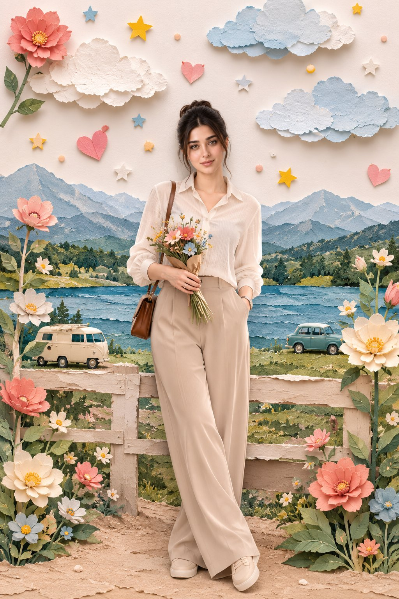

<details>
<summary>展开完整提示词</summary>

```text
Create a premium whimsical handcrafted paper-collage diorama inspired exactly by the uploaded reference image.

Use the uploaded girl reference as the ONLY human subject. Preserve her facial identity with maximum accuracy: exact face shape, eyes, eyebrows, nose, lips, skin tone, hairstyle, hairline, and recognizable facial features. Strict face identity lock — do not redesign, beautify, stylize, age, de-age, or replace her face.

The girl stands alone in the center of the composition in a graceful, natural editorial pose. She is facing the camera with a relaxed confident expression and a subtle natural smile. Her body is slightly angled, creating a candid fashion-editorial feeling. She holds a beautiful small mixed bouquet of flowers naturally with both hands in front of her. One leg is slightly crossed in front of the other for an elegant relaxed pose.

Outfit

Change the outfit completely from the original reference while keeping it fully modest and elegant:

- elegant ivory/cream long-sleeve button-up blouse
- high-waisted wide-leg beige trousers
- full-length trousers with complete coverage
- simple cream closed-toe shoes
- small brown leather shoulder bag
- no revealing clothing
- no exposed midriff
- sophisticated countryside editorial fashion
- natural realistic fabric folds and texture

Environment

Create a beautiful handcrafted 3D paper-diorama countryside scene:

- layered blue mountains in the distance
- green forest and rolling hills
- peaceful blue lake
- grassy lakeside landscape
- textured beige paper pathway in the foreground
- rustic white wooden fence behind the girl
- dreamy pastel sky

Surround the composition with oversized handmade paper flowers in pink, peach, cream, white, and light blue, with layered green paper leaves.

Add decorative paper elements floating in the sky:

- pink paper hearts
- yellow paper stars
- blue stars
- soft white and pale-blue clouds
- tiny colorful paper dots

Place two tiny vintage vehicles near the lake in the background: a cream vintage camper van on one side and a small vintage blue-green car on the other.

Art Direction

The entire environment should look handcrafted from premium textured paper while the girl remains photorealistic and seamlessly integrated into the paper world.

Use:
hand-torn paper edges, visible paper fibers, layered cardstock, subtle imperfections, realistic paper shadows, dimensional cut-paper elements, tactile textures, soft natural daylight, cinematic depth, gentle atmospheric perspective, premium editorial photography.

The final image should feel like a luxury handmade paper storybook brought to life with a real photographic subject.

Composition

Centered full-body girl
Face clearly visible and sharply detailed
Natural elegant pose
Bouquet held naturally
Rustic fence framing the subject
Lake and mountains creating depth
Large flowers framing both lower corners
Clouds and decorative elements filling the upper background
Balanced symmetrical composition with organic handmade imperfections
Girl remains the strongest focal point

Final Look

Photorealistic girl + handcrafted paper-art environment
Dreamy pastel colors
Luxury editorial aesthetic
Whimsical miniature diorama
Soft cinematic daylight
Highly detailed paper textures
Natural realistic skin
Sharp facial identity
Professional fashion photography
Pinterest/Instagram viral visual aesthetic
Magazine-quality composition

Vertical 4:5 portrait composition, full-body framing, ultra-detailed, high resolution, clean polished finish, visually striking, aesthetically balanced, premium handcrafted paper-collage photography.
```

</details>

## 酒红棚拍男士时尚肖像 · v1

- [酒红棚拍男士时尚肖像 · v1](../cases/case-awesome-gpt-image-2-525-cdc2f40f8c94/v1.md) — awesome-gpt-image-2 \#525

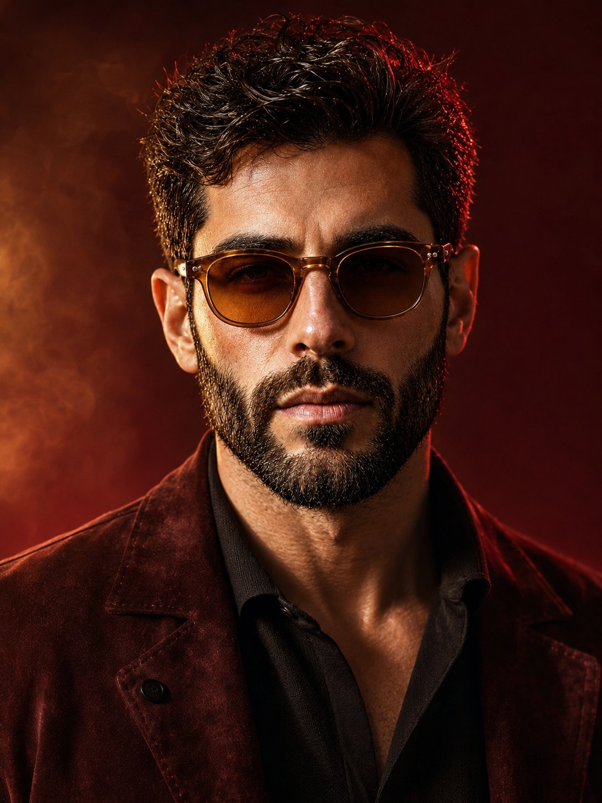

<details>
<summary>展开完整提示词</summary>

```text
A cinematic, ultra-realistic close-up portrait of a stylish man, using the provided image as an accurate face reference. Preserve his natural facial identity, thick naturally curly dark brown hair, neatly trimmed salt-and-pepper beard, strong masculine facial structure, and realistic facial proportions. He wears sophisticated round vintage amber-brown sunglasses and a premium deep burgundy suede jacket over a fitted black silk-knit shirt, creating a refined luxury fashion aesthetic.

Warm cinematic studio lighting with a soft amber-golden key light illuminating the face from the front-left, complemented by a subtle crimson-red rim light outlining the hair and shoulders. The background is a rich burgundy, wine-red, and dark plum gradient, with soft atmospheric haze and subtle diffused light creating depth without distracting from the subject. Elegant warm highlights contrast beautifully against the dark clothing.

Extremely detailed natural skin texture, individual beard hairs, realistic pores, subtle facial imperfections, sharp eyes visible behind slightly tinted lenses, natural reflections on the sunglasses, rich dimensional shadows, realistic fabric and suede texture, shallow depth of field. Sophisticated luxury fashion campaign, mysterious and confident mood, premium men's editorial photography, cinematic color grading, photorealistic, HDR, professional studio photography, 85mm portrait lens, f/1.8, crisp facial details, soft background bokeh, centered composition, head-and-shoulders framing, powerful masculine presence, understated elegance, 3:4 aspect ratio.
```

</details>

## 体积激光黑场海报 · v1

- [体积激光黑场海报 · v1](../cases/case-awesome-gpt-image-2-526-dc73f272c54d/v1.md) — awesome-gpt-image-2 \#526


<details>
<summary>展开完整提示词</summary>

```text
从全黑剧场开始，像切标本一样用六片真实体积激光把空间分层。光面必须有明确起点、透视和薄雾中的厚度，人物站在交汇点，透明道具折射出一小束异色光扇。构图沿左下至右上的对角线推进，脸只用一道克制边光揭示；标题与其中一片光面共享透视，小字留在纯黑负空间。每次替换主题与角色时，不得退化成夜店模板、HUD、霓虹城市或无物理来源的光线。
```

</details>

## Rio 旅行票据纸雕立体海报 · v1

- [Rio 旅行票据纸雕立体海报 · v1](../cases/case-awesome-gpt-image-2-527-52b3df89275e/v1.md) — awesome-gpt-image-2 \#527


<details>
<summary>展开完整提示词</summary>

```text
Create a highly detailed, photorealistic miniature travel-poster diorama inspired by Rio de Janeiro, arranged as a handcrafted 3D paper scene on a warm ivory, slightly textured background.

In the foreground, a realistic human hand holds a vintage Brazilian travel ticket or Rio-themed transit card vertically on the left side. Give the card aged paper texture, subtle printing imperfections, elegant typography, and authentic-looking travel details. From behind the card, a miniature Rio de Janeiro landscape physically rises outward like an intricate pop-up diorama.

Make Christ the Redeemer the dominant central landmark, positioned high above a miniature cityscape with lush green mountains surrounding it. Below, build a tiny realistic Rio street featuring a classic yellow taxi, colorful buildings, palm trees, pedestrians, cyclists, street lamps, tiled sidewalks, and small Brazilian urban details. Add Copacabana beach elements in the distance with tiny umbrellas, beachgoers, and a glimpse of the Atlantic Ocean. Layer the architecture and terrain so everything appears physically constructed from paper, wood, plaster, and miniature materials, with convincing depth, cast shadows, overlapping surfaces, and a slight three-quarter perspective.

Around the main 3D scene, incorporate delicate black, charcoal, and muted sepia hand-drawn travel illustrations on the cream paper. Include a small Sugarloaf Mountain sketch in the upper left, an artistic Copacabana promenade illustration in the upper right, a detailed Selarón Steps sketch along the right side, and a small Ipanema beachfront skyline drawing near the bottom. Add subtle handwritten travel notes, tiny map markings, architectural outlines, compass symbols, postage-stamp details, and understated Brazilian travel annotations.

Keep the composition refined rather than crowded. Blend realistic miniature photography with vintage travel-journal design, tactile paper fibers, faint ink bleed, imperfect hand-drawn lines, warm natural studio lighting, gentle shadows, subtle film grain, and a sophisticated cream, charcoal, muted green, ocean blue, and Brazilian yellow palette.

The final image should feel like a premium collectible Rio de Janeiro travel postcard transformed into a physical miniature world, with the central diorama sharply detailed and the surrounding illustrations slightly softer. Highly realistic human hand and fingers, believable miniature materials, cinematic product photography, editorial travel-magazine aesthetic, shallow depth of field, ultra-fine textures, photorealistic 3D details, vertical 4:5 composition, 8K quality.
```

</details>

## 圣诞街景 Chibi 真实背景人像 · v1

- [圣诞街景 Chibi 真实背景人像 · v1](../cases/case-awesome-gpt-image-2-528-4de125c422f7/v1.md) — awesome-gpt-image-2 \#528

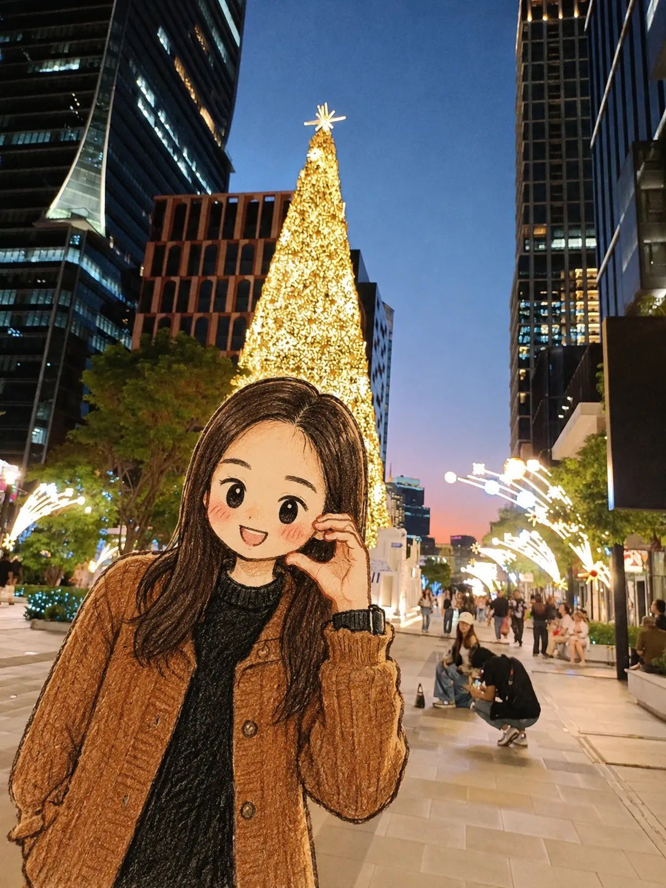

<details>
<summary>展开完整提示词</summary>

```text
Use the uploaded image as the primary reference. Transform the person into a cute, hand-drawn anime/chibi character while preserving the original person’s recognizable facial features, hairstyle, outfit, pose, and accessories.

A cute young woman standing on a modern city street at blue hour, surrounded by tall illuminated skyscrapers and festive Christmas decorations. A huge glowing Christmas tree covered in warm golden lights stands directly behind her, creating a magical holiday atmosphere. The street is filled with elegant decorative lights, pedestrians, modern architecture, and soft evening city illumination.

Render the character in a charming Japanese hand-drawn anime/chibi illustration style with expressive large eyes, soft blush on the cheeks, delicate facial details, textured pencil-and-ink outlines, subtle watercolor-like coloring, and slightly imperfect handmade sketch details. Keep the background photorealistic and highly detailed, creating a beautiful contrast between the illustrated character and the real-world environment.

Cinematic composition, natural perspective, soft evening lighting, warm Christmas glow, realistic background depth, detailed clothing texture, cozy winter atmosphere, high detail, aesthetically pleasing, vertical portrait composition.
```

</details>

