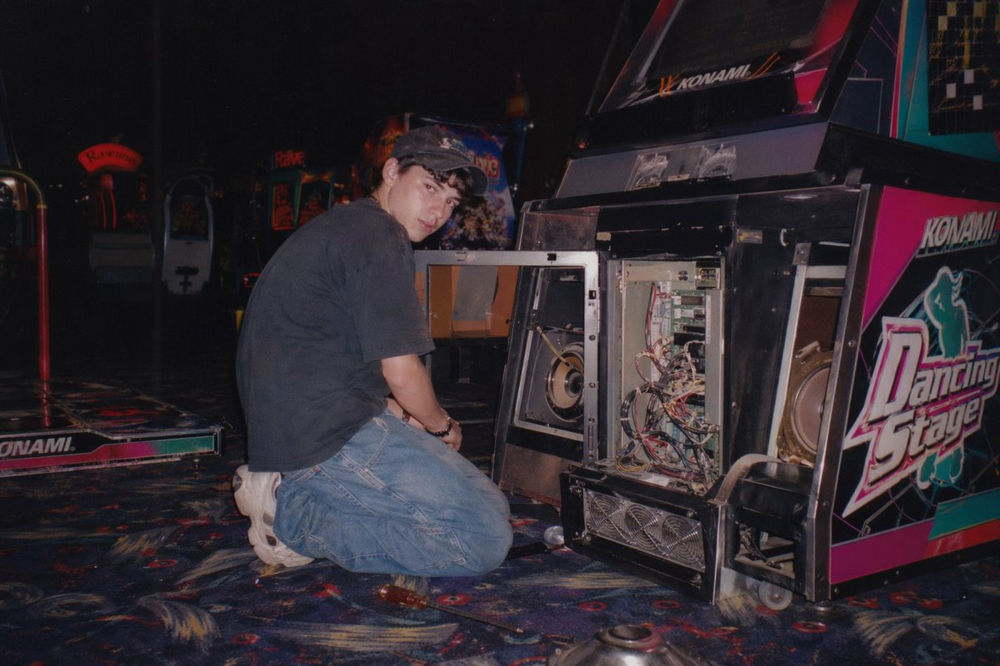

<!-- Generated by scripts/gallery.py; edit authoritative JSON, then rebuild. -->

# 全部资料 · 第 3 册

[画廊总览](gallery.md) | [上一册](gallery-part-2.md) | [下一册](gallery-part-4.md)

本册 25 条资料。标题链接固定到所示版本。

## 写实摄影风格图 · v1

- [写实摄影风格图 · v1](../cases/case-awesome-gpt-image-2-52-826ddb2ffb6e/v1.md) — awesome-gpt-image-2 \#52

原图文案例 · gpt-image

**已记录补充核查结果；以详情中的输入要求为准**

实际查看：白板上的绿色武士漫画线描。已通读完整归档指令；图像为该创作方向的结果样例，文本未要求某张特定外部原图。

**输出示例图**


<details>
<summary>展开完整提示词</summary>

```text
A realistic photograph of a whiteboard with a highly detailed {argument name="marker color" default="green"} dry-erase marker drawing of {argument name="subject" default="a samurai with a messy topknot and facial hair, hands clasped in prayer"}. The character is drawn in a {argument name="art style" default="detailed manga sketch"} style, shown in profile with eyes closed, wearing a traditional kimono with a katana tucked into his belt. To the left of the character, handwritten text in all-caps reads "{argument name="text line 1" default="VAGABOND"}" with "{argument name="text line 2" default="MUSASHI"}" written directly below it. The whiteboard has a glossy surface with realistic light reflections and glare on the left side, and a thin metallic frame is visible at the bottom edge, giving the impression of an authentic classroom or office environment.
```

</details>

## 室内空间渲染图 · v1

- [室内空间渲染图 · v1](../cases/case-awesome-gpt-image-2-53-387a742f4f09/v1.md) — awesome-gpt-image-2 \#53

原图文案例 · gpt-image

**已记录补充核查结果；以详情中的输入要求为准**

男子跪地修理街机，打开机柜与暗场闪光灯环境明确。已实际看样图并阅读完整 prompt；复核资料关系与输入条件，不代表生成复现或逐项事实准确性验收。

**输出示例图**



<details>
<summary>展开完整提示词</summary>

```text
A vintage, late 90s amateur flash photograph of a young man repairing an arcade machine. He is kneeling on a dark, patterned arcade carpet, looking back over his shoulder directly at the camera with a neutral expression. He wears a dark short-sleeved t-shirt, baggy blue jeans, chunky white sneakers, and a dark baseball cap. The lower front panel of the arcade cabinet is wide open, exposing its complex internal electronics, including a tangle of wires, green circuit boards, a large speaker, and metal cooling fans at the base. The side of the cabinet features vibrant pink, black, and white graphics with the text "{argument name="arcade game title" default="Dancing Stage"}" and the brand "{argument name="arcade brand" default="KONAMI"}". The setting is a dimly lit arcade interior with other glowing game cabinets visible in the blurred background. A screwdriver lies on the carpet near the man's knee. The image features harsh direct flash lighting, a slightly grainy film texture, deep shadows, and a nostalgic Y2K aesthetic.
```

</details>

## 人物角色设定图 · v1

- [人物角色设定图 · v1](../cases/case-awesome-gpt-image-2-54-cf257b79e166/v1.md) — awesome-gpt-image-2 \#54

原图文案例 · gpt-image

**已记录补充核查结果；以详情中的输入要求为准**

石头、牙刷、云朵存钱罐等四格恶搞商品广告。已阅读全文并查看样图，图片为结果示例；未发现必须补充某一指定输入图片。

**输出示例图**


<details>
<summary>展开完整提示词</summary>

```text
{
  "type": "4-panel satirical product advertisement grid",
  "layout": {
    "grid": "2x2",
    "panels": [
      {
        "position": "top-left",
        "product_name": "{argument name=\"top left product name\" default=\"座る石\"}",
        "visual": "man in white shirt and dark pants sitting on a large round stone in a park",
        "catchphrase": "いつでも、どこでも、落ち着ける。",
        "sales_badge": "累計販売数 12,000個 突破!",
        "vertical_text": "公園のベンチが埋まっていた日に。",
        "features_count": 3,
        "features_labels": [
          "重さ約8kgで安定感抜群",
          "底面フェルト加工で傷つけにくい",
          "付属の専用ベルトで持ち運び簡単"
        ],
        "extra_visual": "small inset image of the stone with a leather carrying strap",
        "specs": [
          "耐荷重 150kg",
          "安心の日本製"
        ]
      },
      {
        "position": "top-right",
        "product_name": "{argument name=\"top right product name\" default=\"磨きたくない人の歯ブラシ\"}",
        "visual": "sleek light blue toothbrush angled diagonally on a dark blue background",
        "toothbrush_text": "I don't want to brush my yeeth.",
        "catchphrase": "持っているだけで安心感",
        "vertical_text": "歯を磨く代わりに、これを持つ。",
        "sales_badge": "シリーズ累計販売数 85,000本 突破!",
        "features_count": 3,
        "features_labels": [
          "気持ちを落ち着けるお守り代わりに",
          "会議や商談前のエチケットに",
          "磨かない選択を、もっと自由に。"
        ],
        "bottom_banner": "歯磨きストレスから、あなたを解放する。"
      },
      {
        "position": "bottom-left",
        "product_name": "{argument name=\"bottom left product name\" default=\"雲の貯金箱\"}",
        "visual": "hand inserting a coin into a fluffy white cloud-shaped piggy bank",
        "catchphrase": "空気より軽い、安心感。",
        "sales_badge": "累計販売数 23,567個 突破!",
        "features_count": 3,
        "features_labels": [
          "ふわふわの触り心地",
          "割れないから安心",
          "インテリアに馴染むデザイン"
        ],
        "color_variants_count": 3,
        "color_variants_labels": [
          "blue",
          "pink",
          "white"
        ],
        "price": "¥2,980 (税込)",
        "bottom_text": "今日から、空に向かってコツコツ貯めよう。"
      },
      {
        "position": "bottom-right",
        "product_name": "{argument name=\"bottom right product name\" default=\"叱ってくれる石\"}",
        "visual": "round stone on a wooden desk with a pen, text written on the stone",
        "stone_text": "{argument name=\"scolding phrase\" default=\"いいかげんやれ\"}",
        "catchphrase": "やる気が出ないあなたへ。",
        "sales_badge": "累計販売数 18,000個 突破!",
        "features_count": 3,
        "features_labels": [
          "見るたびに心を奮い立たせる",
          "厳選された言葉をランダム表示",
          "電池不要、半永久的に叱ってくれる"
        ],
        "phrase_variants_count": 10,
        "phrase_variants_labels": [
          "甘えるな",
          "考えるな",
          "動け",
          "現実を見ろ",
          "逃げるな",
          "寝るな",
          "やればできる",
          "お前ならできる",
          "寝るな",
          "もう言い訳するな"
        ],
        "price": "¥3,500 (税込)"
      }
    ]
  }
}
```

</details>

## 信息图可视化设计 · v1

- [信息图可视化设计 · v1](../cases/case-awesome-gpt-image-2-55-a75485bc777e/v1.md) — awesome-gpt-image-2 \#55

原图文案例 · gpt-image

**已记录补充核查结果；以详情中的输入要求为准**

已实际看图并阅读全文。辣椒炒肉成品、食材与烹饪步骤长图；菜名驱动流程图，无特定照片依赖。 本次核对资料关系、图片角色和输入条件，不代表身份、事实或逐像素生成正确性验收。

**输出示例图**


<details>
<summary>展开完整提示词</summary>

```text
Help me create a detailed production flowchart for the dish {argument name="dish name" default="Fried Pork with Chili"}, in a realistic style, suitable for Xiaohongshu image-text proportions.
```

</details>

## 写实摄影风格创作 · v1

- [写实摄影风格创作 · v1](../cases/case-awesome-gpt-image-2-56-409c8ca1363a/v1.md) — awesome-gpt-image-2 \#56

原图文案例 · gpt-image

**已记录补充核查结果；以详情中的输入要求为准**

实际查看：商店外坐在独角兽投币骑具上的黑衣女性。已通读完整归档指令；图像为该创作方向的结果样例，文本未要求某张特定外部原图。

**输出示例图**


<details>
<summary>展开完整提示词</summary>

```text
A candid, realistic photograph of a young {argument name="subject aesthetic" default="goth"} woman with pale skin, long straight black hair with bangs, heavy black eyeliner, and black lipstick. She has a {argument name="expression" default="deadpan"} expression, looking directly at the camera while sitting on a children's coin-operated {argument name="ride type" default="unicorn"} ride. She is wearing a black lace-trimmed tank top, black arm warmers, layered necklaces including a choker, black lace tights, and chunky black platform boots with buckles. A large black shoulder bag hangs from her arm. The ride is a white unicorn with a pink mane, gold horn, and purple hooves, mounted on a purple base with a small sticker reading "{argument name="ride cost" default="50¢ PER RIDE"}". The setting is outside a store with a tan cinderblock wall. To the left is a glass door reflecting a person, a brown trash can, and a white sign with red text reading "{argument name="sign text" default="NO PARKING FIRE LANE"}". To the right is a blue vending machine. Overcast, natural daylight.
```

</details>

## 界面交互设计图 · v1

- [界面交互设计图 · v1](../cases/case-awesome-gpt-image-2-57-f9b1a43b275b/v1.md) — awesome-gpt-image-2 \#57

原图文案例 · gpt-image

**已记录补充核查结果；以详情中的输入要求为准**

朱元璋主题深色推文界面，三张帖子配图均为模拟 UI 内容。已实际看样图并阅读完整 prompt；复核资料关系与输入条件，不代表生成复现或逐项事实准确性验收。

**输出示例图**


<details>
<summary>展开完整提示词</summary>

```text
{
  "type": "mobile social media app UI mockup",
  "platform": "Twitter/X dark mode",
  "header": {
    "status_bar": "time 19:28, bird icon, signal, wifi, battery",
    "navigation": "back arrow, 'Tweet' title"
  },
  "post": {
    "author": {
      "avatar": "portrait of a Chinese emperor in red robes and black hat",
      "display_name": "{argument name=\"display name\" default=\"Emperor Zhu Yuanzhang\"} 👑 [verified badge]",
      "handle": "{argument name=\"handle\" default=\"@Emperor_Ming\"}"
    },
    "content": {
      "text": "{argument name=\"tweet text\" default=\"I have ascended to the Dragon Throne! Today, I am proclaimed as the Emperor of the Ming Dynasty. The era of Hongwu has begun. Let us rebuild our great nation together!\"}",
      "hashtags": "#MingDynasty #HongwuEra #NewBeginning",
      "media_grid": {
        "count": 3,
        "images": [
          "emperor seated on an ornate golden throne in red and gold robes",
          "wide shot of a grand Chinese palace courtyard with a large crowd",
          "emperor on horseback leading an army with a red dragon banner"
        ]
      }
    },
    "metadata": {
      "timestamp": "{argument name=\"timestamp\" default=\"1:36 PM · Jan 23, 1368\"}",
      "engagement": "5,432 Retweets, 8,765 Quotes, 20.1K Likes, 102.3K Views"
    },
    "actions": "reply, retweet, like (red heart with '1'), share, upload"
  },
  "footer": {
    "reply_bar": {
      "avatar": "woman in red",
      "placeholder": "Reply to Emperor Zhu Yuanzhang..."
    },
    "navigation_bar": "home, search, notifications (red '1' badge), messages"
  }
}
```

</details>

## 主题海报版式设计 · v1

- [主题海报版式设计 · v1](../cases/case-awesome-gpt-image-2-58-f4d484365e12/v1.md) — awesome-gpt-image-2 \#58

原图文案例 · gpt-image

**已记录补充核查结果；以详情中的输入要求为准**

广州塔与金色流光、下方白发女子的海报。已阅读全文并查看样图，图片为结果示例；未发现必须补充某一指定输入图片。

**输出示例图**


<details>
<summary>展开完整提示词</summary>

```text
Flat illustration, high-end oriental fantasy style city poster design, vertical 9:16 composition. The layout uses a diagonal + S-shaped flow extending from the bottom left to top right. The background is deep black grading down to intense dark red, creating strong warm-cool contrast and spatial depth with faint stardust and grain texture. In the center, a flowing golden energy line winds through like a flame, extending upward from the base, featuring fluid texture, particle effects, and gradient highlights, with subtle energy debris and volumetric light.

Within the golden flow, the architectural landmarks of {argument name="city" default="Guangzhou"} emerge layer by layer: the Canton Tower is the visual core with prominent proportions, surrounded by the Zhujiang New Town skyline, Liede Bridge, and modern Lingnan architectural elements. Buildings are rendered using "fine line drawing + golden luminous blocks," with clear outlines and rich details, appearing to float in a void against the golden halo, creating a surreal spatial hierarchy with slightly fogged backgrounds for added depth.

At the bottom of the frame is an oriental white-haired female figure with flowing hair like mist, naturally connecting and merging with the golden light. Her hair is translucent with gradient light effects; she has a graceful posture, eyes closed, and a serene expression, holding a bouquet of colorful flowers dotted with shimmering particles, symbolizing the spiritual connection between people and city energy. Character details are moderately simplified to emphasize the overall design.

Lighting is concentrated on the golden flow, buildings, and character outlines, creating intense chiaroscuro and visual focus. The overall atmosphere is grand, mysterious, imbued with oriental mythology, and slightly healing. Colors use black and dark red as a base with brilliant gold as the main visual emphasis. The gold has rich light-dark layers, complemented by small areas of high-saturation floral colors, maintaining a sophisticated and restrained aesthetic.

Integrated text and layout: Centered Songti font at the top reads "{argument name="city" default="Guangzhou"} · China," followed by smaller text "{argument name="date" default="2026/04/20"}" and "{argument name="author" default="LIYUE"}" below. Text uses pale gold or soft warm white, unified with the overall lighting. High-quality details, cinematic lighting, rich volumetric and particle details, clean image without noise, ultra-high 8K resolution, commercial-grade poster quality.
```

</details>

## 主题海报版式设计 · v1

- [主题海报版式设计 · v1](../cases/case-awesome-gpt-image-2-59-5b0ccbccbbf9/v1.md) — awesome-gpt-image-2 \#59

原图文案例 · gpt-image

**已记录补充核查结果；以详情中的输入要求为准**

已实际看图并阅读全文。三个夸张人物的日文多格电影宣传画；完整JSON给出人物和分格。 本次核对资料关系、图片角色和输入条件，不代表身份、事实或逐像素生成正确性验收。

**输出示例图**


<details>
<summary>展开完整提示词</summary>

```text
{
  "type": "cinematic promotional poster",
  "style": "3D CGI animation style, highly detailed, dramatic lighting, caricature characters",
  "characters": [
    { "id": "char1", "description": "large shirtless man with long black hair, beard, and glasses" },
    { "id": "char2", "description": "elderly woman in a kimono with white hair tied up" },
    { "id": "char3", "description": "small man with a topknot, glasses, mustache, wearing a bright green sweater" }
  ],
  "layout": {
    "panels": [
      {
        "position": "top",
        "scene": "wide shot of a town street with buildings and a city skyline in the background",
        "characters_present": ["char1", "char2", "char3"],
        "text_overlays": [
          "{argument name=\"intro text\" default=\"ある日ーー\"}",
          "いつもの日常がーー",
          "こんばんは"
        ]
      },
      {
        "position": "middle left",
        "scene": "close-up of char1 looking shocked against a dark fiery background",
        "text_overlays": [
          "{argument name=\"shocked text\" default=\"私が出禁？\"}"
        ]
      },
      {
        "position": "middle right",
        "scene": "close-up of char2 looking angry and pointing against a stormy sea background",
        "text_overlays": [
          "{argument name=\"angry text\" default=\"海を荒らすな！\"}"
        ]
      },
      {
        "position": "bottom",
        "scene": "char3 pointing, char1 screaming, a second instance of char3 falling backwards, and char2 sitting angrily against a fiery chaotic background",
        "text_overlays": [
          "全然出ない！"
        ],
        "bottom_titles": [
          "{argument name=\"main title\" default=\"パチンコ軍団親のイメチェン\"}",
          "{argument name=\"subtitle\" default=\"LINEスタンプ販売中\"}"
        ]
      }
    ]
  }
}
```

</details>

## 漫画分镜叙事设计 · v1

- [漫画分镜叙事设计 · v1](../cases/case-awesome-gpt-image-2-60-9e822e1d9d72/v1.md) — awesome-gpt-image-2 \#60

原图文案例 · gpt-image

**已记录补充核查结果；以详情中的输入要求为准**

实际查看：时钟、持牌人物、酒杯、棋盘、骰子的五格合成。已通读完整归档指令；图像为该创作方向的结果样例，文本未要求某张特定外部原图。

**输出示例图**


<details>
<summary>展开完整提示词</summary>

```text
{
  "type": "5-panel collage",
  "layout": "grid with 3 top panels and 2 bottom panels",
  "panels": [
    {
      "position": "top-left",
      "subject": "analog clock",
      "details": "teal background, time showing {argument name=\"clock time\" default=\"7:42\"}",
      "style": "flat vector illustration"
    },
    {
      "position": "top-middle",
      "subject": "woman holding playing cards",
      "details": "holding 5 cards: {argument name=\"card hand\" default=\"Ace of Spades, King of Hearts, Queen of Clubs, Jack of Diamonds, 10 of Spades\"}",
      "style": "classic oil painting portrait"
    },
    {
      "position": "top-right",
      "subject": "glass of red liquid",
      "details": "{argument name=\"glass type\" default=\"wine glass\"} filled to the brim with dark red liquid, marble surface",
      "style": "photorealistic studio photography"
    },
    {
      "position": "bottom-left",
      "subject": "chessboard",
      "details": "wooden board with 32 pieces in standard starting position",
      "style": "photorealistic high-angle shot"
    },
    {
      "position": "bottom-right",
      "subject": "two dice",
      "details": "left die shows {argument name=\"left die top\" default=\"5\"} on top, right die shows {argument name=\"right die top\" default=\"2\"} on top",
      "style": "pop art comic book halftone with red and blue burst"
    }
  ]
}
```

</details>

## 主题海报版式设计 · v1

- [主题海报版式设计 · v1](../cases/case-awesome-gpt-image-2-61-2052e538a61b/v1.md) — awesome-gpt-image-2 \#61

原图文案例 · gpt-image

**已记录补充核查结果；以详情中的输入要求为准**

四宫格日文 SNS 招生广告，人物和按钮属于成品拼版。已实际看样图并阅读完整 prompt；复核资料关系与输入条件，不代表生成复现或逐项事实准确性验收。

**输出示例图**


<details>
<summary>展开完整提示词</summary>

```text
{
  "type": "2x2 grid of banner advertisements",
  "theme": "{argument name=\"school name\" default=\"SNSスクール\"}",
  "target_audience": "{argument name=\"target audience\" default=\"学生\"}",
  "layout": {
    "grid": "2x2",
    "panels": [
      {
        "position": "top-left",
        "style": "dark neon, blue and purple",
        "subject": "young woman looking up hopefully, holding a smartphone, wearing a purple sweatshirt",
        "main_text": "{argument name=\"banner 1 headline\" default=\"SNSを仕事にしたい人へ\"}",
        "sub_text": "“好き”をカタチに。未来を変える一歩を、今。",
        "elements": [
          "white and yellow typography",
          "yellow call-to-action button: チェックする >",
          "hand-drawn neon accents (crown, stars, heart)"
        ]
      },
      {
        "position": "top-right",
        "style": "bright, pop, cyan and white",
        "subject": "young woman smiling directly at camera, holding a smartphone, wearing a teal hoodie, hair in a bun",
        "main_text": "{argument name=\"banner 2 headline\" default=\"好きな発信を武器にする\"}",
        "sub_text": "企画・編集・投稿を学ぶ",
        "elements": [
          "torn paper texture backgrounds for text",
          "yellow starburst sticker: 無料体験",
          "3 feature icons with text: lightbulb (企画力), pencil (編集力), paper plane (投稿力)"
        ]
      },
      {
        "position": "bottom-left",
        "style": "dark, analytical, neon purple and green",
        "subject": "young man looking thoughtfully at his smartphone, wearing a black hoodie",
        "main_text": "{argument name=\"banner 3 headline\" default=\"バズるだけじゃない 分析まで学べる\"}",
        "sub_text": "#伸びる理由がわかると、もっと伸ばせる。",
        "elements": [
          "3 floating holographic data panels with line graphs and stats (125.6万, 23.8%, 12.6%)",
          "3 feature icons at bottom: bar chart (データ分析), magnifying glass (改善提案), target (成果につなげる)",
          "yellow call-to-action button: 詳しく見る >"
        ]
      },
      {
        "position": "bottom-right",
        "style": "bright, friendly, purple and white",
        "subject": "group of 4 young people (3 women, 1 man) huddled together smiling at a smartphone",
        "main_text": "SNSで未来の可能性を広げよう",
        "sub_text": "仲間と学べるコミュニティ",
        "elements": [
          "torn paper texture backgrounds for text",
          "3 bullet points with icons (people, speech bubbles, rising chart)",
          "2 polaroid-style inset photos showing students studying at a desk",
          "yellow call-to-action button: 今すぐ参加 >"
        ]
      }
    ]
  }
}
```

</details>

## 插画艺术风格创作 · v1

- [插画艺术风格创作 · v1](../cases/case-awesome-gpt-image-2-62-7e9441f8a683/v1.md) — awesome-gpt-image-2 \#62

原图文案例 · gpt-image

**已记录补充核查结果；以详情中的输入要求为准**

绿色系四格妈妈线上课程广告。已阅读全文并查看样图，图片为结果示例；未发现必须补充某一指定输入图片。

**输出示例图**


<details>
<summary>展开完整提示词</summary>

```text
{
  "type": "2x2 grid of banner advertisements",
  "theme": "{argument name=\"main theme\" default=\"SNSスクール\"} for {argument name=\"target audience\" default=\"ママ\"}",
  "design_style": "soft, approachable, bright lighting, featuring {argument name=\"color palette\" default=\"soft green, white, and natural beige tones\"}",
  "layout": {
    "sections": [
      {
        "position": "top-left",
        "visual_style": "photography",
        "image_description": "Smiling woman working on a laptop at a table, a toddler playing with toys in the blurred background.",
        "headlines": ["ママの“やってみたい”を応援！", "子育てしながら学べる", "SNSスクール"],
        "features": {
          "count": 1,
          "type": "icon with text",
          "labels": ["自宅で無理なくスキルアップ (with house icon)"]
        },
        "call_to_action_button": "無料相談"
      },
      {
        "position": "top-right",
        "visual_style": "photography",
        "image_description": "Smiling woman holding a white mug, looking at a laptop.",
        "headlines": ["ちょっとの時間が、大きな一歩に。", "スキマ時間を未来につなげる", "動画講座で学びやすい"],
        "features": {
          "count": 3,
          "type": "circular icons with text below",
          "labels": ["スマホでも学べる (smartphone icon)", "1日15分からOK (clock icon)", "繰り返し視聴できる (play button icon)"]
        },
        "call_to_action_button": "詳しく見る"
      },
      {
        "position": "bottom-left",
        "visual_style": "watercolor illustration",
        "image_description": "Illustration of a woman with hair in a bun, smiling at a laptop with a green mug nearby.",
        "headlines": ["はじめてでも大丈夫！ (with beginner mark)", "在宅でできるSNSの仕事", "未経験OK"],
        "features": {
          "count": 3,
          "type": "circular icons with text below",
          "labels": ["サポート充実 (heart icon)", "パソコンが苦手でも安心 (laptop icon)", "収入の柱をつくれる (yen coin icon)"]
        },
        "call_to_action_button": "体験してみる"
      },
      {
        "position": "bottom-right",
        "visual_style": "photography",
        "image_description": "Smiling mother and young daughter sitting on a sofa reading a picture book together.",
        "headlines": ["家族との時間も大切に", "自分らしい働き方へ", "ママの笑顔がいちばんの未来になる。"],
        "features": {
          "count": 3,
          "type": "checkmark bullet points",
          "labels": ["場所や時間に縛られない", "やりがいも収入も叶う", "子どもの成長をそばで見守れる"]
        },
        "extra_graphics": "Small illustration of a house and trees at the bottom left.",
        "call_to_action_button": "説明会へ"
      }
    ],
    "common_elements": "All panels feature a {argument name=\"button style\" default=\"rounded green pill button with white text and a right-pointing arrow icon\"} at the bottom."
  }
}
```

</details>

## 主题海报版式设计 · v1

- [主题海报版式设计 · v1](../cases/case-awesome-gpt-image-2-63-b193d148d2bd/v1.md) — awesome-gpt-image-2 \#63

原图文案例 · gpt-image

**已记录补充核查结果；以详情中的输入要求为准**

已实际看图并阅读全文。SNS课程四象限广告，人物摄影与按钮；各格由文案定义。 本次核对资料关系、图片角色和输入条件，不代表身份、事实或逐像素生成正确性验收。

**输出示例图**


<details>
<summary>展开完整提示词</summary>

```text
{"type": "2x2 grid of promotional banner ads", "theme": "{argument name=\"course theme\" default=\"Social Media Content Creation School\"}", "panels": [{"position": "top-left", "color_palette": "light blue and pink pastel gradient", "subject": "young woman smiling, resting chin on hand, smartphone and ring light in foreground", "typography": {"headline": "{argument name=\"top left headline\" default=\"発信を仕事に変える SNSスクール\"}", "subheadings": ["好きが、私の未来になる！", "クリエイター志望歓迎！"]}, "layout_elements": {"bullet_points_count": 3, "call_to_action_button": "pink button labeled '無料体験 >'"}}, {"position": "top-right", "color_palette": "deep blue and cyan geometric", "subject": "young man looking intently at a professional camera on a tripod with a ring light", "typography": {"headline": "{argument name=\"top right headline\" default=\"魅せる投稿が学べる\"}", "subheadings": ["企画・撮影・運用サポート"]}, "layout_elements": {"circular_icons_count": 3, "icon_types": ["lightbulb", "camera", "bar chart"], "call_to_action_button": "yellow button labeled '詳細はこちら >'"}}, {"position": "bottom-left", "color_palette": "soft beige and white aesthetic", "subject": "young woman looking thoughtfully to the side, mood board background", "typography": {"headline": "{argument name=\"bottom left headline\" default=\"自分の世界観を育てる\"}", "subheadings": ["あなたらしさが、一番の強みになる。", "SNSブランディング講座"]}, "layout_elements": {"horizontal_icons_count": 3, "icon_types": ["palette", "person", "heart"], "call_to_action_button": "pink button labeled '今すぐ見る >'"}}, {"position": "bottom-right", "color_palette": "vibrant pink and magenta pop design", "subject": "young woman smiling brightly, pointing at text, messy bun, smartphone on tripod", "typography": {"headline": "{argument name=\"bottom right headline\" default=\"好きな発信でファンをつくる\"}", "subheadings": ["実践型レッスン"]}, "layout_elements": {"bullet_points_count": 4, "call_to_action_button": "yellow button labeled '申し込む >'"}}]}
```

</details>

## 信息图可视化设计 · v1

- [信息图可视化设计 · v1](../cases/case-awesome-gpt-image-2-64-0baa3dbe05d3/v1.md) — awesome-gpt-image-2 \#64

原图文案例 · gpt-image

**已记录补充核查结果；以详情中的输入要求为准**

实际查看：粉色九宫格情绪调节信息图。已通读完整归档指令；图像为该创作方向的结果样例，文本未要求某张特定外部原图。

**输出示例图**


<details>
<summary>展开完整提示词</summary>

```text
{"type":"infographic poster","style":"cute flat vector illustration, cozy, warm, soft shading, {argument name=\"color palette\" default=\"pastel Morandi colors, soft pinks, purples, and warm tones\"}","character":"{argument name=\"character description\" default=\"young woman with shoulder-length brown hair wearing a pinkish-purple shirt\"}","layout":{"structure":"4 rows, 3 columns. Top row is a merged header. Rows 2-4 contain 9 individual panels.","header":{"title":"{argument name=\"main title\" default=\"情绪不好了？\"}","subtitle":"{argument name=\"subtitle\" default=\"8个让你瞬间变好的方法\"}","sub_subtitle":"写给焦虑的你，快来看看","visual":"character hugging herself, surrounded by yellow sparkles and hearts"},"grid_panels":[{"id":1,"title":"1. 深呼吸","text":"调节神经，缓解紧张情绪。","visual":"character with eyes closed, smiling, surrounded by clouds"},{"id":2,"title":"2. 去户外散步","text":"接触自然，让心静下来。","visual":"character walking outdoors among green trees and bushes"},{"id":3,"title":"3. 写情绪日记","text":"把烦恼写下，大脑会更轻松。","visual":"character sitting at a desk writing in a notebook with a pen, floating hearts"},{"id":4,"title":"4. 抱抱自己","text":"给予自己温暖和安慰。","visual":"character hugging herself with eyes closed, floating hearts"},{"id":5,"title":"5. 听听音乐","text":"让舒缓的旋律治愈心灵。","visual":"character wearing large white headphones, eyes closed, floating colorful music notes"},{"id":6,"title":"6. 找人倾诉","text":"分享你的烦恼，让压力释放。","visual":"character holding a smartphone, talking to another similar-looking girl, floating hearts"},{"id":7,"title":"7. 看看天空","text":"感受天空的辽阔，让心情变好。","visual":"character looking up at a blue sky with white clouds and sparkles"},{"id":8,"title":"8. 冥想","text":"专注于呼吸，找回内心的宁静。","visual":"an open notebook, a pen, and a pink flower on a desk"},{"id":9,"title":"none","text":"{argument name=\"footer text\" default=\"转发收藏，每天都要关爱自己！\"}","visual":"character sitting cross-legged in a meditation pose, eyes closed, with a glowing halo behind her head"}]}}
```

</details>

## 信息图可视化设计 · v1

- [信息图可视化设计 · v1](../cases/case-awesome-gpt-image-2-65-0e4408c2a9a1/v1.md) — awesome-gpt-image-2 \#65

原图文案例 · gpt-image

**已记录补充核查结果；以详情中的输入要求为准**

儒释道分层古籍信息图，三层主体与侧栏均在结果中。已实际看样图并阅读完整 prompt；复核资料关系与输入条件，不代表生成复现或逐项事实准确性验收。

**输出示例图**


<details>
<summary>展开完整提示词</summary>

```text
A breathtaking and extremely complex world-building infographic masterpiece conceptualizing the "{argument name="theme" default="Fundamental Differences between Confucianism, Buddhism, and Taoism"}", designed as a profound {argument name="style" default="ancient Oriental mythological manuscript"}.
Background: Pure white vintage textured canvas with a light beige aged parchment base color, subtle frayed edges, and water stain textures.
Core Layout: Central vision uses a grand "vertical egg-shaped layered structure", with Buddhism, Taoism, and Confucianism layers from top to bottom.
Margins: Four corners are decorated with fine micro-illustrations featuring ancient observation notes, ritual implements, and runes.
Colors: Low-saturation sage green, light gold, and off-white as main tones; overall light and soft without harsh high-saturation colors.
Details: Architectural lines, landscape brushwork, lotus patterns, and cloud layers are clearly visible and exquisitely detailed.
Seamless Fusion: The three layers transition naturally through clouds and flowing water; the Buddhist halo, Taoist Taiji mist, and Confucian scholarly aura connect seamlessly.
Style: Classical ink line art + low-saturation digital watercolor, with a light Chinese-style ancient book manuscript texture.
Text Annotations: Authentic Traditional Chinese characters in a mottled vintage Song typeface. Each annotation includes a short title + a line of poetic description, connected to corresponding details by dark gold hair-thin lines with no overlapping pointers.
Aspect Ratio: {argument name="aspect ratio" default="3:4"} vertical format, independent and complete.

Title Area (Top): `儒釋道·根本區別` (Confucianism, Buddhism, Taoism: Fundamental Differences)
Central Layer Labels:
Top "Buddhism": `釋`, `Relationship between man and self`, `Selflessness, governing the heart, letting go`
Middle "Taoism": `道`, `Relationship between man and all things`, `Non-action, governing the body, being open-minded`
Bottom "Confucianism": `儒`, `Relationship between man and man`, `No ego, governing the world, taking responsibility`
Side Annotations:
Left: `Purity`: pure heart and clear mind, cutting off troubles; `Stillness`: following nature, returning to the original heart; `Respect`: respecting responsibility, active involvement in society.
Right: `60+ Spiritual Cultivation`: looking lightly at gain/loss; `35-55 Conduct`: living with flexibility, following laws; `7-35 Actions`: forging ahead, building careers.
Bottom Summary: `The balance between being in the world and being out of the world is high-level life wisdom.`
```

</details>

## 信息图可视化设计 · v1

- [信息图可视化设计 · v1](../cases/case-awesome-gpt-image-2-66-9699a72c928a/v1.md) — awesome-gpt-image-2 \#66

原图文案例 · gpt-image

**已记录补充核查结果；以详情中的输入要求为准**

风衣模特、衣片展开与服装工艺栏目的流程图。已阅读全文并查看样图，图片为结果示例；未发现必须补充某一指定输入图片。

**输出示例图**


<details>
<summary>展开完整提示词</summary>

```text
{
  "type": "fashion design process infographic",
  "title": "{argument name=\"main title\" default=\"一件女装诞生的因果链 THE CAUSAL CHAIN OF A WOMEN'S GARMENT\"}",
  "subtitle": "从纤维，到版型，到上身 FROM FIBER TO FIT",
  "style": {
    "aesthetic": "elegant editorial, technical fashion illustration, highly detailed",
    "color_palette": "{argument name=\"color palette\" default=\"beige, cream, and neutral tones\"}"
  },
  "layout": {
    "centerpiece": {
      "description": "Exploded-view illustration of a {argument name=\"garment type\" default=\"women's trench coat dress\"} showing cascading layers of fabric, pattern pieces, and stitching lines. Top shows a model wearing the finished garment.",
      "central_list": {
        "count": 13,
        "type": "numbered steps with pointer lines",
        "labels": ["01 Material", "02 Inspiration", "03 Sketch", "04 Fabric", "05 Draping", "06 Pattern", "07 Sewing", "08 Fitting", "09 Revision", "10 Team", "11 Construction", "12 Garment", "13 Collaboration"]
      }
    },
    "left_column": [
      {
        "module": "MODULE 1: RAW MATERIAL AND FABRIC",
        "count": 6,
        "items": ["Fiber", "Yarn Structure", "Fabric Construction", "Weight", "Drape", "Surface Texture"]
      },
      {
        "module": "MODULE 2: INSPIRATION AND DIRECTION",
        "count": 5,
        "items": ["Inspiration Source", "Color Direction", "Woman Image", "Occasion Positioning", "Silhouette Intention"]
      },
      {
        "module": "MODULE 3: DESIGN SKETCH AND SILHOUETTE",
        "count": 7,
        "items": ["Design Sketch", "Construction Line", "Front Back Relationship", "Neckline", "Shoulder Line", "Waist Line", "Hem Proportion"]
      }
    ],
    "right_column": [
      {
        "module": "MODULE 4: PATTERNMAKING AND DRAPING",
        "count": 6,
        "items": ["Draping", "Patternmaking", "Dart", "Panel Line", "Ease", "Grain Direction"]
      },
      {
        "module": "MODULE 5: CUTTING AND SAMPLING",
        "count": 5,
        "items": ["Cutting", "Layout", "Sample Sewing", "Construction Sequence", "Technique Test"]
      },
      {
        "module": "MODULE 6: FITTING AND REVISION",
        "count": 4,
        "items": ["Fitting", "Fit Issues", "Before", "After"]
      }
    ],
    "bottom_row": [
      {
        "module": "MODULE 7: TEAM COLLABORATION",
        "count": 8,
        "items": ["Designer", "Patternmaker", "Fabric Buyer", "Sample Maker", "Merchandiser", "QC", "Feedback Loop", "Model"]
      },
      {
        "module": "MODULE 8: FINAL GARMENT PRESENTATION",
        "count": 3,
        "items": ["Details", "Finished Front & Back", "Labels & Care"]
      },
      {
        "module": "MODULE 9: FINAL WEAR",
        "count": 3,
        "items": ["Drape", "Proportion", "Movement in Motion"]
      },
      {
        "module": "MODULE 10: THE CHAIN SUMMARY",
        "count": 8,
        "items": ["Material Foundation", "Aesthetic Judgment", "Structural Engineering", "Craft Realization", "Body Negotiation", "Team Collaboration", "Iterative Revision", "Final Garment"]
      }
    ],
    "footer": "{argument name=\"footer text\" default=\"一件成衣，因无数判断而存在 A garment exists because of countless decisions.\"}"
  }
}
```

</details>

## 信息图可视化设计 · v1

- [信息图可视化设计 · v1](../cases/case-awesome-gpt-image-2-67-52636da486ac/v1.md) — awesome-gpt-image-2 \#67

原图文案例 · gpt-image

**已记录补充核查结果；以详情中的输入要求为准**

已实际看图并阅读全文。糖尿病人体器官、因果链与模块长图；文本定义14区，无需指定输入图片；本次不核医学结论。 本次核对资料关系、图片角色和输入条件，不代表身份、事实或逐像素生成正确性验收。

**输出示例图**


<details>
<summary>展开完整提示词</summary>

```text
{
  "type": "medical infographic poster",
  "style": "highly detailed anatomical illustrations, clean structured layout, scientific diagrammatic style",
  "color_palette": "{argument name=\"color palette\" default=\"medical red, blue, beige, and anatomical flesh tones\"}",
  "language": "{argument name=\"language\" default=\"bilingual Chinese and English\"}",
  "header": {
    "main_title": "{argument name=\"main title\" default=\"糖尿病诞生的因果链\"}",
    "english_title": "{argument name=\"english title\" default=\"THE CAUSAL CHAIN OF DIABETES\"}",
    "subtitle": "从胰岛素失灵，到高血糖，到全身损伤"
  },
  "layout": {
    "centerpiece": "{argument name=\"central subject\" default=\"transparent human body showing circulatory system and internal organs\"}",
    "sections_count": 14,
    "sections": [
      { "id": "01", "title": "葡萄糖进入生命", "visuals": ["stomach and intestines"] },
      { "id": "02", "title": "胰腺与胰岛素", "visuals": ["pancreas", "beta cell"] },
      { "id": "03", "title": "正常胰岛素作用", "visuals": ["receptor signaling diagram", "muscle, liver, adipose icons"] },
      { "id": "04", "title": "胰岛素抵抗: 2型通路开始", "visuals": ["receptor blockage diagram", "7 lifestyle icons"] },
      { "id": "05", "title": "肝脏持续释放葡萄糖", "visuals": ["liver"] },
      { "id": "06", "title": "β细胞衰竭: 代偿到失败", "visuals": ["beta-cell decline line chart"] },
      { "id": "07", "title": "1型糖尿病分支", "visuals": ["autoimmune destruction diagram"] },
      { "id": "08", "title": "高血糖与血液化学", "visuals": ["blood vessel with glucose", "glucose indicators table", "glucose variability chart"] },
      { "id": "09", "title": "高血糖导致组织损伤", "visuals": ["4 pathways of damage diagrams"] },
      { "id": "10", "title": "急性代谢后果", "visuals": ["7 symptom icons"] },
      { "id": "11", "title": "微血管并发症", "visuals": ["eye", "kidney", "nerve cross-section"] },
      { "id": "12", "title": "大血管并发症与组织损伤", "visuals": ["heart", "brain", "diabetic foot"] },
      { "id": "13", "title": "器官系统长期代价", "visuals": ["text list"] },
      { "id": "14", "title": "糖尿病是调控系统失灵", "visuals": ["metabolic control flowchart"] }
    ],
    "footer": {
      "core_message": "核心信息 CORE MESSAGE"
    }
  }
}
```

</details>

## 信息图可视化设计 · v1

- [信息图可视化设计 · v1](../cases/case-awesome-gpt-image-2-68-b1aa1855f678/v1.md) — awesome-gpt-image-2 \#68

原图文案例 · gpt-image

**已记录补充核查结果；以详情中的输入要求为准**

实际查看：人体解剖主体与痛风机制说明模块。已通读完整归档指令；图像为该创作方向的结果样例，文本未要求某张特定外部原图。

**输出示例图**


<details>
<summary>展开完整提示词</summary>

```text
{
  "type": "comprehensive medical infographic",
  "style": "highly detailed 3D medical illustration, clinical white background, clean typography",
  "header": {
    "title_cn": "{argument name=\"main title\" default=\"痛风诞生的因果链\"}",
    "title_en": "{argument name=\"english title\" default=\"THE CAUSAL CHAIN OF GOUT\"}",
    "subtitle": "Pain is not the beginning. Metabolic imbalance is.",
    "top_right_sequence": {
      "count": 6,
      "labels": ["Metabolism", "Transport", "Crystallization", "Immunity", "Inflammation", "Damage"]
    }
  },
  "centerpiece": {
    "description": "{argument name=\"central figure\" default=\"transparent anatomical human body showing liver, kidneys, and vascular system\"}",
    "details": "pathway highlighted in {argument name=\"highlight color\" default=\"glowing red\"} descending to the foot"
  },
  "layout": {
    "left_column": [
      { "id": "01", "title": "Purine Sources", "elements": 6, "labels": ["Red meat", "Organ meats", "Seafood", "Beer", "Endogenous", "Fructose"] },
      { "id": "02", "title": "Uric Acid Production", "elements": 2, "labels": ["Chemical pathway", "Liver"] },
      { "id": "03", "title": "Renal & Intestinal Excretion", "elements": 2, "labels": ["Kidney nephron", "Intestines"] },
      { "id": "04", "title": "Hyperuricemia", "elements": 2, "labels": ["Blood vial", "Solubility graph"] }
    ],
    "center_overlay": [
      { "id": "05", "title": "Crystal Physics", "elements": 3, "labels": ["Supersaturation beaker", "Precipitation beaker", "Molecular structure"] },
      { "id": "06", "title": "Joint Deposition & Local Environment", "elements": 1, "labels": ["First MTP joint cross-section"] }
    ],
    "right_column": [
      { "id": "07", "title": "Immune Inflammatory Cascade", "elements": 4, "labels": ["Macrophage", "Inflammasome", "Neutrophil", "Cytokines"] },
      { "id": "08", "title": "Acute Gout Flare", "elements": 1, "labels": ["Inflamed foot"] },
      { "id": "09", "title": "Chronic Structural Damage", "elements": 1, "labels": ["Bone erosion joint"] },
      { "id": "10", "title": "Tophus Formation", "elements": 2, "labels": ["Hand tophi", "Foot tophi"] },
      { "id": "11", "title": "Beyond the Joint", "elements": 2, "labels": ["Kidney stones", "Systemic burden"] }
    ],
    "bottom_row": [
      { "id": "12", "title": "Pain Is the Final Signal", "elements": 7, "labels": ["Increased Purine", "Overproduction", "Reduced Excretion", "Hyperuricemia", "Crystal Formation", "Immune Activation", "Man in pain"] }
    ]
  },
  "theme": "{argument name=\"disease focus\" default=\"gout and uric acid crystallization\"}"
}
```

</details>

## 信息图可视化设计 · v1

- [信息图可视化设计 · v1](../cases/case-awesome-gpt-image-2-69-6a441531daae/v1.md) — awesome-gpt-image-2 \#69

原图文案例 · gpt-image

**已记录补充核查结果；以详情中的输入要求为准**

痛风人体解剖流程信息图，多处器官及足部局部图为结果模块。已实际看样图并阅读完整 prompt；复核资料关系与输入条件，不代表生成复现或逐项事实准确性验收。

**输出示例图**


<details>
<summary>展开完整提示词</summary>

```text
{
  "type": "comprehensive medical infographic",
  "style": "highly detailed 3D medical illustration, clinical white background, clean typography",
  "header": {
    "title_cn": "{argument name=\"main title\" default=\"痛风诞生的因果链\"}",
    "title_en": "{argument name=\"english title\" default=\"THE CAUSAL CHAIN OF GOUT\"}",
    "subtitle": "Pain is not the beginning. Metabolic imbalance is.",
    "top_right_sequence": {
      "count": 6,
      "labels": ["Metabolism", "Transport", "Crystallization", "Immunity", "Inflammation", "Damage"]
    }
  },
  "centerpiece": {
    "description": "{argument name=\"central figure\" default=\"transparent anatomical human body showing liver, kidneys, and vascular system\"}",
    "details": "pathway highlighted in {argument name=\"highlight color\" default=\"glowing red\"} descending to the foot"
  },
  "layout": {
    "left_column": [
      { "id": "01", "title": "Purine Sources", "elements": 6, "labels": ["Red meat", "Organ meats", "Seafood", "Beer", "Endogenous", "Fructose"] },
      { "id": "02", "title": "Uric Acid Production", "elements": 2, "labels": ["Chemical pathway", "Liver"] },
      { "id": "03", "title": "Renal & Intestinal Excretion", "elements": 2, "labels": ["Kidney nephron", "Intestines"] },
      { "id": "04", "title": "Hyperuricemia", "elements": 2, "labels": ["Blood vial", "Solubility graph"] }
    ],
    "center_overlay": [
      { "id": "05", "title": "Crystal Physics", "elements": 3, "labels": ["Supersaturation beaker", "Precipitation beaker", "Molecular structure"] },
      { "id": "06", "title": "Joint Deposition & Local Environment", "elements": 1, "labels": ["First MTP joint cross-section"] }
    ],
    "right_column": [
      { "id": "07", "title": "Immune Inflammatory Cascade", "elements": 4, "labels": ["Macrophage", "Inflammasome", "Neutrophil", "Cytokines"] },
      { "id": "08", "title": "Acute Gout Flare", "elements": 1, "labels": ["Inflamed foot"] },
      { "id": "09", "title": "Chronic Structural Damage", "elements": 1, "labels": ["Bone erosion joint"] },
      { "id": "10", "title": "Tophus Formation", "elements": 2, "labels": ["Hand tophi", "Foot tophi"] },
      { "id": "11", "title": "Beyond the Joint", "elements": 2, "labels": ["Kidney stones", "Systemic burden"] }
    ],
    "bottom_row": [
      { "id": "12", "title": "Pain Is the Final Signal", "elements": 7, "labels": ["Increased Purine", "Overproduction", "Reduced Excretion", "Hyperuricemia", "Crystal Formation", "Immune Activation", "Man in pain"] }
    ]
  },
  "theme": "{argument name=\"disease focus\" default=\"gout and uric acid crystallization\"}"
}
```

</details>

## 信息图可视化设计 · v1

- [信息图可视化设计 · v1](../cases/case-awesome-gpt-image-2-70-8b3486a49f72/v1.md) — awesome-gpt-image-2 \#70

原图文案例 · gpt-image

**已记录补充核查结果；以详情中的输入要求为准**

相机爆炸图及摄影流程信息板。已阅读全文并查看样图，图片为结果示例；未发现必须补充某一指定输入图片。

**输出示例图**


<details>
<summary>展开完整提示词</summary>

```text
{
  "type": "technical infographic",
  "subject": "{argument name=\"subject matter\" default=\"digital photography process\"}",
  "header": {
    "title": "{argument name=\"main title\" default=\"一张照片诞生的因果链 THE CAUSAL CHAIN OF A PHOTOGRAPH\"}",
    "subtitle": "从世界，到图像 FROM WORLD TO IMAGE"
  },
  "centerpiece": {
    "description": "Exploded isometric view of a modern mirrorless camera",
    "model": "{argument name=\"camera model\" default=\"Canon EOS R5\"}",
    "labeled_parts_count": 12,
    "labeled_parts": [
      "EVF",
      "Body Structure",
      "Control Dials",
      "Thermal Design",
      "Optical Axis",
      "IBIS Stabilizer",
      "Shutter Unit",
      "Full-Frame Sensor",
      "{argument name=\"processor name\" default=\"DIGIC X Processor\"}",
      "Main PCB",
      "High-Speed Bus",
      "Card Slot"
    ]
  },
  "layout": {
    "left_column": {
      "description": "Chronological causal chain",
      "count": 13,
      "steps": [
        "01 REALITY EXISTS",
        "02 PHOTONS LEAVE THE WORLD",
        "03 LENS ACCEPTS & BENDS LIGHT",
        "04 APERTURE SELECTS",
        "05 SHUTTER CUTS TIME",
        "06 FOCUS SETS PRIORITY",
        "07 SENSOR RECEIVES EVENT",
        "08 LIGHT BECOMES CHARGE",
        "09 ANALOG READOUT",
        "10 A/D CONVERSION",
        "11 COMPUTATION RECONSTRUCTS",
        "12 IMAGE APPEARS",
        "13 MEMORY OUTLIVES"
      ]
    },
    "right_column": {
      "title": "八大模块 / 8 MODULES",
      "count": 8,
      "modules": [
        "1 ORIGIN OF LIGHT",
        "2 LENS SHAPES REALITY",
        "3 APERTURE & SHUTTER EDIT THE WORLD",
        "4 FOCUS DECIDES CLARITY",
        "5 SENSOR MEASURES LIGHT",
        "6 SIGNAL BORN & AMPLIFIED",
        "7 COMPUTATION BUILDS IMAGE",
        "8 FILE BECOMES MEMORY"
      ]
    },
    "side_diagrams": {
      "count": 7,
      "descriptions": [
        "Ray cone & image formation",
        "Aperture & depth of field",
        "Shutter & motion",
        "Focal plane & clarity",
        "Pixel structure",
        "Photoelectric conversion",
        "Analog signal waveform"
      ]
    },
    "footer": {
      "count": 5,
      "description": "Philosophical summary points"
    }
  },
  "style": "technical, precise, wireframe elements, glowing data lines, photorealistic camera components, clean typography, dual-language"
}
```

</details>

## 关系图谱信息图 · v1

- [关系图谱信息图 · v1](../cases/case-awesome-gpt-image-2-71-86d8bd1d30b3/v1.md) — awesome-gpt-image-2 \#71

原图文案例 · gpt-image

**已记录补充核查结果；以详情中的输入要求为准**

已实际看图并阅读全文。相机爆炸图和成像流程长图；完整JSON描述EOS R5部件与各区，技术内容不在本次事实验证范围。 本次核对资料关系、图片角色和输入条件，不代表身份、事实或逐像素生成正确性验收。

**输出示例图**


<details>
<summary>展开完整提示词</summary>

```text
{
  "type": "technical infographic and exploded view diagram",
  "header": {
    "title": "{argument name=\"main title\" default=\"佳能 EOS R5 成像系统剖面 CANON EOS R5 IMAGING ATLAS\"}",
    "subtitles": [
      "一张照片是如何被制造出来的 HOW AN IMAGE IS ACTUALLY FORMED",
      "从光，到数据 | FROM PHOTONS TO FILES",
      "相机不是壳体，而是一条运算链 A camera is not a shell, but a computational chain"
    ],
    "top_left_box": {
      "title": "EOS R5 核心规格 KEY SPECIFICATIONS",
      "bullet_points_count": 6
    },
    "top_right_images": {
      "count": 2,
      "description": "front and back views of the camera body"
    }
  },
  "centerpiece": {
    "description": "highly detailed 3D exploded view of the {argument name=\"camera model\" default=\"Canon EOS R5\"} camera, showing internal components separated vertically",
    "components_visible": [
      "lens mount",
      "lens elements with glowing blue light rays",
      "image sensor",
      "motherboard with glowing {argument name=\"processor name\" default=\"DIGIC X\"} chip",
      "battery pack",
      "dual card slots",
      "electronic viewfinder (EVF)"
    ]
  },
  "layout": {
    "numbered_sections": [
      {
        "number": 1,
        "title": "光学入口 OPTICAL ENTRY",
        "elements": ["lens cross-section with light rays", "2 line graphs"]
      },
      {
        "number": 2,
        "title": "光圈、快门与曝光控制 APERTURE, SHUTTER, EXPOSURE",
        "elements": ["3 aperture blade diagrams", "4 shutter speed example photos", "depth of field diagram", "exposure triangle diagram"]
      },
      {
        "number": 3,
        "title": "对焦系统与成像平面 FOCUS ACQUISITION + IMAGE PLANE",
        "elements": ["lens alignment diagram", "AF coverage photo of a runner"]
      },
      {
        "number": 4,
        "title": "传感器与像素结构 SENSOR + PIXEL ARCHITECTURE",
        "elements": ["3D pixel array diagram", "single pixel cross-section diagram", "sensor spec table", "quantum efficiency graph"]
      },
      {
        "number": 5,
        "title": "防抖系统与机械稳定 IBIS + MECHANICAL STABILIZATION",
        "elements": ["sensor shift mechanism diagram with yaw/pitch/roll axes", "2 stabilization effect comparison photos"]
      },
      {
        "number": 6,
        "title": "模拟信号、模数转换与读出 ANALOG READOUT + A/D CONVERSION",
        "elements": ["signal flowchart", "3 readout timing graphs", "signal-to-noise ratio graph", "rolling shutter example photo of a car"]
      },
      {
        "number": 7,
        "title": "DIGIC X 图像处理链 DIGIC X IMAGE PROCESSING PIPELINE",
        "elements": ["processing flowchart with central chip", "dynamic range graph", "tone curve graph", "histogram"]
      },
      {
        "number": 8,
        "title": "文件生成、显示与存储 FILE OUTPUT, PREVIEW, STORAGE",
        "elements": ["file output flowchart", "2 storage card icons", "file workflow diagram"]
      }
    ],
    "bottom_comparisons": {
      "count": 5,
      "labels": [
        "传感器尺寸对比 SENSOR SIZE COMPARISON",
        "镜头焦距与视角 FOCAL LENGTH & ANGLE OF VIEW",
        "ISO 与噪点关系 ISO & NOISE RELATIONSHIP",
        "光圈与景深关系 APERTURE & DEPTH OF FIELD",
        "RAW vs JPEG"
      ]
    },
    "footer": "{argument name=\"footer quote\" default=\"光被捕获，数据被解读，影像被记录，记忆被永恒。 Light is captured. Data is interpreted. Image is recorded. Memory is eternal.\"}"
  },
  "style": "clean, technical, highly detailed, photorealistic components, blueprint-style annotations, light gray background, precise typography"
}
```

</details>

## 信息图可视化设计 · v1

- [信息图可视化设计 · v1](../cases/case-awesome-gpt-image-2-72-334f00970b70/v1.md) — awesome-gpt-image-2 \#72

原图文案例 · gpt-image

**已记录补充核查结果；以详情中的输入要求为准**

实际查看：石榴植株、根系、种子与生长过程的信息图。已通读完整归档指令；图像为该创作方向的结果样例，文本未要求某张特定外部原图。

**输出示例图**


<details>
<summary>展开完整提示词</summary>

```text
{
  "type": "scientific botanical infographic poster",
  "subject": "{argument name=\"plant species\" default=\"Pomegranate (Punica granatum)\"}",
  "style": "vintage botanical illustration mixed with modern infographic design, highly detailed, {argument name=\"color palette\" default=\"earthy greens, deep reds, parchment background\"}",
  "header": {
    "main_title": "{argument name=\"main title\" default=\"植物生命路径剖面\"}",
    "english_title": "{argument name=\"english title\" default=\"BOTANICAL GROWTH ATLAS\"}",
    "subtitle": "从种子到果实，一株植物如何展开自己 / FROM SEED TO FRUIT"
  },
  "centerpiece": "full plant showing extensive root system, woody stem, green leaves, blooming red flowers, and ripe fruits including one halved to show seeds",
  "layout": {
    "numbered_sections": [
      { "number": 1, "title": "种子结构 / Seed Architecture", "content": "cross-section of a single seed with 6 labeled parts" },
      { "number": 2, "title": "萌发机制 / Germination Mechanism", "content": "sequence of 5 sprouting seeds showing radicle emergence" },
      { "number": 3, "title": "根系与地下网络 / Root System + Subsurface Intelligence", "content": "detailed root network with 2 circular microscopic cross-sections showing vascular bundles and hyphae" },
      { "number": 4, "title": "茎叶生长与维管系统 / Stem, Leaf & Vascular System", "content": "leaf detail and circular stem cross-section with 5 labeled layers" },
      { "number": 5, "title": "光合作用与能量转换 / Photosynthesis + Energy Conversion", "content": "3D cellular cross-section of a leaf showing mesophyll and chloroplasts, plus a chemical equation diagram" },
      { "number": 6, "title": "花芽分化与开花机制 / Bud Formation + Blooming", "content": "detailed flower cross-section showing stamen and ovary, plus a 4-season timeline" },
      { "number": 7, "title": "授粉与结果路径 / Pollination + Fruiting Pathway", "content": "bee approaching a flower cross-section, followed by a sequence of 5 stages of ovary development into a fruit" },
      { "number": 8, "title": "果实成熟与种子循环 / Fruit Maturation + Seed Cycle", "content": "ripe fruit breaking open, seeds dispersing downwards to a new sprout" }
    ],
    "additional_elements": [
      { "position": "bottom left", "title": "环境触发因素 / Environmental Triggers", "content": "grid of 6 weather/environmental icons and 6 nutrient element icons (N, P, K, Ca, Mg, Fe)" },
      { "position": "bottom edge", "title": "Growth Timeline", "content": "linear sequence of 19 small plant icons showing the complete life cycle from seed to mature plant" }
    ],
    "footer_quote": "{argument name=\"bottom quote\" default=\"理解植物，就是理解生命如何在时间中构建秩序。\"}"
  }
}
```

</details>

## 信息图可视化设计 · v1

- [信息图可视化设计 · v1](../cases/case-awesome-gpt-image-2-73-ef99500f1bba/v1.md) — awesome-gpt-image-2 \#73

原图文案例 · gpt-image

**已记录补充核查结果；以详情中的输入要求为准**

上海地上地下分层剖面信息图，地图和管线小图属于成品。已实际看样图并阅读完整 prompt；复核资料关系与输入条件，不代表生成复现或逐项事实准确性验收。

**输出示例图**


<details>
<summary>展开完整提示词</summary>

```text
{
  "type": "complex urban systems atlas infographic",
  "style": "{argument name=\"color palette\" default=\"dark background with glowing blue, gold, and purple accents\"}, highly detailed technical illustration, 3D isometric cutaway",
  "header": {
    "title": "{argument name=\"chinese city name\" default=\"上海\"}城市系统剖面 {argument name=\"english city name\" default=\"SHANGHAI\"} URBAN SYSTEMS ATLAS",
    "subtitles": [
      "地表之上，是城市；地表之下，是秩序 {argument name=\"english subtitle\" default=\"Beneath the skyline lies the machine.\"}",
      "一座城市如何运转 How a Megacity Actually Works"
    ]
  },
  "layout": {
    "top_left": "Compass rose and city map labeled '上海市域位置 SHANGHAI LOCATION'",
    "top_right": "Data table titled '城市数据 CITY DATA' with 7 rows of statistics",
    "centerpiece": {
      "description": "{argument name=\"centerpiece style\" default=\"highly detailed 3D isometric cutaway render\"} of a megacity river landscape",
      "layers": [
        "地面层 SURFACE",
        "排水层 DRAINAGE LAYER",
        "电力层 POWER LAYER",
        "通信层 COMMUNICATION LAYER",
        "轨道交通层 METRO LAYER",
        "道路隧道层 ROAD TUNNEL LAYER",
        "管廊综合层 UTILITY CORRIDOR LAYER"
      ]
    },
    "side_panels": [
      { "id": "01", "title": "城市主骨架 URBAN SKELETON", "elements": "Map with 8 legend items" },
      { "id": "02", "title": "排水与地下水网 DRAINAGE + STORMWATER", "elements": "Cross-section diagram '典型排水剖面 DRAINAGE SECTION' with 5 legend items" },
      { "id": "03", "title": "电网与能源分配 POWER GRID + ENERGY", "elements": "Cross-section diagram '典型变电站剖面 SUBSTATION SECTION' with 6 legend items" },
      { "id": "04", "title": "通信与网络骨干 TELECOM + INTERNET", "elements": "Cross-section diagram '数据中心剖面 DATA CENTER SECTION' with 6 legend items" },
      { "id": "05", "title": "地铁与地下交通 METRO + SUBSURFACE MOBILITY", "elements": "Cross-section diagram '人民广场站剖面 PEOPLE'S SQUARE STATION' with 6 legend items" },
      { "id": "06", "title": "道路、高架与循环 ROADS + ELEVATED MOBILITY", "elements": "Cross-section diagram '南浦大桥剖面 NANPU BRIDGE SECTION' with 6 legend items" },
      { "id": "07", "title": "管廊与地下设施 UTILITY CORRIDORS + PLUMBING", "elements": "Cross-section diagram '综合管廊 UTILITY CORRIDOR' with 8 legend items" },
      { "id": "08", "title": "城市流量与系统协同 URBAN FLOWS + COORDINATION", "elements": "Map diagram '城市运行指挥中心 CITY OPERATIONS CENTER' with 6 legend items" }
    ],
    "bottom_panels": {
      "system_logic": {
        "title": "城市系统协同逻辑 SYSTEM COORDINATION LOGIC",
        "steps": 4,
        "labels": ["感知层 SENSING LAYER", "网络层 NETWORK LAYER", "平台层 PLATFORM LAYER", "应用层 APPLICATION LAYER"]
      },
      "city_brain": {
        "title": "城市大脑 CITY BRAIN",
        "central_node": 1,
        "peripheral_nodes": 8
      },
      "references": {
        "depth_scale": { "title": "深度与尺度 DEPTH & SCALE REFERENCE", "icons": 5 },
        "map_scale": { "title": "比例尺 SCALE", "markers": 4 }
      }
    }
  }
}
```

</details>

## 关系图谱信息图 · v1

- [关系图谱信息图 · v1](../cases/case-awesome-gpt-image-2-74-20d84381367d/v1.md) — awesome-gpt-image-2 \#74

原图文案例 · gpt-image

**已记录补充核查结果；以详情中的输入要求为准**

边境牧羊犬主体及细节、护理等模块的百科卡。已阅读全文并查看样图，图片为结果示例；未发现必须补充某一指定输入图片。

**输出示例图**


<details>
<summary>展开完整提示词</summary>

```text
Please generate a high-quality vertical "Popular Science Encyclopedia Image" based on {argument name="theme" default="animals"}.

This image is not a regular poster or a simple illustration, but a modular popular science infographic that possesses a sense of "illustration book, encyclopedia, information structure, and collectability." The overall style should reference a combination of high-end natural history illustrations, modern encyclopedia pages, lifestyle knowledge cards, and highly shareable social media infographics.

Please include in the frame:
- A clear and beautiful main visual of the subject
- Several magnified details of local characteristics
- Multiple rounded modular information sections
- Clear title hierarchies and key labels
- Concise yet rich encyclopedic content
- Visual ratings, key point summaries, or Top 5 modules

Content columns should be automatically adapted based on the theme, prioritized from these directions: basic profile, classification information, appearance characteristics, habits/ecology, formation mechanism/structure, growth or use conditions, care or maintenance suggestions, risks and precautions, suitable audience or scenarios, pros and cons comparison, and quick rating cards.

Visual requirements:
Light-colored clean background, soft color palette, light shadows, exquisite small icons, rounded information boxes, neat layout, high information density but not crowded, good reading experience. The overall result must look like a real science encyclopedia card suitable for publishing, reading, collecting, and serialized production, rather than an advertisement.

Please do not make it a regular commercial promotional poster. Highlight the features of "knowledge organization + modular information + illustration-style display."
```

</details>

## 关系图谱信息图 · v1

- [关系图谱信息图 · v1](../cases/case-awesome-gpt-image-2-75-b2d74046b70b/v1.md) — awesome-gpt-image-2 \#75

原图文案例 · gpt-image

**已记录补充核查结果；以详情中的输入要求为准**

已实际看图并阅读全文。柯基犬主体与百科模块；通用动物百科模板，无指定原图。 本次核对资料关系、图片角色和输入条件，不代表身份、事实或逐像素生成正确性验收。

**输出示例图**


<details>
<summary>展开完整提示词</summary>

```text
Please generate a high-quality vertical "Popular Science Encyclopedia Image" based on {argument name="theme" default="animals"}.

This image is not a regular poster or a simple illustration, but a modular popular science infographic that possesses a sense of "illustration book, encyclopedia, information structure, and collectability." The overall style should reference a combination of high-end natural history illustrations, modern encyclopedia pages, lifestyle knowledge cards, and highly shareable social media infographics.

Please include in the frame:
- A clear and beautiful main visual of the subject
- Several magnified details of local characteristics
- Multiple rounded modular information sections
- Clear title hierarchies and key labels
- Concise yet rich encyclopedic content
- Visual ratings, key point summaries, or Top 5 modules

Content columns should be automatically adapted based on the theme, prioritized from these directions: basic profile, classification information, appearance characteristics, habits/ecology, formation mechanism/structure, growth or use conditions, care or maintenance suggestions, risks and precautions, suitable audience or scenarios, pros and cons comparison, and quick rating cards.

Visual requirements:
Light-colored clean background, soft color palette, light shadows, exquisite small icons, rounded information boxes, neat layout, high information density but not crowded, good reading experience. The overall result must look like a real science encyclopedia card suitable for publishing, reading, collecting, and serialized production, rather than an advertisement.

Please do not make it a regular commercial promotional poster. Highlight the features of "knowledge organization + modular information + illustration-style display."
```

</details>

## 关系图谱信息图 · v1

- [关系图谱信息图 · v1](../cases/case-awesome-gpt-image-2-76-04b24585840e/v1.md) — awesome-gpt-image-2 \#76

原图文案例 · gpt-image

**已记录补充核查结果；以详情中的输入要求为准**

实际查看：英国短毛猫百科卡，含细节与分类模块。已通读完整归档指令；图像为该创作方向的结果样例，文本未要求某张特定外部原图。含可替换主题、人物或参数，样例可采用不同填充值；不把通用占位符视为缺少指定图片。

**输出示例图**


<details>
<summary>展开完整提示词</summary>

```text
Please generate a high-quality vertical "Popular Science Encyclopedia Image" based on {argument name="theme" default="animals"}.

This image is not a regular poster or a simple illustration, but a modular popular science infographic that possesses a sense of "illustration book, encyclopedia, information structure, and collectability." The overall style should reference a combination of high-end natural history illustrations, modern encyclopedia pages, lifestyle knowledge cards, and highly shareable social media infographics.

Please include in the frame:
- A clear and beautiful main visual of the subject
- Several magnified details of local characteristics
- Multiple rounded modular information sections
- Clear title hierarchies and key labels
- Concise yet rich encyclopedic content
- Visual ratings, key point summaries, or Top 5 modules

Content columns should be automatically adapted based on the theme, prioritized from these directions: basic profile, classification information, appearance characteristics, habits/ecology, formation mechanism/structure, growth or use conditions, care or maintenance suggestions, risks and precautions, suitable audience or scenarios, pros and cons comparison, and quick rating cards.

Visual requirements:
Light-colored clean background, soft color palette, light shadows, exquisite small icons, rounded information boxes, neat layout, high information density but not crowded, good reading experience. The overall result must look like a real science encyclopedia card suitable for publishing, reading, collecting, and serialized production, rather than an advertisement.

Please do not make it a regular commercial promotional poster. Highlight the features of "knowledge organization + modular information + illustration-style display."
```

</details>

