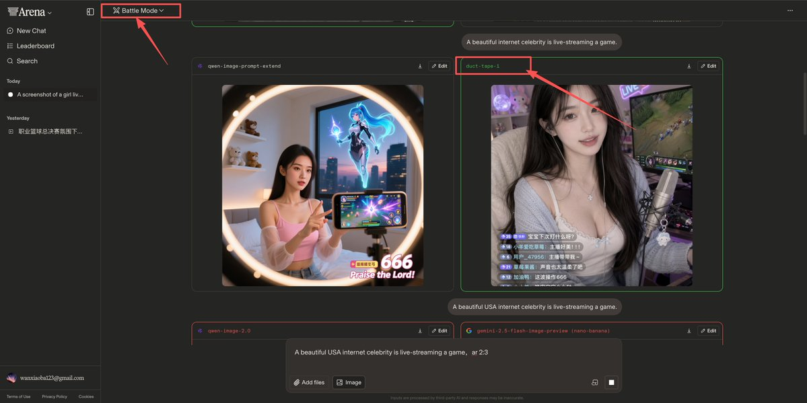
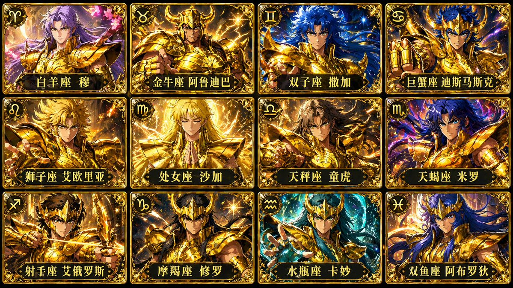
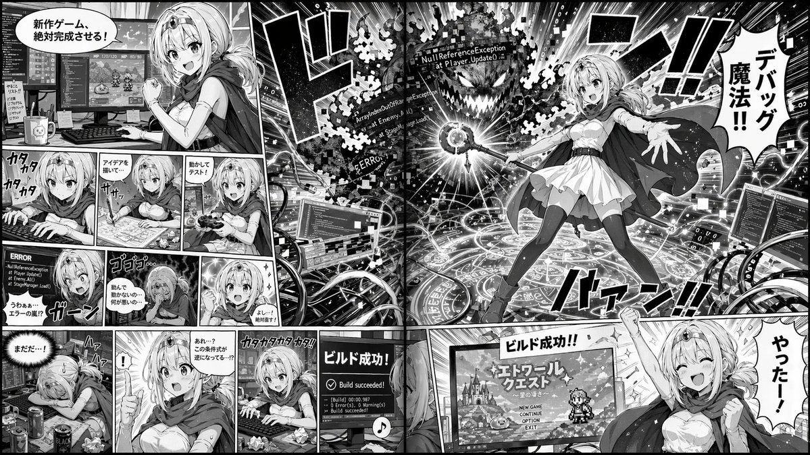
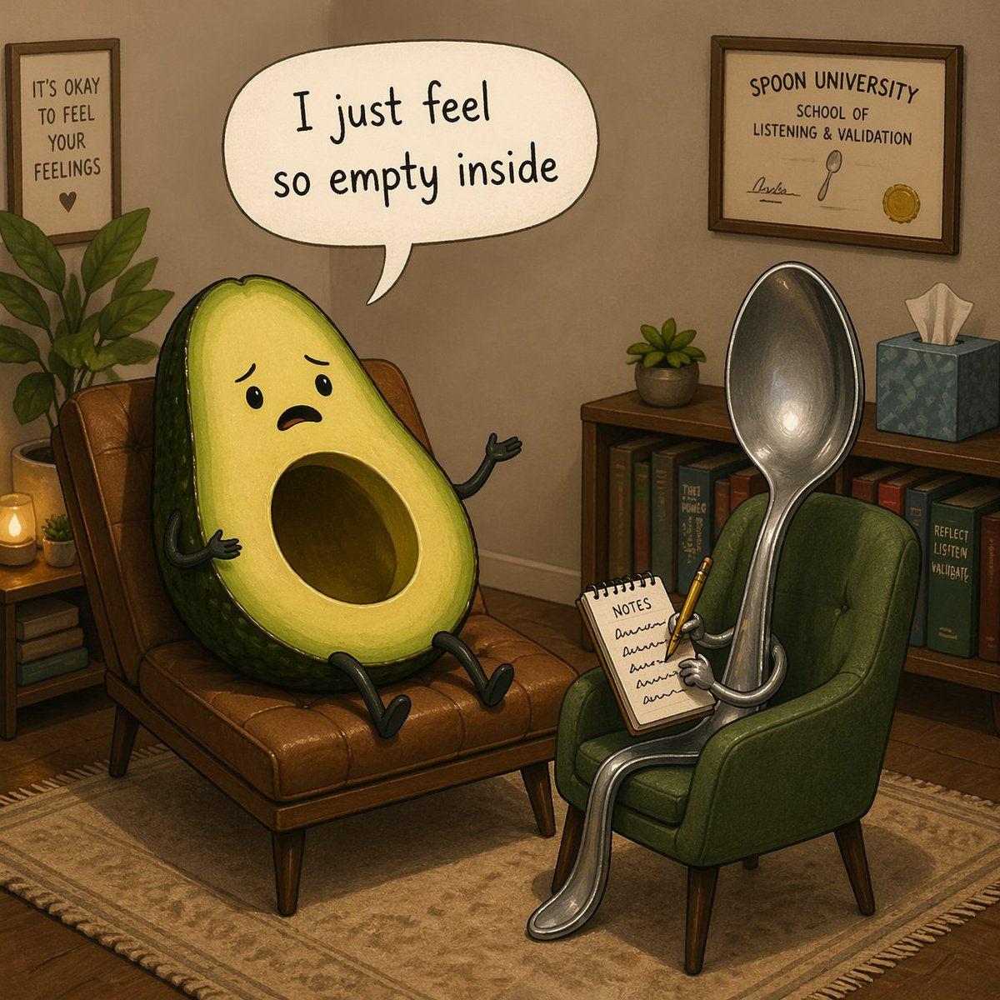
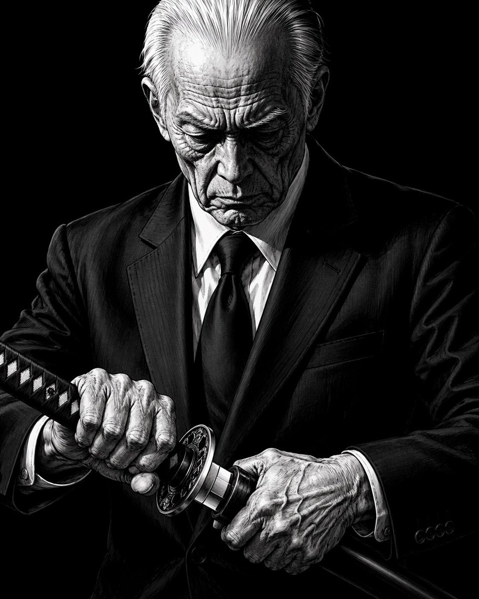
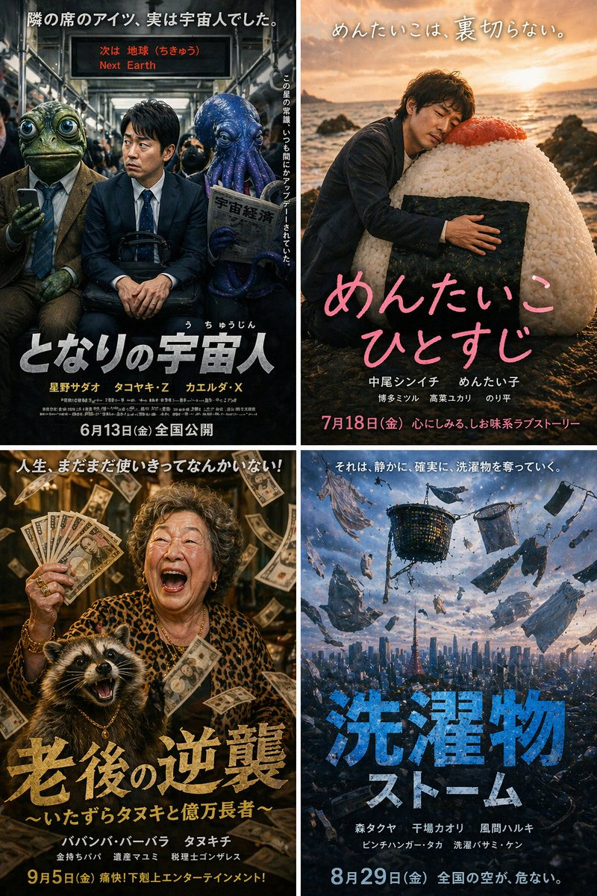

<!-- Generated by scripts/gallery.py; edit authoritative JSON, then rebuild. -->

# 全部资料 · 第 5 册

[画廊总览](gallery.md) | [上一册](gallery-part-4.md) | [下一册](gallery-part-6.md)

本册 25 条资料。标题链接固定到所示版本。

## 信息图可视化设计 · v1

- [信息图可视化设计 · v1](../cases/case-awesome-gpt-image-2-102-449f1cbdc43a/v1.md) — awesome-gpt-image-2 \#102

原图文案例 · gpt-image

**待复核：尚无补充核查，不代表必要输入已齐全**

已机械读取完整 prompt 与资产路径、哈希并比对本地上游画廊；未检出需补特定原图的明确证据。未全量逐图审，模型家族仅据来源集合声明，实际版本未知。 审核只涉及资料输入要求/资产角色，不包含重新生图、身份一致性或像素复现验证。

**图片角色尚未确认**


<details>
<summary>展开完整提示词</summary>

```text
Search the web for {argument name="performance description" default="this week’s standout individual performance in Champion’s League"}, using exact stats and game summary, {argument name="colors" default="bold team colors"}, legible score breakdown, and generate a {argument name="card type" default="Highlight card"}.
```

</details>

## 视频封面界面图 · v1

- [视频封面界面图 · v1](../cases/case-awesome-gpt-image-2-103-0806f93beae5/v1.md) — awesome-gpt-image-2 \#103

原图文案例 · gpt-image

**待复核：尚无补充核查，不代表必要输入已齐全**

已机械读取完整 prompt 与资产路径、哈希并比对本地上游画廊；未检出需补特定原图的明确证据。未全量逐图审，模型家族仅据来源集合声明，实际版本未知。 审核只涉及资料输入要求/资产角色，不包含重新生图、身份一致性或像素复现验证。

**图片角色尚未确认**


<details>
<summary>展开完整提示词</summary>

```text
{argument name="pianist" default="Vladimir Horowitz"} performs a {argument name="event" default="live piano recital"} streamed on {argument name="platform" default="YouTube"}
```

</details>

## 界面交互设计图 · v1

- [界面交互设计图 · v1](../cases/case-awesome-gpt-image-2-104-cdc840961db8/v1.md) — awesome-gpt-image-2 \#104

原图文案例 · gpt-image

**待复核：尚无补充核查，不代表必要输入已齐全**

已机械读取完整 prompt 与资产路径、哈希并比对本地上游画廊；未检出需补特定原图的明确证据。未全量逐图审，模型家族仅据来源集合声明，实际版本未知。 审核只涉及资料输入要求/资产角色，不包含重新生图、身份一致性或像素复现验证。

**图片角色尚未确认**


<details>
<summary>展开完整提示词</summary>

```text
{
  "type": "YouTube livestream UI",
  "top_nav": {
    "logo": "YouTube Premium",
    "search": "{argument name=\"search query\" default=\"bilal fraiha\"}",
    "icons": 3
  },
  "player": {
    "subjects": [
      "{argument name=\"female guest\" default=\"Sydney Sweeney\"} in white cardigan",
      "bearded man in beige jacket laughing"
    ],
    "bg": "couch, 2 silver play buttons, ram logo 'SARDI'",
    "overlays": {
      "chat": {"pos": "left", "count": 15, "desc": "colored usernames, white text"},
      "goal": {"pos": "top right", "text": "TONIGHT'S GOAL: 0 to 25"},
      "banner": {"pos": "bottom center", "text": "K {argument name=\"streamer name\" default=\"MOREBILAL\"}"}
    },
    "controls": {"count": 10}
  },
  "details": {
    "title": "{argument name=\"video title\" default=\"FULL STREAM | سيدني سويني مع بلال\"}",
    "channel": "{argument name=\"channel name\" default=\"More Bilal No Filter\"}",
    "buttons": 5
  }
}
```

</details>

## 动漫插画创作图 · v1

- [动漫插画创作图 · v1](../cases/case-awesome-gpt-image-2-105-9a3df0babb8c/v1.md) — awesome-gpt-image-2 \#105

原图文案例 · gpt-image

**待复核：尚无补充核查，不代表必要输入已齐全**

已机械读取完整 prompt 与资产路径、哈希并比对本地上游画廊；未检出需补特定原图的明确证据。未全量逐图审，模型家族仅据来源集合声明，实际版本未知。 审核只涉及资料输入要求/资产角色，不包含重新生图、身份一致性或像素复现验证。

**图片角色尚未确认**


<details>
<summary>展开完整提示词</summary>

```text
A high-energy VTuber thumbnail illustration of a smiling anime girl with {argument name="hair color" default="bright blue"} hair in a high ponytail wearing a white shirt. The background is an explosive burst of rainbow light rays and golden sparkles. A golden retro microphone sits in the bottom left. Massive, shiny 3D gold text on the left reads "{argument name="main title text" default="初配信"}". A 3D gold and blue subtitle reads "{argument name="subtitle text" default="一緒に最高の時間を！"}". An ornate blue and gold oval badge in the bottom right displays "{argument name="character name" default="エリン Erin"}". A red top-right badge reads "{argument name="badge text" default="LIVE"}".
```

</details>

## 应用界面样机图 · v1

- [应用界面样机图 · v1](../cases/case-awesome-gpt-image-2-106-8d6bab842e03/v1.md) — awesome-gpt-image-2 \#106

原图文案例 · gpt-image

**待复核：尚无补充核查，不代表必要输入已齐全**

已机械读取完整 prompt 与资产路径、哈希并比对本地上游画廊；未检出需补特定原图的明确证据。未全量逐图审，模型家族仅据来源集合声明，实际版本未知。 审核只涉及资料输入要求/资产角色，不包含重新生图、身份一致性或像素复现验证。

**图片角色尚未确认**


<details>
<summary>展开完整提示词</summary>

```text
{
  "type": "YouTube thumbnail graphic",
  "style": "anime, edgy, neon pink and black color scheme, grunge and splatter accents",
  "character": {
    "appearance": "anime girl, {argument name=\"hair color\" default=\"silver\"} hair, cat ears, purple eyes",
    "expression": "{argument name=\"expression\" default=\"shocked and sweating\"}, mouth open",
    "accessories": "black cat hairclip with pink cross, black choker with heart ring",
    "action": "holding a pink smartphone with a swirl logo"
  },
  "layout": {
    "main_title": {
      "position": "bottom center",
      "style": "huge, bold, 3D typography, grunge texture",
      "lines": [
        { "text": "{argument name=\"main title top\" default=\"스레드 논란\"}", "color": "neon pink" },
        { "text": "{argument name=\"main title bottom\" default=\"읽어드림 ;;\"}", "color": "white" }
      ]
    },
    "ui_elements": [
      {
        "type": "social media feed mockup",
        "position": "mid-left",
        "header": "← 스레드",
        "post_count": 3,
        "details": "avatars, Korean text, interaction icons for like, comment, repost"
      },
      {
        "type": "live chat mockup",
        "position": "right edge",
        "message_count": 4,
        "details": "pink user icons, Korean text"
      }
    ],
    "text_callouts": [
      {
        "type": "spiky speech bubble",
        "position": "center top",
        "text": "{argument name=\"speech bubble text\" default=\"이게 맞아?;;\"}"
      },
      {
        "type": "neon box",
        "position": "top right",
        "text": "실시간 반응 중"
      },
      {
        "type": "floating grunge text",
        "position": "far left",
        "line_count": 3,
        "text": ["OO 논란", "충격 실화", "역대급 사건"]
      },
      {
        "type": "handwritten text with arrow",
        "position": "bottom right",
        "text": "여러분의 생각은 어떠신가요?"
      }
    ],
    "logos": [
      {
        "type": "app icon",
        "position": "top left",
        "description": "white swirl logo on black rounded square"
      }
    ]
  }
}
```

</details>

## 应用界面样机图 · v1

- [应用界面样机图 · v1](../cases/case-awesome-gpt-image-2-107-892980c107b7/v1.md) — awesome-gpt-image-2 \#107

原图文案例 · gpt-image

**待复核：尚无补充核查，不代表必要输入已齐全**

已机械读取完整 prompt 与资产路径、哈希并比对本地上游画廊；未检出需补特定原图的明确证据。未全量逐图审，模型家族仅据来源集合声明，实际版本未知。 审核只涉及资料输入要求/资产角色，不包含重新生图、身份一致性或像素复现验证。

**图片角色尚未确认**


<details>
<summary>展开完整提示词</summary>

```text
{"type": "YouTube desktop dark mode UI mockup", "header": {"logo": "YouTube", "search_bar": "Search", "icons_count": 5, "icons": ["search", "mic", "create", "notifications", "profile"]}, "video_player": {"top_left_badge": "LIVE", "left_side": {"subject": "{argument name=\"presenter description\" default=\"man in green sweater at wooden podium\"}", "podium_logo": "OpenAI"}, "right_side_presentation": {"text_elements": ["OpenAI", "INTRODUCING", "{argument name=\"product name\" default=\"GPT-Image-2\"}", "{argument name=\"tagline\" default=\"More Realistic. More Useful. More Creative.\"}"], "sample_images_count": 4, "sample_images": ["mountain lake with boat", "woman portrait with dappled light", "cute robot with lantern in forest", "starry night cafe painting"]}, "bottom_controls_count": 10, "bottom_controls": ["pause", "next", "volume", "LIVE", "red progress bar", "CC", "settings", "miniplayer", "theater mode", "fullscreen"]}, "video_details": {"title": "{argument name=\"video title\" default=\"OpenAI Live: Introducing GPT-Image-2\"}", "channel": {"name": "{argument name=\"channel name\" default=\"OpenAI\"}", "verified": true, "subscribers": "1.36M", "button": "Subscribe"}, "action_buttons_count": 5, "action_buttons": ["Like 12K", "Dislike 497", "Share", "Save", "More"], "description_box": {"stats": "95,237 watching now Started streaming 7 minutes ago", "tags": "#OpenAI #GPTImage2 #AI", "text": "Join us for a special live event as we introduce GPT-Image-2, our latest and most advanced image generation model. See new capabilities, live demos, and hear from the team ...more"}}}
```

</details>

## 综合应用场景图 · v1

- [综合应用场景图 · v1](../cases/case-awesome-gpt-image-2-108-3733f1e88135/v1.md) — awesome-gpt-image-2 \#108

原图文案例 · gpt-image

**待复核：尚无补充核查，不代表必要输入已齐全**

已机械读取完整 prompt 与资产路径、哈希并比对本地上游画廊；未检出需补特定原图的明确证据。未全量逐图审，模型家族仅据来源集合声明，实际版本未知。 审核只涉及资料输入要求/资产角色，不包含重新生图、身份一致性或像素复现验证。

**图片角色尚未确认**


<details>
<summary>展开完整提示词</summary>

```text
{argument name="subject" default="A beautiful internet celebrity"} is live-streaming a {argument name="activity" default="game"}.
```

</details>

## 综合应用场景图 · v1

- [综合应用场景图 · v1](../cases/case-awesome-gpt-image-2-109-4c2ad20864f2/v1.md) — awesome-gpt-image-2 \#109

原图文案例 · gpt-image

**待复核：尚无补充核查，不代表必要输入已齐全**

已机械读取完整 prompt 与资产路径、哈希并比对本地上游画廊；未检出需补特定原图的明确证据。未全量逐图审，模型家族仅据来源集合声明，实际版本未知。 审核只涉及资料输入要求/资产角色，不包含重新生图、身份一致性或像素复现验证。

**图片角色尚未确认**



<details>
<summary>展开完整提示词</summary>

```text
{argument name="subject" default="A beautiful internet celebrity"} is live-streaming a {argument name="activity" default="game"}.
```

</details>

## 视频封面界面图 · v1

- [视频封面界面图 · v1](../cases/case-awesome-gpt-image-2-110-670b3a1fb97c/v1.md) — awesome-gpt-image-2 \#110

原图文案例 · gpt-image

**待复核：尚无补充核查，不代表必要输入已齐全**

已机械读取完整 prompt 与资产路径、哈希并比对本地上游画廊；未检出需补特定原图的明确证据。未全量逐图审，模型家族仅据来源集合声明，实际版本未知。 审核只涉及资料输入要求/资产角色，不包含重新生图、身份一致性或像素复现验证。

**图片角色尚未确认**


<details>
<summary>展开完整提示词</summary>

```text
Thumbnail for a YouTube unboxing video, a video of {argument name="topic" default="opening all overdue bills"}, {argument name="quantity" default="100 in a row"}
```

</details>

## 视频封面界面图 · v1

- [视频封面界面图 · v1](../cases/case-awesome-gpt-image-2-111-8daa036e6a0a/v1.md) — awesome-gpt-image-2 \#111

原图文案例 · gpt-image

**待复核：尚无补充核查，不代表必要输入已齐全**

已机械读取完整 prompt 与资产路径、哈希并比对本地上游画廊；未检出需补特定原图的明确证据。未全量逐图审，模型家族仅据来源集合声明，实际版本未知。 审核只涉及资料输入要求/资产角色，不包含重新生图、身份一致性或像素复现验证。

**图片角色尚未确认**


<details>
<summary>展开完整提示词</summary>

```text
A YouTube thumbnail-style collage for a {argument name="overall mood" default="dark, dramatic, true crime investigation"}. In the center is a highly detailed, close-up portrait of an {argument name="central figure" default="older man with grey hair and deep wrinkles resembling Jeffrey Epstein"}, wearing a black polo shirt, with a faint red glowing outline separating him from the background. On the left side, a {argument name="left background scene" default="tropical island with luxury villas and a flying airplane in a dark sky"}. Below the island, a conspiracy board motif features exactly 2 red push pins connected by 3 thick red strings. On the top right side, a hazy, sepia-toned depiction of the {argument name="right background scene" default="US Capitol building with the silhouettes of 3 men in suits facing it"}. On the bottom right, an open manila folder containing a {argument name="document type" default="heavily redacted dossier with thick black marker lines and a smaller photograph of the central man"}. The overall composition is cinematic, intense, and heavily stylized for a documentary video.
```

</details>

## 信息图可视化设计 · v1

- [信息图可视化设计 · v1](../cases/case-awesome-gpt-image-2-112-f1e2fd4c65e9/v1.md) — awesome-gpt-image-2 \#112

原图文案例 · gpt-image

**待复核：尚无补充核查，不代表必要输入已齐全**

已机械读取完整 prompt 与资产路径、哈希并比对本地上游画廊；未检出需补特定原图的明确证据。未全量逐图审，模型家族仅据来源集合声明，实际版本未知。 审核只涉及资料输入要求/资产角色，不包含重新生图、身份一致性或像素复现验证。

**图片角色尚未确认**



<details>
<summary>展开完整提示词</summary>

```text
Generate a 12-grid card image of the 12 Golden Saints from Saint Seiya, with each card featuring its corresponding Chinese name, 4 cards per row, in a 16:9 aspect ratio.
```

</details>

## 动漫插画创作图 · v1

- [动漫插画创作图 · v1](../cases/case-awesome-gpt-image-2-113-6f9229fcecfe/v1.md) — awesome-gpt-image-2 \#113

原图文案例 · gpt-image

**待复核：尚无补充核查，不代表必要输入已齐全**

已机械读取完整 prompt 与资产路径、哈希并比对本地上游画廊；未检出需补特定原图的明确证据。未全量逐图审，模型家族仅据来源集合声明，实际版本未知。 审核只涉及资料输入要求/资产角色，不包含重新生图、身份一致性或像素复现验证。

**图片角色尚未确认**


<details>
<summary>展开完整提示词</summary>

```text
A highly detailed anime illustration of a fierce female warrior with long flowing {argument name="hair color" default="black"} hair and piercing {argument name="eye color" default="blue"} eyes, wearing a mix of silver plate armor with gold trim and a {argument name="outfit color" default="blue and white"} tunic. She is captured in a dynamic combat stance, swinging a massive, {argument name="weapon type" default="segmented metallic whip-sword"} that curves dramatically into the extreme foreground. The weapon leaves a sweeping trail of kinetic energy and wind. The scene is set against a {argument name="background setting" default="ruined battlefield with rocky terrain, floating debris, and large blue banners fluttering in the wind"} under a dramatic cloudy sky. The artwork features cinematic lighting, intense action, and a dramatic forced perspective on the weapon.
```

</details>

## 插画艺术创作图 · v1

- [插画艺术创作图 · v1](../cases/case-awesome-gpt-image-2-114-fc7182d3f46d/v1.md) — awesome-gpt-image-2 \#114

原图文案例 · gpt-image

**待复核：尚无补充核查，不代表必要输入已齐全**

已机械读取完整 prompt 与资产路径、哈希并比对本地上游画廊；未检出需补特定原图的明确证据。未全量逐图审，模型家族仅据来源集合声明，实际版本未知。 审核只涉及资料输入要求/资产角色，不包含重新生图、身份一致性或像素复现验证。

**图片角色尚未确认**


<details>
<summary>展开完整提示词</summary>

```text
{
  "type": "4-panel vertical comic strip",
  "style": "{argument name=\"art style\" default=\"black and white pencil sketch, crosshatch shading, satirical caricature comic\"}",
  "characters": {
    "subject_1": "{argument name=\"main character\" default=\"Sam Altman\"}, curly hair, casual sweater",
    "subject_2": "{argument name=\"interviewer\" default=\"Ronan Farrow\"}, suit, tie, holding notepad"
  },
  "layout": {
    "panels": [
      {
        "panel_number": 1,
        "top_caption": "SAM ALTMAN THINKS THIS WILL BE A NICE LITTLE PROFILE...",
        "scene": "subject_1 looking smug with hands steepled; subject_2 looking serious taking notes.",
        "thought_bubble": "I'LL BE CHARMING. IT'LL BE A GREAT CHARACTER PIECE. PEOPLE WILL LOVE IT.",
        "center_text": "THE RONAN FARROW INTERVIEW",
        "inset_portraits": {
          "count": 2,
          "labels": ["HARVEY WEINSTEIN EXPOSED", "LESLIE MOONVES EXPOSED"]
        },
        "info_boxes": {
          "count": 3,
          "text": [
            "RONAN FARROW: PULITZER PRIZE-WINNING REPORTER WHO EXPOSED HARVEY WEINSTEIN AT THE NEW YORKER",
            "AND LESLIE MOONVES AT CBS.",
            "POWER. ABUSE. ACCOUNTABILITY."
          ]
        }
      },
      {
        "panel_number": 2,
        "top_caption": "CUT TO...",
        "scene": "Close-up of subject_1 looking shocked and horrified.",
        "article_header": "{argument name=\"publication\" default=\"THE NEW YORKER\"}\nTHE SAM ALTMAN PROFILE\nTHE OPENAI CEO'S COMPLICATED QUEST\nBy Ronan Farrow"
      },
      {
        "panel_number": 3,
        "top_caption": "SOON AFTER THE ARTICLE IS PUBLISHED...",
        "scene": "subject_1 looking extremely stressed, sweating, holding a phone to his ear. Surrounded by 6 hands holding smartphones.",
        "phone_labels": ["VC", "REPORTER", "EX-STAFFEE", "INVESTOR", "TECH CEO", "FORMER COLLEAGUE"],
        "shouts": {
          "count": 8,
          "text": [
            "{argument name=\"main accusation\" default=\"LIAR\"}!",
            "COMPULSIVE LIAR!",
            "PATHOLOGICAL LIAR!",
            "YOU CAN'T STOP LYING!",
            "LIAR!!!",
            "SOCIOPATH! (ALLEGEDLY)",
            "EVERYTHING HE SAYS IS A LIE!",
            "MANIPULATIVE LIAR!"
          ]
        },
        "sound_effects": "RING! RING! RING!"
      },
      {
        "panel_number": 4,
        "top_caption": "AND THE REPORT CONCLUDES...",
        "scene": "subject_1 looking utterly defeated and depressed.",
        "quote_box": "\"ALTMAN FREQUENTLY AND CONSISTENTLY LIES TO INVESTORS, EMPLOYEES, THE BOARD, AND EVEN CLOSE FRIENDS.\"\n\"HE APPEARS TO HAVE NO COMFORT TELLING FALSEHOODS.\"\n\"HE IS, BY MANY ACCOUNTS, A COMPULSIVE LIAR AND A SOCIOPATH.\"\n(ALLEGEDLY)",
        "thought_bubble": {
          "scene": "Happy subject_1 holding a 'WORLD'S BEST CEO' mug.",
          "text": "I THOUGHT IT WOULD BE A NICE LITTLE PROFILE...",
          "sparkle_words": {
            "count": 4,
            "text": ["GENIUS!", "VISIONARY!", "INSPIRING!", "BRILLIANT LEADER!"]
          }
        },
        "bottom_caption": "INSTEAD, IT'S THE PROFILE THAT EXPOSES HIM."
      }
    ]
  }
}
```

</details>

## 品牌视觉识别图 · v1

- [品牌视觉识别图 · v1](../cases/case-awesome-gpt-image-2-115-44e8eff1d8d4/v1.md) — awesome-gpt-image-2 \#115

原图文案例 · gpt-image

**待复核：尚无补充核查，不代表必要输入已齐全**

已机械读取完整 prompt 与资产路径、哈希并比对本地上游画廊；未检出需补特定原图的明确证据。未全量逐图审，模型家族仅据来源集合声明，实际版本未知。 审核只涉及资料输入要求/资产角色，不包含重新生图、身份一致性或像素复现验证。

**图片角色尚未确认**


<details>
<summary>展开完整提示词</summary>

```text
{
  "type": "two-page manga spread",
  "style": "highly detailed realistic manga, monochrome, screentones, dramatic lighting, psychological thriller",
  "global_elements": {
    "protagonist": "{argument name=\"main character description\" default=\"young Japanese salaryman in a suit\"}",
    "theme": "{argument name=\"core concept\" default=\"surrounded by a massive crowd of identical clones of himself\"}"
  },
  "layout": {
    "left_page": {
      "type": "full page splash panel",
      "setting": "{argument name=\"setting\" default=\"Shibuya scramble crossing at night\"}",
      "visuals": "Protagonist standing alone in the center of the crossing, looking around in shock at a massive crowd where every single person is an exact clone of him.",
      "text_elements": [
        {"type": "manga title logo", "text": "{argument name=\"manga title\" default=\"俺だらけの街\"}"},
        {"type": "subtitle", "text": "第1話 交代"},
        {"type": "narration box", "text": "その夜、世界は静かに俺をやめた。"},
        {"type": "sound effect", "text": "ザワ…"}
      ]
    },
    "right_page": {
      "type": "5-panel vertical layout",
      "panels": [
        {
          "panel_number": 1,
          "visuals": "Extreme close-up of protagonist's eyes, wide with shock, sweating.",
          "text_elements": [
            {"type": "speech bubble", "text": "……は？ なんで……みんな、俺なんだ？"},
            {"type": "sound effect", "text": "ドクン"}
          ]
        },
        {
          "panel_number": 2,
          "visuals": "A horizontal row of 8 identical clones in suits staring blankly forward.",
          "text_elements": [
            {"type": "sound effect", "text": "ザワ…"}
          ]
        },
        {
          "panel_number": 3,
          "visuals": "A clone leaning in to whisper into the shocked protagonist's ear.",
          "text_elements": [
            {"type": "speech bubble", "text": "お前の代わりは、もう足りてる。"},
            {"type": "sound effect", "text": "スッ"}
          ]
        },
        {
          "panel_number": 4,
          "visuals": "Close-up of a smartphone screen held in a hand, showing a push notification.",
          "text_elements": [
            {"type": "screen text", "text": "交代を開始します。"},
            {"type": "sound effect", "text": "ピロン"}
          ]
        },
        {
          "panel_number": 5,
          "visuals": "Wide shot of the endless crowd of clones in the city street.",
          "text_elements": [
            {"type": "narration box", "text": "最初に消えるのは、名前でも命でもない。居場所だ。"},
            {"type": "bottom left text", "text": "俺は、ここにいていいのか——？"},
            {"type": "bottom right text", "text": "{argument name=\"cliffhanger text\" default=\"次号へつづく！\"}"},
            {"type": "sound effect", "text": "ザワ… ザワ… ザワ…"}
          ]
        }
      ]
    }
  }
}
```

</details>

## 主题海报版式设计 · v1

- [主题海报版式设计 · v1](../cases/case-awesome-gpt-image-2-116-f749fd6523da/v1.md) — awesome-gpt-image-2 \#116

原图文案例 · gpt-image

**待复核：尚无补充核查，不代表必要输入已齐全**

已机械读取完整 prompt 与资产路径、哈希并比对本地上游画廊；未检出需补特定原图的明确证据。未全量逐图审，模型家族仅据来源集合声明，实际版本未知。 审核只涉及资料输入要求/资产角色，不包含重新生图、身份一致性或像素复现验证。

**图片角色尚未确认**



<details>
<summary>展开完整提示词</summary>

```text
{
  "type": "2-page manga spread",
  "style": "monochrome anime manga, screentones",
  "theme": "{argument name=\"main action\" default=\"fantasy mage developing a video game\"}",
  "character": "{argument name=\"character appearance\" default=\"anime girl with blonde hair, tiara, cape, white dress, thigh-highs\"}",
  "layout": {
    "left_page": {
      "panel_count": 11,
      "rows": [
        {"panels": 1, "action": "Determined at dual-monitor desk, speech bubble: '新作ゲーム、絶対完成させる！'"},
        {"panels": 3, "action": "Typing, drawing on tablet, testing with controller"},
        {"panels": 3, "action": "Shocked at ERROR screen, depressed, determined again"},
        {"panels": 4, "action": "Exhausted, sudden realization, furious typing, monitor showing 'Build succeeded!'"}
      ]
    },
    "right_page": {
      "panel_count": 2,
      "panels": [
        {"type": "large splash", "action": "Casting magic from a glowing circle at a code-error monster labeled '{argument name=\"error text\" default=\"NullReferenceException\"}'. Speech bubble: '{argument name=\"spell text\" default=\"デバッグ魔法!!\"}'"},
        {"type": "bottom banner", "action": "Cheering in front of RPG title screen. Speech bubble: '{argument name=\"success text\" default=\"やったー！\"}'"}
      ]
    }
  }
}
```

</details>

## 主题海报版式设计 · v1

- [主题海报版式设计 · v1](../cases/case-awesome-gpt-image-2-117-85e19583cec6/v1.md) — awesome-gpt-image-2 \#117

原图文案例 · gpt-image

**待复核：尚无补充核查，不代表必要输入已齐全**

已机械读取完整 prompt 与资产路径、哈希并比对本地上游画廊；未检出需补特定原图的明确证据。未全量逐图审，模型家族仅据来源集合声明，实际版本未知。 审核只涉及资料输入要求/资产角色，不包含重新生图、身份一致性或像素复现验证。

**图片角色尚未确认**



<details>
<summary>展开完整提示词</summary>

```text
A humorous 3D cartoon illustration of a therapy session in a cozy office. On the left, a {argument name="patient character" default="sad anthropomorphic avocado half missing its pit"} sits on a brown leather lounge chair, gesturing with its thin stick-like arms. A large speech bubble above it reads "{argument name="speech text" default="I just feel so empty inside"}". On the right, the therapist, an {argument name="therapist character" default="anthropomorphic silver spoon"}, sits in a green armchair, holding a yellow pencil and writing on a notepad labeled "NOTES". The room has warm lighting, a beige rug on a wooden floor, and a bookshelf with a tissue box and books, one titled "REFLECT LISTEN VALIDATE". On the left wall hangs a framed poster reading "{argument name="poster text" default="IT'S OKAY TO FEEL YOUR FEELINGS"}" with a small heart. On the right wall hangs a framed diploma reading "{argument name="diploma text" default="SPOON UNIVERSITY SCHOOL OF LISTENING & VALIDATION"}" featuring a small spoon illustration and a gold seal.
```

</details>

## 漫画分镜叙事设计 · v1

- [漫画分镜叙事设计 · v1](../cases/case-awesome-gpt-image-2-118-1def799583cc/v1.md) — awesome-gpt-image-2 \#118

原图文案例 · gpt-image

**待复核：尚无补充核查，不代表必要输入已齐全**

已机械读取完整 prompt 与资产路径、哈希并比对本地上游画廊；未检出需补特定原图的明确证据。未全量逐图审，模型家族仅据来源集合声明，实际版本未知。 审核只涉及资料输入要求/资产角色，不包含重新生图、身份一致性或像素复现验证。

**图片角色尚未确认**



<details>
<summary>展开完整提示词</summary>

```text
A high-contrast, black-and-white illustration of an elderly man in a sharp suit, drawing a katana. The man has slicked-back white hair, deep wrinkles, and an intense, focused expression, looking down at the blade. He wears a dark suit, white shirt, and dark tie. His hands are prominently featured in the foreground, showing pronounced veins and wrinkles as they grip the ornate handle and scabbard of the katana. The background is completely black, emphasizing the dramatic lighting and intricate cross-hatching details on the man's face, hands, and clothing. The style resembles a detailed, gritty manga or graphic novel.
```

</details>

## 主题海报版式设计 · v1

- [主题海报版式设计 · v1](../cases/case-awesome-gpt-image-2-119-5afbbe8eabc0/v1.md) — awesome-gpt-image-2 \#119

原图文案例 · gpt-image

**待复核：尚无补充核查，不代表必要输入已齐全**

已机械读取完整 prompt 与资产路径、哈希并比对本地上游画廊；未检出需补特定原图的明确证据。未全量逐图审，模型家族仅据来源集合声明，实际版本未知。 审核只涉及资料输入要求/资产角色，不包含重新生图、身份一致性或像素复现验证。

**图片角色尚未确认**


<details>
<summary>展开完整提示词</summary>

```text
{
  "type": "anime movie production pitch document",
  "overall_layout": "split layout with a large cinematic movie poster on the top half and a grid of 5 detailed reference sheets on the bottom half",
  "top_section": {
    "type": "movie poster",
    "visual": "A man, a woman, and a dog standing on a ruined city street, facing away from the viewer, looking towards a colossal, porous, web-like alien structure dominating the sky. A rusty 'RESTRICTED AREA' sign is on the right.",
    "typography": {
      "title": "{argument name=\"movie title\" default=\"劇場版 巨骸の向こう側 Fallen Colossus\"}",
      "release_date": "{argument name=\"release date\" default=\"2027.11.28 ROADSHOW\"}",
      "tagline": "そこにあるのは、まだ「説明」されていないもの。",
      "credits_studio": "{argument name=\"studio name\" default=\"WIT STUDIO\"}"
    }
  },
  "bottom_sections": [
    {
      "title": "{argument name=\"male character name\" default=\"来栖 武 / Kurusu Takeru\"}",
      "type": "character reference sheet",
      "elements": {
        "full_body_poses": 3,
        "expressions": 3,
        "detail_shots": 8,
        "description": "Male protagonist in dark tactical jacket and cargo pants. Includes front, back, and side full-body views, headshots, and detailed callouts for gloves, boots, backpack, and radio."
      }
    },
    {
      "title": "{argument name=\"female character name\" default=\"大城 真那 / Oshiro Mana\"}",
      "type": "character reference sheet",
      "elements": {
        "full_body_poses": 3,
        "expressions": 3,
        "detail_shots": 6,
        "description": "Female protagonist in grey tactical uniform. Includes front, back, and side full-body views, headshots, and detailed callouts for jacket, boots, ID badge, and pouch."
      }
    },
    {
      "title": "カゲ (Kage) 設定画",
      "type": "animal character reference sheet",
      "elements": {
        "full_body_poses": 4,
        "expressions": 4,
        "detail_shots": 5,
        "description": "Dog companion. Includes side, front, back, and angled full-body views, headshots, and detailed callouts for fur texture, paws, and a motorcycle sidecar."
      }
    },
    {
      "title": "第7巨骸 (Remnant-7) 内部区画 設定画",
      "type": "environment and vehicle reference sheet",
      "elements": {
        "large_diagrams": 1,
        "environment_thumbnails": 4,
        "vehicle_designs": 1,
        "description": "Cross-section of the porous alien structure, smaller environment thumbnails, and a motorcycle design featuring the characters."
      }
    },
    {
      "title": "Concept Art",
      "type": "scene illustration",
      "elements": {
        "characters": 3,
        "vehicles": 1,
        "description": "The male character, female character, and dog with a motorcycle sidecar parked in front of the glowing, porous alien structure."
      }
    }
  ]
}
```

</details>

## 建筑空间场景图 · v1

- [建筑空间场景图 · v1](../cases/case-awesome-gpt-image-2-120-0264a2c1a925/v1.md) — awesome-gpt-image-2 \#120

原图文案例 · gpt-image

**待复核：尚无补充核查，不代表必要输入已齐全**

已机械读取完整 prompt 与资产路径、哈希并比对本地上游画廊；未检出需补特定原图的明确证据。未全量逐图审，模型家族仅据来源集合声明，实际版本未知。 审核只涉及资料输入要求/资产角色，不包含重新生图、身份一致性或像素复现验证。

**图片角色尚未确认**


<details>
<summary>展开完整提示词</summary>

```text
A dynamic anime illustration of a girl with spiky {argument name="hair color" default="blonde"} hair tied in a high ponytail with a black bow, striking teal eyes, and a {argument name="outfit style" default="dark purple and black magical uniform with gold trim and diamond gems"}. She is in an intense crouching superhero landing pose, one hand pressed to the ground and the other raised, casting {argument name="magic color" default="glowing purple"} magic circles. She is shattering through a glass barrier, with sharp, jagged glass shards flying outward toward the viewer. Through the broken frame behind her, a {argument name="background scene" default="stylized silhouette of a gothic city with tall spires against a vibrant purple and orange sunset sky"} is visible. The artwork features {argument name="art style" default="sharp angles, high contrast cel-shading, and vibrant colors"}.
```

</details>

## 建筑空间场景图 · v1

- [建筑空间场景图 · v1](../cases/case-awesome-gpt-image-2-121-193212d75b64/v1.md) — awesome-gpt-image-2 \#121

原图文案例 · gpt-image

**待复核：尚无补充核查，不代表必要输入已齐全**

已机械读取完整 prompt 与资产路径、哈希并比对本地上游画廊；未检出需补特定原图的明确证据。未全量逐图审，模型家族仅据来源集合声明，实际版本未知。 审核只涉及资料输入要求/资产角色，不包含重新生图、身份一致性或像素复现验证。

**图片角色尚未确认**


<details>
<summary>展开完整提示词</summary>

```text
{
  "type": "3-panel manga page",
  "style": "anime, highly detailed, cinematic lighting, futuristic corporate",
  "layout": {
    "structure": "1 wide top panel, 2 square bottom panels"
  },
  "panels": [
    {
      "position": "top",
      "shot": "wide landscape",
      "scene": "Futuristic corporate lobby with floor-to-ceiling windows",
      "lighting": "{argument name=\"time of day\" default=\"sunrise\"}",
      "background": "City skyline featuring {argument name=\"landmark\" default=\"Tokyo Tower\"}",
      "details": "Holographic displays, polished reflective floor, reception desk, lounge chairs"
    },
    {
      "position": "bottom left",
      "shot": "close-up profile",
      "character": "Young woman, dark hair, black business suit",
      "accessories": "Futuristic black earpiece with glowing blue light",
      "speech_bubble": {
        "style": "standard rounded",
        "text": "{argument name=\"character dialogue\" default=\"数字はいいわ\"}"
      }
    },
    {
      "position": "bottom right",
      "shot": "full body, walking away, touching earpiece",
      "character": "Same woman, black suit, black heels, carrying a black tote bag",
      "environment": "Approaching security gates",
      "holographic_sign": "{argument name=\"floor sign\" default=\"ECHO 42F\"}",
      "speech_bubble": {
        "style": "futuristic angular",
        "text": "{argument name=\"AI dialogue\" default=\"おはようございます、ユキさん。本日は記念すべき ──\"}"
      }
    }
  ]
}
```

</details>

## 主题海报版式设计 · v1

- [主题海报版式设计 · v1](../cases/case-awesome-gpt-image-2-122-5b8399bd813d/v1.md) — awesome-gpt-image-2 \#122

原图文案例 · gpt-image

**待复核：尚无补充核查，不代表必要输入已齐全**

已机械读取完整 prompt 与资产路径、哈希并比对本地上游画廊；未检出需补特定原图的明确证据。未全量逐图审，模型家族仅据来源集合声明，实际版本未知。 审核只涉及资料输入要求/资产角色，不包含重新生图、身份一致性或像素复现验证。

**图片角色尚未确认**



<details>
<summary>展开完整提示词</summary>

```text
{
  "type": "movie poster grid",
  "layout": "2x2 grid",
  "posters": [
    {
      "position": "top-left",
      "genre": "sci-fi comedy",
      "visuals": "A Japanese salaryman sitting on a crowded train looking nervous, flanked by two aliens in business attire: a green frog-like alien looking at a smartphone, and a blue octopus-like alien reading a newspaper.",
      "text_elements": {
        "tagline_top": "隣の席のアイツ、実は宇宙人でした。",
        "train_display": "次は 地球 (ちきゅう) Next Earth",
        "tagline_side": "この星の常識、いつの間にかアップデートされていた。",
        "main_title": "{argument name=\"poster 1 title\" default=\"となりの宇宙人\"}",
        "cast": "星野サダオ タコヤキ・Z カエルダ・X",
        "release_date": "6月13日(金) 全国公開"
      }
    },
    {
      "position": "top-right",
      "genre": "surreal romance",
      "visuals": "A man in a dark jacket affectionately hugging a giant onigiri (rice ball) topped with mentaiko (spicy cod roe) wrapped in seaweed. They are sitting on a rocky beach during a beautiful sunset.",
      "text_elements": {
        "tagline": "めんたいこは、裏切らない。",
        "main_title": "{argument name=\"poster 2 title\" default=\"めんたいこ ひとすじ\"}",
        "cast": "中尾シンイチ めんたい子 博多ミツル 高菜ユカリ のり平",
        "release_date": "7月18日(金) 心にしみる、しお味系ラブストーリー"
      }
    },
    {
      "position": "bottom-left",
      "genre": "heist comedy",
      "visuals": "A joyful elderly woman in a leopard print blouse laughing maniacally while holding a fan of Japanese yen bills. Money is raining down around her. A happy raccoon is in the foreground.",
      "text_elements": {
        "tagline": "人生、まだまだ使いきってなんかない！",
        "main_title": "{argument name=\"poster 3 title\" default=\"老後の逆襲\"}",
        "subtitle": "〜いたずらタヌキと億万長者〜",
        "cast": "ババンバ・バーバラ タヌキチ 金持ちババ 遺産マユミ 税理士ゴンザレス",
        "release_date": "9月5日(金) 痛快！下剋上エンターテインメント！"
      }
    },
    {
      "position": "bottom-right",
      "genre": "disaster thriller",
      "visuals": "A dramatic disaster scene where laundry baskets, shirts, and clothes are being sucked up into a stormy, apocalyptic sky above a ruined Tokyo city skyline featuring the Tokyo Tower.",
      "text_elements": {
        "tagline": "それは、静かに、確実に、洗濯物を奪っていく。",
        "main_title": "{argument name=\"poster 4 title\" default=\"洗濯物 ストーム\"}",
        "cast": "森タクヤ 干場カオリ 風間ハルキ ピンチハンガー・タカ 洗濯バサミ・ケン",
        "release_date": "8月29日(金) 全国の空が、危ない。"
      }
    }
  ]
}
```

</details>

## 插画艺术创作图 · v1

- [插画艺术创作图 · v1](../cases/case-awesome-gpt-image-2-123-5edf0f16a1d5/v1.md) — awesome-gpt-image-2 \#123

原图文案例 · gpt-image

**待复核：尚无补充核查，不代表必要输入已齐全**

已机械读取完整 prompt 与资产路径、哈希并比对本地上游画廊；未检出需补特定原图的明确证据。未全量逐图审，模型家族仅据来源集合声明，实际版本未知。 审核只涉及资料输入要求/资产角色，不包含重新生图、身份一致性或像素复现验证。

**图片角色尚未确认**


<details>
<summary>展开完整提示词</summary>

```text
{
  "type": "anime character reference sheet",
  "character": {
    "name": "{argument name=\"character name\" default=\"真田大助\"}",
    "appearance": "young warrior with long brown hair, wearing samurai-inspired armor, {argument name=\"main color\" default=\"red\"} chest plate and guards, {argument name=\"secondary color\" default=\"navy blue\"} pleated hakama, white short cape"
  },
  "layout": {
    "header": {
      "title": "{argument name=\"character name\" default=\"真田大助\"}",
      "subtitle": "{argument name=\"character concept\" default=\"戦国時代を舞台にした物語の主人公。日英クォーターの若き武将。\"}",
      "badge": "設定資料"
    },
    "right_side": {
      "main_portrait": "large full-body standing pose, confident smile",
      "background_elements": {
        "emblem": "six-coin crest",
        "quote": "{argument name=\"catchphrase\" default=\"この国を守る。その誇りと共に。\"}",
        "scenery": "monochrome Japanese castle with army banners at the bottom right"
      }
    },
    "sections": [
      {
        "title": "プロフィール",
        "position": "top-left",
        "content": "table with 6 rows and descriptive text"
      },
      {
        "title": "三面図",
        "position": "mid-left",
        "count": 3,
        "labels": ["正面", "側面", "背面"]
      },
      {
        "title": "表情差分",
        "position": "top-center",
        "count": 6,
        "labels": ["通常", "微笑み", "真剣", "怒り", "驚き", "考え中"]
      },
      {
        "title": "衣装・装備詳細",
        "position": "bottom-left",
        "count": 9,
        "labels": ["胸当て", "肩当て", "腕甲(籠手)", "脚甲(脛当て・膝当て)", "革靴", "白マント(短)", "帯", "袴/着物部分", "打刀"]
      },
      {
        "title": "カラーパレット",
        "position": "bottom-center",
        "count": 8,
        "labels": ["真田赤", "濃紺", "金", "白", "茶", "茶褐色", "肌色", "銀"]
      },
      {
        "title": "世界観",
        "position": "bottom-center-right",
        "content": "paragraph of text describing the setting"
      }
    ]
  }
}
```

</details>

## 主题海报版式设计 · v1

- [主题海报版式设计 · v1](../cases/case-awesome-gpt-image-2-124-4015857c981e/v1.md) — awesome-gpt-image-2 \#124

原图文案例 · gpt-image

**待复核：尚无补充核查，不代表必要输入已齐全**

已机械读取完整 prompt 与资产路径、哈希并比对本地上游画廊；未检出需补特定原图的明确证据。未全量逐图审，模型家族仅据来源集合声明，实际版本未知。 审核只涉及资料输入要求/资产角色，不包含重新生图、身份一致性或像素复现验证。

**图片角色尚未确认**


<details>
<summary>展开完整提示词</summary>

```text
An anime-style key visual poster for a fictional slice-of-life anime. In the foreground left, an energetic blonde anime girl with star hairpins and blue eyes wears an {argument name="main character outfit" default="American flag t-shirt and denim shorts"}, holding tongs with a slice of smoked meat towards the viewer. In the foreground right, a gentle girl with long dark hair and a white sweater sits at a wooden table writing in a notebook. In the background, two more girls are present: one with a brown ponytail carrying firewood, and another with short silver hair holding a blue mug. The scene is a sunny outdoor BBQ area with a large black smoker grill featuring a sign that reads {argument name="background grill sign" default="LONE STAR BBQ"}. In the immediate foreground is a {argument name="food platter" default="massive wooden platter loaded with sliced brisket, ribs, sausages, burnt ends, and pickles"}, along with side dishes like coleslaw and bread. In the top left corner, a large, cute, bubbly anime logo reads {argument name="anime title" default="もくもく すもーく ガールズ"} with smoke and grill motifs. In the bottom left corner, there is a {argument name="credits text block" default="staff credits block with names and roles"}. In the bottom right corner, a small text box lists four character names. The overall atmosphere is cheerful, highly detailed, and vibrant.
```

</details>

## 电商商品展示设计 · v1

- [电商商品展示设计 · v1](../cases/case-awesome-gpt-image-2-125-6e41c0a34420/v1.md) — awesome-gpt-image-2 \#125

原图文案例 · gpt-image

**待复核：尚无补充核查，不代表必要输入已齐全**

已机械读取完整 prompt 与资产路径、哈希并比对本地上游画廊；未检出需补特定原图的明确证据。未全量逐图审，模型家族仅据来源集合声明，实际版本未知。 审核只涉及资料输入要求/资产角色，不包含重新生图、身份一致性或像素复现验证。

**图片角色尚未确认**


<details>
<summary>展开完整提示词</summary>

```text
{
  "type": "anime production layout sheet",
  "style": "traditional colored pencil genga, key animation drawing",
  "subject": {
    "character": "{argument name=\"character name\" default=\"ナズナ 七草\"}",
    "appearance": "anime girl with {argument name=\"hair color\" default=\"light purple\"} hair styled in twin braids and bangs, blue eyes, wearing a dark oversized coat",
    "pose_and_expression": "{argument name=\"expression\" default=\"smug with a small fang, resting chin on hand\"}"
  },
  "background": "{argument name=\"background scene\" default=\"nighttime city skyline with a railing\"}, soft focus",
  "layout": {
    "top_edge": "standard animation paper peg holes",
    "left_margin": {
      "series_title": "{argument name=\"anime title\" default=\"よふかしのうた\"}",
      "production_codes": ["#05 C.", "[A] (1)"],
      "circled_note": "髪のハイライト 色トレスです"
    },
    "right_margin": {
      "red_box": "002.normal",
      "timing_layers": ["A (1)", "B (1) (2) (3)", "C (1) (2) END"],
      "background_notes": ["BL 夜景", "BG 市街地夜景 色トレス"]
    }
  }
}
```

</details>

## 插画艺术风格创作 · v1

- [插画艺术风格创作 · v1](../cases/case-awesome-gpt-image-2-126-3239751ae1fc/v1.md) — awesome-gpt-image-2 \#126

原图文案例 · gpt-image

**待复核：尚无补充核查，不代表必要输入已齐全**

已复核检索命中上下文：其措辞指向输出布局、一般风格描述或可选资料，不构成指定输入文件要求。此例未逐图审，保留 needs\_review；源图与源文已归档。 审核只涉及资料输入要求/资产角色，不包含重新生图、身份一致性或像素复现验证。

**图片角色尚未确认**


<details>
<summary>展开完整提示词</summary>

```text
An anime-style light novel cover illustration featuring two characters in an intimate pose. On the left, a young woman with short dark hair, purple eyes, wearing a white hat, a frilly white dress with a pink bow tie, white gloves, and two white flower hairpins. She has an affectionate, teasing smile and is gently touching the chin of the man next to her. On the right, an adult man with {argument name="man's hair color" default="red"} hair parted in the middle, purple eyes, and a light goatee. He is wearing a black button-down shirt and has a slightly annoyed, reluctant expression with a sweat drop on his cheek. The scene features soft, romantic lighting with out-of-focus purple flower petals in the foreground corners. The image includes several Japanese text elements: a large stylized main title at the bottom reading {argument name="main title" default="ちかつば"}, a subtitle below it reading {argument name="subtitle" default="ーその溺愛、独占欲の裏返し。ー"}, vertical text on the top left reading {argument name="left quote" default="可愛いだけじゃ、許さない。"}, and vertical text on the top right reading {argument name="right quote" default="その不機嫌、俺だけに向けろよ。"}.
```

</details>

