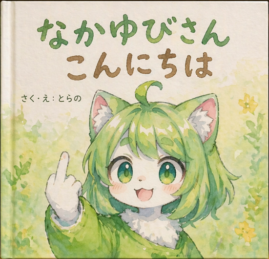
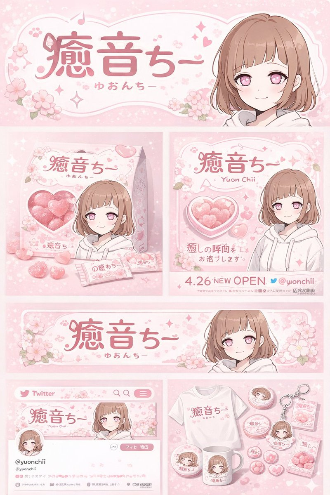
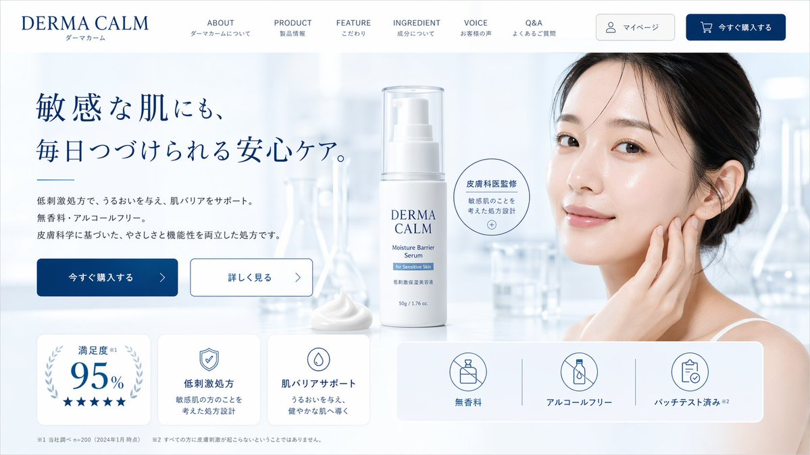
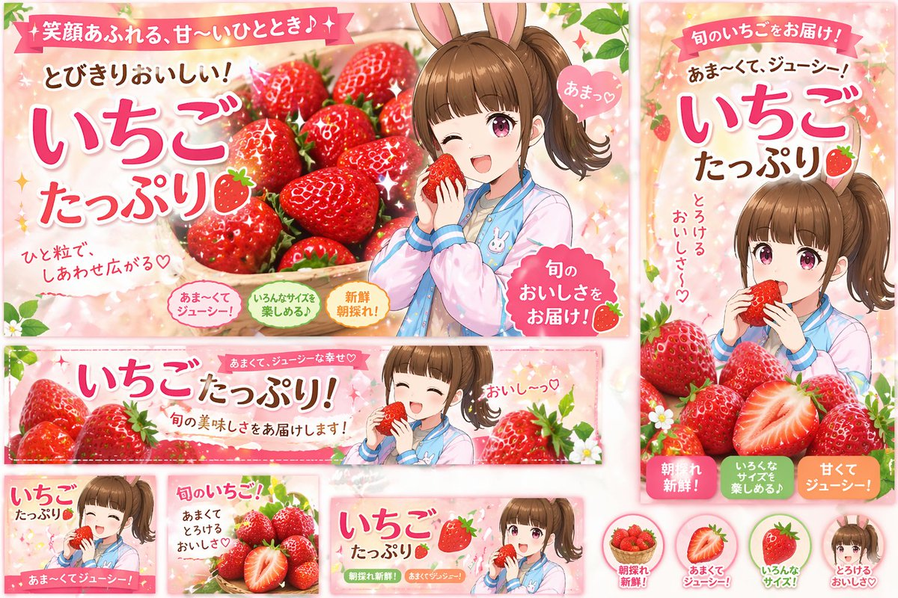
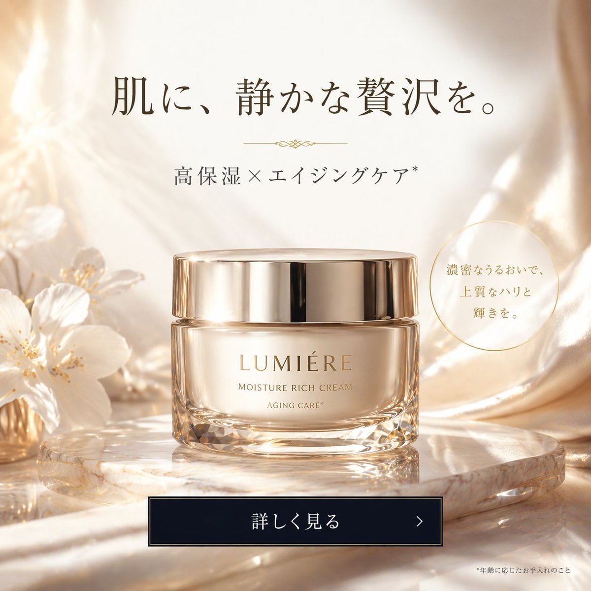

<!-- Generated by scripts/gallery.py; edit authoritative JSON, then rebuild. -->

# 全部资料 · 第 6 册

[画廊总览](gallery.md) | [上一册](gallery-part-5.md) | [下一册](gallery-part-7.md)

本册 25 条资料。标题链接固定到所示版本。

## 建筑空间场景图 · v1

- [建筑空间场景图 · v1](../cases/case-awesome-gpt-image-2-127-9b57e85a51c2/v1.md) — awesome-gpt-image-2 \#127

原图文案例 · gpt-image

**待复核：尚无补充核查，不代表必要输入已齐全**

已机械读取完整 prompt 与资产路径、哈希并比对本地上游画廊；未检出需补特定原图的明确证据。未全量逐图审，模型家族仅据来源集合声明，实际版本未知。 审核只涉及资料输入要求/资产角色，不包含重新生图、身份一致性或像素复现验证。

**图片角色尚未确认**


<details>
<summary>展开完整提示词</summary>

```text
{
  "type": "manga page",
  "style": "anime illustration, full color",
  "characters": {
    "woman": {
      "appearance": "long {argument name=\"hair color\" default=\"black\"} hair, purple eyes",
      "outfit": "{argument name=\"shirt color\" default=\"grey\"} long-sleeve shirt, dark grey skinny jeans, barefoot"
    },
    "delivery_man": {
      "appearance": "bald, older man, thick eyebrows",
      "outfit": "blue work jacket over a grey shirt"
    }
  },
  "layout": {
    "description": "Page split vertically. Left side contains 4 stacked horizontal panels. Right side is a single tall vertical panel.",
    "left_column_panels": [
      {
        "panel_number": 1,
        "scene": "Woman sitting on a grey sofa in a living room, holding a white mug.",
        "text_elements": [
          { "type": "speech_bubble", "text": "?" },
          { "type": "sound_effect", "text": "ピンポーン♪", "description": "doorbell ringing" }
        ]
      },
      {
        "panel_number": 2,
        "scene": "Woman opening the front door. Delivery man standing outside holding a cardboard box, smiling.",
        "text_elements": [
          { "type": "speech_bubble", "speaker": "delivery_man", "text": "{argument name=\"delivery greeting\" default=\"こんにちは〜！宅配便で〜す！\"}" },
          { "type": "speech_bubble", "speaker": "woman", "text": "は、はい…ありがとうございます" }
        ]
      },
      {
        "panel_number": 3,
        "scene": "Close-up of the delivery man laughing enthusiastically with a sparkly pink background.",
        "text_elements": [
          { "type": "speech_bubble", "speaker": "delivery_man", "text": "{argument name=\"creepy compliment\" default=\"おや〜？いや〜美人さんですなあ！こんな綺麗な方がお一人でお住まいなんて、もったいないなあ〜♪\"}" }
        ]
      },
      {
        "panel_number": 4,
        "scene": "Close-up of the woman looking disgusted and uncomfortable, sweating slightly. The back of the delivery man's head is visible in the foreground.",
        "text_elements": [
          { "type": "speech_bubble", "speaker": "delivery_man", "text": "それにしてもお肌が綺麗！スタイルも抜群だし〜モデルさんみたいですよ！" },
          { "type": "thought_bubble", "speaker": "woman", "text": "{argument name=\"woman reaction\" default=\"え…？何この人…ちょっと気持ち悪いかも…\"}" },
          { "type": "caption_box", "text": "この後も延々と褒め続ける配達員だった…" }
        ]
      }
    ],
    "right_column_panel": {
      "panel_number": 5,
      "scene": "Full-body portrait of the woman standing indoors, looking annoyed and suspicious with her arms crossed.",
      "text_elements": [
        { "type": "thought_bubble", "speaker": "woman", "text": "誰かしら…？" }
      ]
    }
  }
}
```

</details>

## 建筑空间场景渲染 · v1

- [建筑空间场景渲染 · v1](../cases/case-awesome-gpt-image-2-128-d47ea8cdf8bf/v1.md) — awesome-gpt-image-2 \#128

原图文案例 · gpt-image

**待复核：尚无补充核查，不代表必要输入已齐全**

已机械读取完整 prompt 与资产路径、哈希并比对本地上游画廊；未检出需补特定原图的明确证据。未全量逐图审，模型家族仅据来源集合声明，实际版本未知。 审核只涉及资料输入要求/资产角色，不包含重新生图、身份一致性或像素复现验证。

**图片角色尚未确认**


<details>
<summary>展开完整提示词</summary>

```text
{
  "type": "anime-style animated movie poster",
  "scene": "Magical glowing multi-story treehouse restaurant in a dark enchanted forest at night, illuminated by string lights and warm window glow.",
  "subjects": {
    "children": "2 children in center foreground facing the restaurant: a boy with a backpack and lantern, and a girl in a red coat and beret with a lantern.",
    "animals": "4 anthropomorphic animals: a bear chef holding a MENU book (bottom left), an owl playing violin and a squirrel playing flute on a branch (top left), a badger playing cello (mid right), and a rabbit in a suit holding a sign (bottom right).",
    "creatures": "3 small black soot-sprite-like creatures with glowing eyes (bottom right).",
    "floating_food": "4 glowing food items floating in the air: soup, pancakes, omurice, and a fruit parfait."
  },
  "layout": {
    "top_text": "{argument name=\"top catchphrase\" default=\"おいしい奇跡が、今夜はじまる。\"}",
    "building_sign": "{argument name=\"restaurant name\" default=\"森のレストラン\"}",
    "left_board": "本日のおすすめ\n・森のスープ\n・星のオムライス\n・ふわふわパンケーキ\n・しあわせのパフェ\n...and more!",
    "right_board": "いらっしゃいませ！\nここは、だれでも\n笑顔になれる場所。",
    "main_title": {
      "text": "{argument name=\"movie title\" default=\"ふしぎな森のレストラン\"}",
      "styling": "Large stylized typography with a chef hat, fork, and spoon motifs."
    },
    "rabbit_sign": "ごちそうさま！またきてね！",
    "bottom_left_badge": "{argument name=\"genre badge\" default=\"家族みんなで楽しめる！心あたたまる冒険ファンタジー\"}",
    "bottom_center_credits": "Fictional cast and staff names in Japanese.",
    "bottom_release_date": "{argument name=\"release date\" default=\"2025年 夏休みロードショー！\"}",
    "bottom_right": "QR code with text '最新情報はこちら！'"
  }
}
```

</details>

## 绘画艺术风格图 · v1

- [绘画艺术风格图 · v1](../cases/case-awesome-gpt-image-2-129-6a781bef5ac3/v1.md) — awesome-gpt-image-2 \#129

原图文案例 · gpt-image

**待复核：尚无补充核查，不代表必要输入已齐全**

已复核检索命中上下文：其措辞指向输出布局、一般风格描述或可选资料，不构成指定输入文件要求。此例未逐图审，保留 needs\_review；源图与源文已归档。 审核只涉及资料输入要求/资产角色，不包含重新生图、身份一致性或像素复现验证。

**图片角色尚未确认**



<details>
<summary>展开完整提示词</summary>

```text
A watercolor illustration of a children's picture book cover. The main subject is a {argument name="character appearance" default="cute furry kemonomimi girl with short green hair, cat ears, and green eyes"}. She is {argument name="action" default="smiling happily while holding up her middle finger"} with a white-furred hand. She wears a green garment with a fluffy white collar. The background features soft, painted green foliage and small yellow flowers on textured paper. At the top, large hand-drawn green Japanese text reads "{argument name="main title" default="なかゆびさん"}". Below it, brown Japanese text reads "{argument name="subtitle" default="こんにちは"}". On the middle-left, smaller black text reads "{argument name="author text" default="さく・え：とらの"}". The image has a visible book spine on the left edge, emphasizing the physical book format.
```

</details>

## 界面交互设计图 · v1

- [界面交互设计图 · v1](../cases/case-awesome-gpt-image-2-130-e7382c61ae60/v1.md) — awesome-gpt-image-2 \#130

原图文案例 · gpt-image

**待复核：尚无补充核查，不代表必要输入已齐全**

已机械读取完整 prompt 与资产路径、哈希并比对本地上游画廊；未检出需补特定原图的明确证据。未全量逐图审，模型家族仅据来源集合声明，实际版本未知。 审核只涉及资料输入要求/资产角色，不包含重新生图、身份一致性或像素复现验证。

**图片角色尚未确认**



<details>
<summary>展开完整提示词</summary>

```text
{
  "type": "brand identity and merchandise design board",
  "theme": {
    "color_palette": "{argument name=\"theme color\" default=\"pastel pink\"} and white",
    "motif": "{argument name=\"motif\" default=\"cherry blossoms\"} and pink hearts"
  },
  "character": {
    "description": "anime girl with short brown bob hair, pink eyes, wearing a white hoodie, gentle smile"
  },
  "branding": {
    "main_logo": "{argument name=\"character name\" default=\"癒音ちー\"}",
    "sub_logo": "{argument name=\"character subtext\" default=\"ゆおんちー\"}"
  },
  "layout": {
    "sections": [
      {
        "type": "header banner",
        "position": "top",
        "elements": ["large main logo", "sub logo", "cherry blossom graphics", "character portrait on the right"]
      },
      {
        "type": "product packaging",
        "position": "middle left",
        "elements": ["1 square box with heart-shaped transparent window showing pink heart candies", "character illustration on box", "2 individual candy wrappers", "5 scattered heart candies"]
      },
      {
        "type": "promotional poster",
        "position": "middle right",
        "elements": ["character portrait", "heart-shaped candy bowl", "main logo", "text '4.26 NEW OPEN'", "text '{argument name=\"social handle\" default=\"@yuonchii\"}'"]
      },
      {
        "type": "horizontal web banner",
        "position": "lower middle",
        "elements": ["main logo", "cherry blossoms", "character portrait on the right"]
      },
      {
        "type": "social media profile mockup",
        "position": "bottom left",
        "elements": ["header image with logo", "1 circular profile picture", "handle '{argument name=\"social handle\" default=\"@yuonchii\"}'", "1 follow button", "mock bio text"]
      },
      {
        "type": "merchandise collection",
        "position": "bottom right",
        "count": 9,
        "items": ["1 white t-shirt with logo", "1 white mug with character", "4 round pin badges", "1 acrylic keychain", "2 candy packets"]
      }
    ]
  }
}
```

</details>

## 界面交互设计图 · v1

- [界面交互设计图 · v1](../cases/case-awesome-gpt-image-2-131-3ff6371bf114/v1.md) — awesome-gpt-image-2 \#131

原图文案例 · gpt-image

**待复核：尚无补充核查，不代表必要输入已齐全**

已机械读取完整 prompt 与资产路径、哈希并比对本地上游画廊；未检出需补特定原图的明确证据。未全量逐图审，模型家族仅据来源集合声明，实际版本未知。 审核只涉及资料输入要求/资产角色，不包含重新生图、身份一致性或像素复现验证。

**图片角色尚未确认**


<details>
<summary>展开完整提示词</summary>

```text
{
  "type": "UI/UX landing page mockup",
  "theme": "dark mode, sleek modern aesthetic, glassmorphism, {argument name=\"primary accent color\" default=\"neon purple and blue\"} glowing accents",
  "header": {
    "logo": "{argument name=\"brand name\" default=\"goViralX\"}",
    "top_right_tag": "VIRAL CAMPAIGN CASE STUDY"
  },
  "layout": {
    "sections": [
      {
        "name": "Hero",
        "headline": "{argument name=\"hero headline\" default=\"How We Created 10M+ Viral Impact\"}",
        "subheadline": "3天引爆全网, 助力品牌实现指数级增长",
        "stats_row": {
          "count": 4,
          "labels": ["总播放量", "互动率", "转化咨询", "执行周期"],
          "values": ["{argument name=\"main statistic\" default=\"10,240,000+\"}", "18.7%", "3,200+", "72小时"]
        },
        "visual": "cinematic shot of a person in a hoodie looking at glowing digital screens and graphs, large play button overlay"
      },
      {
        "name": "Strategy",
        "title": "Our 3-Day Execution Strategy",
        "layout_type": "vertical timeline",
        "steps_count": 3,
        "elements_per_step": ["timeline node", "title", "bullet points", "video thumbnail with play button", "description box"]
      },
      {
        "name": "Performance",
        "title": "Data-Driven Performance",
        "left_column": {
          "stat_cards_count": 4,
          "values": ["10M+", "43%", "28,000+", "3,200+"]
        },
        "right_column": {
          "charts_count": 2,
          "chart_1": "line graph showing 7-day growth peaking at Day 3",
          "chart_2": "horizontal segmented bar chart showing platform distribution (TikTok 52%, Instagram 24%, X 15%, YouTube 9%)"
        }
      },
      {
        "name": "Keys to Success",
        "title": "The 3 Keys to Viral Success",
        "cards_count": 3,
        "card_elements": ["glowing icon (fire, target, antenna)", "title", "description", "VIEW DETAIL link"]
      },
      {
        "name": "Social Proof",
        "title": "TRUSTED BY CREATORS & BRANDS",
        "left_column": {
          "logos_count": 8,
          "grid": "2x4",
          "brands": ["SHEIN", "SHOPLINE", "Blueglass", "instacart", "lemon8", "mi", "CIDER", "bellroy"]
        },
        "right_column": {
          "testimonial_cards_count": 2,
          "elements": ["quote", "author title (SaaS Founder, Growth Manager)"]
        }
      },
      {
        "name": "Call to Action",
        "title": "READY TO GO VIRAL?",
        "interactive_elements": ["text input field", "glowing button with text '{argument name=\"call to action text\" default=\"获取专属增长方案 ->\"}'"],
        "visual": "3D render of a rocket ship taking off with purple and blue flames"
      }
    ]
  }
}
```

</details>

## 界面交互设计图 · v1

- [界面交互设计图 · v1](../cases/case-awesome-gpt-image-2-132-7e20ffea7fb3/v1.md) — awesome-gpt-image-2 \#132

原图文案例 · gpt-image

**待复核：尚无补充核查，不代表必要输入已齐全**

已机械读取完整 prompt 与资产路径、哈希并比对本地上游画廊；未检出需补特定原图的明确证据。未全量逐图审，模型家族仅据来源集合声明，实际版本未知。 审核只涉及资料输入要求/资产角色，不包含重新生图、身份一致性或像素复现验证。

**图片角色尚未确认**


<details>
<summary>展开完整提示词</summary>

```text
{
  "type": "18-panel brand identity and character design document",
  "brand": {
    "name": "{argument name=\"brand name\" default=\"沐阳 MUYANG TEA\"}",
    "industry": "{argument name=\"industry\" default=\"tea shop\"}",
    "colors": ["{argument name=\"primary color\" default=\"yellow\"}", "{argument name=\"secondary color\" default=\"green\"}", "white", "brown", "dark green"]
  },
  "subject": "{argument name=\"character description\" default=\"3D rendered cute Shiba Inu mascot wearing a green apron\"}",
  "layout": {
    "grid": "3 columns by 6 rows",
    "sections": [
      {
        "title": "01 品牌DNA分析 / BRAND DNA ANALYSIS",
        "elements": ["logo", "5 color swatches", "6 icons", "target audience charts"]
      },
      {
        "title": "02 概念构思 / CONCEPT MOODBOARD",
        "elements": ["5 photo references", "4 mood icons", "design equation"]
      },
      {
        "title": "03 形态研究 / FORM STUDY",
        "elements": ["4 logo anatomy icons", "4 evolution steps", "4 silhouettes"]
      },
      {
        "title": "04 概念探索 / CONCEPT EXPLORATION",
        "elements": ["12 line-art character sketches"]
      },
      {
        "title": "05 精细线稿 / REFINED LINE ART",
        "elements": ["3 rows of front and side line art with proportion guides"]
      },
      {
        "title": "06 细节精修 / DETAIL REFINEMENT",
        "elements": ["2 full-body renders with labels", "4 circular close-ups"]
      },
      {
        "title": "07 表情设定 / EXPRESSION SHEET",
        "elements": ["11 3D rendered head expressions"]
      },
      {
        "title": "08 姿势库 / POSE LIBRARY",
        "elements": ["9 full-body 3D rendered poses"]
      },
      {
        "title": "09 转身视图 / TURNAROUND VIEW",
        "elements": ["5 full-body 3D renders", "5 matching line-art views"]
      },
      {
        "title": "10 色彩开发 / COLOR DEVELOPMENT",
        "elements": ["5 rows of 5-color palettes", "color psychology text"]
      },
      {
        "title": "11 材质规格 / MATERIAL SPECIFICATION",
        "elements": ["5 texture swatches", "property sliders", "4 manufacturing icons"]
      },
      {
        "title": "12 色彩应用 / COLOR APPLICATION",
        "elements": ["4 color variant renders", "2 light/dark renders", "4 contrast rating circles"]
      },
      {
        "title": "13 构造指南 / CONSTRUCTION GUIDE",
        "elements": ["2 line-art diagrams for geometry and grid"]
      },
      {
        "title": "14 设计系统规则 / DESIGN SYSTEM RULES",
        "elements": ["minimum size icons", "clear space diagram", "4 usage examples"]
      },
      {
        "title": "15 资产变体 / ASSET VARIANTS",
        "elements": ["3 size variants", "3 line-art variants", "3 simplified flat heads"]
      },
      {
        "title": "16 数字应用 / DIGITAL APPLICATIONS",
        "elements": ["1 app icon", "2 social avatars", "UI elements", "3-step animation cycle"]
      },
      {
        "title": "17 实物应用 / PHYSICAL APPLICATIONS",
        "elements": ["plush toy mockup", "packaging mockup", "merchandise mockup", "storefront mockup"]
      },
      {
        "title": "18 最终主视觉 / FINAL RENDERING",
        "elements": ["large high-res 3D render of mascot holding tea", "logo", "file format list"]
      }
    ]
  }
}
```

</details>

## 界面交互设计图 · v1

- [界面交互设计图 · v1](../cases/case-awesome-gpt-image-2-133-67af6f66aae8/v1.md) — awesome-gpt-image-2 \#133

原图文案例 · gpt-image

**待复核：尚无补充核查，不代表必要输入已齐全**

已机械读取完整 prompt 与资产路径、哈希并比对本地上游画廊；未检出需补特定原图的明确证据。未全量逐图审，模型家族仅据来源集合声明，实际版本未知。 审核只涉及资料输入要求/资产角色，不包含重新生图、身份一致性或像素复现验证。

**图片角色尚未确认**


<details>
<summary>展开完整提示词</summary>

```text
{
  "type": "brand identity system presentation board",
  "header": {
    "title": "品牌视觉识别系统 BRAND IDENTITY SYSTEM",
    "slogan": "爱它·懂它·陪伴它"
  },
  "main_logo": {
    "text": "{argument name=\"brand name\" default=\"GDX\"}",
    "subtitle": "{argument name=\"brand chinese name\" default=\"狗东西\"}",
    "design_feature": "{argument name=\"main subject\" default=\"Dog profile in negative space of the letter D\"}",
    "metadata": [
      "品牌名称",
      "行业属性 {argument name=\"industry\" default=\"宠物行业\"}",
      "设计时间 2024.05"
    ]
  },
  "layout": {
    "sections": [
      {
        "title": "设计网格",
        "count": 1,
        "description": "Logo with architectural grid lines and golden ratio measurements"
      },
      {
        "title": "概念草图",
        "count": 4,
        "description": "Evolution steps from rough dog sketch to final geometric logo"
      },
      {
        "title": "灵感来源",
        "count": 4,
        "description": "Moodboard images including minimalist architecture, a golden retriever, and dark green geometric shapes"
      },
      {
        "title": "创意理念",
        "count": 4,
        "description": "Text blocks with minimalist icons explaining design philosophy, positioning, color psychology, and scalability"
      },
      {
        "title": "品牌应用",
        "count": 6,
        "labels": [
          "名片 正反面",
          "信纸信封",
          "APP图标",
          "网站页眉 / 网站图标",
          "产品包装 / 购物袋",
          "店面门头 / 标识牌"
        ],
        "description": "Mockups of business cards, envelopes, app icons, website header with a dog, paper shopping bags, and a storefront sign"
      },
      {
        "title": "色彩规范",
        "count": 5,
        "labels": [
          "主色",
          "辅助色",
          "强调色"
        ],
        "colors": [
          "{argument name=\"primary color\" default=\"#1E3D34\"}",
          "#F5F3EF",
          "#E5E2DD",
          "#A8C5B1",
          "#E0A86E"
        ]
      },
      {
        "title": "字体规范",
        "count": 2,
        "labels": [
          "思源黑体 CN",
          "思源柔黑体 CN"
        ],
        "description": "Typography specimens showing 'Aa', alphabet, and numbers"
      },
      {
        "title": "最小使用尺寸",
        "count": 2,
        "description": "Minimum logo size specifications at 20mm and 12mm"
      },
      {
        "title": "安全留白区域",
        "count": 1,
        "description": "Logo surrounded by a bounding box with 'X' indicating clear space margins"
      },
      {
        "title": "错误使用示例",
        "count": 5,
        "labels": [
          "不可拉伸变形",
          "不可改变颜色",
          "不可添加阴影",
          "不可倾斜使用",
          "不可复杂背景上使用"
        ],
        "description": "Examples of incorrect logo usage: stretched, wrong color, drop shadow, tilted, and placed on a busy photographic background"
      }
    ]
  }
}
```

</details>

## 界面交互设计图 · v1

- [界面交互设计图 · v1](../cases/case-awesome-gpt-image-2-134-a6bea019455a/v1.md) — awesome-gpt-image-2 \#134

原图文案例 · gpt-image

**待复核：尚无补充核查，不代表必要输入已齐全**

已机械读取完整 prompt 与资产路径、哈希并比对本地上游画廊；未检出需补特定原图的明确证据。未全量逐图审，模型家族仅据来源集合声明，实际版本未知。 审核只涉及资料输入要求/资产角色，不包含重新生图、身份一致性或像素复现验证。

**图片角色尚未确认**



<details>
<summary>展开完整提示词</summary>

```text
{
  "type": "skincare e-commerce landing page mockup",
  "brand": "{argument name=\"brand name\" default=\"DERMA CALM\"}",
  "color_palette": ["white", "light blue", "{argument name=\"primary color\" default=\"dark blue\"}"],
  "layout": {
    "header": {
      "logo": "left-aligned brand name with Japanese subtext",
      "navigation_links": {
        "count": 6,
        "labels": ["ABOUT", "PRODUCT", "FEATURE", "INGREDIENT", "VOICE", "Q&A"]
      },
      "buttons": {
        "count": 2,
        "labels": ["マイページ", "今すぐ購入する"]
      }
    },
    "hero_section": {
      "left_column": {
        "headline": "{argument name=\"hero headline\" default=\"敏感な肌にも、毎日つづけられる安心ケア。\"}",
        "subtext": "paragraph detailing low irritation, moisturizing, fragrance-free, and alcohol-free benefits",
        "buttons": {
          "count": 2,
          "labels": ["今すぐ購入する", "詳しく見る"]
        }
      },
      "center_column": {
        "product": "white pump bottle with clear cap labeled {argument name=\"product type\" default=\"Moisture Barrier Serum\"}",
        "props": ["dollop of white cream", "circular badge reading 皮膚科医監修"]
      },
      "right_column": {
        "subject": "{argument name=\"model description\" default=\"young East Asian woman with clear glowing skin touching her cheek\"}",
        "background": "blurred laboratory glassware in a bright, clean clinical setting"
      }
    },
    "bottom_features_panel": {
      "left_cards": {
        "count": 3,
        "descriptions": ["95% satisfaction with 5 stars", "shield icon for low irritation formula", "drop icon for skin barrier support"]
      },
      "right_badges": {
        "count": 3,
        "descriptions": ["no fragrance icon", "no alcohol icon", "patch tested icon"]
      },
      "footer": "fine print disclaimers at the bottom"
    }
  }
}
```

</details>

## 应用界面样机图 · v1

- [应用界面样机图 · v1](../cases/case-awesome-gpt-image-2-135-d3491dcbaff6/v1.md) — awesome-gpt-image-2 \#135

原图文案例 · gpt-image

**待复核：尚无补充核查，不代表必要输入已齐全**

已机械读取完整 prompt 与资产路径、哈希并比对本地上游画廊；未检出需补特定原图的明确证据。未全量逐图审，模型家族仅据来源集合声明，实际版本未知。 审核只涉及资料输入要求/资产角色，不包含重新生图、身份一致性或像素复现验证。

**图片角色尚未确认**


<details>
<summary>展开完整提示词</summary>

```text
{
  "type": "website landing page mockup",
  "theme": "men's skincare, sleek, professional, dark mode",
  "color_palette": "{argument name=\"color scheme\" default=\"dark navy blue\"}, white text, subtle blue gradients",
  "header": {
    "logo": "{argument name=\"brand name\" default=\"NEX SKIN\"}",
    "navigation": ["HOME", "PRODUCT", "ABOUT", "FEATURE", "FAQ"],
    "cta_button": "今すぐ始める >"
  },
  "hero_section": {
    "left_column": {
      "headline": "{argument name=\"main headline\" default=\"清潔感は、毎日のスキンケアから。\"}",
      "sub_headline": "男の肌は、もっとシンプルでいい。",
      "body_text": "3 lines of descriptive text about skincare benefits",
      "buttons": [
        {"style": "solid blue", "text": "今すぐ始める >"},
        {"style": "outlined", "text": "詳しく見る >"}
      ],
      "feature_highlights": {
        "count": 3,
        "items": [
          {"icon": "sparkle", "title": "テカリ対策", "subtitle": "皮脂バランスを整える"},
          {"icon": "water drop", "title": "保湿", "subtitle": "うるおいを与え続ける"},
          {"icon": "shield/bottle", "title": "オールインワン", "subtitle": "化粧水・美容液・乳液がこれ1本"}
        ]
      }
    },
    "center_image": {
      "subject": "handsome {argument name=\"target demographic\" default=\"young Asian man\"}",
      "appearance": "clean-cut, dark hair, flawless glowing skin, wearing a black shirt",
      "pose": "hand touching chin thoughtfully",
      "lighting": "dramatic studio lighting highlighting facial structure"
    },
    "right_column": {
      "product_shot": {
        "bottle": "tall cylindrical dark blue bottle with water droplets",
        "labels": ["{argument name=\"brand name\" default=\"NEX SKIN\"}", "{argument name=\"product type\" default=\"ALL-IN-ONE LOTION\"}", "150mL"],
        "base": "textured dark rock surface",
        "badge": "circular outlined badge reading 'これ1本で男の肌悩みをトータルケア'"
      }
    }
  },
  "bottom_stats_bar": {
    "count": 3,
    "items": [
      {"icon": "users", "label": "累計販売本数", "value": "120万本突破"},
      {"icon": "star", "label": "使用感満足度", "value": "92.1%"},
      {"icon": "checklist", "label": "リピート率", "value": "85.3%"}
    ],
    "footnotes": "small legal text on the right"
  }
}
```

</details>

## 品牌视觉识别图 · v1

- [品牌视觉识别图 · v1](../cases/case-awesome-gpt-image-2-136-75f69e469cdc/v1.md) — awesome-gpt-image-2 \#136

原图文案例 · gpt-image

**待复核：尚无补充核查，不代表必要输入已齐全**

已机械读取完整 prompt 与资产路径、哈希并比对本地上游画廊；未检出需补特定原图的明确证据。未全量逐图审，模型家族仅据来源集合声明，实际版本未知。 审核只涉及资料输入要求/资产角色，不包含重新生图、身份一致性或像素复现验证。

**图片角色尚未确认**


<details>
<summary>展开完整提示词</summary>

```text
{
  "type": "e-commerce landing page hero section",
  "brand": "{argument name=\"brand name\" default=\"CLEAR RESET\"}",
  "theme": "refreshing skincare, clean aesthetic, water bubbles background",
  "color_palette": ["white", "{argument name=\"primary color\" default=\"teal\"}", "light blue"],
  "layout": {
    "header": {
      "logo": "CLEAR RESET",
      "navigation_links": {"count": 5, "labels": ["About Product", "About Pores/Acne", "Ingredients", "How to Use", "FAQ"]},
      "action_buttons": {"count": 2, "labels": ["Buy Now", "My Page"]}
    },
    "hero_content": {
      "headline": "{argument name=\"main headline\" default=\"毛穴・ニキビ悩みに、すっきり澄んだ肌へ。\"}",
      "subheadline": "Balances sebum and clears pores. Non-sticky, medicated skincare for comfortable daily use.",
      "vertical_copy": "Prevents recurring rough skin and acne, leading to smooth, clear skin."
    },
    "visuals": {
      "model": "{argument name=\"model description\" default=\"young Asian woman with clear radiant skin, hair tied up, smiling softly\"}",
      "products": {
        "count": 2,
        "description": "{argument name=\"product type\" default=\"acne care gel tube and lotion bottle\"}",
        "placement": "center"
      },
      "background": "light blue gradient with floating water bubbles"
    },
    "feature_highlights": {
      "count": 4,
      "style": "circular icons with text below",
      "labels": ["Quasi-drug", "Pore Care", "Non-sticky", "Daily Use Morning/Night OK"]
    },
    "call_to_action": {
      "banner_text": "Limited to first-time buyers",
      "buttons": {"count": 2, "labels": ["Try it at a discount", "See details"]}
    },
    "statistics_cards": {
      "count": 4,
      "style": "white rectangular cards with large teal numbers",
      "labels": ["Satisfaction 92%", "Pore visibility -23%", "Acne prevention 87%", "Want to repeat 97%"]
    }
  }
}
```

</details>

## 界面交互设计图 · v1

- [界面交互设计图 · v1](../cases/case-awesome-gpt-image-2-137-56fe59f8d583/v1.md) — awesome-gpt-image-2 \#137

原图文案例 · gpt-image

**待复核：尚无补充核查，不代表必要输入已齐全**

已机械读取完整 prompt 与资产路径、哈希并比对本地上游画廊；未检出需补特定原图的明确证据。未全量逐图审，模型家族仅据来源集合声明，实际版本未知。 审核只涉及资料输入要求/资产角色，不包含重新生图、身份一致性或像素复现验证。

**图片角色尚未确认**


<details>
<summary>展开完整提示词</summary>

```text
{
  "type": "e-commerce landing page hero section mockup",
  "aesthetic": "clean, bright, airy, feminine, floral accents with purple flowers, {argument name=\"primary color\" default=\"soft pink\"} and white color palette, soft lighting",
  "header": {
    "logo": "{argument name=\"brand name\" default=\"LUMEA BEAUTY\"}",
    "navigation_links": {
      "count": 5,
      "labels": ["特徴", "成分", "お客様の声", "使い方", "FAQ"]
    },
    "cta_button": "今すぐ試す"
  },
  "hero_section": {
    "left_column": {
      "headline": "{argument name=\"headline text\" default=\"鏡を見るたび、うるおう透明感。\"}",
      "subheadline": "乾燥・くすみが気になる肌に。美容成分を贅沢に配合した、毎日のための集中保湿美容液。",
      "feature_badges": {
        "count": 3,
        "style": "pill-shaped with small icons",
        "labels": ["敏感肌OK", "高保湿", "朝晩使える"]
      },
      "bullet_points": {
        "count": 3,
        "style": "pink checkmarks",
        "labels": ["美容成分をしっかり届ける", "ハリ・ツヤのある印象へ", "続けやすいシンプルケア"]
      },
      "cta_buttons": {
        "count": 2,
        "labels": ["初回限定で試してみる >", "成分をチェック >"]
      },
      "trust_badges": "送料無料 / 初回限定 / 定期縛りなし"
    },
    "center_subject": {
      "model": "{argument name=\"model description\" default=\"young East Asian woman smiling, touching her cheek\"}",
      "action": "holding a dropper bottle of serum"
    },
    "right_column": {
      "product_display": {
        "count": 2,
        "items": ["{argument name=\"product type\" default=\"moisturizing boost serum\"} dropper bottle", "packaging box"]
      },
      "stat_cards": {
        "count": 3,
        "style": "floating white rounded rectangles with gold accents",
        "labels": ["満足度 96%", "美容成分 5種配合", "愛用者 12,000人突破"]
      }
    }
  },
  "bottom_section": {
    "benefit_cards": {
      "count": 3,
      "style": "horizontal white rounded rectangles with icons",
      "labels": ["うるおい", "透明感", "使いやすさ"]
    }
  }
}
```

</details>

## 封面排版设计图 · v1

- [封面排版设计图 · v1](../cases/case-awesome-gpt-image-2-138-438051b2711b/v1.md) — awesome-gpt-image-2 \#138

原图文案例 · gpt-image

**待复核：尚无补充核查，不代表必要输入已齐全**

已机械读取完整 prompt 与资产路径、哈希并比对本地上游画廊；未检出需补特定原图的明确证据。未全量逐图审，模型家族仅据来源集合声明，实际版本未知。 审核只涉及资料输入要求/资产角色，不包含重新生图、身份一致性或像素复现验证。

**图片角色尚未确认**


<details>
<summary>展开完整提示词</summary>

```text
{
  "type": "fashion product catalog layout",
  "theme": "A cohesive fashion collection featuring a specific pattern: {argument name=\"pattern description\" default=\"overlapping circular floral mandala motifs in purple, green, blue, orange, and pink\"}",
  "layout": {
    "structure": "2x2 grid with a full-width bottom banner",
    "sections": [
      {
        "id": "01",
        "title": "{argument name=\"product 1\" default=\"Flared Dress\"}",
        "subtitle": "フレアワンピース",
        "main_image": "Woman in patterned flared dress holding white handbag.",
        "swatch_count": 3,
        "swatch_descriptions": ["purple variant", "green/blue variant", "orange/yellow variant"],
        "description_text": "華やかなフレアシルエット。軽やかな素材が優雅な動きを演出します。"
      },
      {
        "id": "02",
        "title": "{argument name=\"product 2\" default=\"Silk Scarf\"}",
        "subtitle": "シルクスカーフ",
        "main_image": "Woman in white blouse with patterned silk scarf.",
        "swatch_count": 2,
        "swatch_descriptions": ["flat pattern detail", "tied knot detail"],
        "description_text": "首元に彩りを添えるシルクスカーフ。上品な光沢と滑らかな肌ざわり。"
      },
      {
        "id": "03",
        "title": "{argument name=\"product 3\" default=\"Tote Bag\"}",
        "subtitle": "トートバッグ",
        "main_image": "Woman carrying patterned tote bag.",
        "swatch_count": 3,
        "swatch_descriptions": ["purple variant", "blue variant", "orange/yellow variant"],
        "description_text": "A4サイズも入る収納力。軽くて丈夫、毎日使いたくなるトートバッグ。"
      },
      {
        "id": "04",
        "title": "{argument name=\"product 4\" default=\"Pouch\"}",
        "subtitle": "ポーチ",
        "main_image": "Patterned zip pouch on table with magazine and vase.",
        "swatch_count": 3,
        "swatch_descriptions": ["green/purple variant", "orange variant", "pink variant"],
        "description_text": "バッグの中を彩る華やかなポーチ。細部まで美しいデザインが魅力です。"
      }
    ],
    "bottom_banner": {
      "title": "Pattern Design",
      "description_text": "細やかな線と豊かな色彩が織りなす、唯一無二のパターンデザイン。日常に優雅な彩りを。",
      "image": "Horizontal strip showing the seamless pattern."
    }
  }
}
```

</details>

## 主题海报版式设计 · v1

- [主题海报版式设计 · v1](../cases/case-awesome-gpt-image-2-139-84f76aee0a8e/v1.md) — awesome-gpt-image-2 \#139

原图文案例 · gpt-image

**待复核：尚无补充核查，不代表必要输入已齐全**

已机械读取完整 prompt 与资产路径、哈希并比对本地上游画廊；未检出需补特定原图的明确证据。未全量逐图审，模型家族仅据来源集合声明，实际版本未知。 审核只涉及资料输入要求/资产角色，不包含重新生图、身份一致性或像素复现验证。

**图片角色尚未确认**


<details>
<summary>展开完整提示词</summary>

```text
{
  "type": "Japanese promotional landing page poster",
  "style": "hyper-energetic, explosive typography, vibrant colors, amusement park night festival aesthetic",
  "layout": {
    "top_section": {
      "background": "night sky, fireworks, ferris wheel, roller coaster",
      "subjects": "4 young adults cheering, raising fists, dynamic lighting",
      "typography": [
        "{argument name=\"main headline\" default=\"究極の楽しい!!\"}",
        "{argument name=\"sub headline\" default=\"やばい!!共感してもらいたい!!\"}",
        "この一枚が、あなたの人生を最高に塗り替える!!"
      ],
      "badges": [
        "累計販売枚数 {argument name=\"sales badge\" default=\"252,000\"} 枚突破!!!"
      ]
    },
    "middle_section": {
      "title": "究極の楽しい体験を実現する5つの超快楽ポイント",
      "points_count": 5,
      "points": [
        {"number": 1, "label": "爆笑覚醒", "image": "people laughing"},
        {"number": 2, "label": "ドキドキMAX", "image": "roller coaster loop"},
        {"number": 3, "label": "感動の渦", "image": "fireworks explosion"},
        {"number": 4, "label": "超解放ゾーン", "image": "silhouettes jumping at sunset"},
        {"number": 5, "label": "無限リピート", "image": "group of people cheering"}
      ]
    },
    "bonus_section": {
      "title": "今だけ！超豪華 5大特典付き!!!",
      "items_count": 5,
      "items": [
        "① 限定デザインポスター",
        "② 楽しい名言ブックレット(PDF)",
        "③ 超楽しいプレイリスト(MP3)",
        "④ スマホ壁紙セット",
        "⑤ 楽しいシークレット映像"
      ]
    },
    "bottom_section": {
      "product_info": {
        "name": "究極の楽しいポスター",
        "variants_count": 3,
        "variants": ["全力全開ver.", "笑顔爆発ver.", "感動絶頂ver."]
      },
      "pricing": {
        "label": "魂の価格",
        "amount": "{argument name=\"price\" default=\"¥2,980\"}",
        "shipping": "送料無料"
      }
    },
    "footer": {
      "text": "{argument name=\"footer call to action\" default=\"人生を最高に楽しみ尽くせ!! さぁ、今すぐ手に入れろ!!\"}",
      "background_color": "magenta"
    }
  }
}
```

</details>

## 主题海报版式设计 · v1

- [主题海报版式设计 · v1](../cases/case-awesome-gpt-image-2-140-70e875e89c5a/v1.md) — awesome-gpt-image-2 \#140

原图文案例 · gpt-image

**待复核：尚无补充核查，不代表必要输入已齐全**

已机械读取完整 prompt 与资产路径、哈希并比对本地上游画廊；未检出需补特定原图的明确证据。未全量逐图审，模型家族仅据来源集合声明，实际版本未知。 审核只涉及资料输入要求/资产角色，不包含重新生图、身份一致性或像素复现验证。

**图片角色尚未确认**


<details>
<summary>展开完整提示词</summary>

```text
{"type": "promotional advertisement poster for a bottled green tea beverage", "product": {"type": "clear plastic PET bottle filled with yellow-green tea", "label": "white label with green typography, featuring the product name '{argument name=\"product name\" default=\"清風茶\"}', subtitle '緑茶 Seifucha', and vertical text '国産茶葉使用' and '香り豊か、後味さわやか'"}, "background": "bright, fresh, sunlit outdoor atmosphere with dynamic water splashes wrapping around the bottle and vibrant green tea leaves", "layout": {"sections": [{"title": "headline", "position": "top-left", "text": "{argument name=\"main headline\" default=\"新発売\"}", "style": "large red text with a gold underline and a small green leaf accent"}, {"title": "catchphrase", "position": "mid-left", "text": "{argument name=\"catchphrase\" default=\"毎日に、すっきり。\"}", "style": "dark green text"}, {"title": "features", "position": "lower-left", "count": 2, "labels": ["国産茶葉使用", "香り豊か、後味さわやか"], "style": "white pill-shaped banners with green leaf icons"}, {"title": "price_badge", "position": "top-right", "text": "今だけ!! 特別価格 {argument name=\"price\" default=\"128円\"} (税込)", "style": "red circular sticker with white and yellow text"}, {"title": "promo_banner", "position": "bottom-left", "text": "期間限定のお得価格!", "style": "angled red ribbon with yellow and white text"}, {"title": "footer", "position": "bottom-edge", "text": "{argument name=\"footer text\" default=\"全国のコンビニ・スーパーで発売中\"}", "style": "solid green horizontal bar with a white shopping cart icon"}]}}
```

</details>

## 电商商品展示设计 · v1

- [电商商品展示设计 · v1](../cases/case-awesome-gpt-image-2-141-2308a38f1132/v1.md) — awesome-gpt-image-2 \#141

原图文案例 · gpt-image

**待复核：尚无补充核查，不代表必要输入已齐全**

已机械读取完整 prompt 与资产路径、哈希并比对本地上游画廊；未检出需补特定原图的明确证据。未全量逐图审，模型家族仅据来源集合声明，实际版本未知。 审核只涉及资料输入要求/资产角色，不包含重新生图、身份一致性或像素复现验证。

**图片角色尚未确认**



<details>
<summary>展开完整提示词</summary>

```text
{
  "type": "promotional banner design set",
  "theme": "strawberry advertisement campaign",
  "style": "anime illustration, bright, cheerful, commercial graphic design",
  "color_palette": "{argument name=\"primary color theme\" default=\"pastel pink and vibrant red\"}",
  "character": "{argument name=\"character description\" default=\"anime girl with brown side ponytail and bunny ears, wearing a pastel blue and pink jacket\"}",
  "product": "{argument name=\"product\" default=\"fresh red strawberries\"}",
  "layout": {
    "sections": [
      {
        "type": "large landscape banner",
        "position": "top left",
        "visuals": "character winking and holding a strawberry next to a large basket of strawberries",
        "main_text": "{argument name=\"main headline\" default=\"いちごたっぷり\"}",
        "sub_text": ["笑顔あふれる、甘〜いひととき♪", "とびきりおいしい！", "ひと粒で、しあわせ広がる♡", "あまっ♡", "旬のおいしさをお届け！"],
        "badges": {
          "count": 3,
          "labels": ["あま〜くてジューシー！", "いろんなサイズを楽しめる♪", "新鮮朝採れ！"]
        }
      },
      {
        "type": "vertical banner",
        "position": "right",
        "visuals": "character eating a strawberry with a pile of strawberries below",
        "main_text": "いちごたっぷり",
        "sub_text": ["旬のいちごをお届け！", "{argument name=\"secondary headline\" default=\"あま〜くて、ジューシー！\"}", "とろけるおいしさ〜♡"],
        "badges": {
          "count": 3,
          "labels": ["朝採れ新鮮！", "いろんなサイズを楽しめる♪", "甘くてジューシー！"]
        }
      },
      {
        "type": "wide horizontal banner",
        "position": "middle",
        "visuals": "character with closed eyes eating a strawberry, flanked by strawberries",
        "main_text": "いちごたっぷり！",
        "sub_text": ["あまくて、ジューシーな幸せ♡", "旬の美味しさをお届けします！", "おいし〜っ♡"]
      },
      {
        "type": "small square banner",
        "position": "bottom left",
        "visuals": "character smiling holding strawberry",
        "text": ["いちごたっぷり", "あま〜くてジューシー！"]
      },
      {
        "type": "small square banner",
        "position": "bottom mid-left",
        "visuals": "pile of strawberries with one cut in half",
        "text": ["旬のいちご！", "あまくてとろけるおいしさ♡"]
      },
      {
        "type": "small horizontal banner",
        "position": "bottom mid-right",
        "visuals": "character holding strawberry",
        "text": ["いちごたっぷり", "朝採れ新鮮！", "あまくてジューシー！"]
      },
      {
        "type": "circular icons",
        "position": "bottom right",
        "count": 4,
        "items": [
          { "visual": "basket of strawberries", "label": "朝採れ新鮮！" },
          { "visual": "half strawberry", "label": "あまくてジューシー！" },
          { "visual": "whole strawberry", "label": "いろんなサイズ！" },
          { "visual": "character face", "label": "とろけるおいしさ♡" }
        ]
      }
    ]
  }
}
```

</details>

## 写实摄影风格创作 · v1

- [写实摄影风格创作 · v1](../cases/case-awesome-gpt-image-2-142-a5c4509debeb/v1.md) — awesome-gpt-image-2 \#142

原图文案例 · gpt-image

**待复核：尚无补充核查，不代表必要输入已齐全**

已机械读取完整 prompt 与资产路径、哈希并比对本地上游画廊；未检出需补特定原图的明确证据。未全量逐图审，模型家族仅据来源集合声明，实际版本未知。 审核只涉及资料输入要求/资产角色，不包含重新生图、身份一致性或像素复现验证。

**图片角色尚未确认**


<details>
<summary>展开完整提示词</summary>

```text
{
  "type": "anime idol merchandise catalog flyer",
  "theme_colors": "{argument name=\"theme color\" default=\"pastel blue and pink\"}",
  "character": {
    "name": "{argument name=\"character name\" default=\"ななし\"}",
    "appearance": "anime girl, long {argument name=\"hair color\" default=\"pink\"} hair, blue eyes",
    "attire": "{argument name=\"outfit\" default=\"black and white maid outfit with a red bow tie\"} and blue hair ribbons"
  },
  "layout": {
    "header": {
      "left": "upper body portrait of the character looking slightly to the side",
      "center": {
        "top_banner": "ななし 2nd EP リリース記念ライブ",
        "main_title": "{argument name=\"event title\" default=\"おしごと☆メイド奮闘中！\"}",
        "subtitle": "~ Oshigoto Maid Funtouchu! ~",
        "section_header": "OFFICIAL GOODS"
      },
      "right": "purchase bonus info box containing 3 small rectangular photo prints"
    },
    "merchandise_grid": [
      { "id": "01", "name": "アクリルスタンド", "description": "full body acrylic stand of the character" },
      { "id": "02", "name": "缶バッジ", "description": "set of 6 circular can badges featuring different facial expressions" },
      { "id": "03", "name": "ビッグタオル", "description": "large rectangular towel showing the character holding a heart pillow" },
      { "id": "04", "name": "Tシャツ", "description": "white t-shirt showing FRONT with character graphic and BACK with small logo" },
      { "id": "05", "name": "マフラータオル", "description": "long narrow muffler towel with character art and logo" },
      { "id": "06", "name": "トートバッグ", "description": "canvas tote bag with blue logo" },
      { "id": "07", "name": "アクリルキーホルダー", "description": "chibi character acrylic keychain with a star-shaped clasp" },
      { "id": "08", "name": "ラバーバンド", "description": "blue silicone wristband with logo" },
      { "id": "09", "name": "ステッカーセット", "description": "set of 4 visible stickers: chibi character, heart, ribbon bow, and logo" },
      { "id": "10", "name": "ペンライト", "description": "blue glowing concert penlight" }
    ],
    "footer": {
      "left": "purchase notes and guidelines box",
      "center": "character signature 'Nanashi' with hand-drawn hearts and stars",
      "right": "payment methods box"
    }
  }
}
```

</details>

## 品牌徽标设计图 · v1

- [品牌徽标设计图 · v1](../cases/case-awesome-gpt-image-2-143-1cad66916e41/v1.md) — awesome-gpt-image-2 \#143

原图文案例 · gpt-image

**待复核：尚无补充核查，不代表必要输入已齐全**

已机械读取完整 prompt 与资产路径、哈希并比对本地上游画廊；未检出需补特定原图的明确证据。未全量逐图审，模型家族仅据来源集合声明，实际版本未知。 审核只涉及资料输入要求/资产角色，不包含重新生图、身份一致性或像素复现验证。

**图片角色尚未确认**


<details>
<summary>展开完整提示词</summary>

```text
A photorealistic amateur photograph of a custom building block set resting on a light wood grain table in a living room. In the background stands a large product box with a red logo reading "{argument name="brand name" default="BRICKLY"} BUILDING SETS". The box features text reading "8+", "540 PCS", "5 FIGURES", and the main large title "{argument name="set title" default="WATTERSON FAMILY HOUSE"}". A red circular badge on the box reads "CUSTOM SET FAN DESIGN", and the box art depicts the house and characters under a blue sky. In the foreground sits the fully assembled block model of a {argument name="house color" default="blue"} two-story suburban house with a brown roof, white porch, red steps, a white picket fence, and a blocky green tree. To the left of the house is a built block model of a {argument name="car color" default="pink"} station wagon. Standing in a row in front of the house are exactly 5 custom block minifigures: a blue cat in tan pants, an orange fish with legs, a tall pink rabbit in a white shirt and tie, a blue cat in a white shirt, and a small pink rabbit in an orange dress. The background is a slightly blurred living room with a grey sofa and white blinds.
```

</details>

## 主题海报版式设计 · v1

- [主题海报版式设计 · v1](../cases/case-awesome-gpt-image-2-144-1f9e4524d928/v1.md) — awesome-gpt-image-2 \#144

原图文案例 · gpt-image

**待复核：尚无补充核查，不代表必要输入已齐全**

已机械读取完整 prompt 与资产路径、哈希并比对本地上游画廊；未检出需补特定原图的明确证据。未全量逐图审，模型家族仅据来源集合声明，实际版本未知。 审核只涉及资料输入要求/资产角色，不包含重新生图、身份一致性或像素复现验证。

**图片角色尚未确认**



<details>
<summary>展开完整提示词</summary>

```text
A luxurious cosmetic product advertisement featuring a single elegant glass jar with a shiny gold lid resting on a round, light-colored marble slab. The jar has gold text reading {argument name="brand name" default="LUMIÉRE"} and {argument name="product type" default="MOISTURE RICH CREAM"} with "AGING CARE*" below it. The background consists of soft, draped, shimmering champagne-colored silk fabric with delicate white flowers on the left. The lighting is warm, ethereal, and sun-drenched with soft bokeh. At the top center, elegant dark brown Japanese typography reads {argument name="main headline" default="肌に、静かな贅沢を。"} above a small decorative gold divider and the text {argument name="subheadline" default="高保湿×エイジングケア*"}. To the right of the jar, a thin gold circle contains Japanese text meaning 'With dense moisture, high-quality firmness and radiance'. At the bottom center is a dark rectangular call-to-action button with a thin gold border containing the text {argument name="button text" default="詳しく見る"} and a right-pointing chevron. In the bottom right corner, tiny fine print contains Japanese text meaning '*Care according to age'.
```

</details>

## 综合应用场景图 · v1

- [综合应用场景图 · v1](../cases/case-awesome-gpt-image-2-145-2427cd5b55fd/v1.md) — awesome-gpt-image-2 \#145

原图文案例 · gpt-image

**待复核：尚无补充核查，不代表必要输入已齐全**

已机械读取完整 prompt 与资产路径、哈希并比对本地上游画廊；未检出需补特定原图的明确证据。未全量逐图审，模型家族仅据来源集合声明，实际版本未知。 审核只涉及资料输入要求/资产角色，不包含重新生图、身份一致性或像素复现验证。

**图片角色尚未确认**


<details>
<summary>展开完整提示词</summary>

```text
A {argument name="platform" default="Taobao"} product detail page for {argument name="robot model" default="T-800 robot"}, displaying: front, side, and back three-view drawings of the robot, product price, product details, functions, and usage scenarios, etc.
```

</details>

## 综合应用场景图 · v1

- [综合应用场景图 · v1](../cases/case-awesome-gpt-image-2-146-28a410a656fc/v1.md) — awesome-gpt-image-2 \#146

原图文案例 · gpt-image

**待复核：尚无补充核查，不代表必要输入已齐全**

已机械读取完整 prompt 与资产路径、哈希并比对本地上游画廊；未检出需补特定原图的明确证据。未全量逐图审，模型家族仅据来源集合声明，实际版本未知。 审核只涉及资料输入要求/资产角色，不包含重新生图、身份一致性或像素复现验证。

**图片角色尚未确认**


<details>
<summary>展开完整提示词</summary>

```text
A {argument name="platform" default="Taobao"} product detail page for {argument name="robot model" default="T-800 robot"}, displaying: front, side, and back three-view drawings of the robot, product price, product details, functions, and usage scenarios, etc.
```

</details>

## 综合应用场景图 · v1

- [综合应用场景图 · v1](../cases/case-awesome-gpt-image-2-147-a91c876f92b5/v1.md) — awesome-gpt-image-2 \#147

原图文案例 · gpt-image

**待复核：尚无补充核查，不代表必要输入已齐全**

已机械读取完整 prompt 与资产路径、哈希并比对本地上游画廊；未检出需补特定原图的明确证据。未全量逐图审，模型家族仅据来源集合声明，实际版本未知。 审核只涉及资料输入要求/资产角色，不包含重新生图、身份一致性或像素复现验证。

**图片角色尚未确认**


<details>
<summary>展开完整提示词</summary>

```text
A {argument name="platform" default="Taobao"} product detail page for {argument name="robot model" default="T-800 robot"}, displaying: front, side, and back three-view drawings of the robot, product price, product details, functions, and usage scenarios, etc.
```

</details>

## 综合应用场景图 · v1

- [综合应用场景图 · v1](../cases/case-awesome-gpt-image-2-148-cfc51c141cff/v1.md) — awesome-gpt-image-2 \#148

原图文案例 · gpt-image

**待复核：尚无补充核查，不代表必要输入已齐全**

已机械读取完整 prompt 与资产路径、哈希并比对本地上游画廊；未检出需补特定原图的明确证据。未全量逐图审，模型家族仅据来源集合声明，实际版本未知。 审核只涉及资料输入要求/资产角色，不包含重新生图、身份一致性或像素复现验证。

**图片角色尚未确认**


<details>
<summary>展开完整提示词</summary>

```text
A {argument name="platform" default="Taobao"} product detail page for {argument name="robot model" default="T-800 robot"}, displaying: front, side, and back three-view drawings of the robot, product price, product details, functions, and usage scenarios, etc.
```

</details>

## 直播界面设计图 · v1

- [直播界面设计图 · v1](../cases/case-awesome-gpt-image-2-149-cffbbf7a8c0c/v1.md) — awesome-gpt-image-2 \#149

原图文案例 · gpt-image

**待复核：尚无补充核查，不代表必要输入已齐全**

已机械读取完整 prompt 与资产路径、哈希并比对本地上游画廊；未检出需补特定原图的明确证据。未全量逐图审，模型家族仅据来源集合声明，实际版本未知。 审核只涉及资料输入要求/资产角色，不包含重新生图、身份一致性或像素复现验证。

**图片角色尚未确认**


<details>
<summary>展开完整提示词</summary>

```text
{
  "type": "mobile livestream e-commerce interface mockup",
  "subject": {
    "person": "Elon Musk",
    "clothing": "black t-shirt with SPACEX logo",
    "pose": "gesturing towards camera with both hands, explaining enthusiastically",
    "watermark": "@Proof AI"
  },
  "background": {
    "setting": "large display screen",
    "image": "Mars landscape with Starship rocket and dome habitats",
    "text": [
      "SPACEX",
      "{argument name=\"background title\" default=\"移民火星计划\"}"
    ]
  },
  "ui_layout": {
    "header": {
      "broadcaster_info": {
        "name": "{argument name=\"broadcaster name\" default=\"ElonMusk\"}",
        "stats": "75.8万本场点赞",
        "follow_button": "关注"
      },
      "viewer_stats": {
        "avatars_count": 3,
        "text": "10万+",
        "close_button": "X"
      },
      "tags": [
        "带货总榜第1名",
        "更多直播 >"
      ]
    },
    "product_card": {
      "position": "mid-right",
      "status": "讲解中",
      "image": "Mars dome habitats",
      "title": "{argument name=\"product title\" default=\"火星移民基础套餐\"}",
      "price": "{argument name=\"product price\" default=\"¥99.00\"}",
      "action_button": "抢"
    },
    "chat_overlay": {
      "position": "bottom-left",
      "join_alert": "星辰大海 加入了直播间",
      "messages_count": 7,
      "messages": [
        "{argument name=\"top chat message\" default=\"梦想家: 支持马斯克！！🚀\"}",
        "火星弟弟: 多少钱一位？",
        "科技迷: 太酷了！想去火星！",
        "未来已来: 如何报名？",
        "小火箭: 🌹🌹🌹",
        "宇宙无敌: 讲解一下细节",
        "东方不败: 老马牛逼！👍👍👍"
      ]
    },
    "bottom_action_bar": {
      "input_placeholder": "说点什么...",
      "icons_count": 4,
      "icons": ["shopping cart", "gift box", "heart planet", "plus sign"]
    },
    "floating_reactions": {
      "position": "bottom-right",
      "elements": "stack of floating hearts, thumbs up, and laughing emojis"
    }
  }
}
```

</details>

## 品牌徽标设计图 · v1

- [品牌徽标设计图 · v1](../cases/case-awesome-gpt-image-2-150-ae382ded6357/v1.md) — awesome-gpt-image-2 \#150

原图文案例 · gpt-image

**待复核：尚无补充核查，不代表必要输入已齐全**

已复核检索命中上下文：其措辞指向输出布局、一般风格描述或可选资料，不构成指定输入文件要求。此例未逐图审，保留 needs\_review；源图与源文已归档。 审核只涉及资料输入要求/资产角色，不包含重新生图、身份一致性或像素复现验证。

**图片角色尚未确认**


<details>
<summary>展开完整提示词</summary>

```text
A bright, summery commercial product photography shot featuring a refreshing beverage on a weathered wooden table. In the sharp foreground, there is 1 tall glass filled with a golden, bubbly iced drink garnished with 1 lemon slice and a sprig of rosemary, sitting next to 1 silver aluminum can covered in cold condensation. The can prominently displays the English text {argument name="product name" default="TOKYO HIGHBALL"} below a small gold star logo, featuring a graphic of the drink itself and the Japanese text "アルコール分 7%" near the bottom. To the right of the can, 2 cut lemon wedges rest on the table. In the softly blurred background, a sunny beach scene unfolds with sparkling turquoise water and a clear blue sky. Standing to the left in the background is 1 young woman with long brown hair, wearing a white sleeveless top and a light blue skirt, looking out toward the ocean. Floating elegantly in the sky above the scene is the Japanese text {argument name="catchphrase" default="夏、これがいい。"}. The overall lighting is radiant and inviting, with sparkling bokeh and lens flares emphasizing the crisp, cold, and refreshing atmosphere of a perfect summer day.
```

</details>

## 界面交互设计图 · v1

- [界面交互设计图 · v1](../cases/case-awesome-gpt-image-2-151-a02e5fb9da9c/v1.md) — awesome-gpt-image-2 \#151

原图文案例 · gpt-image

**待复核：尚无补充核查，不代表必要输入已齐全**

已机械读取完整 prompt 与资产路径、哈希并比对本地上游画廊；未检出需补特定原图的明确证据。未全量逐图审，模型家族仅据来源集合声明，实际版本未知。 审核只涉及资料输入要求/资产角色，不包含重新生图、身份一致性或像素复现验证。

**图片角色尚未确认**


<details>
<summary>展开完整提示词</summary>

```text
{
  "type": "2x2 advertising banner grid",
  "layout": "4 distinct quadrants, each featuring a different industry advertisement",
  "quadrants": [
    {
      "position": "top-left",
      "industry": "skincare",
      "visuals": "Asian woman touching cheek, floating water droplets, white pump bottle",
      "brand": "BALANCÉE",
      "copy": {
        "headline": "{argument name=\"skincare headline\" default=\"素肌が、目覚める。\"}",
        "subheadline": "透明感あふれる、新しいわたしへ。",
        "features_count": 3,
        "features_labels": ["高保湿", "肌荒れ予防", "美白ケア*"]
      }
    },
    {
      "position": "top-right",
      "industry": "restaurant food",
      "visuals": "close-up of spaghetti bolognese with grated cheese and parsley, dark moody lighting",
      "brand": "Trattoria Luce",
      "copy": {
        "headline": "{argument name=\"food headline\" default=\"このパスタ、事件級。\"}",
        "badge": "期間限定",
        "description": "黒毛和牛のボロネーゼ 〜トリュフの香り〜"
      }
    },
    {
      "position": "bottom-left",
      "industry": "travel",
      "visuals": "woman with backpack facing a scenic mountain lake, bright daylight",
      "brand": "NATURE JOURNEY",
      "copy": {
        "headline": "{argument name=\"travel headline\" default=\"わたしを、解き放つ旅へ。\"}",
        "subheadline": "自然の中で、心が動き出す。",
        "script": "Find your freedom.",
        "banner_details": ["初夏の特別キャンペーン", "6.1 SAT - 6.30 SUN", "最大 20%OFF", "今だけの特別プラン多数！"]
      }
    },
    {
      "position": "bottom-right",
      "industry": "SaaS app",
      "visuals": "smartphone displaying a task management app interface with 4 schedule items",
      "brand": "{argument name=\"app brand name\" default=\"Taskme\"}",
      "copy": {
        "headline": "{argument name=\"app headline\" default=\"タスク管理を、もっとシンプルに、スマートに。\"}",
        "circle_badge": "1日を、デザインしよう。",
        "features_count": 3,
        "features_labels": ["直感的な操作性", "チームで共有可能", "どこでもアクセス"],
        "bottom_banner": "7日間無料トライアル実施中！"
      }
    }
  ]
}
```

</details>

